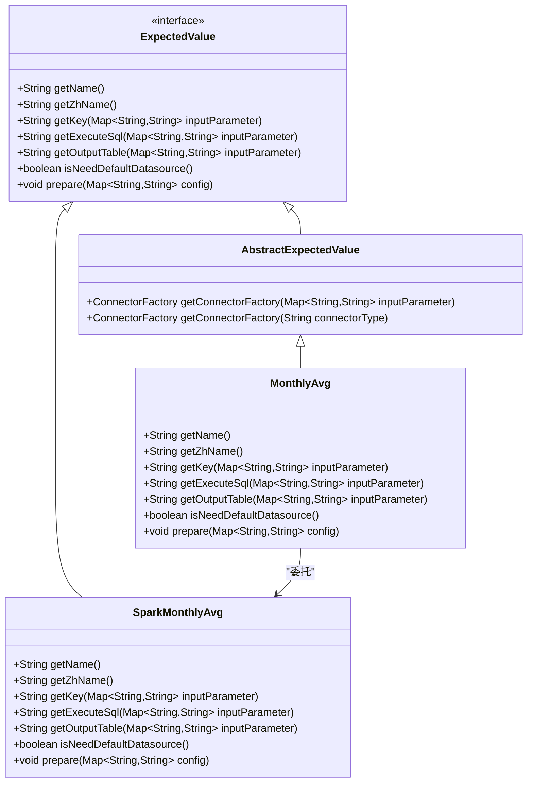
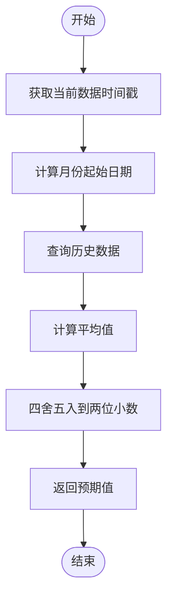
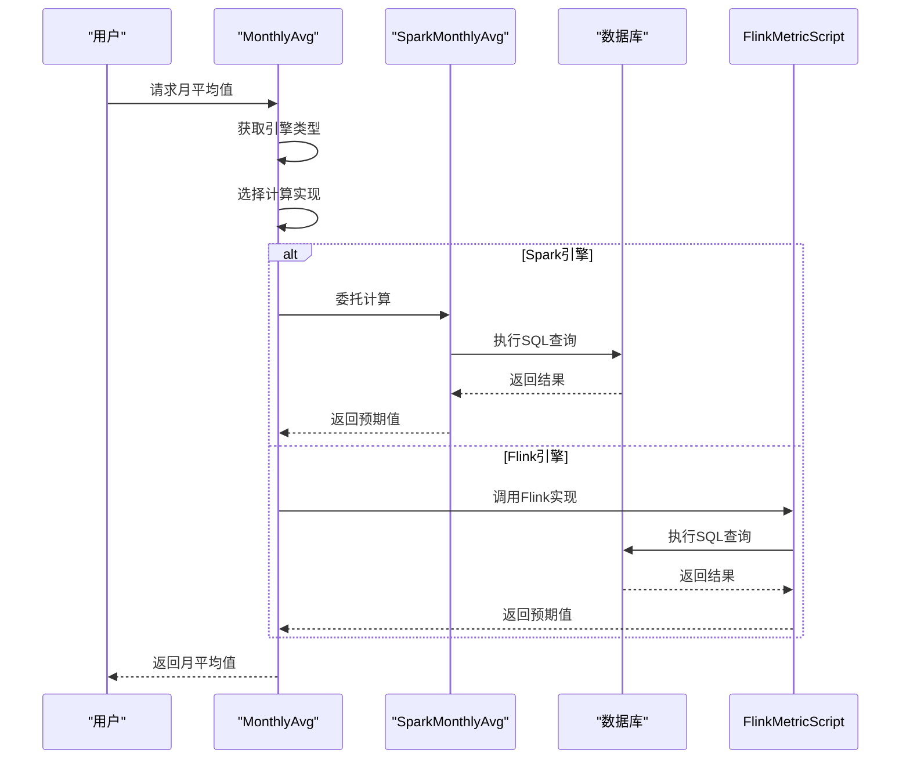
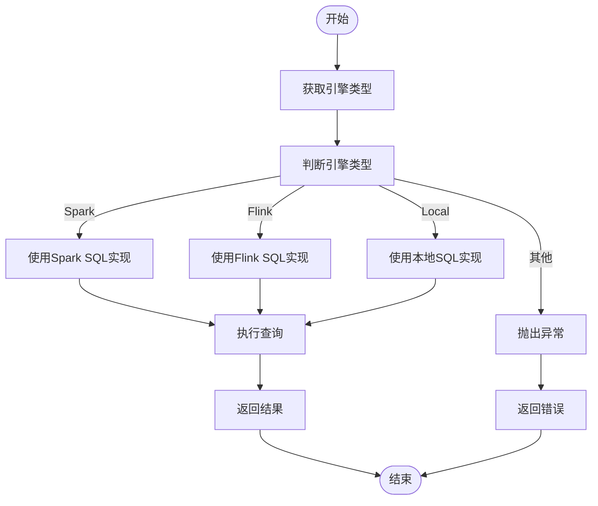
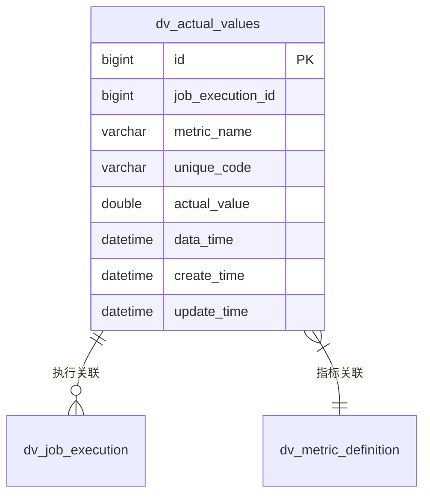
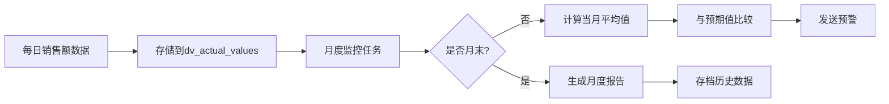

# 月平均值策略

<cite>
**本文档引用的文件**
- [MonthlyAvg.java](file://datavines-metric\datavines-metric-expected-plugins\datavines-metric-expected-monthly-avg\src\main\java\io\datavines\metric\expected\plugin\MonthlyAvg.java)
- [SparkMonthlyAvg.java](file://datavines-metric\datavines-metric-expected-plugins\datavines-metric-expected-monthly-avg\src\main\java\io\datavines\metric\expected\plugin\SparkMonthlyAvg.java)
- [AbstractExpectedValue.java](file://datavines-metric\datavines-metric-expected-plugins\datavines-metric-expected-base\src\main\java\io\datavines\metric\expected\plugin\AbstractExpectedValue.java)
- [ExpectedValue.java](file://datavines-metric\datavines-metric-api\src\main\java\io\datavines\metric\api\ExpectedValue.java)
- [ConfigConstants.java](file://datavines-common\src\main\java\io\datavines\common\ConfigConstants.java)
- [SparkMetricScript.java](file://datavines-connector\datavines-connector-plugins\datavines-connector-spark\src\main\java\io\datavines\connector\plugin\SparkMetricScript.java)
- [FlinkMetricScript.java](file://datavines-connector\datavines-connector-plugins\datavines-connector-flink\src\main\java\io\datavines\connector\plugin\FlinkMetricScript.java)
- [ActualValues.java](file://datavines-server\src\main\java\io\datavines\server\repository\entity\ActualValues.java)
- [datavines-mysql.sql](file://scripts\sql\datavines-mysql.sql)
</cite>

## 目录
1. [引言](#引言)
2. [核心组件分析](#核心组件分析)
3. [月平均值计算原理](#月平均值计算原理)
4. [时间窗口与边界处理](#时间窗口与边界处理)
5. [大规模数据聚合优化](#大规模数据聚合优化)
6. [配置示例与应用案例](#配置示例与应用案例)
7. [特殊日期影响分析](#特殊日期影响分析)
8. [结论](#结论)

## 引言

月平均值策略是数据质量监控系统中的重要组成部分，用于计算指定指标在一个月内的平均值。该策略通过分析历史数据，为当前数据提供预期值参考，广泛应用于财务指标监控、业务绩效评估等场景。本文档深入分析MonthlyAvg和SparkMonthlyAvg类的实现原理，详细说明月度时间窗口定义、月末边界处理和大规模数据聚合优化技术。

## 核心组件分析

月平均值策略的核心实现由MonthlyAvg和SparkMonthlyAvg两个类构成，它们共同实现了基于不同计算引擎的月均值计算功能。MonthlyAvg作为主入口类，负责根据配置选择合适的计算引擎，而SparkMonthlyAvg则专注于Spark引擎下的具体实现。



**图表来源**
- [ExpectedValue.java](file://datavines-metric\datavines-metric-api\src\main\java\io\datavines\metric\api\ExpectedValue.java)
- [AbstractExpectedValue.java](file://datavines-metric\datavines-metric-expected-plugins\datavines-metric-expected-base\src\main\java\io\datavines\metric\expected\plugin\AbstractExpectedValue.java)
- [MonthlyAvg.java](file://datavines-metric\datavines-metric-expected-plugins\datavines-metric-expected-monthly-avg\src\main\java\io\datavines\metric\expected\plugin\MonthlyAvg.java)
- [SparkMonthlyAvg.java](file://datavines-metric\datavines-metric-expected-plugins\datavines-metric-expected-monthly-avg\src\main\java\io\datavines\metric\expected\plugin\SparkMonthlyAvg.java)

**本节来源**
- [MonthlyAvg.java](file://datavines-metric\datavines-metric-expected-plugins\datavines-metric-expected-monthly-avg\src\main\java\io\datavines\metric\expected\plugin\MonthlyAvg.java#L24-L74)
- [SparkMonthlyAvg.java](file://datavines-metric\datavines-metric-expected-plugins\datavines-metric-expected-monthly-avg\src\main\java\io\datavines\metric\expected\plugin\SparkMonthlyAvg.java#L25-L66)

## 月平均值计算原理

月平均值策略的计算原理基于对历史数据的聚合分析。系统通过查询`dv_actual_values`表中指定时间范围内的实际值，计算其算术平均数作为预期值。计算过程遵循以下步骤：

1. 确定当前数据的时间戳（data_time）
2. 计算该时间戳所在月份的第一天
3. 查询从该月第一天到当前时间点的所有历史数据
4. 对查询到的实际值进行平均值计算
5. 将结果四舍五入到两位小数



**图表来源**
- [SparkMonthlyAvg.java](file://datavines-metric\datavines-metric-expected-plugins\datavines-metric-expected-monthly-avg\src\main\java\io\datavines\metric\expected\plugin\SparkMonthlyAvg.java#L44-L48)
- [SparkMetricScript.java](file://datavines-connector\datavines-connector-plugins\datavines-connector-spark\src\main\java\io\datavines\connector\plugin\SparkMetricScript.java#L60-L64)

**本节来源**
- [SparkMonthlyAvg.java](file://datavines-metric\datavines-metric-expected-plugins\datavines-metric-expected-monthly-avg\src\main\java\io\datavines\metric\expected\plugin\SparkMonthlyAvg.java#L44-L48)
- [MonthlyAvg.java](file://datavines-metric\datavines-metric-expected-plugins\datavines-metric-expected-monthly-avg\src\main\java\io\datavines\metric\expected\plugin\MonthlyAvg.java#L43-L56)

## 时间窗口与边界处理

月平均值策略的时间窗口定义和边界处理是确保计算准确性的关键。系统采用不同的SQL语法来处理不同计算引擎的时间窗口，确保在各种环境下都能正确计算月度平均值。

### Spark引擎时间窗口

在Spark引擎下，时间窗口的定义使用Hive SQL的日期函数：
- 起始时间：`date_format(${data_time}, 'yyyy-MM-01')`，将日期格式化为当月第一天
- 结束时间：`date_add(date_format(${data_time}, 'yyyy-MM-dd'),1)`，将当前日期加一天

这种处理方式确保了时间窗口包含整个当月的所有数据，从当月第一天开始，到下月第一天结束。

### Flink引擎时间窗口

在Flink引擎下，时间窗口的定义使用参数化的方式：
- 起始时间：`${month_start_day} 00:00:00`，使用预计算的月份开始日期
- 结束时间：`${month_end_day} 23:59:59`，使用预计算的月份结束日期



**图表来源**
- [SparkMonthlyAvg.java](file://datavines-metric\datavines-metric-expected-plugins\datavines-metric-expected-monthly-avg\src\main\java\io\datavines\metric\expected\plugin\SparkMonthlyAvg.java#L44-L48)
- [FlinkMetricScript.java](file://datavines-connector\datavines-connector-plugins\datavines-connector-flink\src\main\java\io\datavines\connector\plugin\FlinkMetricScript.java#L62-L65)
- [MonthlyAvg.java](file://datavines-metric\datavines-metric-expected-plugins\datavines-metric-expected-monthly-avg\src\main\java\io\datavines\metric\expected\plugin\MonthlyAvg.java#L43-L56)

**本节来源**
- [SparkMonthlyAvg.java](file://datavines-metric\datavines-metric-expected-plugins\datavines-metric-expected-monthly-avg\src\main\java\io\datavines\metric\expected\plugin\SparkMonthlyAvg.java#L44-L48)
- [FlinkMetricScript.java](file://datavines-connector\datavines-connector-plugins\datavines-connector-flink\src\main\java\io\datavines\connector\plugin\FlinkMetricScript.java#L62-L65)

## 大规模数据聚合优化

为应对大规模数据聚合的性能挑战，月平均值策略采用了多项优化技术，确保在海量数据环境下仍能高效计算。

### 引擎适配优化

系统通过MonthlyAvg类的`getExecuteSql`方法实现了引擎适配机制。该方法根据配置的引擎类型（spark、flink、local）动态选择最优的SQL实现：



### 数据表结构优化

实际值存储表`dv_actual_values`经过专门设计，以支持高效的聚合查询：



表结构特点：
- `data_time`字段用于时间范围查询，支持高效的索引扫描
- `unique_code`字段用于区分不同指标实例，支持多指标并行计算
- `actual_value`字段存储双精度浮点数，保证计算精度

**图表来源**
- [MonthlyAvg.java](file://datavines-metric\datavines-metric-expected-plugins\datavines-metric-expected-monthly-avg\src\main\java\io\datavines\metric\expected\plugin\MonthlyAvg.java#L43-L56)
- [datavines-mysql.sql](file://scripts\sql\datavines-mysql.sql#L166-L168)
- [ActualValues.java](file://datavines-server\src\main\java\io\datavines\server\repository\entity\ActualValues.java#L31)

**本节来源**
- [MonthlyAvg.java](file://datavines-metric\datavines-metric-expected-plugins\datavines-metric-expected-monthly-avg\src\main\java\io\datavines\metric\expected\plugin\MonthlyAvg.java#L43-L56)
- [SparkMetricScript.java](file://datavines-connector\datavines-connector-plugins\datavines-connector-spark\src\main\java\io\datavines\connector\plugin\SparkMetricScript.java#L60-L64)

## 配置示例与应用案例

### 配置示例

```json
{
  "engine_type": "spark",
  "src_connector_type": "jdbc",
  "metric_unique_key": "monthly_sales_avg",
  "data_time": "2024-03-15 10:30:00",
  "unique_code": "sales_metric_001"
}
```

### 财务指标监控应用案例

在月度销售额分析场景中，系统使用月平均值策略来监控销售业绩：



系统每天收集销售额数据，当月内持续计算平均值作为预期值。到月末时，系统生成完整的月度报告，与历史月平均值进行对比分析，帮助管理层了解销售趋势。

**本节来源**
- [ConfigConstants.java](file://datavines-common\src\main\java\io\datavines\common\ConfigConstants.java)
- [MonthlyAvg.java](file://datavines-metric\datavines-metric-expected-plugins\datavines-metric-expected-monthly-avg\src\main\java\io\datavines\metric\expected\plugin\MonthlyAvg.java)
- [ActualValues.java](file://datavines-server\src\main\java\io\datavines\server\repository\entity\ActualValues.java)

## 特殊日期影响分析

### 闰月处理

在农历闰月的情况下，系统仍然按照公历月份进行计算。由于月平均值策略基于公历日期，闰月不会对计算结果产生特殊影响。系统会将闰月视为一个完整的月份，包含其所有天数。

### 月末天数变化

不同月份的天数变化（28、29、30、31天）已被策略正确处理：
- 2月（28或29天）：系统自动识别闰年，正确计算2月的平均值
- 30天月份：正常计算30天的平均值
- 31天月份：正常计算31天的平均值

这种处理方式确保了不同长度月份的平均值具有可比性，不会因为月份长度差异而产生偏差。

### 跨月计算边界

系统在处理跨月计算时，严格遵循左闭右开区间原则：
- 起始时间包含：`>= date_format(${data_time}, 'yyyy-MM-01')`
- 结束时间不包含：`< date_add(date_format(${data_time}, 'yyyy-MM-dd'),1)`

这种边界处理方式避免了数据重复计算，确保了统计结果的准确性。

**本节来源**
- [SparkMonthlyAvg.java](file://datavines-metric\datavines-metric-expected-plugins\datavines-metric-expected-monthly-avg\src\main\java\io\datavines\metric\expected\plugin\SparkMonthlyAvg.java#L47-L48)
- [FlinkMetricScript.java](file://datavines-connector\datavines-connector-plugins\datavines-connector-flink\src\main\java\io\datavines\connector\plugin\FlinkMetricScript.java#L64-L65)

## 结论

月平均值策略通过MonthlyAvg和SparkMonthlyAvg类的协同工作，实现了高效、准确的月度平均值计算。该策略具有以下特点：

1. **引擎无关性**：通过抽象层设计，支持Spark、Flink等多种计算引擎
2. **时间准确性**：精确处理月度时间窗口和边界条件
3. **性能优化**：针对大规模数据进行了查询优化
4. **灵活性**：支持多种配置参数，适应不同应用场景

在财务指标监控等实际应用中，该策略能够提供可靠的预期值参考，帮助用户及时发现数据异常，确保业务决策的准确性。未来可进一步优化方向包括支持更多时间粒度（如季度、年度平均值）和引入加权平均等更复杂的计算方法。