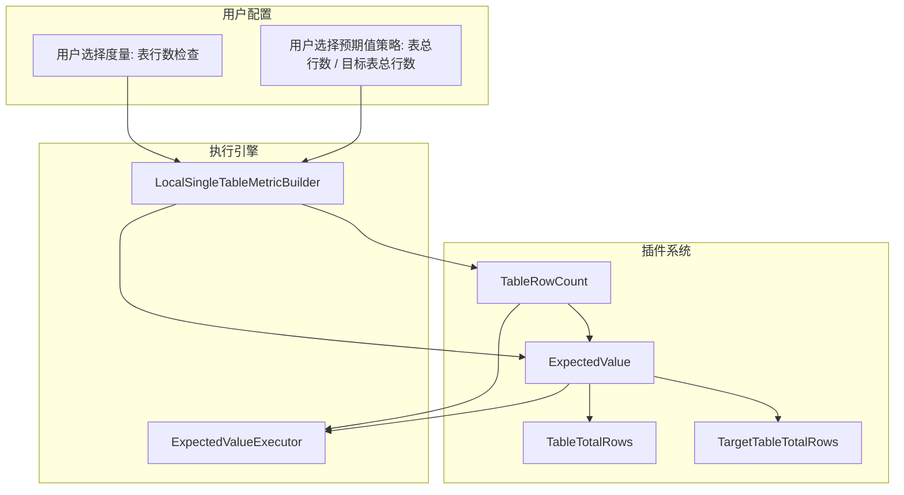
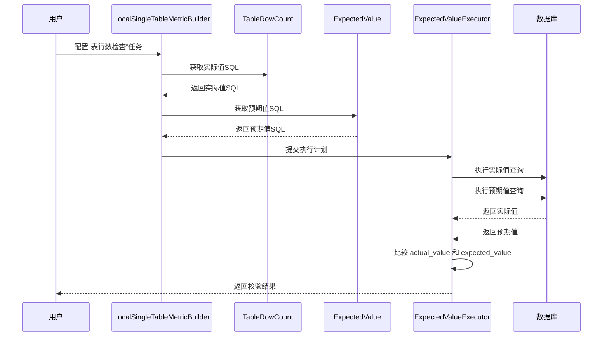
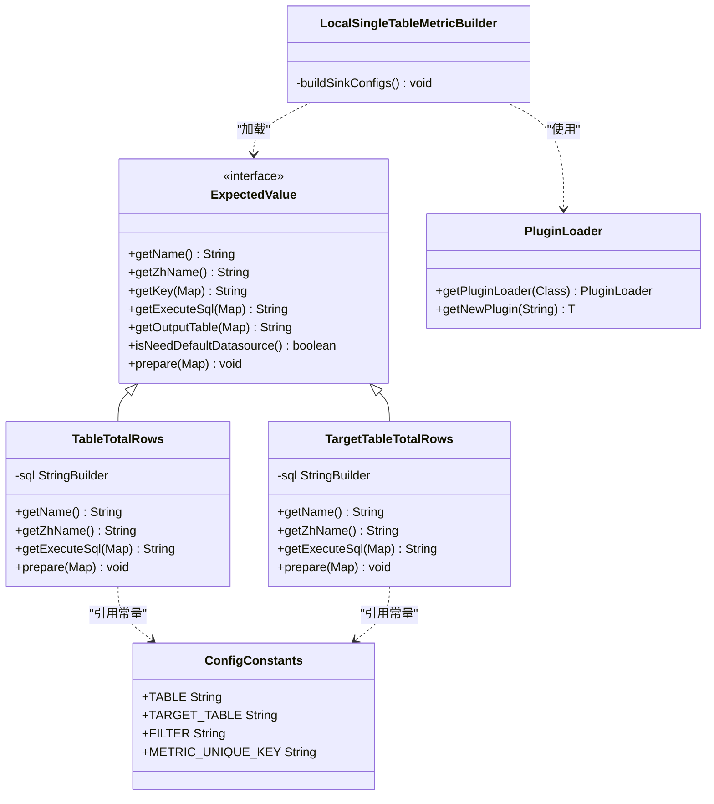

# 特殊策略

<cite>
**本文档引用的文件**   
- [TableTotalRows.java](file://datavines-metric-expected-plugins/datavines-metric-expected-table-rows/src/main/java/io/datavines/metric/expected/plugin/TableTotalRows.java)
- [TargetTableTotalRows.java](file://datavines-metric-expected-plugins/datavines-metric-expected-target-table-rows/src/main/java/io/datavines/metric/expected/plugin/TargetTableTotalRows.java)
- [ExpectedValue.java](file://datavines-metric-api/src/main/java/io/datavines/metric/api/ExpectedValue.java)
- [TableRowCount.java](file://datavines-metric-plugins/datavines-metric-table-row-count/src/main/java/io/datavines/metric/plugin/TableRowCount.java)
- [ConfigConstants.java](file://datavines-common/src/main/java/io/datavines/common/ConfigConstants.java)
- [LocalSingleTableMetricBuilder.java](file://datavines-engine-plugins/datavines-engine-local/datavines-engine-local-config/src/main/java/io/datavines/engine/local/config/LocalSingleTableMetricBuilder.java)
</cite>

## 目录
1. [引言](#引言)
2. [核心组件](#核心组件)
3. [架构概述](#架构概述)
4. [详细组件分析](#详细组件分析)
5. [依赖分析](#依赖分析)
6. [性能考量](#性能考量)
7. [故障排除指南](#故障排除指南)
8. [结论](#结论)

## 引言
本文档详细阐述了数据质量监控系统中两种特殊预期值策略的实现原理：**表总行数**（TableTotalRows）和**目标表总行数**（TargetTableTotalRows）。这两种策略专门用于数据量一致性校验，通过获取源表或目标表的总行数作为预期值，与实际值进行对比，从而验证数据迁移、ETL流程等场景下的数据完整性。文档将深入分析其技术实现、配置方法、适用场景及在大规模数据集下的优化方案。

## 核心组件
本系统的核心在于其可扩展的插件化架构，其中 `TableTotalRows` 和 `TargetTableTotalRows` 是 `ExpectedValue` 接口的具体实现。它们负责生成用于查询预期行数的SQL语句。`TableRowCount` 作为具体的度量指标（Metric），定义了如何计算实际行数。整个流程由配置构建器（如 `LocalSingleTableMetricBuilder`）协调，将预期值和实际值的计算结果整合到最终的执行计划中。

**核心组件**
- [TableTotalRows.java](file://datavines-metric-expected-plugins/datavines-metric-expected-table-rows/src/main/java/io/datavines/metric/expected/plugin/TableTotalRows.java#L26-L75)
- [TargetTableTotalRows.java](file://datavines-metric-expected-plugins/datavines-metric-expected-target-table-rows/src/main/java/io/datavines/metric/expected/plugin/TargetTableTotalRows.java#L26-L75)
- [TableRowCount.java](file://datavines-metric-plugins/datavines-metric-table-row-count/src/main/java/io/datavines/metric/plugin/TableRowCount.java#L32-L127)

## 架构概述
系统采用分层架构，上层是用户配置的度量任务，底层是通过SPI（Service Provider Interface）机制加载的各类插件。当用户选择“表行数检查”这一度量类型时，系统会根据配置的预期值策略（如“表总行数”）动态加载对应的 `ExpectedValue` 插件，并与 `TableRowCount` 度量插件协同工作，最终生成一个包含实际值和预期值查询的完整执行流程。

**图表来源**
- [TableRowCount.java](file://datavines-metric-plugins/datavines-metric-table-row-count/src/main/java/io/datavines/metric/plugin/TableRowCount.java)
- [TableTotalRows.java](file://datavines-metric-expected-plugins/datavines-metric-expected-table-rows/src/main/java/io/datavines/metric/expected/plugin/TableTotalRows.java)
- [TargetTableTotalRows.java](file://datavines-metric-expected-plugins/datavines-metric-expected-target-table-rows/src/main/java/io/datavines/metric/expected/plugin/TargetTableTotalRows.java)
- [LocalSingleTableMetricBuilder.java](file://datavines-engine-plugins/datavines-engine-local/datavines-engine-local-config/src/main/java/io/datavines/engine/local/config/LocalSingleTableMetricBuilder.java)

## 详细组件分析

### TableTotalRows 和 TargetTableTotalRows 策略分析
`TableTotalRows` 和 `TargetTableTotalRows` 是实现数据量一致性校验的核心策略。它们都实现了 `ExpectedValue` 接口，但查询的数据源不同。

#### 实现原理与独特作用
这两个策略的核心作用是为数据质量校验提供一个动态的、基于数据库查询的预期值，而非一个静态的固定值。这在数据迁移、增量同步等场景中至关重要，因为预期的数据量是动态变化的。

- **TableTotalRows (表总行数)**: 此策略通过执行 `SELECT COUNT(1) FROM ${table}` 来获取**源表**的当前总行数作为预期值。它适用于验证单个表的数据完整性，例如，确保ETL流程处理了源表中的所有记录。
- **TargetTableTotalRows (目标表总行数)**: 此策略通过执行 `SELECT COUNT(1) FROM ${table2}` 来获取**目标表**的当前总行数作为预期值。它主要用于数据迁移或同步场景，用于验证目标端的数据量是否与源端一致，从而判断同步是否成功。

这种设计的**独特作用**在于，它将预期值的确定从“预设的静态值”转变为“实时查询的动态值”，极大地提高了校验的灵活性和准确性。

#### 预期值获取与验证逻辑
1.  **预期值获取**: 策略通过 `getExecuteSql` 方法生成一个SQL查询语句。该语句的核心是 `COUNT(1)` 聚合函数，用于计算指定表的行数。`${table}` 或 `${table2}` 是占位符，会在运行时被实际的表名替换。
2.  **实际值获取**: 与此同时，`TableRowCount` 度量插件会生成一个类似的SQL语句（`SELECT COUNT(1) FROM ${table}`）来计算实际参与校验的数据行数。
3.  **验证逻辑**: 执行引擎会分别执行这两个SQL，得到两个结果：`actual_value` 和 `expected_value`。系统会根据配置的比较算子（如等于、大于等于等）和阈值，判断 `actual_value` 是否与 `expected_value` 一致。如果一致，则校验通过；否则，校验失败。

**图表来源**
- [TableTotalRows.java](file://datavines-metric-expected-plugins/datavines-metric-expected-table-rows/src/main/java/io/datavines/metric/expected/plugin/TableTotalRows.java#L28-L52)
- [TargetTableTotalRows.java](file://datavines-metric-expected-plugins/datavines-metric-expected-target-table-rows/src/main/java/io/datavines/metric/expected/plugin/TargetTableTotalRows.java#L28-L52)
- [TableRowCount.java](file://datavines-metric-plugins/datavines-metric-table-row-count/src/main/java/io/datavines/metric/plugin/TableRowCount.java#L80-L92)
- [ExpectedValueExecutor.java](file://datavines-engine-plugins/datavines-engine-local/datavines-engine-local-transform/src/main/java/io/datavines/engine/local/transform/sql/ExpectedValueExecutor.java#L33-L47)

### 配置方法、性能考量与适用场景
#### 配置方法
配置主要通过JSON或UI界面完成，关键参数包括：
- `metric_type`: 设置为 `table_row_count`，指定使用行数检查度量。
- `expected_type`: 设置为 `table_total_rows` 或 `target_table_total_rows`，以选择预期值策略。
- `table`: 指定源表名称。
- `target_table`: （仅当使用 `target_table_total_rows` 时）指定目标表名称。
- `filter`: 可选，为查询添加WHERE条件，例如 `status = 'active'`。

这些参数通过 `ConfigConstants` 中定义的常量（如 `TABLE`, `TARGET_TABLE`, `FILTER`）在代码中进行引用和处理。

**核心组件**
- [ConfigConstants.java](file://datavines-common/src/main/java/io/datavines/common/ConfigConstants.java#L24-L36)
- [LocalSingleTableMetricBuilder.java](file://datavines-engine-plugins/datavines-engine-local/datavines-engine-local-config/src/main/java/io/datavines/engine/local/config/LocalSingleTableMetricBuilder.java#L48-L55)

#### 性能考量
- **全表扫描**: `COUNT(1)` 操作在没有合适索引的情况下会导致全表扫描，对于超大规模表，查询可能非常耗时。
- **执行频率**: 如果校验任务频繁执行，对数据库的性能会产生持续压力。
- **优化建议**: 确保被计数的表有高效的索引（如主键索引），或者在非高峰时段执行此类校验任务。

#### 适用场景
- **数据迁移验证**: 在将数据从旧系统迁移到新系统后，使用 `TargetTableTotalRows` 策略，确保新旧两个表的行数一致。
- **ETL流程完整性检查**: 在ETL流程结束后，使用 `TableTotalRows` 策略，验证抽取、转换、加载的总记录数是否与源数据一致。
- **数据同步监控**: 监控两个数据库之间的同步状态，确保没有数据丢失。

#### 大规模数据集优化方案
对于超大规模数据集，直接使用 `COUNT(1)` 可能不切实际。优化方案包括：
1.  **元数据查询**: 某些数据库（如Hive）的元数据存储（如Metastore）中会缓存表的行数统计信息。可以开发一个 `ExpectedValue` 插件，直接从元数据中读取行数，避免全表扫描。
2.  **采样估算**: 对于不要求绝对精确的场景，可以通过对表进行采样（如 `TABLESAMPLE`）来估算总行数。
3.  **增量计算**: 维护一个单独的计数器表，每次数据变更时更新计数，校验时直接查询该计数器。

## 依赖分析
系统通过SPI机制实现高度解耦。`ExpectedValue` 接口是核心契约，`TableTotalRows` 和 `TargetTableTotalRows` 依赖于 `ConfigConstants` 来获取配置项的键名。`LocalSingleTableMetricBuilder` 作为协调者，依赖于 `PluginLoader` 来动态加载 `ExpectedValue` 和 `SqlMetric` 插件，从而将它们组合成一个完整的任务。

**图表来源**
- [ExpectedValue.java](file://datavines-metric-api/src/main/java/io/datavines/metric/api/ExpectedValue.java)
- [TableTotalRows.java](file://datavines-metric-expected-plugins/datavines-metric-expected-table-rows/src/main/java/io/datavines/metric/expected/plugin/TableTotalRows.java)
- [TargetTableTotalRows.java](file://datavines-metric-expected-plugins/datavines-metric-expected-target-table-rows/src/main/java/io/datavines/metric/expected/plugin/TargetTableTotalRows.java)
- [ConfigConstants.java](file://datavines-common/src/main/java/io/datavines/common/ConfigConstants.java)
- [LocalSingleTableMetricBuilder.java](file://datavines-engine-plugins/datavines-engine-local/datavines-engine-local-config/src/main/java/io/datavines/engine/local/config/LocalSingleTableMetricBuilder.java)

## 性能考量
如前所述，`TableTotalRows` 和 `TargetTableTotalRows` 策略的主要性能瓶颈在于 `COUNT(1)` 操作。在大规模数据集上，这可能导致校验任务执行时间过长，影响整体数据处理流程的效率。因此，在生产环境中使用这些策略时，必须评估其对数据库性能的影响，并考虑采用元数据查询等优化方案。

## 故障排除指南
- **校验失败**: 首先检查 `actual_value` 和 `expected_value` 的具体数值。如果两者不一致，检查源表和目标表的数据是否确实存在差异，或检查 `filter` 条件是否正确。
- **执行超时**: 如果校验任务超时，很可能是由于表过大导致 `COUNT(1)` 查询耗时过长。应考虑优化查询或调整任务超时时间。
- **SQL语法错误**: 检查配置的表名、列名是否正确，以及 `filter` 条件的SQL语法是否符合目标数据库的要求。

**故障排除指南**
- [TableTotalRows.java](file://datavines-metric-expected-plugins/datavines-metric-expected-table-rows/src/main/java/io/datavines/metric/expected/plugin/TableTotalRows.java#L66-L74)
- [TargetTableTotalRows.java](file://datavines-metric-expected-plugins/datavines-metric-expected-target-table-rows/src/main/java/io/datavines/metric/expected/plugin/TargetTableTotalRows.java#L66-L74)

## 结论
`TableTotalRows` 和 `TargetTableTotalRows` 策略为数据质量监控提供了强大的数据量一致性校验能力。通过将预期值动态化，它们能够有效应用于数据迁移、ETL和数据同步等关键场景。尽管在大规模数据集上存在性能挑战，但其清晰的插件化设计为实现更高效的优化方案（如元数据查询）提供了良好的基础。合理配置和使用这些策略，可以显著提升数据管道的可靠性和可信度。