# 预期值计算系统

<cite>
**本文档引用的文件**   
- [ExpectedValue.java](file://datavines-metric\datavines-metric-api\src\main\java\io\datavines\metric\api\ExpectedValue.java)
- [FixValue.java](file://datavines-metric\datavines-metric-expected-plugins\datavines-metric-expected-fix\src\main\java\io\datavines\metric\expected\plugin\FixValue.java)
- [DailyAvg.java](file://datavines-metric\datavines-metric-expected-plugins\datavines-metric-expected-daily-avg\src\main\java\io\datavines\metric\expected\plugin\DailyAvg.java)
- [Last7DayAvg.java](file://datavines-metric\datavines-metric-expected-plugins\datavines-metric-expected-last7day-avg\src\main\java\io\datavines\metric\expected\plugin\Last7DayAvg.java)
- [Last30DayAvg.java](file://datavines-metric\datavines-metric-expected-plugins\datavines-metric-expected-last30day-avg\src\main\java\io\datavines\metric\expected\plugin\Last30DayAvg.java)
- [MonthlyAvg.java](file://datavines-metric\datavines-metric-expected-plugins\datavines-metric-expected-monthly-avg\src\main\java\io\datavines\metric\expected\plugin\MonthlyAvg.java)
- [WeeklyAvg.java](file://datavines-metric\datavines-metric-expected-plugins\datavines-metric-expected-weekly-avg\src\main\java\io\datavines\metric\expected\plugin\WeeklyAvg.java)
- [TableTotalRows.java](file://datavines-metric\datavines-metric-expected-plugins\datavines-metric-expected-table-rows\src\main\java\io\datavines\metric\expected\plugin\TableTotalRows.java)
- [TargetTableTotalRows.java](file://datavines-metric\datavines-metric-expected-plugins\datavines-metric-expected-target-table-rows\src\main\java\io\datavines\metric\expected\plugin\TargetTableTotalRows.java)
- [None.java](file://datavines-metric\datavines-metric-expected-plugins\datavines-metric-expected-none\src\main\java\io\datavines\metric\expected\plugin\None.java)
- [AbstractExpectedValue.java](file://datavines-metric\datavines-metric-expected-plugins\datavines-metric-expected-base\src\main\java\io\datavines\metric\expected\plugin\AbstractExpectedValue.java)
- [SPI.java](file://datavines-spi\src\main\java\io\datavines\spi\SPI.java)
- [PluginLoader.java](file://datavines-spi\src\main\java\io\datavines\spi\PluginLoader.java)
- [BaseJobConfigurationBuilder.java](file://datavines-engine\datavines-engine-config\src\main\java\io\datavines\engine\config\BaseJobConfigurationBuilder.java)
</cite>

## 目录
1. [引言](#引言)
2. [预期值在数据质量验证中的核心作用](#预期值在数据质量验证中的核心作用)
3. [预期值计算策略](#预期值计算策略)
4. [预期值插件的SPI机制和注册方式](#预期值插件的spi机制和注册方式)
5. [特殊策略的实现原理](#特殊策略的实现原理)
6. [配置最佳实践和性能调优建议](#配置最佳实践和性能调优建议)
7. [复杂案例分析](#复杂案例分析)
8. [结论](#结论)

## 引言

预期值计算系统是数据质量验证框架中的核心组件，负责为数据质量指标提供基准参考值。该系统通过多种计算策略，为数据质量检查提供可靠的预期基准，从而判断数据质量是否达标。本系统采用插件化架构，支持多种计算策略，并通过SPI机制实现灵活的扩展和注册。

**本节不分析具体源文件，因此不提供来源**

## 预期值在数据质量验证中的核心作用

预期值在数据质量验证中扮演着基准参照物的角色。通过将实际值与预期值进行比较，系统能够判断数据质量是否符合预期标准。预期值的准确性直接影响数据质量评估的可靠性。系统支持多种预期值计算策略，以适应不同的业务场景和数据特征。

**本节不分析具体源文件，因此不提供来源**

## 预期值计算策略

### 固定值策略 (FixValue)

固定值策略是最简单的预期值计算方式，适用于预期值已知且不变的场景。该策略不进行任何计算，直接使用预设的固定值作为预期值。

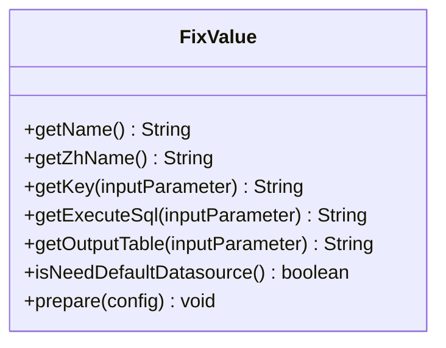

**图示来源**
- [FixValue.java](file://datavines-metric\datavines-metric-expected-plugins\datavines-metric-expected-fix\src\main\java\io\datavines\metric\expected\plugin\FixValue.java#L25-L62)

**本节来源**
- [FixValue.java](file://datavines-metric\datavines-metric-expected-plugins\datavines-metric-expected-fix\src\main\java\io\datavines\metric\expected\plugin\FixValue.java#L25-L62)

### 日均值策略 (DailyAvg)

日均值策略计算指定时间段内实际值的平均值作为预期值。该策略适用于数据波动较小、需要基于历史数据进行趋势分析的场景。

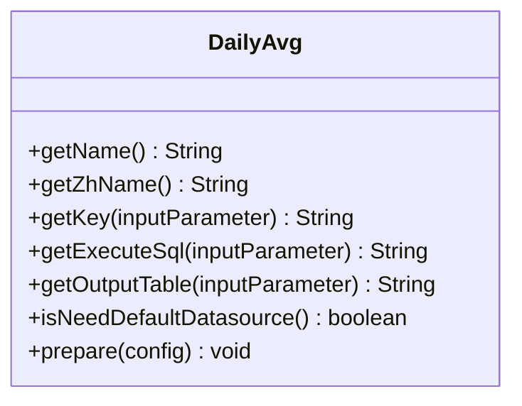

**图示来源**
- [DailyAvg.java](file://datavines-metric\datavines-metric-expected-plugins\datavines-metric-expected-daily-avg\src\main\java\io\datavines\metric\expected\plugin\DailyAvg.java#L25-L39)

**本节来源**
- [DailyAvg.java](file://datavines-metric\datavines-metric-expected-plugins\datavines-metric-expected-daily-avg\src\main\java\io\datavines\metric\expected\plugin\DailyAvg.java#L25-L39)

### 最近7天均值策略 (Last7DayAvg)

最近7天均值策略计算最近7天内实际值的平均值作为预期值。该策略适用于需要考虑短期趋势的场景。

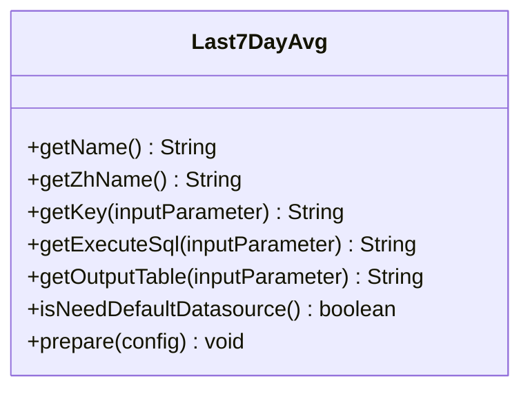

**图示来源**
- [Last7DayAvg.java](file://datavines-metric\datavines-metric-expected-plugins\datavines-metric-expected-last7day-avg\src\main\java\io\datavines\metric\expected\plugin\Last7DayAvg.java#L24-L38)

**本节来源**
- [Last7DayAvg.java](file://datavines-metric\datavines-metric-expected-plugins\datavines-metric-expected-last7day-avg\src\main\java\io\datavines\metric\expected\plugin\Last7DayAvg.java#L24-L38)

### 最近30天均值策略 (Last30DayAvg)

最近30天均值策略计算最近30天内实际值的平均值作为预期值。该策略适用于需要考虑中长期趋势的场景。

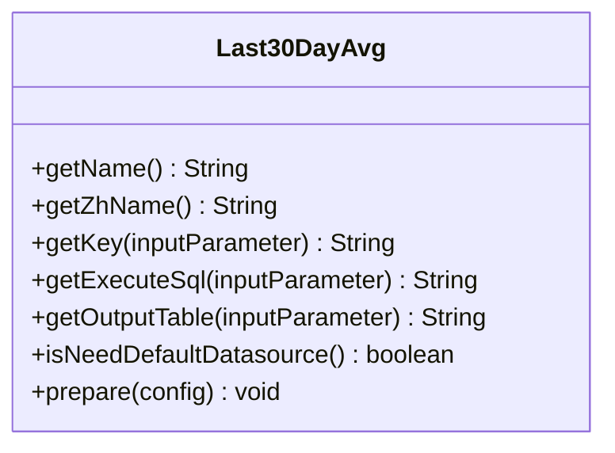

**图示来源**
- [Last30DayAvg.java](file://datavines-metric\datavines-metric-expected-plugins\datavines-metric-expected-last30day-avg\src\main\java\io\datavines\metric\expected\plugin\Last30DayAvg.java#L24-L38)

**本节来源**
- [Last30DayAvg.java](file://datavines-metric\datavines-metric-expected-plugins\datavines-metric-expected-last30day-avg\src\main\java\io\datavines\metric\expected\plugin\Last30DayAvg.java#L24-L38)

### 月均值策略 (MonthlyAvg)

月均值策略计算当月内实际值的平均值作为预期值。该策略适用于需要按月度周期进行数据质量评估的场景。

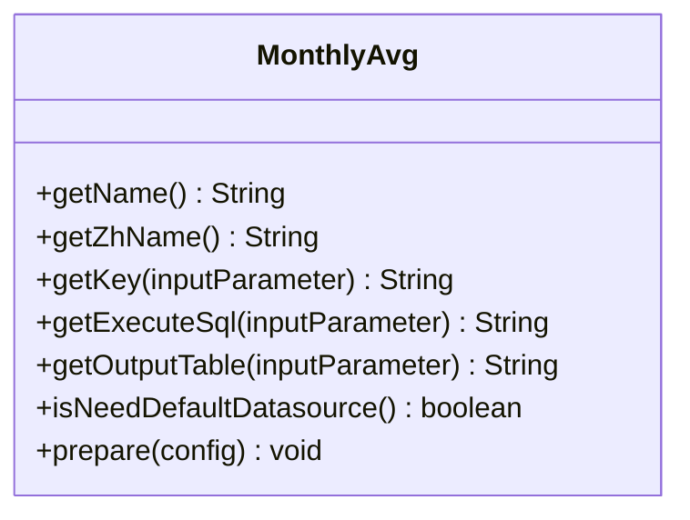

**图示来源**
- [MonthlyAvg.java](file://datavines-metric\datavines-metric-expected-plugins\datavines-metric-expected-monthly-avg\src\main\java\io\datavines\metric\expected\plugin\MonthlyAvg.java#L24-L38)

**本节来源**
- [MonthlyAvg.java](file://datavines-metric\datavines-metric-expected-plugins\datavines-metric-expected-monthly-avg\src\main\java\io\datavines\metric\expected\plugin\MonthlyAvg.java#L24-L38)

### 周均值策略 (WeeklyAvg)

周均值策略计算当周内实际值的平均值作为预期值。该策略适用于需要按周度周期进行数据质量评估的场景。

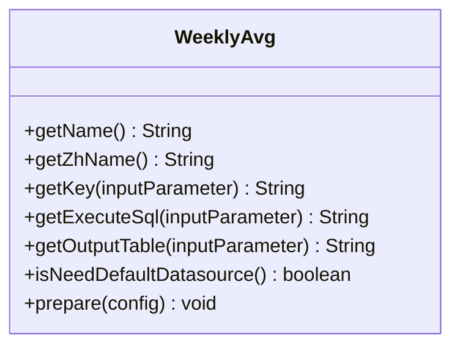

**图示来源**
- [WeeklyAvg.java](file://datavines-metric\datavines-metric-expected-plugins\datavines-metric-expected-weekly-avg\src\main\java\io\datavines\metric\expected\plugin\WeeklyAvg.java#L25-L38)

**本节来源**
- [WeeklyAvg.java](file://datavines-metric\datavines-metric-expected-plugins\datavines-metric-expected-weekly-avg\src\main\java\io\datavines\metric\expected\plugin\WeeklyAvg.java#L25-L38)

## 预期值插件的SPI机制和注册方式

### SPI机制

预期值插件系统采用SPI（Service Provider Interface）机制实现插件化架构。通过`@SPI`注解标记接口，系统在运行时动态加载实现类。

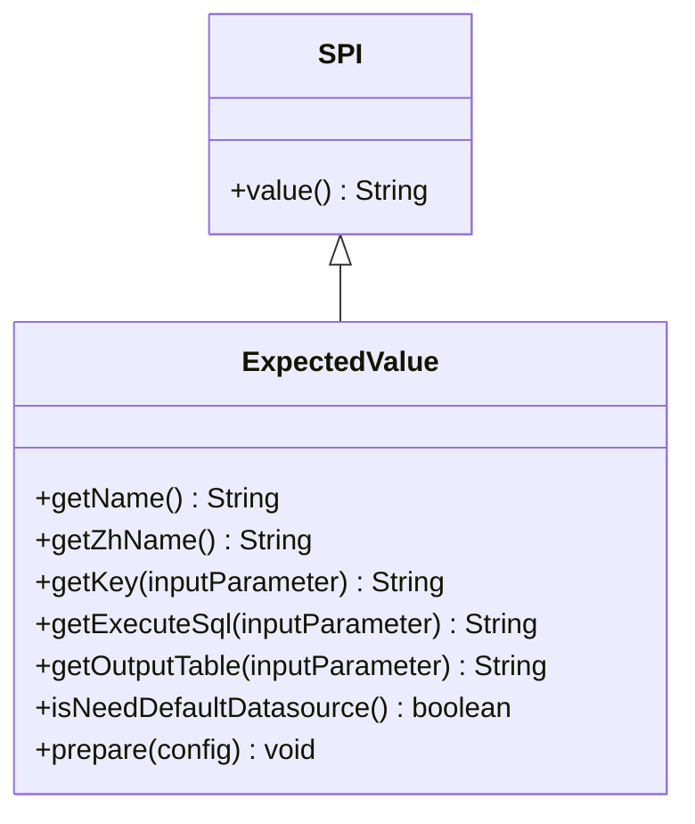

**图示来源**
- [SPI.java](file://datavines-spi\src\main\java\io\datavines\spi\SPI.java#L1-L32)
- [ExpectedValue.java](file://datavines-metric\datavines-metric-api\src\main\java\io\datavines\metric\api\ExpectedValue.java#L23-L65)

### 插件注册方式

系统通过`PluginLoader`类实现插件的加载和注册。插件实现类通过配置文件声明，系统在启动时自动加载。

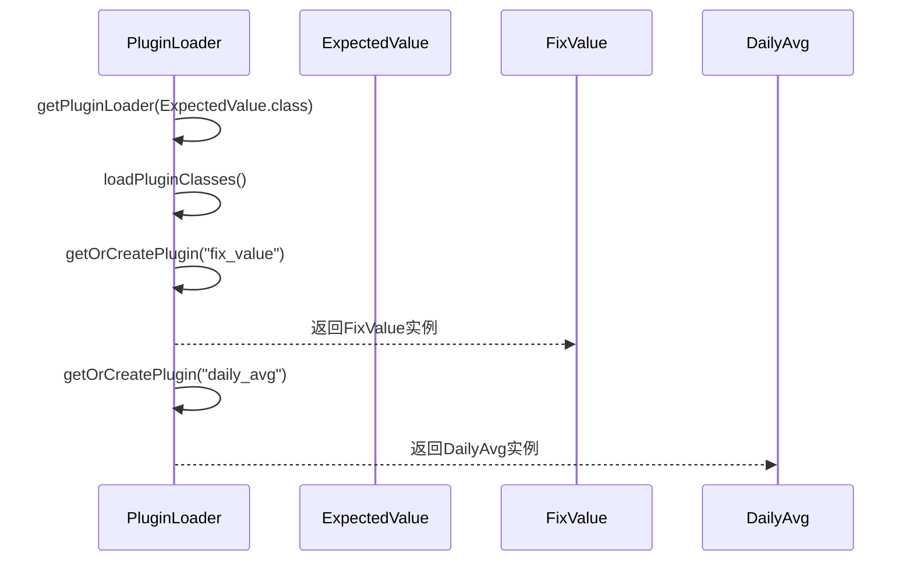

**图示来源**
- [PluginLoader.java](file://datavines-spi\src\main\java\io\datavines\spi\PluginLoader.java#L84-L200)

**本节来源**
- [PluginLoader.java](file://datavines-spi\src\main\java\io\datavines\spi\PluginLoader.java#L84-L200)

## 特殊策略的实现原理

### 表总行数策略 (TableTotalRows)

表总行数策略通过执行SQL查询计算指定表的总行数作为预期值。该策略支持通过filter参数添加过滤条件。

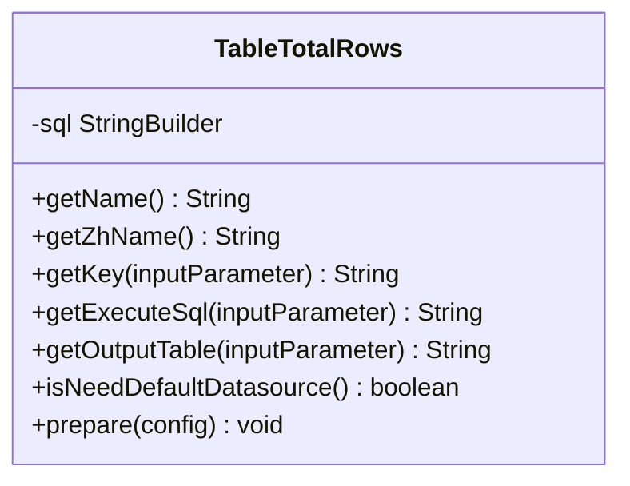

**图示来源**
- [TableTotalRows.java](file://datavines-metric\datavines-metric-expected-plugins\datavines-metric-expected-table-rows\src\main\java\io\datavines\metric\expected\plugin\TableTotalRows.java#L26-L75)

**本节来源**
- [TableTotalRows.java](file://datavines-metric\datavines-metric-expected-plugins\datavines-metric-expected-table-rows\src\main\java\io\datavines\metric\expected\plugin\TableTotalRows.java#L26-L75)

### 目标表总行数策略 (TargetTableTotalRows)

目标表总行数策略与表总行数策略类似，但查询的是目标表（table2）的总行数。该策略用于比较源表和目标表的数据量一致性。

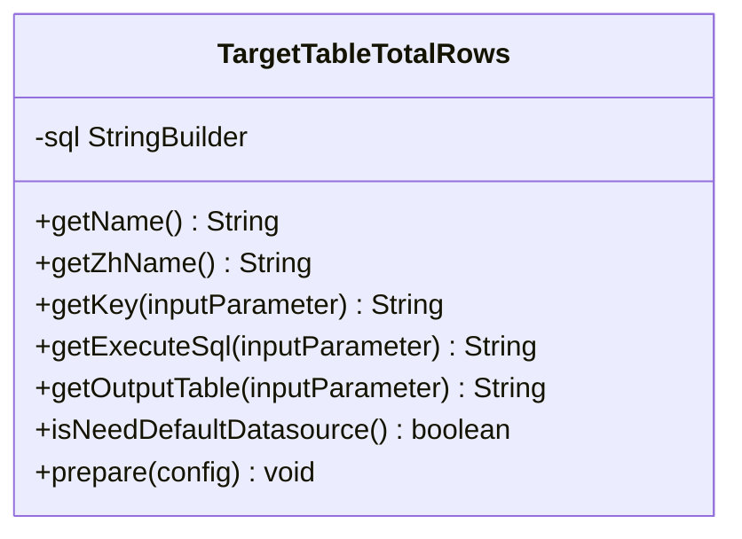

**图示来源**
- [TargetTableTotalRows.java](file://datavines-metric\datavines-metric-expected-plugins\datavines-metric-expected-target-table-rows\src\main\java\io\datavines\metric\expected\plugin\TargetTableTotalRows.java#L26-L75)

**本节来源**
- [TargetTableTotalRows.java](file://datavines-metric\datavines-metric-expected-plugins\datavines-metric-expected-target-table-rows\src\main\java\io\datavines\metric\expected\plugin\TargetTableTotalRows.java#L26-L75)

### 无预期值策略 (None)

无预期值策略表示不使用预期值进行比较。该策略适用于只需要获取实际值的场景。

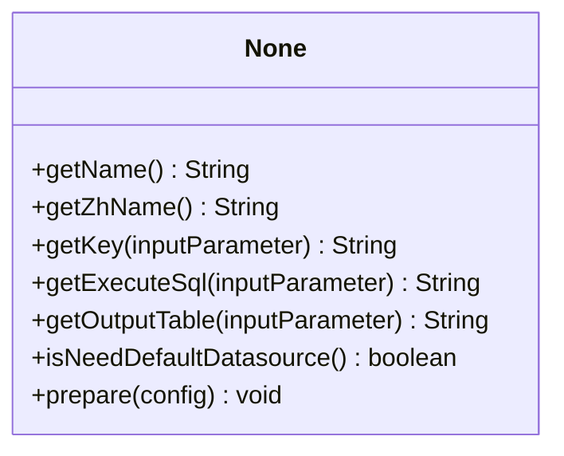

**图示来源**
- [None.java](file://datavines-metric\datavines-metric-expected-plugins\datavines-metric-expected-none\src\main\java\io\datavines\metric\expected\plugin\None.java#L25-L63)

**本节来源**
- [None.java](file://datavines-metric\datavines-metric-expected-plugins\datavines-metric-expected-none\src\main\java\io\datavines\metric\expected\plugin\None.java#L25-L63)

## 配置最佳实践和性能调优建议

### 配置最佳实践

1. 根据业务场景选择合适的预期值计算策略
2. 对于历史数据稳定的指标，使用固定值策略
3. 对于有周期性波动的指标，使用相应周期的均值策略
4. 合理设置filter参数，避免全表扫描
5. 定期评估预期值的合理性，及时调整计算策略

### 性能调优建议

1. 为查询字段建立适当的索引
2. 避免在大表上执行全表计数操作
3. 合理设置查询时间范围，避免查询过大数据量
4. 使用缓存机制减少重复计算
5. 监控查询性能，及时优化慢查询

**本节不分析具体源文件，因此不提供来源**

## 复杂案例分析

### 多维度预期值组合使用

在实际业务中，往往需要结合多种预期值策略进行综合评估。例如，对于一个电商订单表，可以同时使用以下策略：

1. 使用表总行数策略监控每日订单量
2. 使用日均值策略监控订单金额的波动
3. 使用固定值策略监控特定促销活动的预期订单量

这种多维度的监控方式能够更全面地反映数据质量状况，及时发现异常。

**本节不分析具体源文件，因此不提供来源**

## 结论

预期值计算系统通过灵活的插件化架构和多种计算策略，为数据质量验证提供了可靠的基准参考。系统采用SPI机制实现插件的动态加载和注册，具有良好的扩展性。通过合理选择和配置预期值策略，可以有效提升数据质量监控的准确性和效率。

**本节不分析具体源文件，因此不提供来源**