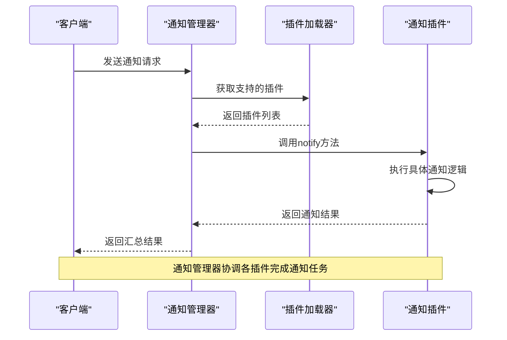
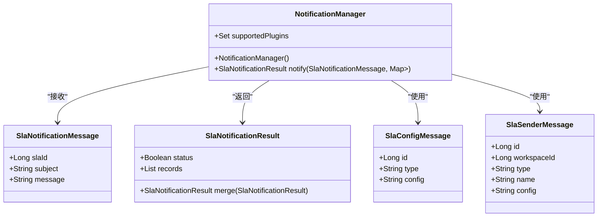
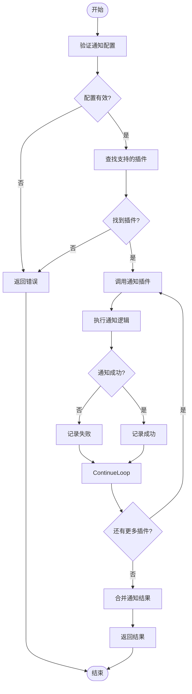
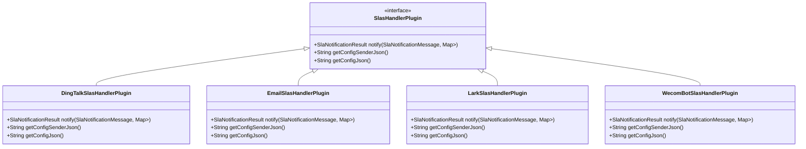

# datavines-notification模块

<cite>
**本文档引用文件**  
- [NotificationManager.java](file://datavines-notification/datavines-notification-core/src/main/java/io/datavines/notification/core/NotificationManager.java)
- [SlaNotificationMessage.java](file://datavines-notification/datavines-notification-api/src/main/java/io/datavines/notification/api/entity/SlaNotificationMessage.java)
- [SlaNotificationResult.java](file://datavines-notification/datavines-notification-api/src/main/java/io/datavines/notification/api/entity/SlaNotificationResult.java)
- [SlaConfigMessage.java](file://datavines-notification/datavines-notification-api/src/main/java/io/datavines/notification/api/entity/SlaConfigMessage.java)
- [SlaSenderMessage.java](file://datavines-notification/datavines-notification-api/src/main/java/io/datavines/notification/api/entity/SlaSenderMessage.java)
- [SlasHandlerPlugin.java](file://datavines-notification/datavines-notification-api/src/main/java/io/datavines/notification/api/spi/SlasHandlerPlugin.java)
- [NotificationConstants.java](file://datavines-notification/datavines-notification-api/src/main/java/io/datavines/notification/api/constants/NotificationConstants.java)
- [DingTalkSlasHandlerPlugin.java](file://datavines-notification/datavines-notification-plugins/datavines-notification-plugin-dingtalk/src/main/java/io/datavines/notification/plugin/dingtalk/DingTalkSlasHandlerPlugin.java)
- [EmailSlasHandlerPlugin.java](file://datavines-notification/datavines-notification-plugins/datavines-notification-plugin-email/src/main/java/io/datavines/notification/plugin/email/EmailSlasHandlerPlugin.java)
- [LarkSlasHandlerPlugin.java](file://datavines-notification/datavines-notification-plugins/datavines-notification-plugin-lark/src/main/java/io/datavines/notification/plugin/lark/LarkSlasHandlerPlugin.java)
- [WecomBotSlasHandlerPlugin.java](file://datavines-notification/datavines-notification-plugins/datavines-notification-plugin-wecombot/src/main/java/io/datavines/notification/plugin/wecombot/WecomBotSlasHandlerPlugin.java)
</cite>

## 目录
1. [简介](#简介)
2. [项目结构](#项目结构)
3. [核心组件](#核心组件)
4. [架构概述](#架构概述)
5. [详细组件分析](#详细组件分析)
6. [依赖分析](#依赖分析)
7. [性能考虑](#性能考虑)
8. [故障排除指南](#故障排除指南)
9. [结论](#结论)

## 简介
datavines-notification模块是DataVines平台中的告警通知系统，负责在数据质量检查失败或SLA（服务等级协议）违规时向相关人员发送通知。该模块支持多种通知渠道，包括钉钉、企业微信、邮件和飞书等，通过灵活的SPI机制实现通知渠道的扩展。模块提供了完整的SLA配置、触发条件和通知策略管理功能，确保数据质量问题能够及时被发现和处理。

## 项目结构
datavines-notification模块采用分层架构设计，包含API、核心实现和插件三个主要部分。API层定义了通知系统的核心接口和数据模型，核心层实现了通知管理器和调度逻辑，插件层则提供了各种通知渠道的具体实现。

```mermaid
graph TD
subgraph "datavines-notification"
subgraph "API层"
NotificationAPI[通知API]
Entity[实体类]
SPI[SPI接口]
end
subgraph "核心层"
NotificationManager[通知管理器]
Client[通知客户端]
end
subgraph "插件层"
DingTalk[钉钉插件]
Email[邮件插件]
Lark[飞书插件]
WecomBot[企业微信插件]
end
NotificationAPI --> NotificationManager
NotificationManager --> DingTalk
NotificationManager --> Email
NotificationManager --> Lark
NotificationManager --> WecomBot
```

**图示来源**
- [NotificationManager.java](file://datavines-notification/datavines-notification-core/src/main/java/io/datavines/notification/core/NotificationManager.java)
- [SlasHandlerPlugin.java](file://datavines-notification/datavines-notification-api/src/main/java/io/datavines/notification/api/spi/SlasHandlerPlugin.java)

**章节来源**
- [NotificationManager.java](file://datavines-notification/datavines-notification-core/src/main/java/io/datavines/notification/core/NotificationManager.java)

## 核心组件
datavines-notification模块的核心组件包括通知管理器（NotificationManager）、通知消息模型和SPI插件接口。通知管理器负责协调各种通知渠道的调用，消息模型定义了通知内容的结构，SPI接口则为扩展新的通知渠道提供了标准。

**章节来源**
- [NotificationManager.java](file://datavines-notification/datavines-notification-core/src/main/java/io/datavines/notification/core/NotificationManager.java)
- [SlaNotificationMessage.java](file://datavines-notification/datavines-notification-api/src/main/java/io/datavines/notification/api/entity/SlaNotificationMessage.java)

## 架构概述
datavines-notification模块采用插件化架构，通过SPI机制实现通知渠道的动态加载和管理。通知管理器作为核心组件，负责接收通知请求，根据配置调用相应的通知插件，并汇总通知结果。



**图示来源**
- [NotificationManager.java](file://datavines-notification/datavines-notification-core/src/main/java/io/datavines/notification/core/NotificationManager.java)
- [SlasHandlerPlugin.java](file://datavines-notification/datavines-notification-api/src/main/java/io/datavines/notification/api/spi/SlasHandlerPlugin.java)

## 详细组件分析

### 通知管理器分析
通知管理器是datavines-notification模块的核心组件，负责协调和管理所有通知操作。它通过SPI机制动态加载支持的通知插件，并根据配置调用相应的插件来发送通知。

#### 通知管理器类图


**图示来源**
- [NotificationManager.java](file://datavines-notification/datavines-notification-core/src/main/java/io/datavines/notification/core/NotificationManager.java)
- [SlaNotificationMessage.java](file://datavines-notification/datavines-notification-api/src/main/java/io/datavines/notification/api/entity/SlaNotificationMessage.java)
- [SlaNotificationResult.java](file://datavines-notification/datavines-notification-api/src/main/java/io/datavines/notification/api/entity/SlaNotificationResult.java)
- [SlaConfigMessage.java](file://datavines-notification/datavines-notification-api/src/main/java/io/datavines/notification/api/entity/SlaConfigMessage.java)
- [SlaSenderMessage.java](file://datavines-notification/datavines-notification-api/src/main/java/io/datavines/notification/api/entity/SlaSenderMessage.java)

**章节来源**
- [NotificationManager.java](file://datavines-notification/datavines-notification-core/src/main/java/io/datavines/notification/core/NotificationManager.java)

### SLA通知机制分析
SLA通知机制是datavines-notification模块的核心功能，负责在SLA违规时发送通知。该机制通过配置化的消息模板和灵活的通知策略，确保通知内容的准确性和及时性。

#### SLA通知流程图


**图示来源**
- [NotificationManager.java](file://datavines-notification/datavines-notification-core/src/main/java/io/datavines/notification/core/NotificationManager.java)
- [SlasHandlerPlugin.java](file://datavines-notification/datavines-notification-api/src/main/java/io/datavines/notification/api/spi/SlasHandlerPlugin.java)

**章节来源**
- [NotificationManager.java](file://datavines-notification/datavines-notification-core/src/main/java/io/datavines/notification/core/NotificationManager.java)

### 通知插件SPI机制分析
通知插件SPI机制是datavines-notification模块的扩展基础，通过标准接口定义，允许开发者轻松添加新的通知渠道。

#### SPI机制类图


**图示来源**
- [SlasHandlerPlugin.java](file://datavines-notification/datavines-notification-api/src/main/java/io/datavines/notification/api/spi/SlasHandlerPlugin.java)
- [DingTalkSlasHandlerPlugin.java](file://datavines-notification/datavines-notification-plugins/datavines-notification-plugin-dingtalk/src/main/java/io/datavines/notification/plugin/dingtalk/DingTalkSlasHandlerPlugin.java)
- [EmailSlasHandlerPlugin.java](file://datavines-notification/datavines-notification-plugins/datavines-notification-plugin-email/src/main/java/io/datavines/notification/plugin/email/EmailSlasHandlerPlugin.java)
- [LarkSlasHandlerPlugin.java](file://datavines-notification/datavines-notification-plugins/datavines-notification-plugin-lark/src/main/java/io/datavines/notification/plugin/lark/LarkSlasHandlerPlugin.java)
- [WecomBotSlasHandlerPlugin.java](file://datavines-notification/datavines-notification-plugins/datavines-notification-plugin-wecombot/src/main/java/io/datavines/notification/plugin/wecombot/WecomBotSlasHandlerPlugin.java)

**章节来源**
- [SlasHandlerPlugin.java](file://datavines-notification/datavines-notification-api/src/main/java/io/datavines/notification/api/spi/SlasHandlerPlugin.java)

## 依赖分析
datavines-notification模块依赖于datavines-spi模块的插件加载机制，以及datavines-common模块的通用工具类。通过SPI机制，模块能够动态加载和管理各种通知插件，实现了高度的可扩展性。

```mermaid
graph TD
subgraph "datavines-notification"
NotificationManager[通知管理器]
SPIInterface[SPI接口]
end
subgraph "依赖模块"
SPI[datavines-spi]
Common[datavines-common]
end
NotificationManager --> SPI
SPIInterface --> SPI
NotificationManager --> Common
SPIInterface --> Common
Note over SPI,Common: 通知模块依赖SPI和通用工具模块
```

**图示来源**
- [NotificationManager.java](file://datavines-notification/datavines-notification-core/src/main/java/io/datavines/notification/core/NotificationManager.java)
- [SlasHandlerPlugin.java](file://datavines-notification/datavines-notification-api/src/main/java/io/datavines/notification/api/spi/SlasHandlerPlugin.java)

**章节来源**
- [NotificationManager.java](file://datavines-notification/datavines-notification-core/src/main/java/io/datavines/notification/core/NotificationManager.java)

## 性能考虑
datavines-notification模块在设计时考虑了性能和可靠性。通知管理器采用批量处理机制，能够同时处理多个通知请求。通过异步调用和结果合并，确保了通知操作的高效性。同时，模块实现了错误重试机制，提高了通知的可靠性。

## 故障排除指南
当遇到通知发送失败的问题时，可以按照以下步骤进行排查：
1. 检查通知配置是否正确，包括接收人、通知渠道等
2. 验证通知插件的配置参数是否完整
3. 查看系统日志，定位具体的错误信息
4. 确认网络连接是否正常，特别是外部通知服务的可达性
5. 检查SPI插件是否正确加载

**章节来源**
- [NotificationManager.java](file://datavines-notification/datavines-notification-core/src/main/java/io/datavines/notification/core/NotificationManager.java)
- [SlasHandlerPlugin.java](file://datavines-notification/datavines-notification-api/src/main/java/io/datavines/notification/api/spi/SlasHandlerPlugin.java)

## 结论
datavines-notification模块通过灵活的SPI机制和模块化设计，提供了一个可扩展、可靠的通知系统。该模块不仅支持多种通知渠道，还提供了完善的SLA管理和通知策略配置功能。通过合理的架构设计和性能优化，确保了通知系统的高效性和可靠性，为数据质量管理提供了有力的支持。