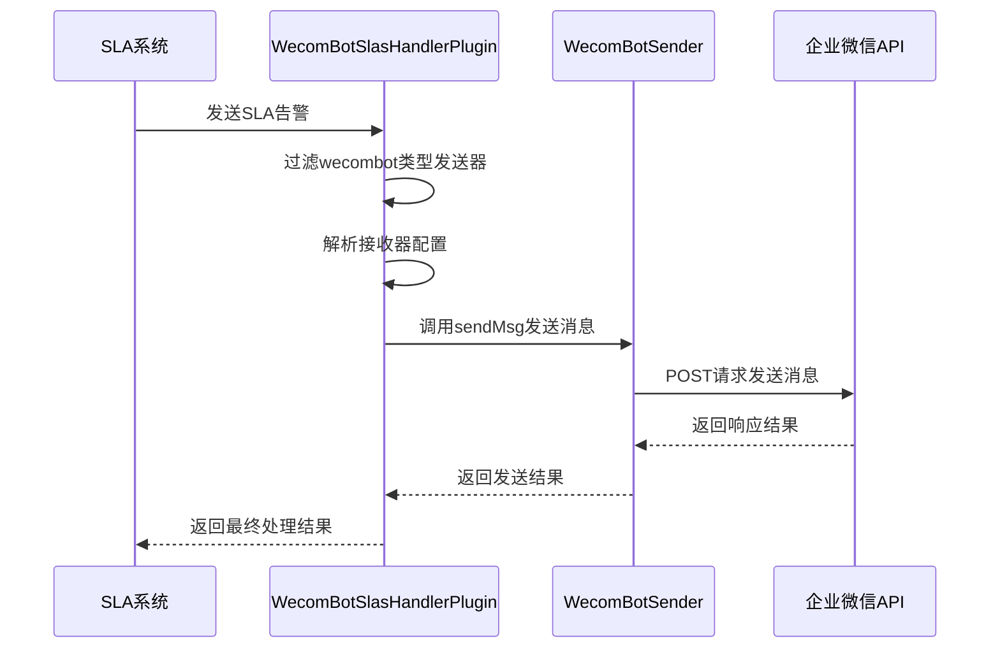
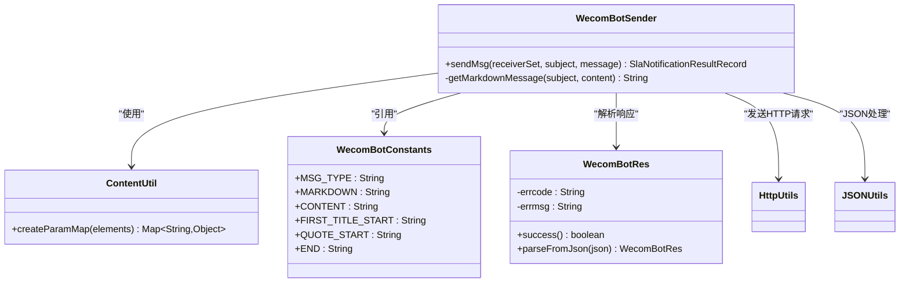
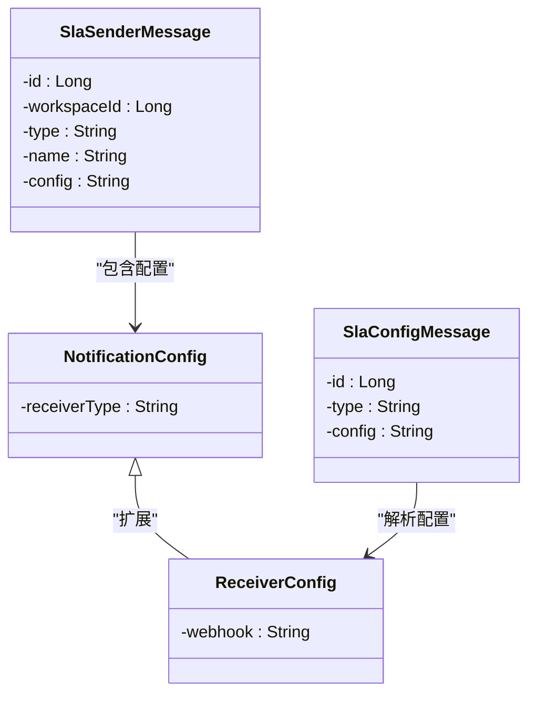
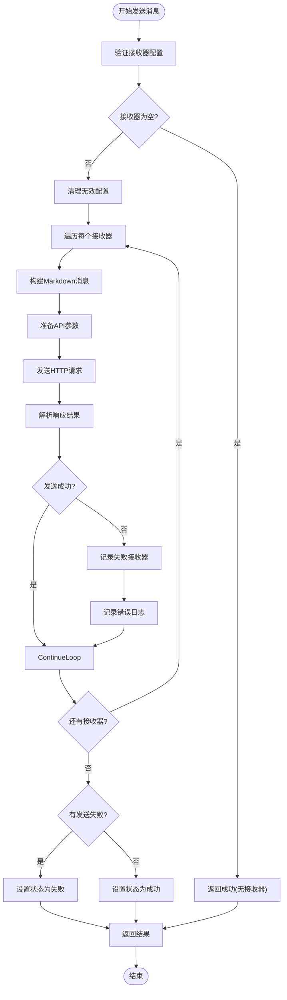

# 企业微信通知

<cite>
**本文档引用的文件**
- [WecomBotSlasHandlerPlugin.java](file://datavines-notification\datavines-notification-plugins\datavines-notification-plugin-wecombot\src\main\java\io\datavines\notification\plugin\wecombot\WecomBotSlasHandlerPlugin.java)
- [WecomBotSender.java](file://datavines-notification\datavines-notification-plugins\datavines-notification-plugin-wecombot\src\main\java\io\datavines\notification\plugin\wecombot\WecomBotSender.java)
- [WecomBotConstants.java](file://datavines-notification\datavines-notification-plugins\datavines-notification-plugin-wecombot\src\main\java\io\datavines\notification\plugin\wecombot\WecomBotConstants.java)
- [ReceiverConfig.java](file://datavines-notification\datavines-notification-plugins\datavines-notification-plugin-wecombot\src\main\java\io\datavines\notification\plugin\wecombot\entity\ReceiverConfig.java)
- [NotificationConfig.java](file://datavines-notification\datavines-notification-plugins\datavines-notification-plugin-wecombot\src\main\java\io\datavines\notification\plugin\wecombot\entity\NotificationConfig.java)
- [ContentUtil.java](file://datavines-notification\datavines-notification-plugins\datavines-notification-plugin-wecombot\src\main\java\io\datavines\notification\plugin\wecombot\utils\ContentUtil.java)
- [SlaNotificationMessage.java](file://datavines-notification\datavines-notification-api\src\main\java\io\datavines\notification\api\entity\SlaNotificationMessage.java)
- [SlaSenderMessage.java](file://datavines-notification\datavines-notification-api\src\main\java\io\datavines\notification\api\entity\SlaSenderMessage.java)
- [SlaConfigMessage.java](file://datavines-notification\datavines-notification-api\src\main\java\io\datavines\notification\api\entity\SlaConfigMessage.java)
- [WecomBotRes.java](file://datavines-notification\datavines-notification-plugins\datavines-notification-plugin-wecombot\src\main\java\io\datavines\notification\plugin\wecombot\entity\WecomBotRes.java)
</cite>

## 目录
1. [简介](#简介)
2. [WecomBotSlasHandlerPlugin处理SLA告警](#wecombotslashandlerplugin处理sla告警)
3. [WecomBotSender实现分析](#wecombotsender实现分析)
4. [NotificationConfig配置实体](#notificationconfig配置实体)
5. [消息模板示例](#消息模板示例)
6. [API返回结果处理与错误实践](#api返回结果处理与错误实践)

## 简介
本文档详细介绍了Datavines平台中企业微信通知插件的实现机制。该插件通过WecomBotSlasHandlerPlugin处理SLA（服务等级协议）告警，并利用WecomBotSender调用企业微信机器人API发送通知。文档将深入分析核心组件的实现细节，包括消息构建、配置管理以及错误处理策略。

## WecomBotSlasHandlerPlugin处理SLA告警

WecomBotSlasHandlerPlugin是SLA告警处理的核心组件，实现了SlasHandlerPlugin接口，负责处理SLA告警并调用企业微信机器人API。

该插件的主要功能流程如下：
1. 过滤出类型为"wecombot"的发送器配置
2. 解析接收器配置信息
3. 调用WecomBotSender发送消息
4. 收集并返回发送结果

插件通过`notify`方法接收SLA告警消息和配置信息，其中：
- `SlaNotificationMessage`包含告警的主题和内容
- `Map<SlaSenderMessage, Set<SlaConfigMessage>>`包含发送器配置和接收器配置

当检测到发送失败时，插件会将整体状态设置为失败，并记录失败详情。



**图示来源**
- [WecomBotSlasHandlerPlugin.java](file://datavines-notification\datavines-notification-plugins\datavines-notification-plugin-wecombot\src\main\java\io\datavines\notification\plugin\wecombot\WecomBotSlasHandlerPlugin.java#L34-L62)
- [WecomBotSender.java](file://datavines-notification\datavines-notification-plugins\datavines-notification-plugin-wecombot\src\main\java\io\datavines\notification\plugin\wecombot\WecomBotSender.java#L40-L73)

**本节来源**
- [WecomBotSlasHandlerPlugin.java](file://datavines-notification\datavines-notification-plugins\datavines-notification-plugin-wecombot\src\main\java\io\datavines\notification\plugin\wecombot\WecomBotSlasHandlerPlugin.java#L34-L62)

## WecomBotSender实现分析

WecomBotSender是企业微信消息发送的核心实现类，负责构建和发送不同类型的消息到企业微信机器人。

### 消息发送流程
WecomBotSender的`sendMsg`方法实现了完整的消息发送流程：

1. **输入验证**：检查接收器集合是否为空
2. **配置清理**：移除webhook地址为空的接收器
3. **消息构建**：调用`getMarkdownMessage`方法构建Markdown格式消息
4. **参数准备**：使用ContentUtil创建API调用参数
5. **API调用**：通过HttpUtils发送POST请求
6. **结果处理**：解析API响应并记录发送结果

### 消息类型支持
目前实现主要支持Markdown消息类型，通过WecomBotConstants常量定义了消息类型和格式：

- `MSG_TYPE`: "msgtype" - 消息类型字段
- `MARKDOWN`: "markdown" - Markdown消息类型
- `CONTENT`: "content" - 内容字段
- `FIRST_TITLE_START`: "# " - 一级标题前缀
- `QUOTE_START`: "> " - 引用文本前缀
- `END`: "\n" - 换行符

### 消息构建机制
`getMarkdownMessage`方法负责将原始消息内容转换为符合企业微信Markdown格式的消息：

1. 添加一级标题（使用subject作为标题）
2. 处理内容中的JSON数组
3. 对特定格式的消息（如"任务执行记录"）创建超链接
4. 使用引用格式包装每条消息
5. 添加适当的换行符



**图示来源**
- [WecomBotSender.java](file://datavines-notification\datavines-notification-plugins\datavines-notification-plugin-wecombot\src\main\java\io\datavines\notification\plugin\wecombot\WecomBotSender.java#L38-L73)
- [ContentUtil.java](file://datavines-notification\datavines-notification-plugins\datavines-notification-plugin-wecombot\src\main\java\io\datavines\notification\plugin\wecombot\utils\ContentUtil.java#L22-L38)
- [WecomBotConstants.java](file://datavines-notification\datavines-notification-plugins\datavines-notification-plugin-wecombot\src\main\java\io\datavines\notification\plugin\wecombot\WecomBotConstants.java#L19-L26)
- [WecomBotRes.java](file://datavines-notification\datavines-notification-plugins\datavines-notification-plugin-wecombot\src\main\java\io\datavines\notification\plugin\wecombot\entity\WecomBotRes.java#L24-L43)

**本节来源**
- [WecomBotSender.java](file://datavines-notification\datavines-notification-plugins\datavines-notification-plugin-wecombot\src\main\java\io\datavines\notification\plugin\wecombot\WecomBotSender.java#L38-L95)
- [ContentUtil.java](file://datavines-notification\datavines-notification-plugins\datavines-notification-plugin-wecombot\src\main\java\io\datavines\notification\plugin\wecombot\utils\ContentUtil.java#L22-L38)

## NotificationConfig配置实体

NotificationConfig是企业微信通知的配置实体类，定义了通知相关的配置参数。

### 核心配置参数
当前实现中，NotificationConfig主要包含以下配置参数：

- `receiverType`: 接收器类型，用于区分不同类型的接收器配置

在实际使用中，接收器的具体配置（如webhook地址）存储在ReceiverConfig类中，通过JSON字符串形式传递。

### 配置管理机制
WecomBotSlasHandlerPlugin通过`getConfigJson`方法提供配置项定义，目前主要包含：

- `webhook`: 企业微信机器人的Webhook地址，标记为必填项

配置系统使用PluginParams、InputParam和Validate等类来定义和验证配置参数，确保配置的完整性和正确性。



**图示来源**
- [NotificationConfig.java](file://datavines-notification\datavines-notification-plugins\datavines-notification-plugin-wecombot\src\main\java\io\datavines\notification\plugin\wecombot\entity\NotificationConfig.java#L23-L29)
- [ReceiverConfig.java](file://datavines-notification\datavines-notification-plugins\datavines-notification-plugin-wecombot\src\main\java\io\datavines\notification\plugin\wecombot\entity\ReceiverConfig.java#L22-L28)
- [WecomBotSlasHandlerPlugin.java](file://datavines-notification\datavines-notification-plugins\datavines-notification-plugin-wecombot\src\main\java\io\datavines\notification\plugin\wecombot\WecomBotSlasHandlerPlugin.java#L79-L95)

**本节来源**
- [NotificationConfig.java](file://datavines-notification\datavines-notification-plugins\datavines-notification-plugin-wecombot\src\main\java\io\datavines\notification\plugin\wecombot\entity\NotificationConfig.java#L23-L29)
- [ReceiverConfig.java](file://datavines-notification\datavines-notification-plugins\datavines-notification-plugin-wecombot\src\main\java\io\datavines\notification\plugin\wecombot\entity\ReceiverConfig.java#L22-L28)
- [WecomBotSlasHandlerPlugin.java](file://datavines-notification\datavines-notification-plugins\datavines-notification-plugin-wecombot\src\main\java\io\datavines\notification\plugin\wecombot\WecomBotSlasHandlerPlugin.java#L79-L95)

## 消息模板示例

### Markdown格式告警信息
企业微信通知插件主要使用Markdown格式发送告警信息，以下为典型的模板示例：

```markdown
# [告警主题]

> 任务执行记录 : [查看详情](https://example.com/detail/123)
> 检查项: 数据质量检查
> 状态: 失败
> 时间: 2024-01-01 12:00:00
> 错误信息: 数据完整性检查未通过
```

### 模板构建规则
消息模板的构建遵循以下规则：

1. **标题格式**：使用一级标题（#）显示告警主题
2. **内容格式**：每条信息使用引用格式（>）显示
3. **链接处理**：对"任务执行记录"类消息自动创建超链接
4. **结构化显示**：将JSON格式的消息内容转换为易读的文本格式

### 多语言支持
模板支持中英文双语显示，系统会自动识别消息内容的语言并相应处理：

- 中文消息：以"任务执行记录"开头的消息
- 英文消息：以"Task Execution Record"开头的消息

对于非特定格式的消息，直接使用引用格式显示原始内容。

**本节来源**
- [WecomBotSender.java](file://datavines-notification\datavines-notification-plugins\datavines-notification-plugin-wecombot\src\main\java\io\datavines\notification\plugin\wecombot\WecomBotSender.java#L76-L93)
- [WecomBotConstants.java](file://datavines-notification\datavines-notification-plugins\datavines-notification-plugin-wecombot\src\main\java\io\datavines\notification\plugin\wecombot\WecomBotConstants.java#L23-L25)

## API返回结果处理与错误实践

### 响应结果处理
企业微信API的响应结果通过WecomBotRes类进行封装和处理：

```java
@Data
public class WecomBotRes implements Serializable {
    private String errcode;
    private String errmsg;
    
    public boolean success() {
        return StringUtils.equalsIgnoreCase(errcode, "0");
    }
    
    public static WecomBotRes parseFromJson(String json) {
        return JSONUtils.parseObject(json, WecomBotRes.class);
    }
}
```

关键处理逻辑：
- `errcode`为"0"时表示请求成功
- 使用`success()`方法快速判断请求是否成功
- 通过`parseFromJson`静态方法解析JSON响应

### 错误处理策略
WecomBotSender实现了完善的错误处理机制：

1. **异常捕获**：使用try-catch捕获所有异常
2. **失败记录**：记录发送失败的webhook地址
3. **日志记录**：详细记录错误信息和请求参数
4. **结果汇总**：收集所有发送结果并返回

### 最佳实践建议
1. **配置验证**：确保webhook地址正确且不为空
2. **网络监控**：监控HTTP请求的网络状况
3. **重试机制**：对于临时性错误考虑实现重试机制
4. **日志分析**：定期分析错误日志，及时发现和解决问题
5. **权限检查**：确保企业微信机器人具有发送消息的权限

当发送失败时，系统会返回包含失败详情的结果对象，便于上层系统进行相应的处理。



**图示来源**
- [WecomBotSender.java](file://datavines-notification\datavines-notification-plugins\datavines-notification-plugin-wecombot\src\main\java\io\datavines\notification\plugin\wecombot\WecomBotSender.java#L40-L73)
- [WecomBotRes.java](file://datavines-notification\datavines-notification-plugins\datavines-notification-plugin-wecombot\src\main\java\io\datavines\notification\plugin\wecombot\entity\WecomBotRes.java#L24-L43)

**本节来源**
- [WecomBotSender.java](file://datavines-notification\datavines-notification-plugins\datavines-notification-plugin-wecombot\src\main\java\io\datavines\notification\plugin\wecombot\WecomBotSender.java#L40-L73)
- [WecomBotRes.java](file://datavines-notification\datavines-notification-plugins\datavines-notification-plugin-wecombot\src\main\java\io\datavines\notification\plugin\wecombot\entity\WecomBotRes.java#L24-L43)