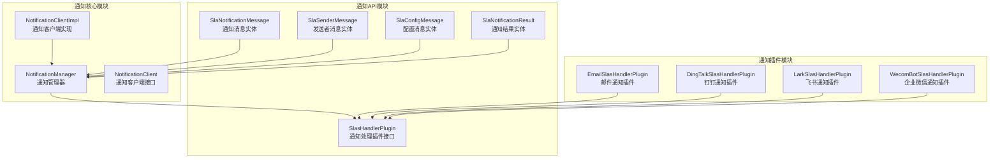
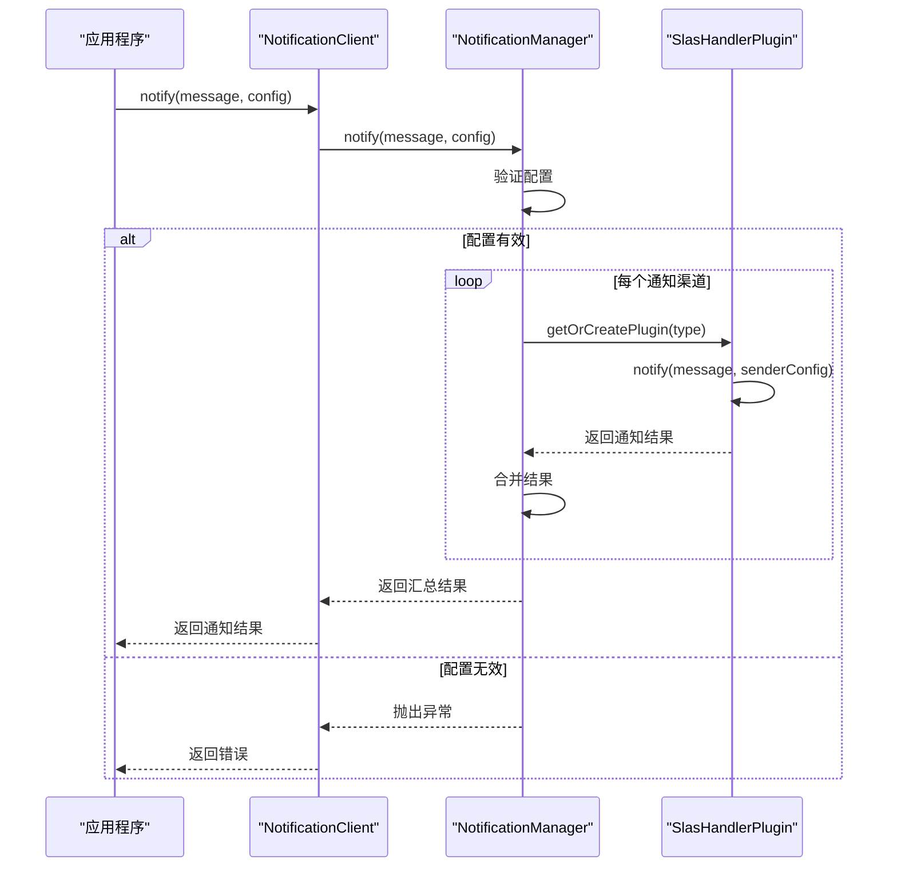
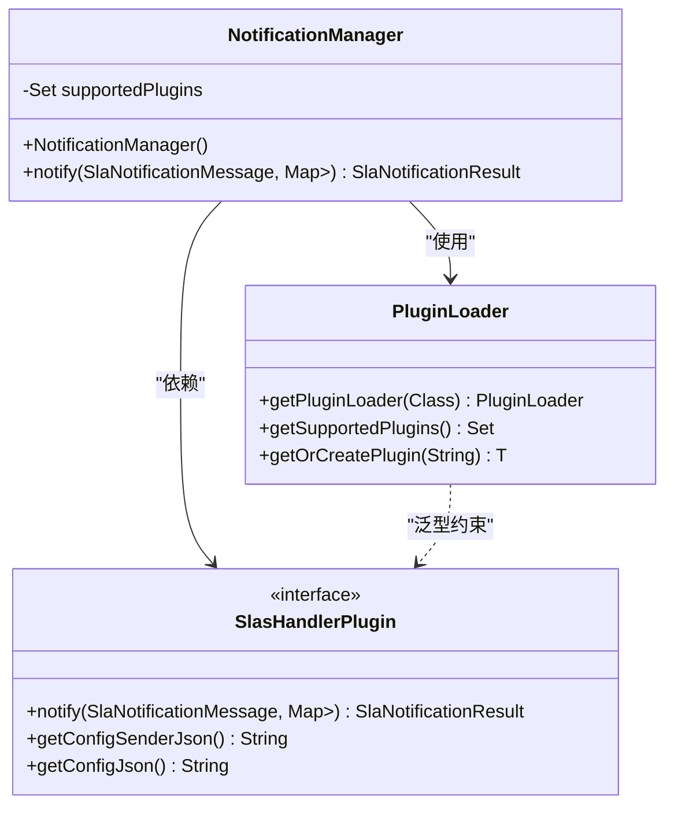
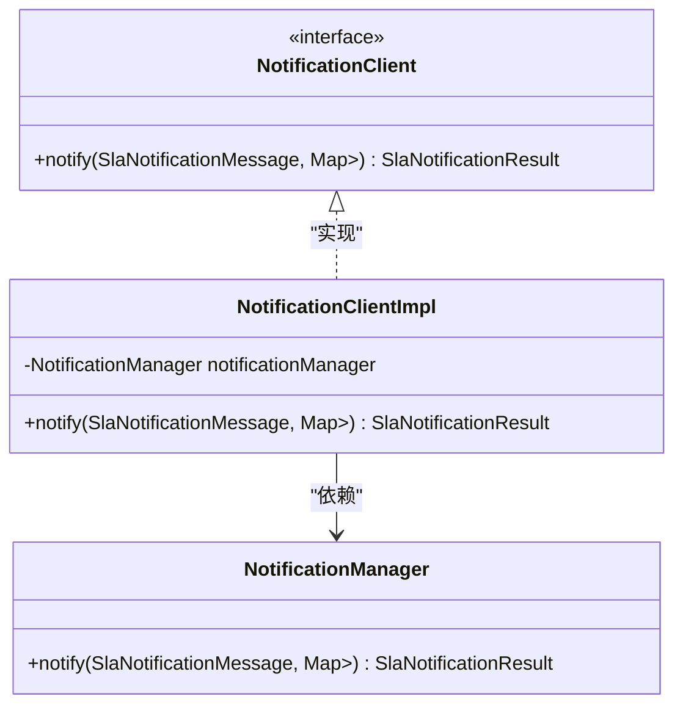
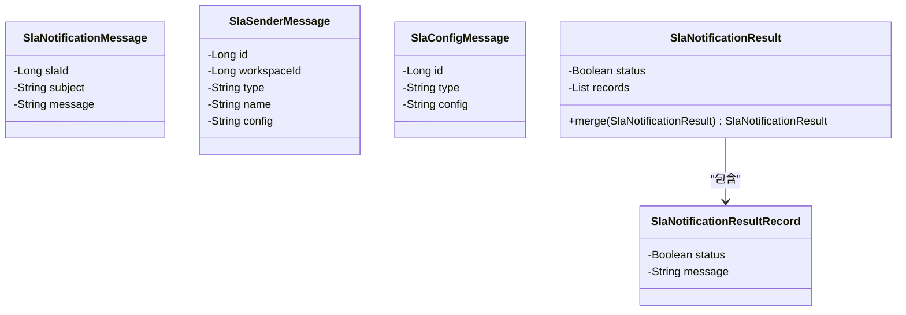
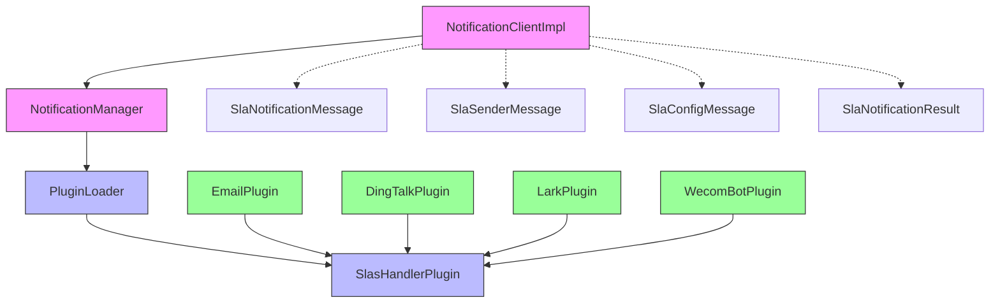

# 通知核心

<cite>
**本文档中引用的文件**  
- [NotificationManager.java](file://datavines-notification/datavines-notification-core/src/main/java/io/datavines/notification/core/NotificationManager.java)
- [NotificationClient.java](file://datavines-notification/datavines-notification-core/src/main/java/io/datavines/notification/core/client/NotificationClient.java)
- [NotificationClientImpl.java](file://datavines-notification/datavines-notification-core/src/main/java/io/datavines/notification/core/client/impl/NotificationClientImpl.java)
- [SlaNotificationMessage.java](file://datavines-notification/datavines-notification-api/src/main/java/io/datavines/notification/api/entity/SlaNotificationMessage.java)
- [SlaSenderMessage.java](file://datavines-notification/datavines-notification-api/src/main/java/io/datavines/notification/api/entity/SlaSenderMessage.java)
- [SlaConfigMessage.java](file://datavines-notification/datavines-notification-api/src/main/java/io/datavines/notification/api/entity/SlaConfigMessage.java)
- [SlaNotificationResult.java](file://datavines-notification/datavines-notification-api/src/main/java/io/datavines/notification/api/entity/SlaNotificationResult.java)
- [SlasHandlerPlugin.java](file://datavines-notification/datavines-notification-api/src/main/java/io/datavines/notification/api/spi/SlasHandlerPlugin.java)
- [EmailSlasHandlerPlugin.java](file://datavines-notification/datavines-notification-plugins/datavines-notification-plugin-email/src/main/java/io/datavines/notification/plugin/email/EmailSlasHandlerPlugin.java)
- [DingTalkSlasHandlerPlugin.java](file://datavines-notification/datavines-notification-plugins/datavines-notification-plugin-dingtalk/src/main/java/io/datavines/notification/plugin/dingtalk/DingTalkSlasHandlerPlugin.java)
</cite>

## 目录
1. [简介](#简介)
2. [项目结构](#项目结构)
3. [核心组件](#核心组件)
4. [架构概述](#架构概述)
5. [详细组件分析](#详细组件分析)
6. [依赖分析](#依赖分析)
7. [性能考虑](#性能考虑)
8. [故障排除指南](#故障排除指南)
9. [结论](#结论)

## 简介
本文档详细介绍了Datavines通知系统的核心模块，重点阐述了NotificationManager作为通知系统的中枢，负责协调SLA事件处理和通知分发的职责。文档详细描述了NotificationClient接口及其实现类NotificationClientImpl的设计，包括通知消息的构建、发送和结果反馈机制。同时分析了通知系统的可靠性保障，包括异常处理、重试策略和性能优化。提供了核心组件的配置参数说明和使用示例，并阐述了其与datavines-server模块的集成方式。

## 项目结构
Datavines通知模块采用分层架构设计，主要由API、核心实现和插件三大部分组成。API模块定义了通知系统的核心接口和数据结构，核心模块实现了通知的协调和分发逻辑，插件模块则提供了多种通知渠道的具体实现。

**图示来源**  
- [NotificationManager.java](file://datavines-notification/datavines-notification-core/src/main/java/io/datavines/notification/core/NotificationManager.java)
- [SlasHandlerPlugin.java](file://datavines-notification/datavines-notification-api/src/main/java/io/datavines/notification/api/spi/SlasHandlerPlugin.java)
- [SlaNotificationMessage.java](file://datavines-notification/datavines-notification-api/src/main/java/io/datavines/notification/api/entity/SlaNotificationMessage.java)
- [SlaSenderMessage.java](file://datavines-notification/datavines-notification-api/src/main/java/io/datavines/notification/api/entity/SlaSenderMessage.java)
- [SlaConfigMessage.java](file://datavines-notification/datavines-notification-api/src/main/java/io/datavines/notification/api/entity/SlaConfigMessage.java)
- [SlaNotificationResult.java](file://datavines-notification/datavines-notification-api/src/main/java/io/datavines/notification/api/entity/SlaNotificationResult.java)

**本节来源**  
- [NotificationManager.java](file://datavines-notification/datavines-notification-core/src/main/java/io/datavines/notification/core/NotificationManager.java)
- [NotificationClient.java](file://datavines-notification/datavines-notification-core/src/main/java/io/datavines/notification/core/client/NotificationClient.java)
- [NotificationClientImpl.java](file://datavines-notification/datavines-notification-core/src/main/java/io/datavines/notification/core/client/impl/NotificationClientImpl.java)

## 核心组件
通知系统的核心组件包括NotificationManager、NotificationClient接口及其实现类NotificationClientImpl。NotificationManager作为系统的中枢，负责协调SLA事件的处理和通知分发。NotificationClient提供了统一的接口供外部系统调用，而NotificationClientImpl则是该接口的具体实现，负责与NotificationManager进行交互。

**本节来源**  
- [NotificationManager.java](file://datavines-notification/datavines-notification-core/src/main/java/io/datavines/notification/core/NotificationManager.java)
- [NotificationClient.java](file://datavines-notification/datavines-notification-core/src/main/java/io/datavines/notification/core/client/NotificationClient.java)
- [NotificationClientImpl.java](file://datavines-notification/datavines-notification-core/src/main/java/io/datavines/notification/core/client/impl/NotificationClientImpl.java)

## 架构概述
Datavines通知系统采用插件化架构设计，通过SPI（Service Provider Interface）机制实现通知渠道的可扩展性。系统核心由NotificationManager组成，负责协调和分发通知请求。外部系统通过NotificationClient接口与通知系统交互，而具体的渠道实现（如邮件、钉钉、飞书等）则通过实现SlasHandlerPlugin接口来完成。

**图示来源**  
- [NotificationManager.java](file://datavines-notification/datavines-notification-core/src/main/java/io/datavines/notification/core/NotificationManager.java)
- [NotificationClientImpl.java](file://datavines-notification/datavines-notification-core/src/main/java/io/datavines/notification/core/client/impl/NotificationClientImpl.java)
- [SlasHandlerPlugin.java](file://datavines-notification/datavines-notification-api/src/main/java/io/datavines/notification/api/spi/SlasHandlerPlugin.java)

## 详细组件分析

### NotificationManager分析
NotificationManager是通知系统的核心组件，负责协调SLA事件的处理和通知分发。它在初始化时通过SPI机制加载所有支持的通知插件，并在收到通知请求时，根据配置调用相应的插件进行处理。

**图示来源**  
- [NotificationManager.java](file://datavines-notification/datavines-notification-core/src/main/java/io/datavines/notification/core/NotificationManager.java)
- [SlasHandlerPlugin.java](file://datavines-notification/datavines-notification-api/src/main/java/io/datavines/notification/api/spi/SlasHandlerPlugin.java)
- [datavines-spi/PluginLoader.java](file://datavines-spi/src/main/java/io/datavines/spi/PluginLoader.java)

**本节来源**  
- [NotificationManager.java](file://datavines-notification/datavines-notification-core/src/main/java/io/datavines/notification/core/NotificationManager.java)

### NotificationClient分析
NotificationClient接口及其实现类NotificationClientImpl提供了与通知系统交互的统一入口。该设计采用了门面模式，简化了外部系统与通知系统的集成。

**图示来源**  
- [NotificationClient.java](file://datavines-notification/datavines-notification-core/src/main/java/io/datavines/notification/core/client/NotificationClient.java)
- [NotificationClientImpl.java](file://datavines-notification/datavines-notification-core/src/main/java/io/datavines/notification/core/client/impl/NotificationClientImpl.java)
- [NotificationManager.java](file://datavines-notification/datavines-notification-core/src/main/java/io/datavines/notification/core/NotificationManager.java)

**本节来源**  
- [NotificationClient.java](file://datavines-notification/datavines-notification-core/src/main/java/io/datavines/notification/core/client/NotificationClient.java)
- [NotificationClientImpl.java](file://datavines-notification/datavines-notification-core/src/main/java/io/datavines/notification/core/client/impl/NotificationClientImpl.java)

### 通知消息实体分析
通知系统定义了一系列实体类来封装通知相关的数据，包括通知消息、发送者配置、接收者配置和通知结果等。

**图示来源**  
- [SlaNotificationMessage.java](file://datavines-notification/datavines-notification-api/src/main/java/io/datavines/notification/api/entity/SlaNotificationMessage.java)
- [SlaSenderMessage.java](file://datavines-notification/datavines-notification-api/src/main/java/io/datavines/notification/api/entity/SlaSenderMessage.java)
- [SlaConfigMessage.java](file://datavines-notification/datavines-notification-api/src/main/java/io/datavines/notification/api/entity/SlaConfigMessage.java)
- [SlaNotificationResult.java](file://datavines-notification/datavines-notification-api/src/main/java/io/datavines/notification/api/entity/SlaNotificationResult.java)
- [SlaNotificationResultRecord.java](file://datavines-notification/datavines-notification-api/src/main/java/io/datavines/notification/api/entity/SlaNotificationResultRecord.java)

**本节来源**  
- [SlaNotificationMessage.java](file://datavines-notification/datavines-notification-api/src/main/java/io/datavines/notification/api/entity/SlaNotificationMessage.java)
- [SlaSenderMessage.java](file://datavines-notification/datavines-notification-api/src/main/java/io/datavines/notification/api/entity/SlaSenderMessage.java)
- [SlaConfigMessage.java](file://datavines-notification/datavines-notification-api/src/main/java/io/datavines/notification/api/entity/SlaConfigMessage.java)
- [SlaNotificationResult.java](file://datavines-notification/datavines-notification-api/src/main/java/io/datavines/notification/api/entity/SlaNotificationResult.java)

## 依赖分析
通知系统通过SPI机制实现插件化扩展，核心模块依赖于API模块定义的接口和实体，而具体的渠道实现则作为独立的插件模块存在。

**图示来源**  
- [NotificationClientImpl.java](file://datavines-notification/datavines-notification-core/src/main/java/io/datavines/notification/core/client/impl/NotificationClientImpl.java)
- [NotificationManager.java](file://datavines-notification/datavines-notification-core/src/main/java/io/datavines/notification/core/NotificationManager.java)
- [PluginLoader.java](file://datavines-spi/src/main/java/io/datavines/spi/PluginLoader.java)
- [SlasHandlerPlugin.java](file://datavines-notification/datavines-notification-api/src/main/java/io/datavines/notification/api/spi/SlasHandlerPlugin.java)
- [EmailSlasHandlerPlugin.java](file://datavines-notification/datavines-notification-plugins/datavines-notification-plugin-email/src/main/java/io/datavines/notification/plugin/email/EmailSlasHandlerPlugin.java)
- [DingTalkSlasHandlerPlugin.java](file://datavines-notification/datavines-notification-plugins/datavines-notification-plugin-dingtalk/src/main/java/io/datavines/notification/plugin/dingtalk/DingTalkSlasHandlerPlugin.java)

**本节来源**  
- [NotificationClientImpl.java](file://datavines-notification/datavines-notification-core/src/main/java/io/datavines/notification/core/client/impl/NotificationClientImpl.java)
- [NotificationManager.java](file://datavines-notification/datavines-notification-core/src/main/java/io/datavines/notification/core/NotificationManager.java)
- [PluginLoader.java](file://datavines-spi/src/main/java/io/datavines/spi/PluginLoader.java)

## 性能考虑
通知系统在设计时考虑了性能和可靠性，通过以下机制确保系统的高效运行：

1. **异步处理**：虽然当前实现为同步调用，但架构支持异步处理模式，可通过消息队列实现通知的异步发送。
2. **批量处理**：系统支持批量发送通知，减少网络开销和系统负载。
3. **连接池**：对于需要建立网络连接的通知渠道（如邮件），建议使用连接池技术复用连接。
4. **缓存机制**：常用配置信息可以缓存，减少重复解析的开销。
5. **并发处理**：不同通知渠道可以并行处理，提高整体处理效率。

## 故障排除指南
当通知系统出现问题时，可以按照以下步骤进行排查：

1. **检查配置**：确保通知渠道的配置正确无误，特别是认证信息和网络设置。
2. **查看日志**：检查系统日志，定位具体的错误信息和堆栈跟踪。
3. **验证网络**：确保服务器能够访问通知服务的API端点。
4. **测试连接**：使用简单的测试程序验证与通知服务的连接是否正常。
5. **检查权限**：确认应用有足够的权限发送通知。

**本节来源**  
- [EmailSlasHandlerPlugin.java](file://datavines-notification/datavines-notification-plugins/datavines-notification-plugin-email/src/main/java/io/datavines/notification/plugin/email/EmailSlasHandlerPlugin.java)
- [DingTalkSlasHandlerPlugin.java](file://datavines-notification/datavines-notification-plugins/datavines-notification-plugin-dingtalk/src/main/java/io/datavines/notification/plugin/dingtalk/DingTalkSlasHandlerPlugin.java)

## 结论
Datavines通知系统通过清晰的分层架构和插件化设计，实现了灵活、可扩展的通知功能。NotificationManager作为系统中枢，有效地协调了SLA事件的处理和通知分发。通过NotificationClient接口，外部系统可以方便地集成通知功能。系统的可靠性通过完善的异常处理和结果反馈机制得到保障。未来可以进一步优化性能，如引入异步处理机制和更智能的重试策略。