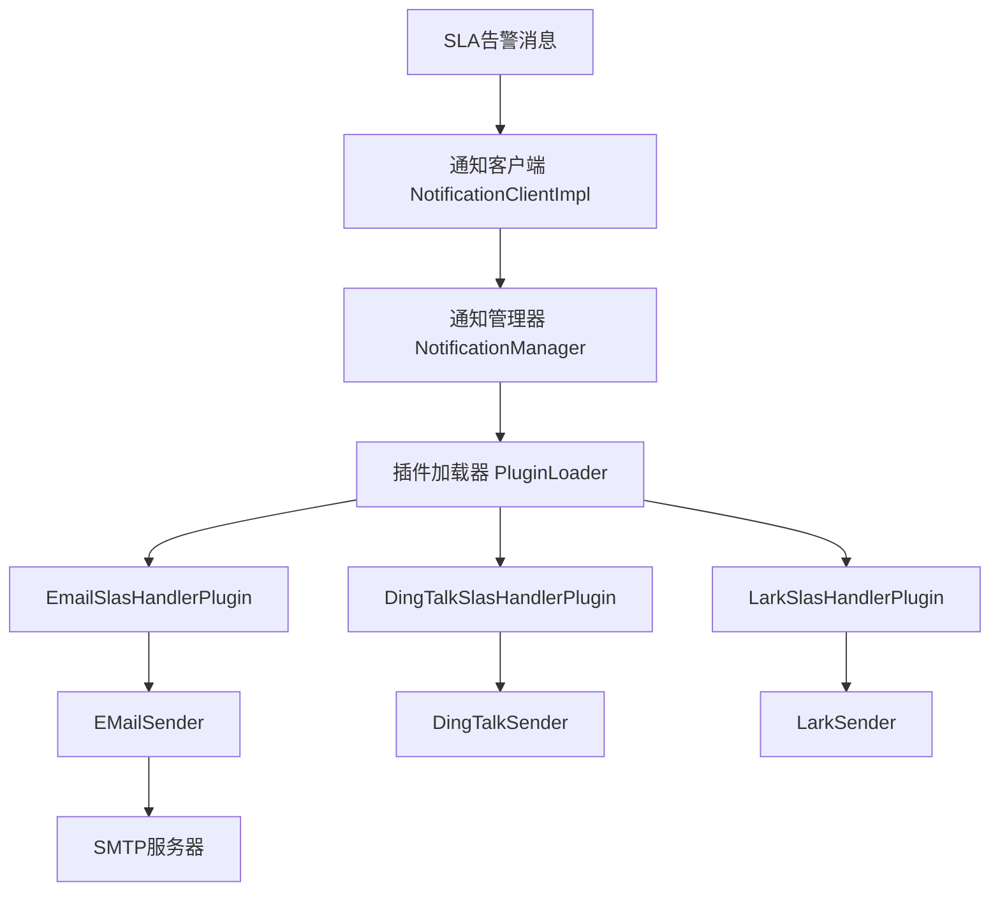
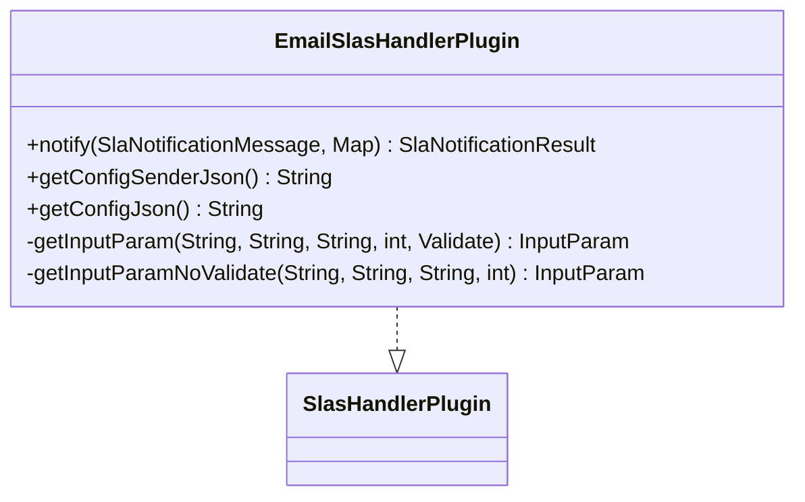
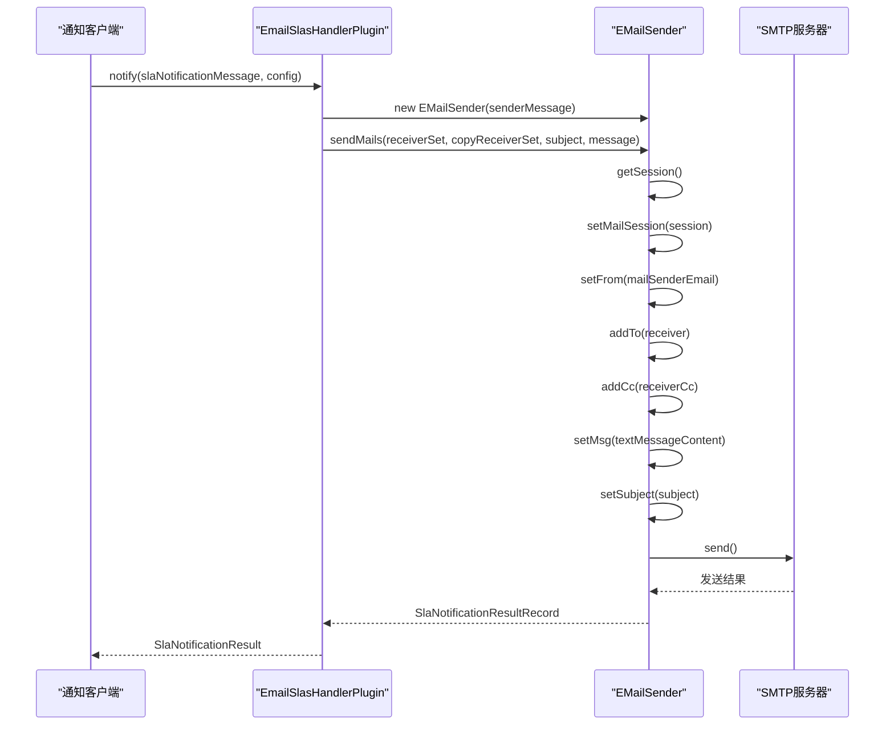
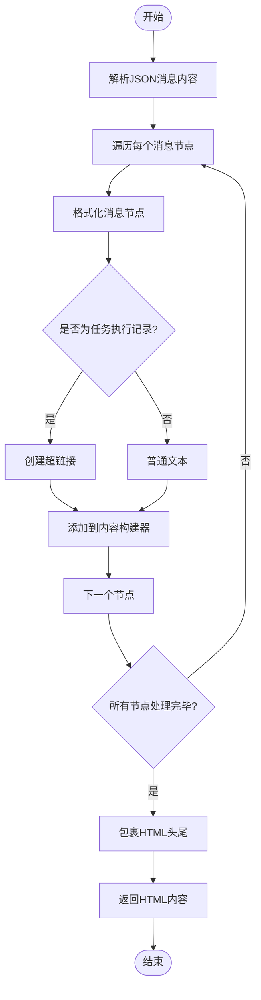
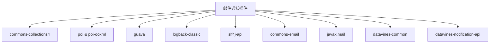

# 邮件通知

<cite>
**本文档引用的文件**  
- [EmailSlasHandlerPlugin.java](file://datavines-notification/datavines-notification-plugins/datavines-notification-plugin-email/src/main/java/io/datavines/notification/plugin/email/EmailSlasHandlerPlugin.java)
- [EMailSender.java](file://datavines-notification/datavines-notification-plugins/datavines-notification-plugin-email/src/main/java/io/datavines/notification/plugin/email/EMailSender.java)
- [NotificationConfig.java](file://datavines-notification/datavines-notification-plugins/datavines-notification-plugin-email/src/main/java/io/datavines/notification/plugin/email/entity/NotificationConfig.java)
- [ReceiverConfig.java](file://datavines-notification/datavines-notification-plugins/datavines-notification-plugin-email/src/main/java/io/datavines/notification/plugin/email/entity/ReceiverConfig.java)
- [EmailConstants.java](file://datavines-notification/datavines-notification-plugins/datavines-notification-plugin-email/src/main/java/io/datavines/notification/plugin/email/EmailConstants.java)
- [SlasHandlerPlugin.java](file://datavines-notification/datavines-notification-api/src/main/java/io/datavines/notification/api/spi/SlasHandlerPlugin.java)
- [NotificationManager.java](file://datavines-notification/datavines-notification-core/src/main/java/io/datavines/notification/core/NotificationManager.java)
- [NotificationClientImpl.java](file://datavines-notification/datavines-notification-core/src/main/java/io/datavines/notification/core/client/impl/NotificationClientImpl.java)
</cite>

## 目录
1. [简介](#简介)
2. [核心组件](#核心组件)
3. [架构概述](#架构概述)
4. [详细组件分析](#详细组件分析)
5. [依赖分析](#依赖分析)
6. [故障排除指南](#故障排除指南)

## 简介
本文档详细介绍了DataVines平台中邮件通知插件的实现机制。重点阐述了`EmailSlasHandlerPlugin`如何集成到通知系统中，处理SLA告警并调用邮件发送功能。文档深入分析了`EMailSender`的实现细节，包括JavaMail API的使用、SMTP服务器配置、邮件内容（HTML/文本）构建和附件处理。同时，对`NotificationConfig`配置实体进行了全面解析，涵盖SMTP主机、端口、认证信息、发件人/收件人列表等关键参数。此外，还提供了邮件模板配置、SSL/TLS安全连接设置和实际使用示例，以及邮件发送失败的常见原因和解决方案。

## 核心组件
本节分析邮件通知系统的核心组件，包括`EmailSlasHandlerPlugin`、`EMailSender`和相关的配置实体。

**组件来源**
- [EmailSlasHandlerPlugin.java](file://datavines-notification/datavines-notification-plugins/datavines-notification-plugin-email/src/main/java/io/datavines/notification/plugin/email/EmailSlasHandlerPlugin.java)
- [EMailSender.java](file://datavines-notification/datavines-notification-plugins/datavines-notification-plugin-email/src/main/java/io/datavines/notification/plugin/email/EMailSender.java)
- [ReceiverConfig.java](file://datavines-notification/datavines-notification-plugins/datavines-notification-plugin-email/src/main/java/io/datavines/notification/plugin/email/entity/ReceiverConfig.java)

## 架构概述
邮件通知系统采用插件化架构，通过SPI（Service Provider Interface）机制实现可扩展性。`NotificationManager`作为核心协调者，负责加载和管理所有通知插件。当需要发送SLA告警时，`NotificationClientImpl`会调用`NotificationManager`，后者根据配置的发送器类型（如email、dingtalk等）动态加载相应的`SlasHandlerPlugin`实现。

**图表来源**
- [NotificationManager.java](file://datavines-notification/datavines-notification-core/src/main/java/io/datavines/notification/core/NotificationManager.java)
- [NotificationClientImpl.java](file://datavines-notification/datavines-notification-core/src/main/java/io/datavines/notification/core/client/impl/NotificationClientImpl.java)
- [EmailSlasHandlerPlugin.java](file://datavines-notification/datavines-notification-plugins/datavines-notification-plugin-email/src/main/java/io/datavines/notification/plugin/email/EmailSlasHandlerPlugin.java)

## 详细组件分析

### EmailSlasHandlerPlugin分析
`EmailSlasHandlerPlugin`是邮件通知插件的核心实现类，实现了`SlasHandlerPlugin`接口。它负责处理SLA告警消息，解析收件人配置，并调用`EMailSender`发送邮件。

#### 配置JSON生成
`EmailSlasHandlerPlugin`提供了两个方法来生成配置JSON：`getConfigSenderJson`和`getConfigJson`。前者用于生成发送器（SMTP服务器）的配置，后者用于生成接收者的配置。

**图表来源**
- [EmailSlasHandlerPlugin.java](file://datavines-notification/datavines-notification-plugins/datavines-notification-plugin-email/src/main/java/io/datavines/notification/plugin/email/EmailSlasHandlerPlugin.java)
- [SlasHandlerPlugin.java](file://datavines-notification/datavines-notification-api/src/main/java/io/datavines/notification/api/spi/SlasHandlerPlugin.java)

### EMailSender分析
`EMailSender`是邮件发送的核心类，封装了JavaMail API的使用细节，负责与SMTP服务器通信并发送邮件。

#### 邮件发送流程
`EMailSender`的邮件发送流程包括：创建邮件会话、设置发件人和收件人、构建邮件内容、发送邮件等步骤。

**图表来源**
- [EmailSlasHandlerPlugin.java](file://datavines-notification/datavines-notification-plugins/datavines-notification-plugin-email/src/main/java/io/datavines/notification/plugin/email/EmailSlasHandlerPlugin.java)
- [EMailSender.java](file://datavines-notification/datavines-notification-plugins/datavines-notification-plugin-email/src/main/java/io/datavines/notification/plugin/email/EMailSender.java)

#### 邮件内容构建
`EMailSender`通过`getTextTypeMessage`方法将JSON格式的消息内容转换为HTML表格格式的邮件正文。该方法使用`EmailConstants`中定义的HTML标签常量来构建结构化的邮件内容。

**图表来源**
- [EMailSender.java](file://datavines-notification/datavines-notification-plugins/datavines-notification-plugin-email/src/main/java/io/datavines/notification/plugin/email/EMailSender.java)
- [EmailConstants.java](file://datavines-notification/datavines-notification-plugins/datavines-notification-plugin-email/src/main/java/io/datavines/notification/plugin/email/EmailConstants.java)

## 依赖分析
邮件通知插件依赖于多个外部库和内部模块，通过Maven进行依赖管理。

**图表来源**
- [pom.xml](file://datavines-notification/datavines-notification-plugins/datavines-notification-plugin-email/pom.xml)

## 故障排除指南
本节提供邮件发送失败的常见原因和解决方案。

### 常见问题及解决方案
| 问题现象 | 可能原因 | 解决方案 |
|---------|---------|---------|
| 连接超时 | SMTP主机或端口配置错误 | 检查`serverHost`和`serverPort`配置 |
| 认证失败 | 用户名或密码错误 | 检查`user`和`passwd`配置 |
| SSL/TLS连接失败 | 安全设置不匹配 | 检查`starttlsEnable`、`sslEnable`和`smtpSslTrust`配置 |
| 邮件被拒绝 | 发件人邮箱未验证 | 确保`sender`邮箱已在SMTP服务器验证 |
| 附件发送失败 | 附件路径错误或权限不足 | 检查附件文件路径和读取权限 |

**组件来源**
- [EMailSender.java](file://datavines-notification/datavines-notification-plugins/datavines-notification-plugin-email/src/main/java/io/datavines/notification/plugin/email/EMailSender.java)
- [EmailSlasHandlerPlugin.java](file://datavines-notification/datavines-notification-plugins/datavines-notification-plugin-email/src/main/java/io/datavines/notification/plugin/email/EmailSlasHandlerPlugin.java)