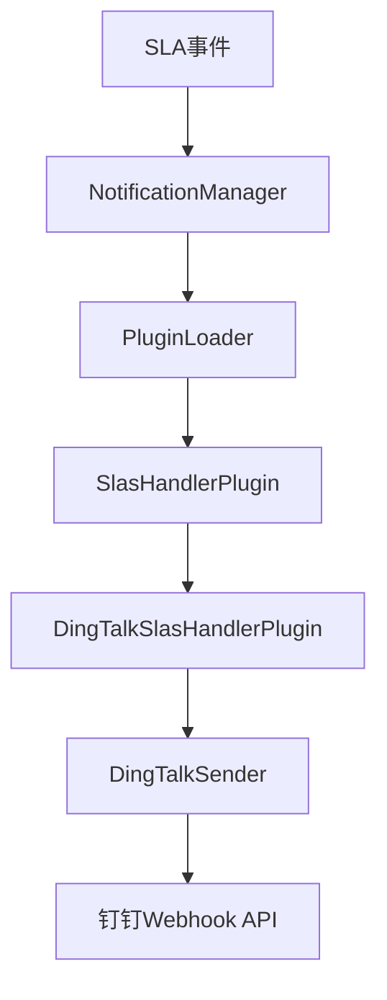
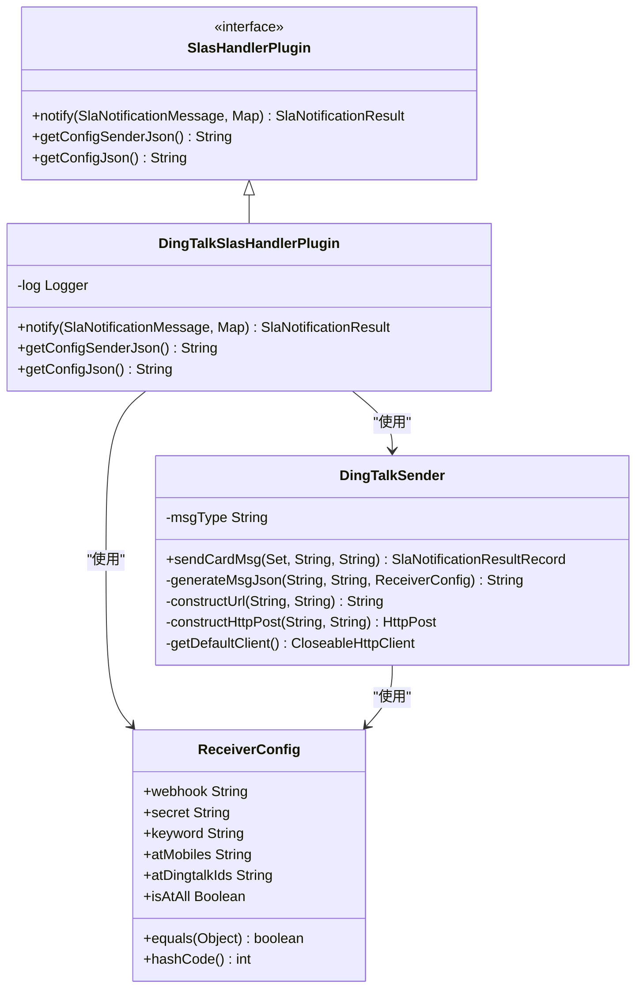
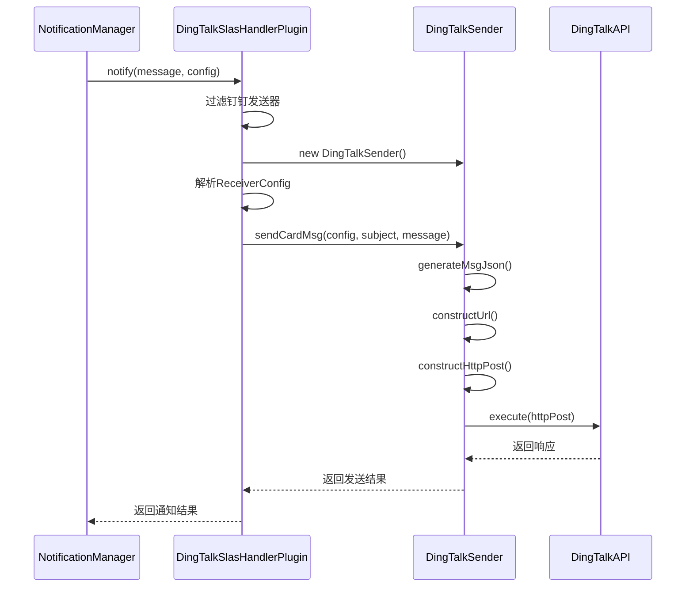
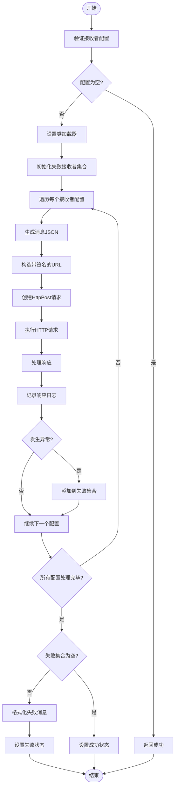
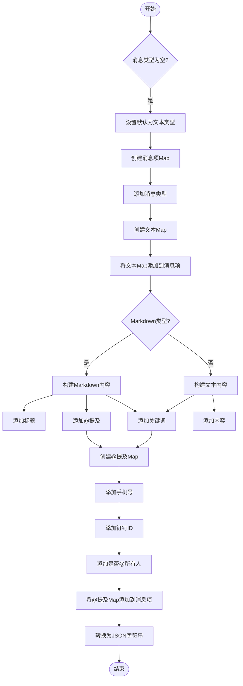
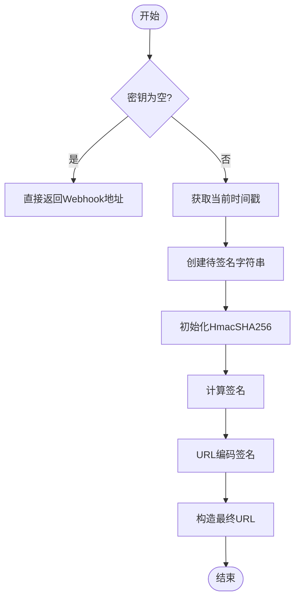
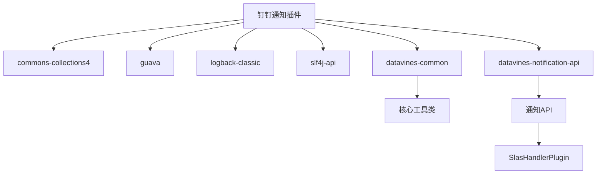

# 钉钉通知

<cite>
**本文档引用的文件**   
- [DingTalkSlasHandlerPlugin.java](file://datavines-notification\datavines-notification-plugins\datavines-notification-plugin-dingtalk\src\main\java\io\datavines\notification\plugin\dingtalk\DingTalkSlasHandlerPlugin.java)
- [DingTalkSender.java](file://datavines-notification\datavines-notification-plugins\datavines-notification-plugin-dingtalk\src\main\java\io\datavines\notification\plugin\dingtalk\DingTalkSender.java)
- [ReceiverConfig.java](file://datavines-notification\datavines-notification-plugins\datavines-notification-plugin-dingtalk\src\main\java\io\datavines\notification\plugin\dingtalk\entity\ReceiverConfig.java)
- [NotificationConfig.java](file://datavines-notification\datavines-notification-plugins\datavines-notification-plugin-dingtalk\src\main\java\io\datavines\notification\plugin\dingtalk\entity\NotificationConfig.java)
- [DingTalkConstants.java](file://datavines-notification\datavines-notification-plugins\datavines-notification-plugin-dingtalk\src\main\java\io\datavines\notification\plugin\dingtalk\DingTalkConstants.java)
- [SlasHandlerPlugin.java](file://datavines-notification\datavines-notification-api\src\main\java\io\datavines\notification\api\spi\SlasHandlerPlugin.java)
- [NotificationManager.java](file://datavines-notification\datavines-notification-core\src\main\java\io\datavines\notification\core\NotificationManager.java)
</cite>

## 目录
1. [简介](#简介)
2. [核心组件](#核心组件)
3. [架构概述](#架构概述)
4. [详细组件分析](#详细组件分析)
5. [依赖分析](#依赖分析)
6. [性能考虑](#性能考虑)
7. [故障排除指南](#故障排除指南)
8. [结论](#结论)

## 简介
本文档详细介绍了DataVines平台中钉钉通知插件的实现机制。该插件作为SPI（Service Provider Interface）实现，用于处理SLA（Service Level Agreement）事件并触发钉钉消息通知。文档将深入分析`DingTalkSlasHandlerPlugin`作为SPI实现的处理流程，`DingTalkSender`的消息发送实现，以及`NotificationConfig`配置实体的结构和参数。同时，文档还将提供钉钉通知的卡片消息模板设计、自定义消息内容配置和实际使用示例。

## 核心组件
钉钉通知插件的核心组件包括`DingTalkSlasHandlerPlugin`、`DingTalkSender`和`ReceiverConfig`等类。`DingTalkSlasHandlerPlugin`实现了`SlasHandlerPlugin` SPI接口，负责处理SLA事件并调用`DingTalkSender`发送消息。`DingTalkSender`类封装了与钉钉Webhook API交互的逻辑，包括消息格式构建、安全签名计算和HTTP请求发送。`ReceiverConfig`类定义了接收者配置，包括Webhook地址、安全密钥、@提及的手机号等参数。

**本节来源**
- [DingTalkSlasHandlerPlugin.java](file://datavines-notification\datavines-notification-plugins\datavines-notification-plugin-dingtalk\src\main\java\io\datavines\notification\plugin\dingtalk\DingTalkSlasHandlerPlugin.java)
- [DingTalkSender.java](file://datavines-notification\datavines-notification-plugins\datavines-notification-plugin-dingtalk\src\main\java\io\datavines\notification\plugin\dingtalk\DingTalkSender.java)
- [ReceiverConfig.java](file://datavines-notification\datavines-notification-plugins\datavines-notification-plugin-dingtalk\src\main\java\io\datavines\notification\plugin\dingtalk\entity\ReceiverConfig.java)

## 架构概述
钉钉通知插件的架构基于SPI机制，实现了松耦合的设计。`NotificationManager`作为通知系统的入口，通过`PluginLoader`加载所有实现了`SlasHandlerPlugin`接口的插件。当需要发送通知时，`NotificationManager`会根据配置的发送器类型找到对应的插件实例，并调用其`notify`方法。`DingTalkSlasHandlerPlugin`作为钉钉通知的具体实现，负责解析配置、构建消息并调用`DingTalkSender`完成实际的消息发送。

**图表来源**
- [NotificationManager.java](file://datavines-notification\datavines-notification-core\src\main\java\io\datavines\notification\core\NotificationManager.java)
- [SlasHandlerPlugin.java](file://datavines-notification\datavines-notification-api\src\main\java\io\datavines\notification\api\spi\SlasHandlerPlugin.java)
- [DingTalkSlasHandlerPlugin.java](file://datavines-notification\datavines-notification-plugins\datavines-notification-plugin-dingtalk\src\main\java\io\datavines\notification\plugin\dingtalk\DingTalkSlasHandlerPlugin.java)
- [DingTalkSender.java](file://datavines-notification\datavines-notification-plugins\datavines-notification-plugin-dingtalk\src\main\java\io\datavines\notification\plugin\dingtalk\DingTalkSender.java)

## 详细组件分析

### DingTalkSlasHandlerPlugin分析
`DingTalkSlasHandlerPlugin`是钉钉通知功能的核心实现类，它实现了`SlasHandlerPlugin` SPI接口。该类的主要职责是处理SLA通知消息，根据配置调用`DingTalkSender`发送钉钉消息。

#### 类图

**图表来源**
- [DingTalkSlasHandlerPlugin.java](file://datavines-notification\datavines-notification-plugins\datavines-notification-plugin-dingtalk\src\main\java\io\datavines\notification\plugin\dingtalk\DingTalkSlasHandlerPlugin.java)
- [DingTalkSender.java](file://datavines-notification\datavines-notification-plugins\datavines-notification-plugin-dingtalk\src\main\java\io\datavines\notification\plugin\dingtalk\DingTalkSender.java)
- [ReceiverConfig.java](file://datavines-notification\datavines-notification-plugins\datavines-notification-plugin-dingtalk\src\main\java\io\datavines\notification\plugin\dingtalk\entity\ReceiverConfig.java)
- [SlasHandlerPlugin.java](file://datavines-notification\datavines-notification-api\src\main\java\io\datavines\notification\api\spi\SlasHandlerPlugin.java)

#### 通知流程序列图

**图表来源**
- [DingTalkSlasHandlerPlugin.java](file://datavines-notification\datavines-notification-plugins\datavines-notification-plugin-dingtalk\src\main\java\io\datavines\notification\plugin\dingtalk\DingTalkSlasHandlerPlugin.java)
- [DingTalkSender.java](file://datavines-notification\datavines-notification-plugins\datavines-notification-plugin-dingtalk\src\main\java\io\datavines\notification\plugin\dingtalk\DingTalkSender.java)
- [NotificationManager.java](file://datavines-notification\datavines-notification-core\src\main\java\io\datavines\notification\core\NotificationManager.java)

**本节来源**
- [DingTalkSlasHandlerPlugin.java](file://datavines-notification\datavines-notification-plugins\datavines-notification-plugin-dingtalk\src\main\java\io\datavines\notification\plugin\dingtalk\DingTalkSlasHandlerPlugin.java)

### DingTalkSender实现分析
`DingTalkSender`类负责实现与钉钉Webhook API的具体交互，包括消息构建、安全签名计算和HTTP请求发送。

#### 消息发送流程图

**图表来源**
- [DingTalkSender.java](file://datavines-notification\datavines-notification-plugins\datavines-notification-plugin-dingtalk\src\main\java\io\datavines\notification\plugin\dingtalk\DingTalkSender.java)

#### 消息格式构建分析
`DingTalkSender`的`generateMsgJson`方法负责构建符合钉钉API要求的消息JSON。该方法支持两种消息类型：文本（text）和Markdown。消息内容根据接收者配置中的参数动态构建，包括标题、内容、关键词和@提及信息。

**图表来源**
- [DingTalkSender.java](file://datavines-notification\datavines-notification-plugins\datavines-notification-plugin-dingtalk\src\main\java\io\datavines\notification\plugin\dingtalk\DingTalkSender.java)

**本节来源**
- [DingTalkSender.java](file://datavines-notification\datavines-notification-plugins\datavines-notification-plugin-dingtalk\src\main\java\io\datavines\notification\plugin\dingtalk\DingTalkSender.java)

### NotificationConfig配置实体分析
`NotificationConfig`和`ReceiverConfig`类定义了钉钉通知的配置参数。`ReceiverConfig`是主要的配置实体，包含了与钉钉Webhook交互所需的所有参数。

#### 配置参数表
| 参数名称 | 参数说明 | 是否必填 | 默认值 | 安全验证 |
|--------|--------|--------|--------|--------|
| webhook | 钉钉群机器人Webhook地址 | 是 | 无 | IP白名单 |
| secret | 加签密钥 | 否 | 无 | HmacSHA256签名 |
| keyword | 关键词 | 否 | 无 | 需在机器人安全设置中配置 |
| atMobiles | @提及的手机号 | 否 | 无 | 需群成员手机号 |
| atDingtalkIds | @提及的钉钉ID | 否 | 无 | 需群成员钉钉ID |
| isAtAll | 是否@所有人 | 是 | FALSE | 需群管理员权限 |

**图表来源**
- [ReceiverConfig.java](file://datavines-notification\datavines-notification-plugins\datavines-notification-plugin-dingtalk\src\main\java\io\datavines\notification\plugin\dingtalk\entity\ReceiverConfig.java)
- [DingTalkSlasHandlerPlugin.java](file://datavines-notification\datavines-notification-plugins\datavines-notification-plugin-dingtalk\src\main\java\io\datavines\notification\plugin\dingtalk\DingTalkSlasHandlerPlugin.java)

#### 安全验证机制
钉钉通知支持多种安全验证机制，包括加签、IP白名单和关键词验证。`DingTalkSender`的`constructUrl`方法实现了加签机制，通过HmacSHA256算法计算签名，并将签名和时间戳拼接到Webhook URL上。

**图表来源**
- [DingTalkSender.java](file://datavines-notification\datavines-notification-plugins\datavines-notification-plugin-dingtalk\src\main\java\io\datavines\notification\plugin\dingtalk\DingTalkSender.java)

**本节来源**
- [ReceiverConfig.java](file://datavines-notification\datavines-notification-plugins\datavines-notification-plugin-dingtalk\src\main\java\io\datavines\notification\plugin\dingtalk\entity\ReceiverConfig.java)
- [DingTalkConstants.java](file://datavines-notification\datavines-notification-plugins\datavines-notification-plugin-dingtalk\src\main\java\io\datavines\notification\plugin\dingtalk\DingTalkConstants.java)

## 依赖分析
钉钉通知插件依赖于多个核心模块和第三方库。通过分析pom.xml文件，可以了解其依赖关系。

**图表来源**
- [pom.xml](file://datavines-notification\datavines-notification-plugins\datavines-notification-plugin-dingtalk\pom.xml)
- [datavines-common](file://datavines-common)
- [datavines-notification-api](file://datavines-notification\datavines-notification-api)

**本节来源**
- [pom.xml](file://datavines-notification\datavines-notification-plugins\datavines-notification-plugin-dingtalk\pom.xml)

## 性能考虑
钉钉通知插件在设计时考虑了性能和可靠性。`DingTalkSender`使用Apache HttpClient进行HTTP通信，并在每次发送后正确关闭连接。消息发送采用同步方式，确保消息按顺序发送。对于多个接收者，插件会逐个尝试发送，并记录失败的接收者，避免单个失败影响整体通知。

## 故障排除指南
### 常见问题及解决方案
1. **消息发送失败，返回310000错误**
   - 问题原因：未正确添加签名参数
   - 解决方案：确保在启用加签时，`constructUrl`方法正确计算并添加了sign和timestamp参数

2. **无法@提及群成员**
   - 问题原因：手机号或钉钉ID格式不正确
   - 解决方案：检查`atMobiles`和`atDingtalkIds`参数格式，多个ID用逗号分隔

3. **消息内容乱码**
   - 问题原因：字符编码问题
   - 解决方案：确保在`generateMsgJson`方法中正确使用UTF-8编码处理字符串

4. **连接超时**
   - 问题原因：网络问题或钉钉API响应慢
   - 解决方案：检查网络连接，考虑增加HTTP客户端的超时设置

**本节来源**
- [DingTalkSender.java](file://datavines-notification\datavines-notification-plugins\datavines-notification-plugin-dingtalk\src\main\java\io\datavines\notification\plugin\dingtalk\DingTalkSender.java)
- [DingTalkSlasHandlerPlugin.java](file://datavines-notification\datavines-notification-plugins\datavines-notification-plugin-dingtalk\src\main\java\io\datavines\notification\plugin\dingtalk\DingTalkSlasHandlerPlugin.java)

## 结论
钉钉通知插件通过SPI机制实现了灵活的通知功能，能够有效处理SLA事件并发送钉钉消息。插件设计考虑了安全性、可靠性和易用性，支持多种消息格式和安全验证机制。通过`DingTalkSlasHandlerPlugin`和`DingTalkSender`的协作，实现了从事件处理到消息发送的完整流程。未来可以考虑增加异步发送、消息队列支持和更丰富的消息模板等功能，进一步提升通知系统的性能和用户体验。