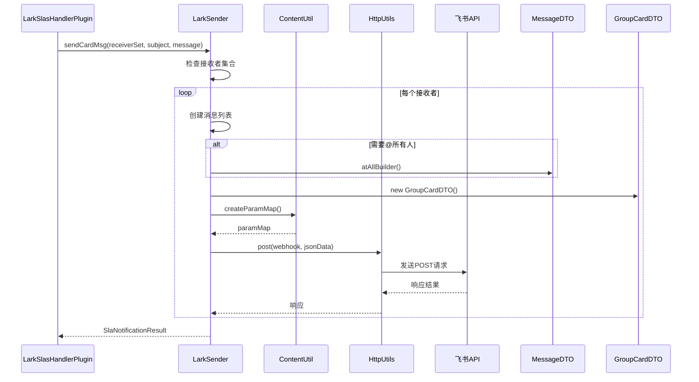
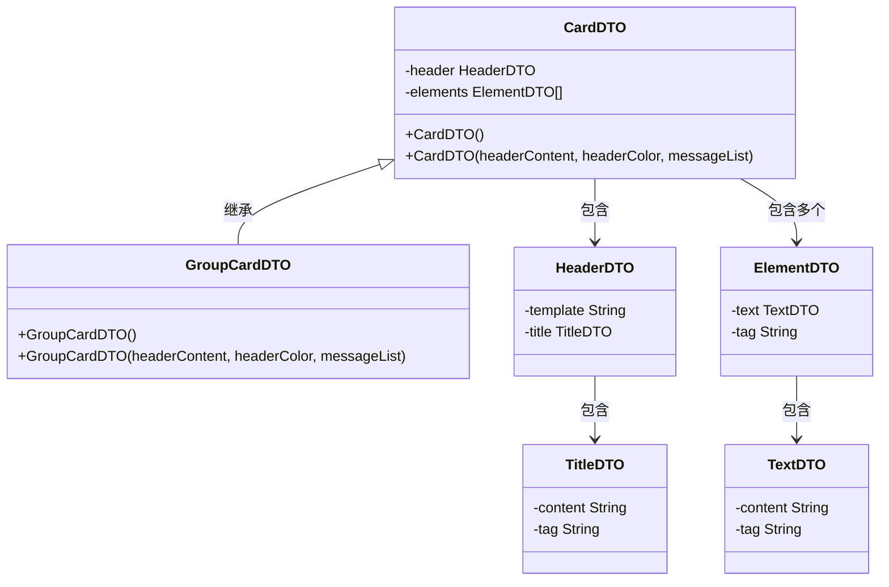
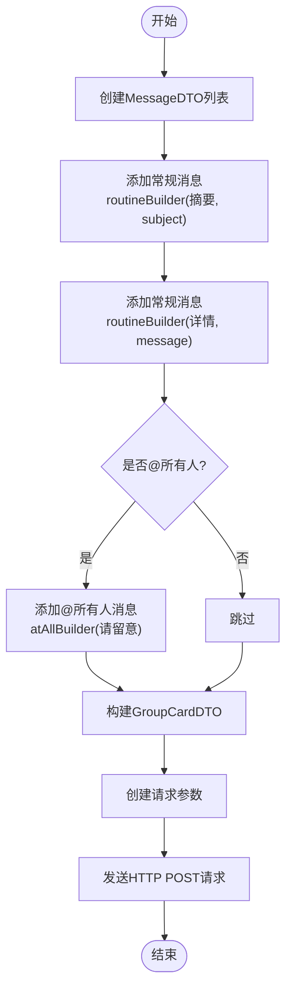

# 飞书通知

<cite>
**本文档引用文件**  
- [LarkSlasHandlerPlugin.java](file://datavines-notification/datavines-notification-plugins/datavines-notification-plugin-lark/src/main/java/io/datavines/notification/plugin/lark/LarkSlasHandlerPlugin.java)
- [LarkSender.java](file://datavines-notification/datavines-notification-plugins/datavines-notification-plugin-lark/src/main/java/io/datavines/notification/plugin/lark/LarkSender.java)
- [CardDTO.java](file://datavines-notification/datavines-notification-plugins/datavines-notification-plugin-lark/src/main/java/io/datavines/notification/plugin/lark/entity/CardDTO.java)
- [GroupCardDTO.java](file://datavines-notification/datavines-notification-plugins/datavines-notification-plugin-lark/src/main/java/io/datavines/notification/plugin/lark/entity/GroupCardDTO.java)
- [MessageDTO.java](file://datavines-notification/datavines-notification-plugins/datavines-notification-plugin-lark/src/main/java/io/datavines/notification/plugin/lark/entity/MessageDTO.java)
- [ReceiverConfig.java](file://datavines-notification/datavines-notification-plugins/datavines-notification-plugin-lark/src/main/java/io/datavines/notification/plugin/lark/entity/ReceiverConfig.java)
- [ContentUtil.java](file://datavines-notification/datavines-notification-plugins/datavines-notification-plugin-lark/src/main/java/io/datavines/notification/plugin/lark/util/ContentUtil.java)
- [LarkConstants.java](file://datavines-notification/datavines-notification-plugins/datavines-notification-plugin-lark/src/main/java/io/datavines/notification/plugin/lark/LarkConstants.java)
- [ElementDTO.java](file://datavines-notification/datavines-notification-plugins/datavines-notification-plugin-lark/src/main/java/io/datavines/notification/plugin/lark/entity/card/ElementDTO.java)
- [HeaderDTO.java](file://datavines-notification/datavines-notification-plugins/datavines-notification-plugin-lark/src/main/java/io/datavines/notification/plugin/lark/entity/card/HeaderDTO.java)
- [TextDTO.java](file://datavines-notification/datavines-notification-plugins/datavines-notification-plugin-lark/src/main/java/io/datavines/notification/plugin/lark/entity/card/TextDTO.java)
- [TitleDTO.java](file://datavines-notification/datavines-notification-plugins/datavines-notification-plugin-lark/src/main/java/io/datavines/notification/plugin/lark/entity/card/TitleDTO.java)
- [io.datavines.notification.api.spi.SlasHandlerPlugin](file://datavines-notification/datavines-notification-plugins/datavines-notification-plugin-lark/src/main/resources/META-INF/plugins/io.datavines.notification.api.spi.SlasHandlerPlugin)
</cite>

## 目录
1. [简介](#简介)
2. [核心组件](#核心组件)
3. [SPI接口实现](#spi接口实现)
4. [消息发送机制](#消息发送机制)
5. [数据结构设计](#数据结构设计)
6. [消息内容组织](#消息内容组织)
7. [飞书Webhook配置](#飞书webhook配置)
8. [错误处理与响应](#错误处理与响应)

## 简介
飞书通知插件是DataVines系统中的一个重要组件，用于在数据质量监控过程中触发SLA事件时向飞书群组发送告警消息。该插件通过实现SPI接口，支持飞书卡片消息（Card）的构建与发送，具备灵活的配置选项和可扩展的消息模板设计。

## 核心组件

飞书通知插件的核心由以下几个关键类构成：
- `LarkSlasHandlerPlugin`：实现SPI接口，处理SLA事件并调用发送器
- `LarkSender`：负责实际的飞书消息发送逻辑
- `CardDTO`及其子类：定义飞书卡片消息的数据结构
- `MessageDTO`：封装消息内容的标题与正文
- `ReceiverConfig`：存储接收方配置信息，如Webhook地址和@所有人设置

**核心组件来源**
- [LarkSlasHandlerPlugin.java](file://datavines-notification/datavines-notification-plugins/datavines-notification-plugin-lark/src/main/java/io/datavines/notification/plugin/lark/LarkSlasHandlerPlugin.java)
- [LarkSender.java](file://datavines-notification/datavines-notification-plugins/datavines-notification-plugin-lark/src/main/java/io/datavines/notification/plugin/lark/LarkSender.java)
- [CardDTO.java](file://datavines-notification/datavines-notification-plugins/datavines-notification-plugin-lark/src/main/java/io/datavines/notification/plugin/lark/entity/CardDTO.java)
- [MessageDTO.java](file://datavines-notification/datavines-notification-plugins/datavines-notification-plugin-lark/src/main/java/io/datavines/notification/plugin/lark/entity/MessageDTO.java)
- [ReceiverConfig.java](file://datavines-notification/datavines-notification-plugins/datavines-notification-plugin-lark/src/main/java/io/datavines/notification/plugin/lark/entity/ReceiverConfig.java)

## SPI接口实现

`LarkSlasHandlerPlugin`类实现了`SlasHandlerPlugin`接口，作为服务提供者接口（SPI）的实现类，负责处理SLA告警事件。

该类通过`notify`方法接收告警消息和配置信息，筛选出类型为"lark"的通知渠道，并为每个飞书接收组创建`LarkSender`实例进行消息发送。

插件还提供了`getConfigJson`方法，定义了飞书通知所需的配置参数，包括：
- `webhook`：飞书群机器人Webhook地址
- `atAll`：是否@所有人，支持"是"和"否"两个选项

插件通过`META-INF/plugins/io.datavines.notification.api.spi.SlasHandlerPlugin`文件注册，内容为`lark=io.datavines.notification.plugin.lark.LarkSlasHandlerPlugin`，实现了SPI机制的自动发现。

```mermaid
classDiagram
class SlasHandlerPlugin {
<<interface>>
+notify(SlaNotificationMessage, Map) SlaNotificationResult
+getConfigSenderJson() String
+getConfigJson() String
}
class LarkSlasHandlerPlugin {
-log Logger
+notify(SlaNotificationMessage, Map) SlaNotificationResult
+getConfigSenderJson() String
+getConfigJson() String
}
LarkSlasHandlerPlugin --|> SlasHandlerPlugin : 实现
note right of LarkSlasHandlerPlugin
实现SPI接口，处理飞书告警
- 通过webhook发送消息
- 支持@所有人功能
- 配置JSON生成
end note
```

**图示来源**
- [LarkSlasHandlerPlugin.java](file://datavines-notification/datavines-notification-plugins/datavines-notification-plugin-lark/src/main/java/io/datavines/notification/plugin/lark/LarkSlasHandlerPlugin.java)
- [io.datavines.notification.api.spi.SlasHandlerPlugin](file://datavines-notification/datavines-notification-plugins/datavines-notification-plugin-lark/src/main/resources/META-INF/plugins/io.datavines.notification.api.spi.SlasHandlerPlugin)

## 消息发送机制

`LarkSender`类负责具体的飞书消息发送逻辑。其核心方法`sendCardMsg`接收接收者配置集合、消息主题和内容，构建并发送飞书卡片消息。

发送流程如下：
1. 检查接收者集合是否为空，若为空则直接返回
2. 为每个接收者配置创建消息列表
3. 根据配置决定是否添加@所有人消息
4. 构建`GroupCardDTO`卡片对象
5. 使用`ContentUtil`创建请求参数映射
6. 通过HTTP POST请求发送到飞书Webhook

消息发送采用线程安全的方式，设置当前线程的类加载器以确保类路径正确。发送失败时会记录失败的接收者，并在最终结果中返回错误信息。



**图示来源**
- [LarkSender.java](file://datavines-notification/datavines-notification-plugins/datavines-notification-plugin-lark/src/main/java/io/datavines/notification/plugin/lark/LarkSender.java)
- [ContentUtil.java](file://datavines-notification/datavines-notification-plugins/datavines-notification-plugin-lark/src/main/java/io/datavines/notification/plugin/lark/util/ContentUtil.java)

## 数据结构设计

飞书通知插件采用分层的数据结构设计来构建卡片消息。

`CardDTO`是抽象基类，定义了卡片的基本结构，包含：
- `header`：卡片头部，类型为`HeaderDTO`
- `elements`：元素列表，类型为`ElementDTO`数组

`GroupCardDTO`继承自`CardDTO`，提供具体的构造函数实现。

`HeaderDTO`包含：
- `template`：头部模板颜色
- `title`：标题对象，类型为`TitleDTO`

`ElementDTO`表示卡片中的每个元素，包含：
- `text`：文本内容，类型为`TextDTO`
- `tag`：元素标签，固定为"div"

`TextDTO`和`TitleDTO`结构相似，都包含`content`和`tag`两个字段，分别表示内容文本和内容类型。



**图示来源**
- [CardDTO.java](file://datavines-notification/datavines-notification-plugins/datavines-notification-plugin-lark/src/main/java/io/datavines/notification/plugin/lark/entity/CardDTO.java)
- [GroupCardDTO.java](file://datavines-notification/datavines-notification-plugins/datavines-notification-plugin-lark/src/main/java/io/datavines/notification/plugin/lark/entity/GroupCardDTO.java)
- [HeaderDTO.java](file://datavines-notification/datavines-notification-plugins/datavines-notification-plugin-lark/src/main/java/io/datavines/notification/plugin/lark/entity/card/HeaderDTO.java)
- [ElementDTO.java](file://datavines-notification/datavines-notification-plugins/datavines-notification-plugin-lark/src/main/java/io/datavines/notification/plugin/lark/entity/card/ElementDTO.java)
- [TextDTO.java](file://datavines-notification/datavines-notification-plugins/datavines-notification-plugin-lark/src/main/java/io/datavines/notification/plugin/lark/entity/card/TextDTO.java)
- [TitleDTO.java](file://datavines-notification/datavines-notification-plugins/datavines-notification-plugin-lark/src/main/java/io/datavines/notification/plugin/lark/entity/card/TitleDTO.java)

## 消息内容组织

消息内容通过`MessageDTO`类进行组织，该类使用Builder模式提供了多种静态工厂方法来创建不同类型的消息：

- `routineBuilder`：创建常规消息，包含标题和普通内容
- `atBuilder`：创建@指定用户的消息
- `atAllBuilder`：创建@所有人的消息
- `atListBuilder`：创建@用户列表的消息

在`CardDTO`的构造函数中，这些`MessageDTO`对象会被转换为飞书卡片的元素。每个消息的标题会以加粗形式显示（使用`**`标记），后跟中文冒号，然后是消息内容。

卡片头部使用预定义的标题"【数据质量告警】"和红色模板，通过`alarmTitle`和`alarmColor`字段配置。

消息内容采用飞书的lark_md格式，支持基本的Markdown语法，使消息呈现更加清晰和结构化。



**图示来源**
- [MessageDTO.java](file://datavines-notification/datavines-notification-plugins/datavines-notification-plugin-lark/src/main/java/io/datavines/notification/plugin/lark/entity/MessageDTO.java)
- [CardDTO.java](file://datavines-notification/datavines-notification-plugins/datavines-notification-plugin-lark/src/main/java/io/datavines/notification/plugin/lark/entity/CardDTO.java)
- [LarkSender.java](file://datavines-notification/datavines-notification-plugins/datavines-notification-plugin-lark/src/main/java/io/datavines/notification/plugin/lark/LarkSender.java)

## 飞书Webhook配置

飞书通知插件通过Webhook机制与飞书API进行通信。配置主要包括以下参数：

- **Webhook URL**：飞书群机器人的Webhook地址，用于发送消息
- **@所有人**：布尔值，决定是否在消息中@群内所有成员

Webhook URL的格式为`https://open.feishu.cn/open-apis/bot/v2/hook/{token}`，其中`token`是飞书机器人生成的唯一标识。

在代码中，这些配置通过`ReceiverConfig`类进行管理，包含`groupName`、`webhook`和`atAll`三个字段。配置信息以JSON格式存储，并在发送消息时解析。

插件使用`LarkConstants`类定义了飞书API的相关常量，包括消息类型（interactive）、消息体字段名（msg_type, card）等，确保与飞书API的兼容性。

**配置来源**
- [ReceiverConfig.java](file://datavines-notification/datavines-notification-plugins/datavines-notification-plugin-lark/src/main/java/io/datavines/notification/plugin/lark/entity/ReceiverConfig.java)
- [LarkConstants.java](file://datavines-notification/datavines-notification-plugins/datavines-notification-plugin-lark/src/main/java/io/datavines/notification/plugin/lark/LarkConstants.java)
- [LarkSlasHandlerPlugin.java](file://datavines-notification/datavines-notification-plugins/datavines-notification-plugin-lark/src/main/java/io/datavines/notification/plugin/lark/LarkSlasHandlerPlugin.java)

## 错误处理与响应

插件实现了完善的错误处理机制，确保在发送失败时能够提供有用的反馈信息。

`LarkSender`在发送消息时使用try-catch块捕获所有异常，将发送失败的接收者添加到`failToReceivers`集合中。发送完成后，如果存在失败的接收者，会构造包含失败组名的错误消息，并将结果状态设置为false。

`SlaNotificationResult`对象包含整体状态和详细的记录列表，每个记录对应一个通知渠道的发送结果。这种设计使得系统能够精确地追踪每个告警的发送状态。

HTTP请求使用`HttpUtils.post`方法发送，该方法会处理底层的网络通信。虽然当前代码没有显式处理飞书API的特定错误码，但通过捕获异常和记录错误日志，为后续的错误码处理提供了基础。

日志记录使用SLF4J框架，错误信息会包含完整的异常堆栈，便于问题排查和系统监控。

**错误处理来源**
- [LarkSender.java](file://datavines-notification/datavines-notification-plugins/datavines-notification-plugin-lark/src/main/java/io/datavines/notification/plugin/lark/LarkSender.java)
- [LarkSlasHandlerPlugin.java](file://datavines-notification/datavines-notification-plugins/datavines-notification-plugin-lark/src/main/java/io/datavines/notification/plugin/lark/LarkSlasHandlerPlugin.java)