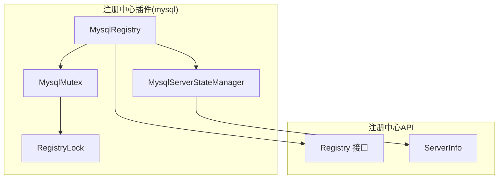
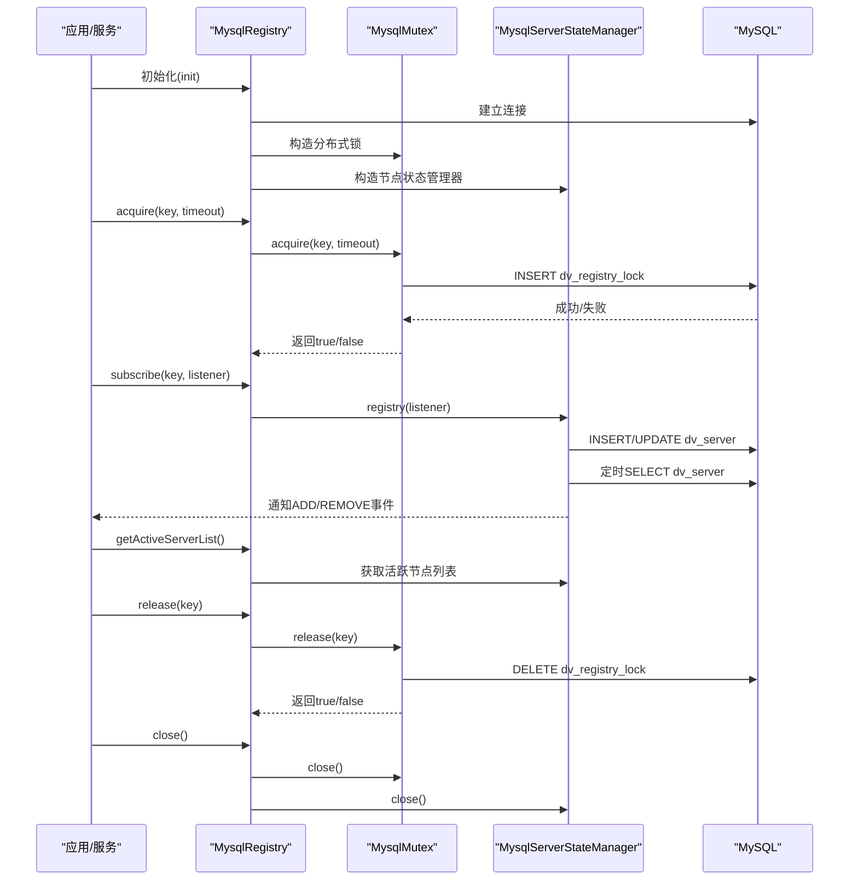
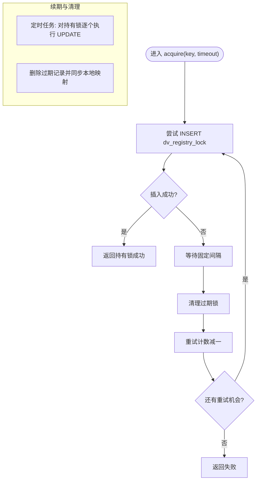
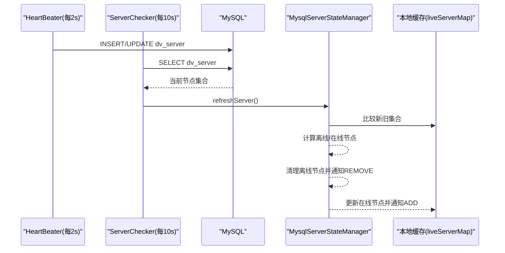
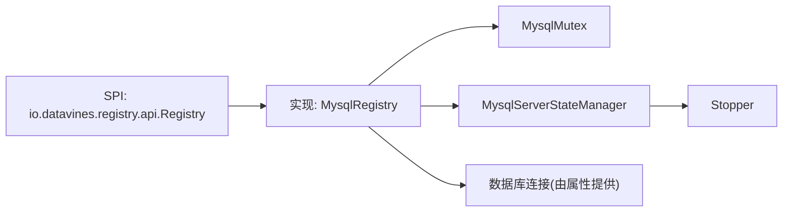

# MySQL注册中心

<cite>
**本文引用的文件列表**
- [MysqlRegistry.java](file://datavines-registry/datavines-registry-plugins/datavines-registry-mysql/src/main/java/io/datavines/registry/plugin/MysqlRegistry.java)
- [MysqlMutex.java](file://datavines-registry/datavines-registry-plugins/datavines-registry-mysql/src/main/java/io/datavines/registry/plugin/MysqlMutex.java)
- [MysqlServerStateManager.java](file://datavines-registry/datavines-registry-plugins/datavines-registry-mysql/src/main/java/io/datavines/registry/plugin/MysqlServerStateManager.java)
- [RegistryLock.java](file://datavines-registry/datavines-registry-plugins/datavines-registry-mysql/src/main/java/io/datavines/registry/plugin/RegistryLock.java)
- [Registry.java](file://datavines-registry/datavines-registry-api/src/main/java/io/datavines/registry/api/Registry.java)
- [ServerInfo.java](file://datavines-registry/datavines-registry-api/src/main/java/io/datavines/registry/api/ServerInfo.java)
- [application.yaml](file://datavines-server/src/main/resources/application.yaml)
- [datavines-mysql.sql](file://scripts/sql/datavines-mysql.sql)
- [Stopper.java](file://datavines-common/src/main/java/io/datavines/common/utils/Stopper.java)
- [io.datavines.registry.api.Registry](file://datavines-registry/datavines-registry-plugins/datavines-registry-mysql/src/main/resources/META-INF/plugins/io.datavines.registry.api.Registry)
</cite>

## 目录
1. [简介](#简介)
2. [项目结构](#项目结构)
3. [核心组件](#核心组件)
4. [架构总览](#架构总览)
5. [组件详解](#组件详解)
6. [依赖关系分析](#依赖关系分析)
7. [性能与可靠性特性](#性能与可靠性特性)
8. [故障排查指南](#故障排查指南)
9. [结论](#结论)
10. [附录：数据库表结构与配置](#附录数据库表结构与配置)

## 简介
本文件系统性阐述基于MySQL实现的注册中心，重点说明MysqlRegistry如何通过数据库完成服务注册与发现、心跳与租约管理、节点状态同步，以及分布式锁（MysqlMutex与RegistryLock）的工作原理。同时给出数据库表结构、配置要点、使用建议与常见问题排查方法，帮助读者快速理解并安全地在生产环境中部署与运维。

## 项目结构
MySQL注册中心位于“datavines-registry-plugins/datavines-registry-mysql”模块，核心代码围绕三个关键类展开：
- MysqlRegistry：对外暴露的注册中心实现，聚合分布式锁与节点状态管理能力
- MysqlMutex：基于数据库的分布式互斥锁，负责锁的申请、续期与过期清理
- MysqlServerStateManager：基于数据库的服务节点注册与发现，负责心跳、节点存活检测与事件通知

图表来源
- [MysqlRegistry.java](file://datavines-registry/datavines-registry-plugins/datavines-registry-mysql/src/main/java/io/datavines/registry/plugin/MysqlRegistry.java#L1-L107)
- [MysqlMutex.java](file://datavines-registry/datavines-registry-plugins/datavines-registry-mysql/src/main/java/io/datavines/registry/plugin/MysqlMutex.java#L1-L218)
- [MysqlServerStateManager.java](file://datavines-registry/datavines-registry-plugins/datavines-registry-mysql/src/main/java/io/datavines/registry/plugin/MysqlServerStateManager.java#L1-L257)
- [RegistryLock.java](file://datavines-registry/datavines-registry-plugins/datavines-registry-mysql/src/main/java/io/datavines/registry/plugin/RegistryLock.java#L1-L36)
- [Registry.java](file://datavines-registry/datavines-registry-api/src/main/java/io/datavines/registry/api/Registry.java#L1-L44)
- [ServerInfo.java](file://datavines-registry/datavines-registry-api/src/main/java/io/datavines/registry/api/ServerInfo.java#L1-L49)

章节来源
- [MysqlRegistry.java](file://datavines-registry/datavines-registry-plugins/datavines-registry-mysql/src/main/java/io/datavines/registry/plugin/MysqlRegistry.java#L1-L107)
- [MysqlMutex.java](file://datavines-registry/datavines-registry-plugins/datavines-registry-mysql/src/main/java/io/datavines/registry/plugin/MysqlMutex.java#L1-L218)
- [MysqlServerStateManager.java](file://datavines-registry/datavines-registry-plugins/datavines-registry-mysql/src/main/java/io/datavines/registry/plugin/MysqlServerStateManager.java#L1-L257)
- [Registry.java](file://datavines-registry/datavines-registry-api/src/main/java/io/datavines/registry/api/Registry.java#L1-L44)
- [ServerInfo.java](file://datavines-registry/datavines-registry-api/src/main/java/io/datavines/registry/api/ServerInfo.java#L1-L49)

## 核心组件
- MysqlRegistry：实现Registry接口，负责初始化数据库连接、持有MysqlMutex与MysqlServerStateManager实例，并将上层调用委托给这两个组件；提供订阅/取消订阅、获取活跃节点列表、关闭资源等能力。
- MysqlMutex：基于数据库的分布式锁，支持按key申请锁、定时续期、过期清理；内部维护“持有锁”的本地映射，避免重复加锁。
- MysqlServerStateManager：基于数据库的节点注册与发现，周期性发送心跳、定期检查节点存活、对比新旧节点集合触发ADD/REMOVE事件通知。
- RegistryLock：锁持有者的轻量数据模型，包含锁键、持有者地址与更新时间。
- ServerInfo：节点信息模型，包含主机、端口、创建/更新时间及统一地址格式。

章节来源
- [MysqlRegistry.java](file://datavines-registry/datavines-registry-plugins/datavines-registry-mysql/src/main/java/io/datavines/registry/plugin/MysqlRegistry.java#L1-L107)
- [MysqlMutex.java](file://datavines-registry/datavines-registry-plugins/datavines-registry-mysql/src/main/java/io/datavines/registry/plugin/MysqlMutex.java#L1-L218)
- [MysqlServerStateManager.java](file://datavines-registry/datavines-registry-plugins/datavines-registry-mysql/src/main/java/io/datavines/registry/plugin/MysqlServerStateManager.java#L1-L257)
- [RegistryLock.java](file://datavines-registry/datavines-registry-plugins/datavines-registry-mysql/src/main/java/io/datavines/registry/plugin/RegistryLock.java#L1-L36)
- [ServerInfo.java](file://datavines-registry/datavines-registry-api/src/main/java/io/datavines/registry/api/ServerInfo.java#L1-L49)

## 架构总览
MySQL注册中心通过两套机制协同工作：
- 分布式锁：基于表dv_registry_lock实现互斥，保障同一时刻只有一个节点持有某个逻辑锁
- 节点注册与发现：基于表dv_server实现节点登记与心跳，结合定时任务进行存活检测与事件通知

图表来源
- [MysqlRegistry.java](file://datavines-registry/datavines-registry-plugins/datavines-registry-mysql/src/main/java/io/datavines/registry/plugin/MysqlRegistry.java#L1-L107)
- [MysqlMutex.java](file://datavines-registry/datavines-registry-plugins/datavines-registry-mysql/src/main/java/io/datavines/registry/plugin/MysqlMutex.java#L1-L218)
- [MysqlServerStateManager.java](file://datavines-registry/datavines-registry-plugins/datavines-registry-mysql/src/main/java/io/datavines/registry/plugin/MysqlServerStateManager.java#L1-L257)

## 组件详解

### MysqlRegistry：注册中心入口
- 初始化：从传入的属性中获取数据库连接，构造MysqlMutex与MysqlServerStateManager
- 分布式锁：委托给MysqlMutex的acquire/release
- 订阅/取消订阅：委托给MysqlServerStateManager的registry/unRegistry
- 节点列表：委托给MysqlServerStateManager的getActiveServerList
- 关闭：依次关闭MysqlMutex与MysqlServerStateManager持有的数据库连接

章节来源
- [MysqlRegistry.java](file://datavines-registry/datavines-registry-plugins/datavines-registry-mysql/src/main/java/io/datavines/registry/plugin/MysqlRegistry.java#L1-L107)

### MysqlMutex：基于数据库的分布式锁
- 锁模型：以“键-持有者-更新时间”三元组存入表dv_registry_lock，唯一索引保证同一时刻仅一个持有者
- 申请流程：尝试INSERT，若冲突则按固定间隔重试，直至成功或超时
- 续期机制：单线程定时任务每2秒对持有锁的键执行UPDATE，延长update_time
- 过期清理：删除update_time早于阈值的记录，并同步清理本地持有映射
- 释放：DELETE对应键，移除本地持有映射
- 连接管理：检查连接有效性，必要时重建连接

图表来源
- [MysqlMutex.java](file://datavines-registry/datavines-registry-plugins/datavines-registry-mysql/src/main/java/io/datavines/registry/plugin/MysqlMutex.java#L1-L218)

章节来源
- [MysqlMutex.java](file://datavines-registry/datavines-registry-plugins/datavines-registry-mysql/src/main/java/io/datavines/registry/plugin/MysqlMutex.java#L1-L218)
- [RegistryLock.java](file://datavines-registry/datavines-registry-plugins/datavines-registry-mysql/src/main/java/io/datavines/registry/plugin/RegistryLock.java#L1-L36)

### MysqlServerStateManager：节点注册与发现
- 节点登记：首次注册时INSERT，否则UPDATE，保持update_time最新
- 心跳：HeartBeater线程每2秒执行一次登记/更新
- 存活检测：ServerChecker线程每10秒扫描当前所有节点，依据update_time判断离线
- 事件通知：对比新旧节点集合，对新增/移除分别触发ADD/REMOVE事件
- 节点列表：返回本地缓存的活跃节点列表

图表来源
- [MysqlServerStateManager.java](file://datavines-registry/datavines-registry-plugins/datavines-registry-mysql/src/main/java/io/datavines/registry/plugin/MysqlServerStateManager.java#L1-L257)

章节来源
- [MysqlServerStateManager.java](file://datavines-registry/datavines-registry-plugins/datavines-registry-mysql/src/main/java/io/datavines/registry/plugin/MysqlServerStateManager.java#L1-L257)

### RegistryLock：锁持有者数据模型
- 字段：lockKey、lockOwner、updateTime
- 用途：配合MysqlMutex的持有映射，用于续期与过期清理

章节来源
- [RegistryLock.java](file://datavines-registry/datavines-registry-plugins/datavines-registry-mysql/src/main/java/io/datavines/registry/plugin/RegistryLock.java#L1-L36)

### ServerInfo：节点信息模型
- 字段：host、serverPort、createTime、updateTime
- 方法：getAddr()返回“host:port”统一地址格式

章节来源
- [ServerInfo.java](file://datavines-registry/datavines-registry-api/src/main/java/io/datavines/registry/api/ServerInfo.java#L1-L49)

## 依赖关系分析
- SPI绑定：通过META-INF/plugins/io.datavines.registry.api.Registry将“mysql”别名绑定到MysqlRegistry实现
- 运行时配置：应用通过application.yaml加载MySQL驱动与连接参数，供MysqlRegistry初始化数据库连接
- 停止信号：Stopper提供全局停止标志，HeartBeater/ServerChecker在停止状态下不再执行

图表来源
- [io.datavines.registry.api.Registry](file://datavines-registry/datavines-registry-plugins/datavines-registry-mysql/src/main/resources/META-INF/plugins/io.datavines.registry.api.Registry#L1-L1)
- [MysqlRegistry.java](file://datavines-registry/datavines-registry-plugins/datavines-registry-mysql/src/main/java/io/datavines/registry/plugin/MysqlRegistry.java#L1-L107)
- [application.yaml](file://datavines-server/src/main/resources/application.yaml#L84-L96)
- [Stopper.java](file://datavines-common/src/main/java/io/datavines/common/utils/Stopper.java#L1-L40)

章节来源
- [io.datavines.registry.api.Registry](file://datavines-registry/datavines-registry-plugins/datavines-registry-mysql/src/main/resources/META-INF/plugins/io.datavines.registry.api.Registry#L1-L1)
- [application.yaml](file://datavines-server/src/main/resources/application.yaml#L84-L96)
- [Stopper.java](file://datavines-common/src/main/java/io/datavines/common/utils/Stopper.java#L1-L40)

## 性能与可靠性特性
- 锁续期频率：每2秒一次，确保在高并发下减少锁竞争；过期窗口为固定阈值，避免长时间占用
- 心跳频率：每2秒一次，存活判定窗口为20秒，兼顾实时性与数据库压力
- 数据库压力控制：锁续期与心跳均为轻量写操作；ServerChecker仅在固定间隔扫描，避免频繁查询
- 连接健壮性：MysqlMutex/MysqlServerStateManager在执行SQL前检查连接有效性，必要时重建连接
- 事件幂等：通过唯一索引与去重逻辑，避免重复ADD/REMOVE事件

章节来源
- [MysqlMutex.java](file://datavines-registry/datavines-registry-plugins/datavines-registry-mysql/src/main/java/io/datavines/registry/plugin/MysqlMutex.java#L1-L218)
- [MysqlServerStateManager.java](file://datavines-registry/datavines-registry-plugins/datavines-registry-mysql/src/main/java/io/datavines/registry/plugin/MysqlServerStateManager.java#L1-L257)

## 故障排查指南
- 无法建立数据库连接
  - 检查application.yaml中的MySQL驱动、URL、账号密码是否正确
  - 确认网络连通性与防火墙策略
  - 参考：[application.yaml](file://datavines-server/src/main/resources/application.yaml#L84-L96)
- 锁无法获取/频繁失败
  - 观察是否存在大量竞争；适当增大超时或降低竞争范围
  - 检查数据库慢查询与锁表情况
  - 参考：[MysqlMutex.java](file://datavines-registry/datavines-registry-plugins/datavines-registry-mysql/src/main/java/io/datavines/registry/plugin/MysqlMutex.java#L1-L218)
- 节点未及时下线
  - 检查ServerChecker扫描间隔与心跳间隔设置是否合理
  - 确认Stopper未被置为停止状态
  - 参考：[MysqlServerStateManager.java](file://datavines-registry/datavines-registry-plugins/datavines-registry-mysql/src/main/java/io/datavines/registry/plugin/MysqlServerStateManager.java#L1-L257)，[Stopper.java](file://datavines-common/src/main/java/io/datavines/common/utils/Stopper.java#L1-L40)
- 事件风暴或重复通知
  - 检查本地缓存与去重逻辑，确认ADD/REMOVE触发条件
  - 参考：[MysqlServerStateManager.java](file://datavines-registry/datavines-registry-plugins/datavines-registry-mysql/src/main/java/io/datavines/registry/plugin/MysqlServerStateManager.java#L1-L257)

章节来源
- [application.yaml](file://datavines-server/src/main/resources/application.yaml#L84-L96)
- [MysqlMutex.java](file://datavines-registry/datavines-registry-plugins/datavines-registry-mysql/src/main/java/io/datavines/registry/plugin/MysqlMutex.java#L1-L218)
- [MysqlServerStateManager.java](file://datavines-registry/datavines-registry-plugins/datavines-registry-mysql/src/main/java/io/datavines/registry/plugin/MysqlServerStateManager.java#L1-L257)
- [Stopper.java](file://datavines-common/src/main/java/io/datavines/common/utils/Stopper.java#L1-L40)

## 结论
MySQL注册中心通过“数据库表+定时任务”的方式，实现了可靠的分布式锁与节点注册发现能力。其优势在于实现简单、可移植性强、无需额外中间件；但同时也存在数据库写压力、锁竞争与一致性边界等挑战。建议在生产中结合业务规模评估锁竞争、心跳与检查频率，并做好数据库监控与慢查询治理。

## 附录：数据库表结构与配置

### 数据库表结构
- dv_server：集群节点登记表，包含host、port、create_time、update_time
- dv_registry_lock：注册锁表，包含lock_key、lock_owner、create_time、update_time

章节来源
- [datavines-mysql.sql](file://scripts/sql/datavines-mysql.sql#L677-L703)

### 配置指南
- 启用MySQL注册中心
  - 在应用配置中切换到MySQL Profile，设置正确的MySQL驱动与连接参数
  - 参考：[application.yaml](file://datavines-server/src/main/resources/application.yaml#L84-L96)
- 注册中心实现绑定
  - 通过SPI将“mysql”别名绑定到MysqlRegistry实现
  - 参考：[io.datavines.registry.api.Registry](file://datavines-registry/datavines-registry-plugins/datavines-registry-mysql/src/main/resources/META-INF/plugins/io.datavines.registry.api.Registry#L1-L1)
- 运行时行为
  - 心跳与检查间隔、锁续期频率、过期窗口等均在代码中硬编码，如需调整请修改相应实现
  - 参考：[MysqlMutex.java](file://datavines-registry/datavines-registry-plugins/datavines-registry-mysql/src/main/java/io/datavines/registry/plugin/MysqlMutex.java#L1-L218)，[MysqlServerStateManager.java](file://datavines-registry/datavines-registry-plugins/datavines-registry-mysql/src/main/java/io/datavines/registry/plugin/MysqlServerStateManager.java#L1-L257)