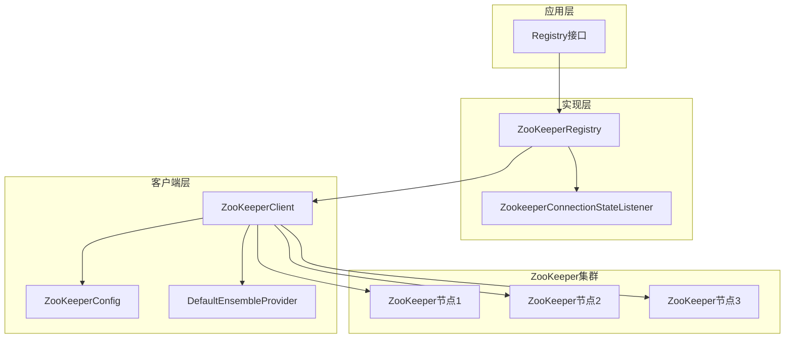
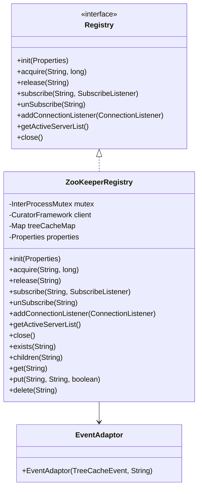
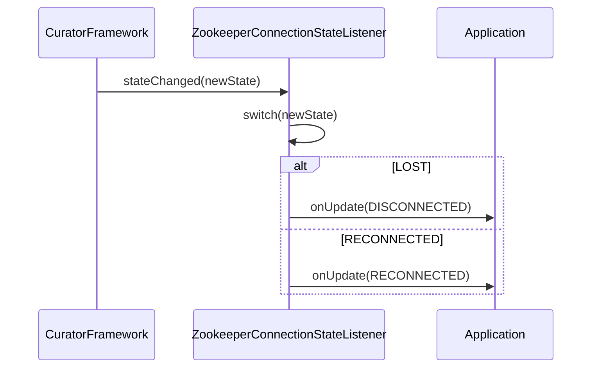
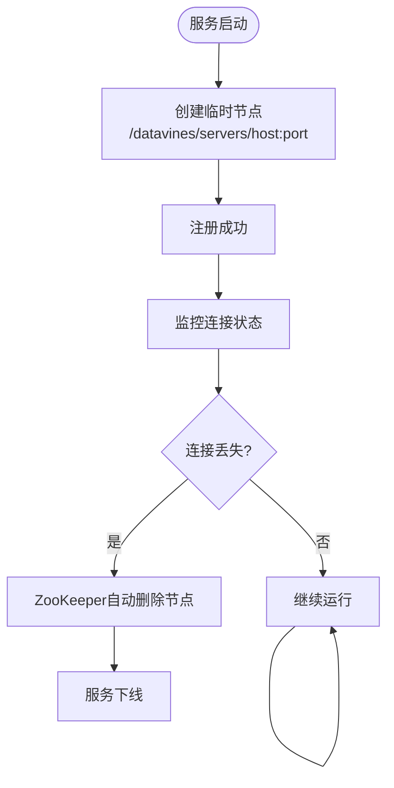
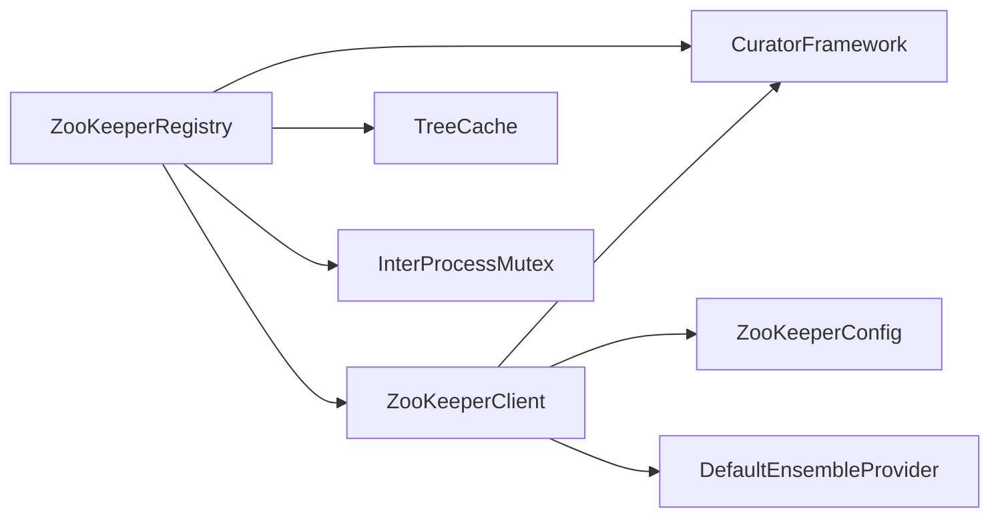
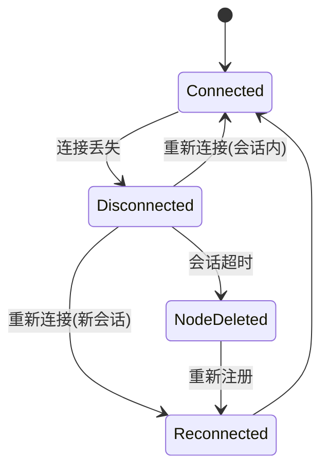

# ZooKeeper注册中心

<cite>
**本文档引用的文件**  
- [ZooKeeperRegistry.java](file://datavines-registry\datavines-registry-plugins\datavines-registry-zookeeper\src\main\java\io\datavines\registry\plugin\ZooKeeperRegistry.java)
- [ZookeeperConnectionStateListener.java](file://datavines-registry\datavines-registry-plugins\datavines-registry-zookeeper\src\main\java\io\datavines\registry\plugin\ZookeeperConnectionStateListener.java)
- [Registry.java](file://datavines-registry\datavines-registry-api\src\main\java\io\datavines\registry\api\Registry.java)
- [ZooKeeperClient.java](file://datavines-common\src\main\java\io\datavines\common\zookeeper\ZooKeeperClient.java)
- [ZooKeeperConfig.java](file://datavines-common\src\main\java\io\datavines\common\zookeeper\ZooKeeperConfig.java)
- [ServerInfo.java](file://datavines-registry\datavines-registry-api\src\main\java\io\datavines\registry\api\ServerInfo.java)
- [CommonPropertyUtils.java](file://datavines-common\src\main\java\io\datavines\common\utils\CommonPropertyUtils.java)
- [DefaultEnsembleProvider.java](file://datavines-common\src\main\java\io\datavines\common\zookeeper\DefaultEnsembleProvider.java)
</cite>

## 目录
1. [简介](#简介)
2. [核心组件](#核心组件)
3. [架构概述](#架构概述)
4. [详细组件分析](#详细组件分析)
5. [依赖分析](#依赖分析)
6. [性能考虑](#性能考虑)
7. [故障恢复机制](#故障恢复机制)
8. [配置参数说明](#配置参数说明)
9. [性能优化建议](#性能优化建议)
10. [结论](#结论)

## 简介
ZooKeeper注册中心是DataVines系统中用于服务发现和协调的核心组件。它基于Apache ZooKeeper实现，提供了高可用、强一致性的分布式协调服务。该注册中心实现了`Registry`接口，支持节点创建、监听器注册、会话管理和故障恢复等关键功能。通过ZooKeeper的临时节点和监听机制，系统能够实时感知服务节点的状态变化，确保集群的稳定运行。

## 核心组件

ZooKeeper注册中心的核心组件包括`ZooKeeperRegistry`类、`ZookeeperConnectionStateListener`类以及底层的`ZooKeeperClient`。`ZooKeeperRegistry`实现了`Registry`接口，封装了所有与ZooKeeper交互的逻辑。`ZookeeperConnectionStateListener`负责监听ZooKeeper连接状态的变化，当连接丢失或重新连接时通知上层应用。`ZooKeeperClient`则提供了与ZooKeeper集群通信的底层支持，包括会话管理、重试机制和权限控制。

**本节来源**
- [ZooKeeperRegistry.java](file://datavines-registry\datavines-registry-plugins\datavines-registry-zookeeper\src\main\java\io\datavines\registry\plugin\ZooKeeperRegistry.java#L43-L240)
- [ZookeeperConnectionStateListener.java](file://datavines-registry\datavines-registry-plugins\datavines-registry-zookeeper\src\main\java\io\datavines\registry\plugin\ZookeeperConnectionStateListener.java#L28-L53)
- [ZooKeeperClient.java](file://datavines-common\src\main\java\io\datavines\common\zookeeper\ZooKeeperClient.java#L39-L224)

## 架构概述

**图示来源**
- [ZooKeeperRegistry.java](file://datavines-registry\datavines-registry-plugins\datavines-registry-zookeeper\src\main\java\io\datavines\registry\plugin\ZooKeeperRegistry.java)
- [ZookeeperConnectionStateListener.java](file://datavines-registry\datavines-registry-plugins\datavines-registry-zookeeper\src\main\java\io\datavines\registry\plugin\ZookeeperConnectionStateListener.java)
- [ZooKeeperClient.java](file://datavines-common\src\main\java\io\datavines\common\zookeeper\ZooKeeperClient.java)
- [ZooKeeperConfig.java](file://datavines-common\src\main\java\io\datavines\common\zookeeper\ZooKeeperConfig.java)
- [DefaultEnsembleProvider.java](file://datavines-common\src\main\java\io\datavines\common\zookeeper\DefaultEnsembleProvider.java)

## 详细组件分析

### ZooKeeperRegistry实现分析

`ZooKeeperRegistry`类实现了`Registry`接口的所有方法，提供了完整的注册中心功能。在初始化时，它通过`ZooKeeperClient`建立与ZooKeeper集群的连接，并创建表示当前服务器的临时节点。该类使用`TreeCache`来缓存和监听ZooKeeper中的节点变化，当节点被添加、更新或删除时，会通过`SubscribeListener`通知监听器。

**图示来源**
- [ZooKeeperRegistry.java](file://datavines-registry\datavines-registry-plugins\datavines-registry-zookeeper\src\main\java\io\datavines\registry\plugin\ZooKeeperRegistry.java#L43-L240)
- [Registry.java](file://datavines-registry\datavines-registry-api\src\main\java\io\datavines\registry\api\Registry.java#L25-L43)

**本节来源**
- [ZooKeeperRegistry.java](file://datavines-registry\datavines-registry-plugins\datavines-registry-zookeeper\src\main\java\io\datavines\registry\plugin\ZooKeeperRegistry.java#L43-L240)

### ZookeeperConnectionStateListener分析

`ZookeeperConnectionStateListener`是ZooKeeper连接状态的监听器，它实现了Curator框架的`ConnectionStateListener`接口。当ZooKeeper连接状态发生变化时，该监听器会收到通知，并将状态转换为`ConnectionStatus`枚举，通过`ConnectionListener`通知上层应用。这种机制使得应用能够及时响应连接丢失和重新连接事件，实现故障恢复。

**图示来源**
- [ZookeeperConnectionStateListener.java](file://datavines-registry\datavines-registry-plugins\datavines-registry-zookeeper\src\main\java\io\datavines\registry\plugin\ZookeeperConnectionStateListener.java#L28-L53)

**本节来源**
- [ZookeeperConnectionStateListener.java](file://datavines-registry\datavines-registry-plugins\datavines-registry-zookeeper\src\main\java\io\datavines\registry\plugin\ZookeeperConnectionStateListener.java#L28-L53)

### 节点创建与管理机制

ZooKeeper注册中心使用临时节点（EPHEMERAL）来表示活跃的服务实例。当服务启动时，会创建一个临时节点，节点路径由`SERVERS_KEY`配置项决定，默认为`/datavines/servers`。节点的数据包含服务器的主机名、端口和时间戳信息。由于是临时节点，当服务意外宕机或网络断开时，ZooKeeper会自动删除该节点，从而实现故障检测。

**图示来源**
- [ZooKeeperRegistry.java](file://datavines-registry\datavines-registry-plugins\datavines-registry-zookeeper\src\main\java\io\datavines\registry\plugin\ZooKeeperRegistry.java#L64-L69)
- [ZooKeeperRegistry.java](file://datavines-registry\datavines-registry-plugins\datavines-registry-zookeeper\src\main\java\io\datavines\registry\plugin\ZooKeeperRegistry.java#L164-L176)

**本节来源**
- [ZooKeeperRegistry.java](file://datavines-registry\datavines-registry-plugins\datavines-registry-zookeeper\src\main\java\io\datavines\registry\plugin\ZooKeeperRegistry.java#L64-L69)
- [CommonPropertyUtils.java](file://datavines-common\src\main\java\io\datavines\common\utils\CommonPropertyUtils.java#L55-L57)

## 依赖分析

**图示来源**
- [ZooKeeperRegistry.java](file://datavines-registry\datavines-registry-plugins\datavines-registry-zookeeper\src\main\java\io\datavines\registry\plugin\ZooKeeperRegistry.java)
- [ZooKeeperClient.java](file://datavines-common\src\main\java\io\datavines\common\zookeeper\ZooKeeperClient.java)
- [ZooKeeperConfig.java](file://datavines-common\src\main\java\io\datavines\common\zookeeper\ZooKeeperConfig.java)
- [DefaultEnsembleProvider.java](file://datavines-common\src\main\java\io\datavines\common\zookeeper\DefaultEnsembleProvider.java)

**本节来源**
- [ZooKeeperRegistry.java](file://datavines-registry\datavines-registry-plugins\datavines-registry-zookeeper\src\main\java\io\datavines\registry\plugin\ZooKeeperRegistry.java#L26-L31)
- [ZooKeeperClient.java](file://datavines-common\src\main\java\io\datavines\common\zookeeper\ZooKeeperClient.java#L21-L25)

## 性能考虑

ZooKeeper注册中心的性能主要受ZooKeeper集群性能、网络延迟和客户端配置的影响。通过使用`TreeCache`缓存节点数据，减少了对ZooKeeper的频繁读取操作。同时，合理的重试策略和超时设置可以避免因短暂网络问题导致的服务不可用。在高并发场景下，分布式锁的获取和释放需要特别注意性能影响，建议合理设置锁超时时间。

**本节来源**
- [ZooKeeperConfig.java](file://datavines-common\src\main\java\io\datavines\common\zookeeper\ZooKeeperConfig.java#L23-L31)
- [ZooKeeperClient.java](file://datavines-common\src\main\java\io\datavines\common\zookeeper\ZooKeeperClient.java#L63-L66)

## 故障恢复机制

ZooKeeper注册中心的故障恢复机制主要依赖于ZooKeeper的会话管理和临时节点特性。当客户端与ZooKeeper集群的连接断开时，`ZookeeperConnectionStateListener`会收到`LOST`状态通知，应用可以据此执行相应的故障处理逻辑。如果连接在会话超时时间内恢复，ZooKeeper会自动重新建立会话，临时节点仍然存在；如果超过会话超时时间，临时节点会被删除，服务需要重新注册。

**图示来源**
- [ZookeeperConnectionStateListener.java](file://datavines-registry\datavines-registry-plugins\datavines-registry-zookeeper\src\main\java\io\datavines\registry\plugin\ZookeeperConnectionStateListener.java#L41-L51)
- [ZooKeeperConfig.java](file://datavines-common\src\main\java\io\datavines\common\zookeeper\ZooKeeperConfig.java#L29-L30)

**本节来源**
- [ZookeeperConnectionStateListener.java](file://datavines-registry\datavines-registry-plugins\datavines-registry-zookeeper\src\main\java\io\datavines\registry\plugin\ZookeeperConnectionStateListener.java#L41-L51)
- [ZooKeeperConfig.java](file://datavines-common\src\main\java\io\datavines\common\zookeeper\ZooKeeperConfig.java#L29-L30)

## 配置参数说明

ZooKeeper注册中心的主要配置参数如下：

| 参数名称 | 默认值 | 说明 |
|---------|-------|------|
| registry.zookeeper.server.list | localhost:2181 | ZooKeeper服务器列表 |
| registry.servers.key | /datavines/servers | 服务器信息存储的ZooKeeper路径 |
| registry.job.execution.lock.key | /datavines/job/execution/lock | 作业执行锁的ZooKeeper路径 |
| registry.catalog.metadata.task.lock.key | /datavines/catalog/fetch/lock | 元数据任务锁的ZooKeeper路径 |

**本节来源**
- [CommonPropertyUtils.java](file://datavines-common\src\main\java\io\datavines\common\utils\CommonPropertyUtils.java#L55-L63)

## 性能优化建议

1. **合理设置会话超时时间**：根据网络状况调整`sessionTimeoutMs`，避免因短暂网络抖动导致会话失效。
2. **使用连接池**：在高并发场景下，考虑使用连接池管理ZooKeeper连接，减少连接创建开销。
3. **批量操作**：对于多个节点的读写操作，尽量使用批量API减少网络往返次数。
4. **监控和告警**：建立ZooKeeper集群的监控系统，及时发现和处理性能瓶颈。
5. **合理分片**：对于大规模集群，考虑使用不同的ZooKeeper路径前缀进行分片，避免单个路径下节点过多。

## 结论

ZooKeeper注册中心通过`ZooKeeperRegistry`类实现了`Registry`接口，提供了完整的分布式协调功能。它利用ZooKeeper的临时节点、监听器和分布式锁机制，实现了服务发现、状态监控和故障恢复。`ZookeeperConnectionStateListener`确保了连接状态变化能够及时通知上层应用。该实现具有高可用性、强一致性和良好的故障恢复能力，适用于需要可靠服务发现和协调的分布式系统场景。