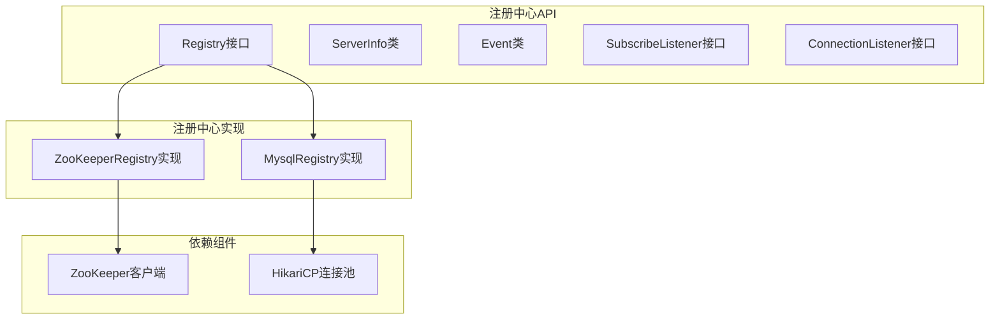
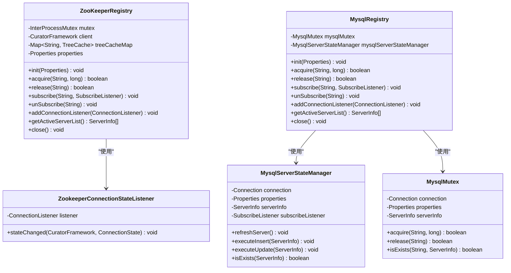
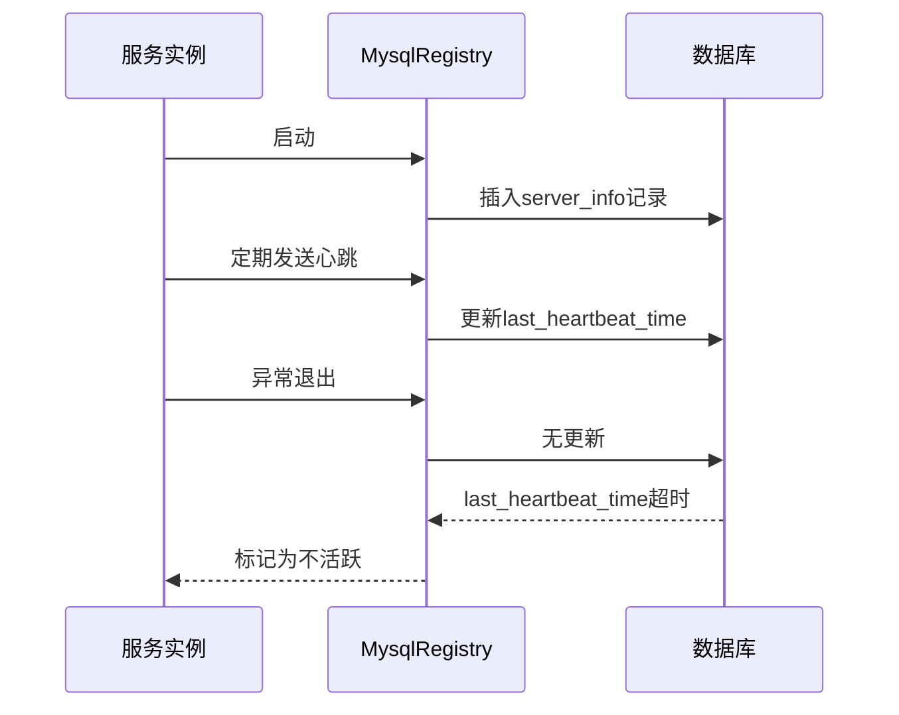
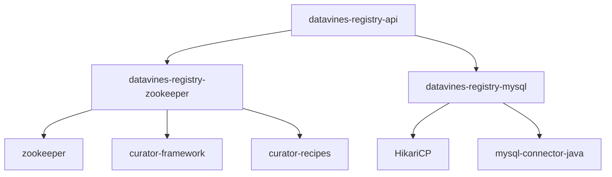

# datavines-registry模块

<cite>
**本文档引用的文件**   
- [Registry.java](file://datavines-registry/datavines-registry-api/src/main/java/io/datavines/registry/api/Registry.java)
- [ServerInfo.java](file://datavines-registry/datavines-registry-api/src/main/java/io/datavines/registry/api/ServerInfo.java)
- [Event.java](file://datavines-registry/datavines-registry-api/src/main/java/io/datavines/registry/api/Event.java)
- [SubscribeListener.java](file://datavines-registry/datavines-registry-api/src/main/java/io/datavines/registry/api/SubscribeListener.java)
- [ConnectionListener.java](file://datavines-registry/datavines-registry-api/src/main/java/io/datavines/registry/api/ConnectionListener.java)
- [ConnectionStatus.java](file://datavines-registry/datavines-registry-api/src/main/java/io/datavines/registry/api/ConnectionStatus.java)
- [ZooKeeperRegistry.java](file://datavines-registry/datavines-registry-plugins/datavines-registry-zookeeper/src/main/java/io/datavines/registry/plugin/ZooKeeperRegistry.java)
- [MysqlRegistry.java](file://datavines-registry/datavines-registry-plugins/datavines-registry-mysql/src/main/java/io/datavines/registry/plugin/MysqlRegistry.java)
- [MysqlServerStateManager.java](file://datavines-registry/datavines-registry-plugins/datavines-registry-mysql/src/main/java/io/datavines/registry/plugin/MysqlServerStateManager.java)
- [MysqlMutex.java](file://datavines-registry/datavines-registry-plugins/datavines-registry-mysql/src/main/java/io/datavines/registry/plugin/MysqlMutex.java)
- [ZookeeperConnectionStateListener.java](file://datavines-registry/datavines-registry-plugins/datavines-registry-zookeeper/src/main/java/io/datavines/registry/plugin/ZookeeperConnectionStateListener.java)
</cite>

## 目录
1. [引言](#引言)
2. [核心组件](#核心组件)
3. [架构概述](#架构概述)
4. [详细组件分析](#详细组件分析)
5. [依赖分析](#依赖分析)
6. [性能考虑](#性能考虑)
7. [故障转移与高可用机制](#故障转移与高可用机制)
8. [配置参数与性能对比](#配置参数与性能对比)
9. [扩展新注册中心实现指南](#扩展新注册中心实现指南)
10. [结论](#结论)

## 引言
datavines-registry模块是DataVines系统中的注册中心核心组件，负责服务发现、分布式锁、集群管理和高可用性保障。该模块提供了两种注册中心实现：基于ZooKeeper的分布式协调服务和基于MySQL的关系型数据库实现。通过统一的SPI接口，系统可以灵活选择不同的注册中心实现，满足不同部署环境的需求。

## 核心组件
datavines-registry模块的核心是`Registry`接口，定义了注册中心的基本功能，包括初始化、获取/释放分布式锁、订阅/取消订阅、获取活跃服务器列表等。`ServerInfo`类用于表示服务器实例信息，包含主机地址、端口、创建和更新时间等属性。`Event`类用于表示注册中心的事件，包括添加、更新和删除操作。`SubscribeListener`接口用于监听注册中心的事件变化，`ConnectionListener`接口用于监听连接状态变化。

**核心组件**
- [Registry.java](file://datavines-registry/datavines-registry-api/src/main/java/io/datavines/registry/api/Registry.java#L26-L43)
- [ServerInfo.java](file://datavines-registry/datavines-registry-api/src/main/java/io/datavines/registry/api/ServerInfo.java#L30-L48)
- [Event.java](file://datavines-registry/datavines-registry-api/src/main/java/io/datavines/registry/api/Event.java#L19-L106)

## 架构概述
datavines-registry模块采用插件化架构，通过SPI机制实现不同注册中心的扩展。核心接口`Registry`定义了注册中心的通用功能，具体的实现类如`ZooKeeperRegistry`和`MysqlRegistry`分别实现了基于ZooKeeper和MySQL的注册中心功能。系统通过配置文件选择具体的注册中心实现，实现了注册中心的可插拔性。

**图源**
- [Registry.java](file://datavines-registry/datavines-registry-api/src/main/java/io/datavines/registry/api/Registry.java#L26-L43)
- [ZooKeeperRegistry.java](file://datavines-registry/datavines-registry-plugins/datavines-registry-zookeeper/src/main/java/io/datavines/registry/plugin/ZooKeeperRegistry.java#L43-L176)
- [MysqlRegistry.java](file://datavines-registry/datavines-registry-plugins/datavines-registry-mysql/src/main/java/io/datavines/registry/plugin/MysqlRegistry.java#L29-L38)

## 详细组件分析

### ZooKeeper注册中心分析
ZooKeeper注册中心实现基于Apache Curator框架，利用ZooKeeper的临时节点特性实现服务发现和故障检测。当服务实例启动时，会在ZooKeeper中创建临时节点，节点数据包含服务实例的地址信息。当服务实例异常退出时，ZooKeeper会自动删除对应的临时节点，从而实现故障自动发现。

**图源**
- [ZooKeeperRegistry.java](file://datavines-registry/datavines-registry-plugins/datavines-registry-zookeeper/src/main/java/io/datavines/registry/plugin/ZooKeeperRegistry.java#L43-L176)
- [ZookeeperConnectionStateListener.java](file://datavines-registry/datavines-registry-plugins/datavines-registry-zookeeper/src/main/java/io/datavines/registry/plugin/ZookeeperConnectionStateListener.java)
- [MysqlRegistry.java](file://datavines-registry/datavines-registry-plugins/datavines-registry-mysql/src/main/java/io/datavines/registry/plugin/MysqlRegistry.java#L29-L38)
- [MysqlServerStateManager.java](file://datavines-registry/datavines-registry-plugins/datavines-registry-mysql/src/main/java/io/datavines/registry/plugin/MysqlServerStateManager.java)
- [MysqlMutex.java](file://datavines-registry/datavines-registry-plugins/datavines-registry-mysql/src/main/java/io/datavines/registry/plugin/MysqlMutex.java)

### MySQL注册中心分析
MySQL注册中心实现基于关系型数据库，通过心跳机制实现服务发现和故障检测。服务实例定期向数据库中的`server_info`表更新自己的状态信息，包括最后更新时间。当服务实例异常退出时，无法继续更新状态，系统通过检查最后更新时间来判断服务实例是否存活。

**图源**
- [MysqlRegistry.java](file://datavines-registry/datavines-registry-plugins/datavines-registry-mysql/src/main/java/io/datavines/registry/plugin/MysqlRegistry.java#L29-L38)
- [MysqlServerStateManager.java](file://datavines-registry/datavines-registry-plugins/datavines-registry-mysql/src/main/java/io/datavines/registry/plugin/MysqlServerStateManager.java)

## 依赖分析
datavines-registry模块的依赖关系清晰，API模块定义了核心接口，实现模块依赖具体的第三方库。ZooKeeper实现依赖Apache Curator框架和ZooKeeper客户端，MySQL实现依赖HikariCP连接池。通过SPI机制，系统可以在运行时动态选择注册中心实现。

**图源**
- [pom.xml](file://datavines-registry/datavines-registry-plugins/datavines-registry-zookeeper/pom.xml#L34-L57)
- [pom.xml](file://datavines-registry/datavines-registry-plugins/datavines-registry-mysql/pom.xml#L33-L36)

## 性能考虑
ZooKeeper注册中心在高并发场景下表现优异，得益于ZooKeeper的分布式协调能力。但ZooKeeper集群的维护成本较高，需要专门的运维团队。MySQL注册中心依赖数据库性能，在高并发场景下可能成为性能瓶颈，但部署和维护相对简单。系统设计时需要根据实际业务场景选择合适的注册中心实现。

## 故障转移与高可用机制
ZooKeeper注册中心通过ZooKeeper集群的高可用性保障注册中心本身的高可用。当某个ZooKeeper节点故障时，客户端会自动连接到其他可用节点。MySQL注册中心通过数据库主从复制或集群部署实现高可用。两种实现都提供了服务实例的故障自动发现机制，确保系统能够及时感知服务实例的状态变化。

## 配置参数与性能对比
| 配置项 | ZooKeeper实现 | MySQL实现 |
| --- | --- | --- |
| 连接字符串 | server-lists | jdbc-url |
| 会话超时 | session-timeout-ms | heartbeat-interval-ms |
| 连接超时 | connection-timeout-ms | connection-timeout |
| 重试策略 | retry-policy | retry-attempts |
| 数据持久化 | 临时节点 | 数据库表 |
| 性能 | 高 | 中 |
| 可用性 | 高 | 中 |
| 维护成本 | 高 | 低 |

## 扩展新注册中心实现指南
要扩展新的注册中心实现，需要遵循以下步骤：
1. 实现`Registry`接口，提供具体的注册中心功能
2. 在`META-INF/plugins/io.datavines.registry.api.Registry`文件中添加实现类的映射
3. 在pom.xml中添加必要的依赖
4. 通过SPI机制注册实现类

最佳实践包括：
- 确保实现类的线程安全性
- 提供完善的错误处理机制
- 实现合理的重试策略
- 提供详细的日志记录
- 考虑性能和资源消耗

## 结论
datavines-registry模块通过插件化架构提供了灵活的注册中心实现，支持ZooKeeper和MySQL两种主流技术。两种实现各有优劣，ZooKeeper适合对高可用性要求高的场景，MySQL适合对维护成本敏感的场景。系统设计时应根据实际需求选择合适的注册中心实现，并考虑未来的扩展性。