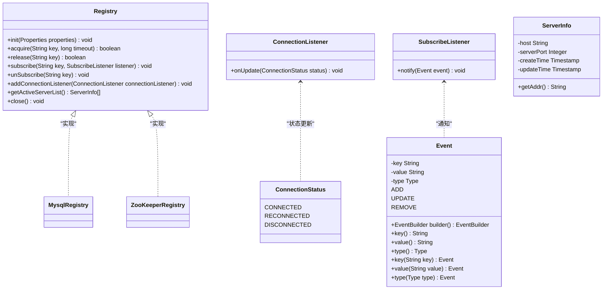
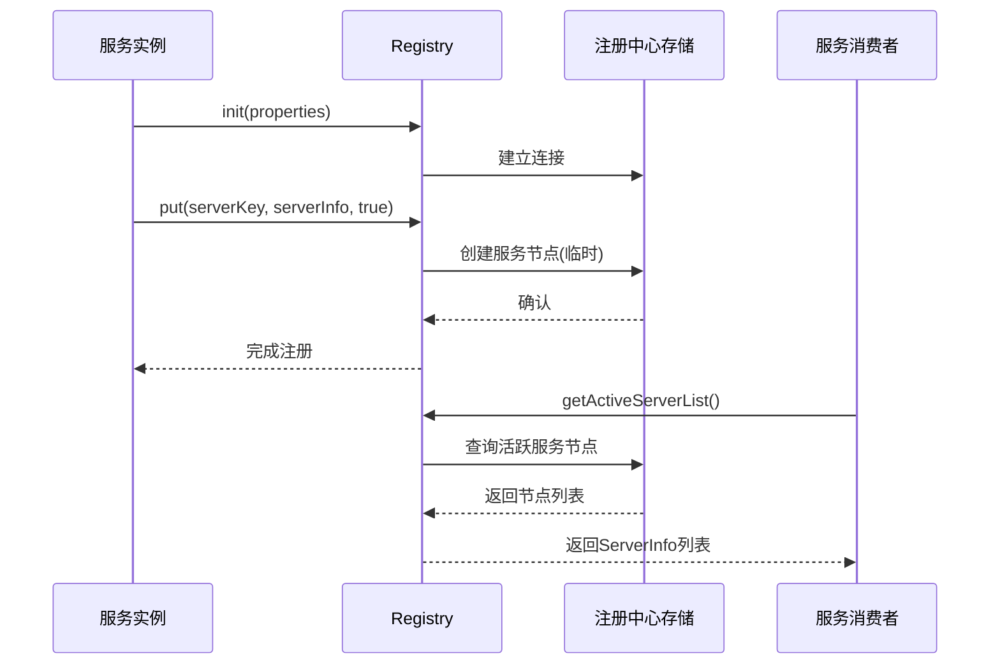
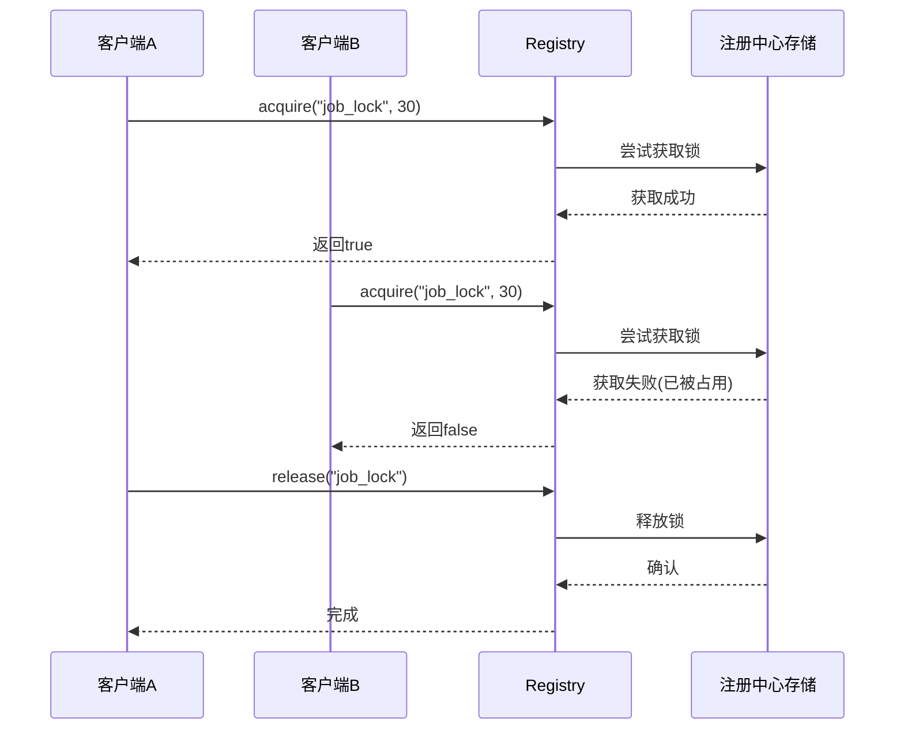
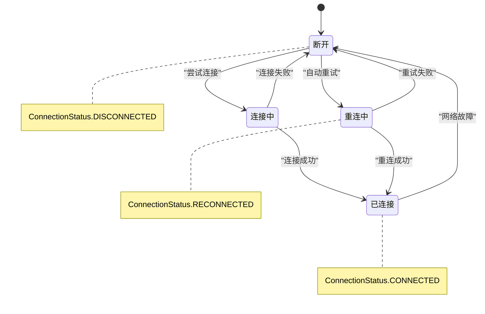
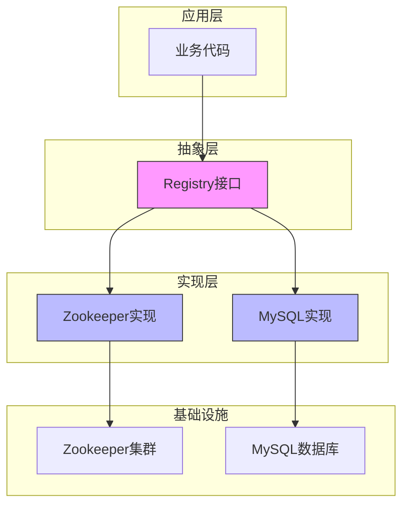
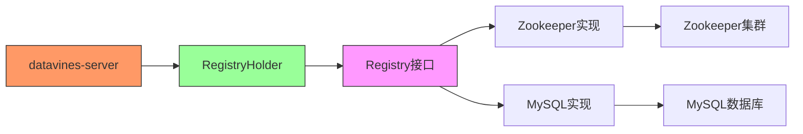

# 注册中心API

<cite>
**本文档引用的文件**   
- [Registry.java](file://datavines-registry\datavines-registry-api\src\main\java\io\datavines\registry\api\Registry.java)
- [ConnectionListener.java](file://datavines-registry\datavines-registry-api\src\main\java\io\datavines\registry\api\ConnectionListener.java)
- [SubscribeListener.java](file://datavines-registry\datavines-registry-api\src\main\java\io\datavines\registry\api\SubscribeListener.java)
- [Event.java](file://datavines-registry\datavines-registry-api\src\main\java\io\datavines\registry\api\Event.java)
- [ConnectionStatus.java](file://datavines-registry\datavines-registry-api\src\main\java\io\datavines\registry\api\ConnectionStatus.java)
- [ServerInfo.java](file://datavines-registry\datavines-registry-api\src\main\java\io\datavines\registry\api\ServerInfo.java)
- [MysqlRegistry.java](file://datavines-registry\datavines-registry-plugins\datavines-registry-mysql\src\main\java\io\datavines\registry\plugin\MysqlRegistry.java)
- [ZooKeeperRegistry.java](file://datavines-registry\datavines-registry-plugins\datavines-registry-zookeeper\src\main\java\io\datavines\registry\plugin\ZooKeeperRegistry.java)
- [RegistryHolder.java](file://datavines-server\src\main\java\io\datavines\server\registry\RegistryHolder.java)
- [SPI.java](file://datavines-spi\src\main\java\io\datavines\spi\SPI.java)
</cite>

## 目录
1. [简介](#简介)
2. [核心接口设计](#核心接口设计)
3. [服务注册与发现](#服务注册与发现)
4. [监听机制](#监听机制)
5. [分布式锁功能](#分布式锁功能)
6. [连接状态监听](#连接状态监听)
7. [多注册中心实现抽象](#多注册中心实现抽象)
8. [使用示例与最佳实践](#使用示例与最佳实践)
9. [与其他模块集成](#与其他模块集成)
10. [总结](#总结)

## 简介
datavines-registry模块为DataVines系统提供了统一的注册中心抽象层，实现了服务注册、服务发现、分布式锁和状态监听等核心功能。该模块通过SPI机制支持多种注册中心实现，包括Zookeeper和MySQL，为分布式环境下的协调服务提供了可靠的基础。

**Section sources**
- [Registry.java](file://datavines-registry\datavines-registry-api\src\main\java\io\datavines\registry\api\Registry.java)
- [SPI.java](file://datavines-spi\src\main\java\io\datavines\spi\SPI.java)

## 核心接口设计

### Registry接口
Registry接口是注册中心模块的核心，定义了所有注册中心实现必须提供的基本功能。该接口通过@SPI注解标记，表明它是一个可扩展的SPI（Service Provider Interface）接口，允许系统动态加载不同的注册中心实现。



**Diagram sources **
- [Registry.java](file://datavines-registry\datavines-registry-api\src\main\java\io\datavines\registry\api\Registry.java)
- [ConnectionListener.java](file://datavines-registry\datavines-registry-api\src\main\java\io\datavines\registry\api\ConnectionListener.java)
- [SubscribeListener.java](file://datavines-registry\datavines-registry-api\src\main\java\io\datavines\registry\api\SubscribeListener.java)
- [Event.java](file://datavines-registry\datavines-registry-api\src\main\java\io\datavines\registry\api\Event.java)
- [ServerInfo.java](file://datavines-registry\datavines-registry-api\src\main\java\io\datavines\registry\api\ServerInfo.java)
- [ConnectionStatus.java](file://datavines-registry\datavines-registry-api\src\main\java\io\datavines\registry\api\ConnectionStatus.java)

**Section sources**
- [Registry.java](file://datavines-registry\datavines-registry-api\src\main\java\io\datavines\registry\api\Registry.java)
- [ConnectionListener.java](file://datavines-registry\datavines-registry-api\src\main\java\io\datavines\registry\api\ConnectionListener.java)
- [SubscribeListener.java](file://datavines-registry\datavines-registry-api\src\main\java\io\datavines\registry\api\SubscribeListener.java)
- [Event.java](file://datavines-registry\datavines-registry-api\src\main\java\io\datavines\registry\api\Event.java)
- [ServerInfo.java](file://datavines-registry\datavines-registry-api\src\main\java\io\datavines\registry\api\ServerInfo.java)
- [ConnectionStatus.java](file://datavines-registry\datavines-registry-api\src\main\java\io\datavines\registry\api\ConnectionStatus.java)

## 服务注册与发现

### 设计原理
服务注册与发现功能通过Registry接口的实现来完成。系统中的各个服务实例在启动时会向注册中心注册自己的信息（如主机地址和端口），其他服务可以通过注册中心发现并获取活跃的服务实例列表。

### 核心方法
- `getActiveServerList()`：获取当前活跃的服务实例列表
- `init(Properties properties)`：初始化注册中心连接

### 实现机制
在Zookeeper实现中，服务信息存储在Zookeeper的特定路径下，使用临时节点（EPHEMERAL）来表示服务实例。当服务正常关闭时，节点会被自动删除；当服务异常终止时，Zookeeper的会话超时机制也会自动清理节点。

在MySQL实现中，服务状态信息存储在数据库表中，通过心跳机制来维护服务的活跃状态。



**Diagram sources **
- [ZooKeeperRegistry.java](file://datavines-registry\datavines-registry-plugins\datavines-registry-zookeeper\src\main\java\io\datavines\registry\plugin\ZooKeeperRegistry.java)
- [MysqlRegistry.java](file://datavines-registry\datavines-registry-plugins\datavines-registry-mysql\src\main\java\io\datavines\registry\plugin\MysqlRegistry.java)

**Section sources**
- [ZooKeeperRegistry.java](file://datavines-registry\datavines-registry-plugins\datavines-registry-zookeeper\src\main\java\io\datavines\registry\plugin\ZooKeeperRegistry.java)
- [MysqlRegistry.java](file://datavines-registry\datavines-registry-plugins\datavines-registry-mysql\src\main\java\io\datavines\registry\plugin\MysqlRegistry.java)
- [ServerInfo.java](file://datavines-registry\datavines-registry-api\src\main\java\io\datavines\registry\api\ServerInfo.java)

## 监听机制

### SubscribeListener接口
SubscribeListener接口用于监听注册中心中特定键值的变化事件。当被监听的键值发生添加、更新或删除操作时，注册中心会通过notify方法通知监听器。

### 事件模型
Event类封装了注册中心的变更事件，包含以下信息：
- key：发生变化的键
- value：新的值
- type：事件类型（ADD、UPDATE、REMOVE）

### 使用场景
监听机制主要用于服务发现的动态更新。当有新的服务实例注册或现有实例下线时，监听器可以及时收到通知并更新本地的服务列表缓存。

```mermaid
flowchart TD
A[注册中心数据变更] --> B{变更类型}
B --> |添加| C[创建Event对象 type=ADD]
B --> |更新| D[创建Event对象 type=UPDATE]
B --> |删除| E[创建Event对象 type=REMOVE]
C --> F[通知所有订阅者]
D --> F
E --> F
F --> G[SubscribeListener.notify(event)]
G --> H[业务逻辑处理]
```

**Diagram sources **
- [SubscribeListener.java](file://datavines-registry\datavines-registry-api\src\main\java\io\datavines\registry\api\SubscribeListener.java)
- [Event.java](file://datavines-registry\datavines-registry-api\src\main\java\io\datavines\registry\api\Event.java)
- [ZooKeeperRegistry.java](file://datavines-registry\datavines-registry-plugins\datavines-registry-zookeeper\src\main\java\io\datavines\registry\plugin\ZooKeeperRegistry.java)

**Section sources**
- [SubscribeListener.java](file://datavines-registry\datavines-registry-api\src\main\java\io\datavines\registry\api\SubscribeListener.java)
- [Event.java](file://datavines-registry\datavines-registry-api\src\main\java\io\datavines\registry\api\Event.java)

## 分布式锁功能

### 设计原理
分布式锁功能用于在分布式环境中协调多个节点对共享资源的访问，防止并发冲突。Registry接口提供了acquire和release方法来实现锁的获取和释放。

### 核心方法
- `acquire(String key, long timeout)`：尝试获取指定键的锁，带有超时机制
- `release(String key)`：释放指定键的锁

### 实现机制
在Zookeeper实现中，使用Curator框架的InterProcessMutex来实现分布式锁，基于Zookeeper的临时顺序节点机制。

在MySQL实现中，使用MySQL的GET_LOCK和RELEASE_LOCK函数来实现分布式锁。



**Diagram sources **
- [Registry.java](file://datavines-registry\datavines-registry-api\src\main\java\io\datavines\registry\api\Registry.java)
- [ZooKeeperRegistry.java](file://datavines-registry\datavines-registry-plugins\datavines-registry-zookeeper\src\main\java\io\datavines\registry\plugin\ZooKeeperRegistry.java)
- [MysqlRegistry.java](file://datavines-registry\datavines-registry-plugins\datavines-registry-mysql\src\main\java\io\datavines\registry\plugin\MysqlRegistry.java)

**Section sources**
- [Registry.java](file://datavines-registry\datavines-registry-api\src\main\java\io\datavines\registry\api\Registry.java)
- [ZooKeeperRegistry.java](file://datavines-registry\datavines-registry-plugins\datavines-registry-zookeeper\src\main\java\io\datavines\registry\plugin\ZooKeeperRegistry.java)
- [MysqlRegistry.java](file://datavines-registry\datavines-registry-plugins\datavines-registry-mysql\src\main\java\io\datavines\registry\plugin\MysqlRegistry.java)

## 连接状态监听

### ConnectionListener接口
ConnectionListener接口用于监听注册中心连接状态的变化。当与注册中心的连接状态发生改变时（如连接、重连、断开），会通过onUpdate方法通知监听器。

### 使用场景
连接状态监听主要用于：
- 监控注册中心的健康状况
- 在连接断开时执行清理操作
- 在重新连接后恢复服务注册
- 实现故障转移和容错机制



**Diagram sources **
- [ConnectionListener.java](file://datavines-registry\datavines-registry-api\src\main\java\io\datavines\registry\api\ConnectionListener.java)
- [ConnectionStatus.java](file://datavines-registry\datavines-registry-api\src\main\java\io\datavines\registry\api\ConnectionStatus.java)
- [ZooKeeperRegistry.java](file://datavines-registry\datavines-registry-plugins\datavines-registry-zookeeper\src\main\java\io\datavines\registry\plugin\ZooKeeperRegistry.java)

**Section sources**
- [ConnectionListener.java](file://datavines-registry\datavines-registry-api\src\main\java\io\datavines\registry\api\ConnectionListener.java)
- [ConnectionStatus.java](file://datavines-registry\datavines-registry-api\src\main\java\io\datavines\registry\api\ConnectionStatus.java)

## 多注册中心实现抽象

### SPI机制
datavines-registry模块使用SPI（Service Provider Interface）机制来实现多注册中心的抽象。通过在META-INF/plugins目录下配置实现类，系统可以在运行时动态加载不同的注册中心实现。

### 实现类配置
- Zookeeper实现：`zookeeper=io.datavines.registry.plugin.ZooKeeperRegistry`
- MySQL实现：`mysql=io.datavines.registry.plugin.MysqlRegistry`

### 抽象层设计
Registry接口作为抽象层，屏蔽了不同注册中心实现的差异。上层应用只需依赖Registry接口，无需关心具体的实现细节，实现了良好的解耦。



**Diagram sources **
- [SPI.java](file://datavines-spi\src\main\java\io\datavines\spi\SPI.java)
- [Registry.java](file://datavines-registry\datavines-registry-api\src\main\java\io\datavines\registry\api\Registry.java)
- [ZooKeeperRegistry.java](file://datavines-registry\datavines-registry-plugins\datavines-registry-zookeeper\src\main\java\io\datavines\registry\plugin\ZooKeeperRegistry.java)
- [MysqlRegistry.java](file://datavines-registry\datavines-registry-plugins\datavines-registry-mysql\src\main\java\io\datavines\registry\plugin\MysqlRegistry.java)

**Section sources**
- [SPI.java](file://datavines-spi\src\main\java\io\datavines\spi\SPI.java)
- [Registry.java](file://datavines-registry\datavines-registry-api\src\main\java\io\datavines\registry\api\Registry.java)
- [ZooKeeperRegistry.java](file://datavines-registry\datavines-registry-plugins\datavines-registry-zookeeper\src\main\java\io\datavines\registry\plugin\ZooKeeperRegistry.java)
- [MysqlRegistry.java](file://datavines-registry\datavines-registry-plugins\datavines-registry-mysql\src\main\java\io\datavines\registry\plugin\MysqlRegistry.java)

## 使用示例与最佳实践

### 基本使用
```java
// 获取注册中心实例
Registry registry = PluginLoader.getPluginLoader(Registry.class).load("zookeeper");

// 初始化
Properties properties = new Properties();
properties.setProperty("registry.zookeeper.server.list", "localhost:2181");
registry.init(properties);

// 服务注册
ServerInfo serverInfo = new ServerInfo("localhost", 8080);
String serverKey = "/datavines/servers";
registry.put(serverKey, serverInfo.toString(), true);

// 服务发现
List<ServerInfo> activeServers = registry.getActiveServerList();

// 分布式锁
boolean locked = registry.acquire("my_lock", 30);
if (locked) {
    try {
        // 执行临界区代码
    } finally {
        registry.release("my_lock");
    }
}

// 监听服务变化
registry.subscribe(serverKey, new SubscribeListener() {
    @Override
    public void notify(Event event) {
        System.out.println("服务变化: " + event);
    }
});
```

### 最佳实践
1. **连接管理**：确保在应用关闭时调用close()方法释放资源
2. **异常处理**：对注册中心操作进行适当的异常处理和重试机制
3. **超时设置**：合理设置锁的超时时间，避免死锁
4. **监听器管理**：及时取消不再需要的订阅，避免内存泄漏
5. **配置管理**：将注册中心配置外部化，便于环境切换

**Section sources**
- [Registry.java](file://datavines-registry\datavines-registry-api\src\main\java\io\datavines\registry\api\Registry.java)
- [RegistryHolder.java](file://datavines-server\src\main\java\io\datavines\server\registry\RegistryHolder.java)

## 与其他模块集成

### 与datavines-server集成
在datavines-server模块中，通过RegistryHolder类管理Registry实例的生命周期，并在服务启动时进行注册，在关闭时进行清理。

### 集成方式
1. **依赖注入**：通过Spring的@Component注解将RegistryHolder注入到需要的服务中
2. **配置驱动**：从配置文件读取注册中心类型和连接参数
3. **SPI加载**：使用PluginLoader动态加载指定的注册中心实现

### 典型应用场景
- **集群协调**：多个datavines-server实例之间的协调
- **高可用**：通过服务发现实现负载均衡和故障转移
- **分布式锁**：确保关键操作的互斥执行
- **配置同步**：在集群节点间同步配置变更



**Diagram sources **
- [RegistryHolder.java](file://datavines-server\src\main\java\io\datavines\server\registry\RegistryHolder.java)
- [Registry.java](file://datavines-registry\datavines-registry-api\src\main\java\io\datavines\registry\api\Registry.java)

**Section sources**
- [RegistryHolder.java](file://datavines-server\src\main\java\io\datavines\server\registry\RegistryHolder.java)

## 总结
datavines-registry模块提供了一个灵活、可扩展的注册中心抽象层，通过统一的API接口支持多种注册中心实现。该模块的核心设计包括服务注册与发现、分布式锁、状态监听等功能，为DataVines系统的分布式协调提供了可靠的基础。通过SPI机制，系统可以轻松切换不同的注册中心实现，满足不同部署环境的需求。在使用时，应遵循最佳实践，合理管理连接和资源，确保系统的稳定性和可靠性。