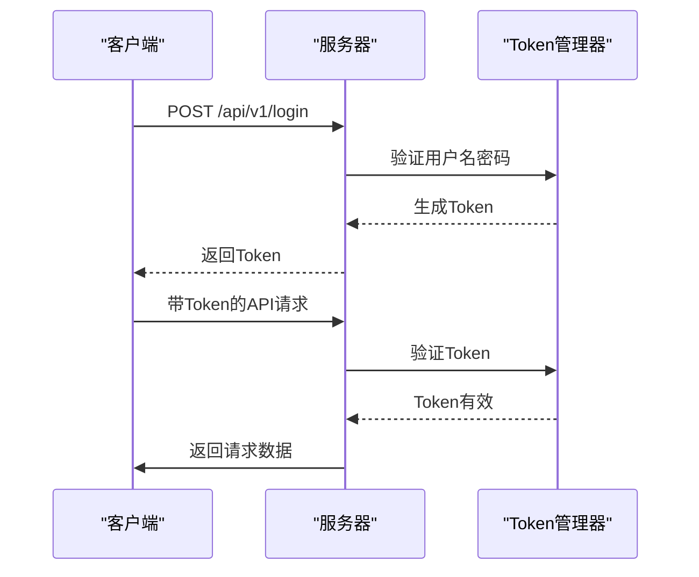
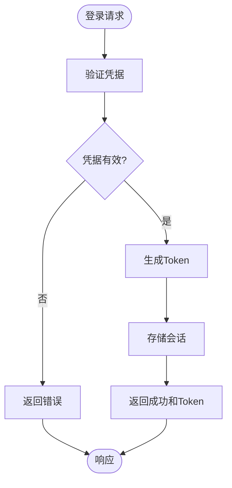
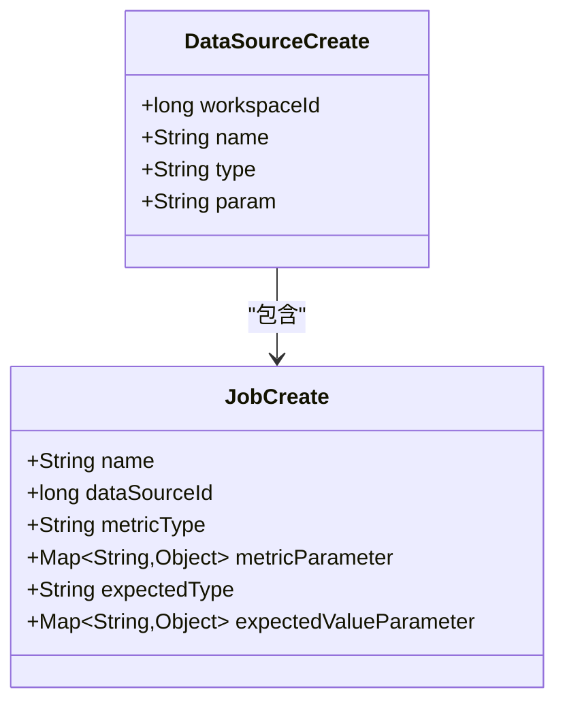
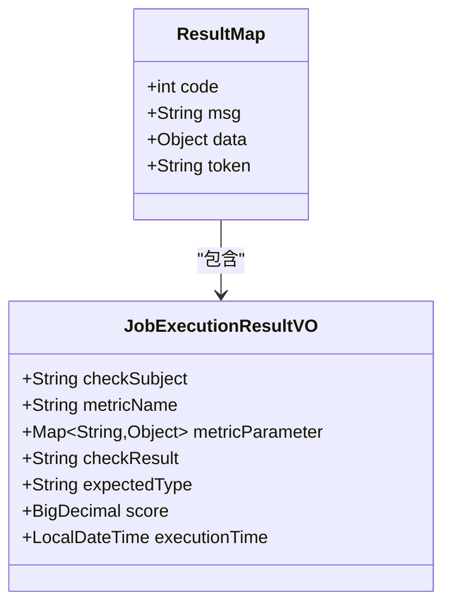

# REST API接口

<cite>
**本文档引用的文件**   
- [LoginController.java](file://datavines-server/src/main/java/io/datavines/server/api/controller/LoginController.java)
- [UserController.java](file://datavines-server/src/main/java/io/datavines/server/api/controller/UserController.java)
- [DataSourceController.java](file://datavines-server/src/main/java/io/datavines/server/api/controller/DataSourceController.java)
- [JobController.java](file://datavines-server/src/main/java/io/datavines/server/api/controller/JobController.java)
- [JobExecutionController.java](file://datavines-server/src/main/java/io/datavines/server/api/controller/JobExecutionController.java)
- [WorkSpaceController.java](file://datavines-server/src/main/java/io/datavines/server/api/controller/WorkSpaceController.java)
- [OpenApiController.java](file://datavines-server/src/main/java/io/datavines/server/api/controller/OpenApiController.java)
- [UserLogin.java](file://datavines-server/src/main/java/io/datavines/server/api/dto/bo/user/UserLogin.java)
- [DataSourceCreate.java](file://datavines-server/src/main/java/io/datavines/server/api/dto/bo/datasource/DataSourceCreate.java)
- [JobCreate.java](file://datavines-server/src/main/java/io/datavines/server/api/dto/bo/job/JobCreate.java)
- [ResultMap.java](file://datavines-core/src/main/java/io/datavines/core/entity/ResultMap.java)
- [AuthenticationInterceptor.java](file://datavines-server/src/main/java/io/datavines/server/api/inteceptor/AuthenticationInterceptor.java)
- [DataVinesSwaggerConfig.java](file://datavines-server/src/main/java/io/datavines/server/api/config/DataVinesSwaggerConfig.java)
- [TokenManager.java](file://datavines-core/src/main/java/io/datavines/core/utils/TokenManager.java)
</cite>

## 目录
1. [简介](#简介)
2. [API基础信息](#api基础信息)
3. [认证机制](#认证机制)
4. [用户管理API](#用户管理api)
5. [数据源管理API](#数据源管理api)
6. [任务管理API](#任务管理api)
7. [任务执行API](#任务执行api)
8. [工作空间管理API](#工作空间管理api)
9. [开放API](#开放api)
10. [DTO对象设计](#dto对象设计)
11. [错误处理策略](#错误处理策略)
12. [客户端集成指南](#客户端集成指南)

## 简介
DataVines服务器模块提供了一套完整的RESTful API接口，用于管理和监控数据质量任务。这些API涵盖了用户认证、数据源管理、任务管理、任务执行监控等核心功能。通过这些API，客户端可以实现对数据质量检查任务的全生命周期管理，包括创建、执行、监控和分析。

**本文档引用的文件**  
- [LoginController.java](file://datavines-server/src/main/java/io/datavines/server/api/controller/LoginController.java)
- [DataVinesSwaggerConfig.java](file://datavines-server/src/main/java/io/datavines/server/api/config/DataVinesSwaggerConfig.java)

## API基础信息
DataVines的REST API遵循标准的RESTful设计原则，所有API端点都位于`/api/v1`基础路径下。API使用JSON格式进行请求和响应数据交换，支持标准的HTTP方法（GET、POST、PUT、DELETE）来执行相应的CRUD操作。

API版本控制通过URL路径实现，当前版本为v1。所有API响应都遵循统一的响应格式，包含状态码、消息和数据负载。

**本文档引用的文件**  
- [DataVinesConstants.java](file://datavines-core/src/main/java/io/datavines/core/constant/DataVinesConstants.java)

## 认证机制
DataVines采用基于Token的认证机制，所有需要认证的API请求都必须在HTTP头中包含Authorization令牌。认证流程如下：

1. 用户通过`/api/v1/login`端点进行身份验证，成功后服务器返回包含Token的响应
2. 客户端在后续所有请求的Authorization头中携带此Token
3. 服务器通过拦截器验证Token的有效性



**图示来源**  
- [LoginController.java](file://datavines-server/src/main/java/io/datavines/server/api/controller/LoginController.java)
- [AuthenticationInterceptor.java](file://datavines-server/src/main/java/io/datavines/server/api/inteceptor/AuthenticationInterceptor.java)
- [TokenManager.java](file://datavines-core/src/main/java/io/datavines/core/utils/TokenManager.java)

**本文档引用的文件**  
- [AuthenticationInterceptor.java](file://datavines-server/src/main/java/io/datavines/server/api/inteceptor/AuthenticationInterceptor.java)
- [TokenManager.java](file://datavines-core/src/main/java/io/datavines/core/utils/TokenManager.java)

## 用户管理API
用户管理API提供了用户登录、注册和密码重置等功能。

### 登录API


**图示来源**  
- [LoginController.java](file://datavines-server/src/main/java/io/datavines/server/api/controller/LoginController.java)

**本文档引用的文件**  
- [LoginController.java](file://datavines-server/src/main/java/io/datavines/server/api/controller/LoginController.java)
- [UserLogin.java](file://datavines-server/src/main/java/io/datavines/server/api/dto/bo/user/UserLogin.java)

## 数据源管理API
数据源管理API提供了对各种数据源的完整管理功能，包括创建、测试连接、获取数据库和表结构等。

### 数据源管理API端点
| HTTP方法 | URL路径 | 描述 | 认证要求 |
|---------|-------|------|---------|
| POST | /api/v1/datasource/test | 测试数据源连接 | 是 |
| POST | /api/v1/datasource | 创建数据源 | 是 |
| PUT | /api/v1/datasource | 更新数据源 | 是 |
| DELETE | /api/v1/datasource/{id} | 删除数据源 | 是 |
| GET | /api/v1/datasource/page | 分页获取数据源列表 | 是 |
| GET | /api/v1/datasource/{id}/databases | 获取数据库列表 | 是 |
| GET | /api/v1/datasource/{id}/{database}/tables | 获取表列表 | 是 |
| GET | /api/v1/datasource/{id}/{database}/{table}/columns | 获取列列表 | 是 |
| POST | /api/v1/datasource/execute | 执行SQL脚本 | 是 |
| GET | /api/v1/datasource/type/list | 获取连接器类型列表 | 是 |

**本文档引用的文件**  
- [DataSourceController.java](file://datavines-server/src/main/java/io/datavines/server/api/controller/DataSourceController.java)
- [DataSourceCreate.java](file://datavines-server/src/main/java/io/datavines/server/api/dto/bo/datasource/DataSourceCreate.java)

## 任务管理API
任务管理API提供了对数据质量检查任务的完整生命周期管理。

### 任务管理API端点
| HTTP方法 | URL路径 | 描述 | 认证要求 |
|---------|-------|------|---------|
| POST | /api/v1/job | 创建任务 | 是 |
| DELETE | /api/v1/job/{id} | 删除任务 | 是 |
| PUT | /api/v1/job | 更新任务 | 是 |
| GET | /api/v1/job/{id} | 获取任务详情 | 是 |
| GET | /api/v1/job/page | 分页获取任务列表 | 是 |
| POST | /api/v1/job/execute/{id} | 执行任务 | 是 |
| GET | /api/v1/job/execute/config/{id} | 获取任务执行配置 | 是 |
| GET | /api/v1/job/config/{id} | 获取任务配置 | 是 |

**本文档引用的文件**  
- [JobController.java](file://datavines-server/src/main/java/io/datavines/server/api/controller/JobController.java)
- [JobCreate.java](file://datavines-server/src/main/java/io/datavines/server/api/dto/bo/job/JobCreate.java)

## 任务执行API
任务执行API提供了对任务执行过程的监控和管理功能。

### 任务执行API端点
| HTTP方法 | URL路径 | 描述 | 认证要求 |
|---------|-------|------|---------|
| POST | /api/v1/job/execution/submit/data-quality | 提交数据质量任务 | 是 |
| POST | /api/v1/job/execution/submit/data-reconciliation | 提交数据核对任务 | 是 |
| DELETE | /api/v1/job/execution/kill/{executionId} | 终止任务执行 | 是 |
| GET | /api/v1/job/execution/status/{executionId} | 获取任务执行状态 | 是 |
| GET | /api/v1/job/execution/list/{jobId} | 获取任务执行列表 | 是 |
| GET | /api/v1/job/execution/result/{executionId} | 获取任务执行结果 | 是 |
| POST | /api/v1/job/execution/page | 分页获取任务执行列表 | 是 |
| GET | /api/v1/job/execution/errorDataPage | 获取错误数据分页 | 是 |

**本文档引用的文件**  
- [JobExecutionController.java](file://datavines-server/src/main/java/io/datavines/server/api/controller/JobExecutionController.java)
- [JobExecutionPageParam.java](file://datavines-server/src/main/java/io/datavines/server/api/dto/bo/job/JobExecutionPageParam.java)

## 工作空间管理API
工作空间管理API提供了对工作空间的创建、更新、删除和用户管理功能。

### 工作空间管理API端点
| HTTP方法 | URL路径 | 描述 | 认证要求 |
|---------|-------|------|---------|
| POST | /api/v1/workspace | 创建工作空间 | 是 |
| PUT | /api/v1/workspace | 更新工作空间 | 是 |
| DELETE | /api/v1/workspace/{id} | 删除工作空间 | 是 |
| GET | /api/v1/workspace/list | 获取用户的工作空间列表 | 是 |
| POST | /api/v1/workspace/inviteUser | 邀请用户加入工作空间 | 是 |
| DELETE | /api/v1/workspace/removeUser | 从工作空间移除用户 | 是 |
| GET | /api/v1/workspace/userPage | 分页获取工作空间用户列表 | 是 |

**本文档引用的文件**  
- [WorkSpaceController.java](file://datavines-server/src/main/java/io/datavines/server/api/controller/WorkSpaceController.java)
- [WorkSpaceCreate.java](file://datavines-server/src/main/java/io/datavines/server/api/dto/bo/workspace/WorkSpaceCreate.java)

## 开放API
开放API提供了外部系统集成的接口，允许外部系统提交和监控数据质量任务。

### 开放API端点
| HTTP方法 | URL路径 | 描述 | 认证要求 |
|---------|-------|------|---------|
| POST | /api/v1/openapi/job/execute/{id} | 执行任务 | 是（Token存在检查） |
| POST | /api/v1/openapi/job/execution/kill/{executionId} | 终止任务 | 是（Token存在检查） |
| GET | /api/v1/openapi/job/execution/status/{executionId} | 获取任务状态 | 是（Token存在检查） |
| GET | /api/v1/openapi/job/execution/result/{executionId} | 获取任务结果 | 是（Token存在检查） |

**本文档引用的文件**  
- [OpenApiController.java](file://datavines-server/src/main/java/io/datavines/server/api/controller/OpenApiController.java)

## DTO对象设计
DataVines采用BO（业务对象）和VO（视图对象）分离的设计模式，确保API请求和响应的数据结构清晰且安全。

### BO（业务对象）设计
BO对象用于API请求参数，包含输入验证注解：



**图示来源**  
- [DataSourceCreate.java](file://datavines-server/src/main/java/io/datavines/server/api/dto/bo/datasource/DataSourceCreate.java)
- [JobCreate.java](file://datavines-server/src/main/java/io/datavines/server/api/dto/bo/job/JobCreate.java)

### VO（视图对象）设计
VO对象用于API响应，只包含需要暴露给客户端的数据：



**图示来源**  
- [JobExecutionResultVO.java](file://datavines-server/src/main/java/io/datavines/server/api/dto/vo/JobExecutionResultVO.java)
- [ResultMap.java](file://datavines-core/src/main/java/io/datavines/core/entity/ResultMap.java)

**本文档引用的文件**  
- [DataSourceCreate.java](file://datavines-server/src/main/java/io/datavines/server/api/dto/bo/datasource/DataSourceCreate.java)
- [JobCreate.java](file://datavines-server/src/main/java/io/datavines/server/api/dto/bo/job/JobCreate.java)
- [JobExecutionResultVO.java](file://datavines-server/src/main/java/io/datavines/server/api/dto/vo/JobExecutionResultVO.java)
- [ResultMap.java](file://datavines-core/src/main/java/io/datavines/core/entity/ResultMap.java)

## 错误处理策略
DataVines采用统一的错误处理机制，所有API响应都遵循相同的格式，便于客户端处理。

### 响应格式
```json
{
  "code": 200,
  "msg": "Success",
  "data": {},
  "token": "optional_token"
}
```

### 状态码说明
| 状态码 | 描述 | 说明 |
|-------|------|------|
| 200 | Success | 请求成功 |
| 400 | Bad Request | 请求参数错误 |
| 401 | Unauthorized | 未授权访问 |
| 404 | Not Found | 资源不存在 |
| 500 | Internal Server Error | 服务器内部错误 |

错误处理由全局异常处理器统一管理，确保所有异常都转换为标准的响应格式。

**本文档引用的文件**  
- [ResultMap.java](file://datavines-core/src/main/java/io/datavines/core/entity/ResultMap.java)
- [DataVinesExceptionHandler.java](file://datavines-server/src/main/java/io/datavines/server/api/inteceptor/DataVinesExceptionHandler.java)

## 客户端集成指南
### Swagger文档
DataVines集成了Swagger，可以通过`/swagger-ui.html`访问API文档，查看所有可用的API端点、请求参数和响应示例。

### 认证流程
1. 调用`/api/v1/login`获取Token
2. 在后续请求的Authorization头中包含Token
3. 处理Token过期情况（状态码401）

### 最佳实践
- 使用连接池管理HTTP客户端
- 实现重试机制处理临时性错误
- 缓存Token避免频繁登录
- 使用分页获取大量数据
- 监控API调用频率避免限流

**本文档引用的文件**  
- [DataVinesSwaggerConfig.java](file://datavines-server/src/main/java/io/datavines/server/api/config/DataVinesSwaggerConfig.java)
- [AuthenticationInterceptor.java](file://datavines-server/src/main/java/io/datavines/server/api/inteceptor/AuthenticationInterceptor.java)