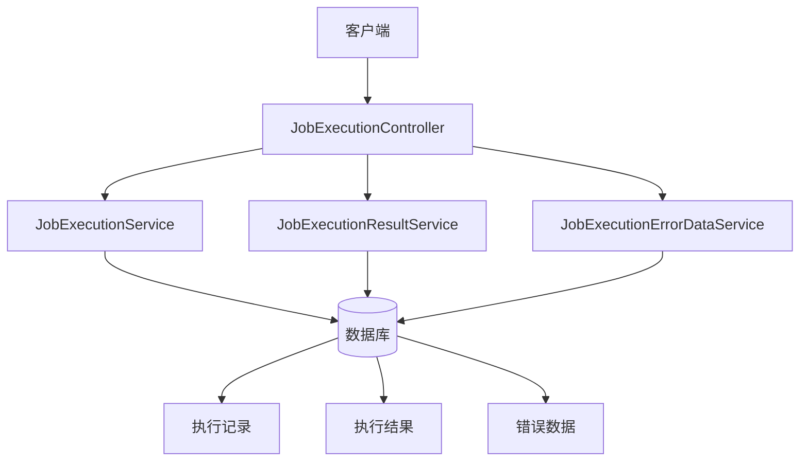
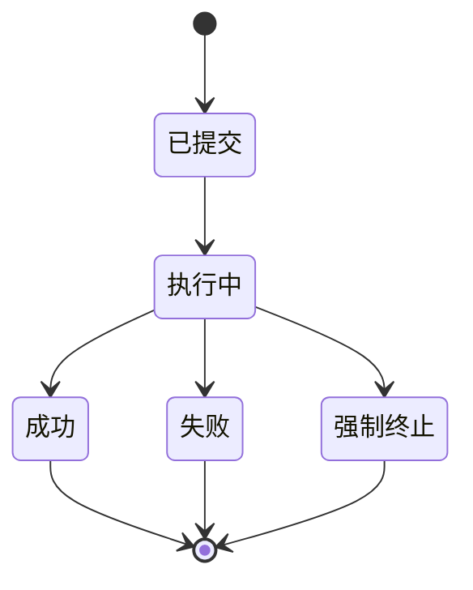
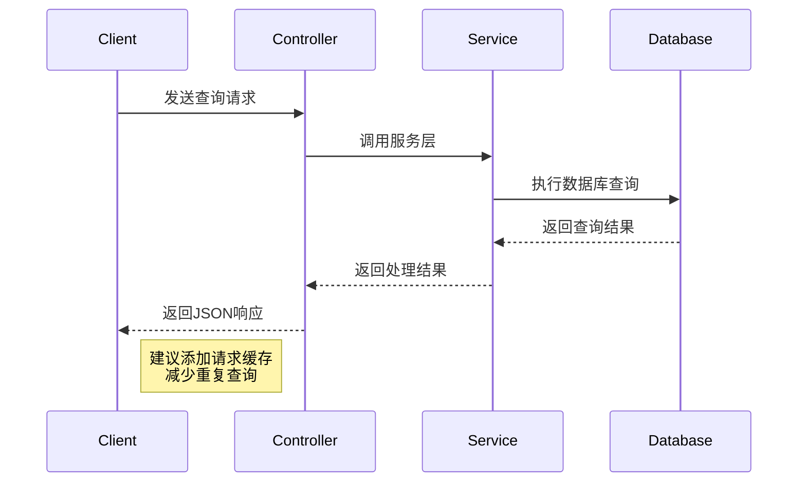

# 任务执行与监控API

<cite>
**本文档引用文件**  
- [JobExecutionController.java](file://datavines-server/src/main/java/io/datavines/server/api/controller/JobExecutionController.java)
- [JobExecutionVO.java](file://datavines-server/src/main/java/io/datavines/server/api/dto/vo/JobExecutionVO.java)
- [JobExecutionResultVO.java](file://datavines-server/src/main/java/io/datavines/server/api/dto/vo/JobExecutionResultVO.java)
- [JobExecutionPageParam.java](file://datavines-server/src/main/java/io/datavines/server/api/dto/bo/job/JobExecutionPageParam.java)
- [JobExecutionService.java](file://datavines-server/src/main/java/io/datavines/server/repository/service/JobExecutionService.java)
- [JobExecutionServiceImpl.java](file://datavines-server/src/main/java/io/datavines/server/repository/service/impl/JobExecutionServiceImpl.java)
- [JobExecutionResultService.java](file://datavines-server/src/main/java/io/datavines/server/repository/service/JobExecutionResultService.java)
- [JobExecutionResultServiceImpl.java](file://datavines-server/src/main/java/io/datavines/server/repository/service/impl/JobExecutionResultServiceImpl.java)
- [JobExecutionInfo.java](file://datavines-common/src/main/java/io/datavines/common/entity/JobExecutionInfo.java)
- [ExecutionStatus.java](file://datavines-common/src/main/java/io/datavines/common/enums/ExecutionStatus.java)
- [JobCheckState.java](file://datavines-server/src/main/java/io/datavines/server/enums/JobCheckState.java)
</cite>

## 目录
1. [简介](#简介)
2. [核心功能概述](#核心功能概述)
3. [任务执行状态查询接口](#任务执行状态查询接口)
4. [任务执行日志与结果获取](#任务执行日志与结果获取)
5. [历史执行记录分页查询](#历史执行记录分页查询)
6. [质量检查结果与报告](#质量检查结果与报告)
7. [数据模型详解](#数据模型详解)
8. [性能优化建议](#性能优化建议)
9. [错误处理与调试](#错误处理与调试)
10. [总结](#总结)

## 简介

任务执行与监控API是DataVines平台的核心组件之一，用于实时监控数据质量任务的执行状态、获取执行日志、分析检查结果以及查询历史执行记录。该API为用户提供了一套完整的任务生命周期管理能力，支持外部系统集成和自动化监控。

**Section sources**
- [JobExecutionController.java](file://datavines-server/src/main/java/io/datavines/server/api/controller/JobExecutionController.java#L1-L124)

## 核心功能概述

任务执行与监控API提供了以下核心功能：
- 实时查询任务执行状态
- 获取任务执行结果和质量检查详情
- 分页查询历史执行记录
- 支持按状态、时间范围、任务类型等条件过滤
- 提供聚合统计和趋势分析数据
- 支持外部数据质量任务提交



**Diagram sources**
- [JobExecutionController.java](file://datavines-server/src/main/java/io/datavines/server/api/controller/JobExecutionController.java#L44-L123)
- [JobExecutionService.java](file://datavines-server/src/main/java/io/datavines/server/repository/service/JobExecutionService.java)
- [JobExecutionResultService.java](file://datavines-server/src/main/java/io/datavines/server/repository/service/JobExecutionResultService.java)

**Section sources**
- [JobExecutionController.java](file://datavines-server/src/main/java/io/datavines/server/api/controller/JobExecutionController.java#L1-L124)

## 任务执行状态查询接口

### 获取任务执行状态

通过`GET /api/v1/job/execution/status/{executionId}`端点可以获取指定任务执行实例的当前状态。

**接口说明**
- **URL**: `/api/v1/job/execution/status/{executionId}`
- **方法**: GET
- **参数**: executionId（路径参数，执行ID）
- **返回**: 状态描述字符串

该接口直接返回任务的当前状态描述，如"执行中"、"成功"、"失败"等。

### 终止任务执行

通过`DELETE /api/v1/job/execution/kill/{executionId}`端点可以终止正在运行的任务。

**接口说明**
- **URL**: `/api/v1/job/execution/kill/{executionId}`
- **方法**: DELETE
- **参数**: executionId（路径参数，执行ID）
- **返回**: 操作结果

此操作会强制终止指定的任务执行实例。

**Section sources**
- [JobExecutionController.java](file://datavines-server/src/main/java/io/datavines/server/api/controller/JobExecutionController.java#L67-L77)

## 任务执行日志与结果获取

### 获取任务执行结果

系统提供了两个端点来获取任务执行结果：

1. **获取单个执行结果**：`GET /api/v1/job/execution/result/{executionId}`
2. **获取执行结果列表**：`GET /api/v1/job/execution/list/result/{executionId}`

**接口说明**
- **URL**: `/api/v1/job/execution/list/result/{executionId}`
- **方法**: GET
- **参数**: executionId（路径参数）
- **返回**: JobExecutionResultVO对象列表

该接口返回指定执行实例的详细检查结果，包括指标名称、检查结果、得分等信息。

**Section sources**
- [JobExecutionController.java](file://datavines-server/src/main/java/io/datavines/server/api/controller/JobExecutionController.java#L85-L96)
- [JobExecutionResultVO.java](file://datavines-server/src/main/java/io/datavines/server/api/dto/vo/JobExecutionResultVO.java#L26-L45)

## 历史执行记录分页查询

### 分页查询执行历史

通过`POST /api/v1/job/execution/page`端点可以分页查询任务执行历史记录。

**请求参数（JobExecutionPageParam）**
```json
{
  "datasourceId": 1,
  "status": 7,
  "searchVal": "test",
  "jobId": 100,
  "metricType": "table_row_count",
  "schemaName": "public",
  "tableName": "users",
  "columnName": "id",
  "startTime": "2023-01-01 00:00:00",
  "endTime": "2023-12-31 23:59:59",
  "pageNumber": 1,
  "pageSize": 10
}
```

**接口说明**
- **URL**: `/api/v1/job/execution/page`
- **方法**: POST
- **参数**: JobExecutionPageParam对象
- **返回**: 分页结果

支持多种过滤条件，包括数据源ID、执行状态、任务ID、指标类型、模式名、表名、列名和时间范围。

### 过滤特定状态的任务

可以通过设置`status`参数来过滤特定状态的任务执行记录。状态值对应ExecutionStatus枚举：

| 状态码 | 状态描述 | 中文描述 |
|--------|----------|----------|
| 0 | submitted | 已提交 |
| 1 | running | 执行中 |
| 6 | failure | 失败 |
| 7 | success | 成功 |
| 9 | kill | 强制终止 |

**Section sources**
- [JobExecutionController.java](file://datavines-server/src/main/java/io/datavines/server/api/controller/JobExecutionController.java#L98-L102)
- [JobExecutionPageParam.java](file://datavines-server/src/main/java/io/datavines/server/api/dto/bo/job/JobExecutionPageParam.java#L23-L57)
- [ExecutionStatus.java](file://datavines-common/src/main/java/io/datavines/common/enums/ExecutionStatus.java#L28-L57)

## 质量检查结果与报告

### 获取检查结果聚合数据

通过`POST /api/v1/job/execution/agg-pie`端点可以获取任务执行的聚合统计信息，通常用于饼图展示。

**接口说明**
- **URL**: `/api/v1/job/execution/agg-pie`
- **方法**: POST
- **参数**: JobExecutionDashboardParam对象
- **返回**: 聚合统计结果

### 获取执行趋势数据

通过`POST /api/v1/job/execution/trend-bar`端点可以获取任务执行的趋势数据，通常用于柱状图展示。

**接口说明**
- **URL**: `/api/v1/job/execution/trend-bar`
- **方法**: POST
- **参数**: JobExecutionDashboardParam对象
- **返回**: 趋势分析结果

这些接口为监控面板提供了数据支持，可以展示任务执行的成功率、失败率等关键指标。

**Section sources**
- [JobExecutionController.java](file://datavines-server/src/main/java/io/datavines/server/api/controller/JobExecutionController.java#L112-L122)

## 数据模型详解

### JobExecutionVO 对象结构

JobExecutionVO是任务执行视图对象，包含以下字段：

| 字段名 | 类型 | 说明 |
|--------|------|------|
| id | Long | 执行ID |
| name | String | 任务名称 |
| schemaName | String | 模式名 |
| tableName | String | 表名 |
| columnName | String | 列名 |
| metricType | String | 指标类型 |
| jobType | JobType | 任务类型 |
| status | ExecutionStatus | 执行状态 |
| checkState | JobCheckState | 检查状态 |
| startTime | LocalDateTime | 开始时间 |
| endTime | LocalDateTime | 结束时间 |
| updateTime | LocalDateTime | 更新时间 |

**状态转换逻辑**


**Section sources**
- [JobExecutionVO.java](file://datavines-server/src/main/java/io/datavines/server/api/dto/vo/JobExecutionVO.java#L29-L75)
- [ExecutionStatus.java](file://datavines-common/src/main/java/io/datavines/common/enums/ExecutionStatus.java)
- [JobCheckState.java](file://datavines-server/src/main/java/io/datavines/server/enums/JobCheckState.java)

### JobExecutionResultVO 对象结构

JobExecutionResultVO是任务执行结果视图对象，包含以下字段：

| 字段名 | 类型 | 说明 |
|--------|------|------|
| checkSubject | String | 检查主体 |
| metricName | String | 指标名称 |
| metricParameter | Map<String,Object> | 指标参数 |
| checkResult | String | 检查结果 |
| expectedType | String | 预期类型 |
| resultFormulaFormat | String | 结果公式格式 |
| score | BigDecimal | 得分 |
| executionTime | LocalDateTime | 执行时间 |

该对象用于传输任务执行的详细检查结果，支持多维度的质量分析。

**Section sources**
- [JobExecutionResultVO.java](file://datavines-server/src/main/java/io/datavines/server/api/dto/vo/JobExecutionResultVO.java#L26-L45)

## 性能优化建议

### 日志流式传输

对于长时间运行的任务，建议实现日志流式传输功能，避免一次性加载大量日志数据导致内存溢出。

**实现建议**
1. 使用分块传输编码（Chunked Transfer Encoding）
2. 实现日志游标机制，支持断点续传
3. 添加日志级别过滤功能
4. 支持日志搜索和高亮

### 分页查询优化

对于历史记录查询，建议：
- 合理设置分页大小，默认10-20条记录
- 添加适当的数据库索引
- 实现缓存机制，减少数据库查询压力
- 支持异步导出功能，避免长时间HTTP连接

### 接口调用最佳实践



**Diagram sources**
- [JobExecutionController.java](file://datavines-server/src/main/java/io/datavines/server/api/controller/JobExecutionController.java)
- [JobExecutionServiceImpl.java](file://datavines-server/src/main/java/io/datavines/server/repository/service/impl/JobExecutionServiceImpl.java)

**Section sources**
- [JobExecutionController.java](file://datavines-server/src/main/java/io/datavines/server/api/controller/JobExecutionController.java)
- [JobExecutionServiceImpl.java](file://datavines-server/src/main/java/io/datavines/server/repository/service/impl/JobExecutionServiceImpl.java)

## 错误处理与调试

### 常见错误码

| 错误码 | 说明 | 解决方案 |
|--------|------|----------|
| 400 | 参数校验失败 | 检查请求参数格式 |
| 404 | 执行ID不存在 | 确认执行ID正确性 |
| 500 | 服务器内部错误 | 查看服务日志 |

### 调试建议

1. 启用详细的日志记录
2. 使用统一的异常处理机制
3. 添加请求ID用于追踪
4. 实现健康检查端点

**Section sources**
- [JobExecutionController.java](file://datavines-server/src/main/java/io/datavines/server/api/controller/JobExecutionController.java)
- [JobExecutionServiceImpl.java](file://datavines-server/src/main/java/io/datavines/server/repository/service/impl/JobExecutionServiceImpl.java)

## 总结

任务执行与监控API为DataVines平台提供了完整的任务生命周期管理能力。通过这套API，用户可以实时监控任务状态、获取执行结果、查询历史记录并进行质量分析。建议在实际使用中结合性能优化建议，确保系统的稳定性和响应速度。