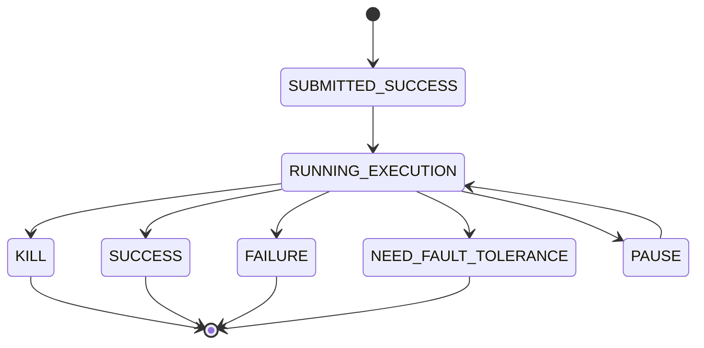
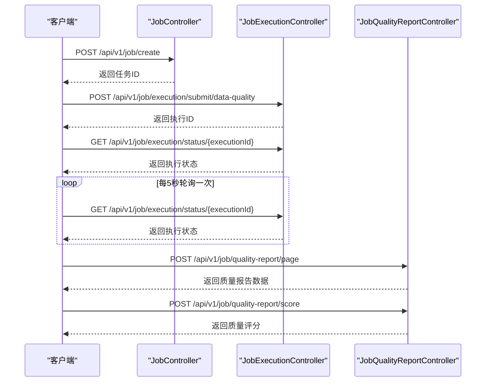

# 任务管理API

<cite>
**本文档引用的文件**  
- [JobController.java](file://datavines-server/src/main/java/io/datavines/server/api/controller/JobController.java)
- [JobCreate.java](file://datavines-server/src/main/java/io/datavines/server/api/dto/bo/job/JobCreate.java)
- [JobUpdate.java](file://datavines-server/src/main/java/io/datavines/server/api/dto/bo/job/JobUpdate.java)
- [JobVO.java](file://datavines-server/src/main/java/io/datavines/server/api/dto/vo/JobVO.java)
- [JobExecutionController.java](file://datavines-server/src/main/java/io/datavines/server/api/controller/JobExecutionController.java)
- [ExecutionStatus.java](file://datavines-common/src/main/java/io/datavines/common/enums/ExecutionStatus.java)
- [JobQualityReportController.java](file://datavines-server/src/main/java/io/datavines/server/api/controller/JobQualityReportController.java)
</cite>

## 目录
1. [简介](#简介)
2. [核心组件](#核心组件)
3. [任务管理API端点](#任务管理api端点)
4. [任务执行API端点](#任务执行api端点)
5. [任务质量报告API端点](#任务质量报告api端点)
6. [BO对象字段说明](#bo对象字段说明)
7. [VO对象数据结构](#vo对象数据结构)
8. [数据质量检查任务JSON示例](#数据质量检查任务json示例)
9. [任务状态生命周期](#任务状态生命周期)
10. [分页参数说明](#分页参数说明)
11. [错误响应码及解决方法](#错误响应码及解决方法)
12. [API调用流程](#api调用流程)

## 简介
任务管理API是DataVines平台的核心功能之一，提供对数据质量检查、数据校验等任务的全生命周期管理。该API支持任务的创建、更新、删除、查询和执行操作，为数据质量保障提供完整的RESTful接口支持。

## 核心组件

**本文档引用的文件**  
- [JobController.java](file://datavines-server/src/main/java/io/datavines/server/api/controller/JobController.java)
- [JobExecutionController.java](file://datavines-server/src/main/java/io/datavines/server/api/controller/JobExecutionController.java)
- [JobQualityReportController.java](file://datavines-server/src/main/java/io/datavines/server/api/controller/JobQualityReportController.java)

## 任务管理API端点

### 创建任务
- **HTTP方法**: POST
- **URL路径**: `/api/v1/job/create`
- **请求体**: JobCreate对象
- **响应格式**: 创建成功的任务ID

### 更新任务
- **HTTP方法**: PUT
- **URL路径**: `/api/v1/job/update`
- **请求体**: JobUpdate对象
- **响应格式**: 更新成功的任务信息

### 删除任务
- **HTTP方法**: DELETE
- **URL路径**: `/api/v1/job/delete/{id}`
- **路径参数**: id - 任务ID
- **响应格式**: 删除操作结果

### 查询任务
- **HTTP方法**: GET
- **URL路径**: `/api/v1/job/list`
- **查询参数**: 
  - pageNumber - 页码
  - pageSize - 每页大小
  - searchVal - 搜索关键字
- **响应格式**: 分页的任务列表

**本文档引用的文件**  
- [JobController.java](file://datavines-server/src/main/java/io/datavines/server/api/controller/JobController.java)

## 任务执行API端点

### 提交数据质量任务
- **HTTP方法**: POST
- **URL路径**: `/api/v1/job/execution/submit/data-quality`
- **请求体**: SubmitJob对象
- **响应格式**: 提交结果和执行ID

### 提交数据校验任务
- **HTTP方法**: POST
- **URL路径**: `/api/v1/job/execution/submit/data-reconciliation`
- **请求体**: SubmitJob对象
- **响应格式**: 提交结果和执行ID

### 终止任务
- **HTTP方法**: DELETE
- **URL路径**: `/api/v1/job/execution/kill/{executionId}`
- **路径参数**: executionId - 执行ID
- **响应格式**: 终止操作结果

### 获取任务状态
- **HTTP方法**: GET
- **URL路径**: `/api/v1/job/execution/status/{executionId}`
- **路径参数**: executionId - 执行ID
- **响应格式**: 任务当前状态描述

### 按任务ID获取执行列表
- **HTTP方法**: GET
- **URL路径**: `/api/v1/job/execution/list/{jobId}`
- **路径参数**: jobId - 任务ID
- **响应格式**: 该任务的所有执行记录列表

**本文档引用的文件**  
- [JobExecutionController.java](file://datavines-server/src/main/java/io/datavines/server/api/controller/JobExecutionController.java)

## 任务质量报告API端点

### 获取质量报告分页数据
- **HTTP方法**: POST
- **URL路径**: `/api/v1/job/quality-report/page`
- **请求体**: JobQualityReportDashboardParam对象
- **响应格式**: 分页的质量报告数据

### 获取质量评分
- **HTTP方法**: POST
- **URL路径**: `/api/v1/job/quality-report/score`
- **请求体**: JobQualityReportDashboardParam对象
- **响应格式**: 质量评分和等级

### 获取质量评分趋势
- **HTTP方法**: POST
- **URL路径**: `/api/v1/job/quality-report/score/trend`
- **请求体**: JobQualityReportDashboardParam对象
- **响应格式**: 质量评分趋势数据

**本文档引用的文件**  
- [JobQualityReportController.java](file://datavines-server/src/main/java/io/datavines/server/api/controller/JobQualityReportController.java)

## BO对象字段说明

### JobCreate对象
- **name**: 任务名称，不能为空
- **schemaName**: 模式名称
- **tableName**: 表名称
- **columnName**: 列名称
- **type**: 任务类型，从JobType枚举中选择
- **updater**: 更新者

### JobUpdate对象
- 继承JobCreate的所有字段
- **id**: 任务ID，不能为空，用于标识要更新的任务

### JobExecutionPageParam对象
- **datasourceId**: 数据源ID
- **status**: 执行状态
- **searchVal**: 搜索关键字
- **jobId**: 任务ID
- **metricType**: 指标类型
- **schemaName**: 模式名称
- **tableName**: 表名称
- **columnName**: 列名称
- **startTime**: 开始时间
- **endTime**: 结束时间
- **pageNumber**: 页码
- **pageSize**: 每页大小

**本文档引用的文件**  
- [JobCreate.java](file://datavines-server/src/main/java/io/datavines/server/api/dto/bo/job/JobCreate.java)
- [JobUpdate.java](file://datavines-server/src/main/java/io/datavines/server/api/dto/bo/job/JobUpdate.java)
- [JobExecutionPageParam.java](file://datavines-server/src/main/java/io/datavines/server/api/dto/bo/job/JobExecutionPageParam.java)

## VO对象数据结构

### JobVO对象
- **id**: 任务ID
- **name**: 任务名称
- **schemaName**: 模式名称
- **tableName**: 表名称
- **columnName**: 列名称
- **type**: 任务类型
- **updater**: 更新者
- **slaList**: SLA列表

### JobExecutionVO对象
- **id**: 执行ID
- **name**: 任务名称
- **schemaName**: 模式名称
- **status**: 执行状态
- **startTime**: 开始时间
- **endTime**: 结束时间
- **applicationId**: 应用ID

### JobQualityReportVO对象
- **id**: 报告ID
- **datasourceId**: 数据源ID
- **schemaName**: 模式名称
- **tableName**: 表名称
- **score**: 质量评分
- **reportDate**: 报告日期
- **qualityLevel**: 质量等级

**本文档引用的文件**  
- [JobVO.java](file://datavines-server/src/main/java/io/datavines/server/api/dto/vo/JobVO.java)
- [JobExecutionVO.java](file://datavines-server/src/main/java/io/datavines/server/api/dto/vo/JobExecutionVO.java)

## 数据质量检查任务JSON示例

```json
{
  "job": {
    "name": "用户表数据质量检查",
    "schemaName": "public",
    "tableName": "users",
    "columnName": "email",
    "type": "DATA_QUALITY",
    "updater": "admin"
  },
  "jobParameter": {
    "metricType": "COLUMN_NOT_NULL",
    "expectedValue": {
      "type": "FIX",
      "value": "true"
    },
    "source": {
      "datasourceId": 1,
      "database": "production_db",
      "table": "users"
    }
  },
  "schedule": {
    "type": "CRON",
    "expression": "0 0 2 * * ?"
  }
}
```

**本文档引用的文件**  
- [JobCreate.java](file://datavines-server/src/main/java/io/datavines/server/api/dto/bo/job/JobCreate.java)

## 任务状态生命周期

任务执行状态遵循以下生命周期：



**本文档引用的文件**  
- [ExecutionStatus.java](file://datavines-common/src/main/java/io/datavines/common/enums/ExecutionStatus.java)

## 分页参数说明

所有分页查询接口均支持以下参数：

| 参数名 | 类型 | 必需 | 描述 |
|--------|------|------|------|
| pageNumber | Integer | 是 | 当前页码，从1开始 |
| pageSize | Integer | 是 | 每页记录数，建议不超过100 |
| searchVal | String | 否 | 搜索关键字，用于模糊匹配 |
| schemaSearch | String | 否 | 模式名称搜索 |
| tableSearch | String | 否 | 表名称搜索 |
| columnSearch | String | 否 | 列名称搜索 |

这些参数通过请求体传递，用于控制查询结果的分页和过滤。

**本文档引用的文件**  
- [JobExecutionPageParam.java](file://datavines-server/src/main/java/io/datavines/server/api/dto/bo/job/JobExecutionPageParam.java)

## 错误响应码及解决方法

| 错误码 | 错误类型 | 描述 | 解决方法 |
|--------|----------|------|----------|
| 400 | Bad Request | 请求参数无效 | 检查请求体中的必填字段是否完整，数据类型是否正确 |
| 404 | Not Found | 资源未找到 | 确认请求的资源ID是否存在，URL路径是否正确 |
| 500 | Internal Server Error | 服务器内部错误 | 检查服务器日志，联系系统管理员 |
| 401 | Unauthorized | 未授权访问 | 确保请求包含有效的认证令牌 |
| 403 | Forbidden | 禁止访问 | 确认当前用户有权限执行该操作 |

**本文档引用的文件**  
- [Status.java](file://datavines-core/src/main/java/io/datavines/core/enums/Status.java)

## API调用流程



**本文档引用的文件**  
- [JobController.java](file://datavines-server/src/main/java/io/datavines/server/api/controller/JobController.java)
- [JobExecutionController.java](file://datavines-server/src/main/java/io/datavines/server/api/controller/JobExecutionController.java)
- [JobQualityReportController.java](file://datavines-server/src/main/java/io/datavines/server/api/controller/JobQualityReportController.java)