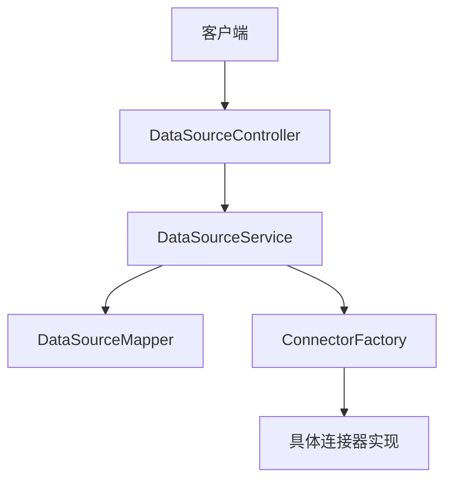
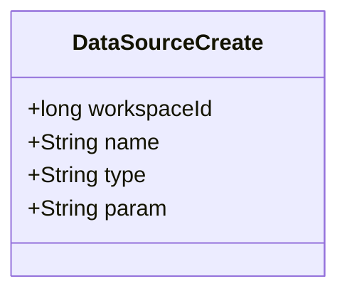
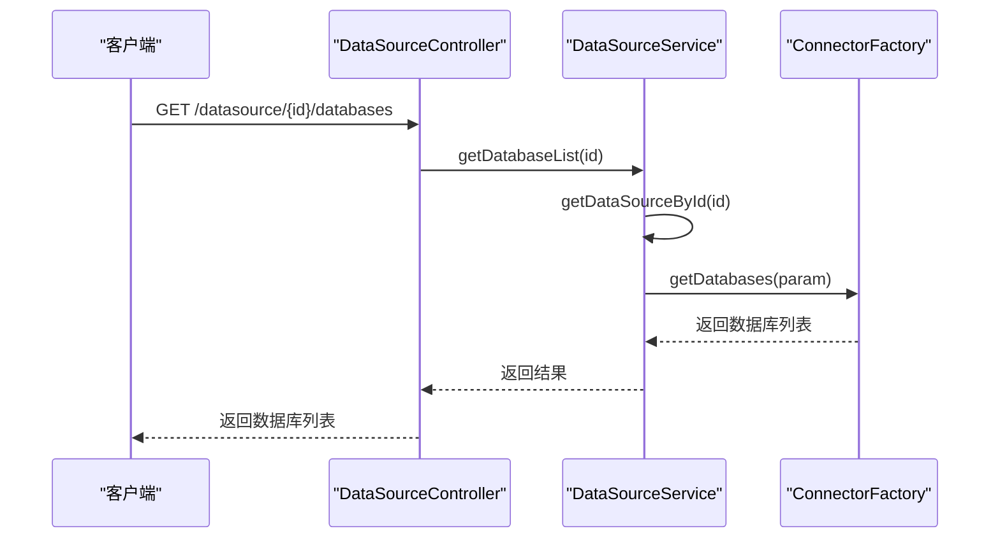
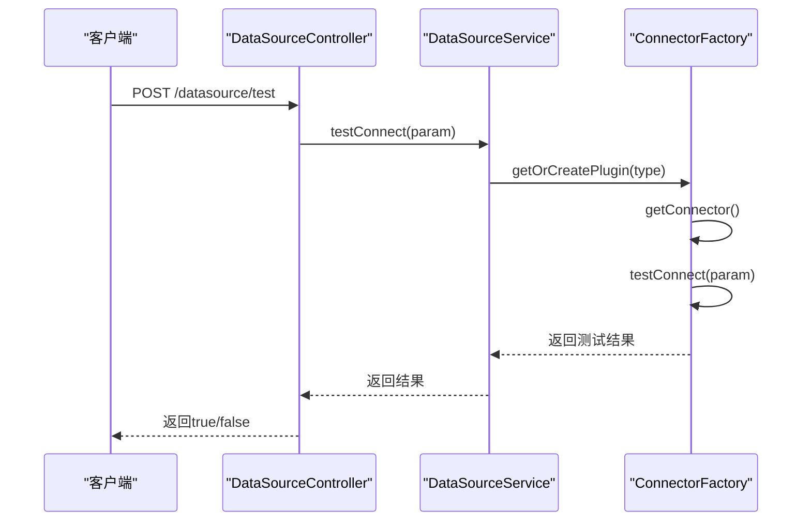
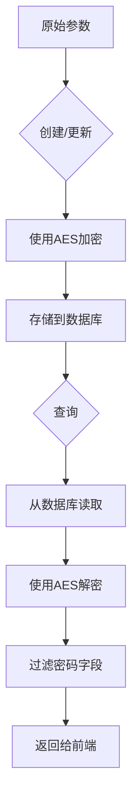

# 数据源管理API

<cite>
**本文档中引用的文件**  
- [DataSourceController.java](file://datavines-server/src/main/java/io/datavines/server/api/controller/DataSourceController.java)
- [DataSourceCreate.java](file://datavines-server/src/main/java/io/datavines/server/api/dto/bo/datasource/DataSourceCreate.java)
- [DataSourceUpdate.java](file://datavines-server/src/main/java/io/datavines/server/api/dto/bo/datasource/DataSourceUpdate.java)
- [TestConnectionRequestParam.java](file://datavines-common/src/main/java/io/datavines/common/param/TestConnectionRequestParam.java)
- [ConnectorRequestParam.java](file://datavines-common/src/main/java/io/datavines/common/param/ConnectorRequestParam.java)
- [ExecuteRequest.java](file://datavines-server/src/main/java/io/datavines/server/api/dto/bo/datasource/ExecuteRequest.java)
- [DataSourceService.java](file://datavines-server/src/main/java/io/datavines/server/repository/service/DataSourceService.java)
- [DataSourceServiceImpl.java](file://datavines-server/src/main/java/io/datavines/server/repository/service/impl/DataSourceServiceImpl.java)
- [GetDatabasesRequestParam.java](file://datavines-common/src/main/java/io/datavines/common/param/GetDatabasesRequestParam.java)
- [GetTablesRequestParam.java](file://datavines-common/src/main/java/io/datavines/common/param/GetTablesRequestParam.java)
- [GetColumnsRequestParam.java](file://datavines-common/src/main/java/io/datavines/common/param/GetColumnsRequestParam.java)
- [CryptionUtils.java](file://datavines-common/src/main/java/io/datavines/common/utils/CryptionUtils.java)
</cite>

## 目录
1. [简介](#简介)
2. [核心接口说明](#核心接口说明)
3. [数据源创建请求体](#数据源创建请求体)
4. [数据库/表/列信息获取](#数据库表列信息获取)
5. [测试连接接口](#测试连接接口)
6. [敏感信息加密传输](#敏感信息加密传输)
7. [权限校验机制](#权限校验机制)

## 简介
数据源管理API提供了对各类数据源的全生命周期管理功能，包括数据源的增删改查、连接测试以及数据库元数据获取等操作。该API通过统一的接口设计支持多种数据库类型，并确保敏感信息的安全传输与存储。

**Section sources**
- [DataSourceController.java](file://datavines-server/src/main/java/io/datavines/server/api/controller/DataSourceController.java#L48-L167)

## 核心接口说明
数据源管理API提供了以下核心接口：

- **创建数据源**: `POST /api/v1/datasource`
- **更新数据源**: `PUT /api/v1/datasource`
- **删除数据源**: `DELETE /api/v1/datasource/{id}`
- **获取数据源分页列表**: `GET /api/v1/datasource/page`
- **测试连接**: `POST /api/v1/datasource/test`
- **获取数据库列表**: `GET /api/v1/datasource/{id}/databases`
- **获取表列表**: `GET /api/v1/datasource/{id}/{database}/tables`
- **获取列信息**: `GET /api/v1/datasource/{id}/{database}/{table}/columns`
- **执行脚本**: `POST /api/v1/datasource/execute`
- **获取配置JSON**: `GET /api/v1/datasource/config/{type}`
- **获取连接器类型列表**: `GET /api/v1/datasource/type/list`

这些接口由`DataSourceController`统一提供，通过RESTful风格设计，便于集成和使用。

**Diagram sources**
- [DataSourceController.java](file://datavines-server/src/main/java/io/datavines/server/api/controller/DataSourceController.java#L48-L167)
- [DataSourceService.java](file://datavines-server/src/main/java/io/datavines/server/repository/service/DataSourceService.java#L32-L59)

**Section sources**
- [DataSourceController.java](file://datavines-server/src/main/java/io/datavines/server/api/controller/DataSourceController.java#L48-L167)
- [DataSourceService.java](file://datavines-server/src/main/java/io/datavines/server/repository/service/DataSourceService.java#L32-L59)

## 数据源创建请求体
`DataSourceCreate`请求体用于创建新的数据源，包含以下参数：

- **workspaceId**: 工作空间ID，不能为空
- **name**: 数据源名称，不能为空
- **type**: 数据源类型（如mysql、postgresql等），不能为空
- **param**: 连接参数，以JSON字符串形式传递，不能为空

其中`param`字段包含具体的连接信息，如JDBC URL、用户名、密码等，这些敏感信息在传输和存储过程中都会进行加密处理。

**Diagram sources**
- [DataSourceCreate.java](file://datavines-server/src/main/java/io/datavines/server/api/dto/bo/datasource/DataSourceCreate.java#L26-L39)

**Section sources**
- [DataSourceCreate.java](file://datavines-server/src/main/java/io/datavines/server/api/dto/bo/datasource/DataSourceCreate.java#L26-L39)

## 数据库表列信息获取
系统提供了获取指定数据源的数据库、表和列信息的接口：

### 获取数据库列表
通过`GET /api/v1/datasource/{id}/databases`接口获取指定数据源的所有数据库列表。系统会根据数据源ID查询其配置信息，并通过对应的连接器获取数据库列表。

### 获取表列表
通过`GET /api/v1/datasource/{id}/{database}/tables`接口获取指定数据库中的所有表。需要提供数据源ID和数据库名称。

### 获取列信息
通过`GET /api/v1/datasource/{id}/{database}/{table}/columns`接口获取指定表的所有列信息。需要提供数据源ID、数据库名称和表名。

这些操作的实现依赖于`ConnectorFactory`插件机制，不同类型的数据库通过各自的连接器实现来获取元数据。

**Diagram sources**
- [DataSourceController.java](file://datavines-server/src/main/java/io/datavines/server/api/controller/DataSourceController.java#L89-L99)
- [DataSourceServiceImpl.java](file://datavines-server/src/main/java/io/datavines/server/repository/service/impl/DataSourceServiceImpl.java#L269-L286)

**Section sources**
- [DataSourceController.java](file://datavines-server/src/main/java/io/datavines/server/api/controller/DataSourceController.java#L89-L131)
- [GetDatabasesRequestParam.java](file://datavines-common/src/main/java/io/datavines/common/param/GetDatabasesRequestParam.java#L17-L26)
- [GetTablesRequestParam.java](file://datavines-common/src/main/java/io/datavines/common/param/GetTablesRequestParam.java#L17-L27)
- [GetColumnsRequestParam.java](file://datavines-common/src/main/java/io/datavines/common/param/GetColumnsRequestParam.java#L17-L30)

## 测试连接接口
测试连接接口用于验证数据源配置的正确性：

- **接口地址**: `POST /api/v1/datasource/test`
- **请求体**: `TestConnectionRequestParam`
- **返回值**: 布尔值，true表示连接成功，false表示连接失败

该接口接收包含数据源类型和连接参数的请求体，通过`PluginLoader`加载对应的`ConnectorFactory`，然后调用连接器的测试连接方法。

**Diagram sources**
- [DataSourceController.java](file://datavines-server/src/main/java/io/datavines/server/api/controller/DataSourceController.java#L56-L60)
- [DataSourceServiceImpl.java](file://datavines-server/src/main/java/io/datavines/server/repository/service/impl/DataSourceServiceImpl.java#L76-L80)

**Section sources**
- [DataSourceController.java](file://datavines-server/src/main/java/io/datavines/server/api/controller/DataSourceController.java#L56-L60)
- [TestConnectionRequestParam.java](file://datavines-common/src/main/java/io/datavines/common/param/TestConnectionRequestParam.java#L17-L26)
- [ConnectorRequestParam.java](file://datavines-common/src/main/java/io/datavines/common/param/ConnectorRequestParam.java#L17-L28)

## 敏感信息加密传输
系统对数据源的敏感信息（如密码）采用AES加密算法进行加密传输和存储：

- **加密算法**: AES/CBC/PKCS5Padding
- **密钥**: 从配置文件中读取的AES密钥
- **IV参数**: 0123456789ABCEDF

在创建或更新数据源时，系统会自动对`param`字段进行AES加密，然后存储到数据库中。在读取数据源信息时，再进行解密操作。同时，在返回给前端的响应中，密码字段会被替换为NULL，以防止敏感信息泄露。

**Diagram sources**
- [DataSourceServiceImpl.java](file://datavines-server/src/main/java/io/datavines/server/repository/service/impl/DataSourceServiceImpl.java#L113-L116)
- [CryptionUtils.java](file://datavines-common/src/main/java/io/datavines/common/utils/CryptionUtils.java#L25-L84)

**Section sources**
- [DataSourceServiceImpl.java](file://datavines-server/src/main/java/io/datavines/server/repository/service/impl/DataSourceServiceImpl.java#L113-L116)
- [CryptionUtils.java](file://datavines-common/src/main/java/io/datavines/common/utils/CryptionUtils.java#L25-L84)

## 权限校验机制
系统通过以下机制实现权限校验：

1. **Token校验**: 使用`@RefreshToken`注解和`AuthenticationInterceptor`拦截器对每个API请求进行Token校验
2. **工作空间隔离**: 数据源与工作空间关联，用户只能访问所属工作空间的数据源
3. **操作权限控制**: 通过`ContextHolder.getUserId()`获取当前用户ID，确保只有创建者或管理员才能进行修改和删除操作

这些机制确保了数据源管理的安全性和数据隔离性。

**Section sources**
- [DataSourceController.java](file://datavines-server/src/main/java/io/datavines/server/api/controller/DataSourceController.java#L47)
- [DataSourceServiceImpl.java](file://datavines-server/src/main/java/io/datavines/server/repository/service/impl/DataSourceServiceImpl.java#L123-L124)