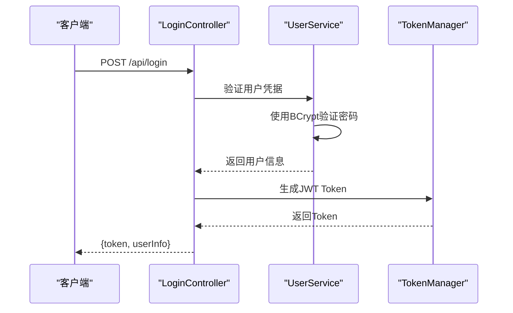
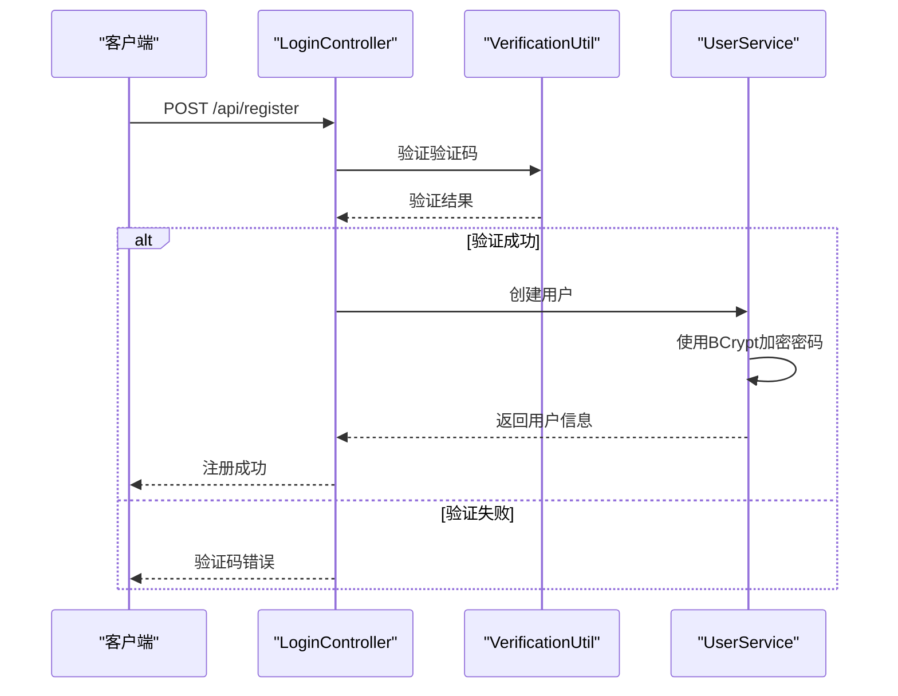
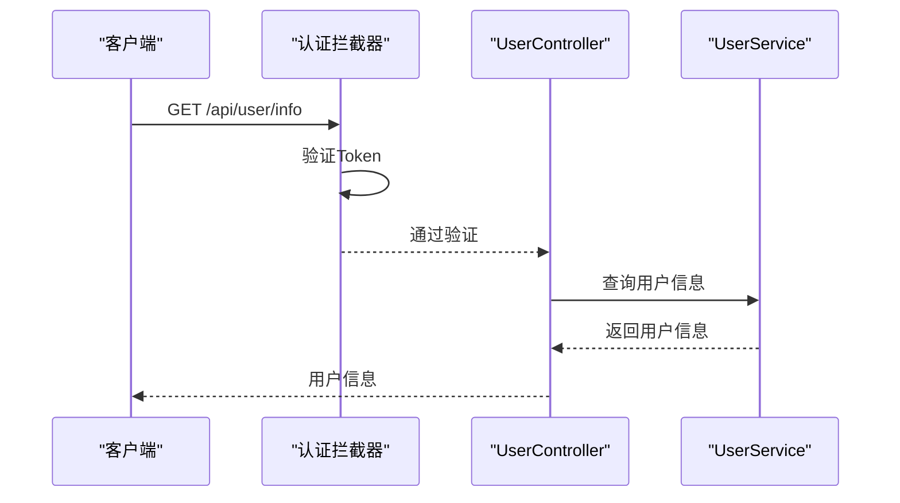
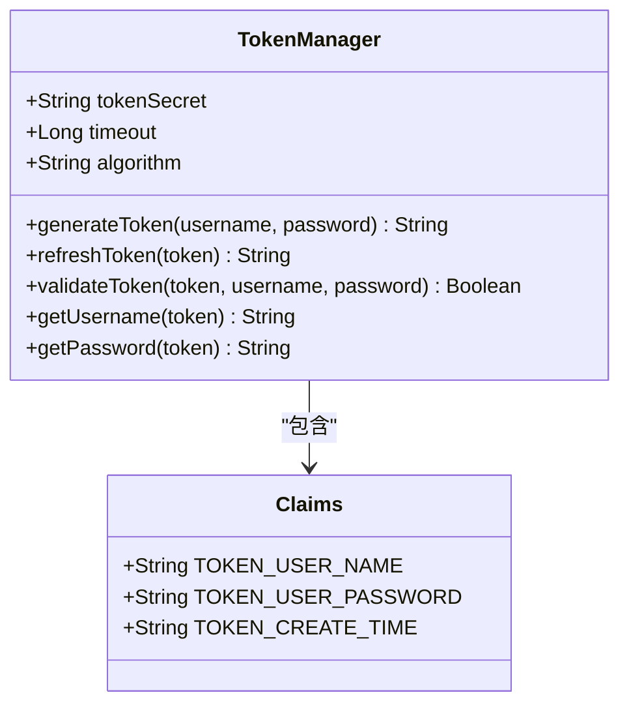
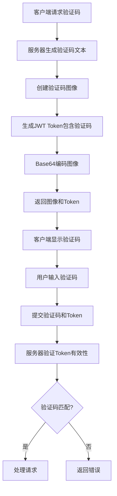

# 认证与用户管理API

<cite>
**本文档中引用的文件**   
- [LoginController.java](file://datavines-server/src/main/java/io/datavines/server/api/controller/LoginController.java)
- [UserController.java](file://datavines-server/src/main/java/io/datavines/server/api/controller/UserController.java)
- [UserLogin.java](file://datavines-server/src/main/java/io/datavines/server/api/dto/bo/user/UserLogin.java)
- [UserRegister.java](file://datavines-server/src/main/java/io/datavines/server/api/dto/bo/user/UserRegister.java)
- [UserResetPassword.java](file://datavines-server/src/main/java/io/datavines/server/api/dto/bo/user/UserResetPassword.java)
- [TokenManager.java](file://datavines-core/src/main/java/io/datavines/core/utils/TokenManager.java)
- [VerificationUtil.java](file://datavines-server/src/main/java/io/datavines/server/utils/VerificationUtil.java)
- [KaptchaConfig.java](file://datavines-server/src/main/java/io/datavines/server/api/config/KaptchaConfig.java)
- [UserServiceImpl.java](file://datavines-server/src/main/java/io/datavines/server/repository/service/impl/UserServiceImpl.java)
- [AuthenticationInterceptor.java](file://datavines-server/src/main/java/io/datavines/server/api/inteceptor/AuthenticationInterceptor.java)
</cite>

## 目录
1. [简介](#简介)
2. [认证流程](#认证流程)
3. [用户管理API](#用户管理api)
4. [JWT Token管理](#jwt-token管理)
5. [验证码集成](#验证码集成)
6. [安全最佳实践](#安全最佳实践)

## 简介

DataVines平台提供了一套完整的认证与用户管理API，支持用户登录、注册、密码重置和用户信息管理等功能。系统采用JWT（JSON Web Token）进行身份验证，结合Kaptcha验证码机制增强安全性。本文档详细描述了LoginController和UserController的端点，包括JWT Token的生成、刷新和失效机制。

**本文档中引用的文件**   
- [LoginController.java](file://datavines-server/src/main/java/io/datavines/server/api/controller/LoginController.java#L1-L77)
- [UserController.java](file://datavines-server/src/main/java/io/datavines/server/api/controller/UserController.java#L1-L56)

## 认证流程

### 用户登录

用户登录通过`/login`端点实现，客户端需要发送包含用户名和密码的JSON请求体。系统验证凭据后返回JWT Token和用户信息。



**图示来源**
- [LoginController.java](file://datavines-server/src/main/java/io/datavines/server/api/controller/LoginController.java#L51-L58)
- [UserServiceImpl.java](file://datavines-server/src/main/java/io/datavines/server/repository/service/impl/UserServiceImpl.java#L58-L77)
- [TokenManager.java](file://datavines-core/src/main/java/io/datavines/core/utils/TokenManager.java#L51-L57)

### 用户注册

用户注册通过`/register`端点实现，需要提供用户名、邮箱、密码和验证码信息。系统会验证验证码的有效性，并在成功注册后创建用户账户。



**图示来源**
- [LoginController.java](file://datavines-server/src/main/java/io/datavines/server/api/controller/LoginController.java#L60-L68)
- [VerificationUtil.java](file://datavines-server/src/main/java/io/datavines/server/utils/VerificationUtil.java#L60-L75)
- [UserServiceImpl.java](file://datavines-server/src/main/java/io/datavines/server/repository/service/impl/UserServiceImpl.java#L80-L124)

### UserLogin请求体结构

UserLogin请求体包含用户名和密码字段，使用JSR-303验证注解确保数据完整性。

```json
{
  "username": "string",
  "password": "string"
}
```

字段说明：
- **username**: 用户名，不能为空
- **password**: 密码，长度必须在6-20个字符之间

**本文档中引用的文件**   
- [UserLogin.java](file://datavines-server/src/main/java/io/datavines/server/api/dto/bo/user/UserLogin.java#L26-L36)

## 用户管理API

### 用户信息管理

UserController提供用户信息更新和密码重置功能。需要在请求头中包含有效的JWT Token进行身份验证。

#### 获取当前用户信息

通过`/user/info`端点获取当前登录用户的信息。系统从Token中提取用户名，并查询数据库获取完整用户信息。



**图示来源**
- [AuthenticationInterceptor.java](file://datavines-server/src/main/java/io/datavines/server/api/inteceptor/AuthenticationInterceptor.java#L54-L98)
- [UserController.java](file://datavines-server/src/main/java/io/datavines/server/api/controller/UserController.java#L39-L55)

#### 更新用户资料

通过`/user/update`端点更新用户资料。需要提供完整的用户信息对象。

```json
{
  "username": "new_username",
  "email": "new_email@example.com",
  "phone": "new_phone"
}
```

**本文档中引用的文件**   
- [UserController.java](file://datavines-server/src/main/java/io/datavines/server/api/controller/UserController.java#L43-L47)

### 密码重置

密码重置通过`/user/resetPassword`端点实现，需要提供用户ID、旧密码和新密码。

```json
{
  "id": 123,
  "oldPassword": "old_password",
  "newPassword": "new_password",
  "newPasswordConfirm": "new_password"
}
```

系统会验证旧密码的正确性，并确保新密码和确认密码一致。

**本文档中引用的文件**   
- [UserResetPassword.java](file://datavines-server/src/main/java/io/datavines/server/api/dto/bo/user/UserResetPassword.java#L27-L45)
- [UserServiceImpl.java](file://datavines-server/src/main/java/io/datavines/server/repository/service/impl/UserServiceImpl.java#L133-L153)

## JWT Token管理

### Token生成

TokenManager负责JWT Token的生成和验证。Token包含用户名、密码和创建时间等声明。



**图示来源**
- [TokenManager.java](file://datavines-core/src/main/java/io/datavines/core/utils/TokenManager.java#L40-L197)

### Token刷新机制

使用`@RefreshToken`注解的控制器会自动刷新Token。当用户访问这些端点时，系统会生成一个新的Token，延长会话有效期。

```java
@RefreshToken
@RestController
@RequestMapping(value = DataVinesConstants.BASE_API_PATH + "/user")
public class UserController {
    // ...
}
```

**本文档中引用的文件**   
- [RefreshToken.java](file://datavines-core/src/main/java/io/datavines/core/aop/RefreshToken.java#L24-L27)
- [UserController.java](file://datavines-server/src/main/java/io/datavines/server/api/controller/UserController.java#L37)

### Token传递方式

Token通过Authorization头在后续API调用中传递：

```
Authorization: Bearer <JWT_TOKEN>
```

或者作为查询参数：

```
?token=<JWT_TOKEN>
```

**本文档中引用的文件**   
- [AuthenticationInterceptor.java](file://datavines-server/src/main/java/io/datavines/server/api/inteceptor/AuthenticationInterceptor.java#L74-L81)

## 验证码集成

### Kaptcha配置

系统使用Kaptcha库生成验证码图像，相关配置在KaptchaConfig类中定义。

```java
@Configuration
public class KaptchaConfig {
    
    @Value("${kaptcha.border:yes}")
    private String kaptchaBorder;
    
    @Value("${kaptcha.image.width:125}")
    private String kaptchaImageWidth;
    
    @Value("${kaptcha.textproducer.char.length:4}")
    private String getKaptchaTextproducerCharLength;
    
    @Bean
    public DefaultKaptcha captchaProducer(){
        // ...
    }
}
```

**本文档中引用的文件**   
- [KaptchaConfig.java](file://datavines-server/src/main/java/io/datavines/server/api/config/KaptchaConfig.java#L27-L73)

### 验证码流程

验证码流程包括生成验证码图像和JWT Token，客户端提交时验证两者的一致性。



**图示来源**
- [VerificationUtil.java](file://datavines-server/src/main/java/io/datavines/server/utils/VerificationUtil.java#L52-L112)
- [KaptchaResp.java](file://datavines-server/src/main/java/io/datavines/server/api/dto/vo/KaptchaResp.java#L26-L36)

## 安全最佳实践

### 密码安全

系统使用BCrypt算法对密码进行哈希处理，确保即使数据库泄露，攻击者也无法轻易获取原始密码。

```java
// 密码加密
String hashedPassword = BCrypt.hashpw(password, BCrypt.gensalt());

// 密码验证
boolean isValid = BCrypt.checkpw(inputPassword, hashedPassword);
```

**本文档中引用的文件**   
- [UserServiceImpl.java](file://datavines-server/src/main/java/io/datavines/server/repository/service/impl/UserServiceImpl.java#L65-L66)

### Token安全

- Token包含过期时间，防止长期有效的安全风险
- Token使用HS256算法签名，防止篡改
- 敏感操作需要验证Token存在性

```java
@CheckTokenExist
@PostMapping("/sensitive-operation")
public Object sensitiveOperation() {
    // ...
}
```

**本文档中引用的文件**   
- [CheckTokenExist.java](file://datavines-server/src/main/java/io/datavines/server/api/annotation/CheckTokenExist.java#L24-L27)
- [TokenManager.java](file://datavines-core/src/main/java/io/datavines/core/utils/TokenManager.java#L191-L194)

### 输入验证

所有API端点都使用JSR-303验证注解，确保输入数据的完整性和安全性。

```java
@Data
@NotNull(message = "UserLogin cannot be null")
public class UserLogin {
    
    @NotBlank(message = "Username cannot be empty")
    private String username;
    
    @NotBlank(message = "Password cannot be empty")
    @Pattern(regexp = CommonConstants.REG_USER_PASSWORD, message = "password length must between 6-20")
    private String password;
}
```

**本文档中引用的文件**   
- [UserLogin.java](file://datavines-server/src/main/java/io/datavines/server/api/dto/bo/user/UserLogin.java#L26-L36)