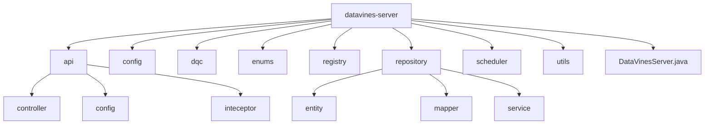
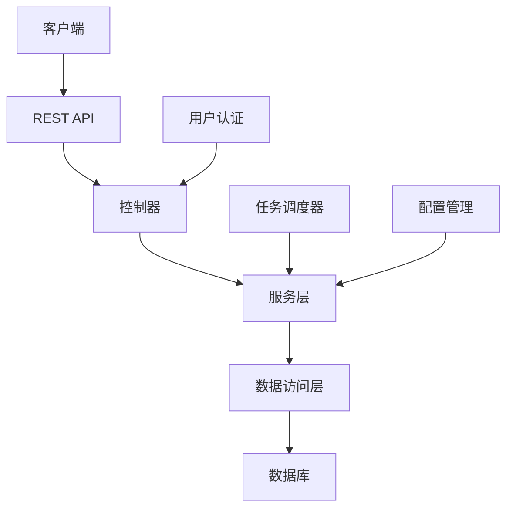
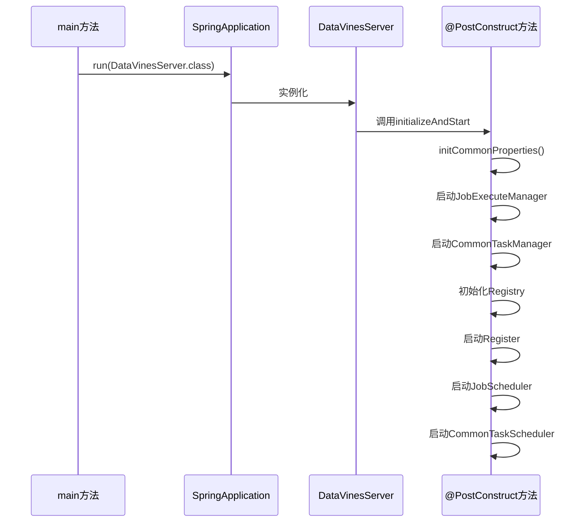
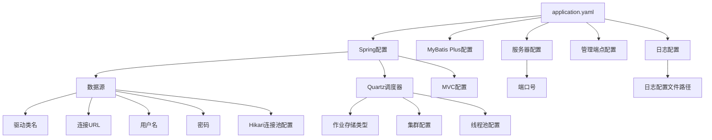
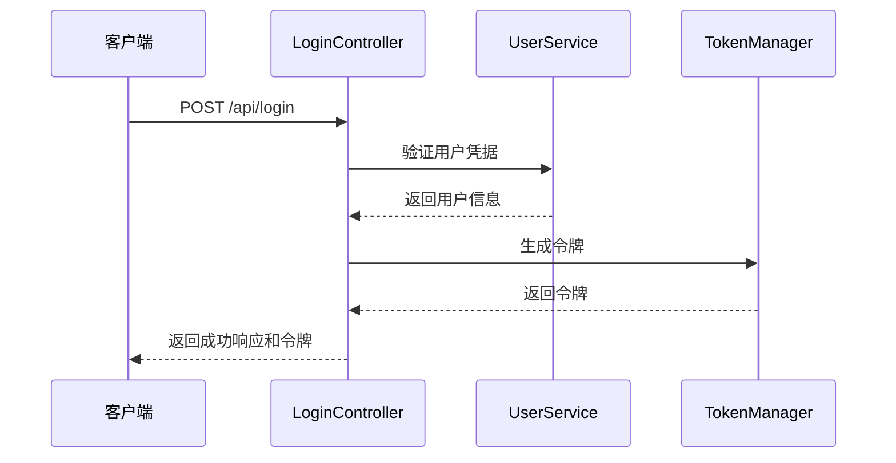
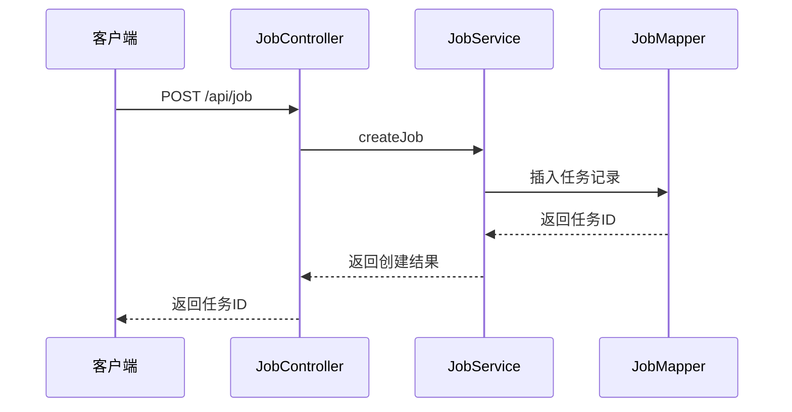
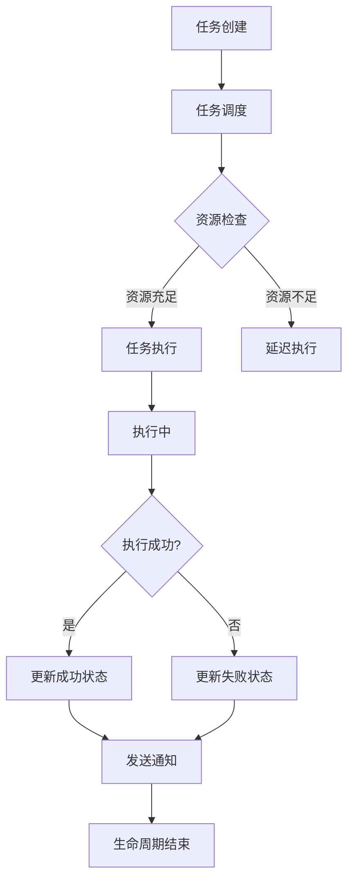
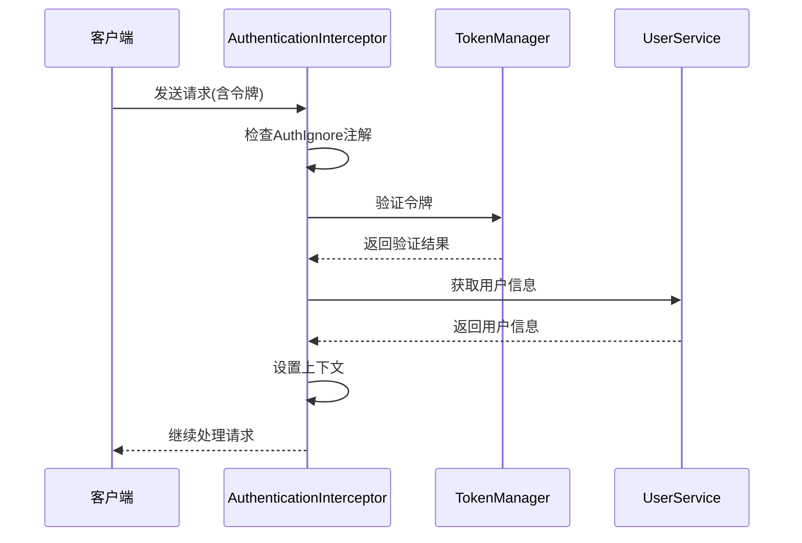
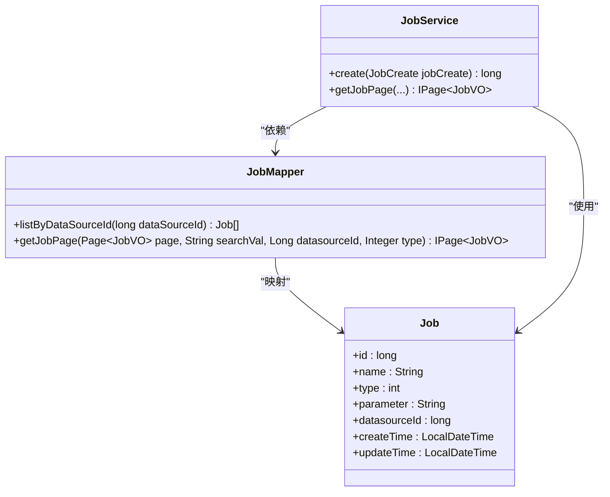
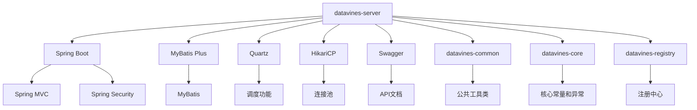

# datavines-server模块

<cite>
**本文档中引用的文件**  
- [DataVinesServer.java](file://datavines-server/src/main/java/io/datavines/server/DataVinesServer.java)
- [application.yaml](file://datavines-server/src/main/resources/application.yaml)
- [LoginController.java](file://datavines-server/src/main/java/io/datavines/server/api/controller/LoginController.java)
- [JobController.java](file://datavines-server/src/main/java/io/datavines/server/api/controller/JobController.java)
- [WebMvcConfig.java](file://datavines-server/src/main/java/io/datavines/server/api/config/WebMvcConfig.java)
- [MybatisPlusConfig.java](file://datavines-server/src/main/java/io/datavines/server/api/config/MybatisPlusConfig.java)
- [AuthenticationInterceptor.java](file://datavines-server/src/main/java/io/datavines/server/api/inteceptor/AuthenticationInterceptor.java)
- [JobScheduler.java](file://datavines-server/src/main/java/io/datavines/server/dqc/coordinator/runner/JobScheduler.java)
- [CommonTaskManager.java](file://datavines-server/src/main/java/io/datavines/server/scheduler/CommonTaskManager.java)
- [JobService.java](file://datavines-server/src/main/java/io/datavines/server/repository/service/JobService.java)
- [JobMapper.java](file://datavines-server/src/main/java/io/datavines/server/repository/mapper/JobMapper.java)
</cite>

## 目录
1. [简介](#简介)
2. [项目结构](#项目结构)
3. [核心组件](#核心组件)
4. [架构概述](#架构概述)
5. [详细组件分析](#详细组件分析)
6. [依赖分析](#依赖分析)
7. [性能考虑](#性能考虑)
8. [故障排除指南](#故障排除指南)
9. [结论](#结论)

## 简介
datavines-server模块是DataVines数据质量平台的核心服务组件，提供REST API接口、任务调度、元数据管理、用户认证和权限控制等关键功能。该模块基于Spring Boot框架构建，实现了数据质量检测任务的创建、执行和监控完整生命周期管理。通过MyBatis Plus与数据库交互，使用Quartz实现任务调度，并通过JWT实现用户认证和权限控制。

## 项目结构
datavines-server模块遵循标准的Spring Boot项目结构，主要包含Java源代码和资源文件。源代码位于`src/main/java/io/datavines/server`目录下，按功能划分为多个包。

**图源**  
- [DataVinesServer.java](file://datavines-server/src/main/java/io/datavines/server/DataVinesServer.java)

**本节来源**  
- [DataVinesServer.java](file://datavines-server/src/main/java/io/datavines/server/DataVinesServer.java)

## 核心组件
datavines-server模块的核心组件包括Spring Boot应用入口、REST API控制器、任务调度器、元数据管理器和用户认证拦截器。这些组件协同工作，提供完整的数据质量服务功能。应用通过`DataVinesServer`类启动，加载配置并初始化各个服务组件。REST API控制器处理客户端请求，任务调度器管理数据质量检测任务的执行，用户认证拦截器确保系统安全。

**本节来源**  
- [DataVinesServer.java](file://datavines-server/src/main/java/io/datavines/server/DataVinesServer.java)
- [LoginController.java](file://datavines-server/src/main/java/io/datavines/server/api/controller/LoginController.java)
- [JobController.java](file://datavines-server/src/main/java/io/datavines/server/api/controller/JobController.java)

## 架构概述
datavines-server模块采用分层架构设计，包括表现层、业务逻辑层和数据访问层。表现层由Spring MVC控制器组成，处理HTTP请求和响应。业务逻辑层包含服务类，实现核心业务功能。数据访问层使用MyBatis Plus框架，通过Mapper接口与数据库交互。

**图源**  
- [DataVinesServer.java](file://datavines-server/src/main/java/io/datavines/server/DataVinesServer.java)
- [JobScheduler.java](file://datavines-server/src/main/java/io/datavines/server/dqc/coordinator/runner/JobScheduler.java)

## 详细组件分析

### Spring Boot应用启动流程
datavines-server模块的启动流程从`DataVinesServer`类的main方法开始。应用启动时，Spring Boot自动配置各种组件，包括数据源、事务管理器和Web MVC配置。`@SpringBootApplication`注解启用组件扫描和自动配置功能。

**图源**  
- [DataVinesServer.java](file://datavines-server/src/main/java/io/datavines/server/DataVinesServer.java#L69-L159)

**本节来源**  
- [DataVinesServer.java](file://datavines-server/src/main/java/io/datavines/server/DataVinesServer.java)

### 配置文件结构
datavines-server模块的配置文件`application.yaml`定义了Spring Boot应用的各种配置，包括数据源、Quartz调度器、MyBatis Plus和服务器端口等。配置文件支持多环境配置，通过profile区分不同环境的设置。

**图源**  
- [application.yaml](file://datavines-server/src/main/resources/application.yaml)

**本节来源**  
- [application.yaml](file://datavines-server/src/main/resources/application.yaml)

### REST API接口
datavines-server模块提供了丰富的REST API接口，用于管理数据质量检测任务、用户、数据源等资源。API接口遵循RESTful设计原则，使用标准的HTTP方法和状态码。

#### 用户认证API
用户认证API提供登录、注册和验证码刷新功能，确保系统访问的安全性。

**图源**  
- [LoginController.java](file://datavines-server/src/main/java/io/datavines/server/api/controller/LoginController.java#L54-L58)

**本节来源**  
- [LoginController.java](file://datavines-server/src/main/java/io/datavines/server/api/controller/LoginController.java)

#### 任务管理API
任务管理API提供数据质量检测任务的创建、更新、删除、执行和查询功能，支持分页和条件过滤。

**图源**  
- [JobController.java](file://datavines-server/src/main/java/io/datavines/server/api/controller/JobController.java#L47-L49)

**本节来源**  
- [JobController.java](file://datavines-server/src/main/java/io/datavines/server/api/controller/JobController.java)

### 任务创建、执行和监控生命周期
数据质量检测任务的生命周期包括创建、调度、执行和监控四个阶段。任务创建后，通过调度器安排执行，执行过程中监控状态，完成后记录结果。

**图源**  
- [JobScheduler.java](file://datavines-server/src/main/java/io/datavines/server/dqc/coordinator/runner/JobScheduler.java#L58-L135)

**本节来源**  
- [JobScheduler.java](file://datavines-server/src/main/java/io/datavines/server/dqc/coordinator/runner/JobScheduler.java)

### 用户认证和权限控制
datavines-server模块通过JWT令牌和拦截器实现用户认证和权限控制。`AuthenticationInterceptor`拦截所有API请求，验证JWT令牌的有效性，确保只有授权用户才能访问受保护的资源。

**图源**  
- [AuthenticationInterceptor.java](file://datavines-server/src/main/java/io/datavines/server/api/inteceptor/AuthenticationInterceptor.java#L54-L104)

**本节来源**  
- [AuthenticationInterceptor.java](file://datavines-server/src/main/java/io/datavines/server/api/inteceptor/AuthenticationInterceptor.java)

### 与数据库的交互模式和MyBatis Plus使用方式
datavines-server模块使用MyBatis Plus框架与数据库交互，通过Mapper接口定义SQL操作，利用MyBatis Plus的CRUD功能简化数据库访问代码。

**图源**  
- [JobMapper.java](file://datavines-server/src/main/java/io/datavines/server/repository/mapper/JobMapper.java)
- [JobService.java](file://datavines-server/src/main/java/io/datavines/server/repository/service/JobService.java)

**本节来源**  
- [JobMapper.java](file://datavines-server/src/main/java/io/datavines/server/repository/mapper/JobMapper.java)
- [JobService.java](file://datavines-server/src/main/java/io/datavines/server/repository/service/JobService.java)

## 依赖分析
datavines-server模块依赖于多个核心组件和外部库，这些依赖关系确保了模块功能的完整性和稳定性。

**图源**  
- [pom.xml](file://datavines-server/pom.xml)

**本节来源**  
- [DataVinesServer.java](file://datavines-server/src/main/java/io/datavines/server/DataVinesServer.java)
- [application.yaml](file://datavines-server/src/main/resources/application.yaml)

## 性能考虑
为确保datavines-server模块的高性能运行，建议采取以下优化措施：

1. **数据库连接池配置**：根据实际负载调整HikariCP连接池大小，避免连接不足或过多。
2. **Quartz调度器优化**：合理配置Quartz线程池大小，平衡任务并发和系统资源消耗。
3. **缓存策略**：对频繁访问的数据（如用户信息、配置项）实施缓存，减少数据库查询。
4. **分页查询**：对大数据量的查询操作使用分页，避免一次性加载过多数据。
5. **异步处理**：将耗时操作（如任务执行、通知发送）改为异步处理，提高响应速度。

## 故障排除指南
在使用datavines-server模块时，可能会遇到以下常见问题及解决方案：

1. **数据库连接失败**：检查`application.yaml`中的数据库连接配置，确保URL、用户名和密码正确。
2. **API访问被拒绝**：确认请求头中包含有效的JWT令牌，或检查`AuthenticationInterceptor`的排除路径配置。
3. **任务调度不执行**：检查Quartz调度器配置，确保数据库表已正确初始化。
4. **性能下降**：监控数据库连接池使用情况，调整HikariCP配置参数。
5. **内存溢出**：检查是否有大结果集查询，实施分页或流式处理。

**本节来源**  
- [DataVinesServer.java](file://datavines-server/src/main/java/io/datavines/server/DataVinesServer.java)
- [application.yaml](file://datavines-server/src/main/resources/application.yaml)

## 结论
datavines-server模块作为DataVines平台的核心服务，提供了完整的数据质量检测功能。通过Spring Boot框架的自动配置和组件化设计，实现了高内聚、低耦合的系统架构。REST API接口设计遵循标准规范，便于集成和使用。任务调度机制确保了数据质量检测的及时性和可靠性。用户认证和权限控制保障了系统的安全性。通过合理的配置和优化，可以满足不同规模的数据质量检测需求。