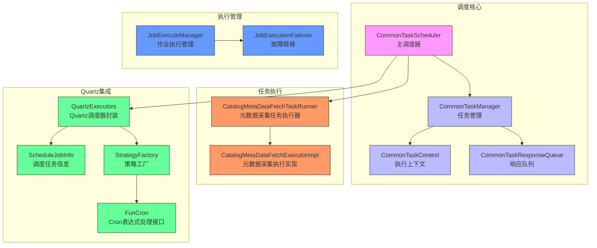
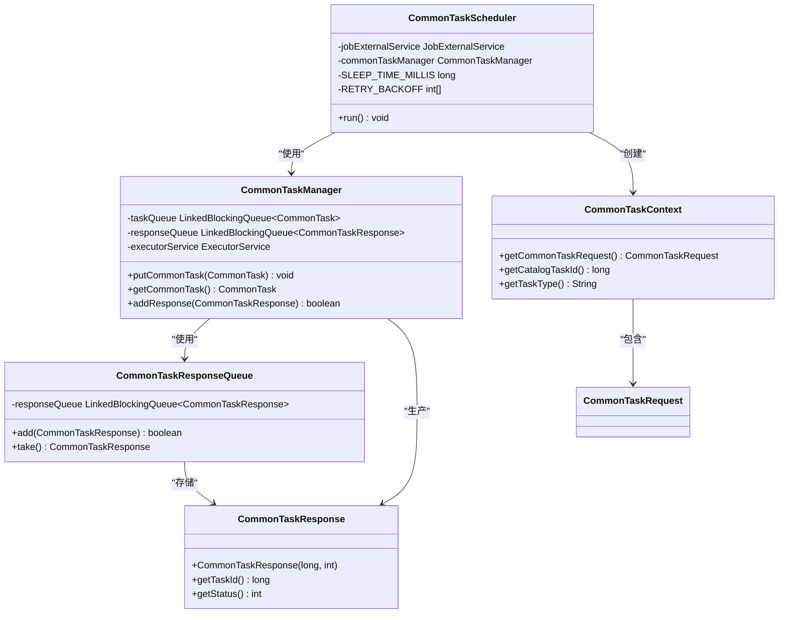
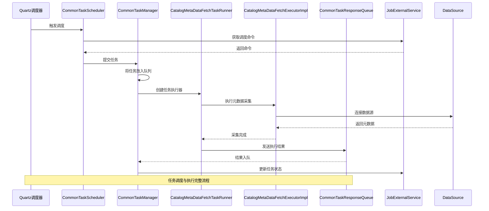
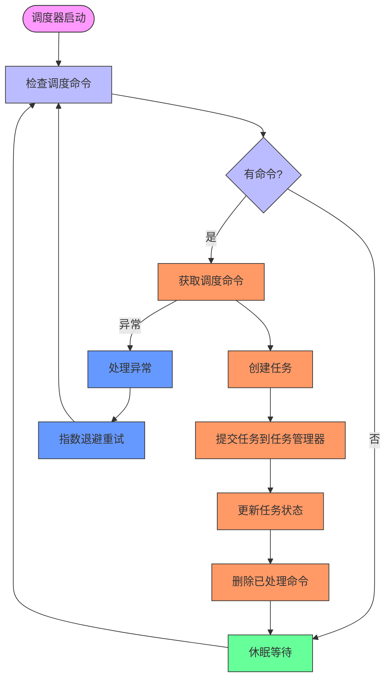
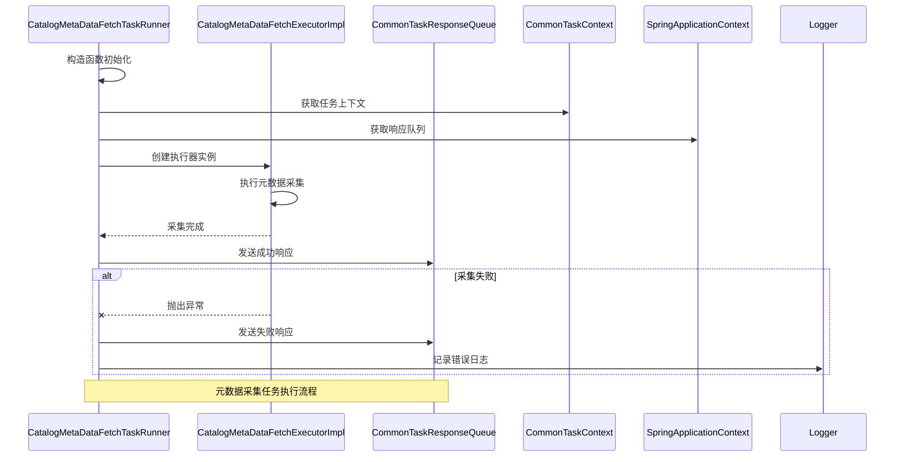
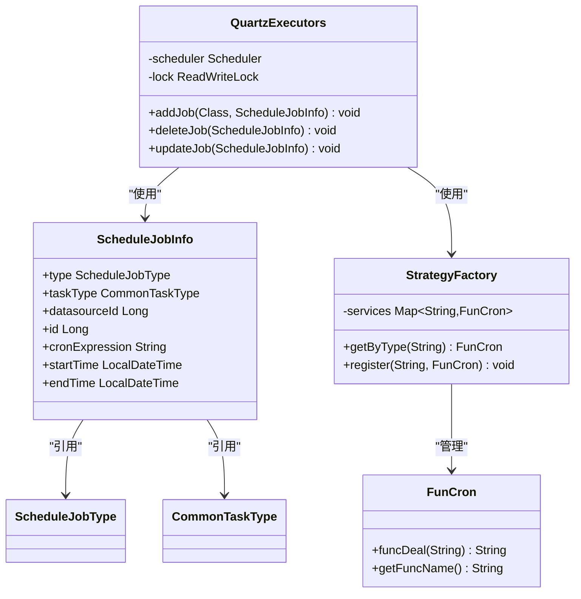
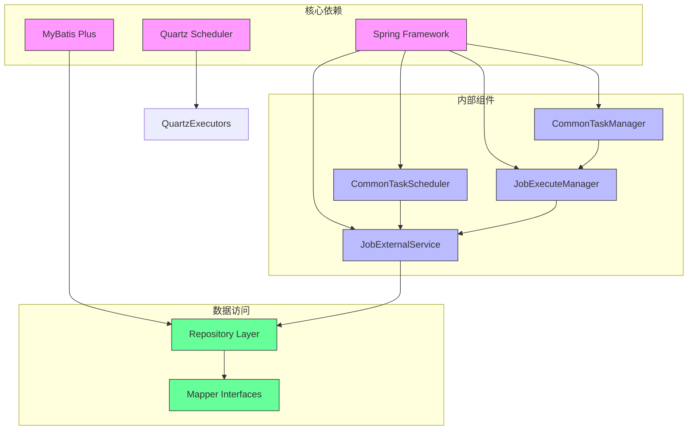
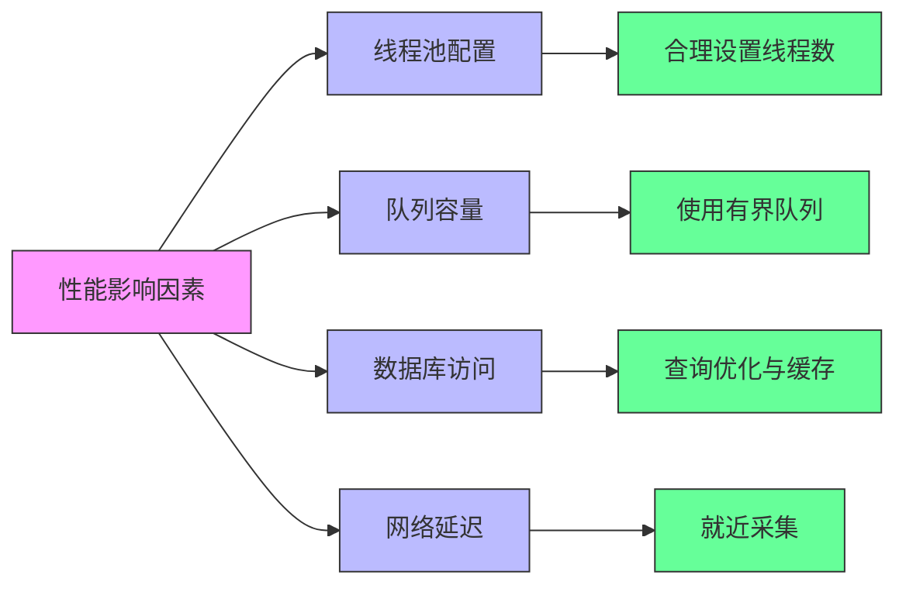
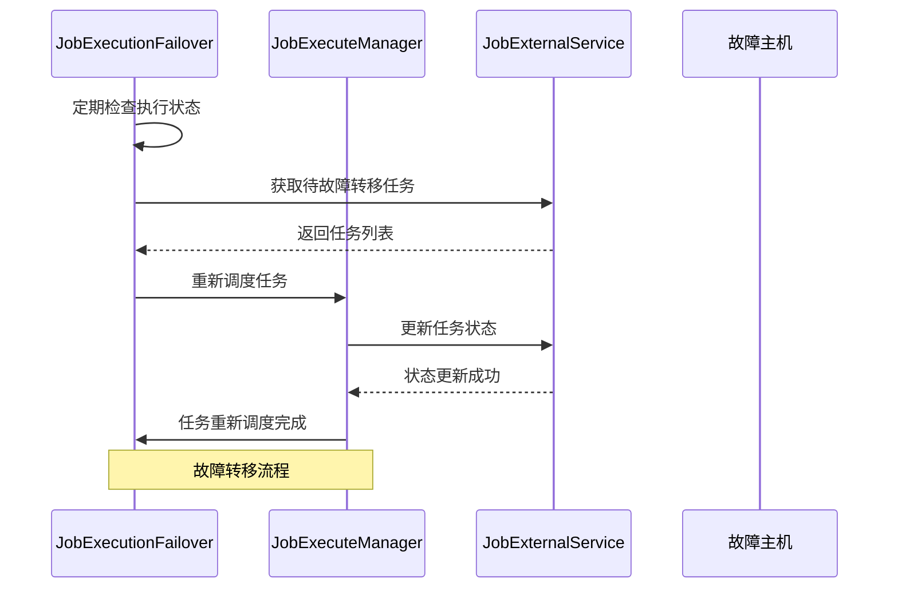
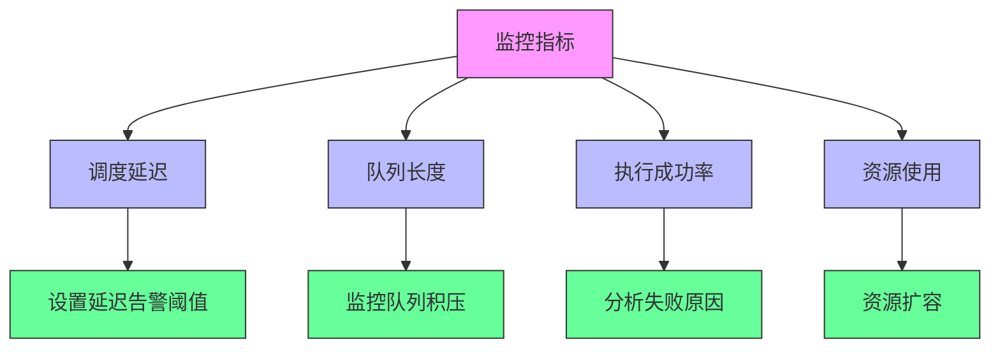

# 任务调度系统

<cite>
**本文档引用的文件**  
- [CommonTaskScheduler.java](file://datavines-server/src/main/java/io/datavines/server/scheduler/CommonTaskScheduler.java)
- [CommonTaskManager.java](file://datavines-server/src/main/java/io/datavines/server/scheduler/CommonTaskManager.java)
- [CommonTaskContext.java](file://datavines-server/src/main/java/io/datavines/server/scheduler/CommonTaskContext.java)
- [CommonTaskResponseQueue.java](file://datavines-server/src/main/java/io/datavines/server/scheduler/CommonTaskResponseQueue.java)
- [CatalogMetaDataFetchTaskRunner.java](file://datavines-server/src/main/java/io/datavines/server/scheduler/metadata/CatalogMetaDataFetchTaskRunner.java)
- [CatalogMetaDataFetchExecutorImpl.java](file://datavines-server/src/main/java/io/datavines/server/scheduler/metadata/task/CatalogMetaDataFetchExecutorImpl.java)
- [QuartzExecutors.java](file://datavines-server/src/main/java/io/datavines/server/dqc/coordinator/quartz/QuartzExecutors.java)
- [JobExecuteManager.java](file://datavines-server/src/main/java/io/datavines/server/dqc/coordinator/cache/JobExecuteManager.java)
- [JobExecutionFailover.java](file://datavines-server/src/main/java/io/datavines/server/dqc/coordinator/failover/JobExecutionFailover.java)
- [ScheduleJobInfo.java](file://datavines-server/src/main/java/io/datavines/server/dqc/coordinator/quartz/ScheduleJobInfo.java)
- [FunCron.java](file://datavines-server/src/main/java/io/datavines/server/dqc/coordinator/quartz/cron/FunCron.java)
- [StrategyFactory.java](file://datavines-server/src/main/java/io/datavines/server/dqc/coordinator/quartz/cron/StrategyFactory.java)
</cite>

## 目录
1. [简介](#简介)
2. [项目结构](#项目结构)
3. [核心组件](#核心组件)
4. [架构概述](#架构概述)
5. [详细组件分析](#详细组件分析)
6. [依赖分析](#依赖分析)
7. [性能考虑](#性能考虑)
8. [故障处理与高可用](#故障处理与高可用)
9. [监控与优化建议](#监控与优化建议)
10. [结论](#结论)

## 简介
本文档详细描述了Datavines-server模块的任务调度系统，重点分析了CommonTaskScheduler的核心设计，包括任务队列管理、任务执行上下文和故障转移机制。文档解释了元数据采集任务（CatalogMetaDataFetchTaskRunner）和数据质量报告任务的调度流程，说明了与Quartz调度框架的集成方式以及调度任务生命周期的管理。同时阐述了任务状态管理、执行结果收集和错误处理策略，提供了高可用部署和分布式调度的配置方案，并包含调度延迟监控和性能优化建议。

## 项目结构
Datavines-server模块的任务调度系统主要位于`scheduler`和`dqc/coordinator`包中，形成了一个分层的调度架构。系统通过Quartz实现定时调度，结合自定义的任务管理器和执行器，实现了对元数据采集和数据质量检查任务的高效调度。

**图示来源**  
- [CommonTaskScheduler.java](file://datavines-server/src/main/java/io/datavines/server/scheduler/CommonTaskScheduler.java)
- [CommonTaskManager.java](file://datavines-server/src/main/java/io/datavines/server/scheduler/CommonTaskManager.java)
- [CatalogMetaDataFetchTaskRunner.java](file://datavines-server/src/main/java/io/datavines/server/scheduler/metadata/CatalogMetaDataFetchTaskRunner.java)
- [QuartzExecutors.java](file://datavines-server/src/main/java/io/datavines/server/dqc/coordinator/quartz/QuartzExecutors.java)

**本节来源**  
- [datavines-server/src/main/java/io/datavines/server/scheduler](file://datavines-server/src/main/java/io/datavines/server/scheduler)
- [datavines-server/src/main/java/io/datavines/server/dqc/coordinator](file://datavines-server/src/main/java/io/datavines/server/dqc/coordinator)

## 核心组件
任务调度系统的核心组件包括CommonTaskScheduler、CommonTaskManager、CommonTaskContext和CommonTaskResponseQueue。这些组件协同工作，实现了任务的调度、执行和状态管理。

CommonTaskScheduler作为主调度器，负责从外部服务获取调度命令并提交任务。CommonTaskManager管理任务队列和执行器，负责任务的实际执行。CommonTaskContext封装了任务执行所需的上下文信息，而CommonTaskResponseQueue则用于收集任务执行结果。

**图示来源**  
- [CommonTaskScheduler.java](file://datavines-server/src/main/java/io/datavines/server/scheduler/CommonTaskScheduler.java)
- [CommonTaskManager.java](file://datavines-server/src/main/java/io/datavines/server/scheduler/CommonTaskManager.java)
- [CommonTaskContext.java](file://datavines-server/src/main/java/io/datavines/server/scheduler/CommonTaskContext.java)
- [CommonTaskResponseQueue.java](file://datavines-server/src/main/java/io/datavines/server/scheduler/CommonTaskResponseQueue.java)

**本节来源**  
- [CommonTaskScheduler.java](file://datavines-server/src/main/java/io/datavines/server/scheduler/CommonTaskScheduler.java#L1-L100)
- [CommonTaskManager.java](file://datavines-server/src/main/java/io/datavines/server/scheduler/CommonTaskManager.java#L1-L50)
- [CommonTaskContext.java](file://datavines-server/src/main/java/io/datavines/server/scheduler/CommonTaskContext.java#L1-L30)

## 架构概述
Datavines的任务调度系统采用分层架构设计，将调度逻辑与执行逻辑分离。系统通过Quartz框架实现定时触发，结合自定义的任务管理器实现任务的队列化执行和状态管理。

**图示来源**  
- [CommonTaskScheduler.java](file://datavines-server/src/main/java/io/datavines/server/scheduler/CommonTaskScheduler.java)
- [CatalogMetaDataFetchTaskRunner.java](file://datavines-server/src/main/java/io/datavines/server/scheduler/metadata/CatalogMetaDataFetchTaskRunner.java)
- [CatalogMetaDataFetchExecutorImpl.java](file://datavines-server/src/main/java/io/datavines/server/scheduler/metadata/task/CatalogMetaDataFetchExecutorImpl.java)

## 详细组件分析

### CommonTaskScheduler 分析
CommonTaskScheduler是任务调度系统的核心组件，负责协调整个调度流程。它通过轮询机制从JobExternalService获取调度命令，并将任务提交给CommonTaskManager进行执行。

**图示来源**  
- [CommonTaskScheduler.java](file://datavines-server/src/main/java/io/datavines/server/scheduler/CommonTaskScheduler.java#L60-L90)

### 元数据采集任务分析
元数据采集任务由CatalogMetaDataFetchTaskRunner执行，该任务实现了Runnable接口，可以在独立线程中运行。任务通过SpringApplicationContext获取响应队列，并在执行完成后将结果发送到队列中。

**图示来源**  
- [CatalogMetaDataFetchTaskRunner.java](file://datavines-server/src/main/java/io/datavines/server/scheduler/metadata/CatalogMetaDataFetchTaskRunner.java#L28-L51)
- [CatalogMetaDataFetchExecutorImpl.java](file://datavines-server/src/main/java/io/datavines/server/scheduler/metadata/task/CatalogMetaDataFetchExecutorImpl.java)

### Quartz 集成分析
QuartzExecutors组件封装了Quartz调度框架，提供了对调度任务的统一管理。它通过StrategyFactory注册不同的Cron表达式处理策略，实现了灵活的调度配置。

**图示来源**  
- [QuartzExecutors.java](file://datavines-server/src/main/java/io/datavines/server/dqc/coordinator/quartz/QuartzExecutors.java#L57-L129)
- [ScheduleJobInfo.java](file://datavines-server/src/main/java/io/datavines/server/dqc/coordinator/quartz/ScheduleJobInfo.java)
- [StrategyFactory.java](file://datavines-server/src/main/java/io/datavines/server/dqc/coordinator/quartz/cron/StrategyFactory.java)
- [FunCron.java](file://datavines-server/src/main/java/io/datavines/server/dqc/coordinator/quartz/cron/FunCron.java)

## 依赖分析
任务调度系统依赖于多个核心组件和外部框架，形成了复杂的依赖关系网络。

**图示来源**  
- [pom.xml](file://pom.xml#L502-L538)
- [CommonTaskScheduler.java](file://datavines-server/src/main/java/io/datavines/server/scheduler/CommonTaskScheduler.java)
- [JobExternalService.java](file://datavines-server/src/main/java/io/datavines/server/repository/service/impl/JobExternalService.java)

**本节来源**  
- [pom.xml](file://pom.xml#L502-L538)
- [CommonTaskScheduler.java](file://datavines-server/src/main/java/io/datavines/server/scheduler/CommonTaskScheduler.java)
- [JobExternalService.java](file://datavines-server/src/main/java/io/datavines/server/repository/service/impl/JobExternalService.java)

## 性能考虑
任务调度系统的性能主要受以下几个因素影响：

1. **线程池配置**：CommonTaskManager和JobExecuteManager使用固定大小的线程池，需要根据系统负载合理配置线程数。
2. **队列容量**：任务队列和响应队列使用无界队列，可能导致内存溢出，建议在生产环境中使用有界队列。
3. **数据库访问**：频繁的数据库操作可能成为性能瓶颈，建议对关键查询进行优化和缓存。
4. **网络延迟**：与数据源的网络通信可能影响元数据采集的性能，建议在靠近数据源的节点上执行采集任务。

## 故障处理与高可用
系统通过JobExecutionFailover组件实现故障转移机制，确保在节点故障时能够恢复任务执行。

**图示来源**  
- [JobExecutionFailover.java](file://datavines-server/src/main/java/io/datavines/server/dqc/coordinator/failover/JobExecutionFailover.java#L43-L82)
- [JobExecuteManager.java](file://datavines-server/src/main/java/io/datavines/server/dqc/coordinator/cache/JobExecuteManager.java#L80-L465)

**本节来源**  
- [JobExecutionFailover.java](file://datavines-server/src/main/java/io/datavines/server/dqc/coordinator/failover/JobExecutionFailover.java#L43-L82)
- [JobExecuteManager.java](file://datavines-server/src/main/java/io/datavines/server/dqc/coordinator/cache/JobExecuteManager.java#L80-L465)

## 监控与优化建议
为了确保任务调度系统的稳定运行，建议实施以下监控和优化措施：

1. **调度延迟监控**：监控任务从计划执行时间到实际执行时间的延迟，及时发现调度瓶颈。
2. **队列长度监控**：监控任务队列和响应队列的长度，防止队列积压导致内存问题。
3. **执行成功率监控**：统计任务执行的成功率，识别频繁失败的任务并进行优化。
4. **资源使用监控**：监控CPU、内存和网络使用情况，确保系统资源充足。

## 结论
Datavines-server的任务调度系统通过分层架构设计，实现了对元数据采集和数据质量检查任务的高效管理。系统基于Quartz框架实现了灵活的定时调度，通过自定义的任务管理器实现了任务的队列化执行和状态管理。故障转移机制确保了系统的高可用性，而详细的监控和优化建议则为系统的稳定运行提供了保障。该调度系统具有良好的扩展性和可靠性，能够满足大数据环境下复杂的数据质量管理需求。