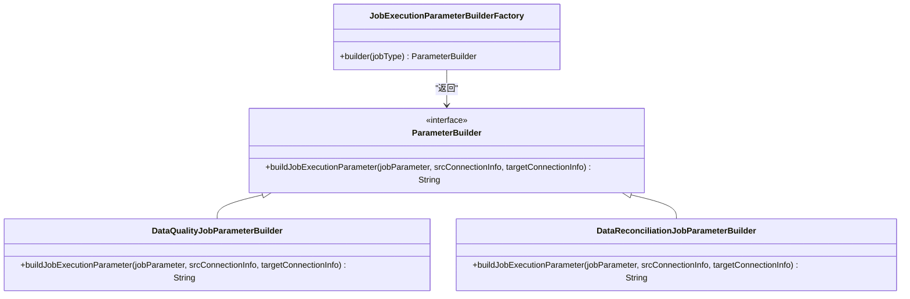
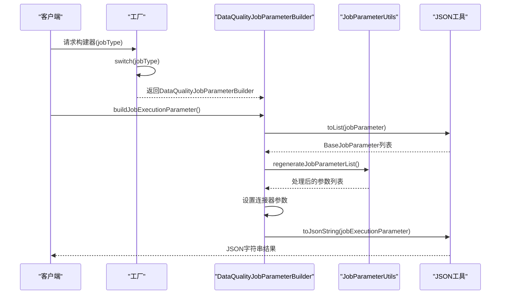
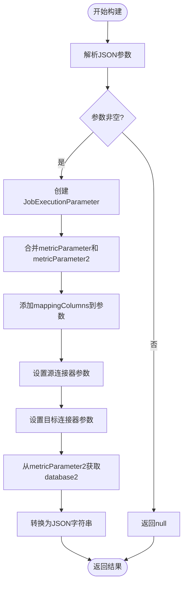
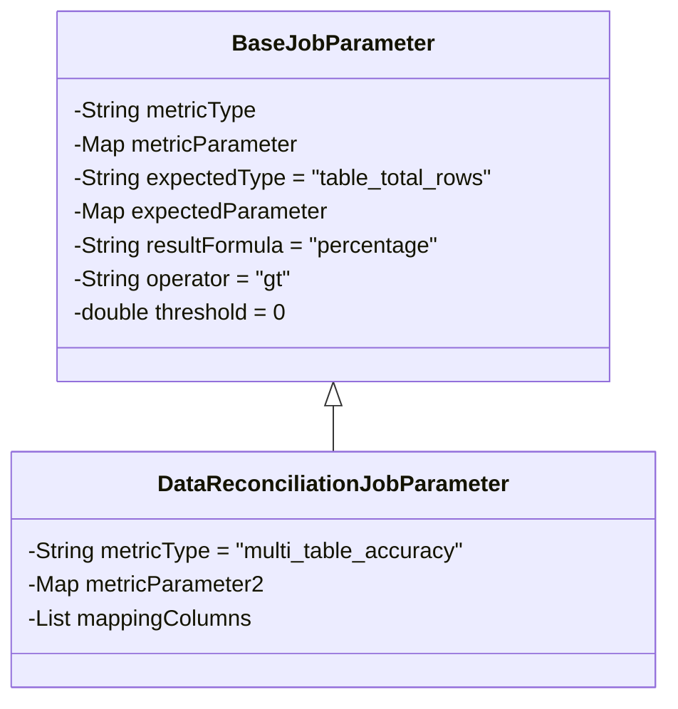
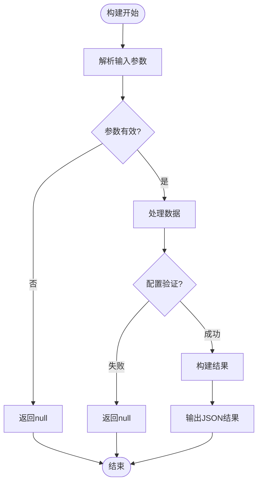
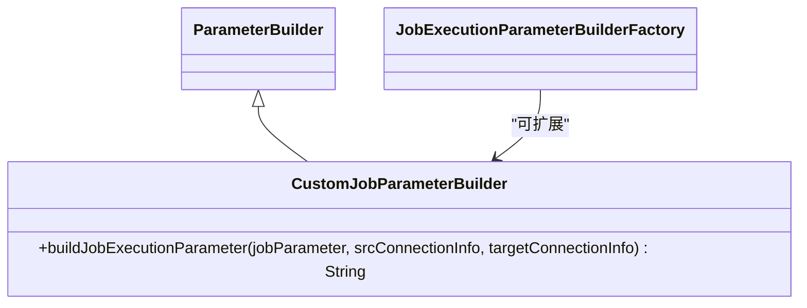

# 任务参数构建

<cite>
**本文档引用的文件**  
- [JobExecutionParameterBuilderFactory.java](file://datavines-server/src/main/java/io/datavines/server/dqc/coordinator/builder/JobExecutionParameterBuilderFactory.java)
- [ParameterBuilder.java](file://datavines-server/src/main/java/io/datavines/server/dqc/coordinator/builder/ParameterBuilder.java)
- [DataQualityJobParameterBuilder.java](file://datavines-server/src/main/java/io/datavines/server/dqc/coordinator/builder/DataQualityJobParameterBuilder.java)
- [DataReconciliationJobParameterBuilder.java](file://datavines-server/src/main/java/io/datavines/server/dqc/coordinator/builder/DataReconciliationJobParameterBuilder.java)
- [BaseJobParameter.java](file://datavines-common/src/main/java/io/datavines/common/entity/job/BaseJobParameter.java)
- [DataReconciliationJobParameter.java](file://datavines-common/src/main/java/io/datavines/common/entity/job/DataReconciliationJobParameter.java)
- [JobExecutionParameter.java](file://datavines-common/src/main/java/io/datavines/common/entity/JobExecutionParameter.java)
- [ConnectionInfo.java](file://datavines-common/src/main/java/io/datavines/common/entity/ConnectionInfo.java)
- [ConnectorParameter.java](file://datavines-common/src/main/java/io/datavines/common/entity/ConnectorParameter.java)
- [JobParameterUtils.java](file://datavines-server/src/main/java/io/datavines/server/utils/JobParameterUtils.java)
- [JobType.java](file://datavines-common/src/main/java/io/datavines/common/enums/JobType.java)
</cite>

## 目录
1. [简介](#简介)
2. [工厂模式设计与实现](#工厂模式设计与实现)
3. [核心参数构建器实现](#核心参数构建器实现)
4. [参数构建过程机制](#参数构建过程机制)
5. [自定义扩展与集成](#自定义扩展与集成)
6. [总结](#总结)

## 简介
本文档详细描述了DataVines平台中任务参数构建器的设计与实现。重点介绍`JobExecutionParameterBuilderFactory`工厂模式如何根据任务类型创建相应的参数构建器，以及`DataQualityJobParameterBuilder`和`DataReconciliationJobParameterBuilder`的具体构建逻辑。同时说明参数构建过程中的配置验证、默认值填充和异常处理机制，并提供自定义参数构建器的扩展方法和集成示例。

## 工厂模式设计与实现

任务参数构建器工厂采用经典的工厂模式设计，通过`JobExecutionParameterBuilderFactory`类根据不同的任务类型创建相应的参数构建器实例。该工厂模式实现了构建器的统一管理和动态选择，提高了系统的可扩展性和维护性。

**图示来源**  
- [JobExecutionParameterBuilderFactory.java](file://datavines-server/src/main/java/io/datavines/server/dqc/coordinator/builder/JobExecutionParameterBuilderFactory.java)
- [ParameterBuilder.java](file://datavines-server/src/main/java/io/datavines/server/dqc/coordinator/builder/ParameterBuilder.java)

**本节来源**  
- [JobExecutionParameterBuilderFactory.java](file://datavines-server/src/main/java/io/datavines/server/dqc/coordinator/builder/JobExecutionParameterBuilderFactory.java)
- [JobType.java](file://datavines-common/src/main/java/io/datavines/common/enums/JobType.java)

## 核心参数构建器实现

### 数据质量任务参数构建器
`DataQualityJobParameterBuilder`负责处理数据质量检查类型的任务参数构建。该构建器实现了`ParameterBuilder`接口，能够将原始的JSON格式任务参数转换为执行所需的`JobExecutionParameter`对象。

**图示来源**  
- [DataQualityJobParameterBuilder.java](file://datavines-server/src/main/java/io/datavines/server/dqc/coordinator/builder/DataQualityJobParameterBuilder.java)
- [JobParameterUtils.java](file://datavines-server/src/main/java/io/datavines/server/utils/JobParameterUtils.java)

### 数据比对任务参数构建器
`DataReconciliationJobParameterBuilder`专门处理数据比对检查类型的任务参数构建。与数据质量构建器不同，该构建器需要处理两个数据源的连接信息，并将两个数据源的配置参数合并到最终的执行参数中。

**图示来源**  
- [DataReconciliationJobParameterBuilder.java](file://datavines-server/src/main/java/io/datavines/server/dqc/coordinator/builder/DataReconciliationJobParameterBuilder.java)
- [DataReconciliationJobParameter.java](file://datavines-common/src/main/java/io/datavines/common/entity/job/DataReconciliationJobParameter.java)

**本节来源**  
- [DataQualityJobParameterBuilder.java](file://datavines-server/src/main/java/io/datavines/server/dqc/coordinator/builder/DataQualityJobParameterBuilder.java)
- [DataReconciliationJobParameterBuilder.java](file://datavines-server/src/main/java/io/datavines/server/dqc/coordinator/builder/DataReconciliationJobParameterBuilder.java)

## 参数构建过程机制

### 配置验证与默认值填充
在参数构建过程中，系统会进行多层次的配置验证和默认值填充。`BaseJobParameter`类定义了任务参数的基本结构，包括`metricType`、`metricParameter`、`expectedType`等字段，其中多个字段设置了默认值。

**图示来源**  
- [BaseJobParameter.java](file://datavines-common/src/main/java/io/datavines/common/entity/job/BaseJobParameter.java)
- [DataReconciliationJobParameter.java](file://datavines-common/src/main/java/io/datavines/common/entity/job/DataReconciliationJobParameter.java)

### 异常处理机制
参数构建过程中的异常处理主要通过返回null值和使用集合工具类的空值检查来实现。当输入参数为空或无效时，构建器会直接返回null，避免抛出异常影响系统稳定性。

**本节来源**  
- [DataQualityJobParameterBuilder.java](file://datavines-server/src/main/java/io/datavines/server/dqc/coordinator/builder/DataQualityJobParameterBuilder.java#L34-L55)
- [DataReconciliationJobParameterBuilder.java](file://datavines-server/src/main/java/io/datavines/server/dqc/coordinator/builder/DataReconciliationJobParameterBuilder.java#L32-L60)

## 自定义扩展与集成

### 扩展方法
要创建自定义的参数构建器，需要实现`ParameterBuilder`接口并重写`buildJobExecutionParameter`方法。新的构建器类需要处理特定任务类型的参数构建逻辑，并返回JSON格式的执行参数。

### 集成示例
自定义构建器的集成需要在`JobExecutionParameterBuilderFactory`的switch语句中添加新的case分支，将新的任务类型映射到自定义的构建器实例。

**本节来源**  
- [ParameterBuilder.java](file://datavines-server/src/main/java/io/datavines/server/dqc/coordinator/builder/ParameterBuilder.java)
- [JobExecutionParameterBuilderFactory.java](file://datavines-server/src/main/java/io/datavines/server/dqc/coordinator/builder/JobExecutionParameterBuilderFactory.java)

## 总结
任务参数构建器系统通过工厂模式实现了不同类型任务参数的灵活构建。`JobExecutionParameterBuilderFactory`作为核心工厂类，根据任务类型返回相应的构建器实例。`DataQualityJobParameterBuilder`和`DataReconciliationJobParameterBuilder`分别处理数据质量和数据比对任务的参数构建，通过配置验证、默认值填充和异常处理机制确保参数的正确性和完整性。系统设计具有良好的扩展性，支持通过实现`ParameterBuilder`接口来添加新的参数构建器。