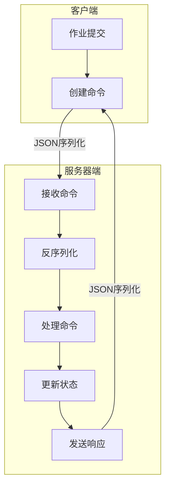
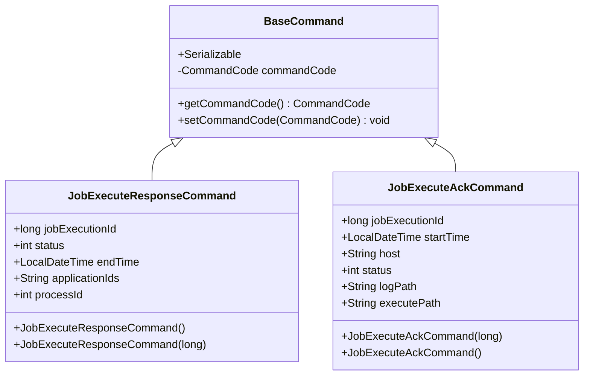
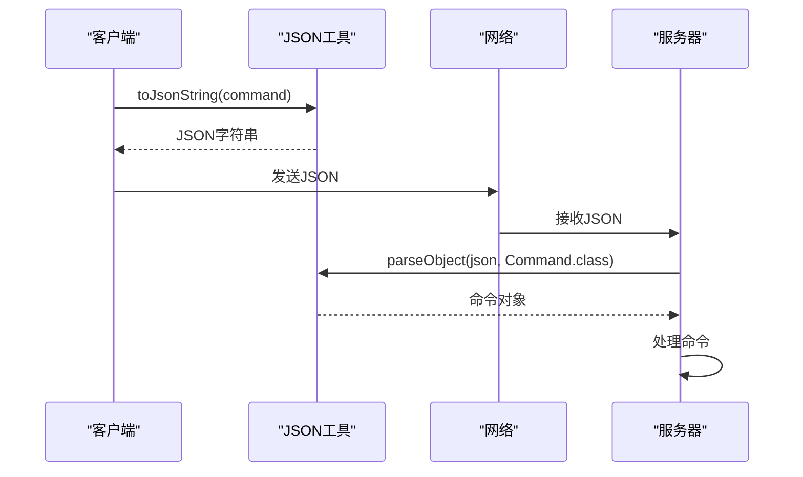
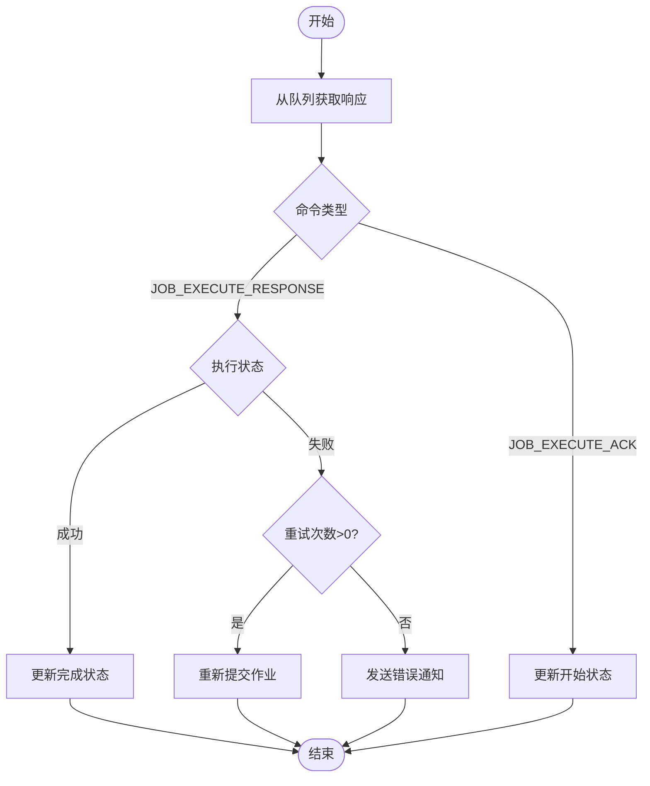
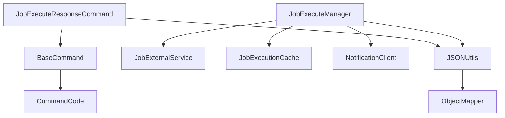

# 命令模式实现

<cite>
**本文档引用的文件**   
- [BaseCommand.java](file://datavines-server/src/main/java/io/datavines/server/dqc/command/BaseCommand.java)
- [JobExecuteResponseCommand.java](file://datavines-server/src/main/java/io/datavines/server/dqc/command/JobExecuteResponseCommand.java)
- [CommandCode.java](file://datavines-server/src/main/java/io/datavines/server/dqc/command/CommandCode.java)
- [JobExecuteManager.java](file://datavines-server/src/main/java/io/datavines/server/dqc/coordinator/cache/JobExecuteManager.java)
- [JobExecutionResponseContext.java](file://datavines-server/src/main/java/io/datavines/server/dqc/coordinator/cache/JobExecutionResponseContext.java)
- [JSONUtils.java](file://datavines-common/src/main/java/io/datavines/common/utils/JSONUtils.java)
- [BaseCommandProcess.java](file://datavines-engine/executor/core/executor/BaseCommandProcess.java)
</cite>

## 目录
1. [引言](#引言)
2. [核心组件](#核心组件)
3. [架构概述](#架构概述)
4. [详细组件分析](#详细组件分析)
5. [依赖分析](#依赖分析)
6. [性能考虑](#性能考虑)
7. [故障排除指南](#故障排除指南)
8. [结论](#结论)

## 引言
本文档详细描述了DataVines系统中命令模式的实现，重点分析了BaseCommand抽象类的设计、JobExecuteResponseCommand的具体实现、命令的序列化与传输过程，以及JobExecutionResponseProcessor如何处理接收到的命令并更新执行状态。同时阐述了命令模式在解耦服务组件、实现异步通信和保障消息可靠性方面的作用，并提供了命令扩展的最佳实践和性能优化建议。

## 核心组件
DataVines中的命令模式主要由以下几个核心组件构成：BaseCommand作为所有命令的基类，定义了命令的基本结构；JobExecuteResponseCommand作为具体命令实现，用于处理作业执行响应；CommandCode枚举定义了系统中所有可用的命令类型；JobExecuteManager负责管理命令的执行和响应处理；JSONUtils提供了命令的序列化和反序列化功能。

**本文档引用的文件**   
- [BaseCommand.java](file://datavines-server/src/main/java/io/datavines/server/dqc/command/BaseCommand.java)
- [JobExecuteResponseCommand.java](file://datavines-server/src/main/java/io/datavines/server/dqc/command/JobExecuteResponseCommand.java)
- [CommandCode.java](file://datavines-server/src/main/java/io/datavines/server/dqc/command/CommandCode.java)
- [JobExecuteManager.java](file://datavines-server/src/main/java/io/datavines/server/dqc/coordinator/cache/JobExecuteManager.java)
- [JSONUtils.java](file://datavines-common/src/main/java/io/datavines/common/utils/JSONUtils.java)

## 架构概述
DataVines的命令模式采用典型的命令模式设计，通过将请求封装为对象，实现了请求发送者与接收者之间的解耦。系统通过CommandCode枚举定义了多种命令类型，包括作业执行请求、作业执行响应、作业终止请求等。命令对象通过JSON序列化后在网络中传输，由接收方反序列化并处理。

**图表来源**
- [CommandCode.java](file://datavines-server/src/main/java/io/datavines/server/dqc/command/CommandCode.java)
- [JSONUtils.java](file://datavines-common/src/main/java/io/datavines/common/utils/JSONUtils.java)

## 详细组件分析

### BaseCommand抽象类设计
BaseCommand类是所有命令的基类，实现了Serializable接口以支持序列化。它包含一个protected的CommandCode字段，用于标识命令类型。通过继承BaseCommand，具体的命令类可以共享基本的命令属性和行为，同时可以根据需要添加特定的属性和方法。

**图表来源**
- [BaseCommand.java](file://datavines-server/src/main/java/io/datavines/server/dqc/command/BaseCommand.java)
- [JobExecuteResponseCommand.java](file://datavines-server/src/main/java/io/datavines/server/dqc/command/JobExecuteResponseCommand.java)
- [JobExecuteAckCommand.java](file://datavines-server/src/main/java/io/datavines/server/dqc/command/JobExecuteAckCommand.java)

**本文档引用的文件**   
- [BaseCommand.java](file://datavines-server/src/main/java/io/datavines/server/dqc/command/BaseCommand.java)
- [JobExecuteResponseCommand.java](file://datavines-server/src/main/java/io/datavines/server/dqc/command/JobExecuteResponseCommand.java)
- [JobExecuteAckCommand.java](file://datavines-server/src/main/java/io/datavines/server/dqc/command/JobExecuteAckCommand.java)

### JobExecuteResponseCommand具体实现
JobExecuteResponseCommand类继承自BaseCommand，用于表示作业执行的响应。它包含了作业执行ID、状态、结束时间、应用ID和进程ID等属性。构造函数中设置了命令码为JOB_EXECUTE_RESPONSE，确保了命令类型的正确性。

**本文档引用的文件**   
- [JobExecuteResponseCommand.java](file://datavines-server/src/main/java/io/datavines/server/dqc/command/JobExecuteResponseCommand.java)

### 命令序列化、传输和反序列化过程
命令的序列化和反序列化主要通过JSONUtils类实现。当需要发送命令时，系统调用JSONUtils.toJsonString()方法将命令对象转换为JSON字符串；接收方则使用JSONUtils.parseObject()方法将JSON字符串反序列化为相应的命令对象。这个过程确保了命令在不同系统组件之间的可靠传输。

**图表来源**
- [JSONUtils.java](file://datavines-common/src/main/java/io/datavines/common/utils/JSONUtils.java)

**本文档引用的文件**   
- [JSONUtils.java](file://datavines-common/src/main/java/io/datavines/common/utils/JSONUtils.java)

### JobExecutionResponseProcessor处理机制
JobExecutionResponseProcessor通过JobExecuteManager中的JobExecutionResponseOperator内部类实现。它在一个独立的线程中运行，持续从responseQueue中获取JobExecutionResponseContext对象，并根据命令码进行相应的处理。对于JOB_EXECUTE_RESPONSE类型的命令，它会更新作业执行状态，并根据执行结果决定是否重试或发送通知。

**图表来源**
- [JobExecuteManager.java](file://datavines-server/src/main/java/io/datavines/server/dqc/coordinator/cache/JobExecuteManager.java)
- [JobExecutionResponseContext.java](file://datavines-server/src/main/java/io/datavines/server/dqc/coordinator/cache/JobExecutionResponseContext.java)

**本文档引用的文件**   
- [JobExecuteManager.java](file://datavines-server/src/main/java/io/datavines/server/dqc/coordinator/cache/JobExecuteManager.java)
- [JobExecutionResponseContext.java](file://datavines-server/src/main/java/io/datavines/server/dqc/coordinator/cache/JobExecutionResponseContext.java)

## 依赖分析
命令模式的实现依赖于多个核心组件和工具类。BaseCommand依赖于CommandCode枚举来定义命令类型；JobExecuteResponseCommand依赖于BaseCommand作为其基类；整个命令处理流程依赖于JSONUtils进行序列化和反序列化；JobExecuteManager依赖于多个服务类来完成作业状态的更新和通知发送。

**图表来源**
- [BaseCommand.java](file://datavines-server/src/main/java/io/datavines/server/dqc/command/BaseCommand.java)
- [CommandCode.java](file://datavines-server/src/main/java/io/datavines/server/dqc/command/CommandCode.java)
- [JobExecuteManager.java](file://datavines-server/src/main/java/io/datavines/server/dqc/coordinator/cache/JobExecuteManager.java)
- [JSONUtils.java](file://datavines-common/src/main/java/io/datavines/common/utils/JSONUtils.java)

## 性能考虑
在命令模式的实现中，性能优化主要体现在以下几个方面：使用线程池处理命令执行和响应，避免了频繁创建和销毁线程的开销；通过缓冲区批量处理日志输出，减少了I/O操作的频率；使用ConcurrentHashMap等并发数据结构，提高了多线程环境下的访问效率；合理设置命令超时时间，避免了长时间等待导致的资源浪费。

## 故障排除指南
当遇到命令处理相关的问题时，可以按照以下步骤进行排查：首先检查命令序列化和反序列化是否正常，确认JSON格式是否正确；其次查看JobExecuteManager的日志，确认命令是否被正确接收和处理；然后检查网络连接是否稳定，确保命令能够正常传输；最后验证相关服务是否正常运行，如JobExternalService、NotificationClient等。

**本文档引用的文件**   
- [JobExecuteManager.java](file://datavines-server/src/main/java/io/datavines/server/dqc/coordinator/cache/JobExecuteManager.java)
- [JobExternalService.java](file://datavines-server/repository/service/impl/JobExternalService.java)
- [NotificationClient.java](file://datavines-notification/core/client/NotificationClient.java)

## 结论
DataVines中的命令模式实现有效地解耦了服务组件，实现了异步通信，并通过可靠的序列化机制保障了消息的完整性。该设计不仅提高了系统的可维护性和可扩展性，还为未来的功能扩展提供了良好的基础。通过遵循本文档中的最佳实践和性能优化建议，可以进一步提升系统的稳定性和效率。