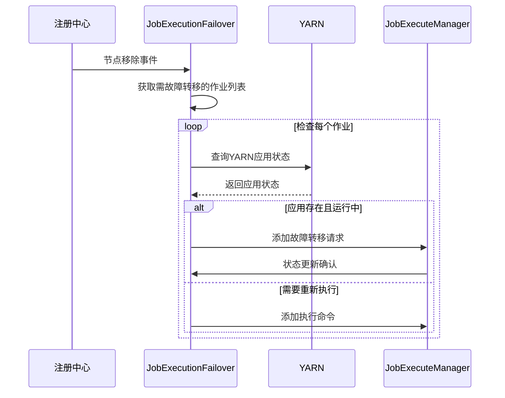
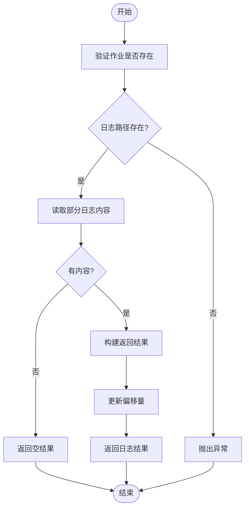
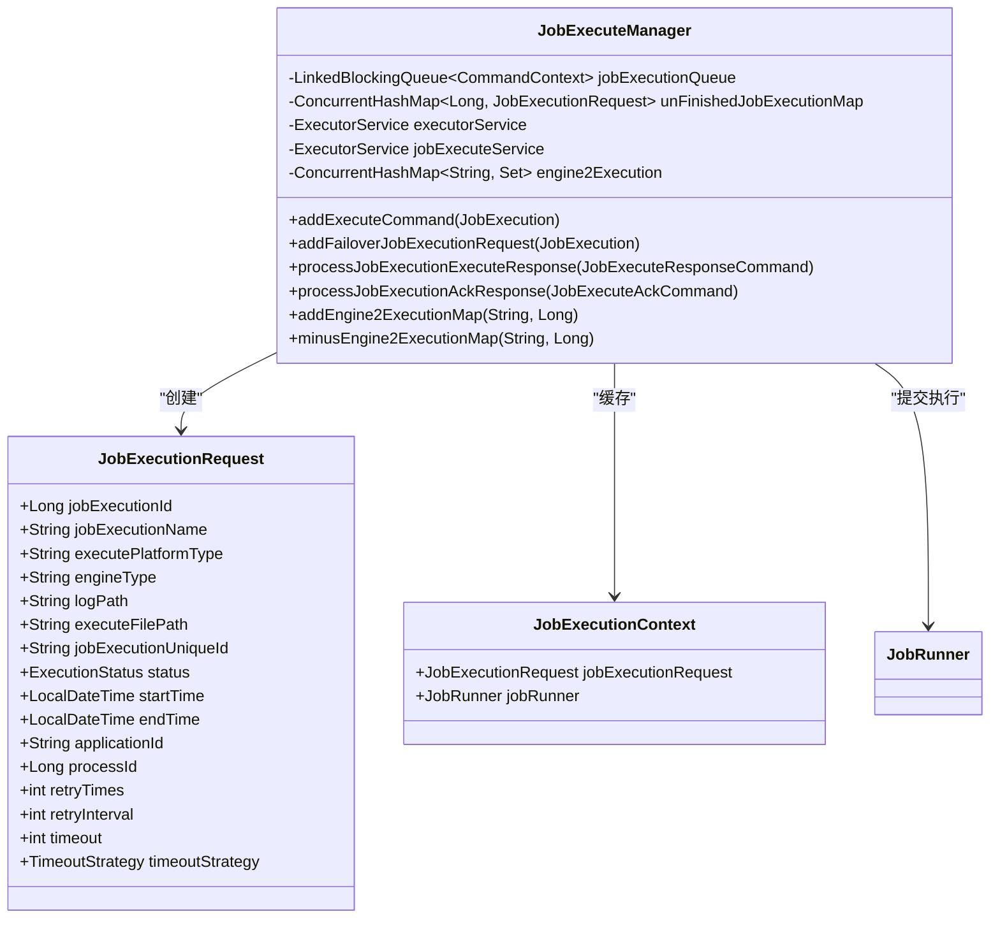
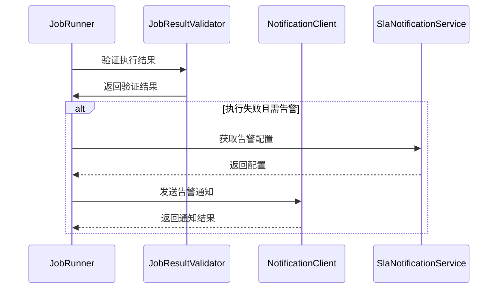

# 容错与日志

<cite>
**本文档引用的文件**   
- [JobExecutionFailover.java](file://datavines-server/src/main/java/io/datavines/server/dqc/coordinator/failover/JobExecutionFailover.java)
- [JobExecuteManager.java](file://datavines-server/src/main/java/io/datavines/server/dqc/coordinator/cache/JobExecuteManager.java)
- [LogService.java](file://datavines-server/src/main/java/io/datavines/server/dqc/coordinator/log/LogService.java)
- [Register.java](file://datavines-server/src/main/java/io/datavines/server/registry/Register.java)
- [server-logback.xml](file://datavines-server/src/main/resources/server-logback.xml)
- [application.yaml](file://datavines-server/src/main/resources/application.yaml)
- [SlaNotificationServiceImpl.java](file://datavines-server/src/main/java/io/datavines/server/repository/service/impl/SlaNotificationServiceImpl.java)
</cite>

## 目录
1. [引言](#引言)
2. [JobExecutionFailover故障转移机制](#jobexecutionfailover故障转移机制)
3. [LogService日志服务](#logservice日志服务)
4. [JobExecuteManager执行上下文管理](#jobexecutemanager执行上下文管理)
5. [容错配置与监控告警](#容错配置与监控告警)
6. [故障排查指南](#故障排查指南)
7. [结论](#结论)

## 引言
本文档详细描述了DataVines平台的容错与日志服务机制。重点分析了JobExecutionFailover的故障转移机制、LogService的日志收集与查询功能，以及JobExecuteManager在执行上下文管理中的作用。同时提供了容错配置参数、日志级别设置和监控告警集成方案，并包含故障排查指南和常见问题解决方案。

## JobExecutionFailover故障转移机制

JobExecutionFailover是DataVines平台的核心容错组件，负责处理作业执行过程中的故障转移。该机制通过注册中心事件监听、YARN应用状态检查和重试策略实现高可用性。

故障转移机制主要包含以下三个核心流程：

1. **失败检测**：通过注册中心（Registry）监听节点移除事件，当检测到执行节点失效时，触发故障转移流程。
2. **状态恢复**：对于已提交到YARN但未完成的作业，通过YARN API检查应用状态，并将最终状态同步回系统。
3. **重试策略**：对于无法恢复的作业，根据配置的重试次数进行重新调度执行。

**图示来源**
- [JobExecutionFailover.java](file://datavines-server/src/main/java/io/datavines/server/dqc/coordinator/failover/JobExecutionFailover.java#L63-L117)
- [Register.java](file://datavines-server/src/main/java/io/datavines/server/registry/Register.java#L97-L103)

**本节来源**
- [JobExecutionFailover.java](file://datavines-server/src/main/java/io/datavines/server/dqc/coordinator/failover/JobExecutionFailover.java#L43-L151)
- [Register.java](file://datavines-server/src/main/java/io/datavines/server/registry/Register.java#L97-L103)

## LogService日志服务

LogService负责执行日志的收集、存储和查询功能。系统采用SiftingAppender实现日志文件的动态分离，每个作业执行都有独立的日志文件，便于管理和查询。

日志服务的主要功能包括：

1. **日志收集**：通过Logback框架收集作业执行过程中的所有日志输出
2. **日志存储**：按作业执行唯一ID组织日志文件，存储在指定目录中
3. **日志查询**：提供分页查询和全文查询接口，支持大日志文件的高效读取

**图示来源**
- [LogService.java](file://datavines-server/src/main/java/io/datavines/server/dqc/coordinator/log/LogService.java#L55-L78)
- [server-logback.xml](file://datavines-server/src/main/resources/server-logback.xml#L35-L58)

**本节来源**
- [LogService.java](file://datavines-server/src/main/java/io/datavines/server/dqc/coordinator/log/LogService.java#L48-L168)
- [server-logback.xml](file://datavines-server/src/main/resources/server-logback.xml#L21-L85)

## JobExecuteManager执行上下文管理

JobExecuteManager是作业执行的核心管理组件，负责执行上下文的创建、维护和清理。它通过线程池管理和命令队列机制，确保作业执行的有序性和可靠性。

执行上下文管理的主要职责包括：

1. **执行请求处理**：接收作业执行请求并放入待处理队列
2. **上下文缓存**：维护未完成作业的执行上下文，支持故障恢复
3. **资源管理**：跟踪各引擎的执行任务数量，实现资源分配
4. **响应处理**：处理作业执行的ACK和响应，更新作业状态

**图示来源**
- [JobExecuteManager.java](file://datavines-server/src/main/java/io/datavines/server/dqc/coordinator/cache/JobExecuteManager.java#L73-L616)
- [JobExecutionRequest.java](file://datavines-common/src/main/java/io/datavines/common/entity/JobExecutionRequest.java)

**本节来源**
- [JobExecuteManager.java](file://datavines-server/src/main/java/io/datavines/server/dqc/coordinator/cache/JobExecuteManager.java#L73-L616)

## 容错配置与监控告警

### 容错配置参数
系统提供了一系列容错相关的配置参数，主要包含在作业执行配置中：

- **重试次数**（retryTimes）：作业失败后的最大重试次数
- **重试间隔**（retryInterval）：每次重试之间的等待时间（秒）
- **超时时间**（timeout）：作业执行的最大允许时间（秒）
- **超时策略**（timeoutStrategy）：超时后的处理策略（RETRY或WARN）

这些参数可以在作业配置中进行设置，系统会根据配置执行相应的容错策略。

### 日志级别设置
日志级别通过Logback配置文件进行管理，主要配置如下：

- **根日志级别**：INFO级别，包含所有重要操作日志
- **服务器日志**：通过ServerLogFilter过滤，仅记录服务器相关日志
- **作业日志**：通过JobExecutionLogFilter过滤，按作业执行唯一ID分离日志文件

### 监控告警集成方案
系统通过SlaNotificationService实现监控告警功能，集成方案如下：

1. **告警配置**：通过SLA配置定义告警规则和通知方式
2. **通知渠道**：支持钉钉、邮件、飞书等多种通知渠道
3. **告警触发**：作业执行失败或超时时自动触发告警
4. **告警内容**：包含作业名称、数据源信息和失败原因

**本节来源**
- [JobExecuteManager.java](file://datavines-server/src/main/java/io/datavines/server/dqc/coordinator/cache/JobExecuteManager.java#L355-L381)
- [SlaNotificationServiceImpl.java](file://datavines-server/src/main/java/io/datavines/server/repository/service/impl/SlaNotificationServiceImpl.java#L77-L102)
- [JobRunner.java](file://datavines-runner/src/main/java/io/datavines/runner/JobRunner.java#L125-L141)

## 故障排查指南

### 常见问题及解决方案

#### 问题1：作业执行日志无法查询
**可能原因**：
- 作业执行记录不存在
- 日志路径未正确设置
- 日志文件权限问题

**解决方案**：
1. 检查作业执行ID是否存在
2. 验证JobExecution记录中的logPath字段
3. 检查日志目录的读写权限

#### 问题2：故障转移未触发
**可能原因**：
- 注册中心未正确获取故障节点信息
- 作业状态未正确更新
- 故障转移锁获取失败

**解决方案**：
1. 检查注册中心的节点列表
2. 验证JobExecutionFailover的事件监听是否正常
3. 检查FAILOVER_KEY锁的状态

#### 问题3：重试机制未生效
**可能原因**：
- 重试次数已耗尽
- 重试间隔配置过长
- 作业执行请求构建失败

**解决方案**：
1. 检查作业的retryTimes配置
2. 验证JobExecution表中的retry_times字段
3. 检查JobExecuteManager的日志是否有构建错误

### 监控指标
建议监控以下关键指标：

- **待处理作业队列长度**：反映系统处理能力
- **各引擎执行任务数**：监控资源使用情况
- **故障转移触发次数**：评估系统稳定性
- **日志文件大小**：预防磁盘空间不足

**本节来源**
- [JobExecuteManager.java](file://datavines-server/src/main/java/io/datavines/server/dqc/coordinator/cache/JobExecuteManager.java#L319-L335)
- [LogService.java](file://datavines-server/src/main/java/io/datavines/server/dqc/coordinator/log/LogService.java#L86-L96)
- [Register.java](file://datavines-server/src/main/java/io/datavines/server/registry/Register.java#L138-L141)

## 结论
DataVines平台的容错与日志服务提供了完整的作业执行保障机制。通过JobExecutionFailover实现的故障转移机制确保了系统的高可用性，LogService提供了高效的日志管理功能，而JobExecuteManager则有效管理了执行上下文。结合灵活的容错配置和监控告警集成，系统能够稳定可靠地处理数据质量检查任务。建议在生产环境中合理配置重试策略和超时时间，并建立完善的监控体系，以确保系统的稳定运行。