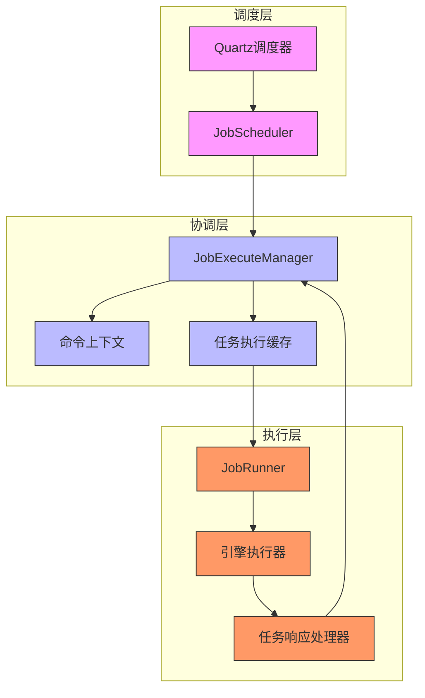
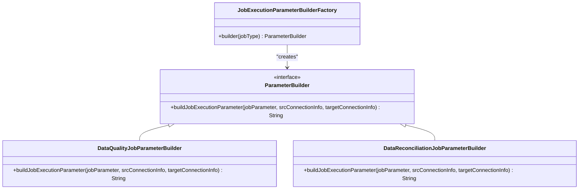
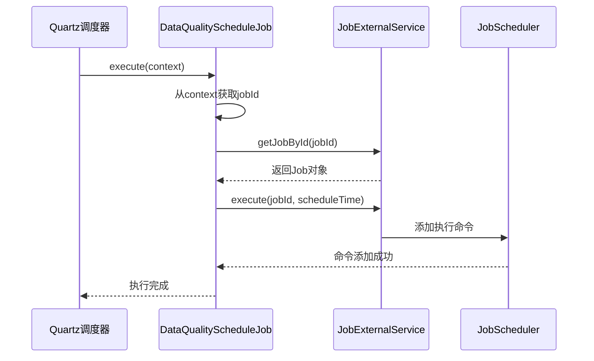
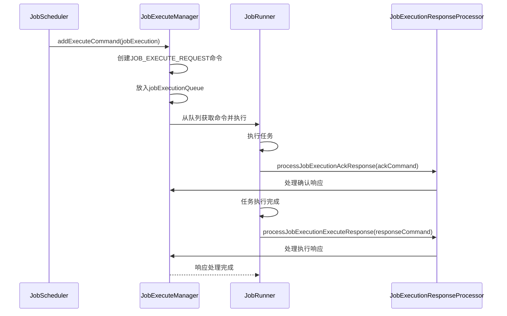
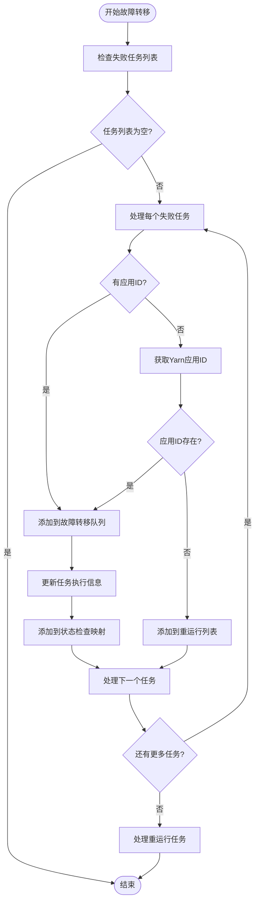
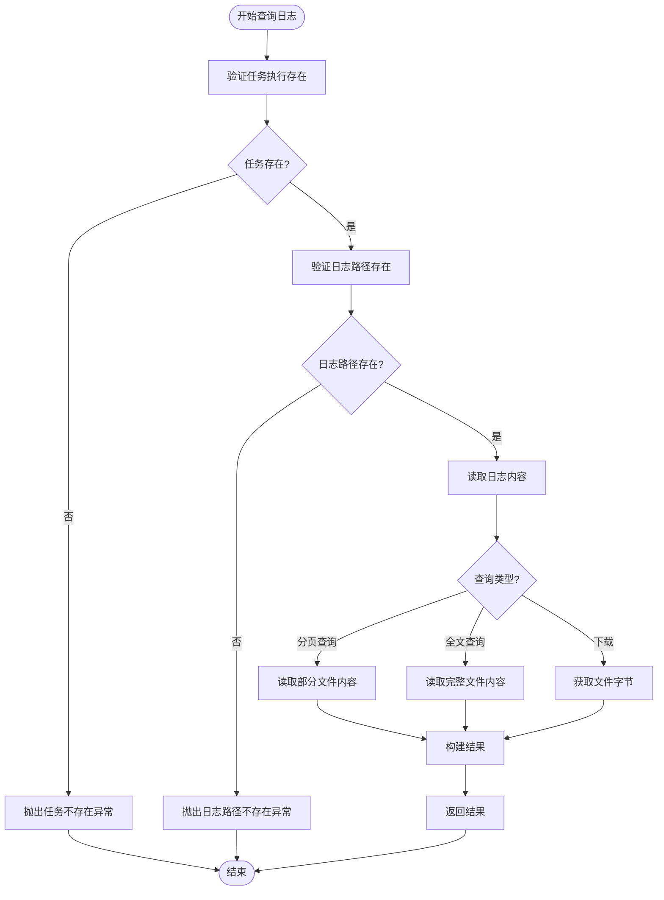
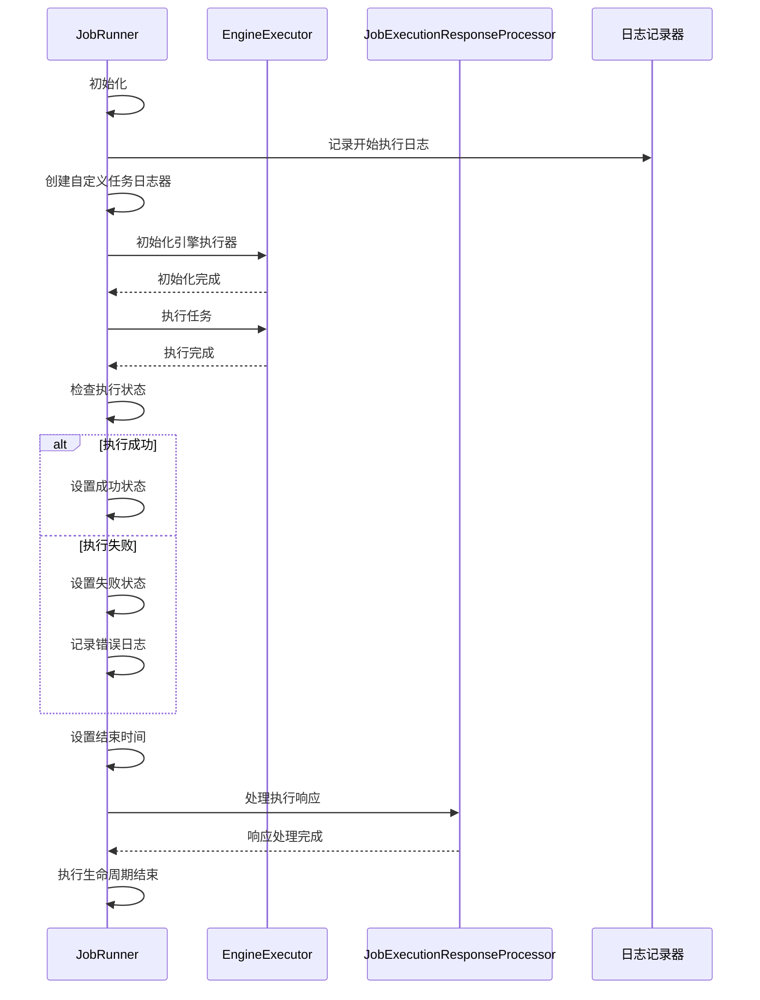

# 数据质量协调

<cite>
**本文档引用的文件**  
- [DataVinesServer.java](file://datavines-server/src/main/java/io/datavines/server/DataVinesServer.java)
- [ParameterBuilder.java](file://datavines-server/src/main/java/io/datavines/server/dqc/coordinator/builder/ParameterBuilder.java)
- [JobExecutionParameterBuilderFactory.java](file://datavines-server/src/main/java/io/datavines/server/dqc/coordinator/builder/JobExecutionParameterBuilderFactory.java)
- [DataQualityJobParameterBuilder.java](file://datavines-server/src/main/java/io/datavines/server/dqc/coordinator/builder/DataQualityJobParameterBuilder.java)
- [DataReconciliationJobParameterBuilder.java](file://datavines-server/src/main/java/io/datavines/server/dqc/coordinator/builder/DataReconciliationJobParameterBuilder.java)
- [DataQualityScheduleJob.java](file://datavines-server/src/main/java/io/datavines/server/dqc/coordinator/quartz/DataQualityScheduleJob.java)
- [QuartzExecutors.java](file://datavines-server/src/main/java/io/datavines/server/dqc/coordinator/quartz/QuartzExecutors.java)
- [BaseCommand.java](file://datavines-server/src/main/java/io/datavines/server/dqc/command/BaseCommand.java)
- [JobExecuteResponseCommand.java](file://datavines-server/src/main/java/io/datavines/server/dqc/command/JobExecuteResponseCommand.java)
- [JobExecuteAckCommand.java](file://datavines-server/src/main/java/io/datavines/server/dqc/command/JobExecuteAckCommand.java)
- [JobExecutionFailover.java](file://datavines-server/src/main/java/io/datavines/server/dqc/coordinator/failover/JobExecutionFailover.java)
- [LogService.java](file://datavines-server/src/main/java/io/datavines/server/dqc/coordinator/log/LogService.java)
- [JobRunner.java](file://datavines-server/src/main/java/io/datavines/server/dqc/executor/runner/JobRunner.java)
- [JobScheduler.java](file://datavines-server/src/main/java/io/datavines/server/dqc/coordinator/runner/JobScheduler.java)
- [JobExecuteManager.java](file://datavines-server/src/main/java/io/datavines/server/dqc/coordinator/cache/JobExecuteManager.java)
</cite>

## 目录
1. [引言](#引言)
2. [DQC子系统架构概述](#dqc子系统架构概述)
3. [任务参数构建器的工厂模式实现](#任务参数构建器的工厂模式实现)
4. [基于Quartz的调度机制](#基于quartz的调度机制)
5. [命令模式在任务执行协调中的应用](#命令模式在任务执行协调中的应用)
6. [任务执行失败的容错机制](#任务执行失败的容错机制)
7. [日志服务](#日志服务)
8. [JobRunner任务执行生命周期协调](#jobrunner任务执行生命周期协调)
9. [调度性能调优与高并发稳定性建议](#调度性能调优与高并发稳定性建议)
10. [总结](#总结)

## 引言

数据质量协调是Datavines系统中的核心功能模块，负责数据质量检查（DQC）任务的创建、调度、执行和监控。本文档详细阐述了datavines-server模块中DQC子系统的架构设计和工作流程，重点分析了任务参数构建器的工厂模式实现、基于Quartz的调度机制、命令模式在任务协调中的应用、容错机制、日志服务以及JobRunner如何协调任务的执行生命周期。同时，提供了调度性能调优和高并发场景下的稳定性保障建议。

## DQC子系统架构概述

DQC子系统采用分布式协调架构，主要由调度器（Scheduler）、执行器（Executor）和协调器（Coordinator）三部分组成。系统通过Quartz框架实现定时任务的调度，利用命令模式进行任务的生成、发送和响应处理，并通过JobRunner协调任务的执行生命周期。整个系统设计注重高可用性和容错能力，确保数据质量检查任务的稳定运行。

**图表来源**
- [DataVinesServer.java](file://datavines-server/src/main/java/io/datavines/server/DataVinesServer.java#L74-L108)
- [JobScheduler.java](file://datavines-server/src/main/java/io/datavines/server/dqc/coordinator/runner/JobScheduler.java#L39-L155)
- [JobExecuteManager.java](file://datavines-server/src/main/java/io/datavines/server/dqc/coordinator/cache/JobExecuteManager.java#L73-L617)
- [JobRunner.java](file://datavines-server/src/main/java/io/datavines/server/dqc/executor/runner/JobRunner.java#L33-L125)

**本节来源**
- [DataVinesServer.java](file://datavines-server/src/main/java/io/datavines/server/DataVinesServer.java#L74-L108)

## 任务参数构建器的工厂模式实现

DQC子系统通过工厂模式实现任务参数的构建，确保不同类型的任务能够生成相应的执行参数。该设计模式的核心是`ParameterBuilder`接口和`JobExecutionParameterBuilderFactory`工厂类。

`ParameterBuilder`接口定义了构建任务执行参数的契约，其核心方法`buildJobExecutionParameter`接收任务参数和连接信息，返回构建好的执行参数字符串。系统为不同类型的任务实现了具体的构建器，如`DataQualityJobParameterBuilder`用于数据质量检查任务，`DataReconciliationJobParameterBuilder`用于数据对账任务。

`JobExecutionParameterBuilderFactory`作为工厂类，根据任务类型（JobType）动态创建相应的参数构建器实例。这种设计实现了构建逻辑与使用逻辑的分离，提高了代码的可扩展性和可维护性。当需要支持新的任务类型时，只需实现新的`ParameterBuilder`并修改工厂类的创建逻辑，而无需修改客户端代码。

**图表来源**
- [ParameterBuilder.java](file://datavines-server/src/main/java/io/datavines/server/dqc/coordinator/builder/ParameterBuilder.java#L23-L26)
- [JobExecutionParameterBuilderFactory.java](file://datavines-server/src/main/java/io/datavines/server/dqc/coordinator/builder/JobExecutionParameterBuilderFactory.java#L21-L35)
- [DataQualityJobParameterBuilder.java](file://datavines-server/src/main/java/io/datavines/server/dqc/coordinator/builder/DataQualityJobParameterBuilder.java)
- [DataReconciliationJobParameterBuilder.java](file://datavines-server/src/main/java/io/datavines/server/dqc/coordinator/builder/DataReconciliationJobParameterBuilder.java)

**本节来源**
- [ParameterBuilder.java](file://datavines-server/src/main/java/io/datavines/server/dqc/coordinator/builder/ParameterBuilder.java#L23-L26)
- [JobExecutionParameterBuilderFactory.java](file://datavines-server/src/main/java/io/datavines/server/dqc/coordinator/builder/JobExecutionParameterBuilderFactory.java#L21-L35)

## 基于Quartz的调度机制

DQC子系统采用Quartz框架实现任务的定时调度。系统通过`DataQualityScheduleJob`类实现Quartz的Job接口，作为数据质量检查任务的调度入口。当Quartz的触发器触发时，`execute`方法会被调用，系统根据JobDataMap中的任务ID获取任务信息并执行。

`QuartzExecutors`类负责Quartz调度器的初始化和管理，通过`start`方法启动调度器，并注册相应的JobDetail和Trigger。调度器的配置信息从系统配置中读取，支持灵活的调度策略。系统还实现了`ScheduleJobInfo`类来管理调度任务的元数据，包括任务ID、调度表达式、执行状态等。

**图表来源**
- [DataQualityScheduleJob.java](file://datavines-server/src/main/java/io/datavines/server/dqc/coordinator/quartz/DataQualityScheduleJob.java#L37-L76)
- [QuartzExecutors.java](file://datavines-server/src/main/java/io/datavines/server/dqc/coordinator/quartz/QuartzExecutors.java)
- [JobExternalService.java](file://datavines-server/src/main/java/io/datavines/server/repository/service/impl/JobExternalService.java)
- [JobScheduler.java](file://datavines-server/src/main/java/io/datavines/server/dqc/coordinator/runner/JobScheduler.java)

**本节来源**
- [DataQualityScheduleJob.java](file://datavines-server/src/main/java/io/datavines/server/dqc/coordinator/quartz/DataQualityScheduleJob.java#L37-L76)

## 命令模式在任务执行协调中的应用

DQC子系统广泛使用命令模式来协调任务的执行。系统定义了`BaseCommand`基类和`CommandCode`枚举，用于表示不同类型的命令。具体的命令类如`JobExecuteAckCommand`和`JobExecuteResponseCommand`继承自`BaseCommand`，封装了任务执行的确认和响应信息。

命令的生成、发送和响应处理流程如下：当任务需要执行时，`JobScheduler`会生成`JOB_EXECUTE_REQUEST`命令并放入执行队列；`JobExecuteManager`从队列中取出命令并分发给`JobRunner`执行；执行过程中，`JobRunner`会生成`JobExecuteAckCommand`表示任务开始执行；执行完成后，生成`JobExecuteResponseCommand`包含执行结果。这种设计实现了调用者与执行者的解耦，使得任务的调度和执行可以独立变化。

**图表来源**
- [BaseCommand.java](file://datavines-server/src/main/java/io/datavines/server/dqc/command/BaseCommand.java#L21-L33)
- [JobExecuteAckCommand.java](file://datavines-server/src/main/java/io/datavines/server/dqc/command/JobExecuteAckCommand.java)
- [JobExecuteResponseCommand.java](file://datavines-server/src/main/java/io/datavines/server/dqc/command/JobExecuteResponseCommand.java)
- [JobScheduler.java](file://datavines-server/src/main/java/io/datavines/server/dqc/coordinator/runner/JobScheduler.java#L39-L155)
- [JobExecuteManager.java](file://datavines-server/src/main/java/io/datavines/server/dqc/coordinator/cache/JobExecuteManager.java#L73-L617)
- [JobRunner.java](file://datavines-server/src/main/java/io/datavines/server/dqc/executor/runner/JobRunner.java#L33-L125)

**本节来源**
- [BaseCommand.java](file://datavines-server/src/main/java/io/datavines/server/dqc/command/BaseCommand.java#L21-L33)
- [JobExecuteAckCommand.java](file://datavines-server/src/main/java/io/datavines/server/dqc/command/JobExecuteAckCommand.java)
- [JobExecuteResponseCommand.java](file://datavines-server/src/main/java/io/datavines/server/dqc/command/JobExecuteResponseCommand.java)

## 任务执行失败的容错机制

DQC子系统实现了完善的容错机制，确保在任务执行失败时能够进行故障转移和恢复。`JobExecutionFailover`类是容错机制的核心，它通过`handleJobExecutionFailover`方法处理失败的任务执行。

系统采用两种策略处理失败任务：对于已获取应用ID的Yarn任务，通过`YarnJobExecutionStatusChecker`定期检查应用状态，一旦发现任务失败，立即进行故障转移；对于未获取应用ID的任务，则直接重新提交执行。`JobExecutionFailover`还维护了一个`needCheckStatusJobExecutionMap`，用于跟踪需要检查状态的任务，确保不会遗漏任何失败任务。

**图表来源**
- [JobExecutionFailover.java](file://datavines-server/src/main/java/io/datavines/server/dqc/coordinator/failover/JobExecutionFailover.java#L43-L152)
- [JobExecuteManager.java](file://datavines-server/src/main/java/io/datavines/server/dqc/coordinator/cache/JobExecuteManager.java#L73-L617)

**本节来源**
- [JobExecutionFailover.java](file://datavines-server/src/main/java/io/datavines/server/dqc/coordinator/failover/JobExecutionFailover.java#L43-L152)

## 日志服务

DQC子系统提供了完善的日志服务，用于记录和查询任务执行的日志信息。`LogService`类是日志服务的核心，它提供了`queryLog`、`queryWholeLog`和`getLogBytes`等方法，支持分页查询、全文查询和日志下载功能。

日志服务通过`JobExecution`实体的`logPath`属性定位日志文件，使用`Files.lines`方法高效读取大文件的指定行数。对于文件内容的读取，系统采用了`BufferedReader`和`ByteArrayOutputStream`等流式处理方式，避免内存溢出。日志服务还集成了异常处理机制，当任务或日志路径不存在时，会抛出自定义的`DataVinesServerException`。

**图表来源**
- [LogService.java](file://datavines-server/src/main/java/io/datavines/server/dqc/coordinator/log/LogService.java#L48-L169)
- [JobExecution.java](file://datavines-server/src/main/java/io/datavines/server/repository/entity/JobExecution.java)

**本节来源**
- [LogService.java](file://datavines-server/src/main/java/io/datavines/server/dqc/coordinator/log/LogService.java#L48-L169)

## JobRunner任务执行生命周期协调

`JobRunner`类负责协调任务的整个执行生命周期，从任务启动到执行完成或失败的全过程。`JobRunner`实现了`Runnable`接口，其`run`方法包含了任务执行的核心逻辑。

任务执行生命周期包括：初始化执行环境、创建引擎执行器、执行任务、处理执行结果和清理资源。在执行过程中，`JobRunner`会捕获所有异常，确保不会因为单个任务的失败而影响整个系统的稳定性。执行完成后，`JobRunner`会通过`JobExecutionResponseProcessor`发送执行响应，通知协调器任务的最终状态。

**图表来源**
- [JobRunner.java](file://datavines-server/src/main/java/io/datavines/server/dqc/executor/runner/JobRunner.java#L33-L125)
- [EngineExecutor.java](file://datavines-engine-api/src/main/java/io/datavines/engine/api/engine/EngineExecutor.java)
- [JobExecutionResponseProcessor.java](file://datavines-server/src/main/java/io/datavines/server/dqc/coordinator/cache/JobExecutionResponseProcessor.java)

**本节来源**
- [JobRunner.java](file://datavines-server/src/main/java/io/datavines/server/dqc/executor/runner/JobRunner.java#L33-L125)

## 调度性能调优与高并发稳定性建议

为了确保DQC子系统在高并发场景下的稳定性和性能，建议采取以下调优措施：

1. **资源限制配置**：通过`MAX_CPU_LOAD_AVG`和`RESERVED_MEMORY`等配置项限制系统资源使用，防止因资源耗尽导致系统崩溃。`JobScheduler`在每次调度前都会检查系统资源，确保只有在资源充足时才提交新任务。

2. **执行阈值控制**：为不同类型的引擎设置执行阈值（`engine.execution.threshold`），控制并发执行的任务数量。当达到阈值时，系统会暂停新任务的提交，避免系统过载。

3. **线程池优化**：合理配置`JobExecuteManager`中的线程池大小，根据系统CPU核心数和任务类型调整`EXEC_THREADS`参数，确保既能充分利用系统资源，又不会因线程过多导致上下文切换开销过大。

4. **超时机制**：为每个任务设置合理的超时时间，并通过`HashedWheelTimer`实现高效的超时检测。当任务执行超时时，系统会自动终止任务，防止长时间运行的任务占用系统资源。

5. **批量处理优化**：对于日志查询等操作，采用分页查询而非一次性加载全部内容，减少内存占用和响应时间。

6. **连接池管理**：合理配置数据库连接池参数，避免因连接泄漏或连接不足导致的性能问题。

7. **监控与告警**：建立完善的监控体系，实时监控任务执行队列长度、系统资源使用率等关键指标，及时发现潜在的性能瓶颈。

**本节来源**
- [JobScheduler.java](file://datavines-server/src/main/java/io/datavines/server/dqc/coordinator/runner/JobScheduler.java#L80-L87)
- [JobExecuteManager.java](file://datavines-server/src/main/java/io/datavines/server/dqc/coordinator/cache/JobExecuteManager.java#L108-L111)
- [JobExecutionFailover.java](file://datavines-server/src/main/java/io/datavines/server/dqc/coordinator/failover/JobExecutionFailover.java#L60)

## 总结

本文档详细阐述了Datavines系统中DQC子系统的架构设计和工作流程。系统通过工厂模式实现了任务参数的灵活构建，利用Quartz框架实现了可靠的定时调度，采用命令模式实现了任务执行的解耦协调。完善的容错机制和日志服务确保了系统的高可用性和可维护性。`JobRunner`类有效地协调了任务的整个执行生命周期，从启动到完成或失败的全过程。通过合理的性能调优和稳定性保障措施，DQC子系统能够在高并发场景下稳定运行，为数据质量检查提供可靠的技术支持。