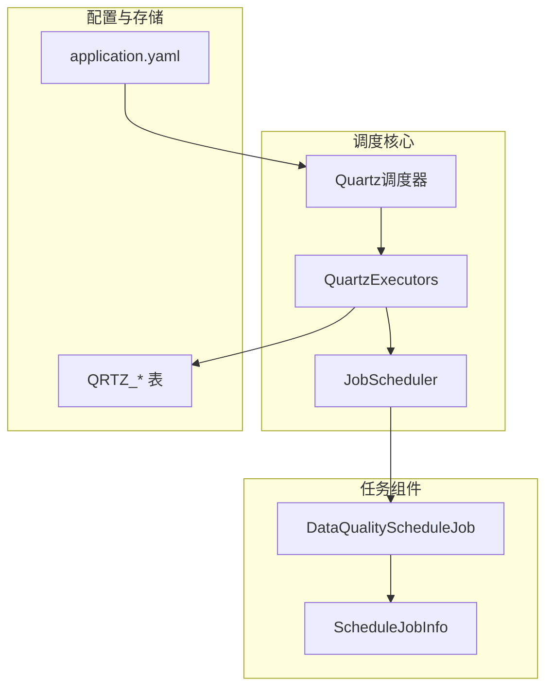
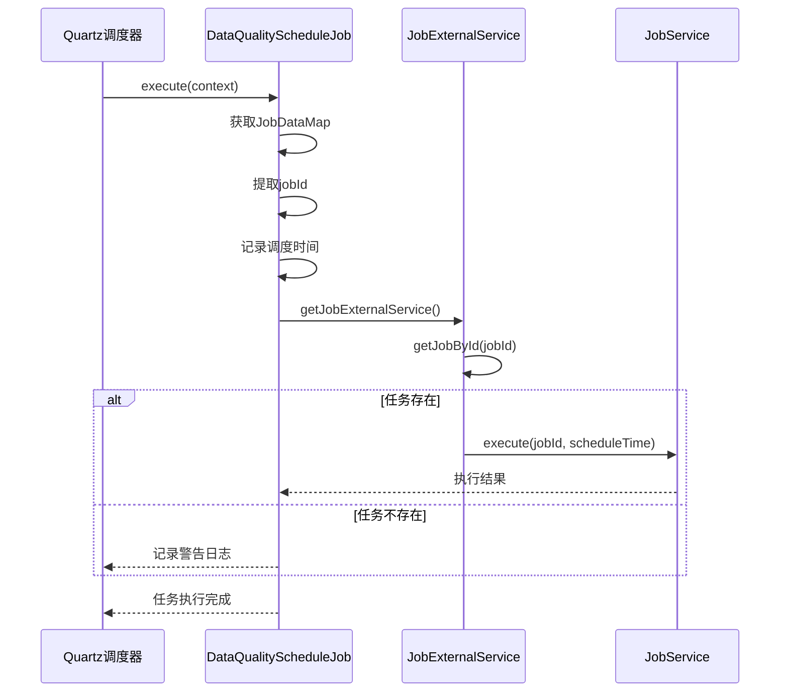
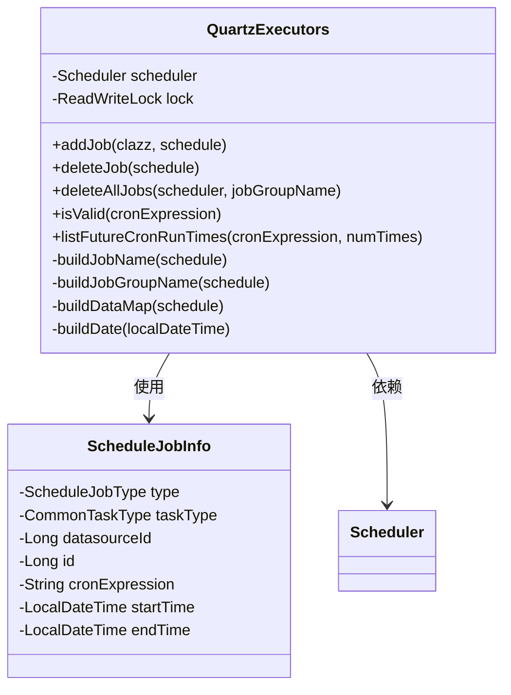
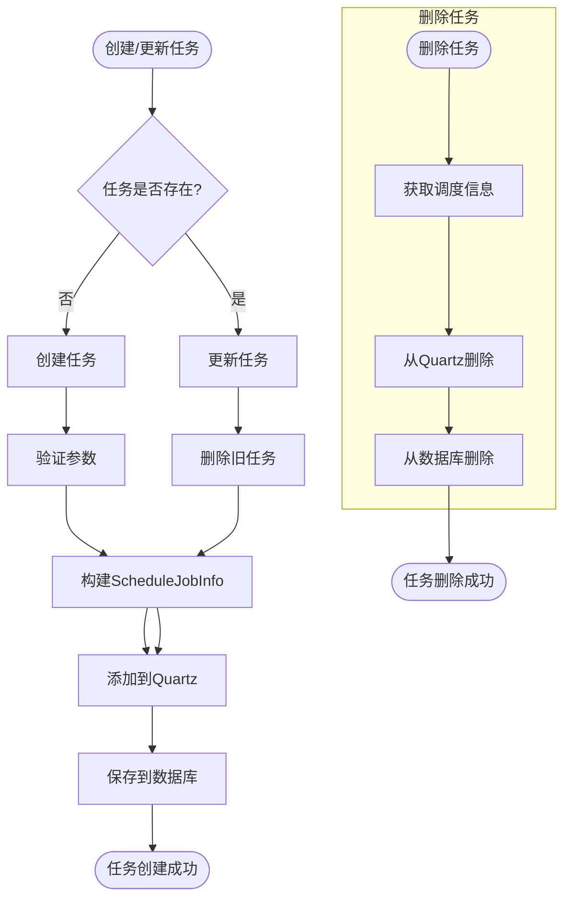
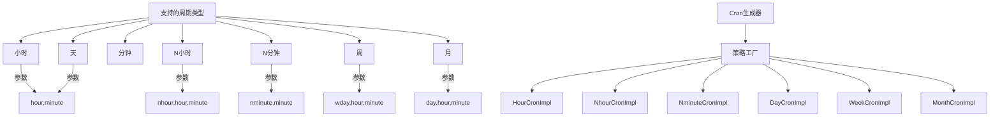
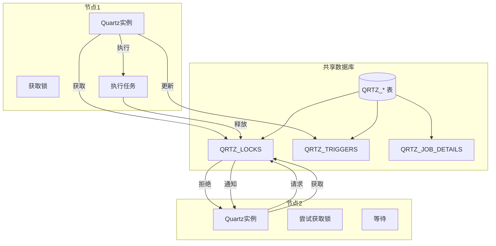
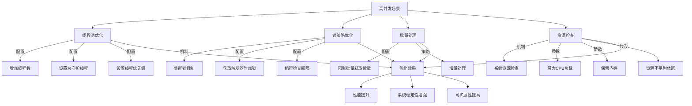

# 调度管理

<cite>
**本文档引用文件**   
- [QuartzExecutors.java](file://datavines-server\src\main\java\io\datavines\server\dqc\coordinator\quartz\QuartzExecutors.java)
- [DataQualityScheduleJob.java](file://datavines-server\src\main\java\io\datavines\server\dqc\coordinator\quartz\DataQualityScheduleJob.java)
- [JobScheduleServiceImpl.java](file://datavines-server\src\main\java\io\datavines\server\repository\service\impl\JobScheduleServiceImpl.java)
- [ScheduleJobInfo.java](file://datavines-server\src\main\java\io\datavines\server\dqc\coordinator\quartz\ScheduleJobInfo.java)
- [application.yaml](file://datavines-server\src\main\resources\application.yaml)
- [datavines-mysql.sql](file://scripts\sql\datavines-mysql.sql)
- [NhourCronImpl.java](file://datavines-server\src\main\java\io\datavines\server\dqc\coordinator\quartz\cron\impl\NhourCronImpl.java)
- [NminuteCronImpl.java](file://datavines-server\src\main\java\io\datavines\server\dqc\coordinator\quartz\cron\impl\NminuteCronImpl.java)
- [DayCronImpl.java](file://datavines-server\src\main\java\io\datavines\server\dqc\coordinator\quartz\cron\impl\DayCronImpl.java)
- [WeekCronImpl.java](file://datavines-server\src\main\java\io\datavines\server\dqc\coordinator\quartz\cron\impl\WeekCronImpl.java)
- [MonthCronImpl.java](file://datavines-server\src\main\java\io\datavines\server\dqc\coordinator\quartz\cron\impl\MonthCronImpl.java)
- [HourCronImpl.java](file://datavines-server\src\main\java\io\datavines\server\dqc\coordinator\quartz\cron\impl\HourCronImpl.java)
</cite>

## 目录
1. [调度系统架构](#调度系统架构)
2. [DataQualityScheduleJob定时任务触发机制](#dataqualityschedulejob定时任务触发机制)
3. [QuartzExecutors调度执行器管理](#quartzexecutors调度执行器管理)
4. [JobScheduler任务调度生命周期协调](#jobscheduler任务调度生命周期协调)
5. [调度配置参数说明](#调度配置参数说明)
6. [Cron表达式最佳实践](#cron表达式最佳实践)
7. [分布式调度一致性保障方案](#分布式调度一致性保障方案)
8. [调度性能监控指标](#调度性能监控指标)
9. [高并发场景优化策略](#高并发场景优化策略)

## 调度系统架构

数据质量调度管理系统基于Quartz框架构建，实现了分布式环境下的定时任务调度功能。系统架构包含核心调度组件、任务执行器、配置管理和服务协调等模块。

**图表来源**
- [QuartzExecutors.java](file://datavines-server\src\main\java\io\datavines\server\dqc\coordinator\quartz\QuartzExecutors.java)
- [DataQualityScheduleJob.java](file://datavines-server\src\main\java\io\datavines\server\dqc\coordinator\quartz\DataQualityScheduleJob.java)
- [JobScheduleServiceImpl.java](file://datavines-server\src\main\java\io\datavines\server\repository\service\impl\JobScheduleServiceImpl.java)
- [application.yaml](file://datavines-server\src\main\resources\application.yaml)
- [datavines-mysql.sql](file://scripts\sql\datavines-mysql.sql)

## DataQualityScheduleJob定时任务触发机制

DataQualityScheduleJob是Quartz框架中的具体任务实现类，负责数据质量检查任务的触发和执行。当调度器触发定时任务时，会调用execute方法执行数据质量检查。

**图表来源**
- [DataQualityScheduleJob.java](file://datavines-server\src\main\java\io\datavines\server\dqc\coordinator\quartz\DataQualityScheduleJob.java)
- [JobScheduleServiceImpl.java](file://datavines-server\src\main\java\io\datavines\server\repository\service\impl\JobScheduleServiceImpl.java)

**章节来源**
- [DataQualityScheduleJob.java](file://datavines-server\src\main\java\io\datavines\server\dqc\coordinator\quartz\DataQualityScheduleJob.java#L37-L75)

## QuartzExecutors调度执行器管理

QuartzExecutors类负责管理Quartz调度器的执行操作，包括任务的添加、删除和更新。它通过Spring注入的Scheduler实例与Quartz框架进行交互。

**图表来源**
- [QuartzExecutors.java](file://datavines-server\src\main\java\io\datavines\server\dqc\coordinator\quartz\QuartzExecutors.java)
- [ScheduleJobInfo.java](file://datavines-server\src\main\java\io\datavines\server\dqc\coordinator\quartz\ScheduleJobInfo.java)

**章节来源**
- [QuartzExecutors.java](file://datavines-server\src\main\java\io\datavines\server\dqc\coordinator\quartz\QuartzExecutors.java#L57-L263)

## JobScheduler任务调度生命周期协调

JobScheduler通过JobScheduleServiceImpl类协调任务调度的完整生命周期，包括任务创建、启动、暂停和删除等操作。

**图表来源**
- [JobScheduleServiceImpl.java](file://datavines-server\src\main\java\io\datavines\server\repository\service\impl\JobScheduleServiceImpl.java)
- [QuartzExecutors.java](file://datavines-server\src\main\java\io\datavines\server\dqc\coordinator\quartz\QuartzExecutors.java)

**章节来源**
- [JobScheduleServiceImpl.java](file://datavines-server\src\main\java\io\datavines\server\repository\service\impl\JobScheduleServiceImpl.java#L55-L266)

## 调度配置参数说明

系统提供了丰富的调度配置参数，主要通过application.yaml文件进行配置。

| 配置项 | 说明 | 默认值 |
|-------|------|-------|
| org.quartz.threadPool.threadCount | 线程池线程数量 | 25 |
| org.quartz.jobStore.isClustered | 是否启用集群模式 | true |
| org.quartz.jobStore.clusterCheckinInterval | 集群检查间隔(毫秒) | 5000 |
| org.quartz.jobStore.misfireThreshold | 任务错过触发的阈值(毫秒) | 60000 |
| org.quartz.scheduler.instanceId | 调度器实例ID生成策略 | AUTO |
| org.quartz.jobStore.acquireTriggersWithinLock | 获取触发器时是否加锁 | true |
| org.quartz.scheduler.batchTriggerAcquisitionMaxCount | 批量获取触发器最大数量 | 1 |

**章节来源**
- [application.yaml](file://datavines-server\src\main\resources\application.yaml#L39-L58)

## Cron表达式最佳实践

系统支持多种Cron表达式生成方式，包括标准Cron和自定义周期类型。

**图表来源**
- [HourCronImpl.java](file://datavines-server\src\main\java\io\datavines\server\dqc\coordinator\quartz\cron\impl\HourCronImpl.java)
- [NhourCronImpl.java](file://datavines-server\src\main\java\io\datavines\server\dqc\coordinator\quartz\cron\impl\NhourCronImpl.java)
- [NminuteCronImpl.java](file://datavines-server\src\main\java\io\datavines\server\dqc\coordinator\quartz\cron\impl\NminuteCronImpl.java)
- [DayCronImpl.java](file://datavines-server\src\main\java\io\datavines\server\dqc\coordinator\quartz\cron\impl\DayCronImpl.java)
- [WeekCronImpl.java](file://datavines-server\src\main\java\io\datavines\server\dqc\coordinator\quartz\cron\impl\WeekCronImpl.java)
- [MonthCronImpl.java](file://datavines-server\src\main\java\io\datavines\server\dqc\coordinator\quartz\cron\impl\MonthCronImpl.java)

**章节来源**
- [JobScheduleServiceImpl.java](file://datavines-server\src\main\java\io\datavines\server\repository\service\impl\JobScheduleServiceImpl.java#L211-L220)

## 分布式调度一致性保障方案

系统通过Quartz的JDBC JobStore和集群模式确保分布式环境下的调度一致性。

**图表来源**
- [application.yaml](file://datavines-server\src\main\resources\application.yaml#L44-L58)
- [datavines-mysql.sql](file://scripts\sql\datavines-mysql.sql#L147-L161)

## 调度性能监控指标

系统提供了多种调度性能监控指标，用于评估调度系统的健康状况。

| 监控指标 | 说明 | 采集方式 |
|--------|------|--------|
| 调度任务总数 | 系统中所有调度任务的数量 | 查询QRTZ_JOB_DETAILS表 |
| 活跃任务数 | 当前正在运行的任务数量 | Quartz API获取 |
| 任务执行延迟 | 任务实际执行时间与计划时间的差值 | 日志分析 |
| 调度器CPU使用率 | 调度器进程的CPU占用情况 | 系统监控 |
| 任务执行成功率 | 成功执行的任务占总执行任务的比例 | 任务执行日志统计 |
| 数据库连接池使用率 | 数据库连接池的使用情况 | HikariCP监控指标 |
| 触发器获取延迟 | 获取触发器的平均延迟时间 | Quartz内部统计 |

**章节来源**
- [application.yaml](file://datavines-server\src\main\resources\application.yaml#L72-L80)
- [QuartzExecutors.java](file://datavines-server\src\main\java\io\datavines\server\dqc\coordinator\quartz\QuartzExecutors.java#L244-L262)

## 高并发场景优化策略

针对高并发场景，系统采用了多种优化策略来确保调度性能。

**图表来源**
- [application.yaml](file://datavines-server\src\main\resources\application.yaml#L44-L58)
- [CommonTaskScheduler.java](file://datavines-server\src\main\java\io\datavines\server\scheduler\CommonTaskScheduler.java#L33-L63)
- [ThreadUtils.java](file://datavines-common\src\main\java\io\datavines\common\utils\ThreadUtils.java#L145-L154)

**章节来源**
- [application.yaml](file://datavines-server\src\main\resources\application.yaml#L54)
- [CommonTaskScheduler.java](file://datavines-server\src\main\java\io\datavines\server\scheduler\CommonTaskScheduler.java#L55-L58)