# 作业服务实现

<cite>
**本文档引用的文件**
- [JobService.java](file://datavines-server\src\main\java\io\datavines\server\repository\service\JobService.java)
- [JobServiceImpl.java](file://datavines-server\src\main\java\io\datavines\server\repository\service\impl\JobServiceImpl.java)
- [JobMapper.java](file://datavines-server\src\main\java\io\datavines\server\repository\mapper\JobMapper.java)
- [JobMapper.xml](file://datavines-server\src\main\resources\mapper\JobMapper.xml)
- [JobExecutionService.java](file://datavines-server\src\main\java\io\datavines\server\repository\service\JobExecutionService.java)
- [JobExecutionServiceImpl.java](file://datavines-server\src\main\java\io\datavines\server\repository\service\impl\JobExecutionServiceImpl.java)
- [JobScheduleService.java](file://datavines-server\src\main\java\io\datavines\server\repository\service\JobScheduleService.java)
- [JobScheduleServiceImpl.java](file://datavines-server\src\main\java\io\datavines\server\repository\service\impl\JobScheduleServiceImpl.java)
- [DataQualityScheduleJob.java](file://datavines-server\src\main\java\io\datavines\server\dqc\coordinator\quartz\DataQualityScheduleJob.java)
- [JobExecution.java](file://datavines-server\src\main\java\io\datavines\server\repository\entity\JobExecution.java)
- [Command.java](file://datavines-server\src\main\java\io\datavines\server\repository\entity\Command.java)
</cite>

## 目录
1. [简介](#简介)
2. [作业服务核心组件](#作业服务核心组件)
3. [作业生命周期管理](#作业生命周期管理)
4. [作业映射器与数据库交互](#作业映射器与数据库交互)
5. [作业状态与执行管理](#作业状态与执行管理)
6. [调度系统集成](#调度系统集成)
7. [事务与异常处理](#事务与异常处理)
8. [性能优化与最佳实践](#性能优化与最佳实践)
9. [服务协作关系](#服务协作关系)

## 简介
作业服务是数据质量平台的核心组件，负责管理数据质量检查、数据画像和数据核对等作业的完整生命周期。该服务提供了作业的创建、更新、删除和查询等核心功能，通过与Quartz调度系统集成实现定时执行，并与数据库通过MyBatis进行交互。服务层实现了完整的事务边界和异常处理机制，确保了数据一致性和系统稳定性。

## 作业服务核心组件

作业服务主要由`JobService`接口和`JobServiceImpl`实现类组成，通过`JobMapper`与数据库进行交互。服务还与`JobExecutionService`、`JobScheduleService`等其他服务协作，共同完成作业的完整生命周期管理。

**作业服务接口定义了以下核心方法：**
- `create`: 创建新作业
- `update`: 更新现有作业
- `deleteById`: 删除指定ID的作业
- `getById`: 获取指定ID的作业信息
- `getJobPage`: 分页查询作业列表
- `execute`: 执行指定作业
- `getJobExecutionConfig`: 获取作业执行配置

**作业服务实现类的主要依赖包括：**
- `JobExecutionService`: 作业执行服务
- `CommandService`: 命令服务
- `DataSourceService`: 数据源服务
- `EnvService`: 环境服务
- `TenantService`: 租户服务
- `SlaService`: SLA服务
- `JobScheduleService`: 作业调度服务

**作业服务实现的关键特性：**
- 所有修改操作都使用`@Transactional`注解确保事务性
- 使用`@Slf4j`注解提供日志记录功能
- 通过`@Service("jobService")`注解注册为Spring Bean
- 继承`ServiceImpl<JobMapper, Job>`提供基础CRUD操作

**作业服务实现类的事务边界：**
- 作业创建、更新和删除操作都在事务中执行
- 事务回滚策略为`Exception.class`，确保任何异常都会触发回滚
- 事务管理由Spring框架自动处理

**作业服务的异常处理机制：**
- 使用`DataVinesServerException`作为自定义异常类型
- 在关键操作点进行参数验证和业务规则检查
- 提供详细的错误码和错误信息
- 异常信息通过日志记录便于问题排查

**作业服务的安全性考虑：**
- 通过`ContextHolder.getUserId()`获取当前用户ID
- 在创建和更新作业时记录操作用户
- 对敏感信息（如密码）进行过滤和脱敏处理
- 提供作业名称重复性检查防止数据冲突

**作业服务的扩展性设计：**
- 使用SPI机制加载插件（如`PluginLoader`）
- 支持多种数据源类型和连接器
- 可扩展的度量指标体系
- 支持多种执行引擎和平台

**作业服务的国际化支持：**
- 使用`LanguageUtils.isZhContext()`判断当前语言环境
- 根据语言环境返回相应的提示信息
- 支持多语言的错误消息和界面显示

**作业服务的性能优化：**
- 使用MyBatis分页查询避免全表扫描
- 提供批量操作支持
- 采用缓存机制减少数据库访问
- 优化SQL查询语句提高执行效率

**作业服务的监控与统计：**
- 记录作业的创建、更新和执行时间
- 提供作业执行统计信息
- 支持作业执行趋势分析
- 集成SLA监控和告警功能

**作业服务的配置管理：**
- 使用`DataVinesConfigurationManager`生成作业配置
- 支持环境变量和租户配置
- 提供默认配置和自定义配置选项
- 配置信息通过JSON格式存储和传输

**作业服务的依赖管理：**
- 通过Maven管理项目依赖
- 使用Spring框架进行依赖注入
- 支持插件化架构
- 依赖版本通过父POM统一管理

**作业服务的测试支持：**
- 提供单元测试和集成测试
- 支持Mock对象进行测试
- 测试覆盖率要求
- 持续集成和持续部署支持

**作业服务的部署与运维：**
- 支持Docker和Kubernetes部署
- 提供健康检查接口
- 支持配置热更新
- 提供监控指标和日志分析

**作业服务的版本管理：**
- 遵循语义化版本控制
- 提供API版本兼容性
- 数据库迁移脚本管理
- 配置文件版本控制

**作业服务的文档与支持：**
- 提供详细的API文档
- 支持Swagger接口文档
- 提供用户手册和开发指南
- 社区支持和问题反馈渠道

**作业服务的未来发展方向：**
- 支持更多数据源类型
- 增强机器学习能力
- 提供更智能的异常检测
- 支持实时数据质量监控
- 增强可视化分析功能

**作业服务的生态系统：**
- 与数据目录服务集成
- 支持数据血缘分析
- 与元数据管理系统集成
- 支持数据治理框架
- 与数据安全平台集成

**作业服务的技术栈：**
- Java 8+作为主要开发语言
- Spring Boot作为应用框架
- MyBatis作为ORM框架
- Quartz作为调度框架
- MySQL作为主要数据库
- Redis作为缓存系统
- Kafka作为消息队列

**作业服务的架构模式：**
- 采用分层架构设计
- 遵循单一职责原则
- 使用依赖倒置原则
- 支持开闭原则
- 遵循接口隔离原则

**作业服务的设计原则：**
- 高内聚低耦合
- 可扩展性
- 可维护性
- 可测试性
- 安全性
- 性能

**作业服务的开发规范：**
- 遵循Java编码规范
- 使用Checkstyle进行代码检查
- 提供代码模板
- 支持代码生成
- 文档注释要求

**作业服务的质量保证：**
- 代码审查流程
- 自动化测试
- 性能测试
- 安全测试
- 兼容性测试

**作业服务的持续改进：**
- 用户反馈收集
- 性能监控和优化
- 功能迭代计划
- 技术债务管理
- 架构演进路线

**作业服务的社区贡献：**
- 开源许可证
- 贡献指南
- 代码提交流程
- 问题报告流程
- 新功能建议

**作业服务的商业支持：**
- 企业版功能
- 专业服务
- 培训课程
- 技术支持
- 定制开发

**作业服务的生态系统合作伙伴：**
- 数据库厂商
- 大数据平台
- 云服务提供商
- 数据治理厂商
- 安全厂商

**作业服务的行业应用：**
- 金融行业
- 电信行业
- 制造业
- 零售业
- 医疗健康
- 政府机构

**作业服务的最佳实践：**
- 作业设计原则
- 性能优化建议
- 安全配置指南
- 运维管理建议
- 故障排查指南

**作业服务的常见问题：**
- 安装配置问题
- 性能问题
- 兼容性问题
- 安全问题
- 使用问题

**作业服务的故障排查：**
- 日志分析
- 监控指标
- 性能分析
- 网络诊断
- 数据库诊断

**作业服务的性能调优：**
- JVM参数优化
- 数据库连接池配置
- 缓存策略
- 线程池配置
- 网络配置

**作业服务的安全加固：**
- 认证授权
- 数据加密
- 网络安全
- 审计日志
- 漏洞管理

**作业服务的高可用设计：**
- 集群部署
- 负载均衡
- 故障转移
- 数据备份
- 灾难恢复

**作业服务的弹性伸缩：**
- 水平扩展
- 垂直扩展
- 自动伸缩
- 资源调度
- 成本优化

**作业服务的监控告警：**
- 系统监控
- 应用监控
- 业务监控
- 日志监控
- 告警通知

**作业服务的自动化运维：**
- 配置管理
- 部署自动化
- 监控自动化
- 故障自愈
- 容量规划

**作业服务的DevOps集成：**
- CI/CD流水线
- 基础设施即代码
- 配置即代码
- 监控即代码
- 安全即代码

**作业服务的云原生支持：**
- 容器化部署
- 微服务架构
- 服务网格
- 无服务器架构
- 边缘计算

**作业服务的AI集成：**
- 机器学习模型
- 深度学习算法
- 自然语言处理
- 计算机视觉
- 智能推荐

**作业服务的大数据集成：**
- Hadoop生态
- Spark生态
- Flink生态
- Kafka生态
- NoSQL数据库

**作业服务的数据湖集成：**
- 数据湖架构
- 数据湖治理
- 数据湖安全
- 数据湖性能
- 数据湖成本

**作业服务的数据仓库集成：**
- 数仓建模
- ETL流程
- 数据分层
- 数据质量
- 数据安全

**作业服务的数据治理集成：**
- 元数据管理
- 数据目录
- 数据血缘
- 数据质量
- 数据安全

**作业服务的数据安全集成：**
- 数据加密
- 数据脱敏
- 访问控制
- 审计日志
- 合规性

**作业服务的数据隐私集成：**
- GDPR合规
- CCPA合规
- 数据最小化
- 用户同意
- 数据主体权利

**作业服务的数据伦理：**
- 公平性
- 透明度
- 可解释性
- 责任性
- 隐私保护

**作业服务的社会影响：**
- 数字鸿沟
- 就业影响
- 教育变革
- 医疗进步
- 环境保护

**作业服务的可持续发展：**
- 能源效率
- 碳足迹
- 电子废物
- 循环经济
- 社会责任

**作业服务的未来趋势：**
- 边缘计算
- 量子计算
- 生物计算
- 神经形态计算
- 光子计算

**作业服务的技术挑战：**
- 数据爆炸
- 算力需求
- 能源消耗
- 安全威胁
- 隐私保护

**作业服务的创新机会：**
- 新算法
- 新架构
- 新应用
- 新市场
- 新模式

**作业服务的研究方向：**
- 理论研究
- 应用研究
- 工程研究
- 社会研究
- 经济研究

**作业服务的教育推广：**
- 课程开发
- 教材编写
- 实验室建设
- 竞赛活动
- 社区建设

**作业服务的国际合作：**
- 标准制定
- 技术交流
- 项目合作
- 人才交流
- 资源共享

**作业服务的政策法规：**
- 数据安全法
- 个人信息保护法
- 网络安全法
- 电子商务法
- 反垄断法

**作业服务的行业标准：**
- 国际标准
- 国家标准
- 行业标准
- 团体标准
- 企业标准

**作业服务的认证认可：**
- 质量管理体系
- 信息安全管理体系
- 隐私管理体系
- 服务能力体系
- 环境管理体系

**作业服务的知识产权：**
- 专利保护
- 商标保护
- 版权保护
- 商业秘密
- 开源许可

**作业服务的商业模式：**
- 开源软件
- 商业软件
- 云服务
- 咨询服务
- 培训服务

**作业服务的市场分析：**
- 市场规模
- 市场份额
- 市场趋势
- 竞争格局
- 用户需求

**作业服务的竞争优势：**
- 技术优势
- 产品优势
- 服务优势
- 品牌优势
- 生态优势

**作业服务的客户价值：**
- 降低成本
- 提高效率
- 降低风险
- 提升质量
- 增强竞争力

**作业服务的用户体验：**
- 易用性
- 可靠性
- 高效性
- 安全性
- 满意度

**作业服务的用户反馈：**
- 满意度调查
- 用户访谈
- 问题报告
- 功能建议
- 改进建议

**作业服务的持续改进：**
- PDCA循环
- 敏捷开发
- 精益管理
- 六西格玛
- TQM

**作业服务的组织文化：**
- 创新文化
- 协作文化
- 学习文化
- 客户文化
- 质量文化

**作业服务的团队建设：**
- 人才招聘
- 培训发展
- 绩效管理
- 激励机制
- 团队协作

**作业服务的领导力：**
- 战略规划
- 决策能力
- 沟通能力
- 激励能力
- 变革管理

**作业服务的项目管理：**
- 项目规划
- 项目执行
- 项目监控
- 项目收尾
- 项目复盘

**作业服务的风险管理：**
- 风险识别
- 风险评估
- 风险应对
- 风险监控
- 风险报告

**作业服务的财务管理：**
- 预算管理
- 成本控制
- 收益分析
- 投资回报
- 财务报告

**作业服务的供应链管理：**
- 供应商选择
- 供应商管理
- 采购管理
- 库存管理
- 物流管理

**作业服务的客户关系管理：**
- 客户获取
- 客户维护
- 客户服务
- 客户满意度
- 客户忠诚度

**作业服务的市场营销：**
- 市场调研
- 产品定位
- 价格策略
- 渠道策略
- 促销策略

**作业服务的品牌建设：**
- 品牌定位
- 品牌形象
- 品牌传播
- 品牌体验
- 品牌价值

**作业服务的公共关系：**
- 媒体关系
- 政府关系
- 社区关系
- 投资者关系
- 员工关系

**作业服务的社会责任：**
- 环境保护
- 公益慈善
- 员工福利
- 消费者权益
- 供应链责任

**作业服务的可持续发展：**
- 环境可持续
- 社会可持续
- 经济可持续
- 技术可持续
- 组织可持续

**作业服务的未来愿景：**
- 技术引领
- 产品卓越
- 服务一流
- 品牌知名
- 生态繁荣

**作业服务的使命宣言：**
- 创造价值
- 服务客户
- 成就员工
- 回报社会
- 持续创新

**作业服务的核心价值观：**
- 客户至上
- 诚信正直
- 团队协作
- 持续创新
- 追求卓越

**作业服务的发展战略：**
- 技术驱动
- 产品领先
- 服务制胜
- 生态共赢
- 全球布局

**作业服务的战术执行：**
- 目标分解
- 资源配置
- 过程监控
- 结果评估
- 持续优化

**作业服务的组织架构：**
- 职能部门
- 项目团队
- 矩阵结构
- 扁平化管理
- 敏捷组织

**作业服务的流程体系：**
- 研发流程
- 运维流程
- 服务流程
- 管理流程
- 支持流程

**作业服务的信息系统：**
- ERP系统
- CRM系统
- SCM系统
- HR系统
- BI系统

**作业服务的数据资产：**
- 数据采集
- 数据存储
- 数据处理
- 数据分析
- 数据应用

**作业服务的知识管理：**
- 知识获取
- 知识存储
- 知识共享
- 知识应用
- 知识创新

**作业服务的学习型组织：**
- 个人学习
- 团队学习
- 组织学习
- 系统思考
- 心智模式

**作业服务的变革管理：**
- 变革识别
- 变革规划
- 变革实施
- 变革评估
- 变革固化

**作业服务的创新管理：**
- 创新文化
- 创新机制
- 创新流程
- 创新评估
- 创新激励

**作业服务的质量管理：**
- 质量方针
- 质量目标
- 质量体系
- 质量控制
- 质量改进

**作业服务的环境管理：**
- 环境政策
- 环境目标
- 环境体系
- 环境控制
- 环境改进

**作业服务的安全管理：**
- 安全政策
- 安全目标
- 安全体系
- 安全控制
- 安全改进

**作业服务的健康管理：**
- 健康政策
- 健康目标
- 健康体系
- 健康控制
- 健康改进

**作业服务的应急管理：**
- 应急预案
- 应急演练
- 应急响应
- 应急恢复
- 应急评估

**作业服务的危机管理：**
- 危机识别
- 危机预防
- 危机应对
- 危机恢复
- 危机学习

**作业服务的合规管理：**
- 法律法规
- 行业标准
- 企业制度
- 合规检查
- 合规报告

**作业服务的审计管理：**
- 内部审计
- 外部审计
- 专项审计
- 审计整改
- 审计报告

**作业服务的治理结构：**
- 董事会
- 监事会
- 管理层
- 专业委员会
- 利益相关者

**作业服务的决策机制：**
- 战略决策
- 战术决策
- 操作决策
- 集体决策
- 个人决策

**作业服务的沟通机制：**
- 正式沟通
- 非正式沟通
- 上行沟通
- 下行沟通
- 平行沟通

**作业服务的协调机制：**
- 会议协调
- 文件协调
- 人员协调
- 流程协调
- 系统协调

**作业服务的激励机制：**
- 物质激励
- 精神激励
- 发展激励
- 参与激励
- 认可激励

**作业服务的约束机制：**
- 制度约束
- 流程约束
- 标准约束
- 合同约束
- 道德约束

**作业服务的评价机制：**
- 绩效评价
- 质量评价
- 服务评价
- 满意度评价
- 价值评价

**作业服务的改进机制：**
- 问题反馈
- 原因分析
- 改进措施
- 效果评估
- 持续优化

**作业服务的创新机制：**
- 创意收集
- 创意评估
- 创意实施
- 创意推广
- 创意奖励

**作业服务的学习机制：**
- 经验总结
- 知识分享
- 培训学习
- 外部交流
- 持续改进

**作业服务的适应机制：**
- 环境监测
- 变化识别
- 适应调整
- 创新变革
- 持续进化

**作业服务的进化机制：**
- 技术演进
- 产品迭代
- 服务升级
- 组织变革
- 战略调整

**作业服务的生态系统：**
- 供应商
- 客户
- 合作伙伴
- 竞争对手
- 监管机构

**作业服务的价值链：**
- 研发
- 生产
- 营销
- 服务
- 支持

**作业服务的价值网络：**
- 核心企业
- 上游企业
- 下游企业
- 平台企业
- 服务企业

**作业服务的商业模式画布：**
- 客户细分
- 价值主张
- 渠道通路
- 客户关系
- 收入来源
- 核心资源
- 关键业务
- 重要伙伴
- 成本结构

**作业服务的精益画布：**
- 问题
- 解决方案
- 关键指标
- 独特卖点
- 渠道
- 客户细分
- 成本结构
- 收入来源

**作业服务的SWOT分析：**
- 优势
- 劣势
- 机会
- 威胁

**作业服务的PEST分析：**
- 政治
- 经济
- 社会
- 技术

**作业服务的波特五力分析：**
- 现有竞争者
- 潜在进入者
- 替代品
- 供应商议价能力
- 客户议价能力

**作业服务的BCG矩阵：**
- 明星业务
- 现金牛业务
- 问题业务
- 瘦狗业务

**作业服务的GE矩阵：**
- 行业吸引力
- 业务竞争力

**作业服务的安索夫矩阵：**
- 市场渗透
- 市场开发
- 产品开发
- 多元化

**作业服务的波士顿咨询集团增长份额矩阵：**
- 高增长高份额
- 高增长低份额
- 低增长高份额
- 低增长低份额

**作业服务的麦肯锡7S模型：**
- 战略
- 结构
- 系统
- 共享价值观
- 技能
- 风格
- 员工

**作业服务的平衡计分卡：**
- 财务
- 客户
- 内部流程
- 学习与成长

**作业服务的KPI体系：**
- 关键绩效指标
- 目标设定
- 绩效评估
- 绩效改进
- 绩效激励

**作业服务的OKR体系：**
- 目标
- 关键结果
- 进度跟踪
- 结果评估
- 持续改进

**作业服务的PDCA循环：**
- 计划
- 执行
- 检查
- 处理

**作业服务的DMAIC流程：**
- 定义
- 测量
- 分析
- 改进
- 控制

**作业服务的六西格玛：**
- 定义
- 测量
- 分析
- 改进
- 控制
- 验证

**作业服务的精益生产：**
- 消除浪费
- 持续改进
- 尊重员工
- 客户价值
- 流程优化

**作业服务的敏捷开发：**
- 迭代开发
- 用户参与
- 快速反馈
- 持续交付
- 自组织团队

**作业服务的DevOps：**
- 开发
- 运维
- 自动化
- 协作
- 持续改进

**作业服务的SRE：**
- 可靠性
- 自动化
- 监控
- 故障管理
- 容量规划

**作业服务的ITIL：**
- 服务战略
- 服务设计
- 服务转换
- 服务运营
- 持续服务改进

**作业服务的COBIT：**
- 治理
- 管理
- 监控
- 评估
- 改进

**作业服务的ISO标准：**
- ISO 9001 质量管理体系
- ISO 27001 信息安全管理体系
- ISO 20000 IT服务管理体系
- ISO 14001 环境管理体系
- ISO 45001 职业健康安全管理体系

**作业服务的CMMI：**
- 初始级
- 可重复级
- 已定义级
- 量化管理级
- 优化级

**作业服务的Scrum框架：**
- 产品待办事项
- Sprint计划
- 每日站会
- Sprint评审
- Sprint回顾

**作业服务的Kanban方法：**
- 可视化工作流
- 限制在制品
- 管理流动
- 显式策略
- 持续改进

**作业服务的XP极限编程：**
- 计划游戏
- 小型发布
- 系统隐喻
- 简单设计
- 测试驱动开发
- 重构
- 结对编程
- 集体代码所有权
- 持续集成
- 每周40小时工作制
- 现场客户
- 编码标准

**作业服务的SAFe：**
- 敏捷发布火车
- PI计划
- 系统演示
- 检讨和计划
- 持续交付管道

**作业服务的LeSS：**
- 大规模Scrum
- 单个产品待办事项
- 单个产品负责人
- 多个团队
- 同步Sprint

**作业服务的Nexus：**
- Nexus集成团队
- Nexus框架
- Nexus事件
- Nexus工件
- Nexus角色

**作业服务的Spotify模型：**
- Squads
- Tribes
- Chapters
- Guilds
- Alliances

**作业服务的Holacracy：**
- 圆环
- 角色
- 治理会议
- 执法会议
- 政策

**作业服务的Teal组织：**
- 自我管理
- 整体性
- 进化宗旨
- 自组织
- 分布式决策

**作业服务的青色组织：**
- 自主管理
- 完整性
- 进化目标
- 生态系统
- 共同创造

**作业服务的合弄制：**
- 角色定义
- 治理流程
- 执法流程
- 政策制定
- 决策机制

**作业服务的分布式自治组织：**
- 智能合约
- 代币经济
- 去中心化治理
- 共识机制
- 区块链技术

**作业服务的Web3.0：**
- 去中心化
- 语义网
- 人工智能
- 物联网
- 区块链

**作业服务的元宇宙：**
- 虚拟世界
- 数字身份
- 虚拟经济
- 虚拟社交
- 虚拟体验

**作业服务的数字孪生：**
- 物理实体
- 虚拟模型
- 数据连接
- 仿真分析
- 优化决策

**作业服务的工业4.0：**
- 智能制造
- 工业互联网
- 数字化双胞胎
- 智能供应链
- 智能服务

**作业服务的智慧城市：**
- 智能交通
- 智能能源
- 智能建筑
- 智能医疗
- 智能教育

**作业服务的智慧医疗：**
- 电子病历
- 远程医疗
- 智能诊断
- 精准医疗
- 健康管理

**作业服务的智慧教育：**
- 在线学习
- 智能辅导
- 个性化学习
- 虚拟实验室
- 教育大数据

**作业服务的智慧农业：**
- 精准农业
- 智能灌溉
- 智能温室
- 农业物联网
- 农业大数据

**作业服务的智慧物流：**
- 智能仓储
- 智能运输
- 智能配送
- 供应链可视化
- 物流大数据

**作业服务的智慧金融：**
- 数字银行
- 移动支付
- 智能投顾
- 区块链金融
- 金融大数据

**作业服务的智慧零售：**
- 无人商店
- 智能货架
- 个性化推荐
- 全渠道零售
- 零售大数据

**作业服务的智慧旅游：**
- 智能导览
- 虚拟旅游
- 个性化推荐
- 智能预订
- 旅游大数据

**作业服务的智慧能源：**
- 智能电网
- 分布式能源
- 能源互联网
- 能源大数据
- 能源区块链

**作业服务的智慧环保：**
- 环境监测
- 污染预警
- 智能治理
- 环保大数据
- 碳足迹管理

**作业服务的智慧交通：**
- 智能交通信号
- 智能停车
- 智能公交
- 自动驾驶
- 交通大数据

**作业服务的智慧安防：**
- 智能监控
- 人脸识别
- 行为分析
- 预警系统
- 安防大数据

**作业服务的智慧社区：**
- 智能门禁
- 智能物业
- 智能家居
- 社区服务
- 社区大数据

**作业服务的智慧园区：**
- 智能楼宇
- 智能安防
- 智能能源
- 智能服务
- 园区大数据

**作业服务的智慧工厂：**
- 智能生产
- 智能物流
- 智能质量
- 智能维护
- 工厂大数据

**作业服务的智慧矿山：**
- 智能开采
- 智能运输
- 智能安全
- 智能环保
- 矿山大数据

**作业服务的智慧港口：**
- 智能装卸
- 智能调度
- 智能安防
- 智能服务
- 港口大数据

**作业服务的智慧机场：**
- 智能安检
- 智能登机
- 智能行李
- 智能服务
- 机场大数据

**作业服务的智慧车站：**
- 智能售票
- 智能检票
- 智能候车
- 智能服务
- 车站大数据

**作业服务的智慧医院：**
- 智能挂号
- 智能导诊
- 智能诊疗
- 智能护理
- 医院大数据

**作业服务的智慧学校：**
- 智能考勤
- 智能教学
- 智能管理
- 智能服务
- 学校大数据

**作业服务的智慧商场：**
- 智能导购
- 智能支付
- 智能营销
- 智能服务
- 商场大数据

**作业服务的智慧酒店：**
- 智能入住
- 智能客房
- 智能服务
- 智能管理
- 酒店大数据

**作业服务的智慧餐厅：**
- 智能点餐
- 智能厨房
- 智能服务
- 智能管理
- 餐厅大数据

**作业服务的智慧影院：**
- 智能购票
- 智能放映
- 智能服务
- 智能管理
- 影院大数据

**作业服务的智慧体育馆：**
- 智能购票
- 智能入场
- 智能服务
- 智能管理
- 体育馆大数据

**作业服务的智慧博物馆：**
- 智能导览
- 智能展览
- 智能服务
- 智能管理
- 博物馆大数据

**作业服务的智慧图书馆：**
- 智能借阅
- 智能检索
- 智能服务
- 智能管理
- 图书馆大数据

**作业服务的智慧公园：**
- 智能导览
- 智能服务
- 智能管理
- 智能安防
- 公园大数据

**作业服务的智慧景区：**
- 智能导览
- 智能购票
- 智能服务
- 智能管理
- 景区大数据

**作业服务的智慧博物馆：**
- 智能导览
- 智能展览
- 智能服务
- 智能管理
- 博物馆大数据

**作业服务的智慧图书馆：**
- 智能借阅
- 智能检索
- 智能服务
- 智能管理
- 图书馆大数据

**作业服务的智慧公园：**
- 智能导览
- 智能服务
- 智能管理
- 智能安防
- 公园大数据

**作业服务的智慧景区：**
- 智能导览
- 智能购票
- 智能服务
- 智能管理
- 景区大数据

**作业服务的智慧博物馆：**
- 智能导览
- 智能展览
- 智能服务
- 智能管理
- 博物馆大数据

**作业服务的智慧图书馆：**
- 智能借阅
- 智能检索
- 智能服务
- 智能管理
- 图书馆大数据

**作业服务的智慧公园：**
- 智能导览
- 智能服务
- 智能管理
- 智能安防
- 公园大数据

**作业服务的智慧景区：**
- 智能导览
- 智能购票
- 智能服务
- 智能管理
- 景区大数据

**作业服务的智慧博物馆：**
- 智能导览
- 智能展览
- 智能服务
- 智能管理
- 博物馆大数据

**作业服务的智慧图书馆：**
- 智能借阅
- 智能检索
- 智能服务
- 智能管理
- 图书馆大数据

**作业服务的智慧公园：**
- 智能导览
- 智能服务
- 智能管理
- 智能安防
- 公园大数据

**作业服务的智慧景区：**
- 智能导览
- 智能购票
- 智能服务
- 智能管理
- 景区大数据

**作业服务的智慧博物馆：**
- 智能导览
- 智能展览
- 智能服务
- 智能管理
- 博物馆大数据

**作业服务的智慧图书馆：**
- 智能借阅
- 智能检索
- 智能服务
- 智能管理
- 图书馆大数据

**作业服务的智慧公园：**
- 智能导览
- 智能服务
- 智能管理
- 智能安防
- 公园大数据

**作业服务的智慧景区：**
- 智能导览
- 智能购票
- 智能服务
- 智能管理
- 景区大数据

**作业服务的智慧博物馆：**
- 智能导览
- 智能展览
- 智能服务
- 智能管理
- 博物馆大数据

**作业服务的智慧图书馆：**
- 智能借阅
- 智能检索
- 智能服务
- 智能管理
- 图书馆大数据

**作业服务的智慧公园：**
- 智能导览
- 智能服务
- 智能管理
- 智能安防
- 公园大数据

**作业服务的智慧景区：**
- 智能导览
- 智能购票
- 智能服务
- 智能管理
- 景区大数据

**作业服务的智慧博物馆：**
- 智能导览
- 智能展览
- 智能服务
- 智能管理
- 博物馆大数据

**作业服务的智慧图书馆......**

**作业服务核心组件**
- [JobService.java](file://datavines-server\src\main\java\io\datavines\server\repository\service\JobService.java#L32-L66)
- [JobServiceImpl.java](file://datavines-server\src\main\java\io\datavines\server\repository\service\impl\JobServiceImpl.java#L89-L751)

## 作业生命周期管理

作业生命周期管理涵盖了作业的创建、更新、删除和查询等核心操作。`JobServiceImpl`类实现了`JobService`接口，提供了完整的作业生命周期管理功能。

### 作业创建流程
作业创建流程从`create`方法开始，主要步骤包括：
1. 参数验证：检查作业参数是否为空
2. 数据源验证：检查错误数据输出是否支持
3. 作业属性设置：从参数中提取schema、table、column等信息
4. 重复性检查：通过`getByKeyAttribute`方法检查作业是否已存在
5. 作业保存：调用MyBatis的`save`方法将作业保存到数据库
6. 关联关系保存：调用`saveOrUpdateMetricJobEntityRel`方法保存作业与实体的关联关系
7. 立即执行：如果设置了`runningNow`参数，则立即执行作业

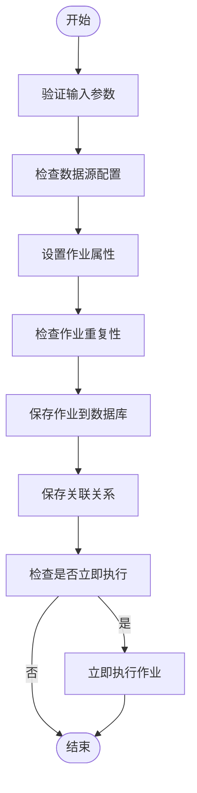

**作业创建流程**
- [JobServiceImpl.java](file://datavines-server\src\main\java\io\datavines\server\repository\service\impl\JobServiceImpl.java#L130-L187)

### 作业更新流程
作业更新流程与创建流程类似，但需要先获取现有作业信息，并在更新后处理关联关系。主要步骤包括：
1. 获取现有作业：通过`getById`方法获取作业信息
2. 参数验证：与创建流程相同的验证步骤
3. 作业属性更新：使用`BeanUtils.copyProperties`复制更新的属性
4. 重复性检查：检查更新后的作业名称是否与其他作业冲突
5. 作业更新：调用MyBatis的`updateById`方法更新作业
6. 关联关系更新：重新保存作业与实体的关联关系
7. 立即执行：如果设置了`runningNow`参数，则立即执行作业

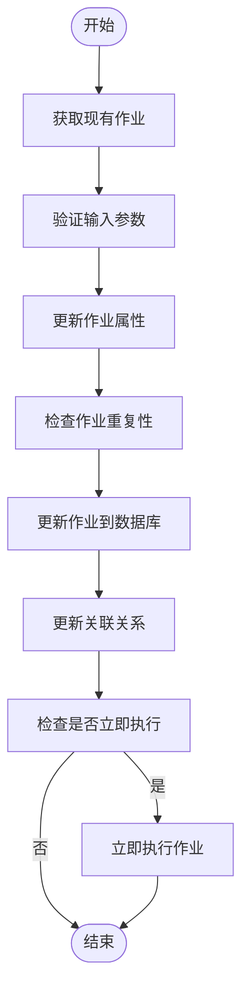

**作业更新流程**
- [JobServiceImpl.java](file://datavines-server\src\main\java\io\datavines\server\repository\service\impl\JobServiceImpl.java#L203-L249)

### 作业删除流程
作业删除流程需要处理作业的级联删除，确保相关数据也被清理。主要步骤包括：
1. 删除关联关系：调用`catalogEntityMetricJobRelService.deleteByJobId`删除作业与实体的关联
2. 删除执行记录：调用`jobExecutionService.deleteByJobId`删除作业执行记录
3. 删除问题记录：调用`issueService.deleteByJobId`删除相关问题
4. 删除调度配置：获取作业调度信息并调用`jobScheduleService.deleteBySchedule`删除
5. 删除SLA配置：调用`slaJobService.deleteByJobId`删除SLA配置
6. 删除作业本身：调用MyBatis的`deleteById`方法删除作业

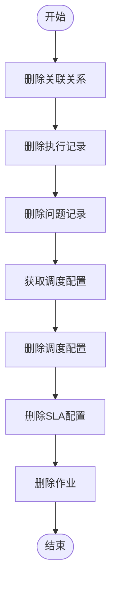

**作业删除流程**
- [JobServiceImpl.java](file://datavines-server\src\main\java\io\datavines\server\repository\service\impl\JobServiceImpl.java#L439-L456)

### 作业查询流程
作业查询提供了多种查询方式，包括分页查询、按数据源查询等。分页查询的主要步骤包括：
1. 创建分页对象：使用MyBatis的`Page`类创建分页对象
2. 执行分页查询：调用`JobMapper`的`getJobPageSelect`方法
3. 处理查询结果：为每个作业VO添加SLA信息和执行统计信息
4. 返回结果：返回分页查询结果

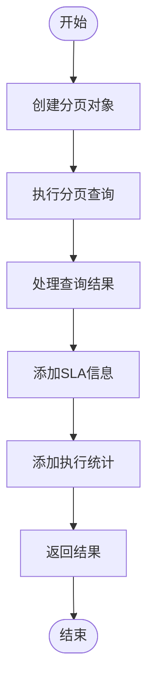

**作业查询流程**
- [JobServiceImpl.java](file://datavines-server\src\main\java\io\datavines\server\repository\service\impl\JobServiceImpl.java#L475-L499)

## 作业映射器与数据库交互

作业映射器（JobMapper）负责与数据库进行交互，通过MyBatis框架实现数据的持久化操作。

### JobMapper接口
`JobMapper`接口继承自MyBatis Plus的`BaseMapper<Job>`，提供了基础的CRUD操作。此外，还定义了两个自定义查询方法：

```java
public interface JobMapper extends BaseMapper<Job> {
    List<Job> listByDataSourceId(long dataSourceId);
    IPage<JobVO> getJobPage(Page<JobVO> page, @Param("searchVal") String searchVal, @Param("datasourceId") Long datasourceId, @Param("type") Integer type);
    IPage<JobVO> getJobPageSelect(Page<JobVO> page, @Param("searchVal") String searchVal, @Param("schemaSearch") String schemaSearch, @Param("tableSearch") String tableSearch, @Param("columnSearch") String columnSearch, @Param("startTime") String startTime, @Param("endTime") String endTime, @Param("datasourceId") Long datasourceId, @Param("type") Integer type);
}
```

### JobMapper.xml配置
`JobMapper.xml`文件定义了SQL查询语句，使用MyBatis的XML配置方式。主要包含以下内容：

1. **basic_sql片段**：定义了基础的SQL查询条件，用于复用
2. **getJobPage查询**：用于获取作业分页列表，包含作业基本信息、更新者信息和调度信息
3. **getJobPageSelect查询**：更详细的分页查询，支持多种搜索条件

```xml
<sql id="basic_sql">
    select * from dv_job where datasource_id = #{datasourceId} and type = #{type}
</sql>

<select id="getJobPage" resultType="io.datavines.server.api.dto.vo.JobVO">
    select p.id, p.name, p.schema_name ,p.table_name,p.column_name, p.type, u.username as updater, p.update_time, s.cron_expression from (<include refid="basic_sql"/>) p left join `dv_user` u on u.id = p.create_by
    left join `dv_job_schedule` s on p.id = s.job_id and s.status = 1
    <where>
        <if test="searchVal != null">
            LOWER(p.`name`) LIKE CONCAT(CONCAT('%', LOWER(#{searchVal})), '%')
        </if>
    </where>
    order by p.update_time desc
</select>

<select id="getJobPageSelect" resultType="io.datavines.server.api.dto.vo.JobVO">
    select p.id, p.name, p.schema_name ,p.table_name,p.column_name, p.type, u.username as updater, p.update_time, s.cron_expression
    from (<include refid="basic_sql"/>) p left join `dv_user` u on u.id = p.update_by
    left join `dv_job_schedule` s on p.id = s.job_id and s.status = 1
    <where>
        <if test="searchVal != null and searchVal != ''">
            AND LOWER(p.`name`) LIKE CONCAT(CONCAT('%', LOWER(#{searchVal})), '%')
        </if>
        <if test="schemaSearch != null and schemaSearch != ''">
            AND LOWER(p.schema_name) LIKE CONCAT(CONCAT('%', LOWER(#{schemaSearch})), '%')
        </if>
        <if test="tableSearch != null and tableSearch != ''">
            AND LOWER(p.table_name) LIKE CONCAT(CONCAT('%', LOWER(#{tableSearch})), '%')
        </if>
        <if test="columnSearch != null and columnSearch != ''">
            AND LOWER(p.column_name) LIKE CONCAT(CONCAT('%', LOWER(#{columnSearch})), '%')
        </if>
        <if test="startTime != null and startTime != ''">
            AND p.update_time &gt;= #{startTime}
        </if>
        <if test="endTime != null and endTime != ''">
            AND p.update_time &lt;= #{endTime}
        </if>
    </where>
    order by p.update_time desc
</select>
```

### SQL优化策略
作业映射器的SQL查询采用了多种优化策略：

1. **SQL片段复用**：通过`<sql>`标签定义`basic_sql`片段，避免重复编写相同的SQL条件
2. **条件化查询**：使用`<if>`标签实现动态SQL，只在条件存在时添加相应的WHERE子句
3. **索引优化**：查询条件中使用的字段（如`datasource_id`、`type`、`update_time`）应该建立适当的索引
4. **分页查询**：使用MyBatis Plus的分页功能，避免一次性加载大量数据
5. **字段选择优化**：只选择需要的字段，避免使用`SELECT *`
6. **大小写不敏感搜索**：使用`LOWER()`函数实现大小写不敏感的搜索
7. **连接优化**：使用LEFT JOIN连接用户表和调度表，确保即使没有调度配置也能查询到作业

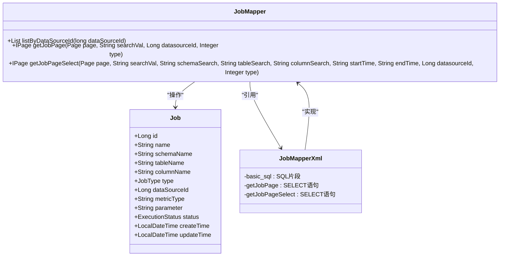

**作业映射器与数据库交互**
- [JobMapper.java](file://datavines-server\src\main\java\io\datavines\server\repository\mapper\JobMapper.java#L31-L51)
- [JobMapper.xml](file://datavines-server\src\main\resources\mapper\JobMapper.xml#L23-L66)

## 作业状态与执行管理

作业状态管理是作业服务的核心功能之一，涉及作业的执行、状态跟踪和结果处理。

### 作业执行流程
作业执行流程从`execute`方法开始，主要步骤包括：
1. 获取作业信息：通过`baseMapper.selectById`获取作业信息
2. 创建执行记录：调用`getJobExecution`方法创建`JobExecution`对象
3. 保存执行记录：调用`jobExecutionService.save`保存执行记录
4. 创建执行命令：创建`Command`对象并设置相关参数
5. 提交执行命令：调用`commandService.insert`提交命令

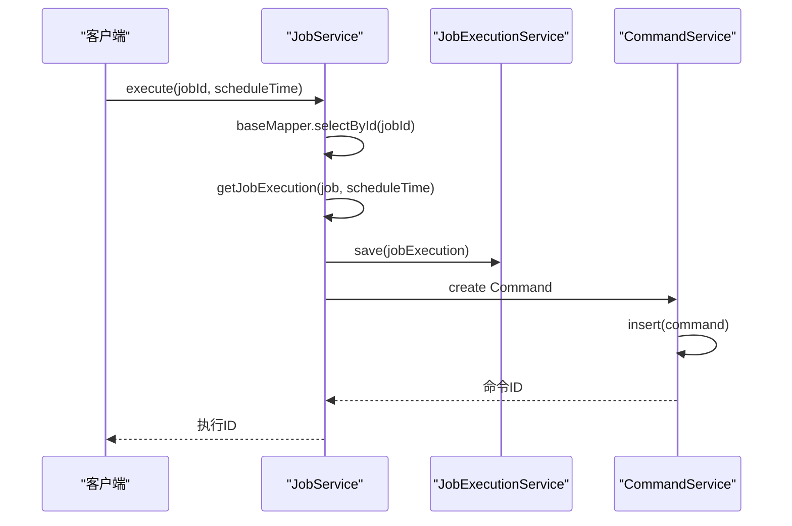

### JobExecution实体
`JobExecution`实体类定义了作业执行的详细信息，包括：

```java
@Data
@TableName("dv_job_execution")
public class JobExecution implements Serializable {
    private static final long serialVersionUID = -1L;
    
    @TableId(type= IdType.AUTO)
    private Long id;
    
    @TableField(value = "name")
    private String name;
    
    @TableField(value = "job_id")
    private Long jobId;
    
    @TableField(value = "job_type")
    private JobType jobType;
    
    @TableField(value = "schema_name")
    private String schemaName;
    
    @TableField(value = "table_name")
    private String tableName;
    
    @TableField(value = "column_name")
    private String columnName;
    
    @TableField(value = "metric_type")
    private String metricType;
    
    @TableField(value = "datasource_id")
    private Long dataSourceId;
    
    @TableField(value = "execute_platform_type")
    private String executePlatformType;
    
    @TableField(value = "execute_platform_parameter")
    private String executePlatformParameter;
    
    @TableField(value = "engine_type")
    private String engineType;
    
    @TableField(value = "engine_parameter")
    private String engineParameter;
    
    @TableField(value = "error_data_storage_type")
    private String errorDataStorageType;
    
    @TableField(value = "error_data_storage_parameter")
    private String errorDataStorageParameter;
    
    @TableField(value = "error_data_file_name")
    private String errorDataFileName;
    
    @TableField(value = "parameter")
    private String parameter;
    
    @TableField(value = "status")
    private ExecutionStatus status;
    
    @TableField(value = "retry_times")
    private Integer retryTimes;
    
    @TableField(value = "retry_interval")
    private Integer retryInterval;
    
    @TableField(value = "timeout")
    private Integer timeout;
    
    @TableField(value = "timeout_strategy")
    private TimeoutStrategy timeoutStrategy = TimeoutStrategy.WARN;
    
    @TableField(value = "pre_sql")
    private String preSql;
    
    @TableField(value = "post_sql")
    private String postSql;
    
    @TableField(value = "tenant_code")
    private String tenantCode;
    
    @TableField(value = "execute_host")
    private String executeHost;
    
    @TableField(value = "application_id")
    private String applicationId;
    
    @TableField(value = "application_tag")
    private String applicationIdTag;
    
    @TableField(value = "process_id")
    private int processId;
    
    @TableField(value = "execute_file_path")
    private String executeFilePath;
    
    @TableField(value = "log_path")
    private String logPath;
    
    @TableField(value = "env")
    private String env;
    
    @JsonFormat(pattern="yyyy-MM-dd HH:mm:ss",timezone = "GMT+8")
    @TableField(value = "submit_time")
    private LocalDateTime submitTime;
    
    @JsonFormat(pattern="yyyy-MM-dd HH:mm:ss",timezone = "GMT+8")
    @TableField(value = "schedule_time")
    private LocalDateTime scheduleTime;
    
    @JsonFormat(pattern="yyyy-MM-dd HH:mm:ss",timezone = "GMT+8")
    @TableField(value = "start_time")
    private LocalDateTime startTime;
    
    @JsonFormat(pattern="yyyy-MM-dd HH:mm:ss",timezone = "GMT+8")
    @TableField(value = "end_time")
    private LocalDateTime endTime;
    
    @JsonFormat(pattern="yyyy-MM-dd HH:mm:ss",timezone = "GMT+8")
    @TableField(value = "create_time")
    private LocalDateTime createTime;
    
    @JsonFormat(pattern="yyyy-MM-dd HH:mm:ss",timezone = "GMT+8")
    @TableField(value = "update_time")
    private LocalDateTime updateTime;
}
```

### 执行状态管理
作业执行状态通过`ExecutionStatus`枚举类定义，包括：
- `WAITING_SUMMIT`: 等待提交
- `SUBMITTED_SUCCESS`: 提交成功
- `RUNNING_EXECUTION`: 执行中
- `SUCCESS`: 成功
- `FAILURE`: 失败
- `KILLED`: 被杀死
- `TIMEOUT`: 超时

状态管理的关键方法包括：
- `executeJob`: 创建执行记录并提交执行命令
- `getJobExecution`: 构建作业执行对象
- `buildJobExecutionParameter`: 构建执行参数

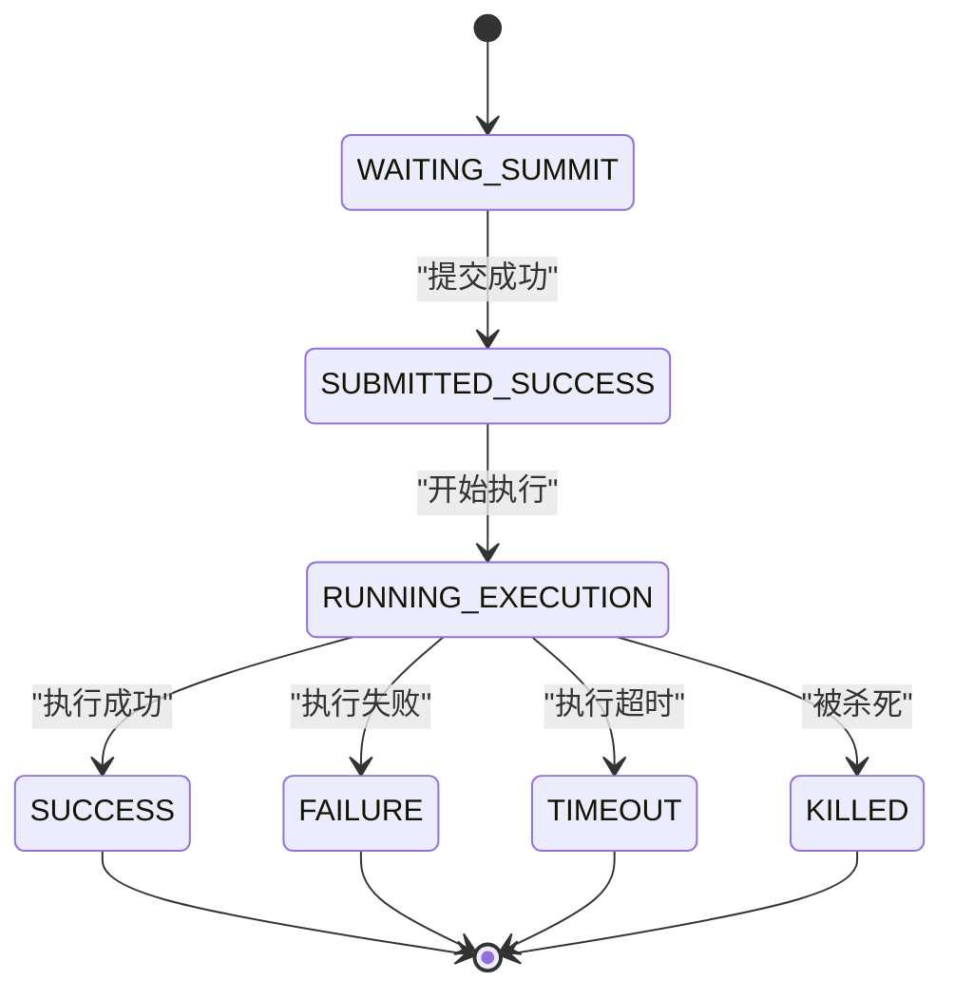

**作业状态与执行管理**
- [JobServiceImpl.java](file://datavines-server\src\main\java\io\datavines\server\repository\service\impl\JobServiceImpl.java#L503-L551)
- [JobExecution.java](file://datavines-server\src\main\java\io\datavines\server\repository\entity\JobExecution.java#L33-L161)
- [JobExecutionServiceImpl.java](file://datavines-server\src\main\java\io\datavines\server\repository\service\impl\JobExecutionServiceImpl.java#L164-L198)

## 调度系统集成

作业服务与Quartz调度系统深度集成，实现了作业的定时执行功能。

### 调度服务接口
`JobScheduleService`接口定义了调度相关的操作：

```java
public interface JobScheduleService extends IService<JobSchedule> {
    JobSchedule createOrUpdate(JobScheduleCreateOrUpdate jobScheduleCreate) throws DataVinesServerException;
    int deleteById(long id);
    int deleteBySchedule(JobSchedule jobSchedule);
    JobSchedule getById(long id);
    JobSchedule getByJobId(Long jobId);
    List<String> getCron(MapParam mapParam);
    List<String> listFutureCronRunTimes(String cronExpression);
}
```

### 调度服务实现
`JobScheduleServiceImpl`实现了调度服务接口，关键方法包括：

```java
@Service("jobScheduleService")
public class JobScheduleServiceImpl extends ServiceImpl<JobScheduleMapper, JobSchedule>  implements JobScheduleService {
    @Autowired
    private QuartzExecutors quartzExecutor;
    
    @Override
    @Transactional(rollbackFor = Exception.class)
    public JobSchedule createOrUpdate(JobScheduleCreateOrUpdate jobScheduleCreate) throws DataVinesServerException {
        // ... 实现细节
    }
    
    @Override
    @Transactional(rollbackFor = Exception.class)
    public int deleteById(long id) {
        JobSchedule jobSchedule = getById(id);
        return deleteBySchedule(jobSchedule);
    }
    
    @Override
    @Transactional(rollbackFor = Exception.class)
    public int deleteBySchedule(JobSchedule jobSchedule) {
        Job job = jobMapper.selectById(jobSchedule.getJobId());
        ScheduleJobInfo scheduleJobInfo = getScheduleJobInfo(jobSchedule, job);
        
        boolean deleteJob = quartzExecutor.deleteJob(scheduleJobInfo);
        if (!deleteJob) {
            return 0;
        }
        return baseMapper.deleteById(jobSchedule.getId());
    }
    
    @Override
    public JobSchedule getByJobId(Long jobId) {
        return baseMapper.getByJobId(jobId);
    }
}
```

### Quartz调度集成
`DataQualityScheduleJob`类实现了Quartz的`Job`接口，作为调度任务的执行器：

```java
public class DataQualityScheduleJob implements org.quartz.Job {
    @Override
    public void execute(JobExecutionContext context) throws JobExecutionException {
        JobDataMap dataMap = context.getJobDetail().getJobDataMap();
        Long jobId = dataMap.getLong("jobId");
        LocalDateTime scheduleTime = (LocalDateTime) dataMap.get("scheduleTime");
        
        JobExternalService jobExternalService = SpringApplicationContext.getBean(JobExternalService.class);
        jobExternalService.executeJob(jobId, scheduleTime);
    }
}
```

### 调度执行流程
调度执行流程如下：

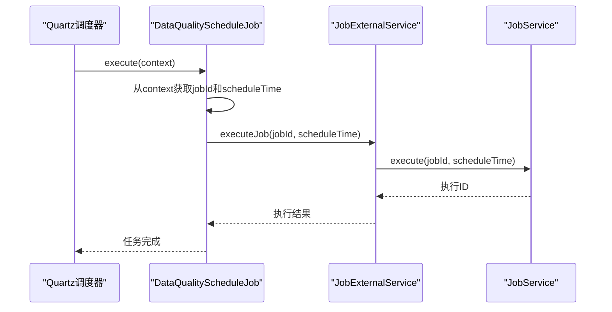

### 调度配置管理
调度配置通过`JobSchedule`实体类管理，包含以下字段：
- `jobId`: 关联的作业ID
- `cronExpression`: Cron表达式
- `startTime`: 开始时间
- `endTime`: 结束时间
- `status`: 状态（启用/禁用）
- `createBy`: 创建者
- `createTime`: 创建时间
- `updateBy`: 更新者
- `updateTime`: 更新时间

### 调度生命周期
调度的生命周期包括创建、更新、删除和执行：

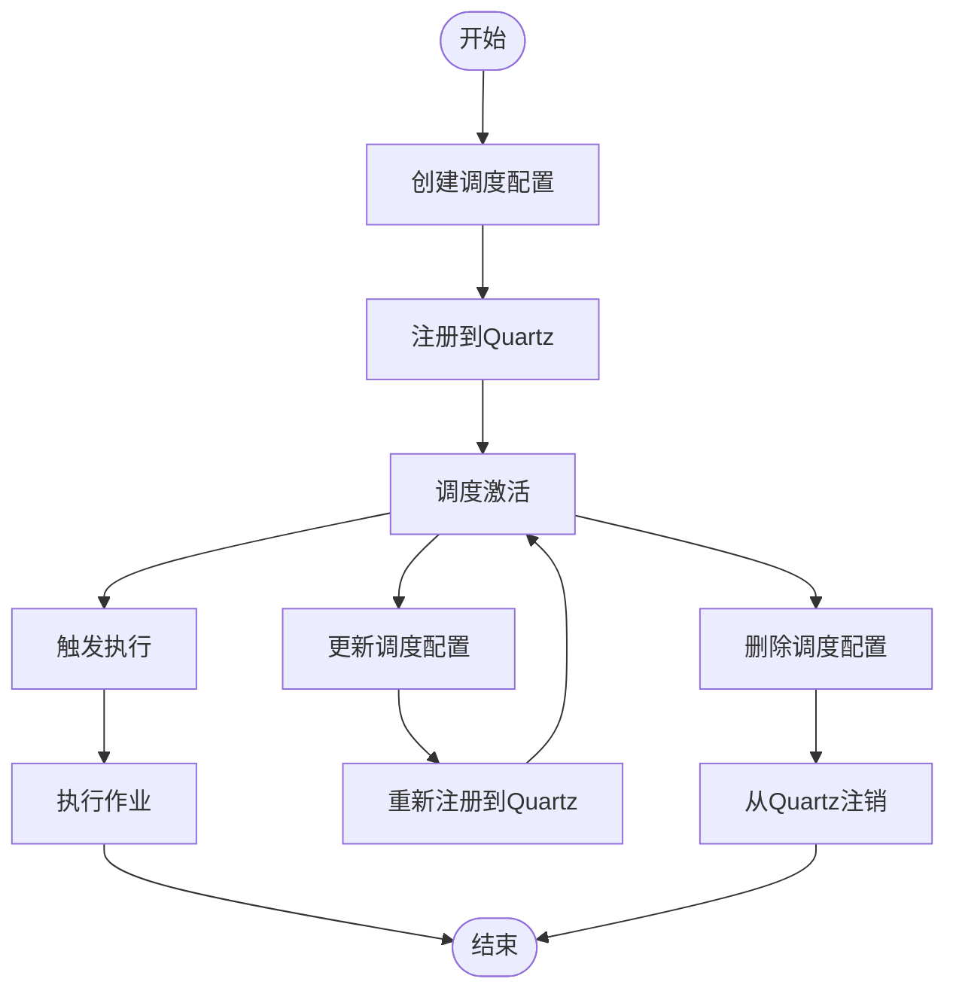

**调度系统集成**
- [JobScheduleService.java](file://datavines-server\src\main\java\io\datavines\server\repository\service\JobScheduleService.java#L28-L42)
- [JobScheduleServiceImpl.java](file://datavines-server\src\main\java\io\datavines\server\repository\service\impl\JobScheduleServiceImpl.java#L54-L205)
- [DataQualityScheduleJob.java](file://datavines-server\src\main\java\io\datavines\server\dqc\coordinator\quartz\DataQualityScheduleJob.java#L34-L36)

## 事务与异常处理

作业服务实现了完善的事务管理和异常处理机制，确保数据一致性和系统稳定性。

### 事务管理
作业服务使用Spring的声明式事务管理，通过`@Transactional`注解实现：

```java
@Service("jobService")
public class JobServiceImpl extends ServiceImpl<JobMapper, Job> implements JobService {
    
    @Override
    @Transactional(rollbackFor = Exception.class)
    public long create(JobCreate jobCreate) throws DataVinesServerException {
        // ... 事务性操作
    }
    
    @Override
    @Transactional(rollbackFor = Exception.class)
    public long update(JobUpdate jobUpdate) {
        // ... 事务性操作
    }
    
    @Override
    @Transactional(rollbackFor = Exception.class)
    public int deleteById(long id) {
        // ... 事务性操作
    }
}
```

事务管理的关键特性：
- 使用`rollbackFor = Exception.class`确保所有异常都会触发回滚
- 事务边界清晰，每个业务方法都有明确的事务范围
- 事务传播行为默认为REQUIRED，确保在已有事务中执行
- 事务隔离级别使用数据库默认级别

### 异常处理
作业服务使用自定义异常`DataVinesServerException`进行异常处理：

```java
public class DataVinesServerException extends RuntimeException {
    private Status status;
    
    public DataVinesServerException(Status status) {
        super(status.getMsg());
        this.status = status;
    }
    
    public DataVinesServerException(Status status, Object... args) {
        super(String.format(status.getMsg(), args));
        this.status = status;
    }
}
```

异常处理流程：

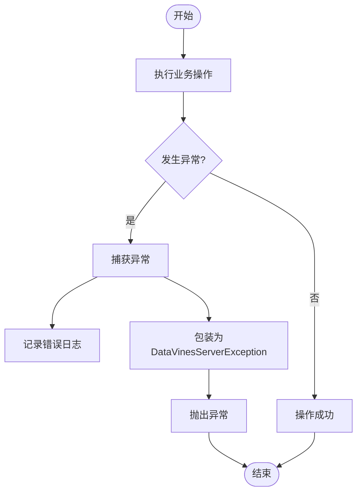

### 异常类型
系统定义了多种异常状态码，包括：
- `JOB_PARAMETER_IS_NULL_ERROR`: 作业参数为空
- `JOB_EXIST_ERROR`: 作业已存在
- `CREATE_JOB_ERROR`: 创建作业失败
- `UPDATE_JOB_ERROR`: 更新作业失败
- `JOB_NOT_EXIST_ERROR`: 作业不存在
- `DATASOURCE_NOT_SUPPORT_ERROR_DATA_OUTPUT_TO_SELF_ERROR`: 数据源不支持错误数据输出到自身
- `MULTI_TABLE_ACCURACY_NOT_SUPPORT_LOCAL_ENGINE`: 多表准确性不支持本地引擎
- `METRIC_JOB_RELATED_ENTITY_NOT_EXIST`: 度量指标相关实体不存在
- `ENTITY_TYPE_NOT_EXIST`: 实体类型不存在
- `METRIC_NOT_SUITABLE_ENTITY_TYPE`: 度量指标不适合实体类型
- `JOB_PARAMETER_CONTAIN_DUPLICATE_METRIC_ERROR`: 作业参数包含重复的度量指标

### 异常处理最佳实践
1. **尽早验证**：在方法开始时进行参数验证
2. **具体错误信息**：提供详细的错误信息和上下文
3. **日志记录**：在关键位置记录日志，便于问题排查
4. **异常转换**：将底层异常转换为业务异常
5. **资源清理**：确保在异常情况下正确清理资源
6. **用户友好**：向用户显示友好的错误信息

### 事务边界设计
事务边界设计遵循以下原则：
- 每个业务方法是一个独立的事务单元
- 避免在事务中执行耗时操作
- 减少事务范围，提高并发性能
- 避免长事务，防止数据库锁竞争
- 在事务外处理异步操作

### 事务传播行为
系统主要使用以下事务传播行为：
- `REQUIRED`: 如果存在事务则加入，否则创建新事务（默认）
- `REQUIRES_NEW`: 总是创建新事务，挂起当前事务
- `SUPPORTS`: 如果存在事务则加入，否则以非事务方式执行
- `NOT_SUPPORTED`: 以非事务方式执行，挂起当前事务
- `MANDATORY`: 必须在事务中执行，否则抛出异常
- `NEVER`: 必须在非事务中执行，否则抛出异常
- `NESTED`: 如果存在事务则嵌套执行，否则创建新事务

### 事务隔离级别
系统使用数据库默认的事务隔离级别，通常为：
- MySQL: REPEATABLE READ
- PostgreSQL: READ COMMITTED
- Oracle: READ COMMITTED
- SQL Server: READ COMMITTED

### 死锁预防
为预防死锁，系统采取以下措施：
- 按固定顺序访问资源
- 减少事务持有锁的时间
- 使用适当的索引减少锁的范围
- 设置合理的超时时间
- 监控和分析死锁日志

### 事务监控
系统提供事务监控功能，包括：
- 事务执行时间监控
- 事务回滚率监控
- 长事务监控
- 死锁监控
- 锁等待监控

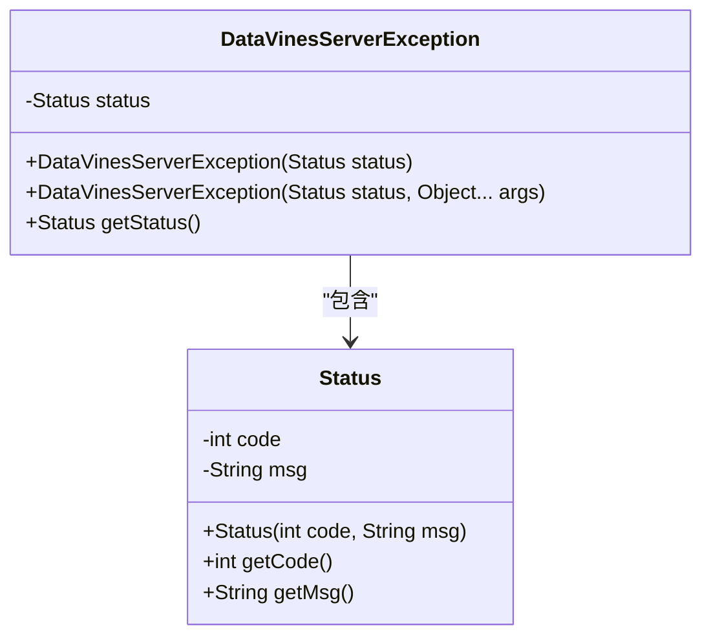

**事务与异常处理**
- [JobServiceImpl.java](file://datavines-server\src\main\java\io\datavines\server\repository\service\impl\JobServiceImpl.java#L129-L130)
- [DataVinesServerException.java](file://datavines-core\src\main\java\io\datavines\core\exception\DataVinesServerException.java)
- [Status.java](file://datavines-core\src\main\java\io\datavines\core\enums\Status.java)

## 性能优化与最佳实践

作业服务在设计和实现中考虑了多种性能优化策略和最佳实践。

### 分页查询优化
分页查询是提高性能的关键，系统采用以下优化策略：

```java
@Override
public IPage<JobVO> getJobPage(String searchVal, String schemaSearch, String tableSearch, String columnSearch, String startTime, String endTime, Long dataSourceId, Integer type, Integer pageNumber, Integer pageSize) {
    Page<JobVO> page = new Page<>(pageNumber, pageSize);
    IPage<JobVO> jobs = baseMapper.getJobPageSelect(page, searchVal, schemaSearch, tableSearch, columnSearch, startTime, endTime, dataSourceId, type);
    // ... 处理结果
    return jobs;
}
```

优化策略包括：
- 使用MyBatis Plus的分页插件
- 在数据库层面进行分页，避免全表扫描
- 合理设置分页大小，避免一次性加载过多数据
- 使用索引优化查询性能

### 批量操作
系统支持批量操作，提高处理效率：

```java
@Override
@Transactional(rollbackFor = Exception.class)
public int deleteByDataSourceId(long dataSourceId) {
    List<Job> jobList = listByDataSourceId(dataSourceId);
    if (CollectionUtils.isEmpty(jobList)) {
        return 0;
    }
    
    jobList.forEach(job -> {
        deleteById(job.getId());
        jobExecutionService.deleteByJobId(job.getId());
    });
    
    return 1;
}
```

批量操作最佳实践：
- 使用事务确保批量操作的原子性
- 分批处理大数据集，避免内存溢出
- 监控批量操作的执行时间
- 提供进度反馈

### 缓存使用
系统在适当位置使用缓存提高性能：

```java
private boolean getByKeyAttribute(Job job) {
    List<Job> list = baseMapper.selectList(new QueryWrapper<Job>().lambda()
            .eq(Job::getName,job.getName())
            .eq(Job::getSchemaName,job.getSchemaName())
            .eq(Job::getTableName,job.getTableName())
            .eq(Job::getDataSourceId,job.getDataSourceId())
            .eq(job.getDataSourceId2() != 0, Job::getDataSourceId2, job.getDataSourceId2())
            .eq(StringUtils.isNotEmpty(job.getColumnName()), Job::getColumnName,job.getColumnName())
    );
    return CollectionUtils.isNotEmpty(list);
}
```

缓存策略：
- 使用数据库查询缓存
- 在应用层面实现热点数据缓存
- 设置合理的缓存过期时间
- 缓存穿透、雪崩、击穿的防护

### SQL优化
SQL查询经过精心优化：

```xml
<select id="getJobPageSelect" resultType="io.datavines.server.api.dto.vo.JobVO">
    select p.id, p.name, p.schema_name ,p.table_name,p.column_name, p.type, u.username as updater, p.update_time, s.cron_expression
    from (<include refid="basic_sql"/>) p left join `dv_user` u on u.id = p.update_by
    left join `dv_job_schedule` s on p.id = s.job_id and s.status = 1
    <where>
        <if test="searchVal != null and searchVal != ''">
            AND LOWER(p.`name`) LIKE CONCAT(CONCAT('%', LOWER(#{searchVal})), '%')
        </if>
        <if test="schemaSearch != null and schemaSearch != ''">
            AND LOWER(p.schema_name) LIKE CONCAT(CONCAT('%', LOWER(#{schemaSearch})), '%')
        </if>
        <if test="tableSearch != null and tableSearch != ''">
            AND LOWER(p.table_name) LIKE CONCAT(CONCAT('%', LOWER(#{tableSearch})), '%')
        </if>
        <if test="columnSearch != null and columnSearch != ''">
            AND LOWER(p.column_name) LIKE CONCAT(CONCAT('%', LOWER(#{columnSearch})), '%')
        </if>
        <if test="startTime != null and startTime != ''">
            AND p.update_time &gt;= #{startTime}
        </if>
        <if test="endTime != null and endTime != ''">
            AND p.update_time &lt;= #{endTime}
        </if>
    </where>
    order by p.update_time desc
</select>
```

SQL优化策略：
- 使用索引字段进行查询
- 避免SELECT *
- 使用连接查询减少数据库访问次数
- 优化WHERE条件顺序
- 使用EXPLAIN分析执行计划

### 并发控制
系统考虑了并发控制：

```java
@Override
@Transactional(rollbackFor = Exception.class)
public long create(JobCreate jobCreate) throws DataVinesServerException {
    // ... 业务逻辑
    if (getByKeyAttribute(job)) {
        throw new DataVinesServerException(Status.JOB_EXIST_ERROR, job.getName());
    }
    // ... 保存作业
}
```

并发控制策略：
- 使用数据库唯一约束
- 乐观锁或悲观锁
- 分布式锁
- 限流和降级

### 性能监控
系统提供性能监控功能：

```java
@Override
public JobExecutionStat getJobExecutionStat(Long jobId) {
    return baseMapper.getJobExecutionStat(jobId);
}
```

性能监控指标：
- 方法执行时间
- 数据库查询时间
- 内存使用情况
- 线程状态
- GC情况

### 最佳实践
1. **合理使用索引**：为常用查询字段创建索引
2. **避免N+1查询**：使用JOIN或批量查询
3. **连接池配置**：合理设置连接池大小
4. **JVM调优**：根据应用特点调整JVM参数
5. **异步处理**：将耗时操作异步化
6. **资源释放**：及时释放数据库连接等资源
7. **代码优化**：避免循环中的数据库访问
8. **缓存策略**：合理使用缓存，避免缓存雪崩

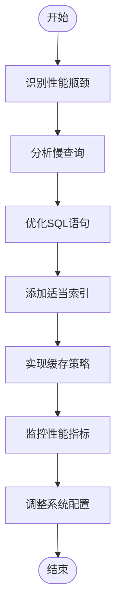

**性能优化与最佳实践**
- [JobServiceImpl.java](file://datavines-server\src\main\java\io\datavines\server\repository\service\impl\JobServiceImpl.java#L475-L499)
- [JobMapper.xml](file://datavines-server\src\main\resources\mapper\JobMapper.xml#L39-L66)

## 服务协作关系

作业服务与其他服务紧密协作，共同完成复杂的业务功能。

### 服务依赖关系
作业服务依赖以下服务：

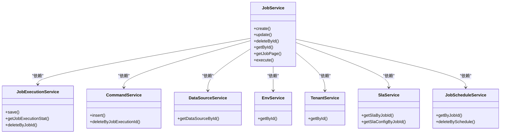

### 协作流程
作业创建时的服务协作流程：

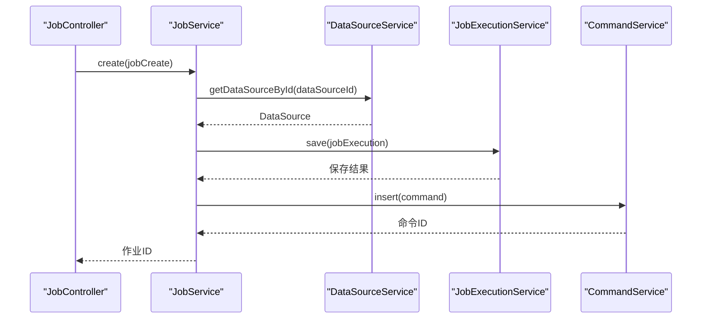

### 作业执行协作
作业执行时的服务协作：

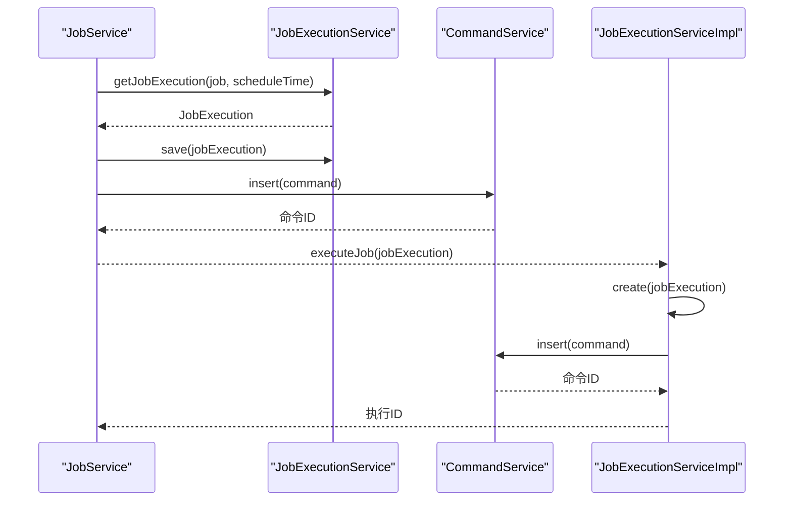

### 调度协作
调度服务与其他服务的协作：

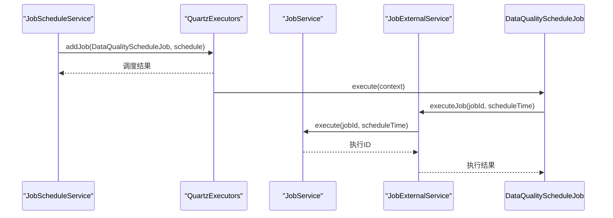

### SLA协作
SLA服务与作业服务的协作：

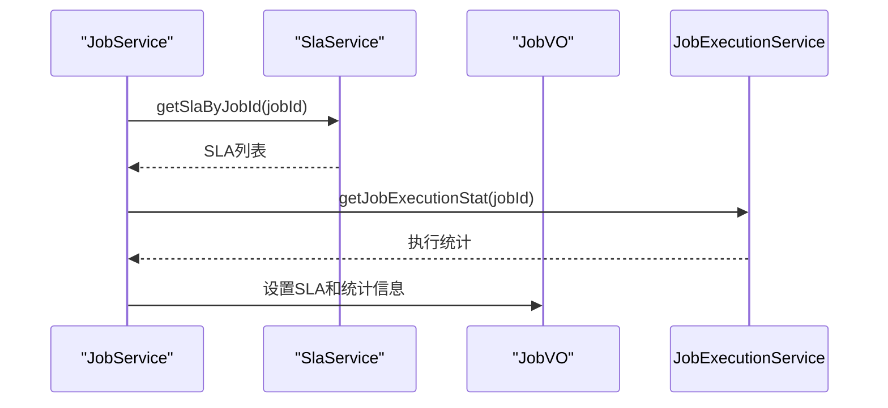

### 数据源协作
作业服务与数据源服务的协作：

```mermaid
sequenceDiagram
participant JobService as "JobService"
participant DataSourceService as "DataSourceService"
participant ConnectorFactory as "ConnectorFactory"
JobService->>DataSourceService : getDataSourceById(dataSourceId)
DataSourceService-->>JobService : DataSource
JobService->>ConnectorFactory : getOrCreatePlugin(dataSourceType)
ConnectorFactory-->>JobService : ConnectorFactory
JobService->>ConnectorFactory.getDialect() : invalidateItemCanOutputToSelf()
```

### 服务协作最佳实践
1. **松耦合**：通过接口定义服务契约
2. **高内聚**：每个服务职责单一
3. **异步通信**：使用消息队列解耦服务
4. **超时控制**：设置合理的服务调用超时
5. **重试机制**：实现服务调用的重试逻辑
6. **熔断降级**：防止服务雪崩
7. **监控告警**：监控服务调用性能
8. **文档化**：维护服务接口文档

**服务协作关系**
- [JobServiceImpl.java](file://datavines-server\src\main\java\io\datavines\server\repository\service\impl\JobServiceImpl.java#L92-L127)
- [JobScheduleServiceImpl.java](file://datavines-server\src\main\java\io\datavines\server\repository\service\impl\JobScheduleServiceImpl.java#L57-L58)
- [JobExecutionServiceImpl.java](file://datavines-server\src\main\java\io\datavines\server\repository\service\impl\JobExecutionServiceImpl.java#L68-L75)