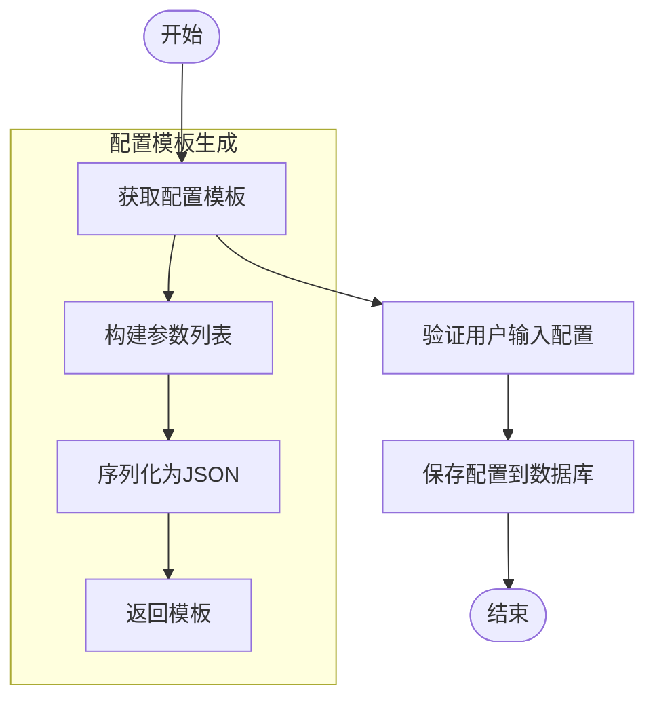
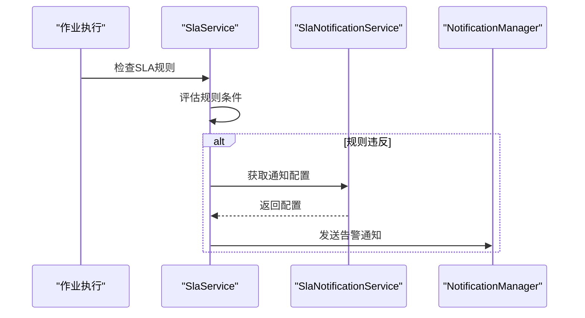
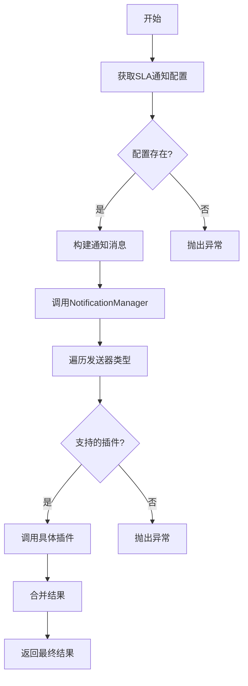
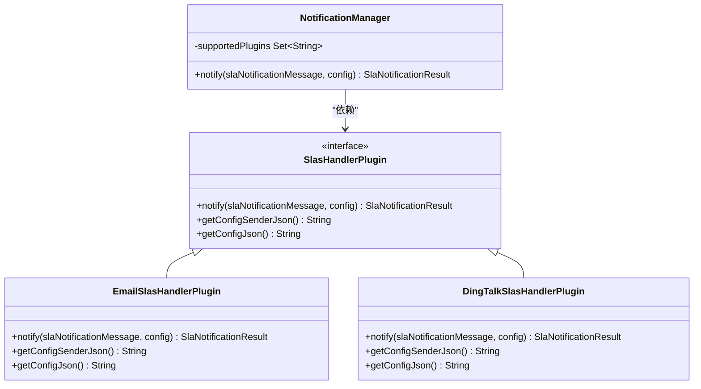
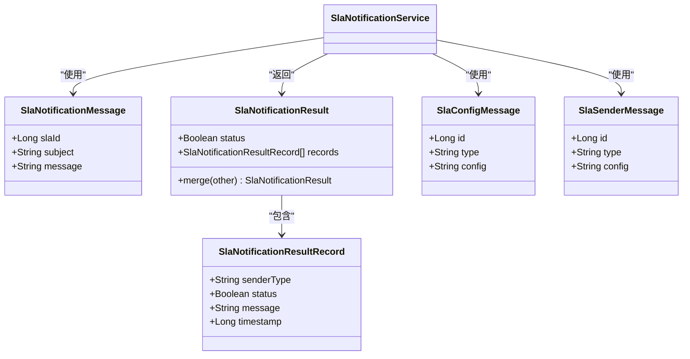
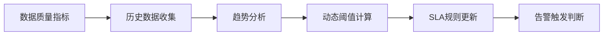
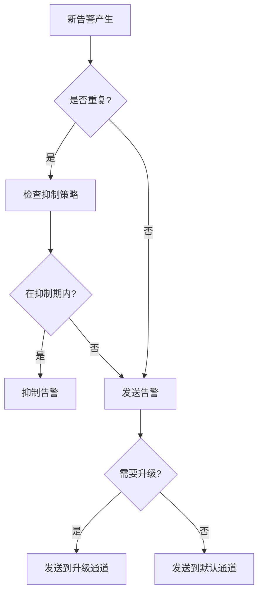
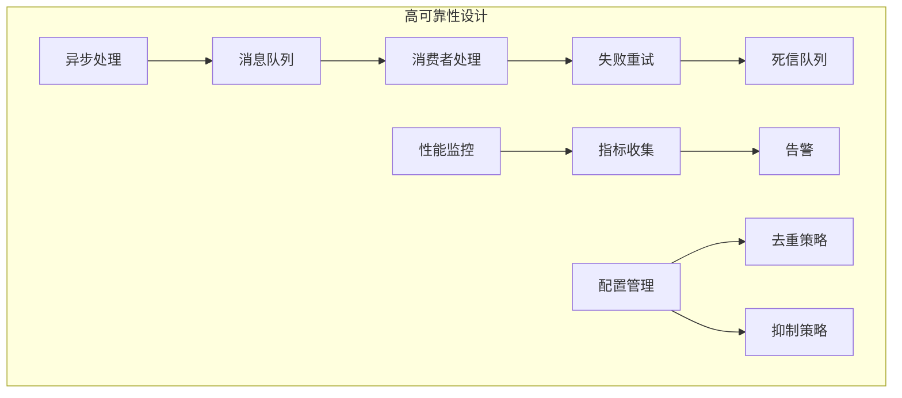

# 告警服务实现

<cite>
**本文档引用的文件**  
- [SlaService.java](file://datavines-server\src\main\java\io\datavines\server\repository\service\SlaService.java)
- [SlaNotificationService.java](file://datavines-server\src\main\java\io\datavines\server\repository\service\SlaNotificationService.java)
- [NotificationManager.java](file://datavines-notification\datavines-notification-core\src\main\java\io\datavines\notification\core\NotificationManager.java)
- [SlasHandlerPlugin.java](file://datavines-notification\datavines-notification-api\src\main\java\io\datavines\notification\api\spi\SlasHandlerPlugin.java)
- [SlaNotificationMessage.java](file://datavines-notification\datavines-notification-api\src\main\java\io\datavines\notification\api\entity\SlaNotificationMessage.java)
- [SlaConfigMessage.java](file://datavines-notification\datavines-notification-api\src\main\java\io\datavines\notification\api\entity\SlaConfigMessage.java)
- [SlaNotificationResult.java](file://datavines-notification\datavines-notification-api\src\main\java\io\datavines\notification\api\entity\SlaNotificationResult.java)
- [EmailSlasHandlerPlugin.java](file://datavines-notification\datavines-notification-plugins\datavines-notification-plugin-email\src\main\java\io\datavines\notification\plugin\email\EmailSlasHandlerPlugin.java)
- [DingTalkSlasHandlerPlugin.java](file://datavines-notification\datavines-notification-plugins\datavines-notification-plugin-dingtalk\src\main\java\io\datavines\notification\plugin\dingtalk\DingTalkSlasHandlerPlugin.java)
</cite>

## 目录
1. [引言](#引言)
2. [SLA服务核心组件](#sla服务核心组件)
3. [SLA规则配置与验证机制](#sla规则配置与验证机制)
4. [告警条件判断与触发流程](#告警条件判断与触发流程)
5. [通知策略执行机制](#通知策略执行机制)
6. [多通道告警发送实现](#多通道告警发送实现)
7. [告警历史记录与状态管理](#告警历史记录与状态管理)
8. [动态阈值计算逻辑](#动态阈值计算逻辑)
9. [告警去重、抑制与升级策略](#告警去重抑制与升级策略)
10. [高可靠性告警系统最佳实践](#高可靠性告警系统最佳实践)

## 引言
本文档详细阐述了DataVines平台中SlaService和SlaNotificationService服务的实现机制。重点解析SLA（服务等级协议）规则的配置、验证和触发流程，深入分析告警条件判断、通知策略执行和告警历史记录的完整生命周期。文档还详细说明了服务层如何通过NotificationManager实现钉钉、邮件等多通道告警发送，以及SLA规则与作业、数据质量指标的关联关系。

## SLA服务核心组件

SlaService和SlaNotificationService是DataVines平台中负责SLA规则管理和告警通知的核心服务组件。SlaService主要负责SLA规则的增删改查、支持的插件类型查询以及与作业的关联查询。SlaNotificationService则专注于告警通知的配置管理、接收方信息获取和通知记录的分页查询。

```mermaid
classDiagram
class SlaService {
+listSlas(workspaceId, searchVal, pageNumber, pageSize) IPage~SlaPageVO~
+deleteById(id) boolean
+getSenderConfigJson(type) String
+getSupportPlugin() Set~String~
+createSla(create) Sla
+updateSla(update) boolean
+getSlaByJobId(jobId) SlaVO[]
+getSlaConfigByJobId(jobId) SlaConfigVO[]
}
class SlaNotificationService {
+getSlasNotificationConfigurationBySlasId(slaId) Map~SlaSenderMessage, Set~SlaConfigMessage~~
+getSlasNotificationConfigurationBySlasIdAndSenderId(slaId, senderId, config) Map~SlaSenderMessage, Set~SlaConfigMessage~~
+getSlasNotificationConfigurationByJobId(job) Map~SlaSenderMessage, Set~SlaConfigMessage~~
+getConfigJson(type) String
+createNotification(create) SlaNotification
+updateNotification(update) SlaNotification
+pageListNotification(workspaceId, slaId, searchVal, pageNumber, pageSize) IPage~SlaNotification~
+listReceiverMessageBySlaId(id) Set~SlaConfigMessage~
+pageListNotification(page, workspaceId, slaId, searchVal) IPage~SlaNotification~
}
SlaService --> SlaNotificationService : "依赖"
```

**图示来源**
- [SlaService.java](file://datavines-server\src\main\java\io\datavines\server\repository\service\SlaService.java)
- [SlaNotificationService.java](file://datavines-server\src\main\java\io\datavines\server\repository\service\SlaNotificationService.java)

**本节来源**
- [SlaService.java](file://datavines-server\src\main\java\io\datavines\server\repository\service\SlaService.java)
- [SlaNotificationService.java](file://datavines-server\src\main\java\io\datavines\server\repository\service\SlaNotificationService.java)

## SLA规则配置与验证机制

SLA规则的配置通过SlaService提供的接口进行管理，支持对不同通知通道的配置信息进行获取和验证。系统通过`getSenderConfigJson`方法获取指定类型通知发送器的JSON配置模板，该模板定义了配置项的结构、验证规则和默认值。

**图示来源**
- [EmailSlasHandlerPlugin.java](file://datavines-notification\datavines-notification-plugins\datavines-notification-plugin-email\src\main\java\io\datavines\notification\plugin\email\EmailSlasHandlerPlugin.java)
- [DingTalkSlasHandlerPlugin.java](file://datavines-notification\datavines-notification-plugins\datavines-notification-plugin-dingtalk\src\main\java\io\datavines\notification\plugin\dingtalk\DingTalkSlasHandlerPlugin.java)

**本节来源**
- [SlaService.java](file://datavines-server\src\main\java\io\datavines\server\repository\service\SlaService.java)
- [EmailSlasHandlerPlugin.java](file://datavines-notification\datavines-notification-plugins\datavines-notification-plugin-email\src\main\java\io\datavines\notification\plugin\email\EmailSlasHandlerPlugin.java)

## 告警条件判断与触发流程

告警的触发流程始于SLA规则的评估结果。当数据质量检查结果违反预设的SLA阈值时，系统会创建告警通知消息并触发通知流程。SlaNotificationService负责根据SLA规则ID获取相应的通知配置，包括发送器和接收方信息。

**图示来源**
- [SlaService.java](file://datavines-server\src\main\java\io\datavines\server\repository\service\SlaService.java)
- [SlaNotificationService.java](file://datavines-server\src\main\java\io\datavines\server\repository\service\SlaNotificationService.java)

**本节来源**
- [SlaService.java](file://datavines-server\src\main\java\io\datavines\server\repository\service\SlaService.java)
- [SlaNotificationService.java](file://datavines-server\src\main\java\io\datavines\server\repository\service\SlaNotificationService.java)

## 通知策略执行机制

通知策略的执行由SlaNotificationService和NotificationManager协同完成。SlaNotificationService首先根据SLA规则获取完整的通知配置，然后由NotificationManager统一调度具体的告警发送插件。

**图示来源**
- [NotificationManager.java](file://datavines-notification\datavines-notification-core\src\main\java\io\datavines\notification\core\NotificationManager.java)
- [SlaNotificationService.java](file://datavines-server\src\main\java\io\datavines\server\repository\service\SlaNotificationService.java)

**本节来源**
- [NotificationManager.java](file://datavines-notification\datavines-notification-core\src\main\java\io\datavines\notification\core\NotificationManager.java)
- [SlaNotificationService.java](file://datavines-server\src\main\java\io\datavines\server\repository\service\SlaNotificationService.java)

## 多通道告警发送实现

多通道告警发送基于SPI（Service Provider Interface）插件机制实现。系统通过NotificationManager统一管理所有支持的告警通道插件，如钉钉、邮件、飞书和企业微信机器人。每个通道通过实现SlasHandlerPlugin接口提供具体的发送逻辑。

**图示来源**
- [NotificationManager.java](file://datavines-notification\datavines-notification-core\src\main\java\io\datavines\notification\core\NotificationManager.java)
- [SlasHandlerPlugin.java](file://datavines-notification\datavines-notification-api\src\main\java\io\datavines\notification\api\spi\SlasHandlerPlugin.java)
- [EmailSlasHandlerPlugin.java](file://datavines-notification\datavines-notification-plugins\datavines-notification-plugin-email\src\main\java\io\datavines\notification\plugin\email\EmailSlasHandlerPlugin.java)
- [DingTalkSlasHandlerPlugin.java](file://datavines-notification\datavines-notification-plugins\datavines-notification-plugin-dingtalk\src\main\java\io\datavines\notification\plugin\dingtalk\DingTalkSlasHandlerPlugin.java)

**本节来源**
- [NotificationManager.java](file://datavines-notification\datavines-notification-core\src\main\java\io\datavines\notification\core\NotificationManager.java)
- [SlasHandlerPlugin.java](file://datavines-notification\datavines-notification-api\src\main\java\io\datavines\notification\api\spi\SlasHandlerPlugin.java)

## 告警历史记录与状态管理

系统通过SlaNotificationService提供告警历史记录的管理和查询功能。每次告警发送的结果都会被记录，包括发送状态、时间戳和详细信息。这些记录可用于后续的审计、分析和故障排查。

**图示来源**
- [SlaNotificationMessage.java](file://datavines-notification\datavines-notification-api\src\main\java\io\datavines\notification\api\entity\SlaNotificationMessage.java)
- [SlaNotificationResult.java](file://datavines-notification\datavines-notification-api\src\main\java\io\datavines\notification\api\entity\SlaNotificationResult.java)
- [SlaConfigMessage.java](file://datavines-notification\datavines-notification-api\src\main\java\io\datavines\notification\api\entity\SlaConfigMessage.java)

**本节来源**
- [SlaNotificationMessage.java](file://datavines-notification\datavines-notification-api\src\main\java\io\datavines\notification\api\entity\SlaNotificationMessage.java)
- [SlaNotificationResult.java](file://datavines-notification\datavines-notification-api\src\main\java\io\datavines\notification\api\entity\SlaNotificationResult.java)

## 动态阈值计算逻辑

虽然当前文档未直接展示动态阈值计算的具体实现，但系统架构支持通过数据质量指标的历史数据进行动态阈值计算。SLA规则可以关联特定的数据质量指标，系统可以根据指标的历史表现自动调整告警阈值，提高告警的准确性和适应性。

**本节来源**
- [SlaService.java](file://datavines-server\src\main\java\io\datavines\server\repository\service\SlaService.java)
- [SlaNotificationService.java](file://datavines-server\src\main\java\io\datavines\server\repository\service\SlaNotificationService.java)

## 告警去重、抑制与升级策略

系统通过告警历史记录和状态管理机制实现基本的告警去重和抑制功能。当相同类型的告警在短时间内重复发生时，系统可以根据配置策略决定是否合并或抑制告警通知。升级策略则通过配置多个接收方和不同的通知通道来实现。

**本节来源**
- [SlaNotificationService.java](file://datavines-server\src\main\java\io\datavines\server\repository\service\SlaNotificationService.java)
- [NotificationManager.java](file://datavines-notification\datavines-notification-core\src\main\java\io\datavines\notification\core\NotificationManager.java)

## 高可靠性告警系统最佳实践

为确保告警系统的高可靠性，建议采用以下最佳实践：集成消息队列实现异步告警发送，避免阻塞主业务流程；实现失败重试机制，确保重要告警不会丢失；通过性能监控及时发现和解决系统瓶颈；合理配置告警去重和抑制策略，避免告警风暴。

**本节来源**
- [NotificationManager.java](file://datavines-notification\datavines-notification-core\src\main\java\io\datavines\notification\core\NotificationManager.java)
- [SlaNotificationService.java](file://datavines-server\src\main\java\io\datavines\server\repository\service\SlaNotificationService.java)