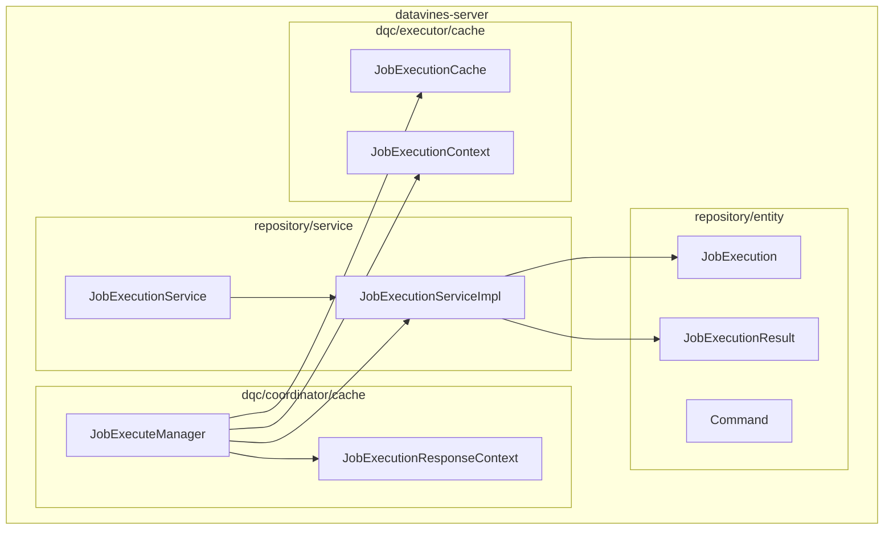
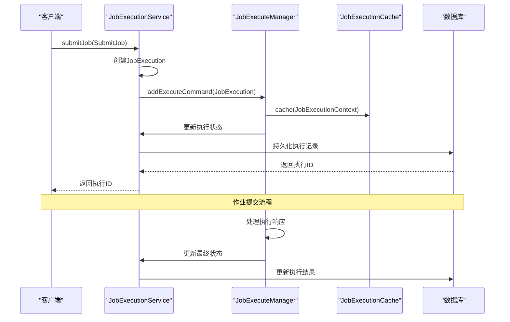
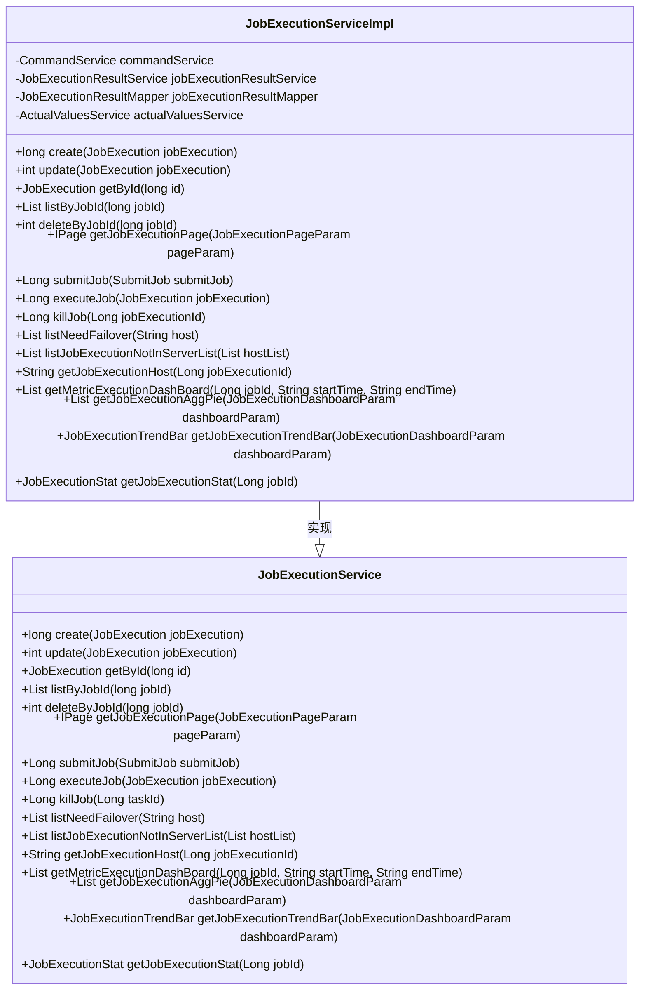
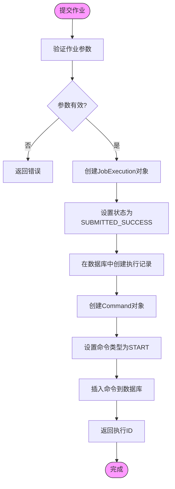
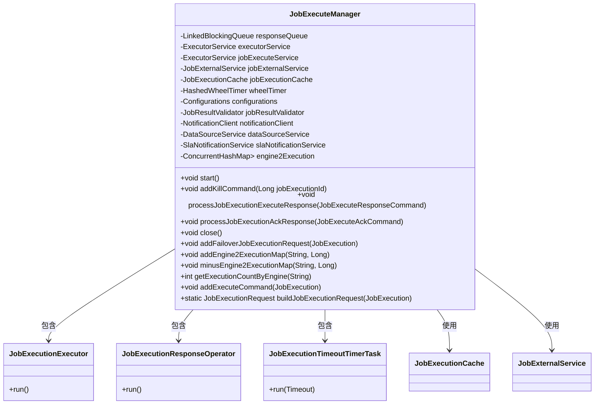
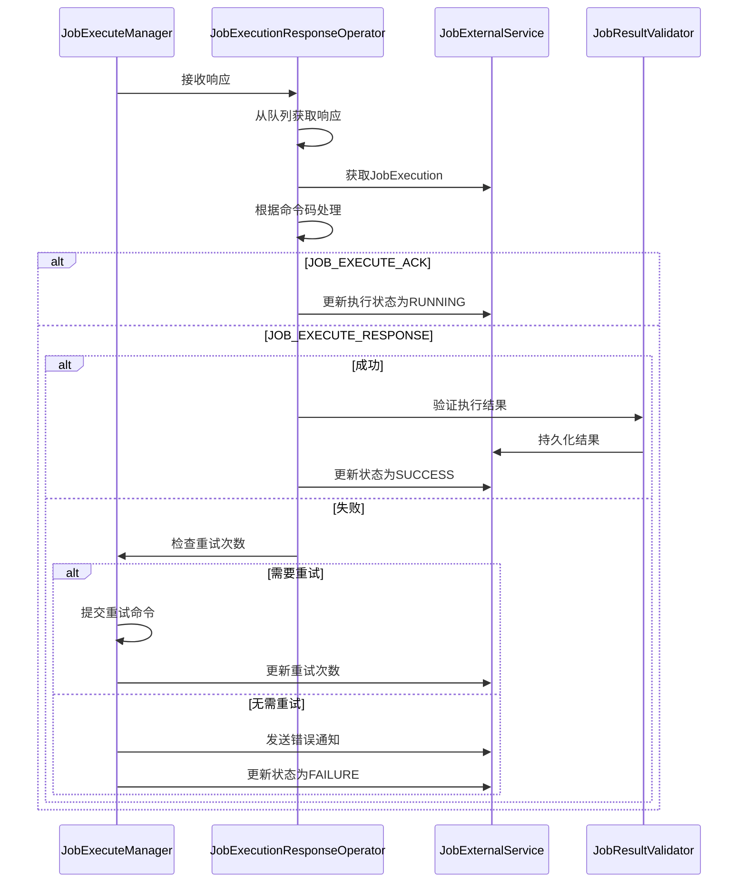
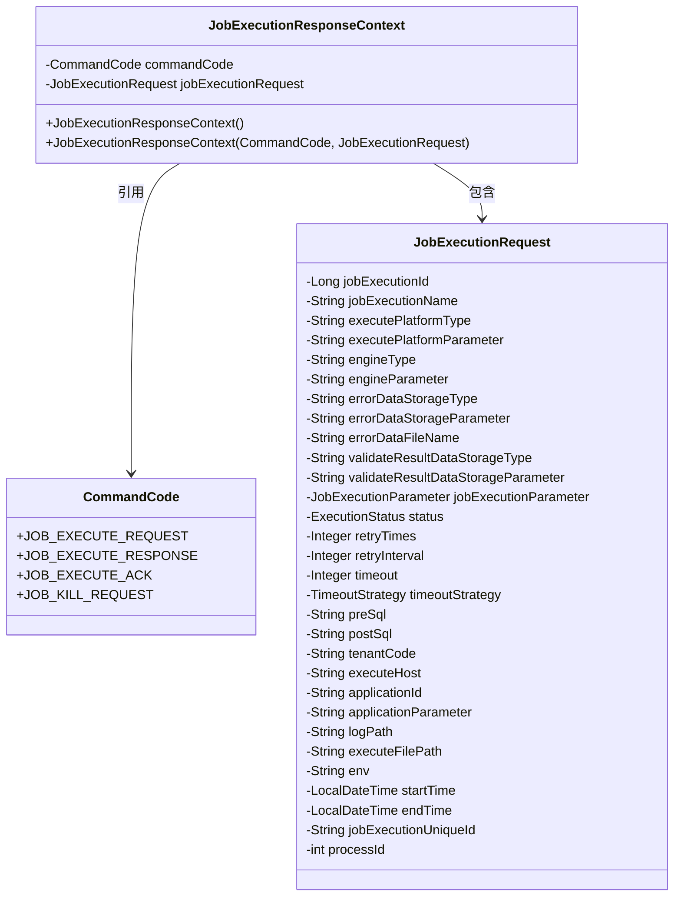
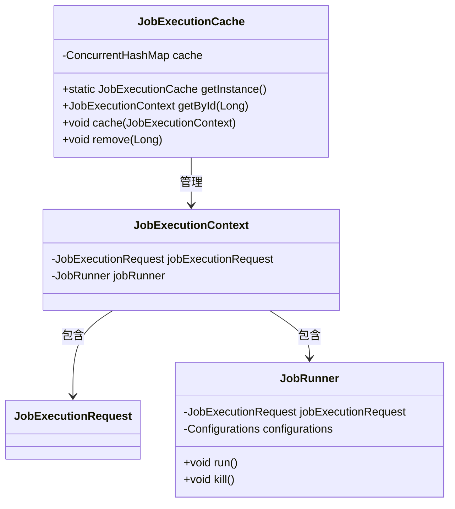
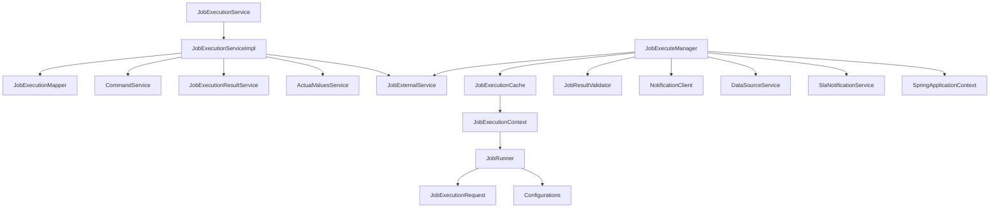

# 执行服务实现

<cite>
**本文档引用的文件**
- [JobExecutionService.java](file://datavines-server\src\main\java\io\datavines\server\repository\service\JobExecutionService.java)
- [JobExecutionServiceImpl.java](file://datavines-server\src\main\java\io\datavines\server\repository\service\impl\JobExecutionServiceImpl.java)
- [JobExecuteManager.java](file://datavines-server\src\main\java\io\datavines\server\dqc\coordinator\cache\JobExecuteManager.java)
- [JobExecutionResponseContext.java](file://datavines-server\src\main\java\io\datavines\server\dqc\coordinator\cache\JobExecutionResponseContext.java)
- [JobExecution.java](file://datavines-server\src\main\java\io\datavines\server\repository\entity\JobExecution.java)
- [JobExecutionResult.java](file://datavines-server\src\main\java\io\datavines\server\repository\entity\JobExecutionResult.java)
- [Command.java](file://datavines-server\src\main\java\io\datavines\server\repository\entity\Command.java)
- [JobExecutionCache.java](file://datavines-server\src\main\java\io\datavines\server\dqc\executor\cache\JobExecutionCache.java)
- [JobExecutionContext.java](file://datavines-server\src\main\java\io\datavines\server\dqc\executor\cache\JobExecutionContext.java)
</cite>

## 目录
1. [简介](#简介)
2. [项目结构](#项目结构)
3. [核心组件](#核心组件)
4. [架构概述](#架构概述)
5. [详细组件分析](#详细组件分析)
6. [依赖分析](#依赖分析)
7. [性能考虑](#性能考虑)
8. [故障排除指南](#故障排除指南)
9. [结论](#结论)

## 简介
本文档详细描述了DataVines平台中JobExecutionService服务的实现，重点阐述作业执行实例的管理功能。该服务负责执行记录的生成、状态更新、日志查询和结果分析，与JobExecuteManager协同工作处理来自执行引擎的实时响应。文档还解释了执行结果的持久化策略，以及执行上下文（JobExecutionResponseContext）在状态跟踪中的作用。此外，文档说明了执行历史数据的分页查询、趋势分析和性能监控实现，并提供了大规模执行实例管理的优化方案。

## 项目结构
DataVines项目的执行服务主要位于`datavines-server`模块中，涉及多个子包和组件。核心的执行服务实现位于`repository/service`包中，而执行协调和缓存管理则位于`dqc/coordinator/cache`包中。执行相关的实体类定义在`repository/entity`包中，而执行上下文和缓存机制则在`dqc/executor/cache`包中实现。

**图源**
- [JobExecutionService.java](file://datavines-server\src\main\java\io\datavines\server\repository\service\JobExecutionService.java)
- [JobExecutionServiceImpl.java](file://datavines-server\src\main\java\io\datavines\server\repository\service\impl\JobExecutionServiceImpl.java)
- [JobExecuteManager.java](file://datavines-server\src\main\java\io\datavines\server\dqc\coordinator\cache\JobExecuteManager.java)
- [JobExecutionResponseContext.java](file://datavines-server\src\main\java\io\datavines\server\dqc\coordinator\cache\JobExecutionResponseContext.java)
- [JobExecution.java](file://datavines-server\src\main\java\io\datavines\server\repository\entity\JobExecution.java)
- [JobExecutionResult.java](file://datavines-server\src\main\java\io\datavines\server\repository\entity\JobExecutionResult.java)
- [Command.java](file://datavines-server\src\main\java\io\datavines\server\repository\entity\Command.java)
- [JobExecutionCache.java](file://datavines-server\src\main\java\io\datavines\server\dqc\executor\cache\JobExecutionCache.java)
- [JobExecutionContext.java](file://datavines-server\src\main\java\io\datavines\server\dqc\executor\cache\JobExecutionContext.java)

**章节源**
- [JobExecutionService.java](file://datavines-server\src\main\java\io\datavines\server\repository\service\JobExecutionService.java)
- [JobExecutionServiceImpl.java](file://datavines-server\src\main\java\io\datavines\server\repository\service\impl\JobExecutionServiceImpl.java)
- [JobExecuteManager.java](file://datavines-server\src\main\java\io\datavines\server\dqc\coordinator\cache\JobExecuteManager.java)

## 核心组件
JobExecutionService是DataVines平台中负责管理作业执行实例的核心服务。它提供了创建、更新、查询和删除作业执行记录的功能，同时支持执行结果的持久化和状态跟踪。该服务与JobExecuteManager紧密协作，处理来自执行引擎的实时响应，并通过JobExecutionResponseContext对象在系统组件间传递执行状态信息。

**章节源**
- [JobExecutionService.java](file://datavines-server\src\main\java\io\datavines\server\repository\service\JobExecutionService.java)
- [JobExecutionServiceImpl.java](file://datavines-server\src\main\java\io\datavines\server\repository\service\impl\JobExecutionServiceImpl.java)

## 架构概述
JobExecutionService的架构设计采用了分层模式，将业务逻辑、数据访问和执行协调分离。服务层负责处理业务逻辑，通过JobExecuteManager协调作业执行过程，并将执行结果持久化到数据库中。执行上下文通过JobExecutionCache进行管理，确保执行状态的一致性和可追溯性。

**图源**
- [JobExecutionService.java](file://datavines-server\src\main\java\io\datavines\server\repository\service\JobExecutionService.java)
- [JobExecuteManager.java](file://datavines-server\src\main\java\io\datavines\server\dqc\coordinator\cache\JobExecuteManager.java)
- [JobExecutionCache.java](file://datavines-server\src\main\java\io\datavines\server\dqc\executor\cache\JobExecutionCache.java)

## 详细组件分析

### JobExecutionService分析
JobExecutionService接口定义了作业执行管理的核心功能，包括创建、更新、查询作业执行记录，以及提交和执行作业。其实现类JobExecutionServiceImpl通过MyBatis Plus框架与数据库交互，实现了这些功能。

#### 服务接口分析

**图源**
- [JobExecutionService.java](file://datavines-server\src\main\java\io\datavines\server\repository\service\JobExecutionService.java)
- [JobExecutionServiceImpl.java](file://datavines-server\src\main\java\io\datavines\server\repository\service\impl\JobExecutionServiceImpl.java)

#### 执行流程分析

**图源**
- [JobExecutionServiceImpl.java](file://datavines-server\src\main\java\io\datavines\server\repository\service\impl\JobExecutionServiceImpl.java)

**章节源**
- [JobExecutionService.java](file://datavines-server\src\main\java\io\datavines\server\repository\service\JobExecutionService.java)
- [JobExecutionServiceImpl.java](file://datavines-server\src\main\java\io\datavines\server\repository\service\impl\JobExecutionServiceImpl.java)

### JobExecuteManager分析
JobExecuteManager是作业执行的核心协调器，负责管理作业执行的生命周期。它通过线程池处理作业执行请求，并通过响应队列处理来自执行引擎的响应。

#### 协调器架构分析

**图源**
- [JobExecuteManager.java](file://datavines-server\src\main\java\io\datavines\server\dqc\coordinator\cache\JobExecuteManager.java)

#### 执行响应处理流程

**图源**
- [JobExecuteManager.java](file://datavines-server\src\main\java\io\datavines\server\dqc\coordinator\cache\JobExecuteManager.java)

**章节源**
- [JobExecuteManager.java](file://datavines-server\src\main\java\io\datavines\server\dqc\coordinator\cache\JobExecuteManager.java)

### 执行上下文分析
执行上下文是作业执行过程中的核心数据结构，用于在系统组件间传递执行信息和状态。

#### JobExecutionResponseContext分析

**图源**
- [JobExecutionResponseContext.java](file://datavines-server\src\main\java\io\datavines\server\dqc\coordinator\cache\JobExecutionResponseContext.java)

#### JobExecutionCache分析

**图源**
- [JobExecutionCache.java](file://datavines-server\src\main\java\io\datavines\server\dqc\executor\cache\JobExecutionCache.java)
- [JobExecutionContext.java](file://datavines-server\src\main\java\io\datavines\server\dqc\executor\cache\JobExecutionContext.java)

**章节源**
- [JobExecutionResponseContext.java](file://datavines-server\src\main\java\io\datavines\server\dqc\coordinator\cache\JobExecutionResponseContext.java)
- [JobExecutionCache.java](file://datavines-server\src\main\java\io\datavines\server\dqc\executor\cache\JobExecutionCache.java)
- [JobExecutionContext.java](file://datavines-server\src\main\java\io\datavines\server\dqc\executor\cache\JobExecutionContext.java)

## 依赖分析
JobExecutionService及其相关组件依赖于多个核心服务和工具类，形成了一个复杂的依赖网络。

**图源**
- [JobExecutionService.java](file://datavines-server\src\main\java\io\datavines\server\repository\service\JobExecutionService.java)
- [JobExecutionServiceImpl.java](file://datavines-server\src\main\java\io\datavines\server\repository\service\impl\JobExecutionServiceImpl.java)
- [JobExecuteManager.java](file://datavines-server\src\main\java\io\datavines\server\dqc\coordinator\cache\JobExecuteManager.java)
- [JobExecutionCache.java](file://datavines-server\src\main\java\io\datavines\server\dqc\executor\cache\JobExecutionCache.java)

**章节源**
- [JobExecutionService.java](file://datavines-server\src\main\java\io\datavines\server\repository\service\JobExecutionService.java)
- [JobExecutionServiceImpl.java](file://datavines-server\src\main\java\io\datavines\server\repository\service\impl\JobExecutionServiceImpl.java)
- [JobExecuteManager.java](file://datavines-server\src\main\java\io\datavines\server\dqc\coordinator\cache\JobExecuteManager.java)

## 性能考虑
对于大规模执行实例的管理，系统提供了多种优化方案：

1. **数据归档**：通过定期归档历史执行记录，减少主表的数据量，提高查询性能。
2. **索引优化**：在关键字段（如job_id、status、create_time）上创建复合索引，加速查询操作。
3. **缓存策略**：使用JobExecutionCache缓存正在执行的作业上下文，避免频繁的数据库访问。
4. **分页查询**：提供分页查询接口，避免一次性加载大量数据。
5. **异步处理**：使用线程池异步处理作业执行和响应，提高系统吞吐量。

**章节源**
- [JobExecutionServiceImpl.java](file://datavines-server\src\main\java\io\datavines\server\repository\service\impl\JobExecutionServiceImpl.java)
- [JobExecuteManager.java](file://datavines-server\src\main\java\io\datavines\server\dqc\coordinator\cache\JobExecuteManager.java)

## 故障排除指南
当作业执行出现问题时，可以按照以下步骤进行排查：

1. **检查执行状态**：通过`getJobExecutionHost`方法确认作业是否已分配执行主机。
2. **查看执行日志**：根据`logPath`字段定位日志文件，分析执行过程中的错误信息。
3. **检查重试机制**：确认`retryTimes`和`retryInterval`配置是否合理。
4. **验证超时设置**：检查`timeout`和`timeoutStrategy`配置，确保不会因超时导致作业失败。
5. **监控资源使用**：通过`getExecutionCountByEngine`方法监控各执行引擎的负载情况。

**章节源**
- [JobExecutionServiceImpl.java](file://datavines-server\src\main\java\io\datavines\server\repository\service\impl\JobExecutionServiceImpl.java)
- [JobExecuteManager.java](file://datavines-server\src\main\java\io\datavines\server\dqc\coordinator\cache\JobExecuteManager.java)

## 结论
JobExecutionService及其相关组件构成了DataVines平台作业执行管理的核心。通过分层架构设计和清晰的职责划分，系统实现了作业执行的全生命周期管理。执行服务与协调器、缓存机制紧密协作，确保了执行过程的可靠性和可追溯性。对于大规模执行实例的管理，系统提供了多种优化方案，包括数据归档、索引优化和缓存策略，能够有效应对高并发场景下的性能挑战。