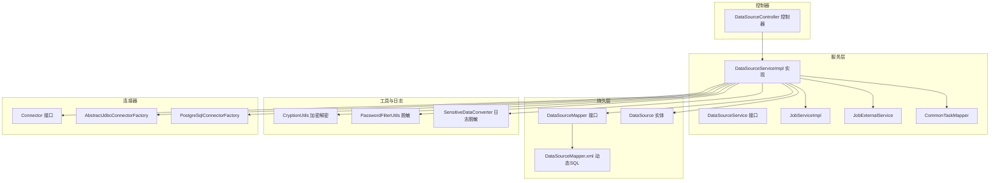
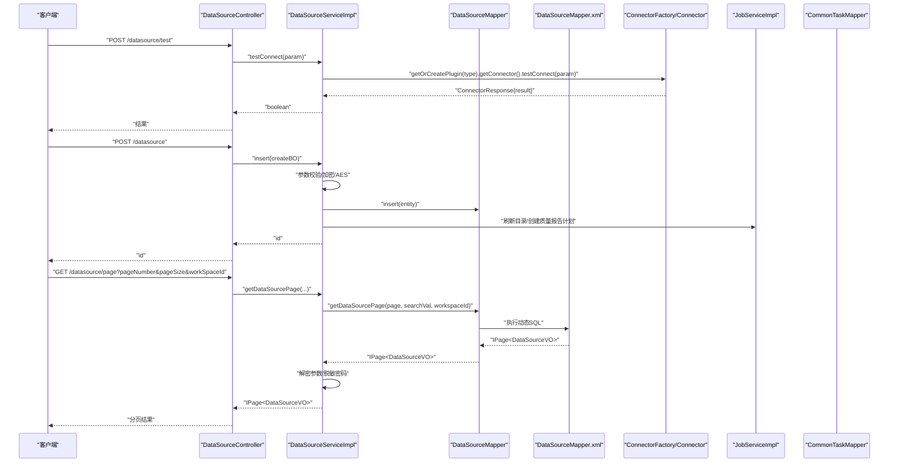
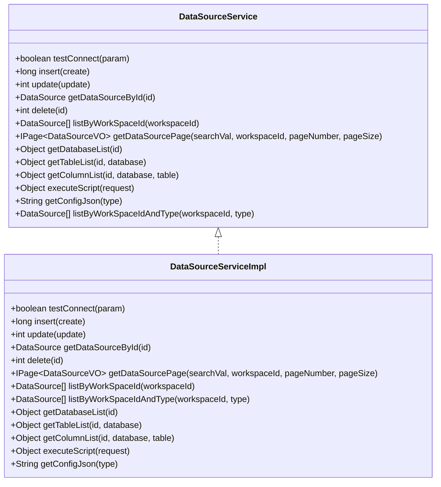
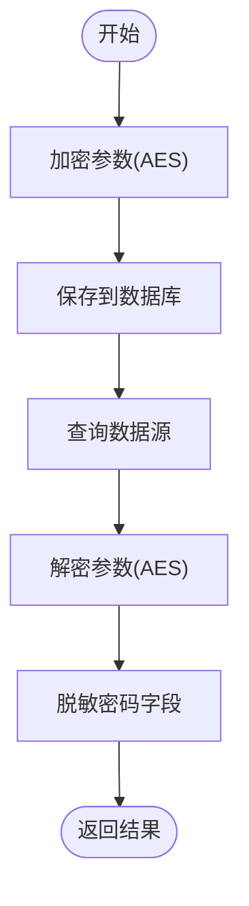
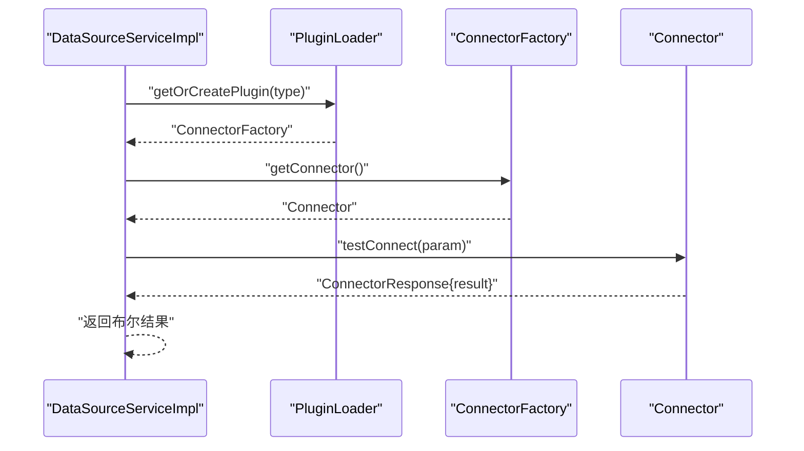
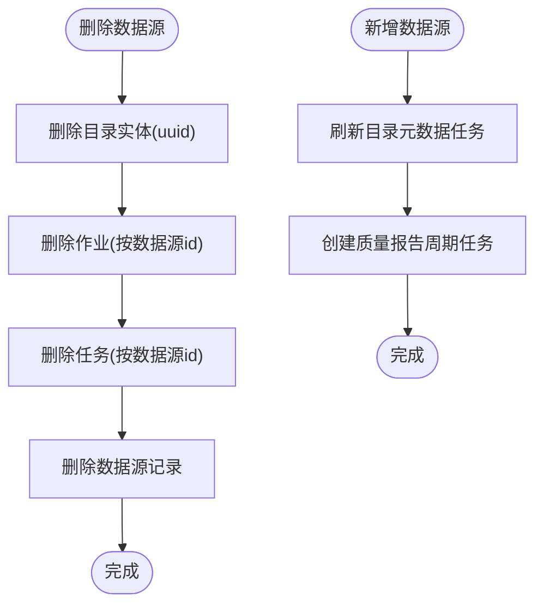
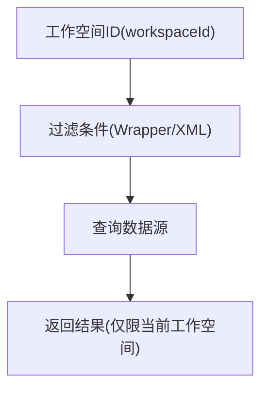
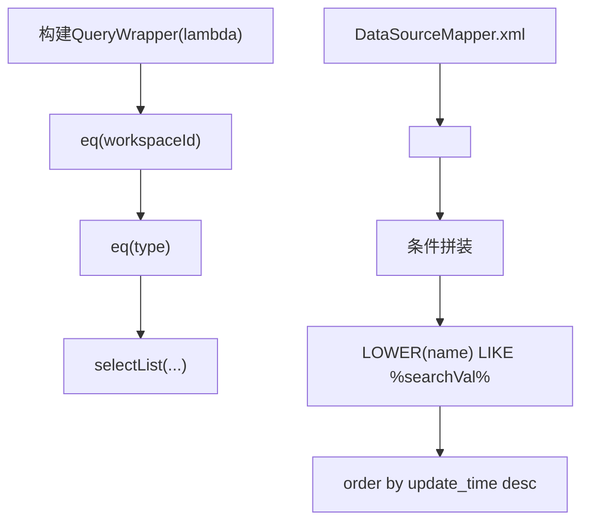
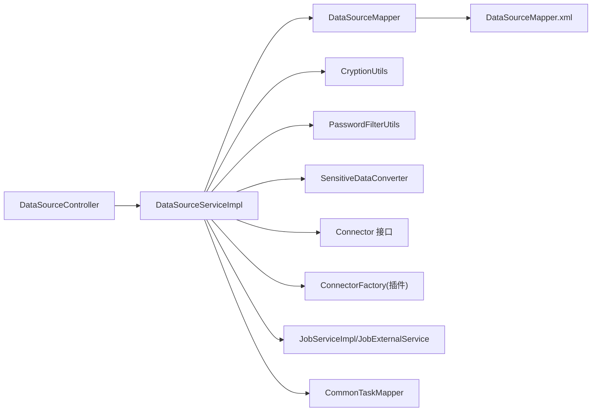

# 数据源服务实现

<cite>
**本文引用的文件列表**
- [DataSourceService.java](file://datavines-server/src/main/java/io/datavines/server/repository/service/DataSourceService.java)
- [DataSourceServiceImpl.java](file://datavines-server/src/main/java/io/datavines/server/repository/service/impl/DataSourceServiceImpl.java)
- [DataSourceMapper.java](file://datavines-server/src/main/java/io/datavines/server/repository/mapper/DataSourceMapper.java)
- [DataSourceMapper.xml](file://datavines-server/src/main/resources/mapper/DataSourceMapper.xml)
- [DataSourceController.java](file://datavines-server/src/main/java/io/datavines/server/api/controller/DataSourceController.java)
- [DataSource.java](file://datavines-server/src/main/java/io/datavines/server/repository/entity/DataSource.java)
- [CryptionUtils.java](file://datavines-common/src/main/java/io/datavines/common/utils/CryptionUtils.java)
- [PasswordFilterUtils.java](file://datavines-common/src/main/java/io/datavines/common/utils/PasswordFilterUtils.java)
- [SensitiveDataConverter.java](file://datavines-common/src/main/java/io/datavines/common/log/SensitiveDataConverter.java)
- [Connector.java](file://datavines-connector/datavines-connector-api/src/main/java/io/datavines/connector/api/Connector.java)
- [AbstractJdbcConnectorFactory.java](file://datavines-connector/datavines-connector-plugins/datavines-connector-jdbc/src/main/java/io/datavines/connector/plugin/AbstractJdbcConnectorFactory.java)
- [PostgreSqlConnectorFactory.java](file://datavines-connector/datavines-connector-plugins/datavines-connector-postgresql/src/main/java/io/datavines/connector/plugin/PostgreSqlConnectorFactory.java)
- [JobServiceImpl.java](file://datavines-server/src/main/java/io/datavines/server/repository/service/impl/JobServiceImpl.java)
- [JobExternalService.java](file://datavines-server/src/main/java/io/datavines/server/repository/service/impl/JobExternalService.java)
- [CommonTaskMapper.java](file://datavines-server/src/main/java/io/datavines/server/repository/mapper/CommonTaskMapper.java)
- [TenantService.java](file://datavines-server/src/main/java/io/datavines/server/repository/service/TenantService.java)
- [Tenant.java](file://datavines-server/src/main/java/io/datavines/server/repository/entity/Tenant.java)
- [JdbcExecutorClientManager.java](file://datavines-common/src/main/java/io/datavines/common/datasource/jdbc/JdbcExecutorClientManager.java)
- [ConnectionHolder.java](file://datavines-engine/datavines-engine-plugins/datavines-engine-local/datavines-engine-local-api/src/main/java/io/datavines/engine/local/api/entity/ConnectionHolder.java)
</cite>

## 目录
1. [简介](#简介)
2. [项目结构](#项目结构)
3. [核心组件](#核心组件)
4. [架构总览](#架构总览)
5. [详细组件分析](#详细组件分析)
6. [依赖关系分析](#依赖关系分析)
7. [性能考量](#性能考量)
8. [故障排查指南](#故障排查指南)
9. [结论](#结论)
10. [附录](#附录)

## 简介
本文件围绕数据源服务（DataSourceService）展开，系统性阐述其在DataVines中的职责与实现细节，包括：
- 数据源配置的增删改查（CRUD）实现
- 敏感信息（如密码）的加密存储与脱敏展示流程
- 数据源测试连接功能的实现机制及与datavines-connector模块的协作
- 数据源与作业、任务之间的关联关系管理
- 多租户环境下的数据隔离策略
- 服务层使用MyBatis Plus的Wrapper进行复杂查询构建
- DataSourceMapper.xml中动态SQL的实现要点
- 数据源配置校验、连接池管理与性能监控建议

## 项目结构
围绕数据源服务的关键文件分布如下：
- 接口与实现：服务接口与实现类位于服务层
- 映射器与XML：MyBatis映射器与动态SQL位于资源目录
- 控制器：对外暴露REST接口
- 实体：数据源实体模型
- 工具与日志：加密工具、密码过滤与日志脱敏
- 连接器：通过插件化ConnectorFactory与Connector接口验证连接
- 关联服务：作业、任务、租户等服务用于管理数据源与业务对象的关系

图表来源
- [DataSourceService.java](file://datavines-server/src/main/java/io/datavines/server/repository/service/DataSourceService.java#L1-L59)
- [DataSourceServiceImpl.java](file://datavines-server/src/main/java/io/datavines/server/repository/service/impl/DataSourceServiceImpl.java#L1-L357)
- [DataSourceMapper.java](file://datavines-server/src/main/java/io/datavines/server/repository/mapper/DataSourceMapper.java#L1-L33)
- [DataSourceMapper.xml](file://datavines-server/src/main/resources/mapper/DataSourceMapper.xml#L1-L37)
- [DataSourceController.java](file://datavines-server/src/main/java/io/datavines/server/api/controller/DataSourceController.java#L26-L119)
- [DataSource.java](file://datavines-server/src/main/java/io/datavines/server/repository/entity/DataSource.java#L1-L70)
- [CryptionUtils.java](file://datavines-common/src/main/java/io/datavines/common/utils/CryptionUtils.java#L1-L85)
- [PasswordFilterUtils.java](file://datavines-common/src/main/java/io/datavines/common/utils/PasswordFilterUtils.java#L1-L77)
- [SensitiveDataConverter.java](file://datavines-common/src/main/java/io/datavines/common/log/SensitiveDataConverter.java#L1-L60)
- [Connector.java](file://datavines-connector/datavines-connector-api/src/main/java/io/datavines/connector/api/Connector.java#L1-L73)
- [AbstractJdbcConnectorFactory.java](file://datavines-connector/datavines-connector-plugins/datavines-connector-jdbc/src/main/java/io/datavines/connector/plugin/AbstractJdbcConnectorFactory.java#L36-L62)
- [PostgreSqlConnectorFactory.java](file://datavines-connector/datavines-connector-plugins/datavines-connector-postgresql/src/main/java/io/datavines/connector/plugin/PostgreSqlConnectorFactory.java#L35-L57)

章节来源
- [DataSourceService.java](file://datavines-server/src/main/java/io/datavines/server/repository/service/DataSourceService.java#L1-L59)
- [DataSourceServiceImpl.java](file://datavines-server/src/main/java/io/datavines/server/repository/service/impl/DataSourceServiceImpl.java#L1-L357)
- [DataSourceMapper.java](file://datavines-server/src/main/java/io/datavines/server/repository/mapper/DataSourceMapper.java#L1-L33)
- [DataSourceMapper.xml](file://datavines-server/src/main/resources/mapper/DataSourceMapper.xml#L1-L37)
- [DataSourceController.java](file://datavines-server/src/main/java/io/datavines/server/api/controller/DataSourceController.java#L26-L119)
- [DataSource.java](file://datavines-server/src/main/java/io/datavines/server/repository/entity/DataSource.java#L1-L70)

## 核心组件
- 服务接口与实现
  - 接口定义了数据源的增删改查、分页查询、数据库/表/列枚举、脚本执行、连接测试、配置JSON获取等能力
  - 实现类负责参数校验、加密存储、解密返回、调用连接器进行连接测试与元数据获取、触发相关任务调度
- 映射器与XML
  - 提供分页查询与动态条件拼装，支持按工作空间与名称模糊检索
- 控制器
  - 对外提供REST接口，封装请求参数并调用服务层
- 实体
  - 定义数据源字段，包含工作空间标识、类型、参数、参数摘要、创建/更新时间与用户等
- 工具与日志
  - AES加解密工具、密码脱敏工具、日志脱敏转换器
- 连接器
  - 通过SPI加载不同类型的连接器工厂，统一调用测试连接、获取数据库/表/列、执行脚本等

章节来源
- [DataSourceService.java](file://datavines-server/src/main/java/io/datavines/server/repository/service/DataSourceService.java#L1-L59)
- [DataSourceServiceImpl.java](file://datavines-server/src/main/java/io/datavines/server/repository/service/impl/DataSourceServiceImpl.java#L1-L357)
- [DataSourceMapper.java](file://datavines-server/src/main/java/io/datavines/server/repository/mapper/DataSourceMapper.java#L1-L33)
- [DataSourceMapper.xml](file://datavines-server/src/main/resources/mapper/DataSourceMapper.xml#L1-L37)
- [DataSourceController.java](file://datavines-server/src/main/java/io/datavines/server/api/controller/DataSourceController.java#L26-L119)
- [DataSource.java](file://datavines-server/src/main/java/io/datavines/server/repository/entity/DataSource.java#L1-L70)
- [CryptionUtils.java](file://datavines-common/src/main/java/io/datavines/common/utils/CryptionUtils.java#L1-L85)
- [PasswordFilterUtils.java](file://datavines-common/src/main/java/io/datavines/common/utils/PasswordFilterUtils.java#L1-L77)
- [SensitiveDataConverter.java](file://datavines-common/src/main/java/io/datavines/common/log/SensitiveDataConverter.java#L1-L60)
- [Connector.java](file://datavines-connector/datavines-connector-api/src/main/java/io/datavines/connector/api/Connector.java#L1-L73)

## 架构总览
下图展示了数据源服务从控制器到服务、映射器、连接器以及相关业务服务的整体交互。

图表来源
- [DataSourceController.java](file://datavines-server/src/main/java/io/datavines/server/api/controller/DataSourceController.java#L26-L119)
- [DataSourceServiceImpl.java](file://datavines-server/src/main/java/io/datavines/server/repository/service/impl/DataSourceServiceImpl.java#L76-L147)
- [DataSourceMapper.java](file://datavines-server/src/main/java/io/datavines/server/repository/mapper/DataSourceMapper.java#L1-L33)
- [DataSourceMapper.xml](file://datavines-server/src/main/resources/mapper/DataSourceMapper.xml#L1-L37)
- [Connector.java](file://datavines-connector/datavines-connector-api/src/main/java/io/datavines/connector/api/Connector.java#L1-L73)

## 详细组件分析

### 数据源服务接口与实现
- 增删改查与分页
  - 插入：生成UUID、计算参数摘要、加密参数后入库；同时触发目录刷新与质量报告计划创建
  - 更新：重新计算参数摘要并加密参数后更新
  - 删除：删除前清理目录实体、作业与任务，再删除数据源
  - 查询：按工作空间与类型筛选；分页查询时对返回参数进行解密与密码脱敏
- 元数据与脚本
  - 获取数据库/表/列列表：基于连接器工厂获取对应实现
  - 执行脚本：将脚本交由连接器执行器执行
- 连接测试
  - 通过插件化连接器工厂调用测试连接方法，返回布尔结果

图表来源
- [DataSourceService.java](file://datavines-server/src/main/java/io/datavines/server/repository/service/DataSourceService.java#L1-L59)
- [DataSourceServiceImpl.java](file://datavines-server/src/main/java/io/datavines/server/repository/service/impl/DataSourceServiceImpl.java#L1-L357)

章节来源
- [DataSourceService.java](file://datavines-server/src/main/java/io/datavines/server/repository/service/DataSourceService.java#L1-L59)
- [DataSourceServiceImpl.java](file://datavines-server/src/main/java/io/datavines/server/repository/service/impl/DataSourceServiceImpl.java#L76-L356)

### 敏感信息加密与脱敏
- 存储加密
  - 在插入与更新时，将参数字符串使用AES进行加密存储
  - 使用固定IV与密钥进行加解密，确保可逆
- 返回脱敏
  - 分页查询与单条查询时，先解密参数，再对密码字段进行脱敏显示
- 日志脱敏
  - 日志过滤器通过正则匹配并替换敏感字段，避免日志泄露

图表来源
- [DataSourceServiceImpl.java](file://datavines-server/src/main/java/io/datavines/server/repository/service/impl/DataSourceServiceImpl.java#L112-L146)
- [DataSourceServiceImpl.java](file://datavines-server/src/main/java/io/datavines/server/repository/service/impl/DataSourceServiceImpl.java#L184-L196)
- [DataSourceServiceImpl.java](file://datavines-server/src/main/java/io/datavines/server/repository/service/impl/DataSourceServiceImpl.java#L240-L256)
- [CryptionUtils.java](file://datavines-common/src/main/java/io/datavines/common/utils/CryptionUtils.java#L1-L85)
- [PasswordFilterUtils.java](file://datavines-common/src/main/java/io/datavines/common/utils/PasswordFilterUtils.java#L1-L77)
- [SensitiveDataConverter.java](file://datavines-common/src/main/java/io/datavines/common/log/SensitiveDataConverter.java#L1-L60)

章节来源
- [CryptionUtils.java](file://datavines-common/src/main/java/io/datavines/common/utils/CryptionUtils.java#L1-L85)
- [PasswordFilterUtils.java](file://datavines-common/src/main/java/io/datavines/common/utils/PasswordFilterUtils.java#L1-L77)
- [SensitiveDataConverter.java](file://datavines-common/src/main/java/io/datavines/common/log/SensitiveDataConverter.java#L1-L60)
- [DataSourceServiceImpl.java](file://datavines-server/src/main/java/io/datavines/server/repository/service/impl/DataSourceServiceImpl.java#L112-L146)
- [DataSourceServiceImpl.java](file://datavines-server/src/main/java/io/datavines/server/repository/service/impl/DataSourceServiceImpl.java#L184-L196)
- [DataSourceServiceImpl.java](file://datavines-server/src/main/java/io/datavines/server/repository/service/impl/DataSourceServiceImpl.java#L240-L256)

### 测试连接与datavines-connector协作
- 通过SPI加载指定类型的连接器工厂，调用连接器的测试连接方法
- 连接器接口定义了默认空实现，具体数据库类型由各插件实现
- JDBC通用工厂提供数据源客户端、语句解析与度量脚本等能力

图表来源
- [DataSourceServiceImpl.java](file://datavines-server/src/main/java/io/datavines/server/repository/service/impl/DataSourceServiceImpl.java#L76-L80)
- [Connector.java](file://datavines-connector/datavines-connector-api/src/main/java/io/datavines/connector/api/Connector.java#L1-L73)
- [AbstractJdbcConnectorFactory.java](file://datavines-connector/datavines-connector-plugins/datavines-connector-jdbc/src/main/java/io/datavines/connector/plugin/AbstractJdbcConnectorFactory.java#L36-L62)
- [PostgreSqlConnectorFactory.java](file://datavines-connector/datavines-connector-plugins/datavines-connector-postgresql/src/main/java/io/datavines/connector/plugin/PostgreSqlConnectorFactory.java#L35-L57)

章节来源
- [DataSourceServiceImpl.java](file://datavines-server/src/main/java/io/datavines/server/repository/service/impl/DataSourceServiceImpl.java#L76-L80)
- [Connector.java](file://datavines-connector/datavines-connector-api/src/main/java/io/datavines/connector/api/Connector.java#L1-L73)
- [AbstractJdbcConnectorFactory.java](file://datavines-connector/datavines-connector-plugins/datavines-connector-jdbc/src/main/java/io/datavines/connector/plugin/AbstractJdbcConnectorFactory.java#L36-L62)
- [PostgreSqlConnectorFactory.java](file://datavines-connector/datavines-connector-plugins/datavines-connector-postgresql/src/main/java/io/datavines/connector/plugin/PostgreSqlConnectorFactory.java#L35-L57)

### 数据源与作业、任务的关联关系
- 删除数据源时，会级联删除目录实体、作业与任务，防止悬挂引用
- 新增数据源后，自动创建目录元数据抓取任务与质量报告周期任务
- 作业服务与外部作业服务均持有数据源服务引用，便于在执行过程中使用数据源配置

图表来源
- [DataSourceServiceImpl.java](file://datavines-server/src/main/java/io/datavines/server/repository/service/impl/DataSourceServiceImpl.java#L224-L237)
- [DataSourceServiceImpl.java](file://datavines-server/src/main/java/io/datavines/server/repository/service/impl/DataSourceServiceImpl.java#L127-L146)
- [JobServiceImpl.java](file://datavines-server/src/main/java/io/datavines/server/repository/service/impl/JobServiceImpl.java#L98-L124)
- [JobExternalService.java](file://datavines-server/src/main/java/io/datavines/server/repository/service/impl/JobExternalService.java#L43-L72)

章节来源
- [DataSourceServiceImpl.java](file://datavines-server/src/main/java/io/datavines/server/repository/service/impl/DataSourceServiceImpl.java#L224-L237)
- [DataSourceServiceImpl.java](file://datavines-server/src/main/java/io/datavines/server/repository/service/impl/DataSourceServiceImpl.java#L127-L146)
- [JobServiceImpl.java](file://datavines-server/src/main/java/io/datavines/server/repository/service/impl/JobServiceImpl.java#L98-L124)
- [JobExternalService.java](file://datavines-server/src/main/java/io/datavines/server/repository/service/impl/JobExternalService.java#L43-L72)

### 多租户环境下的数据隔离策略
- 数据源实体包含工作空间标识字段，查询与分页均以该字段作为过滤条件
- 列表查询与分页查询均通过Wrapper或XML动态SQL限制在当前工作空间内
- 租户服务提供按工作空间的租户管理能力，确保业务对象与数据源在同一工作空间内隔离

图表来源
- [DataSource.java](file://datavines-server/src/main/java/io/datavines/server/repository/entity/DataSource.java#L1-L70)
- [DataSourceServiceImpl.java](file://datavines-server/src/main/java/io/datavines/server/repository/service/impl/DataSourceServiceImpl.java#L258-L266)
- [DataSourceMapper.xml](file://datavines-server/src/main/resources/mapper/DataSourceMapper.xml#L23-L36)
- [TenantService.java](file://datavines-server/src/main/java/io/datavines/server/repository/service/TenantService.java#L1-L39)
- [Tenant.java](file://datavines-server/src/main/java/io/datavines/server/repository/entity/Tenant.java#L1-L38)

章节来源
- [DataSource.java](file://datavines-server/src/main/java/io/datavines/server/repository/entity/DataSource.java#L1-L70)
- [DataSourceServiceImpl.java](file://datavines-server/src/main/java/io/datavines/server/repository/service/impl/DataSourceServiceImpl.java#L258-L266)
- [DataSourceMapper.xml](file://datavines-server/src/main/resources/mapper/DataSourceMapper.xml#L23-L36)
- [TenantService.java](file://datavines-server/src/main/java/io/datavines/server/repository/service/TenantService.java#L1-L39)
- [Tenant.java](file://datavines-server/src/main/java/io/datavines/server/repository/entity/Tenant.java#L1-L38)

### MyBatis Plus Wrapper与动态SQL
- Wrapper复杂查询
  - 使用Lambda表达式构建等值条件，如按工作空间与类型筛选
- 动态SQL
  - XML中通过标签实现条件拼装与模糊匹配
  - 支持按工作空间过滤与可选的名称模糊查询

图表来源
- [DataSourceServiceImpl.java](file://datavines-server/src/main/java/io/datavines/server/repository/service/impl/DataSourceServiceImpl.java#L258-L266)
- [DataSourceMapper.xml](file://datavines-server/src/main/resources/mapper/DataSourceMapper.xml#L23-L36)

章节来源
- [DataSourceServiceImpl.java](file://datavines-server/src/main/java/io/datavines/server/repository/service/impl/DataSourceServiceImpl.java#L258-L266)
- [DataSourceMapper.xml](file://datavines-server/src/main/resources/mapper/DataSourceMapper.xml#L23-L36)

### 数据源配置校验、连接池管理与性能监控建议
- 配置校验
  - 插入与更新前对参数Map进行非空校验，提取关键属性用于参数摘要计算
  - 使用连接器工厂提供的keyProperties集合，确保必要字段存在
- 连接池管理
  - 通用JDBC连接器工厂提供数据源客户端，可结合应用侧连接池配置
  - 引擎本地模式下提供连接持有者，按需重建连接并校验有效性
- 性能监控
  - JDBC工具类提供查询耗时统计与日志输出，可用于监控SQL执行性能
  - 建议在连接器层增加连接池大小、超时、重试等配置项，并在日志中记录关键指标

章节来源
- [DataSourceServiceImpl.java](file://datavines-server/src/main/java/io/datavines/server/repository/service/impl/DataSourceServiceImpl.java#L82-L111)
- [DataSourceServiceImpl.java](file://datavines-server/src/main/java/io/datavines/server/repository/service/impl/DataSourceServiceImpl.java#L149-L181)
- [AbstractJdbcConnectorFactory.java](file://datavines-connector/datavines-connector-plugins/datavines-connector-jdbc/src/main/java/io/datavines/connector/plugin/AbstractJdbcConnectorFactory.java#L36-L62)
- [JdbcExecutorClientManager.java](file://datavines-common/src/main/java/io/datavines/common/datasource/jdbc/JdbcExecutorClientManager.java#L1-L37)
- [ConnectionHolder.java](file://datavines-engine/datavines-engine-plugins/datavines-engine-local/datavines-engine-local-api/src/main/java/io/datavines/engine/local/api/entity/ConnectionHolder.java#L33-L61)

## 依赖关系分析
- 组件耦合
  - 服务实现依赖映射器、实体、工具类与连接器SPI
  - 控制器仅依赖服务接口，保持良好的分层
- 外部依赖
  - 连接器通过SPI加载，支持多种数据库类型
  - 作业与任务服务与数据源服务存在业务关联，但通过接口解耦

图表来源
- [DataSourceController.java](file://datavines-server/src/main/java/io/datavines/server/api/controller/DataSourceController.java#L26-L119)
- [DataSourceServiceImpl.java](file://datavines-server/src/main/java/io/datavines/server/repository/service/impl/DataSourceServiceImpl.java#L1-L357)
- [DataSourceMapper.java](file://datavines-server/src/main/java/io/datavines/server/repository/mapper/DataSourceMapper.java#L1-L33)
- [DataSourceMapper.xml](file://datavines-server/src/main/resources/mapper/DataSourceMapper.xml#L1-L37)
- [Connector.java](file://datavines-connector/datavines-connector-api/src/main/java/io/datavines/connector/api/Connector.java#L1-L73)

章节来源
- [DataSourceController.java](file://datavines-server/src/main/java/io/datavines/server/api/controller/DataSourceController.java#L26-L119)
- [DataSourceServiceImpl.java](file://datavines-server/src/main/java/io/datavines/server/repository/service/impl/DataSourceServiceImpl.java#L1-L357)
- [DataSourceMapper.java](file://datavines-server/src/main/java/io/datavines/server/repository/mapper/DataSourceMapper.java#L1-L33)
- [DataSourceMapper.xml](file://datavines-server/src/main/resources/mapper/DataSourceMapper.xml#L1-L37)
- [Connector.java](file://datavines-connector/datavines-connector-api/src/main/java/io/datavines/connector/api/Connector.java#L1-L73)

## 性能考量
- 查询性能
  - 分页查询应配合索引优化，建议在工作空间与更新时间上建立合适索引
  - 动态SQL中模糊查询可能影响性能，建议限制搜索范围或增加前缀索引
- 加解密开销
  - AES加解密为CPU密集型操作，建议批量处理时合并请求，减少重复加解密
- 连接池与超时
  - 合理设置连接池大小与超时时间，避免频繁创建销毁连接
  - 在连接器层增加健康检查与重试策略，提升稳定性

## 故障排查指南
- 加密异常
  - 若解密失败，检查密钥长度与格式是否符合要求
  - 确认参数字符串是否被正确加密后再存储
- 连接测试失败
  - 检查连接器类型与参数是否匹配
  - 查看连接器工厂是否正确加载
- 分页查询无结果
  - 确认工作空间ID是否正确传入
  - 检查动态SQL条件是否生效

章节来源
- [CryptionUtils.java](file://datavines-common/src/main/java/io/datavines/common/utils/CryptionUtils.java#L1-L85)
- [DataSourceServiceImpl.java](file://datavines-server/src/main/java/io/datavines/server/repository/service/impl/DataSourceServiceImpl.java#L76-L80)
- [DataSourceMapper.xml](file://datavines-server/src/main/resources/mapper/DataSourceMapper.xml#L23-L36)

## 结论
数据源服务通过清晰的分层设计与插件化连接器，实现了数据源配置的全生命周期管理。服务层在保证安全性（参数加密与日志脱敏）的同时，提供了完善的测试连接、元数据枚举与脚本执行能力。通过工作空间隔离与Wrapper/动态SQL的组合，有效支撑了多租户场景下的数据隔离。建议后续进一步完善连接池配置与性能监控指标，持续优化查询与执行性能。

## 附录
- 关键路径参考
  - 插入流程：[DataSourceServiceImpl.java](file://datavines-server/src/main/java/io/datavines/server/repository/service/impl/DataSourceServiceImpl.java#L82-L146)
  - 更新流程：[DataSourceServiceImpl.java](file://datavines-server/src/main/java/io/datavines/server/repository/service/impl/DataSourceServiceImpl.java#L149-L196)
  - 删除流程：[DataSourceServiceImpl.java](file://datavines-server/src/main/java/io/datavines/server/repository/service/impl/DataSourceServiceImpl.java#L224-L237)
  - 分页查询：[DataSourceServiceImpl.java](file://datavines-server/src/main/java/io/datavines/server/repository/service/impl/DataSourceServiceImpl.java#L239-L256)，[DataSourceMapper.xml](file://datavines-server/src/main/resources/mapper/DataSourceMapper.xml#L23-L36)
  - 连接测试：[DataSourceServiceImpl.java](file://datavines-server/src/main/java/io/datavines/server/repository/service/impl/DataSourceServiceImpl.java#L76-L80)，[Connector.java](file://datavines-connector/datavines-connector-api/src/main/java/io/datavines/connector/api/Connector.java#L1-L73)
  - 元数据与脚本：[DataSourceServiceImpl.java](file://datavines-server/src/main/java/io/datavines/server/repository/service/impl/DataSourceServiceImpl.java#L268-L350)
  - 多租户隔离：[DataSource.java](file://datavines-server/src/main/java/io/datavines/server/repository/entity/DataSource.java#L1-L70)，[DataSourceServiceImpl.java](file://datavines-server/src/main/java/io/datavines/server/repository/service/impl/DataSourceServiceImpl.java#L258-L266)，[DataSourceMapper.xml](file://datavines-server/src/main/resources/mapper/DataSourceMapper.xml#L23-L36)