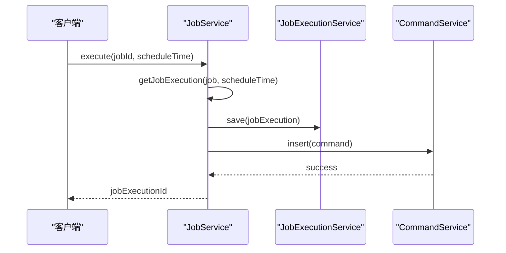
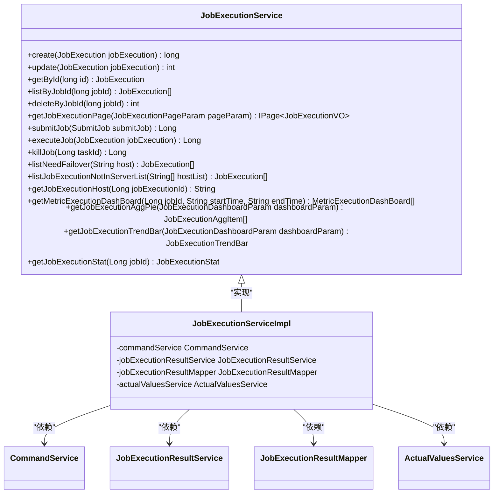
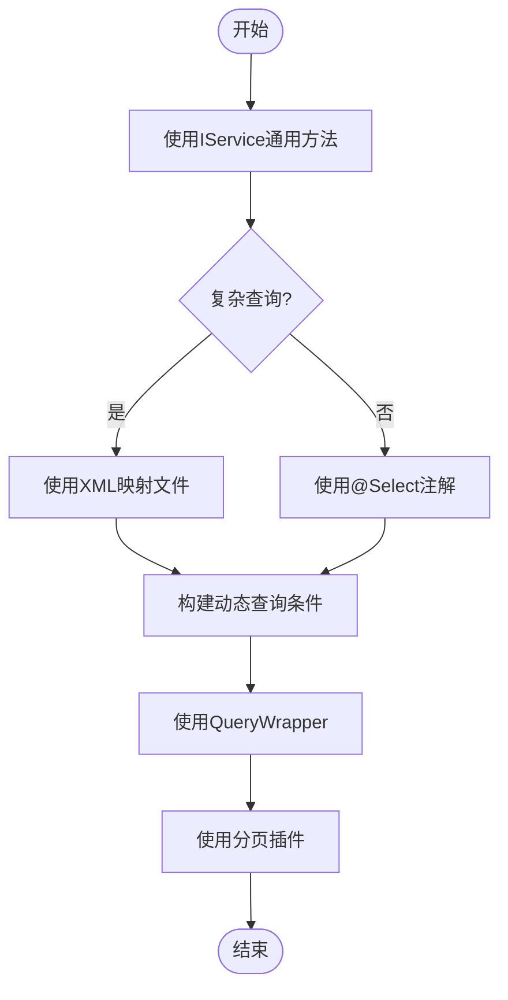
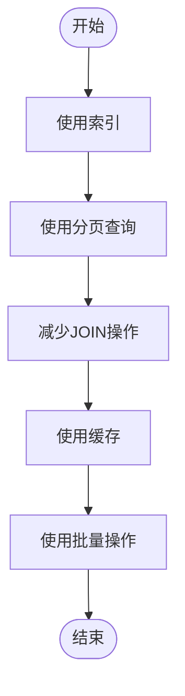
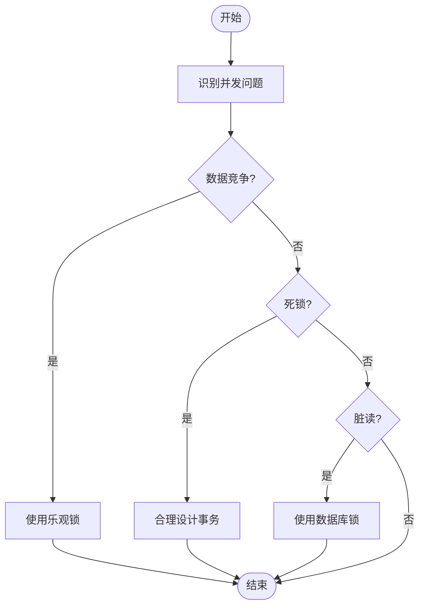

# 服务层实现

<cite>
**本文档中引用的文件**  
- [JobService.java](file://datavines-server/src/main/java/io/datavines/server/repository/service/JobService.java)
- [JobServiceImpl.java](file://datavines-server/src/main/java/io/datavines/server/repository/service/impl/JobServiceImpl.java)
- [JobMapper.java](file://datavines-server/src/main/java/io/datavines/server/repository/mapper/JobMapper.java)
- [JobMapper.xml](file://datavines-server/src/main/resources/mapper/JobMapper.xml)
- [Job.java](file://datavines-server/src/main/java/io/datavines/server/repository/entity/Job.java)
- [MybatisPlusConfig.java](file://datavines-server/src/main/java/io/datavines/server/api/config/MybatisPlusConfig.java)
- [DataVinesExceptionHandler.java](file://datavines-server/src/main/java/io/datavines/server/api/inteceptor/DataVinesExceptionHandler.java)
- [JobExecutionService.java](file://datavines-server/src/main/java/io/datavines/server/repository/service/JobExecutionService.java)
- [JobExecutionServiceImpl.java](file://datavines-server/src/main/java/io/datavines/server/repository/service/impl/JobExecutionServiceImpl.java)
- [JobExecutionResultServiceImpl.java](file://datavines-server/src/main/java/io/datavines/server/repository/service/impl/JobExecutionResultServiceImpl.java)
</cite>

## 目录
1. [引言](#引言)
2. [服务层架构与设计模式](#服务层架构与设计模式)
3. [核心服务实现分析](#核心服务实现分析)
4. [MyBatis Plus使用详解](#mybatis-plus使用详解)
5. [事务管理与异常处理](#事务管理与异常处理)
6. [领域模型与数据库映射](#领域模型与数据库映射)
7. [性能优化建议](#性能优化建议)
8. [并发问题与解决方案](#并发问题与解决方案)
9. [总结](#总结)

## 引言
datavines-server模块的服务层是整个系统的核心业务逻辑处理中心，负责协调数据质量检查、数据剖析、数据核对等关键任务的执行。本文档将深入分析服务层的设计模式、核心服务的业务逻辑实现、MyBatis Plus的使用方式、事务管理、异常处理和日志记录机制，以及领域模型与数据库表的映射关系。

## 服务层架构与设计模式
datavines-server模块的服务层采用了典型的分层架构，遵循了接口与实现分离的设计原则。每个服务都有一个接口定义和一个实现类，接口继承自MyBatis Plus的IService，提供了基本的CRUD操作。这种设计模式使得代码更加模块化，易于维护和扩展。

服务层通过Spring的@Service注解进行声明，并使用@Autowired注解注入其他服务依赖，实现了松耦合的组件协作。例如，JobServiceImpl类注入了JobExecutionService、CommandService、DataSourceService等多个服务，以完成复杂的业务逻辑。

## 核心服务实现分析

### JobService服务
JobService是datavines-server模块的核心服务之一，负责管理数据质量检查任务的生命周期。该服务提供了创建、更新、删除、查询和执行任务的功能。

**创建任务**
`create`方法实现了任务的创建逻辑。首先对输入参数进行校验，确保任务参数不为空。然后检查目标数据源是否支持错误数据输出到自身。接着，将任务参数转换为BaseJobParameter对象列表，并进行去重和适用性检查。最后，将任务信息保存到数据库，并建立任务与实体的关联关系。

**更新任务**
`update`方法与`create`方法类似，但在更新前会检查任务是否存在，并确保更新后的任务名称不与其他任务冲突。更新操作同样需要进行参数校验和适用性检查。

**执行任务**
`execute`方法负责启动一个任务的执行。它首先获取任务信息，然后调用`executeJob`私有方法创建一个JobExecution对象，并将其保存到数据库。接着，创建一个Command对象，将其插入到命令队列中，由调度器负责后续的执行。



**Section sources**
- [JobServiceImpl.java](file://datavines-server/src/main/java/io/datavines/server/repository/service/impl/JobServiceImpl.java#L129-L249)
- [JobServiceImpl.java](file://datavines-server/src/main/java/io/datavines/server/repository/service/impl/JobServiceImpl.java#L533-L551)

### JobExecutionService服务
JobExecutionService服务负责管理任务执行的生命周期，包括任务的提交、更新、查询和删除。

**提交任务**
`submitJob`方法实现了任务的提交逻辑。首先对任务执行参数进行校验，然后根据任务类型设置默认的引擎参数。对于Spark引擎，设置了默认的驱动程序和执行器配置。最后，调用`executeJob`方法启动任务执行。

**更新任务状态**
`update`方法在更新任务执行信息时，会自动更新更新时间戳，确保数据的一致性。



**Section sources**
- [JobExecutionServiceImpl.java](file://datavines-server/src/main/java/io/datavines/server/repository/service/impl/JobExecutionServiceImpl.java#L148-L181)
- [JobExecutionServiceImpl.java](file://datavines-server/src/main/java/io/datavines/server/repository/service/impl/JobExecutionServiceImpl.java#L86-L89)

## MyBatis Plus使用详解

### Mapper接口
MyBatis Plus的Mapper接口继承自BaseMapper，自动提供了基本的CRUD操作。例如，JobMapper接口继承自BaseMapper<Job>，可以直接使用insert、delete、update、selectById等方法。

```java
@Mapper
public interface JobMapper extends BaseMapper<Job> {
    @Select("SELECT * from dv_job WHERE datasource_id = #{datasourceId} ")
    List<Job> listByDataSourceId(long dataSourceId);
    
    IPage<JobVO> getJobPage(Page<JobVO> page,
                            @Param("searchVal") String searchVal,
                            @Param("datasourceId") Long datasourceId,
                            @Param("type") Integer type);
    
    IPage<JobVO> getJobPageSelect(Page<JobVO> page,
                            @Param("searchVal") String searchVal,
                            @Param("schemaSearch") String schemaSearch,
                            @Param("tableSearch") String tableSearch,
                            @Param("columnSearch") String columnSearch,
                            @Param("startTime") String startTime,
                            @Param("endTime") String endTime,
                            @Param("datasourceId") Long datasourceId,
                            @Param("type") Integer type);
}
```

### XML映射文件
对于复杂的查询，使用XML映射文件来定义SQL语句。例如，JobMapper.xml文件中定义了getJobPageSelect查询，该查询涉及多个表的连接和动态条件。

```xml
<select id="getJobPageSelect" resultType="io.datavines.server.api.dto.vo.JobVO">
    select p.id, p.name, p.schema_name ,p.table_name,p.column_name, p.type, u.username as updater, p.update_time, s.cron_expression
    from (<include refid="basic_sql"/>) p left join `dv_user` u on u.id = p.update_by
    left join `dv_job_schedule` s on p.id = s.job_id and s.status = 1
    <where>
        <if test="searchVal != null and searchVal != ''">
            AND LOWER(p.`name`) LIKE CONCAT(CONCAT('%', LOWER(#{searchVal})), '%')
        </if>
        <if test="schemaSearch != null and schemaSearch != ''">
            AND LOWER(p.schema_name) LIKE CONCAT(CONCAT('%', LOWER(#{schemaSearch})), '%')
        </if>
        <if test="tableSearch != null and tableSearch != ''">
            AND LOWER(p.table_name) LIKE CONCAT(CONCAT('%', LOWER(#{tableSearch})), '%')
        </if>
        <if test="columnSearch != null and columnSearch != ''">
            AND LOWER(p.column_name) LIKE CONCAT(CONCAT('%', LOWER(#{columnSearch})), '%')
        </if>
        <if test="startTime != null and startTime != ''">
            AND p.update_time &gt;= #{startTime}
        </if>
        <if test="endTime != null and endTime != ''">
            AND p.update_time &lt;= #{endTime}
        </if>
    </where>
    order by p.update_time desc
</select>
```

### CRUD操作最佳实践
在使用MyBatis Plus进行CRUD操作时，应遵循以下最佳实践：
1. 使用IService接口提供的通用方法，减少重复代码。
2. 对于复杂查询，使用XML映射文件或@Select注解。
3. 使用QueryWrapper构建动态查询条件，提高代码的可读性和可维护性。
4. 使用分页插件进行分页查询，避免一次性加载大量数据。



**Section sources**
- [JobMapper.java](file://datavines-server/src/main/java/io/datavines/server/repository/mapper/JobMapper.java#L31-L51)
- [JobMapper.xml](file://datavines-server/src/main/resources/mapper/JobMapper.xml#L27-L66)

## 事务管理与异常处理

### 事务管理
datavines-server模块使用Spring的声明式事务管理，通过@Transactional注解来控制事务的边界。例如，JobServiceImpl类中的create、update、deleteById等方法都使用了@Transactional注解，确保这些操作在同一个事务中执行。

```java
@Override
@Transactional(rollbackFor = Exception.class)
public long create(JobCreate jobCreate) throws DataVinesServerException {
    // 业务逻辑
}
```

### 异常处理
异常处理机制通过@RestControllerAdvice和@ExceptionHandler注解实现。DataVinesExceptionHandler类定义了多个异常处理器，用于处理不同类型的异常。

```java
@Slf4j
@RestControllerAdvice
public class DataVinesExceptionHandler {
    
    @ExceptionHandler(DataVinesServerException.class)
    public ResponseEntity<ResultMap> dataVinesServerExceptionHandler(DataVinesServerException e, HttpServletRequest request) {
        log.error("DataVinesServerException:", e);
        ResultMap resultMap = new ResultMap(tokenManager);
        Status status = e.getStatus();
        if (Status.INVALID_TOKEN.equals(status)){
            return ResponseEntity.ok(new ResultMap().fail(Status.PLEASE_LOGIN.getCode()).message(Status.PLEASE_LOGIN.getMsg()));
        }
        
        if (Status.TOKEN_IS_NULL_ERROR.equals(status)){
            return ResponseEntity.ok(new ResultMap().fail(Status.PLEASE_LOGIN.getCode()).message(Status.PLEASE_LOGIN.getMsg()));
        }
        
        if (!Objects.isNull(status) ) {
            resultMap.fail(status.getCode());
        }
        resultMap.failAndRefreshToken(request);
        resultMap.message(e.getMessage());
        return ResponseEntity.ok(resultMap);
    }
    
    @ExceptionHandler(ConstraintViolationException.class)
    public ResponseEntity<ResultMap> constraintViolationExceptionHandler(Exception e, HttpServletRequest request) {
        log.error("ConstraintViolationException:", e);
        ResultMap resultMap = new ResultMap(tokenManager);
        resultMap.failAndRefreshToken(request);
        resultMap.message(buildValidFailMessage((ConstraintViolationException) e));
        return ResponseEntity.ok(resultMap);
    }
    
    @ExceptionHandler(MethodArgumentNotValidException.class)
    public ResponseEntity<ResultMap> methodArgumentNotValidExceptionHandler(Exception e, HttpServletRequest request) {
        log.error("MethodArgumentNotValidException:", e);
        ResultMap resultMap = new ResultMap(tokenManager);
        resultMap.failAndRefreshToken(request);
        String message = buildValidFailMessage((MethodArgumentNotValidException) e);
        resultMap.message(message);
        return ResponseEntity.ok(resultMap);
    }
    
    @ExceptionHandler(Exception.class)
    public ResponseEntity<ResultMap> commonExceptionHandler(Exception e, HttpServletRequest request) {
        log.error("Exception:", e);
        ResultMap resultMap = new ResultMap(tokenManager);
        resultMap.failAndRefreshToken(request);
        resultMap.message(e.getMessage());
        return ResponseEntity.ok(resultMap);
    }
}
```

**Section sources**
- [JobServiceImpl.java](file://datavines-server/src/main/java/io/datavines/server/repository/service/impl/JobServiceImpl.java#L129)
- [DataVinesExceptionHandler.java](file://datavines-server/src/main/java/io/datavines/server/api/inteceptor/DataVinesExceptionHandler.java#L48-L95)

## 领域模型与数据库映射

### 领域模型
领域模型通过实体类来表示，每个实体类对应数据库中的一张表。例如，Job实体类对应dv_job表，使用@Table注解指定表名。

```java
@Data
@TableName("dv_job")
public class Job implements Serializable {
    
    private static final long serialVersionUID = -1L;
    
    @TableId(type = IdType.AUTO)
    private Long id;
    
    @TableField(value = "name")
    private String name;
    
    @TableField(value = "type")
    private JobType type;
    
    @TableField(value = "datasource_id")
    private Long dataSourceId;
    
    @TableField(value = "datasource_id_2")
    private Long dataSourceId2;
    
    @TableField(value = "schema_name")
    private String schemaName;
    
    @TableField(value = "table_name")
    private String tableName;
    
    @TableField(value = "column_name")
    private String columnName;
    
    @TableField(value = "selected_column")
    private String selectedColumn;
    
    @TableField(value = "metric_type")
    private String metricType;
    
    @TableField(value = "execute_platform_type")
    private String executePlatformType;
    
    @TableField(value = "execute_platform_parameter",updateStrategy = FieldStrategy.IGNORED)
    private String executePlatformParameter;
    
    @TableField(value = "engine_type")
    private String engineType;
    
    @TableField(value = "engine_parameter",updateStrategy = FieldStrategy.IGNORED)
    private String engineParameter;
    
    @TableField(value = "error_data_storage_id",updateStrategy = FieldStrategy.IGNORED)
    private Long errorDataStorageId;
    
    @TableField(value = "error_data_output_to_datasource_database")
    private String errorDataOutputToDataSourceDatabase;
    
    @TableField(value = "is_error_data_output_to_datasource")
    private Boolean isErrorDataOutputToDataSource;
    
    @TableField(value = "parameter")
    private String parameter;
    
    @TableField(value = "retry_times")
    private Integer retryTimes;
    
    @TableField(value = "retry_interval")
    private Integer retryInterval;
    
    @TableField(value = "timeout")
    private Integer timeout;
    
    @TableField(value = "timeout_strategy")
    private TimeoutStrategy timeoutStrategy;
    
    @TableField(value = "pre_sql")
    private String preSql;
    
    @TableField(value = "post_sql")
    private String postSql;
    
    @TableField(value = "tenant_code",updateStrategy = FieldStrategy.IGNORED)
    private Long tenantCode;
    
    @TableField(value = "env",updateStrategy = FieldStrategy.IGNORED)
    private Long env;
    
    @TableField(value = "create_by")
    private Long createBy;
    
    @JsonFormat(pattern = "yyyy-MM-dd HH:mm:ss", timezone = "GMT+8")
    @TableField(value = "create_time")
    private LocalDateTime createTime;
    
    @TableField(value = "update_by")
    private Long updateBy;
    
    @JsonFormat(pattern = "yyyy-MM-dd HH:mm:ss", timezone = "GMT+8")
    @TableField(value = "update_time")
    private LocalDateTime updateTime;
}
```

### 数据库映射
MyBatis Plus通过注解实现了领域模型与数据库表的映射。@TableName注解指定表名，@TableId注解指定主键字段，@TableField注解指定普通字段。updateStrategy属性用于控制更新策略，例如FieldStrategy.IGNORED表示忽略空值。

**Section sources**
- [Job.java](file://datavines-server/src/main/java/io/datavines/server/repository/entity/Job.java#L28-L125)

## 性能优化建议

### 缓存策略
对于频繁查询但不经常变化的数据，可以使用缓存来提高性能。例如，可以缓存数据源配置、任务模板等信息。

### 批量操作
对于大量数据的插入、更新或删除操作，应使用批量操作来减少数据库交互次数。MyBatis Plus提供了saveBatch、updateBatchById等方法来支持批量操作。

### 查询优化
1. 使用索引：为经常用于查询条件的字段创建索引。
2. 分页查询：避免一次性加载大量数据，使用分页插件进行分页查询。
3. 减少JOIN操作：尽量减少多表JOIN操作，可以通过缓存或预计算来避免复杂的JOIN查询。



## 并发问题与解决方案

### 并发问题
在高并发场景下，可能会出现以下问题：
1. 数据竞争：多个线程同时修改同一数据，导致数据不一致。
2. 死锁：多个事务相互等待对方释放锁，导致系统挂起。
3. 脏读：一个事务读取了另一个未提交事务的数据。

### 解决方案
1. 使用乐观锁：通过版本号或时间戳来实现乐观锁，避免数据竞争。
2. 合理设计事务：尽量减少事务的范围和持续时间，避免长时间持有锁。
3. 使用数据库锁：在必要时使用数据库的行级锁或表级锁来保证数据一致性。



## 总结
datavines-server模块的服务层设计合理，采用了接口与实现分离的设计模式，使用MyBatis Plus简化了数据库操作，通过Spring的声明式事务管理和异常处理机制保证了系统的稳定性和可靠性。领域模型与数据库表的映射清晰，通过注解实现了自动映射。在性能优化方面，建议使用缓存、批量操作和查询优化来提高系统性能。在并发场景下，应使用乐观锁、合理设计事务和数据库锁来解决并发问题。