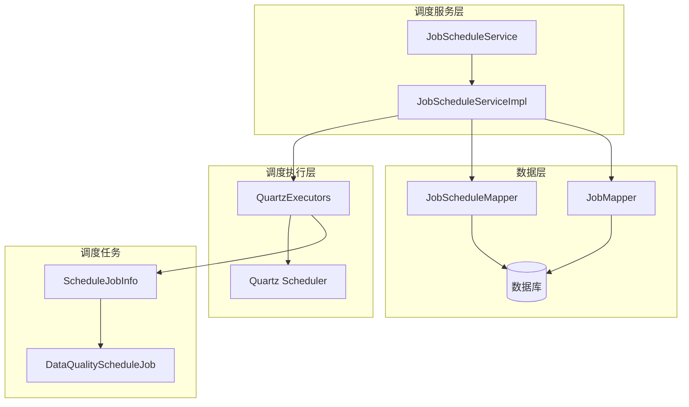
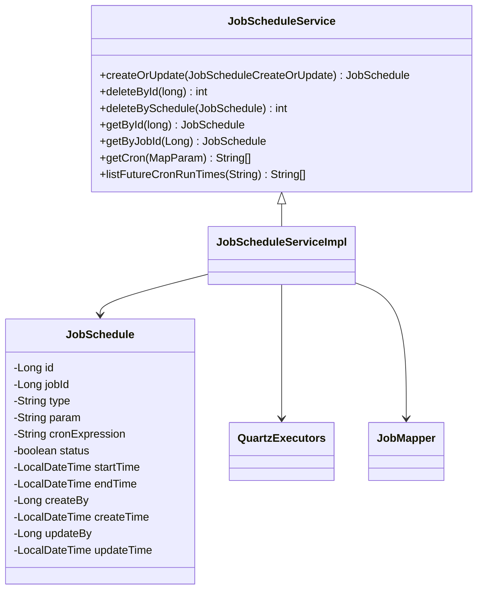
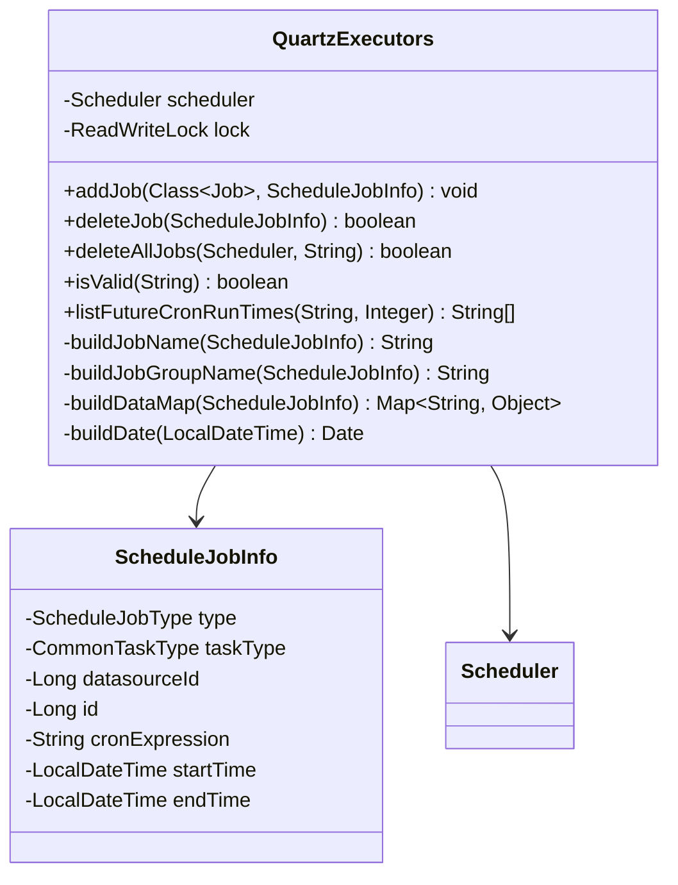
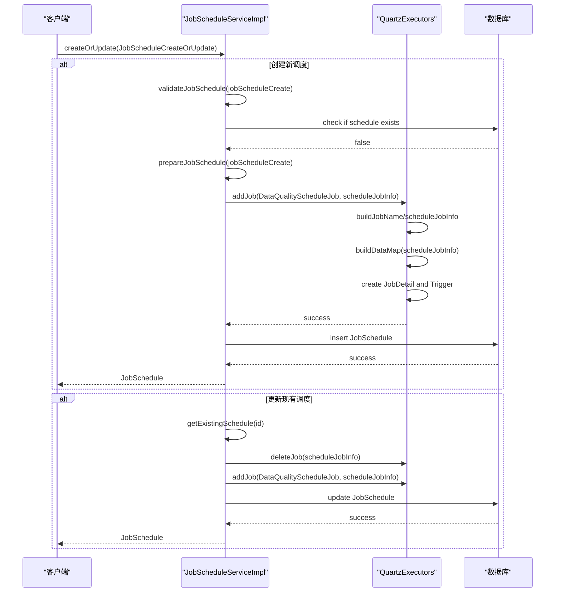
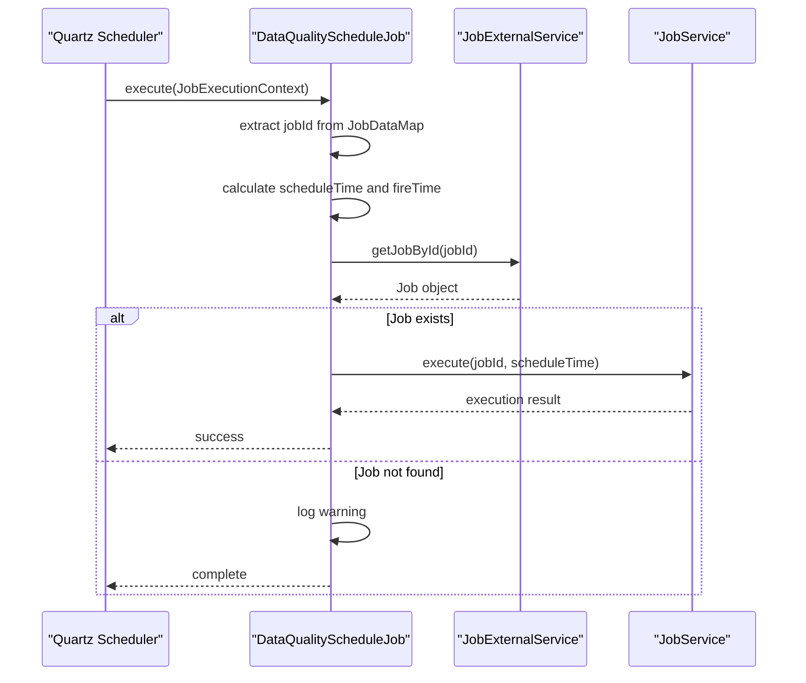
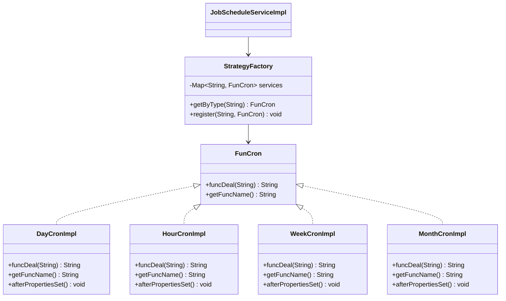
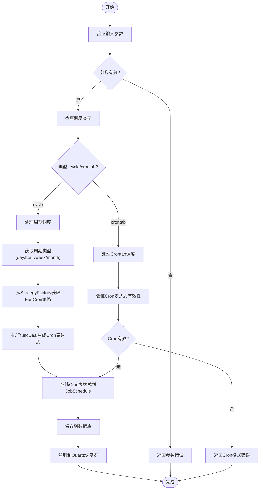
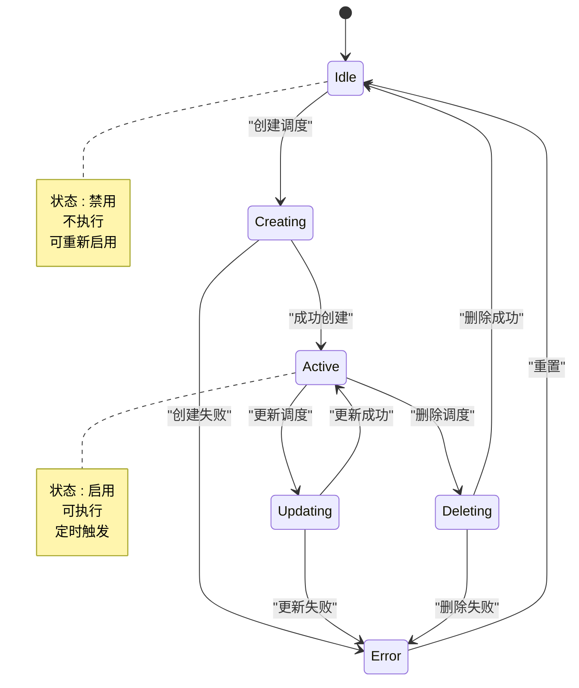

# 调度服务实现

<cite>
**本文档引用的文件**  
- [JobScheduleService.java](file://datavines-server\src\main\java\io\datavines\server\repository\service\JobScheduleService.java)
- [JobScheduleServiceImpl.java](file://datavines-server\src\main\java\io\datavines\server\repository\service\impl\JobScheduleServiceImpl.java)
- [QuartzExecutors.java](file://datavines-server\src\main\java\io\datavines\server\dqc\coordinator\quartz\QuartzExecutors.java)
- [JobSchedule.java](file://datavines-server\src\main\java\io\datavines\server\repository\entity\JobSchedule.java)
- [ScheduleJobInfo.java](file://datavines-server\src\main\java\io\datavines\server\dqc\coordinator\quartz\ScheduleJobInfo.java)
- [DataQualityScheduleJob.java](file://datavines-server\src\main\java\io\datavines\server\dqc\coordinator\quartz\DataQualityScheduleJob.java)
- [JobScheduleType.java](file://datavines-server\src\main\java\io\datavines\server\enums\JobScheduleType.java)
- [FunCron.java](file://datavines-server\src\main\java\io\datavines\server\dqc\coordinator\quartz\cron\FunCron.java)
- [StrategyFactory.java](file://datavines-server\src\main\java\io\datavines\server\dqc\coordinator\quartz\cron\StrategyFactory.java)
- [DayCronImpl.java](file://datavines-server\src\main\java\io\datavines\server\dqc\coordinator\quartz\cron\impl\DayCronImpl.java)
</cite>

## 目录
1. [简介](#简介)
2. [核心组件](#核心组件)
3. [架构概述](#架构概述)
4. [详细组件分析](#详细组件分析)
5. [调度流程分析](#调度流程分析)
6. [Cron表达式处理机制](#cron表达式处理机制)
7. [调度状态管理](#调度状态管理)
8. [高并发场景优化建议](#高并发场景优化建议)

## 简介
本文档详细解析基于Quartz的作业调度系统实现，涵盖定时任务的创建、暂停、恢复和删除操作。文档深入阐述了Cron表达式验证、调度状态管理和触发器配置的业务逻辑，以及JobScheduleServiceImpl如何与Quartz调度器交互。同时描述了调度任务与作业实例的映射关系，以及调度失败的重试机制和告警通知集成。

## 核心组件

JobScheduleService服务是DataVines平台中负责管理数据质量检查任务调度的核心组件。该服务基于Quartz调度框架实现，提供了完整的定时任务管理功能，包括任务的创建、更新、删除和状态管理。服务通过JobSchedule实体与数据库交互，存储调度配置信息，并通过QuartzExecutors与底层调度引擎通信。

**本文档引用的文件**  
- [JobScheduleService.java](file://datavines-server\src\main\java\io\datavines\server\repository\service\JobScheduleService.java)
- [JobSchedule.java](file://datavines-server\src\main\java\io\datavines\server\repository\entity\JobSchedule.java)

## 架构概述

**图示来源**  
- [JobScheduleServiceImpl.java](file://datavines-server\src\main\java\io\datavines\server\repository\service\impl\JobScheduleServiceImpl.java)
- [QuartzExecutors.java](file://datavines-server\src\main\java\io\datavines\server\dqc\coordinator\quartz\QuartzExecutors.java)
- [ScheduleJobInfo.java](file://datavines-server\src\main\java\io\datavines\server\dqc\coordinator\quartz\ScheduleJobInfo.java)

## 详细组件分析

### JobScheduleService 分析

JobScheduleService接口定义了调度服务的核心操作，包括创建、更新、删除调度任务以及获取调度信息。服务通过JobSchedule实体类与数据库交互，存储调度配置的详细信息。

**图示来源**  
- [JobScheduleService.java](file://datavines-server\src\main\java\io\datavines\server\repository\service\JobScheduleService.java)
- [JobSchedule.java](file://datavines-server\src\main\java\io\datavines\server\repository\entity\JobSchedule.java)

**本文档引用的文件**  
- [JobScheduleService.java](file://datavines-server\src\main\java\io\datavines\server\repository\service\JobScheduleService.java)
- [JobSchedule.java](file://datavines-server\src\main\java\io\datavines\server\repository\entity\JobSchedule.java)

### QuartzExecutors 分析

QuartzExecutors是Quartz调度器的封装类，负责与底层调度引擎交互。它提供了添加、删除和查询调度任务的功能，并处理了时区转换等复杂逻辑。

**图示来源**  
- [QuartzExecutors.java](file://datavines-server\src\main\java\io\datavines\server\dqc\coordinator\quartz\QuartzExecutors.java)
- [ScheduleJobInfo.java](file://datavines-server\src\main\java\io\datavines\server\dqc\coordinator\quartz\ScheduleJobInfo.java)

**本文档引用的文件**  
- [QuartzExecutors.java](file://datavines-server\src\main\java\io\datavines\server\dqc\coordinator\quartz\QuartzExecutors.java)
- [ScheduleJobInfo.java](file://datavines-server\src\main\java\io\datavines\server\dqc\coordinator\quartz\ScheduleJobInfo.java)

## 调度流程分析

### 调度任务创建流程

**图示来源**  
- [JobScheduleServiceImpl.java](file://datavines-server\src\main\java\io\datavines\server\repository\service\impl\JobScheduleServiceImpl.java)
- [QuartzExecutors.java](file://datavines-server\src\main\java\io\datavines\server\dqc\coordinator\quartz\QuartzExecutors.java)

**本文档引用的文件**  
- [JobScheduleServiceImpl.java](file://datavines-server\src\main\java\io\datavines\server\repository\service\impl\JobScheduleServiceImpl.java)
- [QuartzExecutors.java](file://datavines-server\src\main\java\io\datavines\server\dqc\coordinator\quartz\QuartzExecutors.java)

### 调度任务执行流程

**图示来源**  
- [DataQualityScheduleJob.java](file://datavines-server\src\main\java\io\datavines\server\dqc\coordinator\quartz\DataQualityScheduleJob.java)
- [JobExternalService.java](file://datavines-server\src\main\java\io\datavines\server\repository\service\impl\JobExternalService.java)

**本文档引用的文件**  
- [DataQualityScheduleJob.java](file://datavines-server\src\main\java\io\datavines\server\dqc\coordinator\quartz\DataQualityScheduleJob.java)

## Cron表达式处理机制

### Cron表达式生成策略

**图示来源**  
- [FunCron.java](file://datavines-server\src\main\java\io\datavines\server\dqc\coordinator\quartz\cron\FunCron.java)
- [StrategyFactory.java](file://datavines-server\src\main\java\io\datavines\server\dqc\coordinator\quartz\cron\StrategyFactory.java)
- [DayCronImpl.java](file://datavines-server\src\main\java\io\datavines\server\dqc\coordinator\quartz\cron\impl\DayCronImpl.java)

**本文档引用的文件**  
- [FunCron.java](file://datavines-server\src\main\java\io\datavines\server\dqc\coordinator\quartz\cron\FunCron.java)
- [StrategyFactory.java](file://datavines-server\src\main\java\io\datavines\server\dqc\coordinator\quartz\cron\StrategyFactory.java)
- [DayCronImpl.java](file://datavines-server\src\main\java\io\datavines\server\dqc\coordinator\quartz\cron\impl\DayCronImpl.java)

### Cron表达式处理流程

**图示来源**  
- [JobScheduleServiceImpl.java](file://datavines-server\src\main\java\io\datavines\server\repository\service\impl\JobScheduleServiceImpl.java)
- [QuartzExecutors.java](file://datavines-server\src\main\java\io\datavines\server\dqc\coordinator\quartz\QuartzExecutors.java)

**本文档引用的文件**  
- [JobScheduleServiceImpl.java](file://datavines-server\src\main\java\io\datavines\server\repository\service\impl\JobScheduleServiceImpl.java)
- [QuartzExecutors.java](file://datavines-server\src\main\java\io\datavines\server\dqc\coordinator\quartz\QuartzExecutors.java)

## 调度状态管理

### 调度状态转换

**图示来源**  
- [JobSchedule.java](file://datavines-server\src\main\java\io\datavines\server\repository\entity\JobSchedule.java)
- [JobScheduleServiceImpl.java](file://datavines-server\src\main\java\io\datavines\server\repository\service\impl\JobScheduleServiceImpl.java)

**本文档引用的文件**  
- [JobSchedule.java](file://datavines-server\src\main\java\io\datavines\server\repository\entity\JobSchedule.java)
- [JobScheduleServiceImpl.java](file://datavines-server\src\main\java\io\datavines\server\repository\service\impl\JobScheduleServiceImpl.java)

## 高并发场景优化建议

### 集群部署与分布式锁

在高并发场景下，为确保调度服务的稳定性和可靠性，建议采用以下优化策略：

1. **集群部署**：将调度服务部署在多个节点上，通过负载均衡分发请求，提高系统的可用性和容错能力。
2. **分布式锁**：使用Redis或Zookeeper实现分布式锁，确保在集群环境下同一调度任务不会被重复执行。
3. **任务分片策略**：对于大规模数据处理任务，采用任务分片策略，将大任务拆分为多个小任务并行执行，提高处理效率。
4. **数据库连接池优化**：配置合理的数据库连接池参数，避免因连接数过多导致数据库性能下降。
5. **Quartz集群模式**：启用Quartz的集群模式，通过数据库表实现节点间的协调，确保任务在集群中只执行一次。

这些优化策略可以有效提升调度服务在高并发场景下的性能和稳定性，确保数据质量检查任务能够按时准确执行。

**本文档引用的文件**  
- [QuartzExecutors.java](file://datavines-server\src\main\java\io\datavines\server\dqc\coordinator\quartz\QuartzExecutors.java)
- [JobScheduleServiceImpl.java](file://datavines-server\src\main\java\io\datavines\server\repository\service\impl\JobScheduleServiceImpl.java)