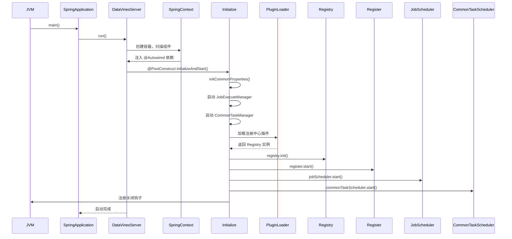
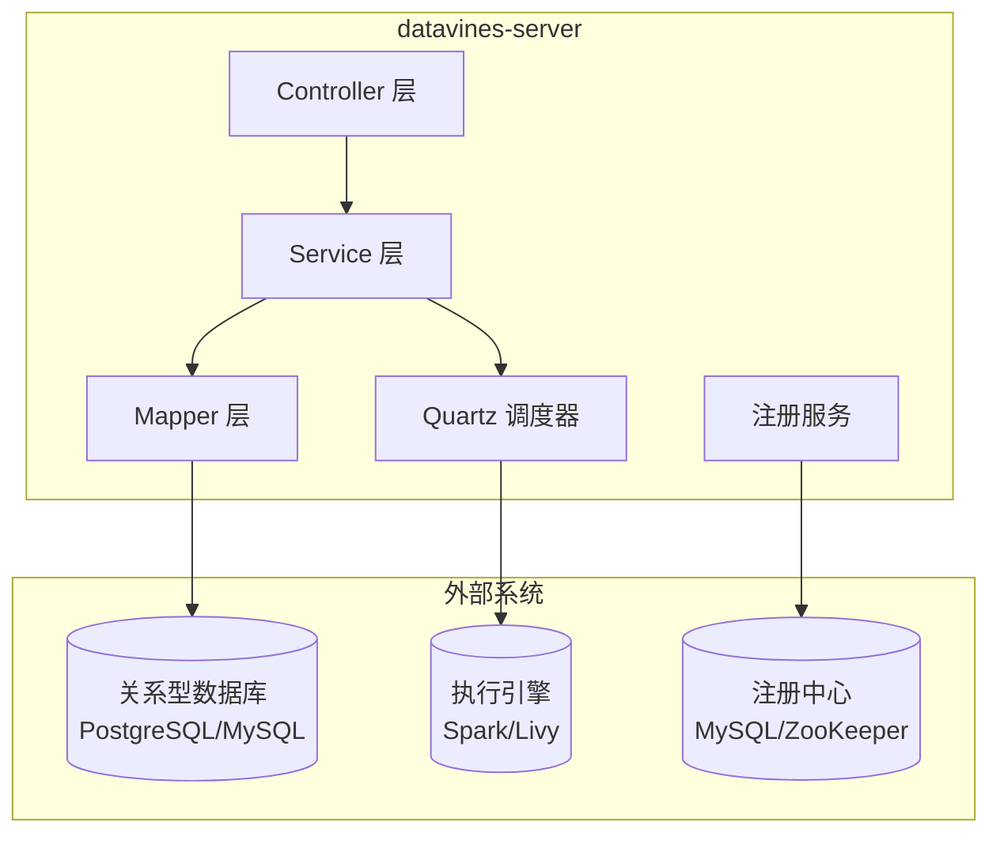
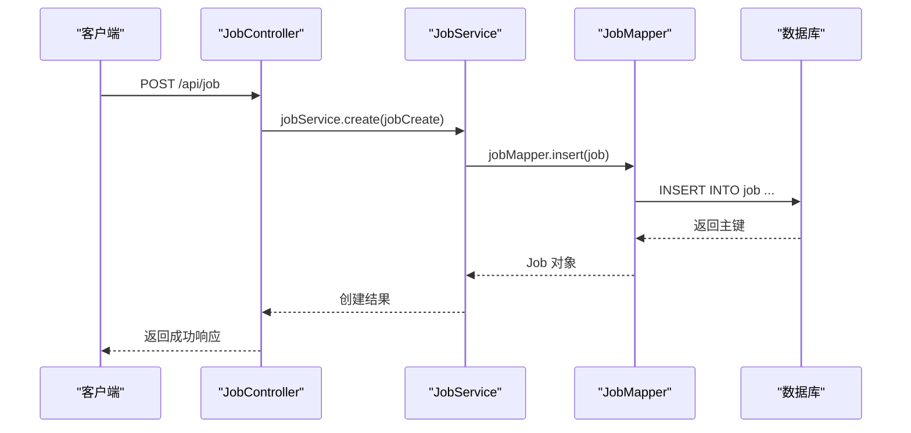

# 架构设计

<cite>
**本文档引用的文件**   
- [DataVinesServer.java](file://datavines-server/src/main/java/io/datavines/server/DataVinesServer.java)
- [application.yaml](file://datavines-server/src/main/resources/application.yaml)
- [JacksonConfig.java](file://datavines-server/src/main/java/io/datavines/server/config/JacksonConfig.java)
- [DataVinesSwaggerConfig.java](file://datavines-server/src/main/java/io/datavines/server/api/config/DataVinesSwaggerConfig.java)
- [WebMvcConfig.java](file://datavines-server/src/main/java/io/datavines/server/api/config/WebMvcConfig.java)
- [MybatisPlusConfig.java](file://datavines-server/src/main/java/io/datavines/server/api/config/MybatisPlusConfig.java)
- [SpringApplicationContext.java](file://datavines-server/src/main/java/io/datavines/server/utils/SpringApplicationContext.java)
- [Register.java](file://datavines-server/src/main/java/io/datavines/server/registry/Register.java)
- [CommonTaskScheduler.java](file://datavines-server/src/main/java/io/datavines/server/scheduler/CommonTaskScheduler.java)
</cite>

## 目录
1. [引言](#引言)
2. [技术栈与分层架构](#技术栈与分层架构)
3. [应用启动流程](#应用启动流程)
4. [核心配置文件分析](#核心配置文件分析)
5. [组件扫描与配置加载机制](#组件扫描与配置加载机制)
6. [序列化与API文档配置](#序列化与api文档配置)
7. [数据访问与持久化配置](#数据访问与持久化配置)
8. [系统上下文与组件交互](#系统上下文与组件交互)
9. [性能调优建议](#性能调优建议)
10. [常见配置问题解决方案](#常见配置问题解决方案)

## 引言

DataVines Server 是一个基于 Spring Boot 构建的微服务应用，作为数据质量监控平台的核心服务组件，负责处理数据质量检查、任务调度、元数据管理等核心功能。该服务采用典型的分层架构设计，通过 Spring Boot 的自动配置和依赖注入机制，实现了与数据库、执行引擎和注册中心的集成。本文档详细阐述了 datavines-server 模块的架构设计，包括应用的启动流程、配置加载机制、核心配置项以及与外部系统的集成方式。

## 技术栈与分层架构

datavines-server 模块构建于成熟的 Java 技术栈之上，采用标准的 Controller-Service-Mapper 分层架构模式，确保了代码的清晰性和可维护性。

**技术栈**:
- **核心框架**: Spring Boot 2.x
- **Web 服务器**: Jetty (替代默认的 Tomcat)
- **数据库连接池**: HikariCP
- **ORM 框架**: MyBatis Plus
- **任务调度**: Quartz
- **API 文档**: Swagger (Springfox)
- **注册中心**: 支持 MySQL 和 ZooKeeper
- **日志框架**: Logback
- **JSON 处理**: Jackson

**分层架构与各层职责**:
- **Controller 层**: 位于 `io.datavines.server.api.controller` 包下，负责接收 HTTP 请求，进行参数校验和基本的数据转换，然后调用 Service 层处理业务逻辑。该层通过 `@RestController` 和 `@RequestMapping` 等注解暴露 RESTful API。
- **Service 层**: 位于 `io.datavines.server.repository.service` 包下，是业务逻辑的核心。它封装了具体的业务规则和流程，协调多个 Mapper 操作，并处理事务。Service 层为 Controller 层提供粗粒度的服务接口。
- **Mapper 层**: 位于 `io.datavines.server.repository.mapper` 包下，是数据访问层。它通过 MyBatis Plus 的 Mapper 接口与数据库进行交互，执行 CRUD 操作。该层直接与数据库表映射，屏蔽了底层 SQL 的复杂性。

这种分层架构实现了关注点分离，使得各层职责明确，便于团队协作开发和单元测试。

**Section sources**
- [DataVinesServer.java](file://datavines-server/src/main/java/io/datavines/server/DataVinesServer.java#L48-L50)
- [pom.xml](file://datavines-server/pom.xml#L35-L589)

## 应用启动流程

datavines-server 的启动流程由 `DataVinesServer` 主类驱动，遵循 Spring Boot 的生命周期，并在此基础上扩展了自定义的初始化逻辑。

1.  **JVM 启动**: JVM 执行 `DataVinesServer` 类的 `main` 方法。
2.  **Spring Boot 启动**: 调用 `SpringApplication.run(DataVinesServer.class)`，触发 Spring Boot 的自动配置过程。Spring 容器开始扫描带有 `@SpringBootApplication` 注解的类及其 `scanBasePackages` 指定的包（`io.datavines`）下的所有组件。
3.  **组件注入**: Spring 容器创建并管理所有被 `@Component`, `@Service`, `@Repository`, `@Controller` 等注解标记的 Bean，包括 `SpringApplicationContext`, `Environment`, `RegistryHolder` 等。
4.  **执行初始化方法**: 当所有必需的 Bean 都被注入后，Spring 容器会回调被 `@PostConstruct` 注解标记的方法 `initializeAndStart()`。
5.  **自定义初始化**:
    - **初始化公共属性**: `initCommonProperties()` 方法从 Spring 的 `DataSource` 中读取数据库连接信息（URL, 用户名, 密码, 驱动），并将其存入 `CommonPropertyUtils` 的静态配置中，供后续模块使用。
    - **启动核心管理器**: 创建并启动 `JobExecuteManager` 和 `CommonTaskManager`，它们负责管理作业执行和通用任务。
    - **初始化注册中心**: 使用 `PluginLoader` SPI 机制，根据配置动态加载并初始化注册中心实现（如 MySQL 或 ZooKeeper）。
    - **启动注册服务**: 创建 `Register` 实例并调用其 `start()` 方法，向注册中心注册本服务实例，并开始监听集群事件（如节点上下线）。
    - **启动调度器**: 启动 `JobScheduler` 和 `CommonTaskScheduler`，使系统具备调度和执行数据质量检查作业的能力。
6.  **注册关闭钩子**: 通过 `Runtime.getRuntime().addShutdownHook()` 注册一个 JVM 关闭钩子，确保在服务优雅关闭时，能够正确释放数据库连接、关闭注册中心会话等资源。

这个流程确保了服务在完全初始化后才开始提供服务，并且在关闭时能够清理资源，避免数据丢失或连接泄漏。



**Diagram sources **
- [DataVinesServer.java](file://datavines-server/src/main/java/io/datavines/server/DataVinesServer.java#L69-L110)
- [DataVinesServer.java](file://datavines-server/src/main/java/io/datavines/server/DataVinesServer.java#L141-L157)

## 核心配置文件分析

`application.yaml` 是 datavines-server 的核心配置文件，定义了应用运行所需的各种参数。

```yaml
spring:
  main:
    banner-mode: off
    allow-circular-references: true
  application:
    name: datavines-server
  datasource:
    driver-class-name: org.postgresql.Driver
    url: jdbc:postgresql://127.0.0.1:5432/datavines
    username: postgres
    password: 123456
    hikari:
      connection-test-query: select 1
      minimum-idle: 5
      auto-commit: true
      validation-timeout: 3000
      pool-name: datavines
      maximum-pool-size: 50
      connection-timeout: 30000
      idle-timeout: 600000
      leak-detection-threshold: 0
      initialization-fail-timeout: 1
  quartz:
    job-store-type: jdbc
    jdbc:
      initialize-schema: never
    properties:
      org.quartz.threadPool.threadPriority: 5
      org.quartz.jobStore.isClustered: true
      org.quartz.jobStore.class: org.springframework.scheduling.quartz.LocalDataSourceJobStore
      org.quartz.scheduler.instanceId: AUTO
      org.quartz.jobStore.tablePrefix: QRTZ_
      org.quartz.jobStore.acquireTriggersWithinLock: true
      org.quartz.scheduler.instanceName: datavines
      org.quartz.threadPool.class: org.quartz.simpl.SimpleThreadPool
      org.quartz.jobStore.useProperties: false
      org.quartz.threadPool.makeThreadsDaemons: true
      org.quartz.threadPool.threadCount: 25
      org.quartz.jobStore.misfireThreshold: 60000
      org.quartz.scheduler.batchTriggerAcquisitionMaxCount: 1
      org.quartz.scheduler.makeSchedulerThreadDaemon: true
      org.quartz.jobStore.driverDelegateClass: org.quartz.impl.jdbcjobstore.PostgreSQLDelegate
      org.quartz.jobStore.clusterCheckinInterval: 5000
  mvc:
    pathmatch:
      matching-strategy: ant_path_matcher

mybatis-plus:
  type-enums-package: io.datavines.*.enums

server:
  port: 5600

management:
  endpoints:
    web:
      exposure:
        include: '*'
  metrics:
    tags:
      application: ${spring.application.name}

logging:
  config: classpath:server-logback.xml
---
spring:
  config:
    activate:
      on-profile: mysql
  datasource:
    driver-class-name: com.mysql.cj.jdbc.Driver
    url: jdbc:mysql://127.0.0.1:3306/datavines?useUnicode=true&characterEncoding=UTF-8&useSSL=false&serverTimezone=Asia/Shanghai
    username: root
    password: 123456
  quartz:
    properties:
      org.quartz.jobStore.driverDelegateClass: org.quartz.impl.jdbcjobstore.StdJDBCDelegate
```

**关键配置项说明**:
- **`spring.application.name`**: 定义了应用的名称，用于服务发现和监控。
- **`spring.datasource`**: 配置了主数据源，用于存储应用的元数据和状态信息。默认使用 PostgreSQL，通过 `---` 分隔符定义了 `mysql` 配置文件，可通过激活 profile 切换数据库。
- **`spring.datasource.hikari`**: HikariCP 连接池的详细配置。`maximum-pool-size: 50` 设置了最大连接数，`idle-timeout: 600000` (10分钟) 定义了连接在池中空闲的最长时间。
- **`server.port`**: 指定了应用监听的端口号，这里是 5600。
- **`spring.quartz`**: 配置了 Quartz 调度框架。`job-store-type: jdbc` 表明使用数据库作为任务存储，`org.quartz.jobStore.isClustered: true` 启用了集群模式，允许多个 datavines-server 实例协同工作。`threadCount: 25` 设置了调度线程池的大小。
- **`management.endpoints.web.exposure.include: '*'`**: 开启了所有 Spring Boot Actuator 端点，便于监控应用的健康状况、指标等。
- **`logging.config`**: 指定了日志配置文件 `server-logback.xml` 的位置。

**Section sources**
- [application.yaml](file://datavines-server/src/main/resources/application.yaml#L1-L96)

## 组件扫描与配置加载机制

datavines-server 的组件扫描和配置加载机制是其模块化和可扩展性的基础。

**组件扫描**:
组件扫描由 `@SpringBootApplication` 注解驱动。该注解是一个组合注解，包含了 `@ComponentScan`。在 `DataVinesServer` 类上，`@SpringBootApplication` 显式指定了 `scanBasePackages = {"io.datavines"}`。这意味着 Spring 容器在启动时，会自动扫描 `io.datavines` 包及其所有子包下的类，寻找带有 `@Component`, `@Service`, `@Repository`, `@Controller` 等注解的类，并将它们注册为 Spring Bean。例如，`LoginController`、`JobService` 和 `JobMapper` 都会被自动发现和管理。

**配置加载机制**:
配置加载是一个多层级的过程：
1.  **外部配置文件**: `application.yaml` 是主要的配置来源。Spring Boot 会按特定顺序（如命令行参数、`application.yaml`、环境变量等）加载配置，并将它们注入到带有 `@Value` 或通过 `Environment` 对象访问的 Bean 中。
2.  **运行时动态配置**: 除了静态的 `application.yaml`，系统还支持运行时动态更新配置。`Register` 类在启动时会从数据库的 `config` 表中加载所有配置项 (`configService.listConfig()`)，并使用 `CommonPropertyUtils.setValue()` 将这些配置注入到全局的静态配置中。这使得管理员可以在不重启服务的情况下，通过管理界面修改某些运行时参数。
3.  **SPI 扩展机制**: 对于注册中心等可插拔的组件，系统使用了自研的 SPI (Service Provider Interface) 机制。`PluginLoader` 类负责根据配置的类型（如 `registry.type=mysql`）去查找并加载对应的实现类（如 `datavines-registry-mysql` 模块中的实现）。这实现了核心逻辑与具体实现的解耦。

这种机制结合了 Spring Boot 的自动配置能力和自定义的动态配置，提供了极大的灵活性。

**Section sources**
- [DataVinesServer.java](file://datavines-server/src/main/java/io/datavines/server/DataVinesServer.java#L48-L50)
- [Register.java](file://datavines-server/src/main/java/io/datavines/server/registry/Register.java#L78-L85)
- [PluginLoader.java](file://datavines-spi/src/main/java/io/datavines/spi/PluginLoader.java)

## 序列化与API文档配置

### Jackson 序列化配置

为了确保在前后端交互中大数值的精度不丢失，datavines-server 配置了特定的 Jackson 序列化规则。

`JacksonConfig` 类通过 `@Configuration` 注解定义了一个配置类，并提供了一个名为 `jacksonLongToString` 的 `Bean`。该 Bean 是一个 `Jackson2ObjectMapperBuilderCustomizer`，它会定制 Spring Boot 创建的 `ObjectMapper`。其核心作用是将 `Long`, `long`, `BigInteger`, `BigDecimal` 等大数值类型序列化为 JSON 字符串，而不是数字。这是因为 JavaScript 的 Number 类型有精度限制，当处理超过其安全整数范围（`Number.MAX_SAFE_INTEGER`）的长整型时，可能会发生精度丢失。通过序列化为字符串，前端可以安全地处理这些大数值。

```java
@Bean
public Jackson2ObjectMapperBuilderCustomizer jacksonLongToString() {
    return builder -> {
        builder.serializerByType(Long.class, ToStringSerializer.instance);
        builder.serializerByType(long.class, ToStringSerializer.instance);
        builder.serializerByType(BigInteger.class, ToStringSerializer.instance);
        builder.serializerByType(BigDecimal.class, ToStringSerializer.instance);
    };
}
```

**Section sources**
- [JacksonConfig.java](file://datavines-server/src/main/java/io/datavines/server/config/JacksonConfig.java#L27-L44)

### Swagger API 文档集成

datavines-server 集成了 Swagger (通过 Springfox) 来自动生成和提供 RESTful API 文档。

`DataVinesSwaggerConfig` 类是一个配置类，它创建了一个 `Docket` Bean。这个 `Docket` Bean 定义了 Swagger 文档的生成规则：
- **`DocumentationType.SWAGGER_2`**: 指定使用 Swagger 2.0 规范。
- **`apis(RequestHandlerSelectors.basePackage("io.datavines.server.api.controller"))`**: 指定只扫描 `io.datavines.server.api.controller` 包下的控制器来生成 API 文档。
- **`securitySchemes` 和 `securityContexts`**: 配置了基于 `Authorization` 头的 API 密钥认证，允许在 Swagger UI 中方便地进行需要认证的 API 调用测试。
- **`apiInfo()`**: 定义了文档的元信息，如标题 "DataVines Api Docs"。

集成后，可以通过访问 `/swagger-ui.html` 路径来查看和测试所有公开的 API。

**Section sources**
- [DataVinesSwaggerConfig.java](file://datavines-server/src/main/java/io/datavines/server/api/config/DataVinesSwaggerConfig.java#L38-L72)

### Web MVC 配置

`WebMvcConfig` 类实现了 `WebMvcConfigurer` 接口，用于自定义 Spring MVC 的行为。

该配置类主要做了以下几件事：
1.  **注册拦截器**: 通过 `addInterceptors` 方法注册了 `AuthenticationInterceptor` 拦截器。该拦截器对所有以 `/api/` 开头的请求路径进行认证检查，但排除了 `/api/login` 路径，确保登录接口可以匿名访问。
2.  **配置静态资源**: 通过 `addResourceHandlers` 方法，将 Swagger UI 的静态资源（如 `swagger-ui.html` 和 `/webjars/**`）以及应用自身的静态资源（如前端页面）映射到正确的类路径位置。
3.  **配置视图控制器**: 通过 `addViewControllers` 方法，将根路径 `/` 直接映射到 `index.html`，这是单页应用（SPA）的常见做法。
4.  **配置跨域 (CORS)**: 通过 `corsFilter` Bean 配置了全局的 CORS 策略，允许所有来源 (`*`) 访问，允许所有头和方法，并支持凭据（如 Cookie），这对于前后端分离的架构至关重要。
5.  **配置国际化**: 通过 `localeResolver` Bean 配置了基于 Cookie 的区域解析器，支持多语言。

```java
@Override
public void addInterceptors(InterceptorRegistry registry) {
    registry.addInterceptor(loginRequiredInterceptor())
            .addPathPatterns(DataVinesConstants.BASE_API_PATH + "/**")
            .excludePathPatterns(DataVinesConstants.BASE_API_PATH + "/login");
}
```

**Section sources**
- [WebMvcConfig.java](file://datavines-server/src/main/java/io/datavines/server/api/config/WebMvcConfig.java#L35-L100)

## 数据访问与持久化配置

### MyBatis Plus 配置

datavines-server 使用 MyBatis Plus 作为 ORM 框架，简化了数据库操作。

`MybatisPlusConfig` 配置类通过 `@Configuration` 注解定义，并提供了一个 `MybatisPlusInterceptor` Bean。该拦截器是 MyBatis Plus 的核心，用于添加各种功能插件。

目前，该配置主要添加了分页插件 `PaginationInnerInterceptor`，并指定了数据库类型为 `DbType.MYSQL`。虽然主数据源默认是 PostgreSQL，但分页插件的 SQL 生成逻辑可能依赖于此配置。MyBatis Plus 的分页插件可以自动将内存分页转换为数据库的 `LIMIT` 语句，极大地简化了分页查询的代码。

```java
@Bean
public MybatisPlusInterceptor mybatisPlusInterceptor() {
    MybatisPlusInterceptor interceptor = new MybatisPlusInterceptor();
    interceptor.addInnerInterceptor(new PaginationInnerInterceptor(DbType.MYSQL));
    return interceptor;
}
```

**Section sources**
- [MybatisPlusConfig.java](file://datavines-server/src/main/java/io/datavines/server/api/config/MybatisPlusConfig.java#L25-L34)

### 数据库集成

datavines-server 通过 Spring Boot 的 `spring.datasource` 配置与关系型数据库（PostgreSQL/MySQL）集成。应用启动时，Spring Boot 会自动配置一个 `DataSource` Bean（默认是 HikariCP），并将其注入到 `SqlSessionFactory` 中，从而完成 MyBatis Plus 的初始化。

此外，系统还通过 `datavines-common` 模块中的 `JdbcDataSourceManager` 管理用户数据源的连接。当需要连接用户的数据库（如 MySQL, Oracle）来执行数据质量检查时，`JdbcDataSourceManager` 会根据用户提供的连接信息，创建并缓存一个独立的 HikariCP 连接池，以保证连接的安全和高效复用。

**Section sources**
- [application.yaml](file://datavines-server/src/main/resources/application.yaml#L23-L39)
- [JdbcDataSourceManager.java](file://datavines-common/src/main/java/io/datavines/common/datasource/jdbc/JdbcDataSourceManager.java#L84-L143)

## 系统上下文与组件交互

### 系统上下文图

datavines-server 作为核心服务，与多个外部系统紧密集成。



**说明**:
- **数据库 (DB)**: 存储 datavines-server 自身的元数据，如用户信息、作业定义、执行历史等。通过 `spring.datasource` 配置连接。
- **执行引擎 (ExecutionEngine)**: datavines-server 负责调度作业，但实际的数据质量检查任务是在外部的执行引擎（如 Spark 集群）上运行的。server 通过 `datavines-engine-executor` 模块提交任务。
- **注册中心 (Registry)**: 用于服务发现和集群协调。当部署多个 datavines-server 实例时，它们通过注册中心感知彼此的存在，实现高可用和故障转移。

### 组件交互图

以下是 `JobController` 接收一个创建作业请求后，各组件之间的交互流程。



**说明**:
1.  客户端发送创建作业的 HTTP 请求。
2.  `JobController` 接收请求，调用 `JobService` 的 `create` 方法。
3.  `JobService` 处理业务逻辑，调用 `JobMapper` 的 `insert` 方法。
4.  `JobMapper` 执行 SQL 插入语句，将作业信息写入数据库。
5.  数据库返回插入结果，`JobMapper` 将其封装为 `Job` 对象返回给 `JobService`。
6.  `JobService` 将结果返回给 `JobController`，最终由 `JobController` 返回给客户端。

**Diagram sources **
- [系统上下文图](file://datavines-server/src/main/resources/application.yaml#L23-L27)
- [组件交互图](file://datavines-server/src/main/java/io/datavines/server/api/controller/JobController.java#L47-L48)

## 性能调优建议

1.  **数据库连接池调优**: 根据并发量调整 `spring.datasource.hikari.maximum-pool-size`。如果应用日志中频繁出现获取连接超时，应适当增大该值。同时，确保 `idle-timeout` 和 `max-lifetime` 的设置合理，避免连接因长时间空闲被数据库端关闭。
2.  **Quartz 调度线程池**: `org.quartz.threadPool.threadCount` 决定了并发执行的作业数量。如果发现作业调度延迟，可以适当增加线程数，但需考虑执行引擎的负载能力。
3.  **JVM 参数**: 为 JVM 分配足够的堆内存（`-Xms`, `-Xmx`），并选择合适的垃圾回收器（如 G1GC），以减少 GC 停顿时间。
4.  **SQL 优化**: 定期审查慢查询日志，对 `job`, `job_execution` 等大表的关键字段（如 `datasource_id`, `create_time`）建立索引，以加速分页查询。
5.  **缓存**: 对于频繁读取且不常变更的数据（如配置项、枚举值），可以引入 Redis 等缓存，减少数据库压力。

## 常见配置问题解决方案

1.  **问题**: 启动时报错 `Failed to configure a DataSource`。
    **解决方案**: 检查 `application.yaml` 中的 `spring.datasource.url`, `username`, `password` 是否正确。确认数据库服务已启动，并且网络可达。检查 `driver-class-name` 是否与数据库类型匹配。

2.  **问题**: Swagger UI 无法访问。
    **解决方案**: 确认 `pom.xml` 中已引入 `springfox-boot-starter` 依赖。检查 `DataVinesSwaggerConfig` 类是否被正确扫描。确认访问路径是否为 `/swagger-ui.html`。

3.  **问题**: 多个 server 实例无法形成集群。
    **解决方案**: 确保所有实例的 `spring.quartz.job-store-type` 都设置为 `jdbc`，并且连接到同一个数据库。检查 `org.quartz.jobStore.isClustered` 是否为 `true`。确认 `registry.type` 配置正确，并且所有实例都能访问注册中心。

4.  **问题**: 作业执行失败，提示连接用户数据源失败。
    **解决方案**: 检查用户在前端配置的数据源连接信息（JDBC URL, 用户名, 密码）是否正确。确认目标数据库的网络防火墙允许来自 datavines-server 的连接。检查数据库的连接数限制。