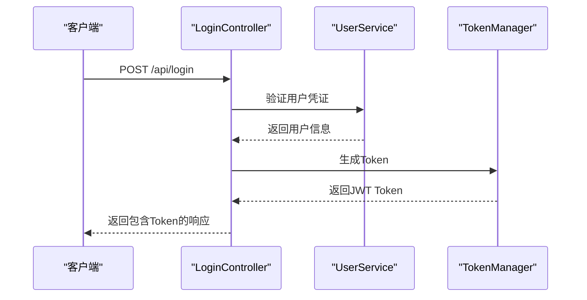
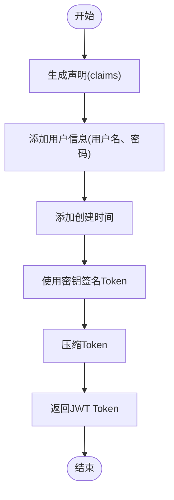
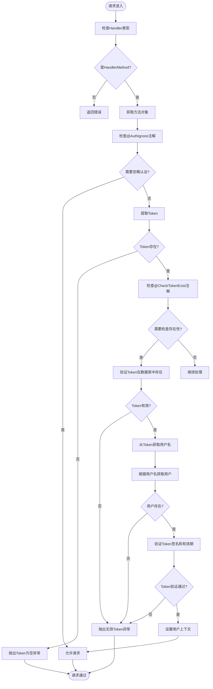
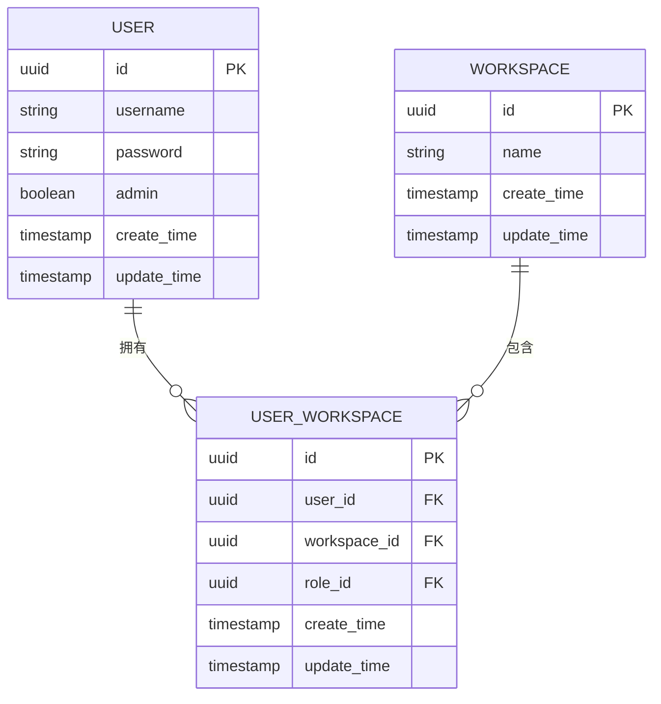
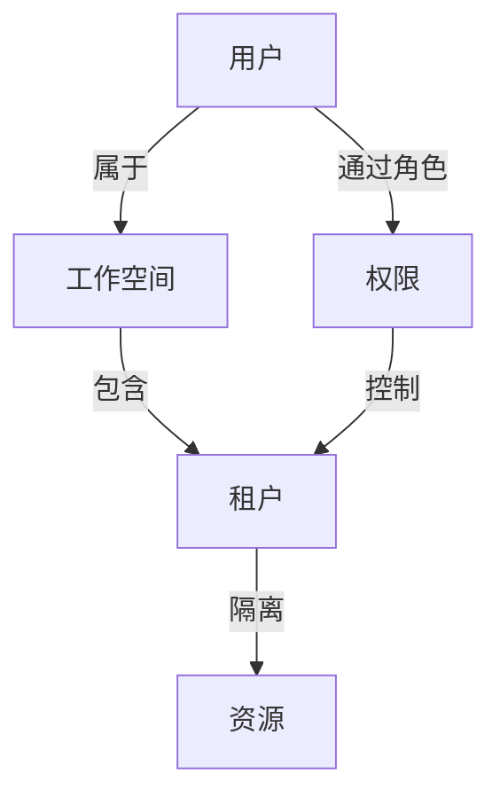
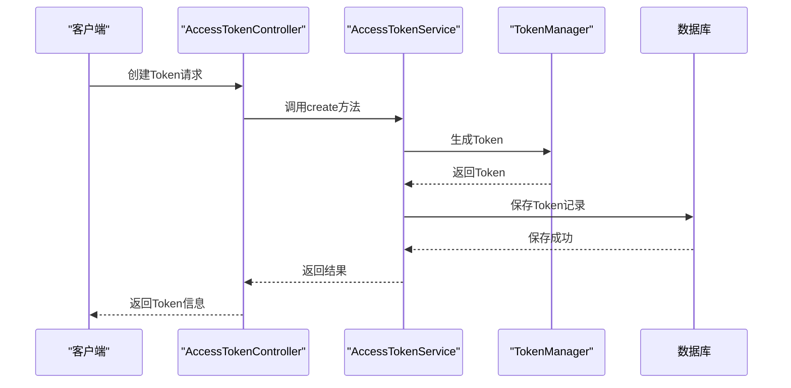
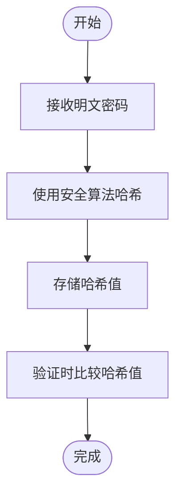
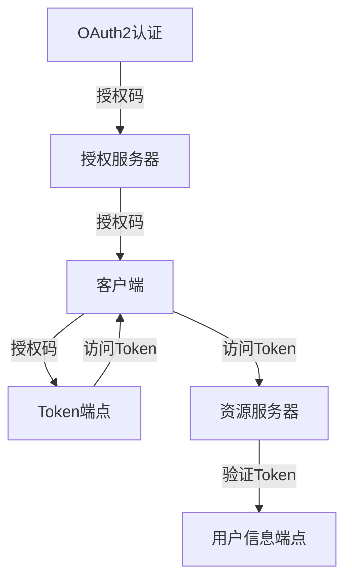

# 认证与权限

<cite>
**本文档引用的文件**  
- [AuthenticationInterceptor.java](file://datavines-server/src/main/java/io/datavines/server/api/inteceptor/AuthenticationInterceptor.java)
- [WebMvcConfig.java](file://datavines-server/src/main/java/io/datavines/server/api/config/WebMvcConfig.java)
- [TokenManager.java](file://datavines-core/src/main/java/io/datavines/core/utils/TokenManager.java)
- [LoginController.java](file://datavines-server/src/main/java/io/datavines/server/api/controller/LoginController.java)
- [AccessTokenService.java](file://datavines-server/src/main/java/io/datavines/server/repository/service/AccessTokenService.java)
- [AccessTokenServiceImpl.java](file://datavines-server/src/main/java/io/datavines/server/repository/service/impl/AccessTokenServiceImpl.java)
- [AccessToken.java](file://datavines-server/src/main/java/io/datavines/server/repository/entity/AccessToken.java)
- [User.java](file://datavines-server/src/main/java/io/datavines/server/repository/entity/User.java)
- [AuthIgnore.java](file://datavines-server/src/main/java/io/datavines/server/api/annotation/AuthIgnore.java)
- [CheckTokenExist.java](file://datavines-server/src/main/java/io/datavines/server/api/annotation/CheckTokenExist.java)
- [RefreshTokenAop.java](file://datavines-core/src/main/java/io/datavines/core/aop/RefreshTokenAop.java)
- [WorkSpace.java](file://datavines-server/src/main/java/io/datavines/server/repository/entity/WorkSpace.java)
- [UserWorkSpace.java](file://datavines-server/src/main/java/io/datavines/server/repository/entity/UserWorkSpace.java)
- [TenantService.java](file://datavines-server/src/main/java/io/datavines/server/repository/service/TenantService.java)
</cite>

## 目录
1. [简介](#简介)
2. [基于Token的用户认证机制](#基于token的用户认证机制)
3. [自定义注解实现原理](#自定义注解实现原理)
4. [全局认证拦截器](#全局认证拦截器)
5. [权限控制模型](#权限控制模型)
6. [AccessToken管理与有效期策略](#accesstoken管理与有效期策略)
7. [安全最佳实践](#安全最佳实践)
8. [扩展认证方式集成](#扩展认证方式集成)

## 简介

DataVines系统的认证与权限体系基于JWT（JSON Web Token）实现，提供了一套完整的用户身份验证和访问控制机制。系统通过Token进行用户身份验证，结合自定义注解和拦截器实现灵活的权限控制。该体系支持用户、工作空间和租户的多层级权限管理，确保系统资源的安全访问。

## 基于Token的用户认证机制

DataVines采用基于JWT的Token认证机制，实现无状态的用户身份验证。认证流程包括登录、Token生成、Token验证和请求认证等环节。

### 登录流程

用户登录流程如下：
1. 用户通过前端界面提交用户名和密码
2. 服务器验证用户凭证的合法性
3. 验证通过后生成JWT Token
4. 将Token返回给客户端
5. 客户端在后续请求中携带Token进行身份验证



**图示来源**
- [LoginController.java](file://datavines-server/src/main/java/io/datavines/server/api/controller/LoginController.java#L53-L58)
- [TokenManager.java](file://datavines-core/src/main/java/io/datavines/core/utils/TokenManager.java#L51-L57)

### Token生成与验证

Token的生成和验证由`TokenManager`类负责，基于JWT标准实现。Token包含用户身份信息和创建时间，并使用密钥进行签名。



**图示来源**
- [TokenManager.java](file://datavines-core/src/main/java/io/datavines/core/utils/TokenManager.java#L51-L130)

Token验证过程包括：
1. 解析Token获取声明信息
2. 验证Token签名的有效性
3. 检查Token是否过期
4. 验证用户名和密码与系统存储的一致性

**本节来源**
- [TokenManager.java](file://datavines-core/src/main/java/io/datavines/core/utils/TokenManager.java#L132-L196)

## 自定义注解实现原理

DataVines通过自定义注解实现灵活的认证控制，主要包括`@AuthIgnore`和`@CheckTokenExist`两个注解。

### @AuthIgnore注解

`@AuthIgnore`注解用于标记不需要认证的方法，通常应用于登录、注册等公共接口。

```java
@Target({ElementType.METHOD})
@Retention(RetentionPolicy.RUNTIME)
public @interface AuthIgnore {
}
```

该注解的实现原理是在`AuthenticationInterceptor`中检查方法是否包含此注解，如果包含则跳过认证流程。

```mermaid
classDiagram
class AuthIgnore {
+@Target({ElementType.METHOD})
+@Retention(RetentionPolicy.RUNTIME)
}
class AuthenticationInterceptor {
+preHandle(HttpServletRequest, HttpServletResponse, Object)
-checkAuthIgnore(Method)
-checkTokenExist(Method)
}
AuthenticationInterceptor --> AuthIgnore : "使用"
```

**图示来源**
- [AuthIgnore.java](file://datavines-server/src/main/java/io/datavines/server/api/annotation/AuthIgnore.java)
- [AuthenticationInterceptor.java](file://datavines-server/src/main/java/io/datavines/server/api/inteceptor/AuthenticationInterceptor.java#L66-L70)

### @CheckTokenExist注解

`@CheckTokenExist`注解用于强制检查Token在数据库中的存在性，确保Token未被撤销。

```java
@Target({ElementType.METHOD})
@Retention(RetentionPolicy.RUNTIME)
public @interface CheckTokenExist {
}
```

当方法被此注解标记时，系统会查询数据库验证Token的有效性，而不仅仅是验证JWT签名。

**本节来源**
- [CheckTokenExist.java](file://datavines-server/src/main/java/io/datavines/server/api/annotation/CheckTokenExist.java)
- [AuthenticationInterceptor.java](file://datavines-server/src/main/java/io/datavines/server/api/inteceptor/AuthenticationInterceptor.java#L72-L87)

## 全局认证拦截器

`AuthenticationInterceptor`是DataVines的核心认证拦截器，负责全局的请求认证处理。

### 拦截器配置

拦截器通过`WebMvcConfig`配置，对所有API路径进行拦截，但排除登录接口。

```java
@Configuration
public class WebMvcConfig implements WebMvcConfigurer {
    
    @Bean
    public AuthenticationInterceptor loginRequiredInterceptor() {
        return new AuthenticationInterceptor();
    }

    @Override
    public void addInterceptors(InterceptorRegistry registry) {
        registry.addInterceptor(loginRequiredInterceptor())
                .addPathPatterns(DataVinesConstants.BASE_API_PATH + "/**")
                .excludePathPatterns(DataVinesConstants.BASE_API_PATH + "/login");
    }
}
```

### 认证流程

拦截器的认证流程如下：



**本节来源**
- [AuthenticationInterceptor.java](file://datavines-server/src/main/java/io/datavines/server/api/inteceptor/AuthenticationInterceptor.java)
- [WebMvcConfig.java](file://datavines-server/src/main/java/io/datavines/server/api/config/WebMvcConfig.java#L43-L48)

## 权限控制模型

DataVines实现了基于用户、工作空间和租户的多层级权限控制模型。

### 用户-工作空间模型

系统采用用户-工作空间关联模型，一个用户可以属于多个工作空间，每个关联记录包含角色信息。



**图示来源**
- [User.java](file://datavines-server/src/main/java/io/datavines/server/repository/entity/User.java)
- [WorkSpace.java](file://datavines-server/src/main/java/io/datavines/server/repository/entity/WorkSpace.java)
- [UserWorkSpace.java](file://datavines-server/src/main/java/io/datavines/server/repository/entity/UserWorkSpace.java)

### 租户权限控制

租户（Tenant）作为工作空间内的资源隔离单位，实现更细粒度的权限控制。



**本节来源**
- [TenantService.java](file://datavines-server/src/main/java/io/datavines/server/repository/service/TenantService.java)
- [WorkSpace.java](file://datavines-server/src/main/java/io/datavines/server/repository/entity/WorkSpace.java)

## AccessToken管理与有效期策略

### AccessToken实体

AccessToken存储在数据库中，包含Token字符串、关联的用户和工作空间、过期时间等信息。

```java
@Data
@TableName("dv_access_token")
public class AccessToken implements Serializable {
    private Long id;
    private Long workspaceId;
    private Long userId;
    private String token;
    private LocalDateTime expireTime;
    private Long createBy;
    private LocalDateTime createTime;
    private Long updateBy;
    private LocalDateTime updateTime;
}
```

### Token有效期策略

系统采用双重有效期控制：
1. JWT Token自身的过期时间
2. 数据库中记录的过期时间

Token创建时，系统会根据请求的过期时间生成JWT Token，并在数据库中记录相应的过期时间。



**本节来源**
- [AccessToken.java](file://datavines-server/src/main/java/io/datavines/server/repository/entity/AccessToken.java)
- [AccessTokenServiceImpl.java](file://datavines-server/src/main/java/io/datavines/server/repository/service/impl/AccessTokenServiceImpl.java)

## 安全最佳实践

### 密码加密

系统在用户注册和登录时对密码进行加密处理，确保密码安全。



**本节来源**
- [User.java](file://datavines-server/src/main/java/io/datavines/server/repository/entity/User.java#L41-L42)

### Token刷新机制

系统通过AOP实现Token自动刷新功能，延长用户会话有效期。

```java
@Aspect
@Component
@Order(Integer.MAX_VALUE)
public class RefreshTokenAop {
    
    @Pointcut("@within(RefreshToken)")
    public void pointCut() {
    }

    @Around(value = "pointCut()")
    public Object doAroundReturningAdvice(ProceedingJoinPoint point) throws Throwable{
        Object[] args = point.getArgs();
        HttpServletRequest request = ((ServletRequestAttributes) RequestContextHolder.getRequestAttributes()).getRequest();
        Object result = point.proceed(args);
        return ResponseEntity.ok(new ResultMap(tokenManager).successAndRefreshToken(request).payload(result));
    }
}
```

**本节来源**
- [RefreshTokenAop.java](file://datavines-core/src/main/java/io/datavines/core/aop/RefreshTokenAop.java)

### 防止会话固定攻击

系统通过以下措施防止会话固定攻击：
1. 每次登录生成新的Token
2. 旧Token立即失效
3. Token绑定用户凭证
4. 支持Token撤销功能

## 扩展认证方式集成

### OAuth2集成指南

虽然当前系统主要使用JWT认证，但架构设计支持OAuth2等扩展认证方式的集成。

集成OAuth2需要实现以下步骤：
1. 添加OAuth2依赖
2. 配置OAuth2客户端
3. 实现OAuth2认证控制器
4. 适配Token生成逻辑
5. 更新拦截器以支持OAuth2 Token



**本节来源**
- [AuthenticationInterceptor.java](file://datavines-server/src/main/java/io/datavines/server/api/inteceptor/AuthenticationInterceptor.java)
- [TokenManager.java](file://datavines-core/src/main/java/io/datavines/core/utils/TokenManager.java)