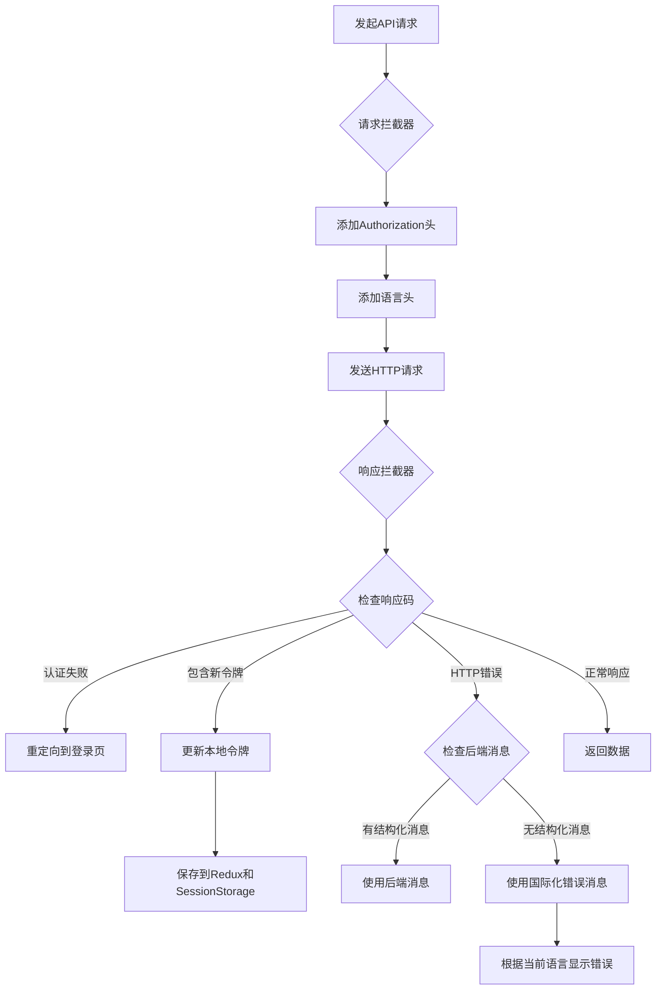
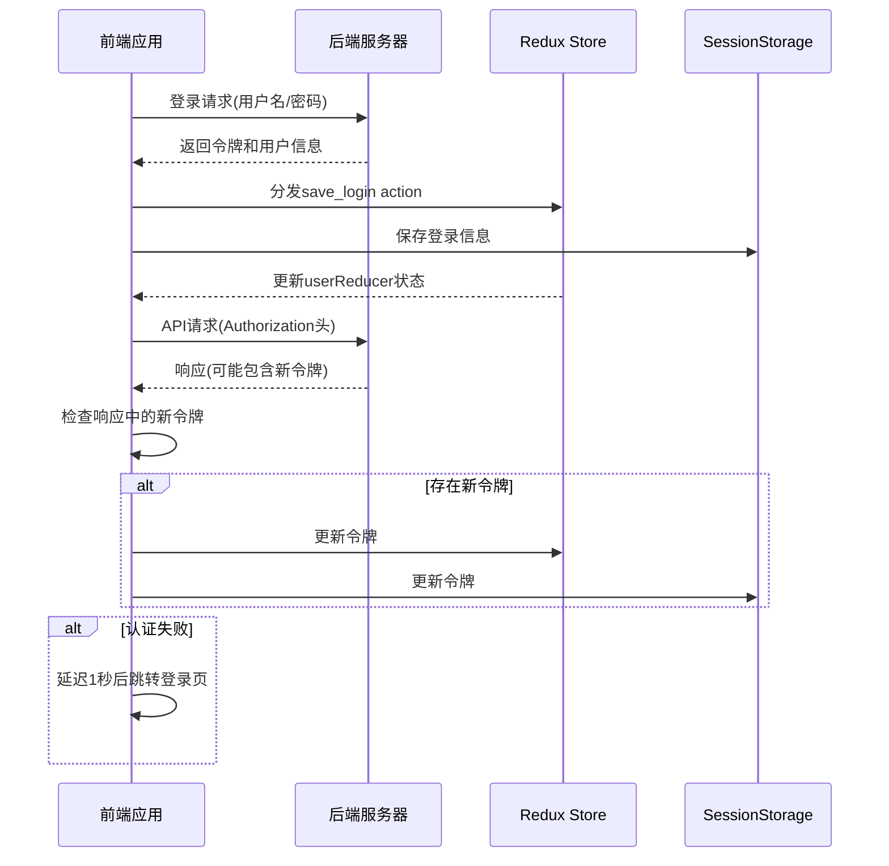
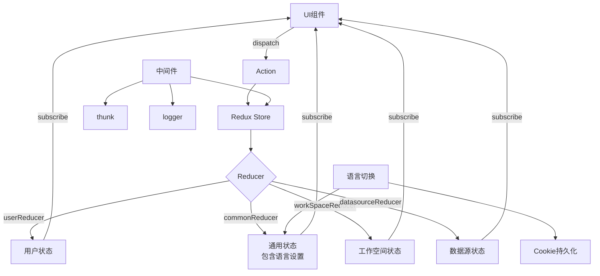
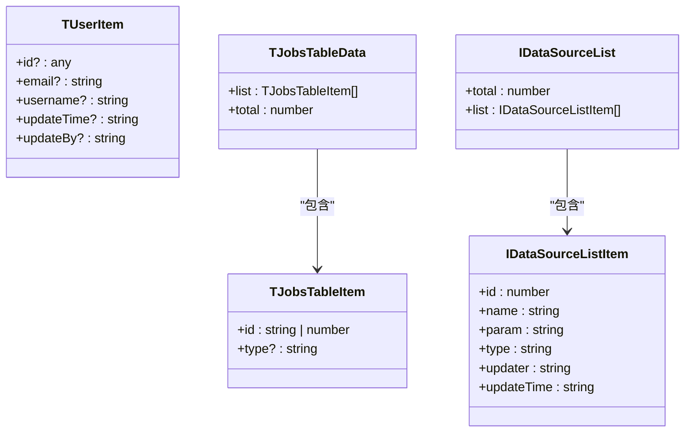

# API集成与数据流

<cite>
**本文档中引用的文件**
- [index.ts](file://datavines-ui\src\http\index.ts)
- [rootReducer.ts](file://datavines-ui\src\store\rootReducer.ts)
- [store.ts](file://datavines-ui\src\store\index.ts)
- [User.ts](file://datavines-ui\src\type\User.ts)
- [Jobs.ts](file://datavines-ui\src\type\Jobs.ts)
- [dataSource.ts](file://datavines-ui\src\type\dataSource.ts)
- [constants.ts](file://datavines-ui\src\utils\constants.ts)
- [create.ts](file://datavines-ui\Editor\http\create.ts)
- [request.interceptor.ts](file://datavines-ui\Editor\http\request.interceptor.ts)
- [response.interceptor.ts](file://datavines-ui\Editor\http\response.interceptor.ts)
- [zh_CN.ts](file://datavines-ui\Editor\locale\zh_CN.ts)
- [en_US.ts](file://datavines-ui\Editor\locale\en_US.ts)
- [index.tsx](file://datavines-ui\src\locale\index.tsx)
- [index.tsx](file://datavines-ui\src\component\SwitchLanguage\index.tsx)
- [index.ts](file://datavines-ui\src\store\commonReducer\index.ts)
</cite>

## 目录
1. [简介](#简介)
2. [HTTP请求封装与拦截器实现](#http请求封装与拦截器实现)
3. [认证流程与令牌管理](#认证流程与令牌管理)
4. [Redux状态管理数据流](#redux状态管理数据流)
5. [类型定义与后端API对应关系](#类型定义与后端api对应关系)
6. [国际化错误消息与动态语言切换](#国际化错误消息与动态语言切换)
7. [API调试工具与网络问题排查](#api调试工具与网络问题排查)
8. [结论](#结论)

## 简介
本项目是一个大数据开源平台，提供数据质量监控和验证功能。系统由后端服务和前端UI组成，通过RESTful API进行通信。前端采用React + Redux技术栈，实现了完整的状态管理和API集成方案。本文档详细描述了前端与后端API的集成机制，包括HTTP请求封装、拦截器实现、错误处理、认证流程、Redux状态管理、国际化支持以及类型系统设计。

## HTTP请求封装与拦截器实现

前端通过自定义HTTP客户端封装了所有API请求，实现了统一的请求配置、拦截器和错误处理机制。HTTP客户端基于axios等库进行封装，提供了基础URL配置、请求和响应拦截器。

请求拦截器在每个请求发送前自动添加认证令牌和语言头信息，确保每个请求都携带必要的认证和上下文信息。响应拦截器负责处理服务器返回的响应，包括错误码处理、令牌刷新等。

**更新** 响应拦截器现已增强，支持国际化错误消息显示。系统内置了中英文错误消息映射表，能够根据当前语言设置动态显示对应的错误提示。



**Diagram sources**
- [index.ts](file://datavines-ui\src\http\index.ts#L24-L50)
- [create.ts](file://datavines-ui\Editor\http\create.ts)
- [request.interceptor.ts](file://datavines-ui\Editor\http\request.interceptor.ts)
- [response.interceptor.ts](file://datavines-ui\Editor\http\response.interceptor.ts)

**Section sources**
- [index.ts](file://datavines-ui\src\http\index.ts#L24-L50)
- [response.interceptor.ts](file://datavines-ui\Editor\http\response.interceptor.ts#L1-L106)

## 认证流程与令牌管理

系统采用Bearer Token认证机制，用户登录后获取JWT令牌，并在后续请求中通过Authorization头传递。令牌管理机制确保了用户会话的安全性和连续性。

当用户成功登录后，令牌被存储在Redux状态树和浏览器的SessionStorage中，实现跨页面的状态共享。特别的是，系统实现了自动令牌刷新机制——当服务器在响应中返回新令牌时，前端会自动更新本地存储的令牌，延长用户会话有效期而无需重新登录。

认证失败处理机制完善，当检测到令牌过期或无效时（服务器返回特定错误码10010002、10010003、10010004），系统会在1秒后自动重定向到登录页面，提示用户重新认证。



**Diagram sources**
- [index.ts](file://datavines-ui\src\http\index.ts#L9-L22)
- [index.ts](file://datavines-ui\src\http\index.ts#L39-L47)
- [constants.ts](file://datavines-ui\src\utils\constants.ts#L6)

**Section sources**
- [index.ts](file://datavines-ui\src\http\index.ts#L9-L48)

## Redux状态管理数据流

前端采用Redux作为状态管理解决方案，实现了集中式的状态存储和管理。状态树由多个reducer组成，分别管理用户、通用、工作空间和数据源等不同领域的状态。

Redux中间件配置包含了thunk和logger，支持异步action处理和开发调试。在开发环境中，还集成了redux-devtools-extension，便于开发者调试状态变化。

状态数据流遵循严格的单向数据流模式：组件发起action → Redux store处理action → reducer更新状态 → 组件重新渲染。通过useSelector和useDispatch等React-Redux钩子，组件可以订阅状态变化并分发action。

**更新** 通用reducer现在包含语言设置功能，支持动态语言切换。语言状态存储在Redux中，配合Cookie持久化，确保页面刷新后语言设置不丢失。



**Diagram sources**
- [store.ts](file://datavines-ui\src\store\index.ts#L12-L15)
- [rootReducer.ts](file://datavines-ui\src\store\rootReducer.ts#L6-L11)
- [store.ts](file://datavines-ui\src\store\index.ts#L20-L23)
- [index.ts](file://datavines-ui\src\store\commonReducer\index.ts#L41-L53)

**Section sources**
- [store.ts](file://datavines-ui\src\store\index.ts#L1-L26)
- [rootReducer.ts](file://datavines-ui\src\store\rootReducer.ts#L1-L26)
- [index.ts](file://datavines-ui\src\store\commonReducer\index.ts#L1-L73)

## 类型定义与后端API对应关系

项目采用TypeScript进行类型定义，确保前端与后端API的数据结构保持一致。类型系统定义了各种业务实体的接口，包括用户、作业、数据源等。

类型定义文件位于src/type目录下，为前端组件提供了类型安全的开发体验。通过精确的接口定义，开发人员可以清楚地了解API返回的数据结构，减少运行时错误。

类型系统与后端Java实体类对应，确保了前后端数据契约的一致性。例如，用户信息接口TUserItem与后端User实体对应，作业数据接口TJobsTableData与后端JobExecutionInfo对应。



**Diagram sources**
- [User.ts](file://datavines-ui\src\type\User.ts#L1-L8)
- [Jobs.ts](file://datavines-ui\src\type\Jobs.ts#L1-L10)
- [dataSource.ts](file://datavines-ui\src\type\dataSource.ts#L36-L50)

**Section sources**
- [User.ts](file://datavines-ui\src\type\User.ts#L1-L8)
- [Jobs.ts](file://datavines-ui\src\type\Jobs.ts#L1-L10)
- [dataSource.ts](file://datavines-ui\src\type\dataSource.ts#L1-L50)

## 国际化错误消息与动态语言切换

**新增** 系统现已支持国际化错误消息显示和动态语言切换功能。这一增强功能通过HTTP响应拦截器实现，为用户提供多语言的错误提示体验。

### 国际化错误消息支持

响应拦截器内置了中英文错误消息映射表，覆盖了常见的网络错误、HTTP状态码错误和超时错误场景：

- **网络连接失败**：网络连接失败，无法连接到服务器 / Network connection failed, unable to connect to server
- **请求超时**：请求超时，请检查网络后重试 / Request timeout, please check your network
- **HTTP状态码错误**：400、401、403、404、500、502、503、504等标准HTTP错误码
- **未知错误**：服务器错误 / Server error

### 动态语言切换机制

系统通过以下组件和状态管理实现动态语言切换：

1. **语言状态管理**：commonReducer维护当前语言设置，默认为'en_US'
2. **语言切换组件**：SwitchLanguage组件提供简体中文/English切换功能
3. **国际化包装器**：IntlWrap组件根据Redux状态提供对应语言的消息
4. **错误消息国际化**：响应拦截器使用当前语言设置显示对应错误消息

```mermaid
flowchart TD
A[用户切换语言] --> B[SwitchLanguage组件]
B --> C[commonReducer.setLocale]
C --> D[Redux状态更新]
D --> E[Cookie持久化]
E --> F[IntlWrap组件]
F --> G[IntlProvider语言设置]
G --> H[响应拦截器]
H --> I[setHttpErrorLocale]
I --> J[根据语言显示错误消息]
K[错误发生] --> L[响应拦截器]
L --> M{检查后端消息}
M --> |有| N[使用后端消息]
M --> |无| O[使用国际化消息]
O --> P[getErrorMessage]
P --> Q[errorMessages[currentLocale]]
Q --> R[显示对应语言错误]
```

**Diagram sources**
- [index.tsx](file://datavines-ui\src\component\SwitchLanguage\index.tsx#L1-L38)
- [index.ts](file://datavines-ui\src\store\commonReducer\index.ts#L41-L53)
- [index.tsx](file://datavines-ui\src\locale\index.tsx#L32-L55)
- [response.interceptor.ts](file://datavines-ui\Editor\http\response.interceptor.ts#L4-L10)
- [response.interceptor.ts](file://datavines-ui\Editor\http\response.interceptor.ts#L42-L45)

**Section sources**
- [response.interceptor.ts](file://datavines-ui\Editor\http\response.interceptor.ts#L1-L106)
- [zh_CN.ts](file://datavines-ui\Editor\locale\zh_CN.ts#L1-L85)
- [en_US.ts](file://datavines-ui\Editor\locale\en_US.ts#L1-L85)
- [index.tsx](file://datavines-ui\src\locale\index.tsx#L1-L56)
- [index.tsx](file://datavines-ui\src\component\SwitchLanguage\index.tsx#L1-L38)
- [index.ts](file://datavines-ui\src\store\commonReducer\index.ts#L1-L73)

## API调试工具与网络问题排查

系统提供了完善的API调试和网络问题排查机制。开发人员可以利用浏览器开发者工具的Network面板监控所有API请求和响应，检查请求头、响应码和数据负载。

Redux DevTools是另一个重要的调试工具，可以追踪所有action的分发和状态变化，帮助理解应用的状态流转。结合redux-logger中间件，可以在控制台查看详细的状态变化日志。

**更新** 新增国际化错误消息调试功能。开发人员可以通过检查响应拦截器中的错误消息映射表来验证多语言支持是否正常工作。

对于常见的网络问题，系统提供了相应的排查指南：
- **认证失败**：检查令牌是否过期，确认登录状态
- **跨域问题**：确认后端CORS配置是否正确
- **请求超时**：检查网络连接，确认后端服务是否正常运行
- **数据格式错误**：检查API响应结构是否符合类型定义
- **国际化错误消息问题**：检查当前语言设置和错误消息映射表

错误处理机制捕获并处理各种网络异常，提供用户友好的错误提示。对于特定的业务错误码，系统会执行相应的处理逻辑，如重定向到登录页。新增的国际化错误消息功能确保了用户能够看到对应语言的错误提示。

**Section sources**
- [index.ts](file://datavines-ui\src\http\index.ts#L39-L43)
- [store.ts](file://datavines-ui\src\store\index.ts#L7)
- [response.interceptor.ts](file://datavines-ui\Editor\http\response.interceptor.ts#L66-L105)

## 结论
本项目实现了完整的前端与后端API集成方案，通过HTTP拦截器、Redux状态管理和TypeScript类型系统，构建了健壮、可维护的应用架构。认证机制安全可靠，支持令牌自动刷新；状态管理清晰有序，遵循单向数据流原则；类型系统确保了前后端数据契约的一致性。

**更新亮点** 新增的国际化错误消息支持和动态语言切换功能进一步提升了用户体验。通过响应拦截器的增强实现，系统现在能够根据用户的语言偏好显示对应的错误提示，支持中英文双语环境下的错误消息显示。配合Redux状态管理和Cookie持久化机制，实现了无缝的语言切换体验。

这些设计模式为大型前端应用的开发提供了良好的实践参考，特别是在国际化支持和错误处理方面的最佳实践值得借鉴。