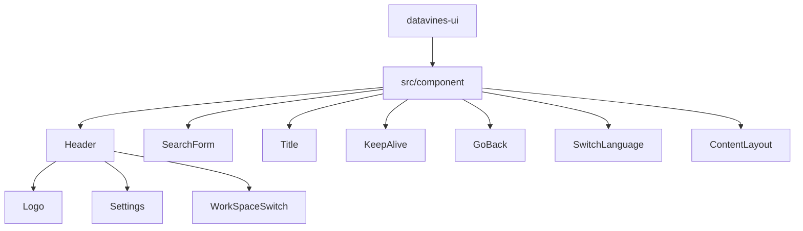
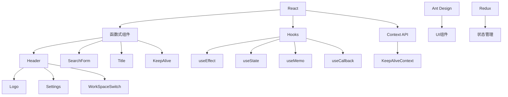
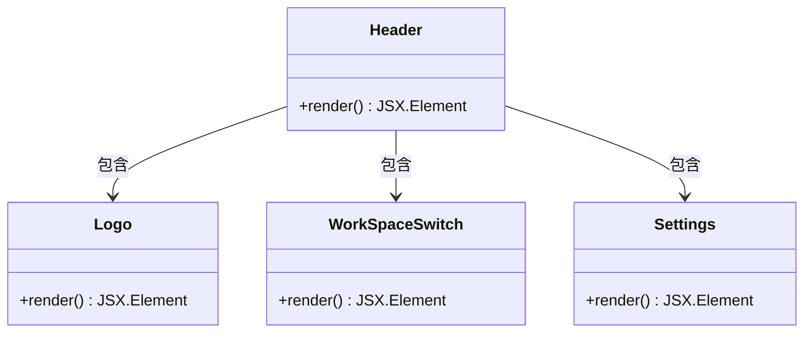
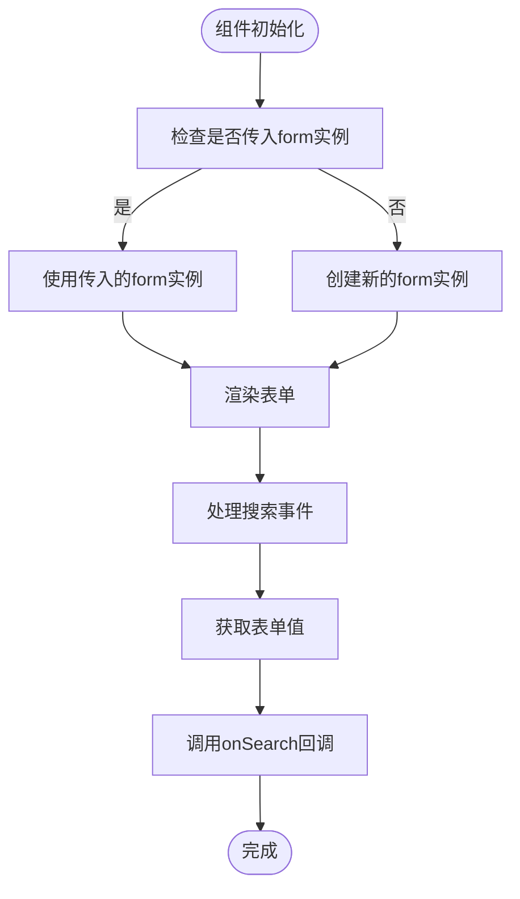
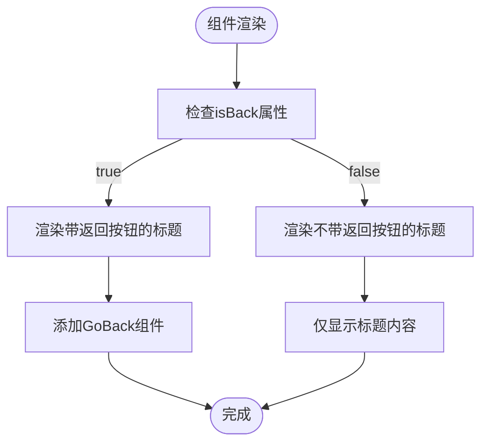
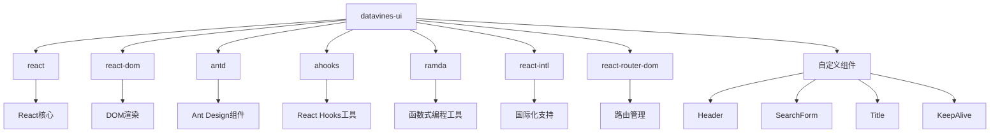

# UI组件系统

<cite>
**本文档引用的文件**
- [KeepAlive.tsx](file://datavines-ui\src\component\KeepAlive.tsx)
- [Header\index.tsx](file://datavines-ui\src\component\Header\index.tsx)
- [SearchForm\index.tsx](file://datavines-ui\src\component\SearchForm\index.tsx)
- [Title\index.tsx](file://datavines-ui\src\component\Title\index.tsx)
- [GoBack\index.tsx](file://datavines-ui\src\component\GoBack\index.tsx)
- [SwitchLanguage\index.tsx](file://datavines-ui\src\component\SwitchLanguage\index.tsx)
- [ContentLayout\index.tsx](file://datavines-ui\src\component\ContentLayout\index.tsx)
- [global.less](file://datavines-ui\src\global.less)
- [package.json](file://datavines-ui\package.json)
</cite>

## 目录
1. [简介](#简介)
2. [项目结构](#项目结构)
3. [核心组件](#核心组件)
4. [架构概述](#架构概述)
5. [详细组件分析](#详细组件分析)
6. [依赖分析](#依赖分析)
7. [性能考虑](#性能考虑)
8. [故障排除指南](#故障排除指南)
9. [结论](#结论)

## 简介
本文档详细描述了Datavines项目的UI组件系统，重点介绍导航菜单、页头、搜索表单、标题栏等核心组件的设计与实现。文档解释了组件的props接口、事件处理和样式定制方法，分析了高阶组件如KeepAlive的实现原理和使用场景。同时提供了组件复用的最佳实践和自定义组件开发指南，包含组件测试策略和性能优化建议。

## 项目结构
Datavines的UI组件系统位于`datavines-ui`目录下，采用模块化设计，将不同功能的组件分类存放。核心组件主要分布在`src/component`目录中，包括Header（页头）、SearchForm（搜索表单）、Title（标题栏）、KeepAlive（页面缓存）等。



**图示来源**
- [Header\index.tsx](file://datavines-ui\src\component\Header\index.tsx)
- [SearchForm\index.tsx](file://datavines-ui\src\component\SearchForm\index.tsx)
- [Title\index.tsx](file://datavines-ui\src\component\Title\index.tsx)

**章节来源**
- [Header\index.tsx](file://datavines-ui\src\component\Header\index.tsx)
- [SearchForm\index.tsx](file://datavines-ui\src\component\SearchForm\index.tsx)
- [Title\index.tsx](file://datavines-ui\src\component\Title\index.tsx)

## 核心组件
本系统的核心UI组件包括页头(Header)、搜索表单(SearchForm)、标题栏(Title)和页面缓存(KeepAlive)等。这些组件共同构成了Datavines应用的用户界面基础，提供了统一的视觉风格和交互体验。

**章节来源**
- [Header\index.tsx](file://datavines-ui\src\component\Header\index.tsx)
- [SearchForm\index.tsx](file://datavines-ui\src\component\SearchForm\index.tsx)
- [Title\index.tsx](file://datavines-ui\src\component\Title\index.tsx)
- [KeepAlive.tsx](file://datavines-ui\src\component\KeepAlive.tsx)

## 架构概述
Datavines UI组件系统采用React函数式组件和Hooks的现代开发模式，结合Ant Design组件库构建用户界面。系统通过模块化设计将不同功能的组件分离，同时利用Context API和Redux进行状态管理。



**图示来源**
- [KeepAlive.tsx](file://datavines-ui\src\component\KeepAlive.tsx)
- [Header\index.tsx](file://datavines-ui\src\component\Header\index.tsx)
- [package.json](file://datavines-ui\package.json)

## 详细组件分析
### 页头组件分析
页头组件(Header)是应用的顶部导航区域，包含Logo、工作空间切换和设置功能。组件采用函数式编程模式，通过组合多个子组件实现完整功能。

#### 组件结构


**图示来源**
- [Header\index.tsx](file://datavines-ui\src\component\Header\index.tsx)
- [Header\Logo\index.tsx](file://datavines-ui\src\component\Header\Logo\index.tsx)
- [Header\Settings\index.tsx](file://datavines-ui\src\component\Header\Settings\index.tsx)
- [Header\WorkSpaceSwitch\index.tsx](file://datavines-ui\src\component\Header\WorkSpaceSwitch\index.tsx)

**章节来源**
- [Header\index.tsx](file://datavines-ui\src\component\Header\index.tsx)
- [Header\Logo\index.tsx](file://datavines-ui\src\component\Header\Logo\index.tsx)
- [Header\Settings\index.tsx](file://datavines-ui\src\component\Header\Settings\index.tsx)
- [Header\WorkSpaceSwitch\index.tsx](file://datavines-ui\src\component\Header\WorkSpaceSwitch\index.tsx)

### 搜索表单组件分析
搜索表单(SearchForm)组件提供统一的搜索功能，支持自定义搜索回调和表单实例。

#### 属性接口
| 属性名 | 类型 | 必需 | 默认值 | 描述 |
|-------|------|------|--------|------|
| onSearch | (val: string) => void | 是 | 无 | 搜索回调函数 |
| form | FormInstance | 否 | 无 | 表单实例 |
| placeholder | string | 否 | '搜索...' | 占位符文本 |

#### 组件实现流程


**图示来源**
- [SearchForm\index.tsx](file://datavines-ui\src\component\SearchForm\index.tsx)

**章节来源**
- [SearchForm\index.tsx](file://datavines-ui\src\component\SearchForm\index.tsx)

### 标题栏组件分析
标题栏(Title)组件用于显示页面标题，可选择是否显示返回按钮。

#### 属性接口
| 属性名 | 类型 | 必需 | 默认值 | 描述 |
|-------|------|------|--------|------|
| isBack | boolean | 否 | false | 是否显示返回按钮 |
| children | React.ReactNode | 是 | 无 | 标题内容 |

#### 组件渲染逻辑


**图示来源**
- [Title\index.tsx](file://datavines-ui\src\component\Title\index.tsx)
- [GoBack\index.tsx](file://datavines-ui\src\component\GoBack\index.tsx)

**章节来源**
- [Title\index.tsx](file://datavines-ui\src\component\Title\index.tsx)
- [GoBack\index.tsx](file://datavines-ui\src\component\GoBack\index.tsx)

### KeepAlive组件分析
KeepAlive组件是高阶组件，用于实现页面状态缓存，避免组件重复渲染。

#### 实现原理
```mermaid
classDiagram
class KeepAlive {
+components : RefObject<Array<{name : string, ele : Children}>>
+containerRef : RefObject<HTMLDivElement>
+destroy(params : string, render? : boolean) : void
+render() : JSX.Element
}
class Component {
+targetElement : HTMLDivElement
+activatedRef : RefObject<boolean>
+render() : JSX.Element
}
class KeepAliveContext {
+destroy : (params : string, render? : boolean) => void
+isActive : boolean
}
KeepAlive --> Component : 渲染
KeepAlive --> KeepAliveContext : 提供
Component --> ReactDOM.createPortal : 使用
```

**图示来源**
- [KeepAlive.tsx](file://datavines-ui\src\component\KeepAlive.tsx)

**章节来源**
- [KeepAlive.tsx](file://datavines-ui\src\component\KeepAlive.tsx)

## 依赖分析
UI组件系统依赖于多个第三方库和内部模块，形成了完整的依赖关系网络。



**图示来源**
- [package.json](file://datavines-ui\package.json)
- [KeepAlive.tsx](file://datavines-ui\src\component\KeepAlive.tsx)
- [Header\index.tsx](file://datavines-ui\src\component\Header\index.tsx)
- [SearchForm\index.tsx](file://datavines-ui\src\component\SearchForm\index.tsx)
- [Title\index.tsx](file://datavines-ui\src\component\Title\index.tsx)

**章节来源**
- [package.json](file://datavines-ui\package.json)
- [KeepAlive.tsx](file://datavines-ui\src\component\KeepAlive.tsx)
- [Header\index.tsx](file://datavines-ui\src\component\Header\index.tsx)
- [SearchForm\index.tsx](file://datavines-ui\src\component\SearchForm\index.tsx)
- [Title\index.tsx](file://datavines-ui\src\component\Title\index.tsx)

## 性能考虑
UI组件系统在设计时充分考虑了性能优化，采用了多种技术手段提升应用性能。

1. **组件记忆化**: 所有组件都使用`React.memo`进行记忆化，避免不必要的重新渲染。
2. **状态管理**: 使用`useRef`存储组件状态，避免状态变化导致的重新渲染。
3. **虚拟DOM**: 利用React的虚拟DOM机制，最小化DOM操作。
4. **懒加载**: 通过`createPortal`实现组件的按需渲染。
5. **缓存机制**: KeepAlive组件实现了页面状态缓存，避免重复的数据获取和渲染。

**章节来源**
- [KeepAlive.tsx](file://datavines-ui\src\component\KeepAlive.tsx)
- [Header\index.tsx](file://datavines-ui\src\component\Header\index.tsx)
- [SearchForm\index.tsx](file://datavines-ui\src\component\SearchForm\index.tsx)
- [Title\index.tsx](file://datavines-ui\src\component\Title\index.tsx)

## 故障排除指南
### 常见问题及解决方案
1. **组件不渲染**: 检查组件是否正确导入和使用，确保props传递正确。
2. **样式不生效**: 检查CSS类名是否正确，确认样式文件已正确引入。
3. **状态不更新**: 确认使用了正确的状态管理方法，检查依赖数组是否正确。
4. **国际化失效**: 检查语言包是否正确配置，确认`useIntl`钩子使用正确。

**章节来源**
- [global.less](file://datavines-ui\src\global.less)
- [SwitchLanguage\index.tsx](file://datavines-ui\src\component\SwitchLanguage\index.tsx)
- [KeepAlive.tsx](file://datavines-ui\src\component\KeepAlive.tsx)

## 结论
Datavines的UI组件系统采用现代化的React开发模式，通过模块化设计和高阶组件实现了高效、可复用的用户界面。系统提供了完整的组件库，包括页头、搜索表单、标题栏等核心组件，并通过KeepAlive组件实现了页面状态缓存。组件系统具有良好的性能表现和可维护性，为Datavines应用提供了统一的用户体验。