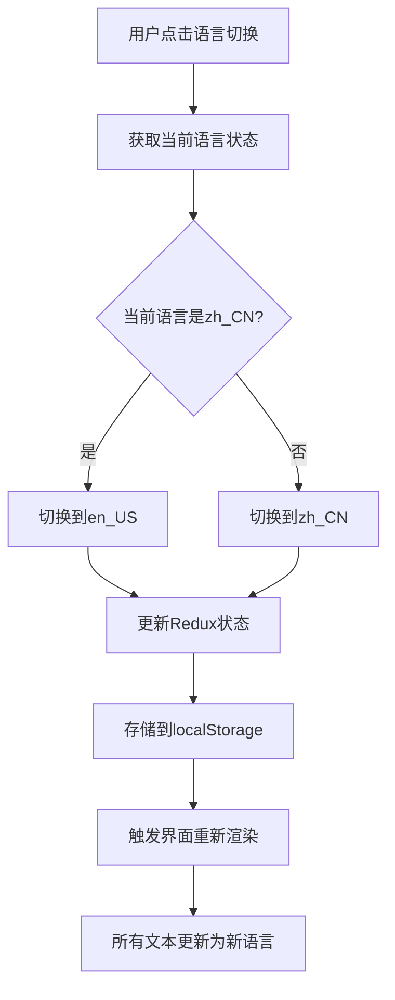
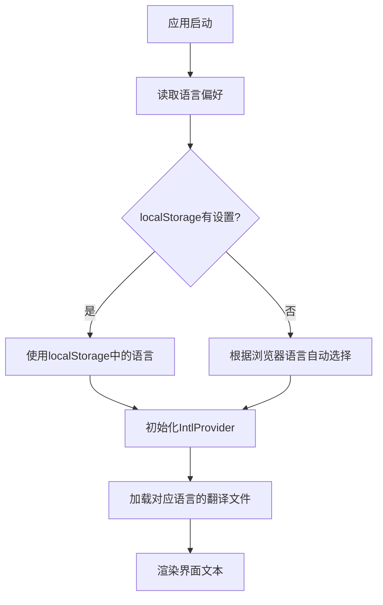
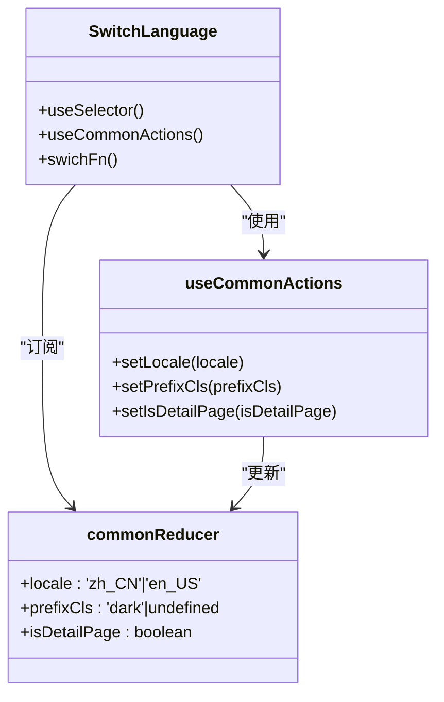

# 工具类组件

<cite>
**本文档中引用的文件**  
- [GoBack/index.tsx](file://datavines-ui\src\component\GoBack\index.tsx)
- [SwitchLanguage/index.tsx](file://datavines-ui\src\component\SwitchLanguage\index.tsx)
- [index.tsx](file://datavines-ui\src\component\index.tsx)
- [commonReducer/index.ts](file://datavines-ui\src\store\commonReducer\index.ts)
- [locale/index.tsx](file://datavines-ui\src\locale\index.tsx)
- [constants.ts](file://datavines-ui\src\utils\constants.ts)
- [shareData/index.ts](file://datavines-ui\src\utils\shareData\index.ts)
- [zh_CN.ts](file://datavines-ui\src\locale\zh_CN.ts)
- [en_US.ts](file://datavines-ui\src\locale\en_US.ts)
- [App/index.tsx](file://datavines-ui\src\App\index.tsx)
</cite>

## 目录
1. [简介](#简介)
2. [核心组件分析](#核心组件分析)
3. [GoBack返回按钮组件](#goback返回按钮组件)
4. [SwitchLanguage语言切换组件](#switchlanguage语言切换组件)
5. [组件入口文件index.tsx](#组件入口文件indextsx)
6. [国际化集成机制](#国际化集成机制)
7. [全局状态管理协作模式](#全局状态管理协作模式)
8. [应用场景案例](#应用场景案例)
9. [开发效率与用户体验一致性提升](#开发效率与用户体验一致性提升)

## 简介
本文档系统化地文档化了Datavines项目中的工具类组件，重点关注GoBack返回按钮、SwitchLanguage语言切换组件以及组件入口文件index.tsx的导出规范。详细说明了这些轻量级组件如何提升开发效率和用户体验一致性，并提供了在表单页面、详情页和国际化场景下的具体应用案例。

## 核心组件分析
本节分析Datavines项目中的核心工具类组件，包括GoBack返回按钮、SwitchLanguage语言切换组件等，这些组件通过封装常用功能，提高了代码复用性和开发效率。

**Section sources**
- [GoBack/index.tsx](file://datavines-ui\src\component\GoBack\index.tsx)
- [SwitchLanguage/index.tsx](file://datavines-ui\src\component\SwitchLanguage\index.tsx)

## GoBack返回按钮组件
GoBack组件是一个轻量级的返回按钮工具，用于处理路由历史的返回操作。该组件基于React和React Router实现，通过调用浏览器的历史记录API来实现页面返回功能。

组件接受可选的样式和子元素作为props，如果未提供子元素，则默认显示一个Ant Design的ArrowLeftOutlined图标。点击按钮时，会触发history.goBack()方法，返回到上一个路由。

该组件使用React.memo进行性能优化，避免不必要的重新渲染。其主要功能是提供一致的返回用户体验，无论是在表单页面还是详情页中都能保持统一的交互模式。

```mermaid
flowchart TD
A[用户点击GoBack按钮] --> B{是否有自定义子元素?}
B --> |是| C[显示自定义内容]
B --> |否| D[显示默认箭头图标]
C --> E[触发history.goBack()]
D --> E
E --> F[返回上一个路由]
```

**Diagram sources**
- [GoBack/index.tsx](file://datavines-ui\src\component\GoBack\index.tsx)

**Section sources**
- [GoBack/index.tsx](file://datavines-ui\src\component\GoBack\index.tsx)

## SwitchLanguage语言切换组件
SwitchLanguage组件实现了系统的国际化语言切换功能。该组件基于React Intl和Redux状态管理，允许用户在不同语言之间切换。

组件使用Popover包裹语言切换选项，点击时会切换当前语言环境。语言映射定义在组件内部，支持中文(zh_CN)和英文(en_US)两种语言。切换语言时，组件会更新Redux中的locale状态，并将选择的语言存储到localStorage中，确保页面刷新后仍能保持用户选择的语言偏好。

该组件通过useSelector获取当前语言状态，通过useCommonActions获取状态更新函数，实现了与全局状态管理的无缝集成。语言切换后，所有使用React Intl格式化的文本都会自动更新为对应语言的翻译。



**Diagram sources**
- [SwitchLanguage/index.tsx](file://datavines-ui\src\component\SwitchLanguage\index.tsx)
- [commonReducer/index.ts](file://datavines-ui\src\store\commonReducer\index.ts)
- [shareData/index.ts](file://datavines-ui\src\utils\shareData\index.ts)

**Section sources**
- [SwitchLanguage/index.tsx](file://datavines-ui\src\component\SwitchLanguage\index.tsx)

## 组件入口文件index.tsx
组件入口文件index.tsx位于src/component目录下，负责统一导出所有工具类组件。该文件采用模块化设计，通过命名导出方式暴露GoBack、SwitchLanguage、Title、SearchForm等核心组件。

这种集中式导出模式提供了清晰的组件API入口，使得其他模块可以方便地导入所需组件。通过在单个文件中管理所有组件的导出，降低了组件引用的复杂性，提高了代码的可维护性。

该文件的结构简洁明了，仅包含导入和导出语句，不包含任何业务逻辑，符合单一职责原则。这种设计模式使得组件的引入和使用变得非常直观和一致。

**Section sources**
- [index.tsx](file://datavines-ui\src\component\index.tsx)

## 国际化集成机制
Datavines项目的国际化机制基于React Intl实现，通过IntlProvider组件提供多语言支持。系统支持中英文两种语言，并通过locale文件存储翻译文本。

在应用启动时，App组件会从localStorage或浏览器语言设置中读取用户的语言偏好，并初始化相应的语言环境。如果localStorage中没有存储语言设置，则根据浏览器语言自动选择中文或英文。

翻译文本存储在zh_CN.ts和en_US.ts两个文件中，包含所有用户界面的文本内容。这些翻译文件通过locale/index.tsx进行整合，并与React Intl的IntlProvider组件集成，确保所有文本都能根据当前语言环境正确显示。



**Diagram sources**
- [App/index.tsx](file://datavines-ui\src\App\index.tsx)
- [locale/index.tsx](file://datavines-ui\src\locale\index.tsx)
- [constants.ts](file://datavines-ui\src\utils\constants.ts)

**Section sources**
- [App/index.tsx](file://datavines-ui\src\App\index.tsx)
- [locale/index.tsx](file://datavines-ui\src\locale\index.tsx)

## 全局状态管理协作模式
工具类组件与Redux全局状态管理紧密协作，通过useSelector和useDispatch（通过useCommonActions封装）实现状态的读取和更新。

SwitchLanguage组件通过useSelector订阅commonReducer中的locale状态，当语言切换时，通过useCommonActions派发setLocale action来更新全局状态。GoBack组件虽然不直接依赖Redux状态，但其功能依赖于React Router的history对象，而路由状态也是应用全局状态的一部分。

commonReducer中定义了locale、prefixCls等全局UI状态，这些状态被多个组件共享和使用。通过Redux的单一数据源原则，确保了应用状态的一致性和可预测性。



**Diagram sources**
- [SwitchLanguage/index.tsx](file://datavines-ui\src\component\SwitchLanguage\index.tsx)
- [commonReducer/index.ts](file://datavines-ui\src\store\commonReducer\index.ts)

**Section sources**
- [commonReducer/index.ts](file://datavines-ui\src\store\commonReducer\index.ts)

## 应用场景案例
### 表单页面应用
在表单页面中，GoBack组件通常位于页面顶部，允许用户在填写表单时返回上一页。SwitchLanguage组件则提供语言切换功能，方便不同语言用户使用系统。

### 详情页应用
在详情页中，GoBack组件帮助用户从详情视图返回列表页面。通过isDetailPage状态的管理，系统可以智能地显示或隐藏某些UI元素，提供更合适的用户体验。

### 国际化场景
系统通过SwitchLanguage组件和React Intl的结合，实现了完整的国际化支持。用户可以在界面中随时切换语言，所有文本内容都会相应更新。语言偏好会持久化存储在localStorage中，确保用户体验的一致性。

## 开发效率与用户体验一致性提升
这些工具类组件通过封装常用功能，显著提升了开发效率。开发者无需重复实现返回按钮或语言切换逻辑，可以直接导入和使用这些经过验证的组件。

同时，这些组件确保了用户体验的一致性。无论在应用的哪个部分，返回按钮和语言切换的交互方式都保持统一，降低了用户的学习成本，提高了系统的可用性。

通过集中管理和维护这些通用组件，团队可以更容易地进行UI更新和优化，确保整个应用的视觉和交互一致性。

**Section sources**
- [GoBack/index.tsx](file://datavines-ui\src\component\GoBack\index.tsx)
- [SwitchLanguage/index.tsx](file://datavines-ui\src\component\SwitchLanguage\index.tsx)
- [index.tsx](file://datavines-ui\src\component\index.tsx)