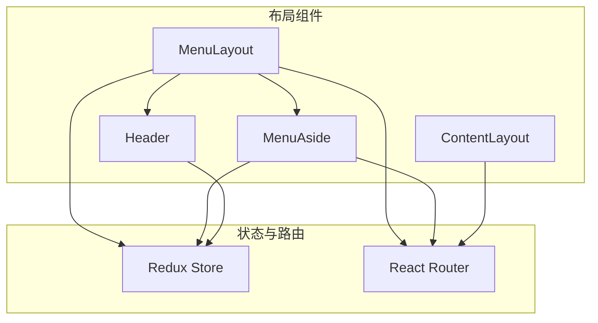
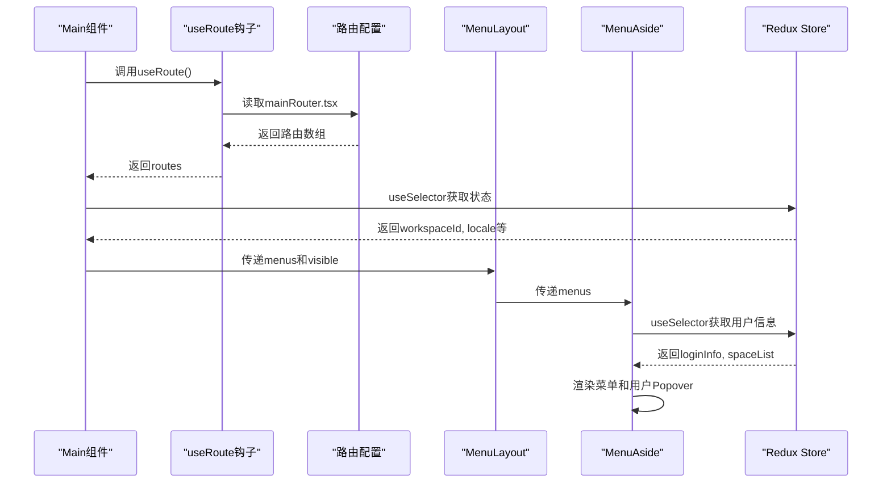
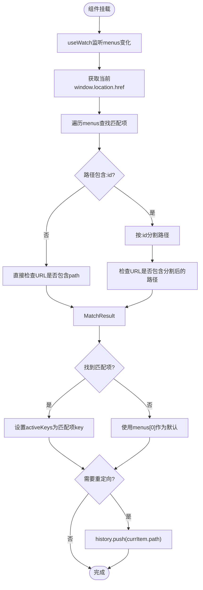
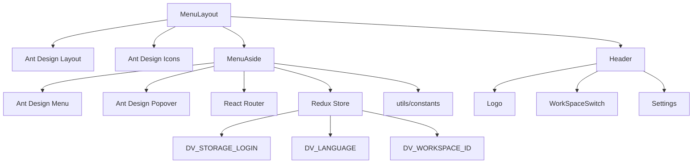

# 布局组件

<cite>
**本文档引用的文件**  
- [ContentLayout/index.tsx](file://datavines-ui/src/component/ContentLayout/index.tsx)
- [Menu/Layout/index.tsx](file://datavines-ui/src/component/Menu/Layout/index.tsx)
- [Menu/MenuAside/index.tsx](file://datavines-ui/src/component/Menu/MenuAside/index.tsx)
- [Header/index.tsx](file://datavines-ui/src/component/Header/index.tsx)
- [mainRouter.tsx](file://datavines-ui/src/router/mainRouter.tsx)
- [useRoute.tsx](file://datavines-ui/src/router/useRoute.tsx)
- [Main/index.tsx](file://datavines-ui/src/view/Main/index.tsx)
- [rootReducer.ts](file://datavines-ui/src/store/rootReducer.ts)
- [constants.ts](file://datavines-ui/src/utils/constants.ts)
</cite>

## 目录
1. [简介](#简介)
2. [项目结构](#项目结构)
3. [核心组件](#核心组件)
4. [架构概述](#架构概述)
5. [详细组件分析](#详细组件分析)
6. [依赖分析](#依赖分析)
7. [性能考虑](#性能考虑)
8. [故障排除指南](#故障排除指南)
9. [结论](#结论)

## 简介
本文档深入解析 DataVines 数据质量平台前端系统的布局组件架构设计与实现细节。重点阐述 `MenuAside` 侧边栏菜单的路由映射逻辑、动态权限控制和展开/收起交互；分析 `Layout` 布局容器的响应式设计和嵌套结构；说明 `ContentLayout` 内容区域的自适应填充机制。文档化组件的配置参数、插槽使用和主题定制能力，并提供多级菜单渲染、权限路由集成和移动端适配的最佳实践。

## 项目结构
布局组件主要位于 `datavines-ui` 项目的 `src/component` 目录下，采用模块化设计，各组件职责清晰，通过 React 和 Ant Design 实现现代化的用户界面。

**图示来源**  
- [Menu/Layout/index.tsx](file://datavines-ui/src/component/Menu/Layout/index.tsx)
- [Menu/MenuAside/index.tsx](file://datavines-ui/src/component/Menu/MenuAside/index.tsx)
- [Header/index.tsx](file://datavines-ui/src/component/Header/index.tsx)
- [ContentLayout/index.tsx](file://datavines-ui/src/component/ContentLayout/index.tsx)
- [store/index.ts](file://datavines-ui/src/store/index.ts)
- [router/useRoute.tsx](file://datavines-ui/src/router/useRoute.tsx)

**本节来源**  
- [datavines-ui/src/component/Menu/Layout/index.tsx](file://datavines-ui/src/component/Menu/Layout/index.tsx)
- [datavines-ui/src/component/Menu/MenuAside/index.tsx](file://datavines-ui/src/component/Menu/MenuAside/index.tsx)
- [datavines-ui/src/component/Header/index.tsx](file://datavines-ui/src/component/Header/index.tsx)

## 核心组件
核心布局组件包括 `MenuLayout`、`MenuAside`、`Header` 和 `ContentLayout`。`MenuLayout` 是主布局容器，负责整合侧边栏、头部和内容区域。`MenuAside` 实现了侧边栏菜单的渲染和交互逻辑，支持多级菜单和动态路由映射。`Header` 组件包含工作区切换、语言设置和用户信息。`ContentLayout` 提供了内容区域的样式封装，确保内容自适应填充。

**本节来源**  
- [Menu/Layout/index.tsx](file://datavines-ui/src/component/Menu/Layout/index.tsx#L1-L57)
- [Menu/MenuAside/index.tsx](file://datavines-ui/src/component/Menu/MenuAside/index.tsx#L1-L237)
- [Header/index.tsx](file://datavines-ui/src/component/Header/index.tsx#L1-L16)
- [ContentLayout/index.tsx](file://datavines-ui/src/component/ContentLayout/index.tsx#L1-L23)

## 架构概述
系统采用 React + Redux + React Router 的经典架构。`Main` 组件作为应用主入口，通过 `useRoute` 钩子获取路由配置，并将路由信息转换为 `MenuAside` 所需的菜单项。`MenuLayout` 作为布局骨架，接收菜单数据并渲染侧边栏和内容区域。状态管理通过 Redux 实现，`workSpaceReducer` 和 `commonReducer` 分别管理工作区和通用状态，为布局组件提供数据支持。

**图示来源**  
- [view/Main/index.tsx](file://datavines-ui/src/view/Main/index.tsx#L1-L62)
- [router/useRoute.tsx](file://datavines-ui/src/router/useRoute.tsx#L1-L69)
- [router/mainRouter.tsx](file://datavines-ui/src/router/mainRouter.tsx#L1-L62)
- [store/rootReducer.ts](file://datavines-ui/src/store/rootReducer.ts#L1-L26)

## 详细组件分析

### MenuAside 侧边栏菜单分析
`MenuAside` 组件负责渲染侧边栏菜单，其核心功能包括路由映射、菜单激活状态管理和用户交互。

#### 路由映射与激活逻辑
组件通过 `setActiveKeyRedirect` 函数实现路由到菜单项的映射。该函数在组件挂载时通过 `useWatch` 监听 `menus` 变化，根据当前 URL 匹配对应的菜单项，并设置 `activeKeys` 以高亮显示当前页面对应的菜单。对于包含动态参数（如 `:id`）的路由，函数会进行特殊处理，确保正确匹配。

**图示来源**  
- [Menu/MenuAside/index.tsx](file://datavines-ui/src/component/Menu/MenuAside/index.tsx#L46-L67)
- [Menu/MenuAside/index.tsx](file://datavines-ui/src/component/Menu/MenuAside/index.tsx#L68)

**本节来源**  
- [Menu/MenuAside/index.tsx](file://datavines-ui/src/component/Menu/MenuAside/index.tsx#L1-L237)

#### 动态权限控制与菜单过滤
组件通过 `menuHide` 属性实现菜单项的动态显示控制。在渲染前，`$munus` 数组通过 `filter` 方法过滤掉 `menuHide` 为 `true` 的菜单项，从而实现基于权限或状态的菜单隐藏。此机制在 `mainRouter.tsx` 中通过设置 `'dv-home-detail'` 路由的 `menuHide: true` 来隐藏详情页路由，确保其不显示在侧边栏中。

**本节来源**  
- [Menu/MenuAside/index.tsx](file://datavines-ui/src/component/Menu/MenuAside/index.tsx#L171)
- [router/mainRouter.tsx](file://datavines-ui/src/router/mainRouter.tsx#L35)

#### 展开/收起交互
`MenuAside` 组件本身不直接处理展开/收起逻辑，而是由其父组件 `MenuLayout` 管理。`MenuLayout` 使用 `useState` 管理 `collapsed` 状态，并通过 `Sider` 组件的 `onCollapse` 回调同步状态。`MenuLayout` 还负责渲染折叠/展开的触发图标（`MenuUnfoldOutlined`/`MenuFoldOutlined`），实现了完整的交互体验。

**本节来源**  
- [Menu/Layout/index.tsx](file://datavines-ui/src/component/Menu/Layout/index.tsx#L17-L20)
- [Menu/Layout/index.tsx](file://datavines-ui/src/component/Menu/Layout/index.tsx#L34-L38)

### Layout 布局容器分析
`MenuLayout` 组件基于 Ant Design 的 `Layout` 组件构建，实现了经典的侧边栏-内容布局。

#### 响应式设计
组件通过设置 `Sider` 的 `style` 属性为 `height: '100vh'` 和 `overflow: 'auto'`，确保侧边栏高度占满视口且内容可滚动。`Content` 区域由 `MenuLayout` 的 `children` prop 填充，实现了内容的灵活嵌入。整个布局结构清晰，易于维护和扩展。

#### 嵌套结构
`MenuLayout` 采用嵌套的 `Layout` 组件结构，外层 `Layout` 包含一个 `Layout` 子元素，该子元素再包含 `Sider` 和另一个 `Layout`。这种嵌套方式是 Ant Design 推荐的经典布局模式，能够精确控制侧边栏和内容区域的布局关系。

**本节来源**  
- [Menu/Layout/index.tsx](file://datavines-ui/src/component/Menu/Layout/index.tsx#L25-L53)

### ContentLayout 内容区域分析
`ContentLayout` 是一个简单的函数式组件，主要作用是为内容区域提供统一的样式。

#### 自适应填充机制
组件通过设置 `height: height || '100vh'` 实现高度自适应，默认占满整个视口高度。`overflowY: 'auto'` 确保内容超出时可垂直滚动。`padding` 属性设置了内边距，优化了内容的视觉呈现。组件通过 `style` prop 接收外部样式，实现了样式的可扩展性。

**本节来源**  
- [ContentLayout/index.tsx](file://datavines-ui/src/component/ContentLayout/index.tsx#L9-L20)

## 依赖分析
布局组件依赖于多个核心库和内部模块。

**图示来源**  
- [Menu/Layout/index.tsx](file://datavines-ui/src/component/Menu/Layout/index.tsx#L2-L5)
- [Menu/MenuAside/index.tsx](file://datavines-ui/src/component/Menu/MenuAside/index.tsx#L3-L6)
- [Menu/MenuAside/index.tsx](file://datavines-ui/src/component/Menu/MenuAside/index.tsx#L16)
- [Header/index.tsx](file://datavines-ui/src/component/Header/index.tsx#L2-L4)
- [utils/constants.ts](file://datavines-ui/src/utils/constants.ts#L6-L8)

**本节来源**  
- [Menu/Layout/index.tsx](file://datavines-ui/src/component/Menu/Layout/index.tsx#L1-L57)
- [Menu/MenuAside/index.tsx](file://datavines-ui/src/component/Menu/MenuAside/index.tsx#L1-L237)
- [Header/index.tsx](file://datavines-ui/src/component/Header/index.tsx#L1-L16)
- [utils/constants.ts](file://datavines-ui/src/utils/constants.ts#L1-L9)

## 性能考虑
- **懒加载**：路由组件通过 `React.lazy` 实现代码分割，减少初始加载体积。
- **状态优化**：`MenuAside` 使用 `useCallback` 和 `useMemo`（通过 `useWatch`）优化回调函数和副作用，避免不必要的重新渲染。
- **组件拆分**：UI 组件被拆分为多个小的、可复用的组件（如 `Logo`、`WorkSpaceSwitch`），符合单一职责原则，有利于性能优化和维护。

## 故障排除指南
- **菜单不显示**：检查 `menus` prop 是否正确传递，确认路由配置中的 `menuHide` 属性。
- **路由不匹配**：检查 `mainRouter.tsx` 中的 `path` 是否与实际 URL 一致，特别是动态参数 `:id` 的处理。
- **状态不更新**：确认 Redux Store 中的状态是否正确更新，检查 `useSelector` 的依赖项。
- **样式问题**：检查 `ContentLayout` 的 `height` 和 `padding` 是否被覆盖，确认 `Sider` 的 `style` 属性。

**本节来源**  
- [Menu/MenuAside/index.tsx](file://datavines-ui/src/component/Menu/MenuAside/index.tsx#L48-L56)
- [router/mainRouter.tsx](file://datavines-ui/src/router/mainRouter.tsx#L9-L34)
- [store/rootReducer.ts](file://datavines-ui/src/store/rootReducer.ts#L1-L26)
- [ContentLayout/index.tsx](file://datavines-ui/src/component/ContentLayout/index.tsx#L11-L14)

## 结论
DataVines 的布局组件设计精良，结构清晰，充分运用了 React 生态系统的最佳实践。通过 `MenuLayout`、`MenuAside` 和 `ContentLayout` 的协同工作，构建了一个功能完整、交互流畅的管理后台界面。组件间的职责分离、状态管理的集中化以及路由配置的灵活性，为系统的可维护性和可扩展性奠定了坚实基础。建议在开发新页面时遵循现有模式，确保 UI 风格和交互逻辑的一致性。