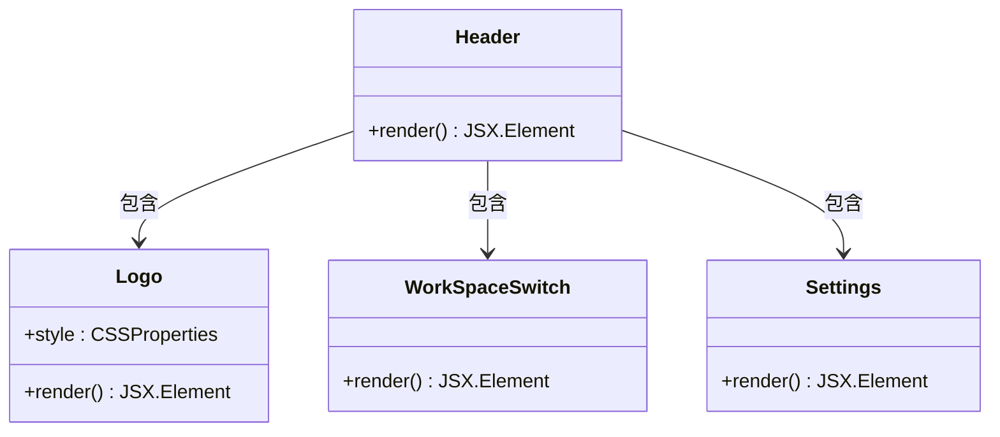
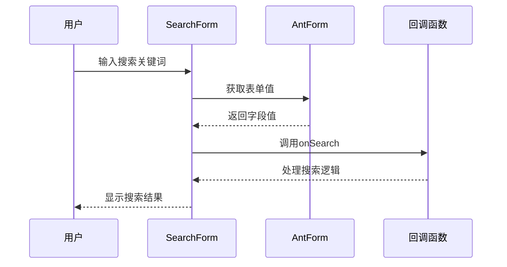
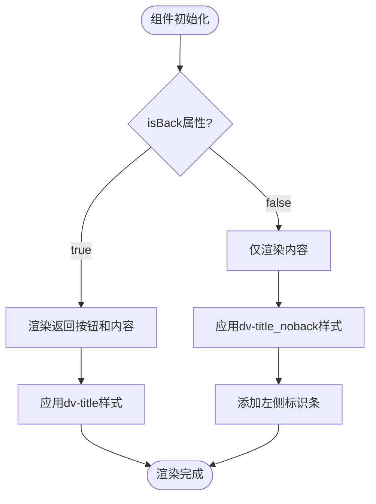
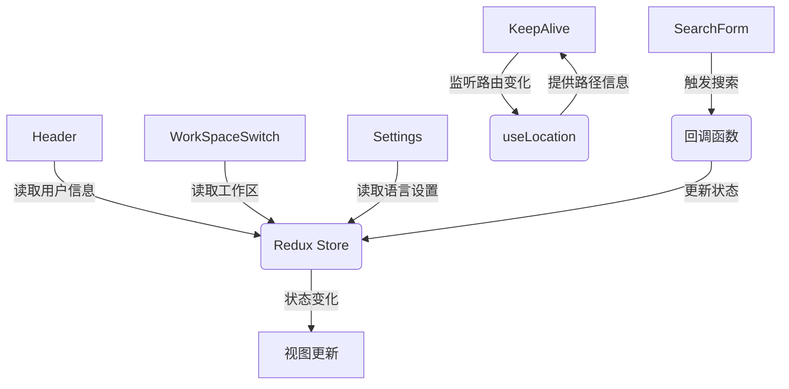
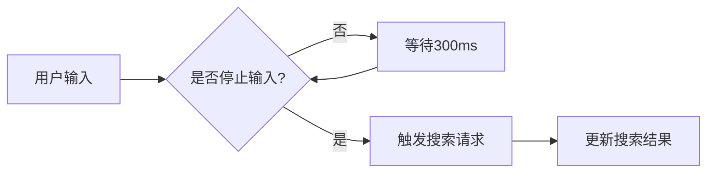

# 通用组件

<cite>
**本文档引用的文件**
- [Header/index.tsx](file://datavines-ui\src\component\Header\index.tsx)
- [Header/index.less](file://datavines-ui\src\component\Header\index.less)
- [SearchForm/index.tsx](file://datavines-ui\src\component\SearchForm\index.tsx)
- [SearchForm/index.less](file://datavines-ui\src\component\SearchForm\index.less)
- [Title/index.tsx](file://datavines-ui\src\component\Title\index.tsx)
- [Title/index.less](file://datavines-ui\src\component\Title\index.less)
- [KeepAlive.tsx](file://datavines-ui\src\component\KeepAlive.tsx)
- [GoBack/index.tsx](file://datavines-ui\src\component\GoBack\index.tsx)
- [Header/Settings/index.tsx](file://datavines-ui\src\component\Header\Settings\index.tsx)
- [Header/WorkSpaceSwitch/index.tsx](file://datavines-ui\src\component\Header\WorkSpaceSwitch\index.tsx)
</cite>

## 目录
1. [引言](#引言)
2. [页头组件设计](#页头组件设计)
3. [搜索表单实现](#搜索表单实现)
4. [标题栏动态渲染](#标题栏动态渲染)
5. [缓存组件原理](#缓存组件原理)
6. [组件通信与状态管理](#组件通信与状态管理)
7. [性能优化建议](#性能优化建议)
8. [使用示例](#使用示例)
9. [结论](#结论)

## 引言
本文档详细描述了Datavines项目中通用UI组件的设计与实现。重点分析了页头(Header)、搜索表单(SearchForm)、标题栏(Title)和缓存(KeepAlive)等核心组件的架构设计、实现原理和使用方法。这些组件构成了系统用户界面的基础，提供了统一的视觉风格和交互模式。

## 页头组件设计

页头组件(Header)是系统的主要导航区域，包含Logo、工作区切换和用户设置等功能模块。组件采用React函数式组件实现，通过Flex布局组织各个子组件。



**图示来源**
- [Header/index.tsx](file://datavines-ui\src\component\Header\index.tsx#L7-L15)
- [Header/Logo/index.tsx](file://datavines-ui\src\component\Header\Logo\index.tsx)
- [Header/WorkSpaceSwitch/index.tsx](file://datavines-ui\src\component\Header\WorkSpaceSwitch\index.tsx)
- [Header/Settings/index.tsx](file://datavines-ui\src\component\Header\Settings\index.tsx)

页头组件的主要特性包括：
- 响应式布局，适应不同屏幕尺寸
- 模块化设计，各功能组件独立可复用
- 使用Ant Design组件库确保UI一致性
- 支持国际化文本显示

**组件来源**
- [Header/index.tsx](file://datavines-ui\src\component\Header\index.tsx#L1-L15)

## 搜索表单实现

搜索表单(SearchForm)组件实现了受控组件模式，封装了Ant Design的Form和Input组件，提供统一的搜索界面。



**图示来源**
- [SearchForm/index.tsx](file://datavines-ui\src\component\SearchForm\index.tsx#L12-L43)

搜索表单的主要props接口定义如下：

| 属性 | 类型 | 默认值 | 描述 |
|------|------|--------|------|
| onSearch | (val: string) => void | 必需 | 搜索回调函数 |
| form | FormInstance | 可选 | 表单实例，外部传入或内部创建 |
| placeholder | string | 可选 | 输入框占位符文本 |

组件采用受控组件模式，通过`useMemo`和`Form.useForm()`实现表单实例的管理。当外部传入form实例时使用传入的实例，否则创建新的表单实例。

**组件来源**
- [SearchForm/index.tsx](file://datavines-ui\src\component\SearchForm\index.tsx#L6-L43)

## 标题栏动态渲染

标题栏(Title)组件实现了动态渲染机制，根据是否需要显示返回按钮来调整样式和布局。



**图示来源**
- [Title/index.tsx](file://datavines-ui\src\component\Title\index.tsx#L5-L12)
- [Title/index.less](file://datavines-ui\src\component\Title\index.less)

标题栏组件支持以下props：
- `isBack`: boolean类型，控制是否显示返回按钮
- `children`: React.ReactNode类型，标题内容

当`isBack`为true时，组件左侧显示返回按钮；为false时，左侧显示彩色标识条，增强视觉层次。

**组件来源**
- [Title/index.tsx](file://datavines-ui\src\component\Title\index.tsx#L5-L12)

## 缓存组件原理

KeepAlive组件实现了路由级别的组件缓存功能，通过React Portal和引用管理来保持组件状态。

```mermaid
classDiagram
class KeepAlive {
-containerRef : RefObject<HTMLDivElement>
-components : RefObject<Array<{name : string, ele : Children}>>
-update : Function
+render() JSX.Element
}
class Component {
-targetElement : HTMLDivElement
-activatedRef : RefObject<boolean>
+render() JSX.Element
}
class KeepAliveContext {
+destroy : (params : string, render? : boolean) => void
+isActive : boolean
}
KeepAlive --> Component : 渲染多个实例
KeepAlive --> KeepAliveContext : 提供上下文
Component --> ReactDOM.createPortal : 渲染到指定容器
```

**图示来源**
- [KeepAlive.tsx](file://datavines-ui\src\component\KeepAlive.tsx#L34-L113)

缓存组件的核心原理：
1. 使用`useRef`存储组件实例数组，避免重新渲染
2. 通过`useLocation`获取当前路由路径作为缓存键
3. 利用`ReactDOM.createPortal`将非激活组件渲染到隐藏容器中
4. 提供`destroy`方法用于手动清除特定路由的缓存

组件支持以下配置属性：
- `include`: string[]，指定需要缓存的路由
- `exclude`: string[]，指定不需要缓存的路由
- `maxLen`: number，默认5，缓存最大数量
- `children`: 被缓存的组件

**组件来源**
- [KeepAlive.tsx](file://datavines-ui\src\component\KeepAlive.tsx#L34-L113)

## 组件通信与状态管理

系统采用Redux进行全局状态管理，各组件通过useSelector和useActions进行状态读取和更新。



**图示来源**
- [Header/Settings/index.tsx](file://datavines-ui\src\component\Header\Settings\index.tsx#L9)
- [Header/WorkSpaceSwitch/index.tsx](file://datavines-ui\src\component\Header\WorkSpaceSwitch\index.tsx#L11)
- [KeepAlive.tsx](file://datavines-ui\src\component\KeepAlive.tsx#L18)

主要状态管理策略：
- 使用Redux管理用户登录信息、工作区选择等全局状态
- 通过React Context传递KeepAlive组件的缓存控制方法
- 利用React Router的hooks监听路由变化
- 使用自定义hooks封装常用状态逻辑

**组件来源**
- [Header/Settings/index.tsx](file://datavines-ui\src\component\Header\Settings\index.tsx)
- [Header/WorkSpaceSwitch/index.tsx](file://datavines-ui\src\component\Header\WorkSpaceSwitch\index.tsx)
- [KeepAlive.tsx](file://datavines-ui\src\component\KeepAlive.tsx)

## 性能优化建议

基于组件实现分析，提出以下性能优化建议：

### 虚拟滚动
对于包含大量数据的列表组件，建议实现虚拟滚动，只渲染可视区域内的元素，显著提升渲染性能。

### 懒加载
对非首屏显示的组件采用懒加载策略，使用React.lazy和Suspense实现代码分割，减少初始加载时间。

### 防抖处理
在搜索表单等频繁触发的交互场景中，建议添加防抖处理，避免过于频繁的请求调用。



**图示来源**
- [SearchForm/index.tsx](file://datavines-ui\src\component\SearchForm\index.tsx)

其他优化建议：
- 使用React.memo对纯展示组件进行记忆化
- 避免在render方法中创建新对象或函数
- 合理使用key属性优化列表渲染
- 对复杂计算使用useMemo进行缓存

**组件来源**
- [SearchForm/index.tsx](file://datavines-ui\src\component\SearchForm\index.tsx)

## 使用示例

### 页头组件使用
```jsx
<Header />
```

### 搜索表单使用
```jsx
<SearchForm 
    onSearch={handleSearch}
    placeholder="请输入搜索关键词"
/>
```

### 标题栏使用
```jsx
<Title isBack={true}>数据源管理</Title>
<Title isBack={false}>系统设置</Title>
```

### 缓存组件使用
```jsx
<KeepAlive include={['/main/home', '/main/datasource']}>
    <Route path="/main/home" component={Home} />
    <Route path="/main/datasource" component={DataSource} />
</KeepAlive>
```

这些组件在实际业务场景中被广泛使用，如数据源管理页面使用搜索表单进行过滤，详情页面使用带返回按钮的标题栏等。

**组件来源**
- [Header/index.tsx](file://datavines-ui\src\component\Header\index.tsx)
- [SearchForm/index.tsx](file://datavines-ui\src\component\SearchForm\index.tsx)
- [Title/index.tsx](file://datavines-ui\src\component\Title\index.tsx)
- [KeepAlive.tsx](file://datavines-ui\src\component\KeepAlive.tsx)

## 结论
本文档详细分析了Datavines项目中的核心UI组件设计与实现。这些组件采用模块化设计，具有良好的复用性和扩展性。通过合理的状态管理和性能优化策略，确保了系统的响应速度和用户体验。建议在实际开发中遵循组件的使用规范，充分利用其提供的功能特性，同时根据具体业务需求进行适当的定制和优化。