# datavines-ui模块

<cite>
**本文档引用的文件**  
- [package.json](file://datavines-ui/package.json)
- [src/index.tsx](file://datavines-ui/src/index.tsx)
- [src/App/index.tsx](file://datavines-ui/src/App/index.tsx)
- [src/router/index.tsx](file://datavines-ui/src/router/index.tsx)
- [src/router/mainRouter.tsx](file://datavines-ui/src/router/mainRouter.tsx)
- [src/store/index.ts](file://datavines-ui/src/store/index.ts)
- [src/store/rootReducer.ts](file://datavines-ui/src/store/rootReducer.ts)
- [src/view/Main/index.tsx](file://datavines-ui/src/view/Main/index.tsx)
- [src/view/Main/Home/index.tsx](file://datavines-ui/src/view/Main/Home/index.tsx)
- [src/view/Main/Warning/index.tsx](file://datavines-ui/src/view/Main/Warning/index.tsx)
- [src/view/Main/ErrorDataManage/index.tsx](file://datavines-ui/src/view/Main/ErrorDataManage/index.tsx)
- [src/view/Main/UserManage/index.tsx](file://datavines-ui/src/view/Main/UserManage/index.tsx)
- [src/view/Main/Label/index.tsx](file://datavines-ui/src/view/Main/Label/index.tsx)
- [src/component/Header/index.tsx](file://datavines-ui/src/component/Header/index.tsx)
- [src/theme/index.tsx](file://datavines-ui/src/theme/index.tsx)
</cite>

## 目录
1. [介绍](#介绍)
2. [项目结构](#项目结构)
3. [核心组件](#核心组件)
4. [架构概述](#架构概述)
5. [详细组件分析](#详细组件分析)
6. [依赖分析](#依赖分析)
7. [性能考虑](#性能考虑)
8. [故障排除指南](#故障排除指南)
9. [结论](#结论)

## 介绍

datavines-ui模块是DataVines数据质量平台的前端用户界面，基于React技术栈构建。该模块为用户提供直观的可视化界面，用于管理数据源、配置数据质量任务、监控任务执行状态以及查看质量报告。系统采用现代化的前端架构，包括React组件化开发、Redux状态管理、React Router路由控制以及Ant Design UI组件库，为用户提供流畅的操作体验。

**本文档引用的文件**  
- [package.json](file://datavines-ui/package.json)

## 项目结构

datavines-ui模块采用标准的React前端项目结构，主要包含以下目录：

- **build**: Webpack构建配置文件，包含开发和生产环境的配置
- **public**: 静态资源文件，如HTML模板
- **src**: 源代码目录，包含应用的主要逻辑
  - **App**: 应用根组件和配置提供者
  - **action**: Redux动作定义
  - **common**: 通用工具函数和组件
  - **component**: 可复用的UI组件
  - **hooks**: 自定义React Hooks
  - **http**: HTTP请求封装
  - **locale**: 国际化支持
  - **router**: 路由配置
  - **store**: Redux状态管理
  - **theme**: 主题配置
  - **type**: TypeScript类型定义
  - **view**: 页面视图组件
- **Editor**: 编辑器相关组件和工具
- **typings**: 类型定义文件

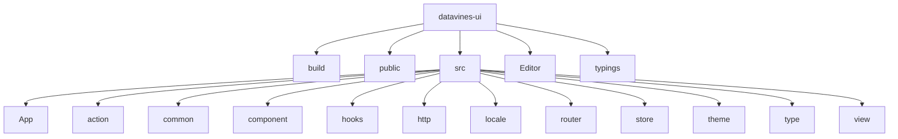

**本文档引用的文件**  
- [package.json](file://datavines-ui/package.json)

## 核心组件

datavines-ui模块的核心组件包括应用入口、路由系统、状态管理和UI组件。应用使用React 18作为基础框架，通过React Router实现客户端路由，Redux进行全局状态管理，并采用Ant Design作为UI组件库。模块还集成了Monaco Editor用于代码编辑，ECharts用于数据可视化。

**本文档引用的文件**  
- [package.json](file://datavines-ui/package.json)
- [src/index.tsx](file://datavines-ui/src/index.tsx)
- [src/App/index.tsx](file://datavines-ui/src/App/index.tsx)

## 架构概述

datavines-ui模块采用分层架构设计，主要包括表现层、逻辑层和数据层。表现层由React组件构成，负责用户界面的展示；逻辑层包含业务逻辑和状态管理；数据层处理与后端API的通信。

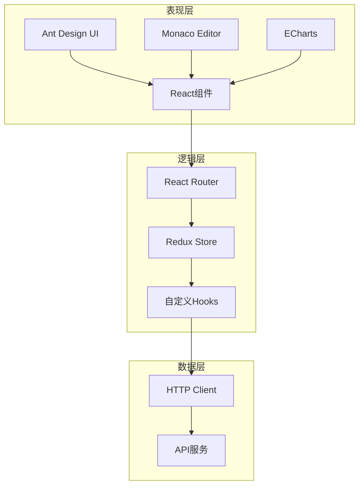

**本文档引用的文件**  
- [src/App/index.tsx](file://datavines-ui/src/App/index.tsx)
- [src/router/index.tsx](file://datavines-ui/src/router/index.tsx)
- [src/store/index.ts](file://datavines-ui/src/store/index.ts)

## 详细组件分析

### React组件架构

datavines-ui模块采用组件化开发模式，将UI分解为可复用的独立组件。主要组件包括布局组件、表单组件、表格组件和模态框组件等。组件之间通过props进行数据传递，使用React Hooks管理组件内部状态。

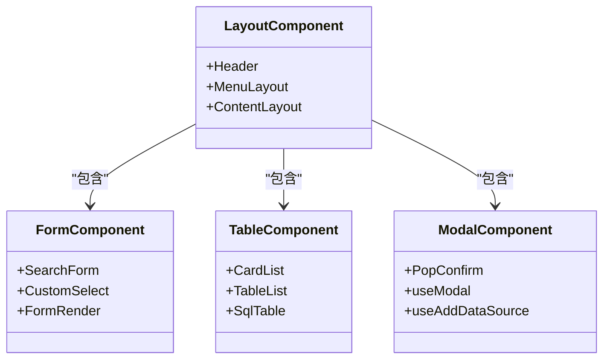

**本文档引用的文件**  
- [src/component/Header/index.tsx](file://datavines-ui/src/component/Header/index.tsx)
- [src/view/Main/Home/index.tsx](file://datavines-ui/src/view/Main/Home/index.tsx)

### 路由管理

datavines-ui模块使用React Router进行路由管理，实现了基于哈希的路由模式。路由配置分为登录前路由和主应用路由两部分，通过懒加载优化初始加载性能。

```mermaid
graph TD
A[根路由] --> B[登录路由]
A --> C[主应用路由]
B --> D[/login]
B --> E[/register]
B --> F[/forgetPwd]
C --> G[/main/home]
C --> H[/main/warning]
C --> I[/main/errorDataManage]
C --> J[/main/userManage]
C --> K[/main/label]
C --> L[/main/config]
C --> M[/main/tokenManager]
```

**本文档引用的文件**  
- [src/router/index.tsx](file://datavines-ui/src/router/index.tsx)
- [src/router/mainRouter.tsx](file://datavines-ui/src/router/mainRouter.tsx)

### 状态管理

datavines-ui模块采用Redux进行全局状态管理，将应用状态分为多个reducer，包括用户状态、通用状态、工作空间状态和数据源状态。通过Redux Thunk处理异步操作，Redux Logger在开发环境提供状态变更日志。

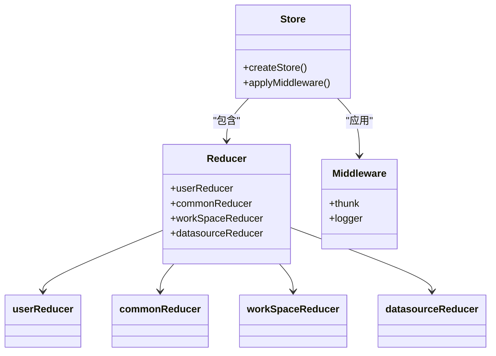

**本文档引用的文件**  
- [src/store/index.ts](file://datavines-ui/src/store/index.ts)
- [src/store/rootReducer.ts](file://datavines-ui/src/store/rootReducer.ts)

### API交互

datavines-ui模块通过封装的HTTP客户端与后端API进行交互。使用Axios作为HTTP客户端库，实现了请求和响应拦截器，统一处理认证、错误和加载状态。

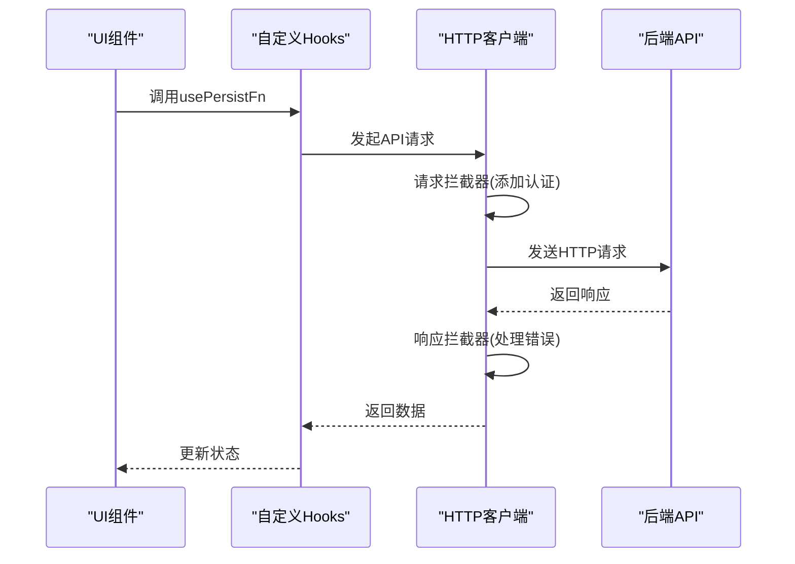

**本文档引用的文件**  
- [src/http/index.ts](file://datavines-ui/src/http/index.ts)
- [src/view/Main/Home/index.tsx](file://datavines-ui/src/view/Main/Home/index.tsx)

### 主要页面分析

#### 数据源管理页面

数据源管理页面提供数据源的列表展示、创建、编辑和删除功能。支持卡片和表格两种视图模式，用户可以根据偏好切换。

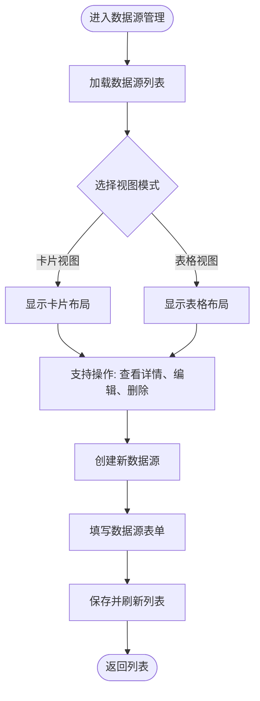

**本文档引用的文件**  
- [src/view/Main/Home/index.tsx](file://datavines-ui/src/view/Main/Home/index.tsx)

#### 任务配置页面

任务配置页面允许用户创建和管理数据质量检查任务。通过表单界面收集任务配置参数，支持多种数据源和检查规则。

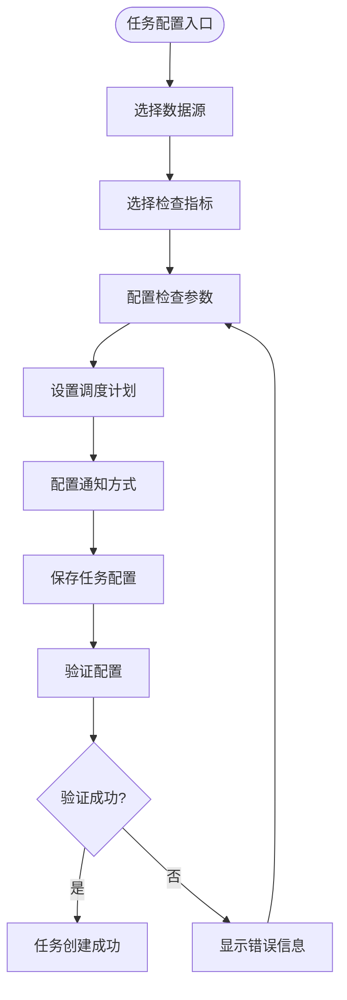

**本文档引用的文件**  
- [src/view/Main/Config/index.tsx](file://datavines-ui/src/view/Main/Config/index.tsx)

#### 执行监控页面

执行监控页面实时展示任务执行状态和日志，帮助用户了解任务运行情况。

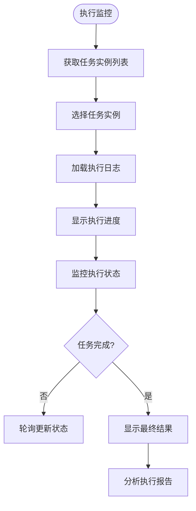

**本文档引用的文件**  
- [src/view/Main/HomeDetail/index.tsx](file://datavines-ui/src/view/Main/HomeDetail/index.tsx)

#### 质量报告页面

质量报告页面可视化展示数据质量检查结果，提供详细的指标分析和趋势图表。

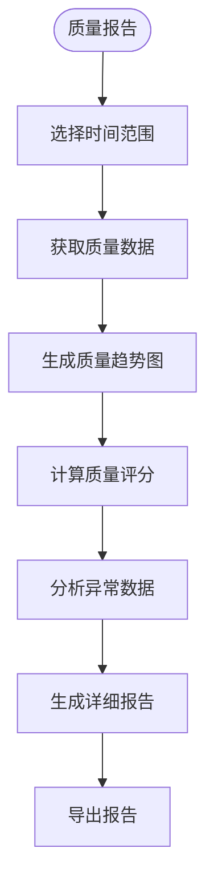

**本文档引用的文件**  
- [src/view/Main/HomeDetail/Dashboard/qualityReportDashboard/index.tsx](file://datavines-ui/src/view/Main/HomeDetail/Dashboard/qualityReportDashboard/index.tsx)

### Ant Design组件使用

datavines-ui模块广泛使用Ant Design组件库，包括按钮、表单、表格、模态框、通知等UI组件。通过按需加载和主题定制，优化了组件的使用效率和视觉一致性。

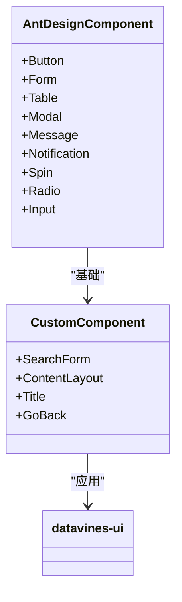

**本文档引用的文件**  
- [package.json](file://datavines-ui/package.json)
- [src/component/index.tsx](file://datavines-ui/src/component/index.tsx)

### 自定义主题配置

datavines-ui模块支持自定义主题配置，通过CSS变量实现主题的动态切换。主题配置包括颜色、字体、间距等设计系统元素。

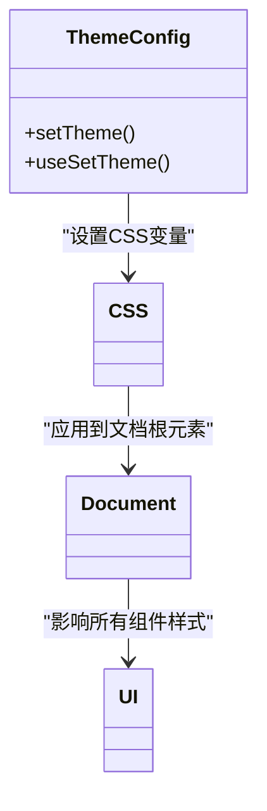

**本文档引用的文件**  
- [src/theme/index.tsx](file://datavines-ui/src/theme/index.tsx)

## 依赖分析

datavines-ui模块的依赖关系清晰，主要依赖包括React生态、UI组件库、状态管理、HTTP客户端和开发工具。

```mermaid
graph TD
A[datavines-ui] --> B[React]
A --> C[Ant Design]
A --> D[Redux]
A --> E[Axios]
A --> F[Webpack]
A --> G[TypeScript]
A --> H[Monaco Editor]
A --> I[ECharts]
A --> J[ahooks]
B --> K[React DOM]
B --> L[React Router]
C --> M[@ant-design/icons]
D --> N[Redux Thunk]
D --> O[Redux Logger]
F --> P[webpack-dev-server]
F --> Q[html-webpack-plugin]
```

**本文档引用的文件**  
- [package.json](file://datavines-ui/package.json)

## 性能考虑

datavines-ui模块在性能优化方面采取了多项措施，包括代码分割、懒加载、组件优化和缓存策略，确保应用的流畅运行。

### 前端开发环境搭建

datavines-ui模块使用Webpack作为构建工具，支持开发和生产两种环境配置。开发环境提供热重载和调试工具，生产环境进行代码压缩和优化。

### 构建部署

通过npm scripts提供标准化的构建命令，支持测试环境和生产环境的构建。

### 自定义UI组件开发

模块提供了丰富的自定义Hook和工具函数，支持快速开发新的UI组件。

### 性能优化最佳实践

- 使用React.memo优化组件渲染
- 采用懒加载减少初始加载时间
- 使用虚拟滚动处理大数据量列表
- 实现请求缓存减少重复API调用

### 用户体验改进

- 提供加载状态反馈
- 实现表单验证和错误提示
- 支持国际化和多语言
- 优化移动端适配

**本文档引用的文件**  
- [package.json](file://datavines-ui/package.json)
- [build/webpack.common.js](file://datavines-ui/build/webpack.common.js)

## 故障排除指南

### 常见问题

1. **页面空白**: 检查控制台错误，确认依赖安装完整
2. **API调用失败**: 检查后端服务是否正常运行，确认跨域配置
3. **样式丢失**: 确认CSS文件正确加载，检查Webpack配置
4. **状态更新异常**: 检查Redux action和reducer逻辑

### 调试工具

- React DevTools: 检查组件树和状态
- Redux DevTools: 跟踪状态变更
- 浏览器开发者工具: 调试网络请求和JavaScript错误

**本文档引用的文件**  
- [src/App/index.tsx](file://datavines-ui/src/App/index.tsx)
- [src/store/index.ts](file://datavines-ui/src/store/index.ts)

## 结论

datavines-ui模块作为DataVines平台的前端界面，提供了完整的数据质量管理功能。通过现代化的前端技术栈和良好的架构设计，实现了高性能、易维护的用户界面。模块具有良好的扩展性，支持未来功能的持续迭代和优化。