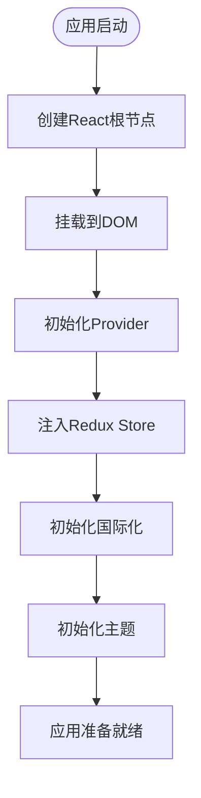
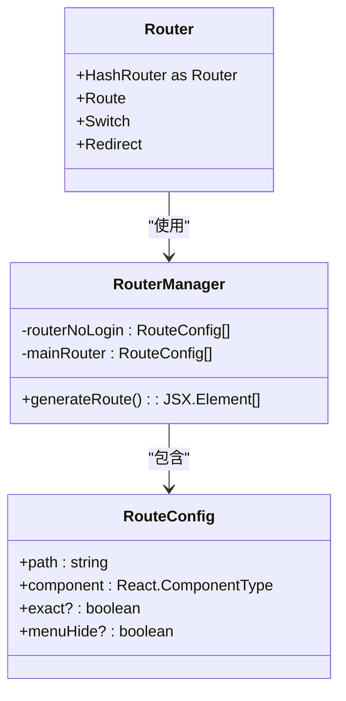
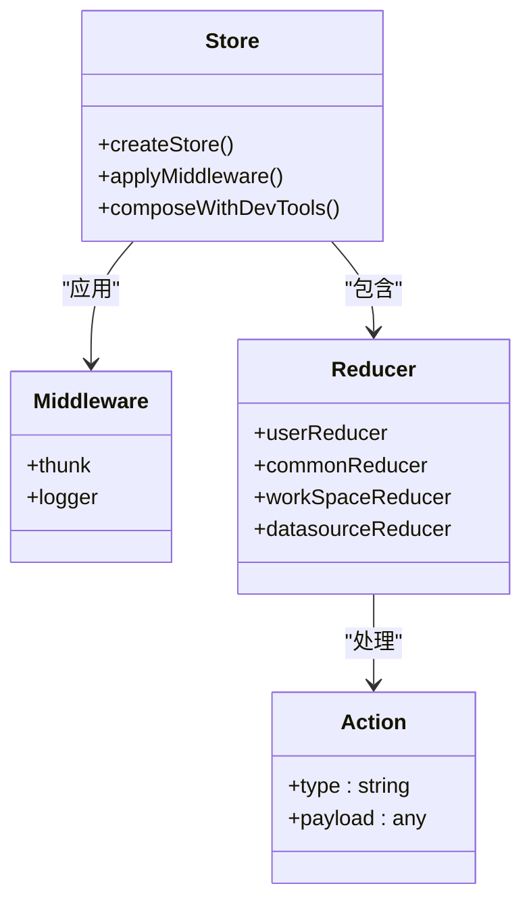
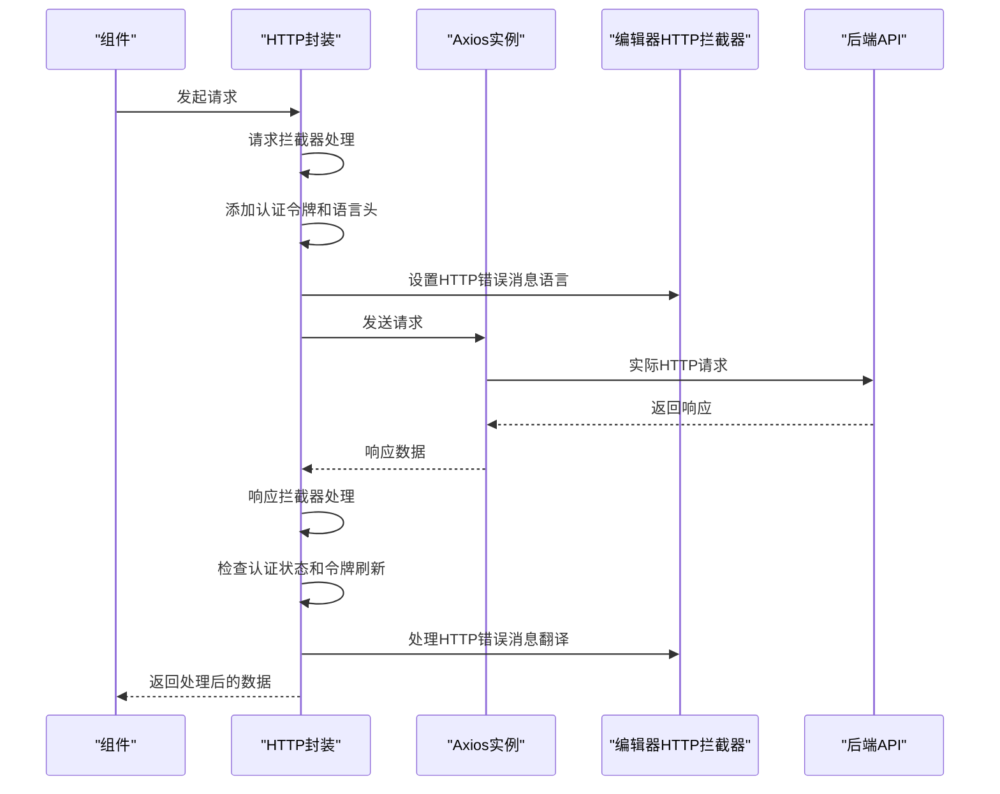
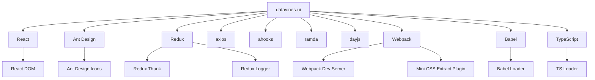
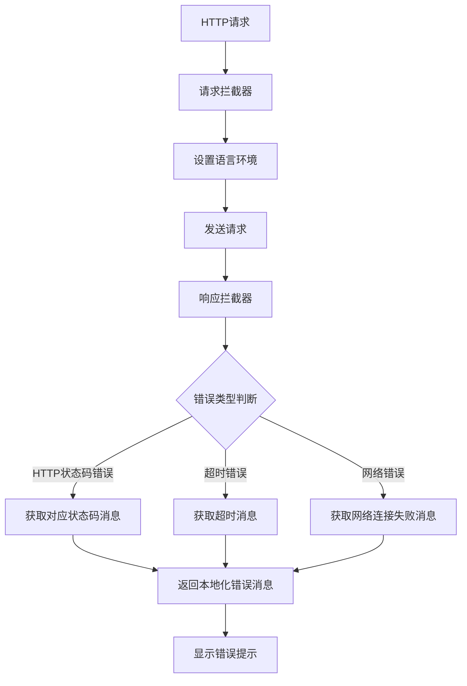

# 前端架构设计

<cite>
**本文档引用的文件**  
- [package.json](file://datavines-ui/package.json)
- [index.tsx](file://datavines-ui/src/index.tsx)
- [App/index.tsx](file://datavines-ui/src/App/index.tsx)
- [router/index.tsx](file://datavines-ui/src/router/index.tsx)
- [router/mainRouter.tsx](file://datavines-ui/src/router/mainRouter.tsx)
- [store/index.ts](file://datavines-ui/src/store/index.ts)
- [store/rootReducer.ts](file://datavines-ui/src/store/rootReducer.ts)
- [store/commonReducer/index.ts](file://datavines-ui/src/store/commonReducer/index.ts)
- [store/userReducer/index.ts](file://datavines-ui/src/store/userReducer/index.ts)
- [http/index.ts](file://datavines-ui/src/http/index.ts)
- [theme/index.tsx](file://datavines-ui/src/theme/index.tsx)
- [locale/index.tsx](file://datavines-ui/src/locale/index.tsx)
- [locale/zh_CN.ts](file://datavines-ui/src/locale/zh_CN.ts)
- [locale/en_US.ts](file://datavines-ui/src/locale/en_US.ts)
- [App/ConfigProvider.tsx](file://datavines-ui/src/App/ConfigProvider.tsx)
- [view/Main/index.tsx](file://datavines-ui/src/view/Main/index.tsx)
- [Editor/http/response.interceptor.ts](file://datavines-ui/Editor/http/response.interceptor.ts)
- [src/preset.ts](file://datavines-ui/src/preset.ts)
</cite>

## 目录
1. [项目结构](#项目结构)
2. [应用启动流程](#应用启动流程)
3. [路由管理](#路由管理)
4. [状态管理](#状态管理)
5. [HTTP请求封装](#http请求封装)
6. [主题定制方案](#主题定制方案)
7. [国际化实现](#国际化实现)
8. [代码组织结构与模块依赖](#代码组织结构与模块依赖)
9. [架构决策考量](#架构决策考量)
10. [性能优化策略](#性能优化策略)

## 项目结构

datavines-ui前端项目采用基于React+Ant Design的组件化架构，项目结构清晰，模块划分明确。主要目录包括：
- `src`: 源代码目录，包含应用的核心代码
- `src/App`: 应用根组件和配置提供者
- `src/component`: 通用UI组件
- `src/hooks`: 自定义React Hooks
- `src/http`: HTTP请求封装
- `src/locale`: 国际化语言包
- `src/router`: 路由配置
- `src/store`: Redux状态管理
- `src/theme`: 主题定制
- `src/view`: 页面视图组件
- `src/utils`: 工具函数
- `Editor/http`: 编辑器HTTP拦截器（新增）

**Section sources**
- [package.json](file://datavines-ui/package.json)

## 应用启动流程

datavines-ui应用的启动流程从`src/index.tsx`文件开始，通过React的createRoot方法将应用挂载到DOM节点上。应用启动时会进行以下初始化操作：
1. 创建React根节点并挂载到id为"root"的DOM元素
2. 使用Suspense组件包裹应用，提供加载状态的fallback
3. 通过Provider组件将Redux store注入到应用中
4. 初始化国际化和主题配置

应用启动流程体现了React应用的标准启动模式，确保了应用的稳定性和可维护性。



**Diagram sources**
- [index.tsx](file://datavines-ui/src/index.tsx)
- [App/index.tsx](file://datavines-ui/src/App/index.tsx)

**Section sources**
- [index.tsx](file://datavines-ui/src/index.tsx)
- [App/index.tsx](file://datavines-ui/src/App/index.tsx)

## 路由管理

datavines-ui使用react-router-dom进行路由管理，采用HashRouter模式，确保在不同部署环境下路由的稳定性。路由配置分为登录前路由和主应用路由两部分：

1. **登录前路由**：包含登录、注册、忘记密码等不需要认证的页面
2. **主应用路由**：包含数据源管理、告警管理、用户管理等需要认证的功能模块

路由配置采用了懒加载模式，通过React.lazy和import()语法实现代码分割，优化了应用的初始加载性能。



**Diagram sources**
- [App/index.tsx](file://datavines-ui/src/App/index.tsx)
- [router/index.tsx](file://datavines-ui/src/router/index.tsx)
- [router/mainRouter.tsx](file://datavines-ui/src/router/mainRouter.tsx)

**Section sources**
- [App/index.tsx](file://datavines-ui/src/App/index.tsx)
- [router/index.tsx](file://datavines-ui/src/router/index.tsx)
- [router/mainRouter.tsx](file://datavines-ui/src/router/mainRouter.tsx)

## 状态管理

datavines-ui采用Redux作为状态管理方案，结合Redux Thunk中间件处理异步操作。状态管理架构包括：

1. **Store创建**：使用createStore创建Redux store，结合combineReducers管理多个reducer
2. **Middleware配置**：在开发环境中使用redux-logger记录状态变化，在生产环境中仅使用redux-thunk处理异步操作
3. **DevTools集成**：在开发环境中集成Redux DevTools Extension，便于调试状态变化

状态管理模块包括多个reducer，分别管理用户信息、通用状态、工作空间和数据源等不同领域的状态。



**Diagram sources**
- [store/index.ts](file://datavines-ui/src/store/index.ts)
- [store/rootReducer.ts](file://datavines-ui/src/store/rootReducer.ts)
- [store/commonReducer/index.ts](file://datavines-ui/src/store/commonReducer/index.ts)
- [store/userReducer/index.ts](file://datavines-ui/src/store/userReducer/index.ts)

**Section sources**
- [store/index.ts](file://datavines-ui/src/store/index.ts)
- [store/rootReducer.ts](file://datavines-ui/src/store/rootReducer.ts)
- [store/commonReducer/index.ts](file://datavines-ui/src/store/commonReducer/index.ts)
- [store/userReducer/index.ts](file://datavines-ui/src/store/userReducer/index.ts)

## HTTP请求封装

datavines-ui通过axios封装HTTP请求，提供了统一的请求拦截器和响应拦截器，确保请求的安全性和一致性。HTTP请求封装的主要特性包括：

1. **基础配置**：设置API基础URL为"/api/v1"
2. **请求拦截器**：在请求头中添加认证令牌和语言信息，同时设置HTTP错误消息的国际化语言
3. **响应拦截器**：处理认证过期、令牌刷新等特殊情况，新增完整的HTTP错误消息翻译支持
4. **历史管理**：集成createHashHistory，便于在应用中导航

HTTP请求封装确保了与后端API的稳定通信，同时提供了良好的错误处理机制。



**Diagram sources**
- [http/index.ts](file://datavines-ui/src/http/index.ts)
- [Editor/http/response.interceptor.ts](file://datavines-ui/Editor/http/response.interceptor.ts)

**Section sources**
- [http/index.ts](file://datavines-ui/src/http/index.ts)
- [Editor/http/response.interceptor.ts](file://datavines-ui/Editor/http/response.interceptor.ts)

## 主题定制方案

datavines-ui提供了灵活的主题定制方案，允许用户自定义应用的外观。主题定制通过CSS变量实现，主要特性包括：

1. **动态主题设置**：通过setTheme函数动态设置CSS变量
2. **Ant Design集成**：通过ConfigProvider组件集成Ant Design的主题配置
3. **颜色定制**：支持自定义主色调和圆角半径

主题定制方案使得应用能够适应不同的品牌需求和用户偏好。

```mermaid
classDiagram
class ThemeManager {
+setTheme(themeObj : Record<string, string>)
+useSetTheme()
}
class CSSVariables {
+--primary-color
+--border-radius
}
class AntDesignConfig {
+theme : { token : { colorPrimary, borderRadius } }
+locale
+prefixCls
}
ThemeManager --> CSSVariables : "设置"
ThemeManager --> AntDesignConfig : "集成"
```

**Diagram sources**
- [theme/index.tsx](file://datavines-ui/src/theme/index.tsx)
- [App/ConfigProvider.tsx](file://datavines-ui/src/App/ConfigProvider.tsx)

**Section sources**
- [theme/index.tsx](file://datavines-ui/src/theme/index.tsx)
- [App/ConfigProvider.tsx](file://datavines-ui/src/App/ConfigProvider.tsx)

## 国际化实现

datavines-ui采用react-intl实现国际化，支持中文和英文两种语言。国际化实现的主要特性包括：

1. **语言包管理**：在`src/locale`目录下维护zh_CN和en_US两个语言包，包含完整的HTTP错误消息翻译
2. **动态语言切换**：通过Redux状态管理当前语言，并在切换时更新UI
3. **Ant Design集成**：同步更新Ant Design组件库的语言设置
4. **本地存储**：将用户选择的语言偏好存储在Cookie中，实现持久化
5. **HTTP错误消息翻译**：新增完整的HTTP错误消息本地化支持，包括网络连接、超时、各种HTTP状态码的本地化消息

国际化实现确保了应用能够服务于不同语言的用户群体。

```mermaid
classDiagram
class IntlProvider {
+locale
+messages
+defaultLocale
}
class LanguageManager {
+useCommonActions().setLocale()
+chooseLocale()
}
class LanguagePack {
+zh_CN : { key : value }
+en_US : { key : value }
}
class Storage {
+Cookies.set("language")
+navigator.language
}
class HttpErrorTranslation {
+http_error_network
+http_error_timeout
+http_error_400
+http_error_401
+http_error_403
+http_error_404
+http_error_500
+http_error_502
+http_error_503
+http_error_504
+http_error_unknown
}
LanguageManager --> IntlProvider : "配置"
LanguageManager --> LanguagePack : "选择"
LanguageManager --> Storage : "持久化"
LanguagePack --> HttpErrorTranslation : "包含"
```

**Diagram sources**
- [locale/index.tsx](file://datavines-ui/src/locale/index.tsx)
- [locale/zh_CN.ts](file://datavines-ui/src/locale/zh_CN.ts)
- [locale/en_US.ts](file://datavines-ui/src/locale/en_US.ts)
- [store/commonReducer/index.ts](file://datavines-ui/src/store/commonReducer/index.ts)

**Section sources**
- [locale/index.tsx](file://datavines-ui/src/locale/index.tsx)
- [locale/zh_CN.ts](file://datavines-ui/src/locale/zh_CN.ts)
- [locale/en_US.ts](file://datavines-ui/src/locale/en_US.ts)
- [store/commonReducer/index.ts](file://datavines-ui/src/store/commonReducer/index.ts)

## 代码组织结构与模块依赖

datavines-ui的代码组织结构体现了清晰的模块化设计原则，各模块职责明确，依赖关系清晰。主要模块及其依赖关系如下：

1. **核心依赖**：React、Ant Design、Redux、axios等
2. **工具库**：ahooks、ramda、dayjs等
3. **构建工具**：Webpack、Babel、TypeScript等

模块依赖关系体现了现代前端应用的典型架构，确保了代码的可维护性和可扩展性。



**Diagram sources**
- [package.json](file://datavines-ui/package.json)

**Section sources**
- [package.json](file://datavines-ui/package.json)

## 架构决策考量

在选择Redux而非Context API作为状态管理方案时，主要基于以下考量：

1. **复杂状态管理**：应用需要管理多个领域的状态（用户、通用、工作空间、数据源等），Redux提供了更强大的状态管理能力
2. **调试能力**：Redux DevTools提供了强大的状态变化追踪和调试功能，便于开发和问题排查
3. **中间件支持**：Redux Thunk中间件能够优雅地处理异步操作，如API调用和令牌刷新
4. **可预测性**：Redux的单向数据流和不可变状态更新确保了应用状态的可预测性
5. **团队熟悉度**：Redux在团队中具有较高的熟悉度和使用经验，降低了学习成本

这些架构决策确保了应用的可维护性、可扩展性和开发效率。

**Section sources**
- [store/index.ts](file://datavines-ui/src/store/index.ts)
- [store/rootReducer.ts](file://datavines-ui/src/store/rootReducer.ts)

## 性能优化策略

datavines-ui实现了多种性能优化策略，确保应用的流畅性和响应速度：

1. **代码分割与懒加载**：通过React.lazy和import()语法实现路由级别的代码分割，减少初始加载包大小
2. **Webpack优化**：使用TerserWebpackPlugin压缩代码，MiniCssExtractPlugin提取CSS，优化构建输出
3. **组件优化**：使用React.memo、useCallback等Hooks避免不必要的渲染
4. **HTTP优化**：通过请求拦截器统一处理认证信息，减少重复代码
5. **资源管理**：使用webpack-bundle-analyzer分析包大小，持续优化依赖

这些性能优化策略共同确保了应用在各种设备和网络条件下的良好用户体验。

**Section sources**
- [App/index.tsx](file://datavines-ui/src/App/index.tsx)
- [router/index.tsx](file://datavines-ui/src/router/index.tsx)
- [package.json](file://datavines-ui/package.json)
- [webpack.common.js](file://datavines-ui/build/webpack.common.js)
- [webpack.production.js](file://datavines-ui/build/webpack.production.js)

## HTTP错误消息翻译扩展

**更新** 扩展了国际化支持，新增了完整的HTTP错误消息翻译功能

datavines-ui在原有国际化基础上，新增了完整的HTTP错误消息翻译支持。这一扩展通过以下方式实现：

1. **编辑器HTTP拦截器**：在`Editor/http/response.interceptor.ts`中实现了独立的HTTP错误消息翻译逻辑
2. **多语言错误消息**：支持中文和英文两种语言的HTTP错误消息翻译
3. **错误类型覆盖**：涵盖网络连接失败、请求超时、各种HTTP状态码（400、401、403、404、500、502、503、504）等
4. **动态语言切换**：通过`setHttpErrorLocale`函数实现实时语言切换
5. **与主应用集成**：在HTTP请求拦截器中自动设置当前语言环境

HTTP错误消息翻译的实现确保了用户在遇到各种网络和服务器错误时，都能获得准确的本地化错误提示。



**Diagram sources**
- [Editor/http/response.interceptor.ts](file://datavines-ui/Editor/http/response.interceptor.ts)
- [http/index.ts](file://datavines-ui/src/http/index.ts)

**Section sources**
- [Editor/http/response.interceptor.ts](file://datavines-ui/Editor/http/response.interceptor.ts)
- [http/index.ts](file://datavines-ui/src/http/index.ts)
- [locale/zh_CN.ts](file://datavines-ui/src/locale/zh_CN.ts)
- [locale/en_US.ts](file://datavines-ui/src/locale/en_US.ts)
- [src/preset.ts](file://datavines-ui/src/preset.ts)