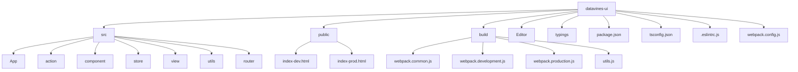
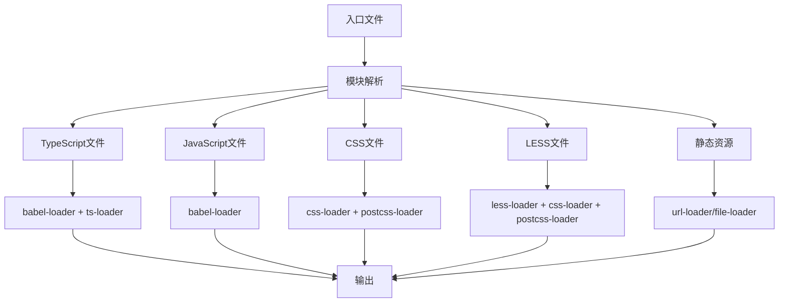
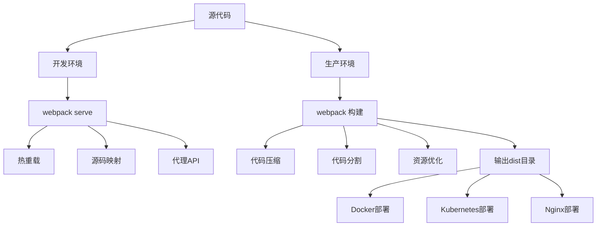

# 开发与部署指南

<cite>
**本文档中引用的文件**  
- [package.json](file://datavines-ui/package.json)
- [babel.config.js](file://datavines-ui/babel.config.js)
- [.eslintrc.js](file://datavines-ui/.eslintrc.js)
- [tsconfig.json](file://datavines-ui/tsconfig.json)
- [webpack.common.js](file://datavines-ui/build/webpack.common.js)
- [webpack.development.js](file://datavines-ui/build/webpack.development.js)
- [webpack.production.js](file://datavines-ui/build/webpack.production.js)
- [build.js](file://datavines-ui/build.js)
- [index-dev.html](file://datavines-ui/public/index-dev.html)
- [index-prod.html](file://datavines-ui/public/index-prod.html)
- [Dockerfile](file://deploy/docker/Dockerfile)
- [docker-compose.yaml](file://deploy/compose/docker-compose.yaml)
- [.env](file://deploy/compose/.env)
- [datavines.yaml](file://deploy/k8s/datavines.yaml)
</cite>

## 目录
1. [简介](#简介)
2. [项目结构](#项目结构)
3. [开发环境搭建](#开发环境搭建)
4. [本地开发服务器配置](#本地开发服务器配置)
5. [代码规范与ESLint配置](#代码规范与eslint配置)
6. [构建流程与Webpack配置](#构建流程与webpack配置)
7. [生产环境构建配置](#生产环境构建配置)
8. [资源优化策略](#资源优化策略)
9. [部署方案](#部署方案)
10. [环境变量管理与多环境配置](#环境变量管理与多环境配置)
11. [常见构建错误解决方案](#常见构建错误解决方案)
12. [附录](#附录)

## 简介
本指南详细介绍了DataVines前端项目的完整开发与部署流程。内容涵盖开发环境搭建、本地开发服务器配置、代码规范、构建流程、生产环境优化、部署方案以及环境变量管理等关键方面。通过本指南，开发者可以快速搭建开发环境，理解项目构建机制，并成功部署应用到生产环境。

## 项目结构
DataVines项目的前端代码位于`datavines-ui`目录中，采用现代化的React+TypeScript技术栈。项目结构清晰，包含源代码、构建配置、静态资源和部署文件。



**Diagram sources**
- [package.json](file://datavines-ui/package.json)
- [tsconfig.json](file://datavines-ui/tsconfig.json)

**Section sources**
- [package.json](file://datavines-ui/package.json)
- [project_structure](file://project_structure)

## 开发环境搭建
### Node.js版本要求
根据`package.json`文件中的依赖项，建议使用Node.js 14.x或更高版本。项目依赖的npm版本为8.19.2。

### 依赖安装
通过npm安装项目依赖：
```bash
cd datavines-ui
npm install
```

项目主要依赖包括：
- React 18.2.0
- Ant Design 5.0.5
- TypeScript 4.6.4
- Webpack 5.42.0
- Axios 0.21.1

**Section sources**
- [package.json](file://datavines-ui/package.json)

## 本地开发服务器配置
### 开发服务器启动
项目提供了两种开发环境配置：测试环境和生产环境。通过以下命令启动：

```bash
# 启动测试环境开发服务器
npm run dev:test

# 启动生产环境开发服务器
npm run dev:prod
```

### Webpack开发服务器配置
开发服务器配置在`build/webpack.development.js`中，主要配置如下：
- 开发模式：`development`
- 端口：5000
- 热重载：启用
- 代理配置：将`/api`请求代理到后端服务
- 源码映射：`cheap-module-source-map`

代理配置允许前端开发服务器将API请求转发到后端服务，解决跨域问题。代理目标通过环境变量`DV_ENV`确定，支持`test`和`prod`环境。

**Section sources**
- [package.json](file://datavines-ui/package.json#L8-L9)
- [webpack.development.js](file://datavines-ui/build/webpack.development.js)

## 代码规范与ESLint配置
### ESLint配置
项目使用ESLint进行代码质量检查，配置文件为`.eslintrc.js`，主要规则包括：
- 代码风格：基于Airbnb规范
- 缩进：4个空格
- 引号：单引号
- 行长度：最大200字符
- TypeScript支持：启用
- React支持：启用

### 关键代码规范
- 使用4个空格进行缩进
- 使用单引号包裹字符串
- JSX文件扩展名为`.tsx`
- 禁用`console`语句（开发环境除外）
- 允许未使用的变量（由TypeScript处理）

### Babel配置
Babel配置文件`babel.config.js`定义了代码转换规则：
- 支持ES6+语法
- 支持React JSX
- 支持TypeScript
- 开发环境启用React热重载
- 按需加载Ant Design组件

**Section sources**
- [.eslintrc.js](file://datavines-ui/.eslintrc.js)
- [babel.config.js](file://datavines-ui/babel.config.js)

## 构建流程与Webpack配置
### 构建脚本
项目构建通过Webpack完成，构建脚本定义在`package.json`中：
```bash
# 构建测试环境
npm run build:test

# 构建生产环境
npm run build:prod
```

### Webpack配置架构
项目采用模块化的Webpack配置，包含三个主要配置文件：
- `webpack.common.js`：通用配置
- `webpack.development.js`：开发环境配置
- `webpack.production.js`：生产环境配置

配置通过`webpack-merge`工具合并。

### 核心构建规则


**Diagram sources**
- [webpack.common.js](file://datavines-ui/build/webpack.common.js)

**Section sources**
- [webpack.common.js](file://datavines-ui/build/webpack.common.js)
- [package.json](file://datavines-ui/package.json#L10-L11)

## 生产环境构建配置
### 生产环境优化
生产环境构建配置在`webpack.production.js`中，包含以下优化：
- 模式：`production`
- 代码压缩：启用TerserPlugin
- 性能提示：禁用
- 输出路径：相对路径`./`

### 代码压缩配置
TerserPlugin配置了详细的压缩选项：
- 移除注释
- 压缩代码
- 并行处理
- 在生产环境中移除`console`语句

### 输出配置
生产环境构建输出到`dist`目录，文件结构如下：
- `js/`：JavaScript文件
- `css/`：CSS样式文件
- `images/`：图片资源
- `monaco-editor/`：代码编辑器资源
- `static/`：第三方库

**Section sources**
- [webpack.production.js](file://datavines-ui/build/webpack.production.js)

## 资源优化策略
### 代码分割
通过Webpack的`splitChunks`功能实现代码分割：
- 将node_modules中的依赖打包到`vendors`块
- 重复使用的代码块单独打包
- 按需加载组件

### 静态资源处理
- 图片资源：小于10KB的图片转为Base64编码，减少HTTP请求
- 字体文件：使用file-loader处理
- LESS/CSS：提取到单独的CSS文件
- 第三方库：通过CopyPlugin复制到输出目录

### 缓存策略
- 使用内容哈希（content hash）命名文件，实现长期缓存
- 主文件使用`[fullhash]`，代码块使用`[chunkhash]`
- 支持浏览器缓存优化

**Section sources**
- [webpack.common.js](file://datavines-ui/build/webpack.common.js#L108-L128)

## 部署方案
### Docker部署
项目提供Docker部署方案，相关文件位于`deploy/docker/`目录。

#### Dockerfile分析
```dockerfile
FROM openjdk:8
WORKDIR /opt
COPY datavines-dist/target/datavines-${VERSION}-bin.tar.gz .
RUN tar -zxvf datavines-${VERSION}-bin.tar.gz && \
    mv datavines-${VERSION}-bin datavines && \
    rm -rf datavines-${VERSION}-bin.tar.gz
EXPOSE 5600
CMD ["/usr/bin/tini", "--", "datavines/bin/datavines-daemon.sh", "start_container", ""]
```

#### Docker Compose配置
```yaml
version: '3.8'
services:
  datavines:
    image: datavines:dev
    container_name: datavines
    ports:
      - 5600:5600
    env_file: .env
    privileged: true
    restart: unless-stopped
```

### Kubernetes部署
Kubernetes部署配置在`deploy/k8s/datavines.yaml`中，包含：
- Deployment：定义应用部署
- Service：定义服务暴露
- Ingress：定义外部访问

#### Kubernetes资源配置
- 命名空间：bigdata
- 副本数：1
- 端口：5600
- 环境变量：数据库连接信息
- 镜像：registry.cn-shanghai.aliyuncs.com/luckydata/datavines:dev

### Nginx部署建议
虽然项目未提供Nginx配置，但推荐的Nginx配置如下：
```nginx
server {
    listen 80;
    server_name datavines.example.com;
    
    root /path/to/datavines/dist;
    index index.html;
    
    location / {
        try_files $uri $uri/ /index.html;
    }
    
    location /api {
        proxy_pass http://backend-server:5600;
        proxy_set_header Host $host;
        proxy_set_header X-Real-IP $remote_addr;
    }
    
    # 静态资源缓存
    location ~* \.(js|css|png|jpg|jpeg|gif|ico|svg)$ {
        expires 1y;
        add_header Cache-Control "public, immutable";
    }
}
```

**Section sources**
- [Dockerfile](file://deploy/docker/Dockerfile)
- [docker-compose.yaml](file://deploy/compose/docker-compose.yaml)
- [datavines.yaml](file://deploy/k8s/datavines.yaml)

## 环境变量管理与多环境配置
### 环境变量配置
项目通过环境变量实现多环境配置，主要环境变量包括：
- `DV_ENV`：前端环境（test/prod）
- `NODE_ENV`：Node.js环境（development/production）
- `SPRING_PROFILES_ACTIVE`：后端Spring配置文件
- `SPRING_DATASOURCE_URL`：数据库连接URL
- `SPRING_DATASOURCE_USERNAME`：数据库用户名
- `SPRING_DATASOURCE_PASSWORD`：数据库密码

### 多环境配置实现
#### 前端环境配置
通过Webpack的`DefinePlugin`将环境变量注入到代码中：
```javascript
new webpack.DefinePlugin({
    'process.env.NODE_ENV': JSON.stringify(process.env.NODE_ENV),
    'process.env.DV_ENV': JSON.stringify(process.env.DV_ENV),
})
```

#### 后端环境配置
通过`.env`文件配置后端服务环境变量：
```env
SPRING_PROFILES_ACTIVE=mysql
SPRING_DATASOURCE_URL=jdbc:mysql://127.0.0.1:3306/datavines?useSSL=false&useUnicode=true&characterEncoding=UTF-8&allowPublicKeyRetrieval=false&useJDBCCompliantTimezoneShift=true&useLegacyDatetimeCode=false&serverTimezone=GMT%2B8
SPRING_DATASOURCE_USERNAME=root
SPRING_DATASOURCE_PASSWORD=123456
```

### 环境切换流程
1. 设置`DV_ENV`环境变量为`test`或`prod`
2. 运行相应的构建命令
3. 启动服务或部署到目标环境

**Section sources**
- [webpack.common.js](file://datavines-ui/build/webpack.common.js#L173-L176)
- [.env](file://deploy/compose/.env)

## 常见构建错误解决方案
### TypeScript类型错误
**问题**：TypeScript类型检查失败
**解决方案**：
- 检查`tsconfig.json`配置
- 确保类型定义文件正确
- 在开发环境中使用`transpileOnly: true`跳过类型检查

### Webpack构建性能问题
**问题**：构建速度慢
**解决方案**：
- 启用`cacheDirectory`选项
- 使用`fork-ts-checker-webpack-plugin`将类型检查放到单独进程
- 优化`splitChunks`配置

### 样式加载问题
**问题**：LESS样式未正确加载
**解决方案**：
- 检查`less-loader`配置
- 确保`javascriptEnabled: true`
- 验证Ant Design主题变量配置

### 环境变量未生效
**问题**：环境变量未正确注入
**解决方案**：
- 检查`DefinePlugin`配置
- 确保环境变量在构建时设置
- 验证`process.env`访问方式

### 生产环境白屏
**问题**：生产环境部署后页面空白
**解决方案**：
- 检查`publicPath`配置是否正确
- 验证HTML模板路径
- 确保静态资源路径正确

**Section sources**
- [webpack.common.js](file://datavines-ui/build/webpack.common.js)
- [webpack.production.js](file://datavines-ui/build/webpack.production.js)

## 附录
### 构建流程图


**Diagram sources**
- [webpack.development.js](file://datavines-ui/build/webpack.development.js)
- [webpack.production.js](file://datavines-ui/build/webpack.production.js)