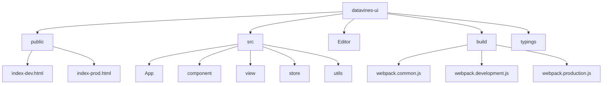
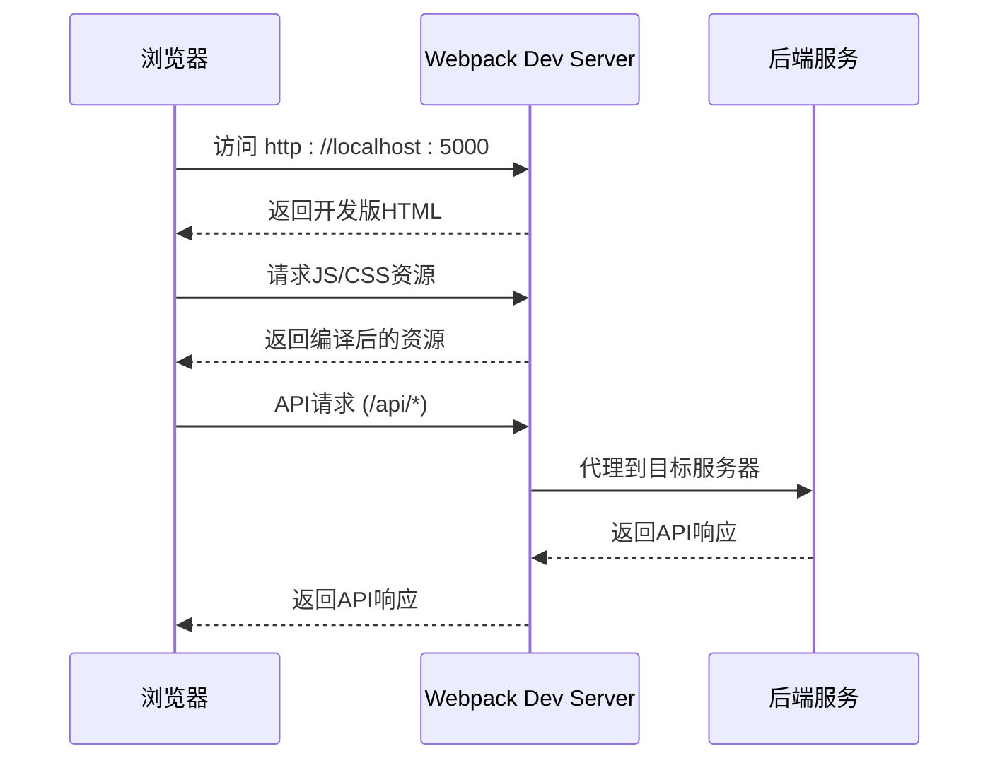

# 开发环境搭建

<cite>
**本文档中引用的文件**  
- [package.json](file://datavines-ui/package.json)
- [.eslintrc.js](file://datavines-ui/.eslintrc.js)
- [.editorconfig](file://datavines-ui/.editorconfig)
- [tsconfig.json](file://datavines-ui/tsconfig.json)
- [webpack.common.js](file://datavines-ui/build/webpack.common.js)
- [webpack.development.js](file://datavines-ui/build/webpack.development.js)
- [webpack.production.js](file://datavines-ui/build/webpack.production.js)
- [babel.config.js](file://datavines-ui/babel.config.js)
- [postcss.config.js](file://datavines-ui/postcss.config.js)
- [index-dev.html](file://datavines-ui/public/index-dev.html)
- [index-prod.html](file://datavines-ui/public/index-prod.html)
</cite>

## 目录
1. [简介](#简介)
2. [项目结构](#项目结构)
3. [Node.js与npm版本要求](#nodejs与npm版本要求)
4. [依赖安装](#依赖安装)
5. [代码规范配置](#代码规范配置)
6. [IDE配置](#ide配置)
7. [本地开发服务器](#本地开发服务器)
8. [热重载功能](#热重载功能)
9. [调试技巧](#调试技巧)
10. [常见问题解决方案](#常见问题解决方案)

## 简介
本指南详细说明如何为DataVines前端项目搭建开发环境。涵盖Node.js和npm的版本要求、依赖安装、代码规范配置（ESLint、EditorConfig）、主流IDE配置、本地开发服务器启动方法、热重载功能和调试技巧，以及开发环境中常见问题的解决方案。

## 项目结构
DataVines项目的前端代码位于`datavines-ui`目录下，采用React + TypeScript技术栈，使用Webpack进行构建。项目结构清晰，包含组件、页面、工具函数、状态管理等模块。



**Diagram sources**
- [public/index-dev.html](file://datavines-ui/public/index-dev.html)
- [public/index-prod.html](file://datavines-ui/public/index-prod.html)
- [build/webpack.common.js](file://datavines-ui/build/webpack.common.js)
- [build/webpack.development.js](file://datavines-ui/build/webpack.development.js)
- [build/webpack.production.js](file://datavines-ui/build/webpack.production.js)

**Section sources**
- [package.json](file://datavines-ui/package.json)

## Node.js与npm版本要求
根据`package.json`文件中的依赖项，建议使用以下版本：
- **Node.js**: 推荐使用LTS版本（如16.x或18.x），以确保与所有依赖包兼容
- **npm**: 建议使用Node.js自带的npm版本（通常为8.x或更高版本）

项目中明确指定了`npm`版本为`^8.19.2`，建议保持此版本范围以避免潜在的构建问题。

**Section sources**
- [package.json](file://datavines-ui/package.json#L31)

## 依赖安装
使用npm安装项目依赖：

```bash
cd datavines/datavines-ui
npm install
```

或者使用yarn（如果已安装）：

```bash
yarn install
```

安装完成后，您将拥有所有必要的开发和生产依赖，包括React、Ant Design、TypeScript、Webpack等。

**Section sources**
- [package.json](file://datavines-ui/package.json)

## 代码规范配置
### ESLint配置
项目使用ESLint进行代码质量检查，配置文件为`.eslintrc.js`。主要规则包括：
- 使用4个空格进行缩进
- 使用单引号
- 最大行长度为200字符
- 启用TypeScript支持
- 基于Airbnb风格指南

```javascript
module.exports = {
    env: {
        browser: true,
        node: true,
        es2021: true,
    },
    extends: [
        'airbnb',
        'plugin:import/typescript',
    ],
    parser: '@typescript-eslint/parser',
    rules: {
        indent: ['error', 4],
        quotes: ['error', 'single'],
        'max-len': ['error', { code: 200 }],
        // ...其他规则
    },
};
```

### EditorConfig配置
项目使用`.editorconfig`文件统一编辑器配置：
- 字符编码：UTF-8
- 换行符：LF
- 缩进风格：空格
- 缩进大小：4个空格
- 删除行尾空白字符

```ini
root = true

[*]
charset = utf-8
end_of_line = lf
indent_style = space
indent_size = 4
trim_trailing_whitespace = true
```

### TypeScript配置
`tsconfig.json`文件定义了TypeScript编译选项：
- 支持路径别名（@、@Editor等）
- 严格类型检查
- ESNext目标
- 包含源文件和类型声明文件

**Section sources**
- [.eslintrc.js](file://datavines-ui/.eslintrc.js)
- [.editorconfig](file://datavines-ui/.editorconfig)
- [tsconfig.json](file://datavines-ui/tsconfig.json)

## IDE配置
### VS Code配置
在VS Code中，确保安装以下扩展：
- ESLint
- Prettier - Code formatter
- TypeScript Hero
- Path Intellisense

项目会自动应用ESLint和EditorConfig规则。您可以在VS Code设置中启用"Format on Save"以自动格式化代码。

### WebStorm配置
在WebStorm中：
1. 启用ESLint：Settings → Languages & Frameworks → JavaScript → Code Quality Tools → ESLint
2. 启用EditorConfig支持
3. 配置TypeScript：Settings → Languages & Frameworks → TypeScript
4. 设置代码格式化为4个空格缩进

### 其他IDE
对于其他IDE，确保支持：
- ESLint集成
- EditorConfig插件
- TypeScript语言服务
- 路径别名解析（@ → src, @Editor → Editor）

**Section sources**
- [.eslintrc.js](file://datavines-ui/.eslintrc.js)
- [.editorconfig](file://datavines-ui/.editorconfig)
- [tsconfig.json](file://datavines-ui/tsconfig.json)

## 本地开发服务器
项目提供两种开发服务器配置，通过不同的环境变量启动：

### 启动测试环境开发服务器
```bash
npm run dev:test
```

### 启动生产环境开发服务器
```bash
npm run dev:prod
```

开发服务器使用Webpack Dev Server，运行在端口5000上，支持热重载和代理API请求。



**Diagram sources**
- [webpack.development.js](file://datavines-ui/build/webpack.development.js)
- [package.json](file://datavines-ui/package.json#L8-L9)

**Section sources**
- [webpack.development.js](file://datavines-ui/build/webpack.development.js)
- [package.json](file://datavines-ui/package.json)

## 热重载功能
开发服务器支持模块热替换（HMR），当您修改代码时：
1. Webpack检测文件变化
2. 重新编译修改的模块
3. React Refresh插件更新组件状态
4. 浏览器无需刷新即可看到更改

热重载配置在`webpack.development.js`中：
- `hot: true` 启用热模块替换
- `ReactRefreshWebpackPlugin` 处理React组件热更新
- `webpack.HotModuleReplacementPlugin` 核心HMR插件

这确保了快速的开发反馈循环，同时保持应用状态。

**Section sources**
- [webpack.development.js](file://datavines-ui/build/webpack.development.js#L51)
- [babel.config.js](file://datavines-ui/babel.config.js#L9)

## 调试技巧
### 浏览器调试
1. 使用Chrome开发者工具
2. 启用Source Maps（已在开发配置中启用）
3. 在源代码中设置断点
4. 使用React DevTools检查组件树

### IDE调试
在VS Code中配置调试：
```json
{
    "version": "0.2.0",
    "configurations": [
        {
            "name": "Debug Dev Server",
            "type": "chrome",
            "request": "launch",
            "url": "http://localhost:5000",
            "webRoot": "${workspaceFolder}/datavines-ui",
            "sourceMapPathOverrides": {
                "webpack:///./src/*": "${webRoot}/src/*"
            }
        }
    ]
}
```

### 网络请求调试
开发服务器配置了API代理，所有`/api`请求将被代理到后端服务。您可以在`build/.proxy.example.js`中配置代理目标。

**Section sources**
- [webpack.development.js](file://datavines-ui/build/webpack.development.js#L54-L62)
- [build/.proxy.example.js](file://datavines-ui/build/.proxy.example.js)

## 常见问题解决方案
### 依赖冲突
如果遇到依赖冲突，尝试：
1. 删除`node_modules`和`package-lock.json`
2. 重新运行`npm install`
3. 使用`npm ls <package-name>`检查依赖树

### 端口占用
如果端口5000被占用：
1. 修改`webpack.development.js`中的`port`配置
2. 或使用`npm run dev:test -- --port 5001`指定端口

### 构建错误
常见构建错误及解决方案：
- **TypeScript类型错误**：检查`tsconfig.json`配置和类型定义
- **模块解析错误**：确保路径别名正确配置
- **样式加载错误**：检查`webpack.common.js`中的less/css规则

### 热重载失效
如果热重载不工作：
1. 检查控制台是否有错误
2. 确保`ReactRefreshWebpackPlugin`已正确配置
3. 重启开发服务器

### 环境变量问题
确保正确设置环境变量：
- `DV_ENV=test` 或 `DV_ENV=prod`
- 可在`.env`文件中设置

**Section sources**
- [webpack.development.js](file://datavines-ui/build/webpack.development.js#L49)
- [webpack.common.js](file://datavines-ui/build/webpack.common.js)
- [package.json](file://datavines-ui/package.json)