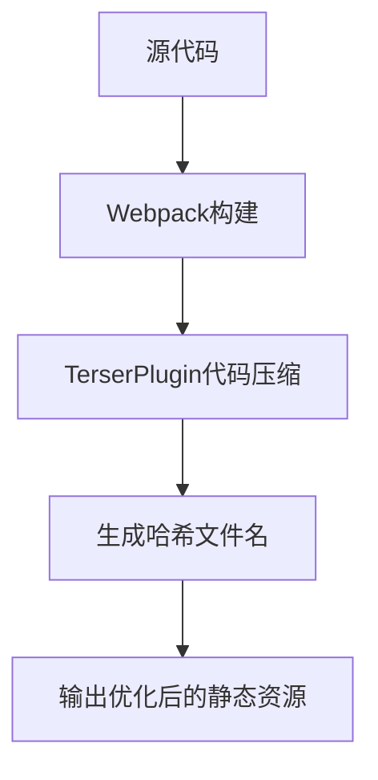
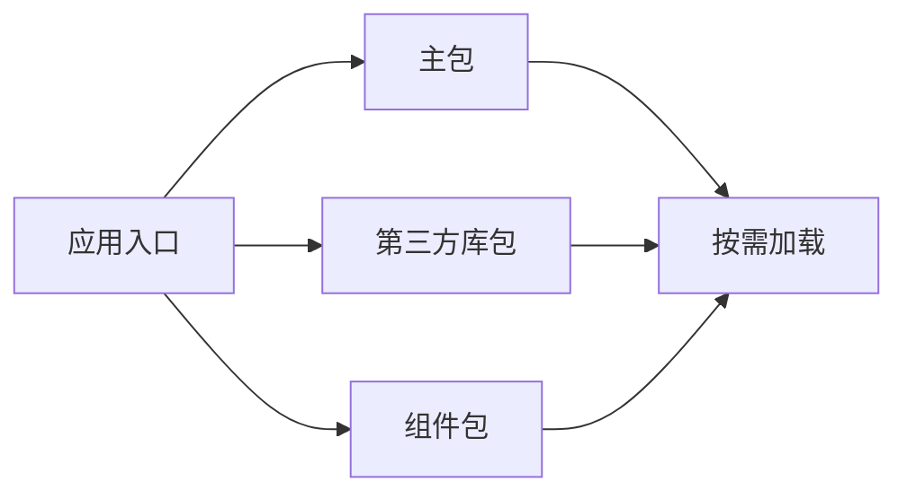
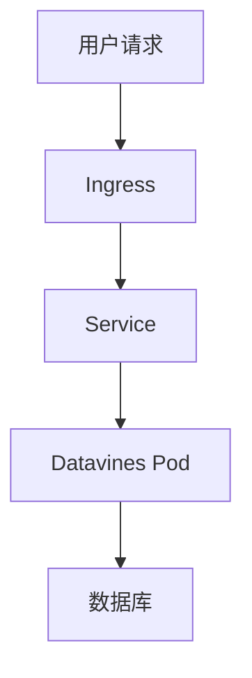

# 生产环境部署

<cite>
**本文档引用的文件**  
- [Dockerfile](file://deploy/docker/Dockerfile)
- [docker-compose.yaml](file://deploy/compose/docker-compose.yaml)
- [datavines.yaml](file://deploy/k8s/datavines.yaml)
- [.env](file://deploy/compose/.env)
- [application.yaml](file://datavines-server/src/main/resources/application.yaml)
- [datavines-bin.xml](file://datavines-dist/src/main/assembly/datavines-bin.xml)
- [webpack.production.js](file://datavines-ui/build/webpack.production.js)
- [webpack.common.js](file://datavines-ui/build/webpack.common.js)
- [index-prod.html](file://datavines-ui/public/index-prod.html)
- [package.json](file://datavines-ui/package.json)
</cite>

## 目录
1. [引言](#引言)
2. [生产构建配置与优化策略](#生产构建配置与优化策略)
3. [Docker镜像构建流程](#docker镜像构建流程)
4. [Nginx反向代理与静态资源服务](#nginx反向代理与静态资源服务)
5. [多环境变量管理](#多环境变量管理)
6. [部署验证与回滚方案](#部署验证与回滚方案)

## 引言
本文档旨在为DataVines大数据平台提供完整的生产环境部署指南。文档详细说明了从代码构建、Docker镜像创建到Kubernetes部署的完整流程，涵盖了生产环境部署的关键方面，包括构建优化、容器化部署、反向代理配置和多环境管理策略。

## 生产构建配置与优化策略

### 代码压缩与资源哈希
DataVines前端应用使用Webpack进行构建，生产环境配置了代码压缩和资源哈希功能，以优化性能和缓存策略。

在`webpack.production.js`中，配置了TerserPlugin进行JavaScript代码压缩，移除注释和console.log语句，减小文件体积：



**Diagram sources**
- [webpack.production.js](file://datavines-ui/build/webpack.production.js#L1-L47)

**Section sources**
- [webpack.production.js](file://datavines-ui/build/webpack.production.js#L1-L47)
- [webpack.common.js](file://datavines-ui/build/webpack.common.js#L1-L179)

### 懒加载配置
通过Webpack的代码分割功能实现组件的懒加载，提高应用的初始加载性能。在`webpack.common.js`中配置了splitChunks，将第三方库和应用代码分离：



**Diagram sources**
- [webpack.common.js](file://datavines-ui/build/webpack.common.js#L108-L128)

### 构建命令
前端应用提供了不同的构建命令，支持测试和生产环境的构建：

```json
{
  "scripts": {
    "build:test": "rimraf dist && webpack --env DV_ENV=test",
    "build:prod": "rimraf dist && webpack --env DV_ENV=prod"
  }
}
```

**Section sources**
- [package.json](file://datavines-ui/package.json#L1-L100)

## Docker镜像构建流程

### Dockerfile配置
DataVines提供了完整的Dockerfile用于创建生产环境镜像。Dockerfile基于OpenJDK 8基础镜像，安装了必要的系统工具，并复制了构建好的应用程序包。

```dockerfile
FROM openjdk:8

MAINTAINER 735140144

ARG VERSION=1.0.0-SNAPSHOT

ENV TZ=Asia/Shanghai
ENV LANG=zh_CN.UTF-8

WORKDIR /opt

RUN apt-get update && \
    apt-get install -y tini && \
    apt-get clean && \
    rm -rf /var/lib/apt/lists/*

COPY datavines-dist/target/datavines-${VERSION}-bin.tar.gz .
```

**Section sources**
- [Dockerfile](file://deploy/docker/Dockerfile#L1-L44)

### 构建命令
Docker镜像的构建流程包括Maven打包和Docker构建两个步骤：

1. 使用Maven打包应用程序：
```bash
mvn clean package -Pdocker -DskipTests
```

2. 构建Docker镜像：
```bash
docker build -t datavines:dev -f deploy/docker/Dockerfile .
```

## Nginx反向代理配置和静态资源服务

### 静态资源优化
DataVines前端应用的生产构建配置了静态资源的优化策略，包括文件哈希和CDN友好的路径配置：

```javascript
output: {
    publicPath: './',
    path: resolve('dist'),
    filename: 'js/[name].[fullhash:8].js',
    chunkFilename: 'js/[name].[chunkhash:8].js',
}
```

**Section sources**
- [webpack.production.js](file://datavines-ui/build/webpack.production.js#L12-L18)

### 反向代理配置
虽然项目中没有直接提供Nginx配置文件，但通过Kubernetes Ingress和Docker Compose配置可以推断出反向代理的需求。建议的Nginx配置如下：

```nginx
server {
    listen 80;
    server_name datavines.example.com;
    
    location / {
        root /usr/share/nginx/html;
        try_files $uri $uri/ /index.html;
        expires 1y;
        add_header Cache-Control "public, immutable";
    }
    
    location /api/ {
        proxy_pass http://datavines-server:5600;
        proxy_set_header Host $host;
        proxy_set_header X-Real-IP $remote_addr;
    }
}
```

## 多环境变量管理

### 环境配置文件
DataVines使用Spring Profiles管理多环境配置，通过`.env`文件设置环境变量：

```env
SPRING_PROFILES_ACTIVE=mysql
SPRING_DATASOURCE_URL=jdbc:mysql://127.0.0.1:3306/datavines?useSSL=false&useUnicode=true&characterEncoding=UTF-8&allowPublicKeyRetrieval=false&useJDBCCompliantTimezoneShift=true&useLegacyDatetimeCode=false&serverTimezone=GMT%2B8
SPRING_DATASOURCE_USERNAME=root
SPRING_DATASOURCE_PASSWORD=123456
SPRING_DATASOURCE_DRIVER-CLASS_NAME=com.mysql.cj.jdbc.Driver
```

**Section sources**
- [.env](file://deploy/compose/.env#L1-L5)

### 多数据源配置
在`application.yaml`中配置了MySQL和PostgreSQL两种数据库的支持，通过Spring Profiles切换：

```yaml
spring:
  datasource:
    driver-class-name: org.postgresql.Driver
    url: jdbc:postgresql://127.0.0.1:5432/datavines
    username: postgres
    password: 123456
---
spring:
  config:
    activate:
      on-profile: mysql
  datasource:
    driver-class-name: com.mysql.cj.jdbc.Driver
    url: jdbc:mysql://127.0.0.1:3306/datavines?useUnicode=true&characterEncoding=UTF-8&useSSL=false&serverTimezone=Asia/Shanghai
```

**Section sources**
- [application.yaml](file://datavines-server/src/main/resources/application.yaml#L1-L96)

## 部署验证和回滚方案

### Docker Compose部署
使用Docker Compose进行本地或测试环境部署，配置了容器的网络、端口映射和重启策略：

```yaml
version: '3.8'
services:
  datavines:
    image: datavines:dev
    container_name: datavines
    ports:
      - 5600:5600
    env_file: .env
    privileged: true
    restart: unless-stopped
    networks:
      - datavines

networks:
  datavines:
    driver: bridge
    ipam:
      config:
        - subnet: 172.18.0.0/24
```

**Section sources**
- [docker-compose.yaml](file://deploy/compose/docker-compose.yaml#L1-L19)

### Kubernetes部署
生产环境推荐使用Kubernetes进行部署，提供了完整的Deployment、Service和Ingress配置：



**Diagram sources**
- [datavines.yaml](file://deploy/k8s/datavines.yaml#L1-L112)

### 回滚方案
Kubernetes配置了滚动更新策略，支持安全的版本回滚：

```yaml
strategy:
  rollingUpdate:
    maxSurge: 25%
    maxUnavailable: 25%
  type: RollingUpdate
```

通过以下命令可以执行回滚：
```bash
kubectl rollout undo deployment/datavines
```

**Section sources**
- [datavines.yaml](file://deploy/k8s/datavines.yaml#L1-L112)