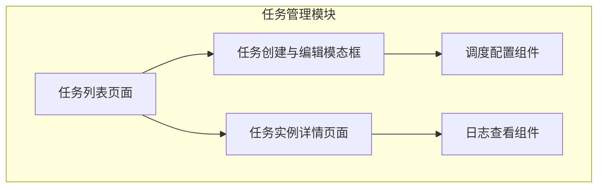
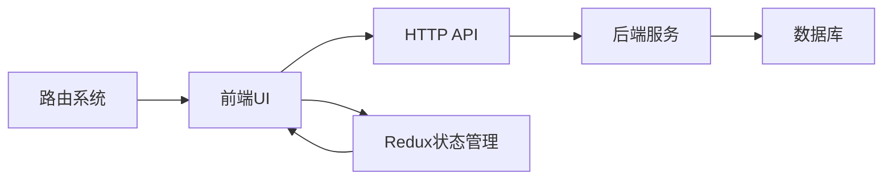
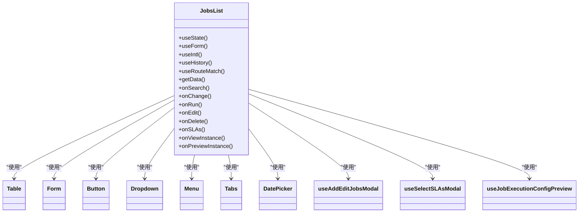
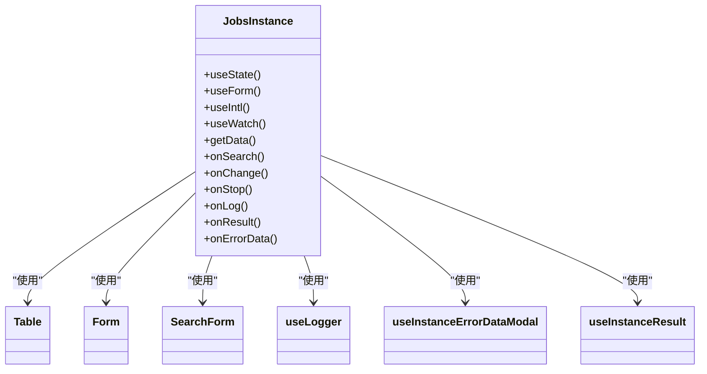
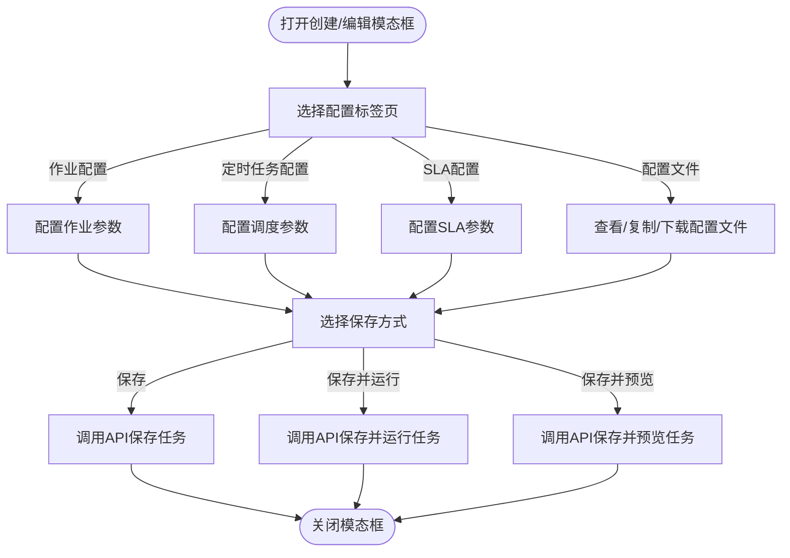
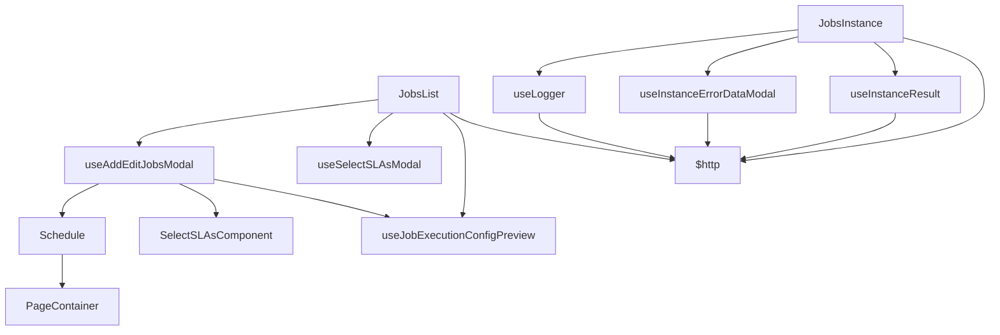

# 任务管理

<cite>
**本文档引用的文件**  
- [JobsList.tsx](file://datavines-ui\src\view\Main\HomeDetail\Jobs\JobsList.tsx)
- [JobsInstance.tsx](file://datavines-ui\src\view\Main\HomeDetail\Jobs\JobsInstance.tsx)
- [useAddEditJobsModal/index.tsx](file://datavines-ui\src\view\Main\HomeDetail\Jobs\useAddEditJobsModal\index.tsx)
- [components/Schedule/index.tsx](file://datavines-ui\src\view\Main\HomeDetail\Jobs\components\Schedule\index.tsx)
- [useLogger/index.tsx](file://datavines-ui\src\view\Main\HomeDetail\Jobs\useLogger\index.tsx)
- [Jobs.ts](file://datavines-ui\src\type\Jobs.ts)
- [JobsInstance.ts](file://datavines-ui\src\type\JobsInstance.ts)
- [zh_CN.ts](file://datavines-ui\src\locale\zh_CN.ts)
- [detailRouter.tsx](file://datavines-ui\src\router\detailRouter.tsx)
</cite>

## 目录
1. [简介](#简介)
2. [项目结构](#项目结构)
3. [核心组件](#核心组件)
4. [架构概述](#架构概述)
5. [详细组件分析](#详细组件分析)
6. [依赖分析](#依赖分析)
7. [性能考虑](#性能考虑)
8. [故障排除指南](#故障排除指南)
9. [结论](#结论)
10. [附录](#附录)（如有必要）

## 简介
本文档详细描述了datavines-ui中的任务管理功能，涵盖任务列表页面和任务实例详情页面的布局结构与功能模块。文档解释了任务创建、编辑、执行监控和日志查看的完整流程，说明了任务调度配置、执行参数设置和结果展示的用户交互设计，并提供了任务管理组件的开发实现细节和性能优化建议。

## 项目结构
datavines-ui的任务管理功能主要位于`src/view/Main/HomeDetail/Jobs`目录下，包含任务列表、任务实例、任务创建与编辑、调度配置、日志查看等核心组件。该功能通过React路由与主应用集成，支持数据质量作业和数据比对作业的管理。

**图示来源**
- [JobsList.tsx](file://datavines-ui\src\view\Main\HomeDetail\Jobs\JobsList.tsx)
- [JobsInstance.tsx](file://datavines-ui\src\view\Main\HomeDetail\Jobs\JobsInstance.tsx)
- [useAddEditJobsModal/index.tsx](file://datavines-ui\src\view\Main\HomeDetail\Jobs\useAddEditJobsModal\index.tsx)
- [components/Schedule/index.tsx](file://datavines-ui\src\view\Main\HomeDetail\Jobs\components\Schedule\index.tsx)
- [useLogger/index.tsx](file://datavines-ui\src\view\Main\HomeDetail\Jobs\useLogger\index.tsx)

**章节来源**
- [JobsList.tsx](file://datavines-ui\src\view\Main\HomeDetail\Jobs\JobsList.tsx)
- [JobsInstance.tsx](file://datavines-ui\src\view\Main\HomeDetail\Jobs\JobsInstance.tsx)

## 核心组件
任务管理功能的核心组件包括任务列表页面（JobsList.tsx）、任务实例详情页面（JobsInstance.tsx）、任务创建与编辑模态框（useAddEditJobsModal）、调度配置组件（Schedule）和日志查看组件（useLogger）。这些组件通过React Hooks和Ant Design组件库实现用户交互和状态管理。

**章节来源**
- [JobsList.tsx](file://datavines-ui\src\view\Main\HomeDetail\Jobs\JobsList.tsx)
- [JobsInstance.tsx](file://datavines-ui\src\view\Main\HomeDetail\Jobs\JobsInstance.tsx)
- [useAddEditJobsModal/index.tsx](file://datavines-ui\src\view\Main\HomeDetail\Jobs\useAddEditJobsModal\index.tsx)

## 架构概述
任务管理功能采用基于React的组件化架构，通过Redux管理全局状态，使用Ant Design作为UI组件库。前端通过HTTP API与后端服务通信，实现任务的CRUD操作、执行控制和日志查询。路由系统将任务管理功能集成到主应用中，支持多标签页导航。

**图示来源**
- [detailRouter.tsx](file://datavines-ui\src\router\detailRouter.tsx)
- [JobsList.tsx](file://datavines-ui\src\view\Main\HomeDetail\Jobs\JobsList.tsx)
- [JobsInstance.tsx](file://datavines-ui\src\view\Main\HomeDetail\Jobs\JobsInstance.tsx)

## 详细组件分析

### 任务列表页面分析
任务列表页面（JobsList.tsx）展示所有任务的概览信息，支持搜索、分页、运行、编辑、删除、预览和查看实例等操作。页面通过Tabs组件区分数据质量作业和数据比对作业，使用Table组件展示任务列表。

#### 组件结构

**图示来源**
- [JobsList.tsx](file://datavines-ui\src\view\Main\HomeDetail\Jobs\JobsList.tsx)

**章节来源**
- [JobsList.tsx](file://datavines-ui\src\view\Main\HomeDetail\Jobs\JobsList.tsx)

### 任务实例详情页面分析
任务实例详情页面（JobsInstance.tsx）展示特定任务的所有执行实例，支持查看日志、结果和错误数据。页面通过Table组件展示实例列表，使用模态框组件查看详细信息。

#### 组件结构

**图示来源**
- [JobsInstance.tsx](file://datavines-ui\src\view\Main\HomeDetail\Jobs\JobsInstance.tsx)

**章节来源**
- [JobsInstance.tsx](file://datavines-ui\src\view\Main\HomeDetail\Jobs\JobsInstance.tsx)

### 任务创建与编辑分析
任务创建与编辑功能通过模态框组件（useAddEditJobsModal）实现，支持多标签页配置，包括作业配置、定时任务配置、SLA配置和配置文件。用户可以保存、保存并运行或保存并预览任务。

#### 用户交互流程

**图示来源**
- [useAddEditJobsModal/index.tsx](file://datavines-ui\src\view\Main\HomeDetail\Jobs\useAddEditJobsModal\index.tsx)

**章节来源**
- [useAddEditJobsModal/index.tsx](file://datavines-ui\src\view\Main\HomeDetail\Jobs\useAddEditJobsModal\index.tsx)

### 调度配置分析
调度配置组件（Schedule）支持三种调度类型：常规调度、Crontab调度和不调度。常规调度提供月、周、日、小时、每N小时、每N分钟等周期选项，Crontab调度支持自定义表达式和未来执行计划查看。

#### 配置选项
| 调度类型 | 配置选项 | 说明 |
|---------|--------|------|
| 常规调度 | 月、周、日、小时、每N小时、每N分钟 | 提供可视化的时间选择界面 |
| Crontab调度 | 自定义表达式 | 支持标准Crontab语法 |
| 不调度 | 无 | 任务不会自动执行 |

**图示来源**
- [components/Schedule/index.tsx](file://datavines-ui\src\view\Main\HomeDetail\Jobs\components\Schedule\index.tsx)

**章节来源**
- [components/Schedule/index.tsx](file://datavines-ui\src\view\Main\HomeDetail\Jobs\components\Schedule\index.tsx)

### 日志查看分析
日志查看组件（useLogger）通过模态框展示任务执行日志，支持刷新、下载和全屏查看。日志内容按行加载，支持增量获取。

#### 功能特性
- **实时刷新**：用户可手动刷新获取最新日志
- **日志下载**：支持将日志保存为文件
- **增量加载**：按行偏移量获取日志内容
- **HTML渲染**：支持换行符转换为HTML标签

**章节来源**
- [useLogger/index.tsx](file://datavines-ui\src\view\Main\HomeDetail\Jobs\useLogger\index.tsx)

## 依赖分析
任务管理功能依赖于多个内部和外部组件，包括UI组件库、状态管理、HTTP客户端和国际化支持。组件间通过props和回调函数进行通信，形成清晰的依赖关系。

**图示来源**
- [JobsList.tsx](file://datavines-ui\src\view\Main\HomeDetail\Jobs\JobsList.tsx)
- [JobsInstance.tsx](file://datavines-ui\src\view\Main\HomeDetail\Jobs\JobsInstance.tsx)
- [useAddEditJobsModal/index.tsx](file://datavines-ui\src\view\Main\HomeDetail\Jobs\useAddEditJobsModal\index.tsx)
- [components/Schedule/index.tsx](file://datavines-ui\src\view\Main\HomeDetail\Jobs\components\Schedule\index.tsx)
- [useLogger/index.tsx](file://datavines-ui\src\view\Main\HomeDetail\Jobs\useLogger\index.tsx)

**章节来源**
- [JobsList.tsx](file://datavines-ui\src\view\Main\HomeDetail\Jobs\JobsList.tsx)
- [JobsInstance.tsx](file://datavines-ui\src\view\Main\HomeDetail\Jobs\JobsInstance.tsx)

## 性能考虑
任务管理功能在性能方面考虑了以下优化点：
- **分页加载**：任务列表和实例列表均采用分页方式，避免一次性加载大量数据
- **懒加载**：使用React.lazy实现组件的懒加载，减少初始加载时间
- **状态管理**：使用Redux集中管理应用状态，避免不必要的组件重渲染
- **API调用优化**：在用户操作后才调用API获取数据，避免频繁请求

## 故障排除指南
### 常见问题
1. **任务无法创建**：检查作业名称是否为空，确保所有必填字段已填写
2. **调度配置不生效**：确认调度类型选择正确，检查时间范围是否合理
3. **日志无法加载**：检查网络连接，尝试刷新页面或重新登录
4. **实例无法停止**：确认任务处于可停止状态（已提交、执行中、待提交）

### 调试建议
- 使用浏览器开发者工具查看网络请求，确认API调用是否成功
- 检查控制台是否有JavaScript错误
- 验证用户权限是否足够执行相关操作
- 查看后端服务日志获取更多错误信息

**章节来源**
- [JobsList.tsx](file://datavines-ui\src\view\Main\HomeDetail\Jobs\JobsList.tsx)
- [JobsInstance.tsx](file://datavines-ui\src\view\Main\HomeDetail\Jobs\JobsInstance.tsx)
- [useLogger/index.tsx](file://datavines-ui\src\view\Main\HomeDetail\Jobs\useLogger\index.tsx)

## 结论
datavines-ui的任务管理功能提供了完整的任务生命周期管理，从创建、编辑、调度到执行监控和日志查看。功能设计考虑了用户体验和性能优化，通过组件化架构实现了高内聚低耦合。建议在后续开发中进一步优化大规模数据下的分页性能，并增加更多调度策略的可视化配置选项。