# 首页功能

<cite>
**本文档引用的文件**   
- [index.tsx](file://datavines-ui\src\view\Main\Home\index.tsx)
- [Card.tsx](file://datavines-ui\src\view\Main\Home\List\Card.tsx)
- [Table.tsx](file://datavines-ui\src\view\Main\Home\List\Table.tsx)
- [AddDataSource\index.tsx](file://datavines-ui\src\view\Main\Home\AddDataSource\index.tsx)
- [MetaDataFetcher.tsx](file://datavines-ui\src\view\Main\Home\List\MetaDataFetcher.tsx)
- [datasourceReducer\index.ts](file://datavines-ui\src\store\datasourceReducer\index.ts)
- [dataSource.ts](file://datavines-ui\src\type\dataSource.ts)
- [mainRouter.tsx](file://datavines-ui\src\router\mainRouter.tsx)
- [zh_CN.ts](file://datavines-ui\src\locale\zh_CN.ts)
</cite>

## 目录
1. [简介](#简介)
2. [页面布局结构](#页面布局结构)
3. [视图模式](#视图模式)
4. [数据源操作流程](#数据源操作流程)
5. [元数据采集和刷新机制](#元数据采集和刷新机制)
6. [组件开发实现细节](#组件开发实现细节)
7. [常见问题解决方案](#常见问题解决方案)

## 简介
datavines-ui的首页功能主要提供数据源概览页面，用户可以通过该页面查看、管理所有数据源。页面提供了卡片式和表格列表两种视图模式，支持数据源的添加、编辑、删除等操作，并集成了元数据采集和刷新功能。

**Section sources**
- [index.tsx](file://datavines-ui\src\view\Main\Home\index.tsx#L1-L143)

## 页面布局结构
首页功能的页面布局主要由以下几个部分组成：

1. **标题区域**：显示"数据源管理"标题和"创建数据源"按钮
2. **搜索区域**：包含搜索表单和视图切换按钮
3. **数据展示区域**：根据用户选择的视图模式显示数据源列表
4. **模态框**：用于数据源的添加和编辑操作

页面采用ContentLayout组件作为容器，内部通过Flex布局组织各个区域。标题区域使用Title组件，右侧浮动显示创建按钮。搜索区域使用SearchForm组件进行搜索，右侧通过Radio.Group组件提供视图模式切换功能。

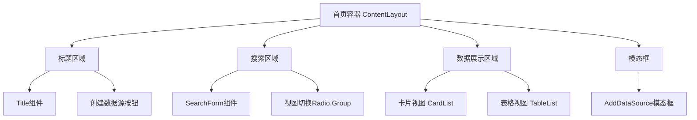

**Diagram sources **
- [index.tsx](file://datavines-ui\src\view\Main\Home\index.tsx#L78-L139)

**Section sources**
- [index.tsx](file://datavines-ui\src\view\Main\Home\index.tsx#L78-L139)

## 视图模式
首页功能提供两种数据源展示视图模式：卡片式视图和表格列表视图。

### 卡片式视图
卡片式视图以卡片形式展示每个数据源，每个卡片包含数据源名称、类型标签、更新时间和操作菜单。卡片采用响应式布局，每行显示4个卡片。

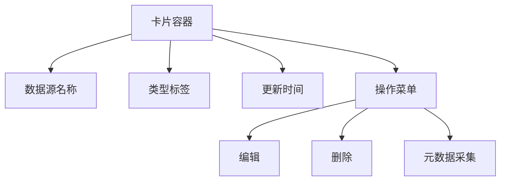

**Diagram sources **
- [Card.tsx](file://datavines-ui\src\view\Main\Home\List\Card.tsx#L33-L134)

### 表格列表视图
表格列表视图以表格形式展示数据源信息，包含名称、类型、更新人、更新时间和操作列。表格支持分页和排序功能。

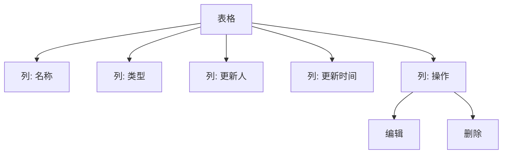

**Diagram sources **
- [Table.tsx](file://datavines-ui\src\view\Main\Home\List\Table.tsx#L20-L68)

### 视图模式切换
视图模式的切换通过Redux状态管理实现。用户选择视图模式后，状态存储在datasourceReducer中，根据tableType状态值决定显示哪种视图。

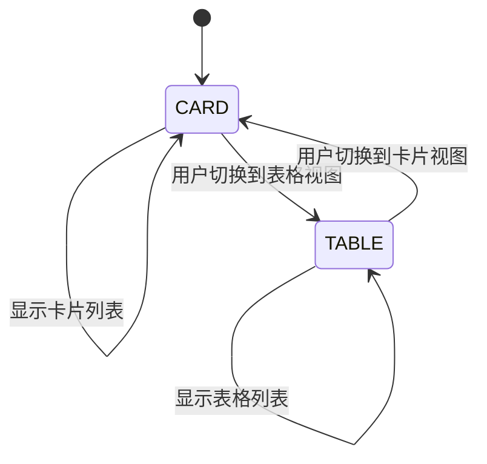

**Diagram sources **
- [datasourceReducer\index.ts](file://datavines-ui\src\store\datasourceReducer\index.ts#L24-L30)
- [index.tsx](file://datavines-ui\src\view\Main\Home\index.tsx#L115-L134)

**Section sources**
- [Card.tsx](file://datavines-ui\src\view\Main\Home\List\Card.tsx#L1-L189)
- [Table.tsx](file://datavines-ui\src\view\Main\Home\List\Table.tsx#L1-L96)
- [datasourceReducer\index.ts](file://datavines-ui\src\store\datasourceReducer\index.ts#L1-L68)

## 数据源操作流程
首页功能支持数据源的添加、编辑和删除操作，这些操作通过统一的模态框组件实现。

### 添加数据源
添加数据源的流程如下：
1. 用户点击"创建数据源"按钮
2. 显示添加数据源模态框
3. 用户填写数据源信息并测试连接
4. 用户确认保存，发送POST请求创建数据源
5. 刷新数据源列表

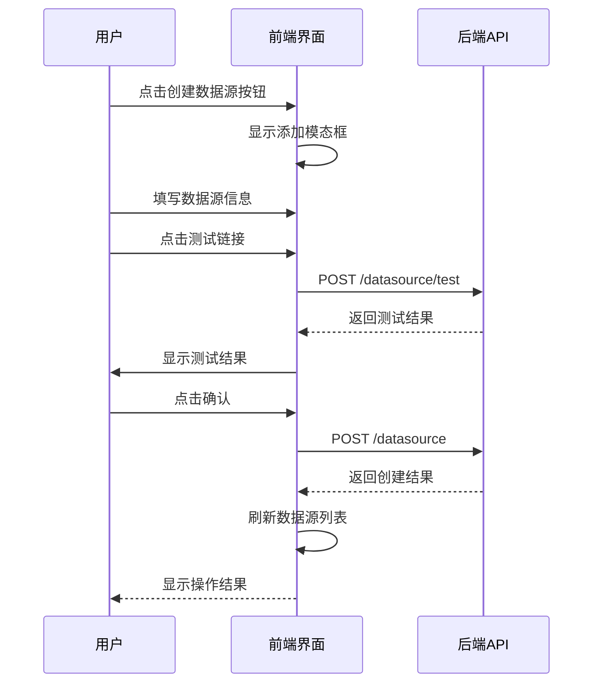

**Diagram sources **
- [AddDataSource\index.tsx](file://datavines-ui\src\view\Main\Home\AddDataSource\index.tsx#L137-L158)

### 编辑数据源
编辑数据源的流程与添加类似，主要区别在于：
1. 模态框初始化时会加载现有数据源信息
2. 保存时发送PUT请求更新数据源

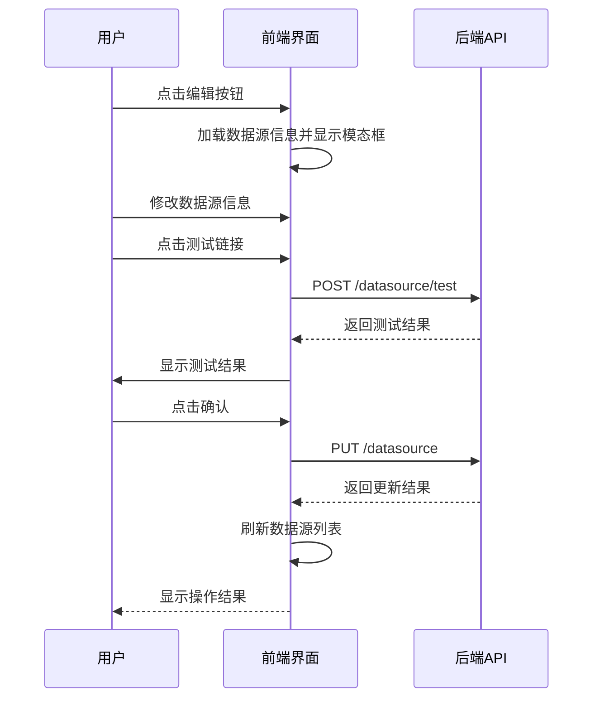

**Diagram sources **
- [AddDataSource\index.tsx](file://datavines-ui\src\view\Main\Home\AddDataSource\index.tsx#L142-L149)

### 删除数据源
删除数据源采用确认删除模式，确保用户操作的准确性。

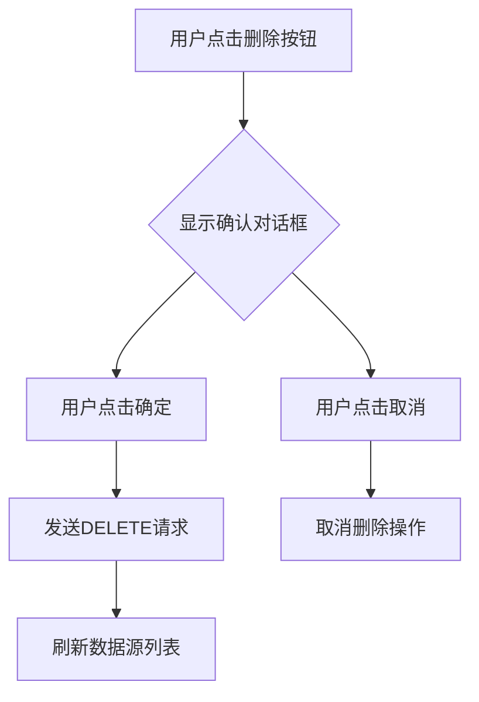

**Diagram sources **
- [index.tsx](file://datavines-ui\src\view\Main\Home\index.tsx#L68-L76)
- [Card.tsx](file://datavines-ui\src\view\Main\Home\List\Card.tsx#L82-L92)
- [Table.tsx](file://datavines-ui\src\view\Main\Home\List\Table.tsx#L58-L64)

**Section sources**
- [AddDataSource\index.tsx](file://datavines-ui\src\view\Main\Home\AddDataSource\index.tsx#L128-L217)
- [index.tsx](file://datavines-ui\src\view\Main\Home\index.tsx#L65-L77)

## 元数据采集和刷新机制
首页功能集成了元数据采集和刷新机制，用户可以通过界面操作触发元数据的采集和刷新。

### 元数据采集流程
当用户点击"元数据管理"操作时，系统会打开元数据采集调度管理模态框，用户可以配置采集任务的调度策略。

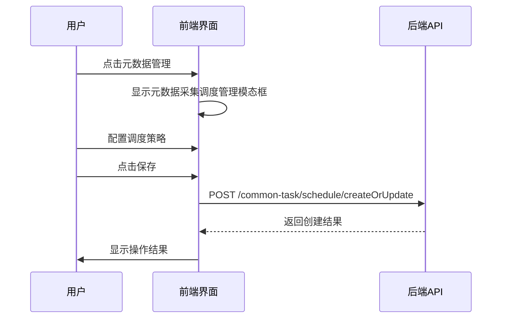

**Diagram sources **
- [MetaDataFetcher.tsx](file://datavines-ui\src\view\Main\Home\List\MetaDataFetcher.tsx#L139-L150)

### 元数据立即刷新
用户还可以选择立即执行元数据刷新，无需等待调度。

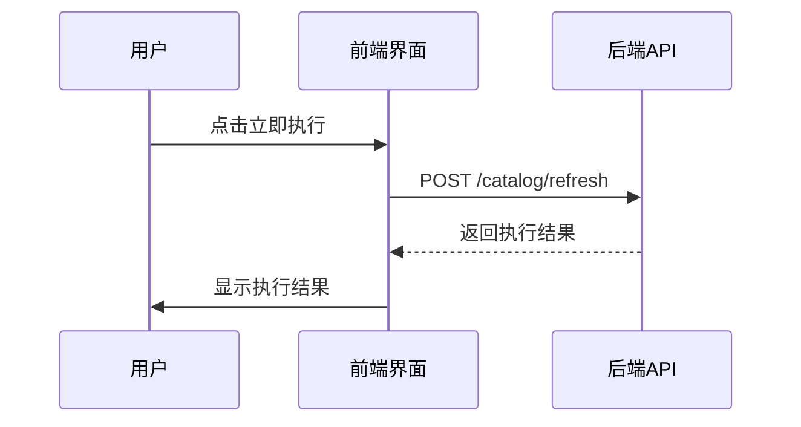

**Diagram sources **
- [MetaDataFetcher.tsx](file://datavines-ui\src\view\Main\Home\List\MetaDataFetcher.tsx#L539-L541)

### 用户交互设计
元数据采集和刷新的用户交互设计考虑了以下几点：
1. **操作可见性**：在每个数据源卡片的操作菜单中提供"元数据管理"选项
2. **操作确认**：删除操作需要二次确认，防止误操作
3. **操作反馈**：所有操作都有明确的成功或失败提示
4. **状态同步**：操作完成后自动刷新数据源列表，确保界面状态与后端一致

**Section sources**
- [MetaDataFetcher.tsx](file://datavines-ui\src\view\Main\Home\List\MetaDataFetcher.tsx#L1-L175)
- [Card.tsx](file://datavines-ui\src\view\Main\Home\List\Card.tsx#L97-L106)

## 组件开发实现细节
首页功能的各个组件通过React Hooks和Redux进行状态管理，实现了组件间的解耦和复用。

### 状态管理
使用Redux管理视图模式状态，定义了tableType状态和对应的action。

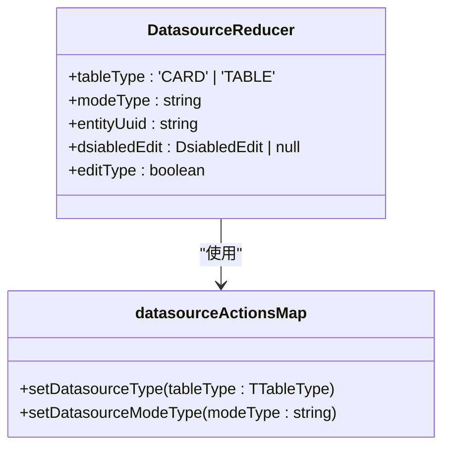

**Diagram sources **
- [datasourceReducer\index.ts](file://datavines-ui\src\store\datasourceReducer\index.ts#L9-L67)

### 数据交互
通过$http服务与后端API进行数据交互，封装了常用的HTTP方法。

```mermaid
classDiagram
class $http {
+get(url, params)
+post(url, data)
+put(url, data)
+delete(url)
}
class index.tsx {
+getData()
+onSearch()
+onPageChange()
+onEdit()
+onDelete()
}
index.tsx --> $http : "使用"
```

**Diagram sources **
- [http\index.ts](file://datavines-ui\src\http\index.ts#L24-L50)
- [index.tsx](file://datavines-ui\src\view\Main\Home\index.tsx#L36-L76)

### 类型定义
使用TypeScript定义了数据源相关的类型，确保类型安全。

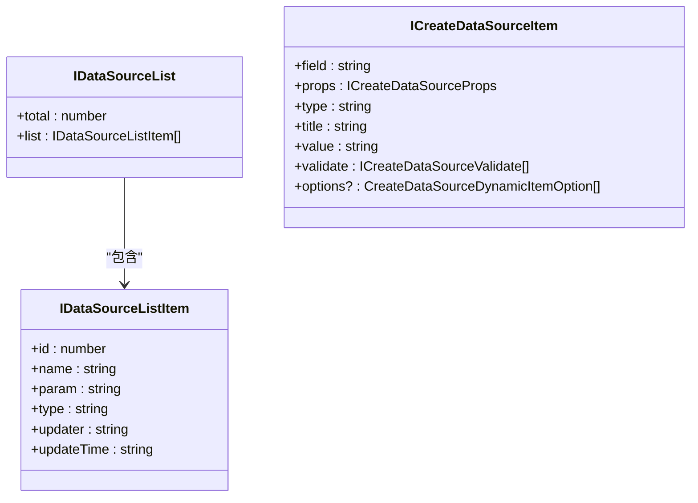

**Diagram sources **
- [dataSource.ts](file://datavines-ui\src\type\dataSource.ts#L36-L50)

**Section sources**
- [datasourceReducer\index.ts](file://datavines-ui\src\store\datasourceReducer\index.ts#L1-L68)
- [http\index.ts](file://datavines-ui\src\http\index.ts#L1-L51)
- [dataSource.ts](file://datavines-ui\src\type\dataSource.ts#L1-L50)

## 常见问题解决方案
### 视图模式不保存
问题：用户切换视图模式后，刷新页面又恢复到默认模式。

解决方案：将视图模式状态存储在localStorage中，页面加载时优先读取localStorage中的值。

```typescript
// 在datasourceReducer中添加localStorage支持
const initialState: DatasourceReducer = {
    tableType: localStorage.getItem('datasourceViewMode') || 'CARD',
    modeType: '',
    entityUuid: '',
    dsiabledEdit: null,
    editType: false,
};

// 在setDatasourceType action中保存到localStorage
export const datasourceActionsMap = {
    setDatasourceType: (tableType: TTableType) => (dispatch: TDispatch) => {
        localStorage.setItem('datasourceViewMode', tableType);
        dispatch({
            type: 'save_datasource_type',
            payload: tableType,
        });
    },
};
```

### 数据源列表加载缓慢
问题：当数据源数量较多时，列表加载缓慢。

解决方案：优化分页参数，默认pageSize从20调整为50，减少请求次数。

```typescript
// 在index.tsx中调整分页参数
const [pageParams, setPageParams] = useState({
    pageNumber: 1,
    pageSize: 50, // 从20调整为50
});
```

### 元数据采集任务重复创建
问题：用户多次点击"保存"按钮，导致创建多个相同的采集任务。

解决方案：在保存按钮上添加loading状态，防止重复提交。

```typescript
// 在ScheduleContainer组件中使用useLoading
const globalSetLoading = useLoading();
const onSave = async (type:string = 'add') => {
    getValues(async (params: any) => {
        globalSetLoading(true); // 设置loading状态
        try {
            // 保存逻辑
        } catch (error) {
        } finally {
            globalSetLoading(false); // 清除loading状态
        }
    });
};
```

**Section sources**
- [datasourceReducer\index.ts](file://datavines-ui\src\store\datasourceReducer\index.ts#L24-L30)
- [index.tsx](file://datavines-ui\src\view\Main\Home\index.tsx#L32-L35)
- [MetaDataFetcher.tsx](file://datavines-ui\src\view\Main\Home\List\MetaDataFetcher.tsx#L457-L578)