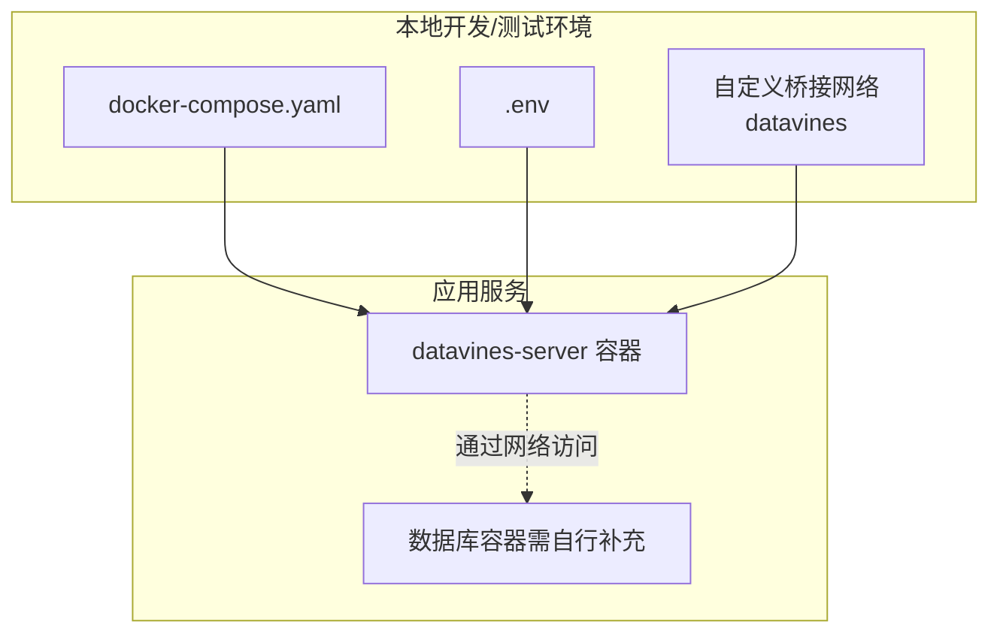
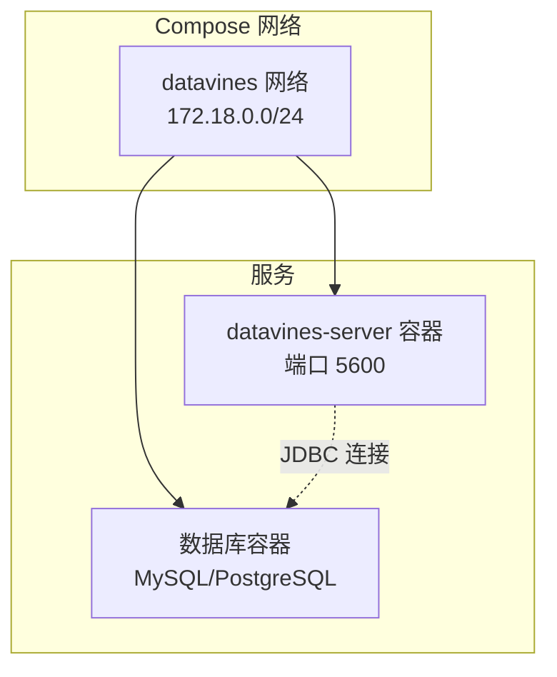
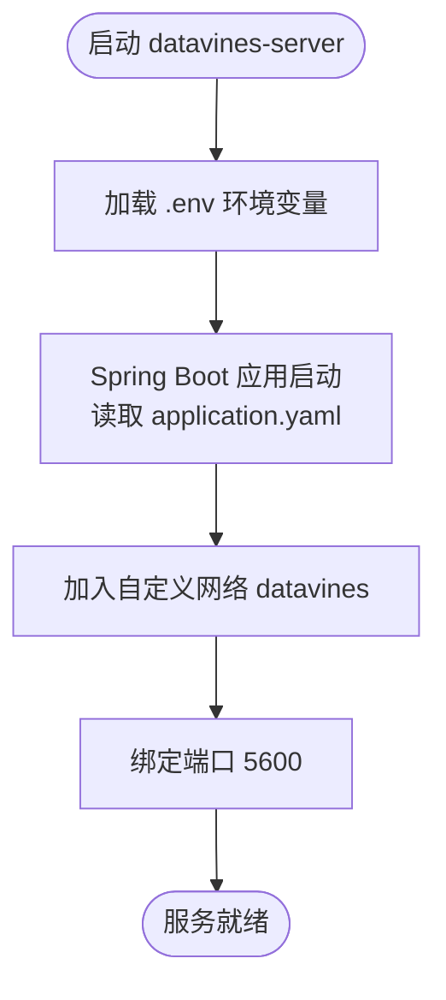
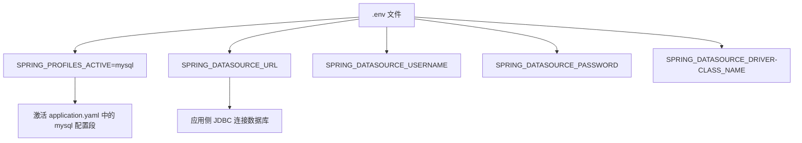
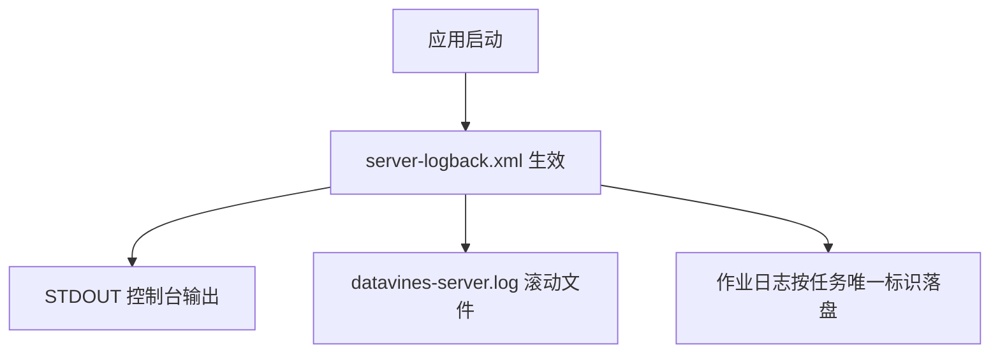
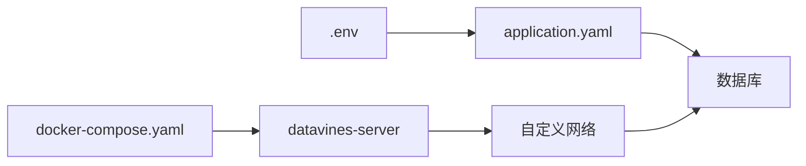

# Docker Compose部署

<cite>
**本文引用的文件列表**
- [docker-compose.yaml](file://deploy/compose/docker-compose.yaml)
- [.env](file://deploy/compose/.env)
- [application.yaml](file://datavines-server/src/main/resources/application.yaml)
- [server-logback.xml](file://datavines-server/src/main/resources/server-logback.xml)
- [datavines.yaml](file://deploy/k8s/datavines.yaml)
</cite>

## 目录
1. [简介](#简介)
2. [项目结构](#项目结构)
3. [核心组件](#核心组件)
4. [架构总览](#架构总览)
5. [详细组件分析](#详细组件分析)
6. [依赖关系分析](#依赖关系分析)
7. [性能与资源建议](#性能与资源建议)
8. [故障排查指南](#故障排查指南)
9. [结论](#结论)
10. [附录](#附录)

## 简介
本指南面向希望使用 docker-compose 快速搭建完整 DataVines 环境的用户。文档将逐项解析 docker-compose.yaml 的服务定义（含 datavines-server、数据库等），说明 .env 文件的环境变量配置方式，并给出网络、数据卷、服务依赖、日志聚合、服务间通信与健康检查的实践建议。同时提供生产环境部署建议，包括资源限制、重启策略与监控集成。

## 项目结构
DataVines 提供了多套部署方式，其中与本指南直接相关的是 compose 部署目录与 server 端配置：
- compose 部署：包含 docker-compose.yaml 与 .env
- server 端配置：包含 Spring Boot 的 application.yaml 与日志配置 server-logback.xml
- Kubernetes 部署示例：用于对比与参考（非本指南重点）

图表来源
- [docker-compose.yaml](file://deploy/compose/docker-compose.yaml#L1-L19)
- [.env](file://deploy/compose/.env#L1-L5)

章节来源
- [docker-compose.yaml](file://deploy/compose/docker-compose.yaml#L1-L19)
- [.env](file://deploy/compose/.env#L1-L5)

## 核心组件
- datavines-server 容器
  - 基于镜像 datavines:dev 启动
  - 暴露端口 5600
  - 使用 .env 注入环境变量
  - 使用自定义桥接网络 datavines
  - 设置特权模式与重启策略
- 数据库
  - 当前 compose 文件未内置数据库服务，需在实际环境中补充 MySQL 或 PostgreSQL 容器，并确保连接信息正确
- 网络
  - 自定义桥接网络 datavines，子网为 172.18.0.0/24
- 日志
  - server 端使用 server-logback.xml 输出控制台、作业日志与服务日志

章节来源
- [docker-compose.yaml](file://deploy/compose/docker-compose.yaml#L1-L19)
- [application.yaml](file://datavines-server/src/main/resources/application.yaml#L69-L83)
- [server-logback.xml](file://datavines-server/src/main/resources/server-logback.xml#L33-L85)

## 架构总览
下图展示了基于 docker-compose 的典型部署拓扑：datavines-server 通过自定义网络与数据库容器互通；日志由 server-logback.xml 聚合输出到控制台与文件。

图表来源
- [docker-compose.yaml](file://deploy/compose/docker-compose.yaml#L14-L19)
- [application.yaml](file://datavines-server/src/main/resources/application.yaml#L17-L39)

## 详细组件分析

### 组件一：datavines-server 服务定义
- 镜像与端口映射
  - 使用镜像 datavines:dev
  - 将宿主机 5600 映射到容器 5600
- 环境变量注入
  - 通过 env_file 引用 .env 文件
- 安全与稳定性
  - privileged: true（允许特权模式）
  - restart: unless-stopped（除非手动停止，否则持续重启）
- 网络
  - 加入自定义网络 datavines

图表来源
- [docker-compose.yaml](file://deploy/compose/docker-compose.yaml#L3-L13)
- [application.yaml](file://datavines-server/src/main/resources/application.yaml#L69-L71)

章节来源
- [docker-compose.yaml](file://deploy/compose/docker-compose.yaml#L3-L13)

### 组件二：.env 环境变量配置
- spring.profiles.active=mysql：激活 MySQL 配置文件段
- spring.datasource.url：数据库连接 URL（当前指向 127.0.0.1，需在 compose 中改为数据库容器名或网络别名）
- spring.datasource.username/password：数据库账号密码
- spring.datasource.driver-class-name：驱动类名（MySQL）

图表来源
- [.env](file://deploy/compose/.env#L1-L5)
- [application.yaml](file://datavines-server/src/main/resources/application.yaml#L84-L96)

章节来源
- [.env](file://deploy/compose/.env#L1-L5)

### 组件三：数据库服务（补充说明）
- 当前 docker-compose.yaml 未包含数据库服务，需要在实际部署时添加数据库容器，并确保：
  - 数据库容器名称或网络别名为 application.yaml 中的 spring.datasource.url 所指向的目标
  - 数据库初始化 SQL 已执行（仓库提供 MySQL 初始化脚本）
- 可选方案
  - 在 docker-compose.yaml 中新增数据库服务（例如 MySQL/PostgreSQL）
  - 使用外部数据库实例（需调整 .env 与 application.yaml 中的连接参数）

章节来源
- [application.yaml](file://datavines-server/src/main/resources/application.yaml#L17-L39)
- [scripts/sql/datavines-mysql.sql](file://scripts/sql/datavines-mysql.sql)

### 组件四：网络与服务间通信
- 自定义桥接网络
  - 使用 driver: bridge 与 IPAM 子网 172.18.0.0/24
- 服务间通信
  - datavines-server 通过网络访问数据库容器（建议使用容器名或网络别名为连接目标）
  - 如需对外暴露 Web 界面，保持 5600 端口映射即可

章节来源
- [docker-compose.yaml](file://deploy/compose/docker-compose.yaml#L14-L19)

### 组件五：日志聚合与输出
- server 端日志
  - 控制台输出与滚动文件输出
  - 作业执行日志按任务唯一标识落盘
- 日志位置
  - 日志根目录由日志配置决定（默认可挂载卷至宿主机持久化）

图表来源
- [server-logback.xml](file://datavines-server/src/main/resources/server-logback.xml#L33-L85)

章节来源
- [server-logback.xml](file://datavines-server/src/main/resources/server-logback.xml#L33-L85)

### 组件六：健康检查（建议）
- 当前 compose 未配置健康检查
- 建议在生产环境为 datavines-server 添加健康检查，例如：
  - 对外暴露的健康端点（如 /actuator/health）
  - 使用 healthcheck 字段探测端口与路径
- 参考 K8s 示例中对容器安全上下文与重启策略的处理，便于在 compose 中对齐

章节来源
- [datavines.yaml](file://deploy/k8s/datavines.yaml#L31-L60)

## 依赖关系分析
- 组件耦合
  - datavines-server 依赖数据库连接（由 .env 与 application.yaml 共同决定）
  - 网络由 docker-compose 管理，datavines-server 通过网络访问数据库
- 外部依赖
  - 数据库驱动与连接池（HikariCP）由 application.yaml 配置
  - Spring Profile 切换（mysql/postgresql）由 .env 指定

图表来源
- [.env](file://deploy/compose/.env#L1-L5)
- [application.yaml](file://datavines-server/src/main/resources/application.yaml#L17-L39)
- [docker-compose.yaml](file://deploy/compose/docker-compose.yaml#L14-L19)

章节来源
- [.env](file://deploy/compose/.env#L1-L5)
- [application.yaml](file://datavines-server/src/main/resources/application.yaml#L17-L39)
- [docker-compose.yaml](file://deploy/compose/docker-compose.yaml#L14-L19)

## 性能与资源建议
- 资源限制（compose 层面）
  - 可在 docker-compose.yaml 中为 datavines-server 容器设置 CPU/内存限制，避免资源争用
  - 建议结合业务规模与并发度评估，逐步调优
- 重启策略
  - 当前使用 unless-stopped，适合开发/测试场景
  - 生产建议使用 on-failure 或 no，并配合外部编排系统进行更精细的恢复策略
- 连接池与线程
  - application.yaml 中已配置 HikariCP 连接池参数，可根据数据库承载能力与请求量微调
  - Quartz 线程池大小与集群参数也影响任务调度性能
- 日志轮转
  - server-logback.xml 已配置滚动策略，建议结合磁盘容量与保留周期进行调整

章节来源
- [docker-compose.yaml](file://deploy/compose/docker-compose.yaml#L3-L13)
- [application.yaml](file://datavines-server/src/main/resources/application.yaml#L23-L39)
- [server-logback.xml](file://datavines-server/src/main/resources/server-logback.xml#L61-L77)

## 故障排查指南
- 数据库连接失败
  - 检查 .env 中 spring.datasource.url 是否指向正确的数据库容器名或网络别名
  - 确认数据库已初始化并创建数据库名
- 端口冲突
  - 若宿主机 5600 已被占用，修改映射端口或释放端口
- 权限问题
  - datavines-server 使用 privileged: true，若在受限环境中需谨慎评估
- 日志定位
  - 查看 server-logback.xml 配置的日志输出位置，确认是否挂载了持久化卷
- 健康检查缺失
  - 生产环境建议增加健康检查，以便自动发现与恢复异常状态

章节来源
- [.env](file://deploy/compose/.env#L1-L5)
- [docker-compose.yaml](file://deploy/compose/docker-compose.yaml#L3-L13)
- [server-logback.xml](file://datavines-server/src/main/resources/server-logback.xml#L33-L85)

## 结论
通过 docker-compose 可快速搭建 DataVines 的基础运行环境。当前 compose 文件聚焦于 datavines-server 与网络配置，数据库需另行补充。建议在生产环境中完善健康检查、资源限制与监控集成，并根据业务规模优化连接池与线程配置，以获得稳定高效的运行体验。

## 附录

### A. 环境变量清单（来自 .env）
- SPRING_PROFILES_ACTIVE：激活的 Spring Profile（mysql）
- SPRING_DATASOURCE_URL：数据库连接 URL（注意需指向数据库容器名或网络别名）
- SPRING_DATASOURCE_USERNAME：数据库用户名
- SPRING_DATASOURCE_PASSWORD：数据库密码
- SPRING_DATASOURCE_DRIVER-CLASS_NAME：数据库驱动类名（MySQL）

章节来源
- [.env](file://deploy/compose/.env#L1-L5)

### B. 关键配置要点（来自 application.yaml）
- 数据源：driver-class-name、url、username、password、HikariCP 参数
- Quartz：集群模式、线程池大小、表前缀等
- Server：端口 5600
- Management：指标暴露（生产建议精细化控制）

章节来源
- [application.yaml](file://datavines-server/src/main/resources/application.yaml#L17-L96)

### C. 对比参考：Kubernetes 部署（非本指南重点）
- Deployment 中包含容器命令、环境变量、安全上下文与重启策略
- Service 暴露 5600 端口
- Ingress 配置域名与路径

章节来源
- [datavines.yaml](file://deploy/k8s/datavines.yaml#L1-L112)