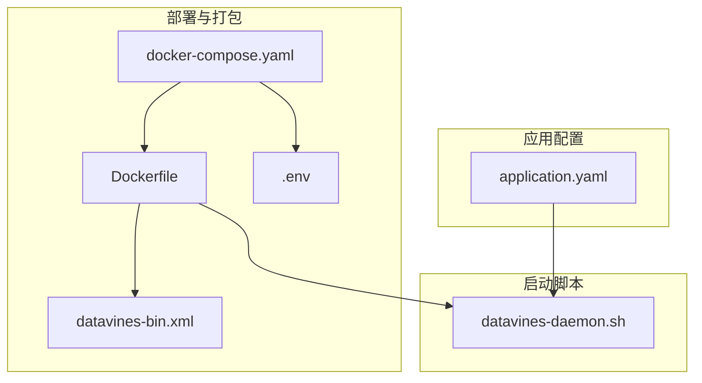
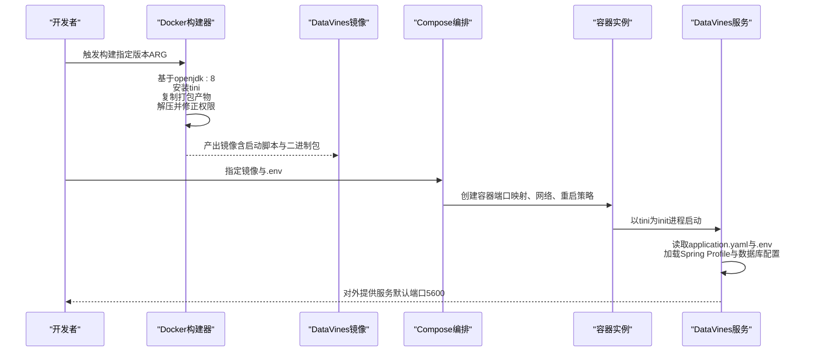
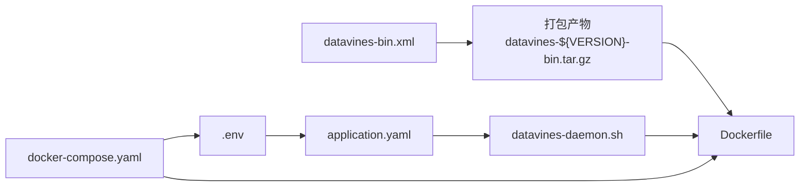

# Docker部署

<cite>
**本文引用的文件列表**
- [Dockerfile](file://deploy/docker/Dockerfile)
- [docker-compose.yaml](file://deploy/compose/docker-compose.yaml)
- [.env](file://deploy/compose/.env)
- [application.yaml](file://datavines-server/src/main/resources/application.yaml)
- [datavines-bin.xml](file://datavines-dist/src/main/assembly/datavines-bin.xml)
- [datavines-daemon.sh](file://bin/datavines-daemon.sh)
</cite>

## 目录
1. [简介](#简介)
2. [项目结构](#项目结构)
3. [核心组件](#核心组件)
4. [架构总览](#架构总览)
5. [详细组件分析](#详细组件分析)
6. [依赖关系分析](#依赖关系分析)
7. [性能与资源考虑](#性能与资源考虑)
8. [故障排查指南](#故障排查指南)
9. [结论](#结论)
10. [附录：构建与运行最佳实践](#附录构建与运行最佳实践)

## 简介
本指南面向希望在Docker环境中部署DataVines的用户，系统性讲解如何基于仓库提供的Dockerfile构建DataVines镜像并运行容器。内容涵盖：
- Dockerfile逐层解析（基础镜像、依赖安装、文件复制、端口暴露、启动命令）
- 如何通过环境变量覆盖application.yaml中的配置（数据库连接、服务端口等）
- 构建镜像与运行容器的完整命令及最佳实践（数据卷挂载、网络配置、资源限制）
- 镜像优化与安全配置建议

## 项目结构
与Docker部署直接相关的目录与文件如下：
- 部署脚本与编排：deploy/docker/Dockerfile、deploy/compose/docker-compose.yaml、deploy/compose/.env
- 应用配置：datavines-server/src/main/resources/application.yaml
- 打包产物装配：datavines-dist/src/main/assembly/datavines-bin.xml
- 启动脚本：bin/datavines-daemon.sh

图表来源
- [Dockerfile](file://deploy/docker/Dockerfile#L1-L44)
- [docker-compose.yaml](file://deploy/compose/docker-compose.yaml#L1-L19)
- [.env](file://deploy/compose/.env#L1-L5)
- [datavines-bin.xml](file://datavines-dist/src/main/assembly/datavines-bin.xml#L1-L150)
- [application.yaml](file://datavines-server/src/main/resources/application.yaml#L1-L96)
- [datavines-daemon.sh](file://bin/datavines-daemon.sh#L1-L183)

章节来源
- [Dockerfile](file://deploy/docker/Dockerfile#L1-L44)
- [docker-compose.yaml](file://deploy/compose/docker-compose.yaml#L1-L19)
- [.env](file://deploy/compose/.env#L1-L5)
- [datavines-bin.xml](file://datavines-dist/src/main/assembly/datavines-bin.xml#L1-L150)
- [application.yaml](file://datavines-server/src/main/resources/application.yaml#L1-L96)
- [datavines-daemon.sh](file://bin/datavines-daemon.sh#L1-L183)

## 核心组件
- Dockerfile：定义镜像构建流程，包含基础镜像、时区与语言设置、tini入口进程、打包产物复制与解压、权限修正、端口暴露、容器启动命令。
- docker-compose.yaml：定义服务、端口映射、环境文件、重启策略、网络与子网。
- .env：提供Spring Profile与数据库连接等环境变量，用于覆盖application.yaml中的默认值。
- application.yaml：应用默认配置（数据库驱动、URL、用户名、密码、Quartz、Server端口等）。
- datavines-bin.xml：打包装配清单，决定最终二进制包中包含哪些资源与依赖。
- datavines-daemon.sh：容器内启动入口脚本，负责设置日志、JVM参数、类路径与执行主类。

章节来源
- [Dockerfile](file://deploy/docker/Dockerfile#L1-L44)
- [docker-compose.yaml](file://deploy/compose/docker-compose.yaml#L1-L19)
- [.env](file://deploy/compose/.env#L1-L5)
- [application.yaml](file://datavines-server/src/main/resources/application.yaml#L1-L96)
- [datavines-bin.xml](file://datavines-dist/src/main/assembly/datavines-bin.xml#L1-L150)
- [datavines-daemon.sh](file://bin/datavines-daemon.sh#L1-L183)

## 架构总览
下图展示从Dockerfile到容器运行的整体流程，以及环境变量对配置的影响。

图表来源
- [Dockerfile](file://deploy/docker/Dockerfile#L1-L44)
- [docker-compose.yaml](file://deploy/compose/docker-compose.yaml#L1-L19)
- [.env](file://deploy/compose/.env#L1-L5)
- [application.yaml](file://datavines-server/src/main/resources/application.yaml#L1-L96)
- [datavines-daemon.sh](file://bin/datavines-daemon.sh#L1-L183)

## 详细组件分析

### Dockerfile逐层解析
- 基础镜像与维护者信息：使用openjdk:8作为基础镜像，便于Java应用运行。
- 版本参数与环境变量：通过ARG传入版本号，默认1.0.0-SNAPSHOT；设置时区与语言，确保日志与字符集一致。
- 工作目录与tini：创建工作目录/opt，安装tini作为init进程，保证信号处理与僵尸进程清理。
- 复制与解压：复制打包产物至镜像根目录并解压，重命名为datavines，删除压缩包。
- 权限修正：赋予启动脚本可执行权限并清理回车符，避免容器内换行问题。
- 端口暴露与启动命令：暴露5600端口；使用tini作为PID1，调用启动脚本以start_container模式运行。

章节来源
- [Dockerfile](file://deploy/docker/Dockerfile#L1-L44)

### 启动脚本与运行模式
- 脚本职责：设置日志配置、JVM参数、类路径、主类；支持start、start_container、start_with_jmx、stop、status等模式。
- 容器模式：start_container模式在容器内直接前台运行，适合由容器管理器（如Docker或Compose）接管生命周期。
- 日志与JMX：默认使用server-logback.xml进行日志输出；可选启用JMX监控（通过start_with_jmx）。

章节来源
- [datavines-daemon.sh](file://bin/datavines-daemon.sh#L1-L183)

### 配置覆盖机制（application.yaml与环境变量）
- Spring Profile：通过环境变量切换数据库类型（例如mysql），对应application.yaml中的多配置文件激活。
- 数据库连接：通过环境变量覆盖driver-class-name、url、username、password等，实现不同数据库的快速切换。
- 服务端口：application.yaml中server.port默认5600，可通过环境变量覆盖（如DOCKER_HOST_PORT映射外部端口）。
- 其他配置：management、logging等也可通过环境变量或配置文件覆盖，遵循Spring Boot的配置优先级规则。

章节来源
- [application.yaml](file://datavines-server/src/main/resources/application.yaml#L1-L96)
- [.env](file://deploy/compose/.env#L1-L5)

### 打包产物与装配清单
- 装配清单：datavines-bin.xml定义了打包格式、输出目录、资源文件与依赖集合，确保最终二进制包包含运行所需的配置、脚本与插件依赖。
- 依赖范围：包含Spark/Flink引擎插件、常用JDBC驱动等，满足多数据源场景。

章节来源
- [datavines-bin.xml](file://datavines-dist/src/main/assembly/datavines-bin.xml#L1-L150)

## 依赖关系分析
- Dockerfile依赖打包产物（datavines-dist/target/datavines-${VERSION}-bin.tar.gz）与启动脚本（bin/datavines-daemon.sh）。
- 容器运行依赖application.yaml与.env中的配置，其中.env通过环境变量覆盖application.yaml的关键项。
- Compose编排依赖镜像与网络配置，确保容器间通信与端口可达。

图表来源
- [datavines-bin.xml](file://datavines-dist/src/main/assembly/datavines-bin.xml#L1-L150)
- [Dockerfile](file://deploy/docker/Dockerfile#L1-L44)
- [datavines-daemon.sh](file://bin/datavines-daemon.sh#L1-L183)
- [application.yaml](file://datavines-server/src/main/resources/application.yaml#L1-L96)
- [.env](file://deploy/compose/.env#L1-L5)
- [docker-compose.yaml](file://deploy/compose/docker-compose.yaml#L1-L19)

章节来源
- [Dockerfile](file://deploy/docker/Dockerfile#L1-L44)
- [docker-compose.yaml](file://deploy/compose/docker-compose.yaml#L1-L19)
- [.env](file://deploy/compose/.env#L1-L5)
- [application.yaml](file://datavines-server/src/main/resources/application.yaml#L1-L96)
- [datavines-bin.xml](file://datavines-dist/src/main/assembly/datavines-bin.xml#L1-L150)
- [datavines-daemon.sh](file://bin/datavines-daemon.sh#L1-L183)

## 性能与资源考虑
- JVM内存与GC：启动脚本设置了较大的堆与G1GC参数，建议根据宿主机资源与业务负载调整-Xmx等参数。
- 进程模型：使用tini作为init进程，有助于正确处理信号与子进程回收，提升容器稳定性。
- 端口与网络：默认暴露5600，Compose中已做端口映射；若需高可用或集群部署，建议结合外部负载均衡与健康检查。
- 插件与依赖：装配清单包含多种JDBC驱动与引擎插件，按需裁剪可减少镜像体积与启动时间。

章节来源
- [datavines-daemon.sh](file://bin/datavines-daemon.sh#L1-L183)
- [Dockerfile](file://deploy/docker/Dockerfile#L1-L44)

## 故障排查指南
- 容器无法启动或立即退出
  - 检查启动脚本是否以start_container模式运行，确认日志输出位置与权限。
  - 使用docker logs查看容器标准输出与错误日志。
- 端口冲突或不可访问
  - 确认宿主机端口映射与容器内server.port一致；检查防火墙与安全组。
- 数据库连接失败
  - 确认.env中数据库URL、用户名、密码与驱动类名正确；若使用MySQL，请激活mysql profile。
- 配置未生效
  - 确认环境变量键名符合Spring Boot约定（如SPRING_DATASOURCE_URL）；检查application.yaml与.env的优先级顺序。

章节来源
- [docker-compose.yaml](file://deploy/compose/docker-compose.yaml#L1-L19)
- [.env](file://deploy/compose/.env#L1-L5)
- [application.yaml](file://datavines-server/src/main/resources/application.yaml#L1-L96)
- [datavines-daemon.sh](file://bin/datavines-daemon.sh#L1-L183)

## 结论
通过仓库提供的Dockerfile与Compose编排，可以快速构建并运行DataVines服务。关键在于理解Dockerfile的构建步骤、启动脚本的运行模式，以及如何利用环境变量覆盖application.yaml中的配置。结合合理的网络与资源规划，可在生产环境中稳定部署。

## 附录：构建与运行最佳实践

### 构建镜像
- 使用ARG传递版本号，确保产物与镜像一致
- 在构建前确保打包产物存在（datavines-dist/target/datavines-${VERSION}-bin.tar.gz）
- 构建命令示例（请替换为实际路径与版本）：
  - docker build -f deploy/docker/Dockerfile -t datavines:dev --build-arg VERSION=1.0.0-SNAPSHOT .

章节来源
- [Dockerfile](file://deploy/docker/Dockerfile#L1-L44)
- [datavines-bin.xml](file://datavines-dist/src/main/assembly/datavines-bin.xml#L1-L150)

### 运行容器
- 使用Compose编排（推荐）
  - docker-compose -f deploy/compose/docker-compose.yaml up -d
  - 访问地址：http://localhost:5600
- 单容器运行（不推荐用于生产）
  - docker run -d --name datavines -p 5600:5600 --env-file deploy/compose/.env datavines:dev

章节来源
- [docker-compose.yaml](file://deploy/compose/docker-compose.yaml#L1-L19)
- [.env](file://deploy/compose/.env#L1-L5)

### 环境变量覆盖要点
- 切换数据库类型：SPRING_PROFILES_ACTIVE=mysql
- 数据库连接：SPRING_DATASOURCE_URL、SPRING_DATASOURCE_USERNAME、SPRING_DATASOURCE_PASSWORD、SPRING_DATASOURCE_DRIVER-CLASS_NAME
- 服务端口：可通过宿主机端口映射覆盖容器内server.port

章节来源
- [.env](file://deploy/compose/.env#L1-L5)
- [application.yaml](file://datavines-server/src/main/resources/application.yaml#L1-L96)

### 数据卷挂载建议
- 配置目录：挂载conf目录以持久化application.yaml与日志配置
- 日志目录：挂载logs目录以便收集容器日志
- 示例（Compose中可参考）：
  - volumes:
    - ./conf:/opt/datavines/conf
    - ./logs:/opt/datavines/logs

章节来源
- [datavines-daemon.sh](file://bin/datavines-daemon.sh#L1-L183)

### 网络与安全配置
- 网络：使用自定义bridge网络，明确子网段，便于容器间通信
- 安全：避免使用privileged=true（除非必要）；限制容器能力与只读根文件系统
- 重启策略：使用unless-stopped，配合健康检查可进一步增强可用性

章节来源
- [docker-compose.yaml](file://deploy/compose/docker-compose.yaml#L1-L19)

### 镜像优化与安全建议
- 层叠优化：合并apt-get更新与安装命令，清理缓存与临时文件
- 最小化基础镜像：可考虑使用更小的基础镜像（如alpine-openjdk），但需验证兼容性
- 多阶段构建：将构建产物与运行时分离，减小最终镜像体积
- 安全扫描：定期对镜像进行漏洞扫描，及时更新基础镜像与依赖
- 运行时安全：非root用户运行、禁用不必要的特权、最小权限原则

章节来源
- [Dockerfile](file://deploy/docker/Dockerfile#L1-L44)