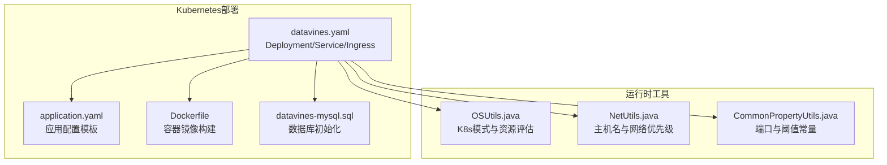
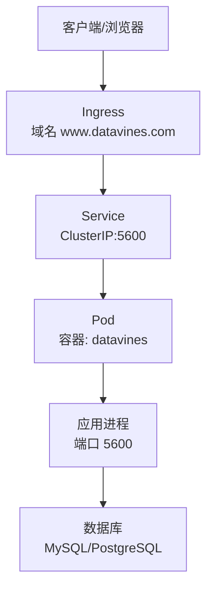
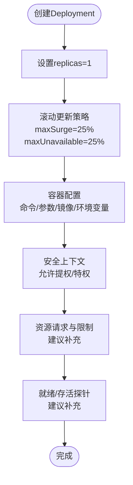
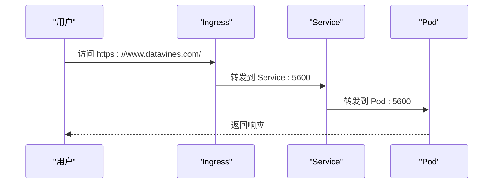
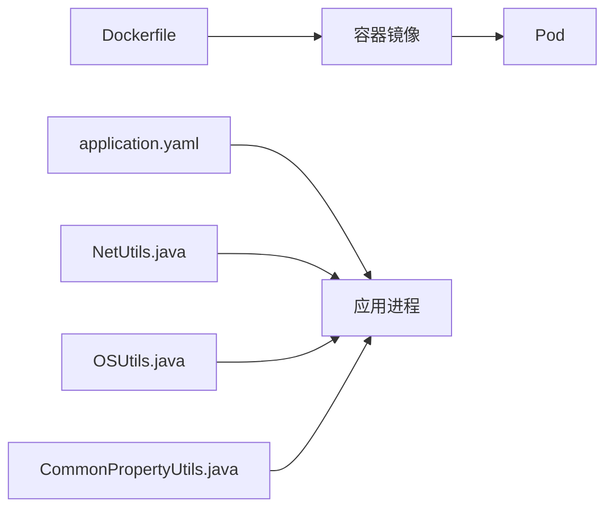

# Kubernetes部署

<cite>
**本文引用的文件**
- [datavines.yaml](file://deploy/k8s/datavines.yaml)
- [application.yaml](file://datavines-server/src/main/resources/application.yaml)
- [Dockerfile](file://deploy/docker/Dockerfile)
- [datavines-mysql.sql](file://scripts/sql/datavines-mysql.sql)
- [OSUtils.java](file://datavines-common/src/main/java/io/it/datavines/common/utils/OSUtils.java)
- [NetUtils.java](file://datavines-common/src/main/java/io/it/datavines/common/utils/NetUtils.java)
- [CommonPropertyUtils.java](file://datavines-common/src/main/java/io/it/datavines/common/utils/CommonPropertyUtils.java)
</cite>

## 目录
1. [简介](#简介)
2. [项目结构](#项目结构)
3. [核心组件](#核心组件)
4. [架构总览](#架构总览)
5. [详细组件分析](#详细组件分析)
6. [依赖关系分析](#依赖关系分析)
7. [性能考量](#性能考量)
8. [故障排查指南](#故障排查指南)
9. [结论](#结论)
10. [附录](#附录)

## 简介
本指南面向运维与平台工程团队，系统性讲解如何在Kubernetes集群中部署DataVines。内容覆盖：
- 部署清单解析：Deployment、Service、Ingress等资源定义
- 配置管理：通过ConfigMap管理application.yaml，通过Secret管理敏感信息
- Pod配置：资源请求与限制、就绪与存活探针
- 存储与持久化：建议方案与最佳实践
- 服务暴露：NodePort、LoadBalancer、Ingress三种方式对比与配置
- 水平扩展：副本数、滚动升级策略与扩缩容策略
- 生产高可用：多副本、健康检查、存储与网络隔离、安全加固

## 项目结构
DataVines的Kubernetes部署主要由以下文件支撑：
- K8s部署清单：deploy/k8s/datavines.yaml
- 应用配置模板：datavines-server/src/main/resources/application.yaml
- 容器镜像构建：deploy/docker/Dockerfile
- 数据库初始化脚本：scripts/sql/datavines-mysql.sql
- 运行时环境判断与网络工具：datavines-common/utils下的OSUtils、NetUtils、CommonPropertyUtils

图表来源
- [datavines.yaml](file://deploy/k8s/datavines.yaml#L1-L112)
- [application.yaml](file://datavines-server/src/main/resources/application.yaml#L1-L96)
- [Dockerfile](file://deploy/docker/Dockerfile#L1-L44)
- [datavines-mysql.sql](file://scripts/sql/datavines-mysql.sql#L1-L200)
- [OSUtils.java](file://datavines-common/src/main/java/io/it/datavines/common/utils/OSUtils.java#L80-L166)
- [NetUtils.java](file://datavines-common/src/main/java/io/it/datavines/common/utils/NetUtils.java#L28-L110)
- [CommonPropertyUtils.java](file://datavines-common/src/main/java/io/it/datavines/common/utils/CommonPropertyUtils.java#L34-L61)

章节来源
- [datavines.yaml](file://deploy/k8s/datavines.yaml#L1-L112)
- [application.yaml](file://datavines-server/src/main/resources/application.yaml#L1-L96)
- [Dockerfile](file://deploy/docker/Dockerfile#L1-L44)
- [datavines-mysql.sql](file://scripts/sql/datavines-mysql.sql#L1-L200)
- [OSUtils.java](file://datavines-common/src/main/java/io/it/datavines/common/utils/OSUtils.java#L80-L166)
- [NetUtils.java](file://datavines-common/src/main/java/io/it/datavines/common/utils/NetUtils.java#L28-L110)
- [CommonPropertyUtils.java](file://datavines-common/src/main/java/io/it/datavines/common/utils/CommonPropertyUtils.java#L34-L61)

## 核心组件
- Deployment：定义Pod模板、副本数、滚动更新策略，以及容器启动命令与环境变量
- Service：暴露应用端口，支持ClusterIP、NodePort或LoadBalancer
- Ingress：对外提供域名访问，需配合Ingress Controller
- ConfigMap：用于挂载application.yaml配置文件
- Secret：用于存放数据库密码等敏感信息
- Pod安全与资源：容器特权、资源请求与限制、探针

章节来源
- [datavines.yaml](file://deploy/k8s/datavines.yaml#L1-L112)
- [application.yaml](file://datavines-server/src/main/resources/application.yaml#L1-L96)

## 架构总览
DataVines在K8s中的典型拓扑如下：
- 外部流量经Ingress进入Service，再转发到后端Pod
- Pod内运行Java应用，监听5600端口
- 应用通过环境变量连接数据库（默认MySQL）
- 配置通过ConfigMap挂载application.yaml，敏感信息通过Secret注入

图表来源
- [datavines.yaml](file://deploy/k8s/datavines.yaml#L63-L111)
- [application.yaml](file://datavines-server/src/main/resources/application.yaml#L69-L96)

## 详细组件分析

### Deployment：Pod与容器配置
- 副本数与滚动更新：当前副本数为1，滚动更新策略为各25% surge/unavailable
- 启动命令与参数：通过daemon脚本启动容器，容器镜像来自私有仓库
- 环境变量：激活profile为mysql，数据库URL、用户名、密码均以环境变量形式注入
- 安全上下文：允许提权与特权模式，需结合最小权限原则审慎使用
- 资源：当前未设置requests/limits，建议按生产环境配置

图表来源
- [datavines.yaml](file://deploy/k8s/datavines.yaml#L1-L61)

章节来源
- [datavines.yaml](file://deploy/k8s/datavines.yaml#L1-L61)

### Service：服务暴露
- 类型：ClusterIP，仅集群内部可访问
- 端口：5600，目标端口5600
- 选择器：匹配Deployment标签

如需外部访问，可改为NodePort或LoadBalancer；若需域名访问，建议配合Ingress。

章节来源
- [datavines.yaml](file://deploy/k8s/datavines.yaml#L63-L87)

### Ingress：域名访问
- 入口类：datavines
- 规则：host为www.datavines.com，路径前缀“/”，转发至Service:5600
- 注意：Ingress规则中的backend字段已过时，应使用标准backend引用

图表来源
- [datavines.yaml](file://deploy/k8s/datavines.yaml#L88-L111)

章节来源
- [datavines.yaml](file://deploy/k8s/datavines.yaml#L88-L111)

### ConfigMap：管理application.yaml
- 方案：将application.yaml打包为ConfigMap，挂载到容器指定路径
- 优点：便于版本化管理、热更新（滚动重启生效）、与Secret解耦
- 建议：将数据库连接、日志级别、端口等非敏感配置放入ConfigMap

章节来源
- [application.yaml](file://datavines-server/src/main/resources/application.yaml#L1-L96)

### Secret：管理敏感信息
- 方案：将数据库密码等敏感信息放入Secret，以环境变量或挂载文件形式注入
- 最佳实践：最小权限、定期轮换、避免明文存储

章节来源
- [datavines.yaml](file://deploy/k8s/datavines.yaml#L37-L46)

### Pod配置与探针
- 端口：容器暴露5600，应用server.port=5600
- 就绪探针：建议以HTTP GET /actuator/health/readiness或应用自检接口
- 存活探针：建议以HTTP GET /actuator/health/liveness或应用自检接口
- 探针参数：initialDelaySeconds、periodSeconds、timeoutSeconds、failureThreshold、successThreshold

章节来源
- [application.yaml](file://datavines-server/src/main/resources/application.yaml#L69-L96)
- [Dockerfile](file://deploy/docker/Dockerfile#L40-L44)

### 资源请求与限制
- 当前清单未设置resources，建议为生产环境配置requests/limits
- 参考依据：应用端口与运行时工具对CPU/内存的评估逻辑

章节来源
- [datavines.yaml](file://deploy/k8s/datavines.yaml#L49-L50)
- [OSUtils.java](file://datavines-common/src/main/java/io/it/datavines/common/utils/OSUtils.java#L80-L166)
- [CommonPropertyUtils.java](file://datavines-common/src/main/java/io/it/datavines/common/utils/CommonPropertyUtils.java#L34-L61)

### 持久化存储
- 当前清单未包含持久卷声明（PVC），应用数据默认写入容器本地磁盘
- 建议：为数据库与应用日志目录配置PVC，确保数据持久化与高可用

章节来源
- [datavines.yaml](file://deploy/k8s/datavines.yaml#L1-L112)

### 服务暴露方式
- ClusterIP：仅集群内访问（当前默认）
- NodePort：在所有节点开放固定端口，便于外网直连
- LoadBalancer：由云厂商负载均衡器分配公网IP
- Ingress：统一入口，支持TLS、路由与限流

章节来源
- [datavines.yaml](file://deploy/k8s/datavines.yaml#L63-L87)

### 水平扩展策略
- 副本数：当前为1，建议根据业务量提升至2+副本
- 滚动更新：maxSurge/maxUnavailable已配置，建议结合探针与资源限制优化
- 扩缩容：HPA可根据CPU/内存或自定义指标自动扩缩

章节来源
- [datavines.yaml](file://deploy/k8s/datavines.yaml#L13-L23)

## 依赖关系分析
- 镜像与容器：Dockerfile定义了基础镜像、工作目录、暴露端口与启动命令
- 配置与运行：application.yaml定义了数据库驱动、端口、Quartz集群模式等
- 运行时网络：NetUtils在K8s模式下对主机名进行处理，OSUtils与CommonPropertyUtils提供资源评估与端口常量

图表来源
- [Dockerfile](file://deploy/docker/Dockerfile#L1-L44)
- [application.yaml](file://datavines-server/src/main/resources/application.yaml#L1-L96)
- [NetUtils.java](file://datavines-common/src/main/java/io/it/datavines/common/utils/NetUtils.java#L28-L110)
- [OSUtils.java](file://datavines-common/src/main/java/io/it/datavines/common/utils/OSUtils.java#L80-L166)
- [CommonPropertyUtils.java](file://datavines-common/src/main/java/io/it/datavines/common/utils/CommonPropertyUtils.java#L34-L61)

章节来源
- [Dockerfile](file://deploy/docker/Dockerfile#L1-L44)
- [application.yaml](file://datavines-server/src/main/resources/application.yaml#L1-L96)
- [NetUtils.java](file://datavines-common/src/main/java/io/it/datavines/common/utils/NetUtils.java#L28-L110)
- [OSUtils.java](file://datavines-common/src/main/java/io/it/datavines/common/utils/OSUtils.java#L80-L166)
- [CommonPropertyUtils.java](file://datavines-common/src/main/java/io/it/datavines/common/utils/CommonPropertyUtils.java#L34-L61)

## 性能考量
- 端口与线程：应用端口为5600；运行时工具提供最大CPU负载与保留内存阈值，可用于资源评估
- 资源规划：结合OSUtils与CommonPropertyUtils的阈值，合理设置requests/limits
- 数据库：Quartz集群模式与连接池参数影响并发与稳定性
- 日志：建议将日志输出到标准输出，便于K8s采集

章节来源
- [application.yaml](file://datavines-server/src/main/resources/application.yaml#L69-L96)
- [OSUtils.java](file://datavines-common/src/main/java/io/it/datavines/common/utils/OSUtils.java#L80-L166)
- [CommonPropertyUtils.java](file://datavines-common/src/main/java/io/it/datavines/common/utils/CommonPropertyUtils.java#L34-L61)

## 故障排查指南
- 健康检查失败
  - 检查就绪/存活探针是否指向正确路径与端口
  - 查看Pod事件与日志，确认端口占用与权限问题
- 数据库连接异常
  - 确认环境变量中的数据库URL、用户名、密码是否正确
  - 检查数据库可达性与初始化脚本执行情况
- 配置不生效
  - 确认ConfigMap挂载路径与文件名一致
  - 确认Profile激活与配置项覆盖关系
- Ingress无法访问
  - 确认Ingress Controller已部署且IngressClassName正确
  - 检查域名解析与证书配置

章节来源
- [datavines.yaml](file://deploy/k8s/datavines.yaml#L37-L46)
- [application.yaml](file://datavines-server/src/main/resources/application.yaml#L1-L96)
- [datavines-mysql.sql](file://scripts/sql/datavines-mysql.sql#L1-L200)

## 结论
- 当前清单提供了基础的K8s部署骨架，适合开发与测试环境
- 生产环境建议补齐：探针、资源限制、持久化、Secret、Ingress TLS与灰度策略
- 通过ConfigMap与Secret实现配置与密钥分离，遵循最小权限原则
- 结合HPA与多副本，提升可用性与弹性

## 附录

### 部署清单要点对照
- Deployment
  - 副本数：当前1，建议≥2
  - 滚动更新：maxSurge/maxUnavailable已配置
  - 安全上下文：允许提权/特权，建议关闭
  - 资源：建议添加requests/limits
- Service
  - 类型：ClusterIP，建议配合NodePort/LoadBalancer或Ingress
- Ingress
  - host与路径：www.datavines.com与“/”
  - backend字段：建议使用标准引用
- ConfigMap
  - 挂载application.yaml，非敏感配置
- Secret
  - 注入数据库密码等敏感信息

章节来源
- [datavines.yaml](file://deploy/k8s/datavines.yaml#L1-L112)

### 数据库初始化
- 使用datavines-mysql.sql初始化数据库表结构与Quartz相关表
- 确保数据库服务可达且初始化成功

章节来源
- [datavines-mysql.sql](file://scripts/sql/datavines-mysql.sql#L1-L200)