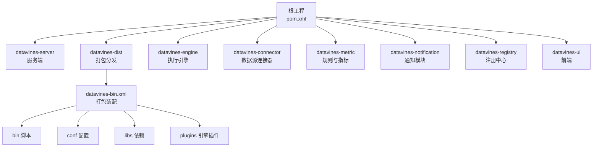
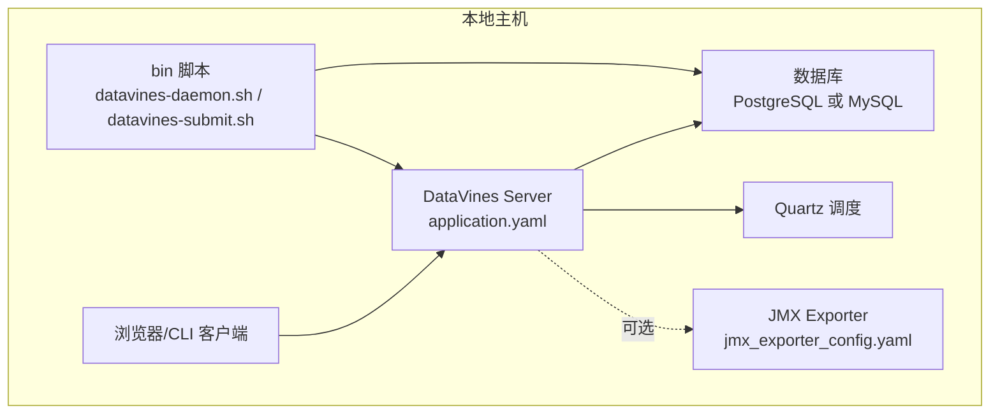
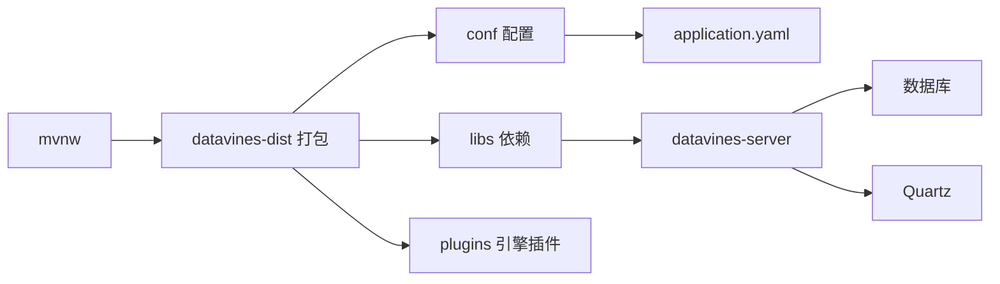

# 本地部署

<cite>
**本文引用的文件列表**
- [pom.xml](file://pom.xml)
- [mvnw](file://mvnw)
- [datavines-mysql.sql](file://scripts/sql/datavines-mysql.sql)
- [application.yaml](file://datavines-server/src/main/resources/application.yaml)
- [jmx_exporter_config.yaml](file://datavines-server/src/main/resources/jmx/jmx_exporter_config.yaml)
- [datavines-daemon.sh](file://bin/datavines-daemon.sh)
- [datavines-submit.sh](file://bin/datavines-submit.sh)
- [datavines-bin.xml](file://datavines-dist/src/main/assembly/datavines-bin.xml)
- [README.md](file://README.md)
</cite>

## 目录
1. [简介](#简介)
2. [项目结构](#项目结构)
3. [核心组件](#核心组件)
4. [架构总览](#架构总览)
5. [详细组件分析](#详细组件分析)
6. [依赖分析](#依赖分析)
7. [性能与调优建议](#性能与调优建议)
8. [故障排查指南](#故障排查指南)
9. [结论](#结论)
10. [附录](#附录)

## 简介
本指南面向开发者与测试人员，提供DataVines在单机环境下的完整本地部署流程，涵盖从源码编译、依赖准备、数据库初始化、配置文件修改、服务启动与停止、以及常用运维操作与验证方法。文档同时给出JVM参数、端口、日志目录等关键配置项的说明，并对datavines-daemon.sh与datavines-submit.sh两个脚本的使用进行详解，帮助快速搭建可验证功能的本地环境。

## 项目结构
DataVines采用多模块Maven工程组织，核心模块包括服务端、引擎、连接器、指标、通知、注册中心、UI等。打包产物通过datavines-dist模块生成发布包，包含bin脚本、conf配置、libs依赖与插件目录。

图表来源
- [pom.xml](file://pom.xml#L30-L45)
- [datavines-bin.xml](file://datavines-dist/src/main/assembly/datavines-bin.xml#L21-L149)

章节来源
- [pom.xml](file://pom.xml#L30-L45)
- [datavines-bin.xml](file://datavines-dist/src/main/assembly/datavines-bin.xml#L21-L149)

## 核心组件
- 服务端（datavines-server）：Spring Boot应用，提供REST API、调度、元数据与规则执行入口。
- 打包分发（datavines-dist）：生成发布包，包含bin脚本、conf配置、libs与plugins。
- 数据库初始化脚本（scripts/sql/datavines-mysql.sql）：包含Quartz表与业务表结构及初始数据。
- 启动脚本（bin/datavines-daemon.sh、bin/datavines-submit.sh）：封装服务启动、停止、JMX监控与离线作业提交。
- 配置文件（application.yaml）：包含数据库连接、Quartz、端口、日志等关键配置；支持多Profile切换。

章节来源
- [application.yaml](file://datavines-server/src/main/resources/application.yaml#L17-L96)
- [datavines-daemon.sh](file://bin/datavines-daemon.sh#L1-L183)
- [datavines-submit.sh](file://bin/datavines-submit.sh#L1-L49)
- [datavines-mysql.sql](file://scripts/sql/datavines-mysql.sql#L1-L160)

## 架构总览
下图展示本地单机部署的关键交互：客户端通过HTTP访问服务端；服务端使用Hikari连接池访问数据库；Quartz用于任务调度；JMX exporter可选开启；离线作业通过datavines-submit.sh提交。

图表来源
- [application.yaml](file://datavines-server/src/main/resources/application.yaml#L17-L96)
- [jmx_exporter_config.yaml](file://datavines-server/src/main/resources/jmx/jmx_exporter_config.yaml#L1-L15)
- [datavines-daemon.sh](file://bin/datavines-daemon.sh#L70-L133)
- [datavines-submit.sh](file://bin/datavines-submit.sh#L31-L49)

## 详细组件分析

### 一、源码编译与打包
- 使用Maven Wrapper（mvnw）或系统Maven进行编译打包，推荐使用官方提供的release构建方式以确保依赖一致。
- 打包产物由datavines-dist模块生成，包含bin脚本、conf配置、libs依赖与引擎插件目录。

章节来源
- [README.md](file://README.md#L29-L34)
- [mvnw](file://mvnw#L1-L317)
- [datavines-bin.xml](file://datavines-dist/src/main/assembly/datavines-bin.xml#L21-L149)

### 二、数据库初始化
- 使用脚本初始化数据库表结构与基础数据。该脚本包含Quartz相关表与业务表（如用户、工作空间、配置、规则作业等），并包含默认用户与工作空间初始化记录。
- 若使用MySQL作为数据源，请在application.yaml中激活mysql Profile；若使用PostgreSQL则保持默认Profile。

章节来源
- [datavines-mysql.sql](file://scripts/sql/datavines-mysql.sql#L1-L160)
- [datavines-mysql.sql](file://scripts/sql/datavines-mysql.sql#L836-L893)
- [application.yaml](file://datavines-server/src/main/resources/application.yaml#L84-L96)

### 三、配置文件修改（application.yaml）
- 数据源配置
  - PostgreSQL默认配置：驱动、URL、账号、密码、连接池参数等。
  - MySQL Profile配置：通过spring.profiles.active=mysql切换，使用MySQL驱动与URL。
- Quartz配置
  - job-store-type、initialize-schema、线程池大小、集群模式、表前缀、驱动委托类等。
- 服务端口
  - server.port 默认5600。
- 日志配置
  - logging.config 指向server-logback.xml。
- 管理端点
  - management暴露所有端点，便于健康检查与指标采集。

章节来源
- [application.yaml](file://datavines-server/src/main/resources/application.yaml#L17-L96)

### 四、datavines-daemon.sh 使用说明
- 功能
  - 启动/停止/重启服务，支持容器内运行与JMX监控模式。
  - 支持Profile切换（如mysql）。
- 关键行为
  - 设置DATAVINES_OPTS（JVM参数）、DATAVINES_PID_DIR、DATAVINES_LOG_DIR、DATAVINES_CONF_DIR、DATAVINES_LIB_JARS。
  - start/start_container/start_with_jmx分别对应后台启动、前台启动、带JMX启动。
  - stop会优雅关闭，超时未退出则强制kill。
  - status检查PID文件是否存在。
- 常用命令
  - 启动（默认Profile）：bin/datavines-daemon.sh start
  - 启动（mysql Profile）：bin/datavines-daemon.sh start mysql
  - 带JMX启动：bin/datavines-daemon.sh start_with_jmx
  - 停止：bin/datavines-daemon.sh stop
  - 状态：bin/datavines-daemon.sh status
  - 重启（带JMX）：bin/datavines-daemon.sh restart_with_jmx

章节来源
- [datavines-daemon.sh](file://bin/datavines-daemon.sh#L1-L183)

### 五、datavines-submit.sh 使用说明
- 功能
  - 提交离线作业（非Web调度），通过JobExecuteBootstrap执行。
- 关键行为
  - 读取作业JSON文件路径，设置DATAVINES_OPTS与CLASSPATH，调用JobExecuteBootstrap。
- 常用命令
  - 提交作业：bin/datavines-submit.sh /path/to/job.json

章节来源
- [datavines-submit.sh](file://bin/datavines-submit.sh#L1-L49)

### 六、JVM参数、端口与日志目录
- JVM参数（DATAVINES_OPTS）
  - 默认包含堆内存、GC策略等参数，可根据机器资源调整。
- 端口（server.port）
  - 默认5600，可通过application.yaml修改。
- 日志目录（DATAVINES_LOG_DIR）
  - 默认logs目录，可在脚本中设置或通过环境变量覆盖。
- JMX导出（可选）
  - start_with_jmx模式启用JMX exporter，配置文件位于conf/jmx。

章节来源
- [datavines-daemon.sh](file://bin/datavines-daemon.sh#L55-L61)
- [application.yaml](file://datavines-server/src/main/resources/application.yaml#L69-L83)
- [jmx_exporter_config.yaml](file://datavines-server/src/main/resources/jmx/jmx_exporter_config.yaml#L1-L15)

### 七、服务启动、停止、重启与验证
- 启动
  - 使用datavines-daemon.sh start或start mysql（按需选择Profile）。
- 停止
  - 使用datavines-daemon.sh stop，若进程未优雅退出则强制kill。
- 重启
  - 使用datavines-daemon.sh restart_with_jmx（带JMX）或先stop再start。
- 验证
  - 访问服务端口（默认5600）确认服务可用。
  - 查看日志文件（logs/datavines-server-*.out）定位问题。
  - 使用status检查进程PID。

章节来源
- [datavines-daemon.sh](file://bin/datavines-daemon.sh#L70-L173)
- [application.yaml](file://datavines-server/src/main/resources/application.yaml#L69-L71)

## 依赖分析
- 构建与打包
  - Maven Wrapper（mvnw）统一构建入口。
  - datavines-bin.xml定义了conf、libs、plugins的产出布局。
- 运行时依赖
  - 服务端默认使用PostgreSQL；通过mysql Profile可切换至MySQL。
  - Quartz使用JDBC JobStore，需确保数据库表初始化完成。
- 插件与引擎
  - plugins/spark与plugins/flink目录包含引擎相关依赖，便于扩展不同执行引擎。

图表来源
- [mvnw](file://mvnw#L1-L317)
- [datavines-bin.xml](file://datavines-dist/src/main/assembly/datavines-bin.xml#L21-L149)
- [application.yaml](file://datavines-server/src/main/resources/application.yaml#L17-L96)

章节来源
- [mvnw](file://mvnw#L1-L317)
- [datavines-bin.xml](file://datavines-dist/src/main/assembly/datavines-bin.xml#L21-L149)
- [application.yaml](file://datavines-server/src/main/resources/application.yaml#L17-L96)

## 性能与调优建议
- JVM参数
  - 根据机器内存调整DATAVINES_OPTS中的堆大小与GC策略，默认已启用G1GC，可根据负载适当增大堆或调整Region大小。
- 数据库连接池
  - application.yaml中Hikari连接池参数（最大连接数、空闲超时、连接超时等）可根据并发与延迟需求优化。
- Quartz线程池
  - 线程池大小与批处理数量影响任务并发度，可根据规则数量与执行频率调整。
- 日志与监控
  - 开启JMX监控可辅助观察运行指标；生产环境建议结合Prometheus/Grafana进行监控。

章节来源
- [datavines-daemon.sh](file://bin/datavines-daemon.sh#L55-L61)
- [application.yaml](file://datavines-server/src/main/resources/application.yaml#L23-L40)
- [application.yaml](file://datavines-server/src/main/resources/application.yaml#L39-L60)

## 故障排查指南
- 无法启动服务
  - 检查端口占用与防火墙；确认application.yaml中数据库连接正确；查看logs日志文件。
- 数据库初始化失败
  - 确认数据库已创建且用户具备权限；执行datavines-mysql.sql；若使用MySQL需激活mysql Profile。
- 作业提交失败
  - 确认datavines-submit.sh传入的作业文件路径有效；检查libs目录下依赖是否齐全。
- 服务停止不掉
  - 使用stop后仍存在进程，脚本会尝试强制kill，可手动清理PID文件后重试。

章节来源
- [datavines-daemon.sh](file://bin/datavines-daemon.sh#L135-L153)
- [datavines-mysql.sql](file://scripts/sql/datavines-mysql.sql#L836-L893)
- [application.yaml](file://datavines-server/src/main/resources/application.yaml#L17-L96)
- [datavines-submit.sh](file://bin/datavines-submit.sh#L31-L49)

## 结论
通过本指南，您可以在单机环境下完成DataVines的源码编译、数据库初始化、配置修改与服务启动。配合datavines-daemon.sh与datavines-submit.sh，可实现服务的日常运维与离线作业提交。建议在生产环境中进一步完善监控、备份与高可用策略。

## 附录
- 快速命令清单
  - 编译打包：mvnw clean package -Prelease -DskipTests
  - 初始化数据库：执行scripts/sql/datavines-mysql.sql
  - 启动服务（PostgreSQL）：bin/datavines-daemon.sh start
  - 启动服务（MySQL）：bin/datavines-daemon.sh start mysql
  - 带JMX启动：bin/datavines-daemon.sh start_with_jmx
  - 停止服务：bin/datavines-daemon.sh stop
  - 重启服务：bin/datavines-daemon.sh restart_with_jmx
  - 提交作业：bin/datavines-submit.sh /path/to/job.json
- 关键配置项
  - 数据库：driver-class-name、url、username、password、Hikari参数
  - Quartz：job-store-type、initialize-schema、线程池与表前缀
  - 服务端口：server.port
  - 日志：logging.config
  - 管理端点：management.endpoints.web.exposure.include

章节来源
- [README.md](file://README.md#L29-L34)
- [datavines-mysql.sql](file://scripts/sql/datavines-mysql.sql#L1-L160)
- [application.yaml](file://datavines-server/src/main/resources/application.yaml#L17-L96)
- [datavines-daemon.sh](file://bin/datavines-daemon.sh#L70-L173)
- [datavines-submit.sh](file://bin/datavines-submit.sh#L31-L49)