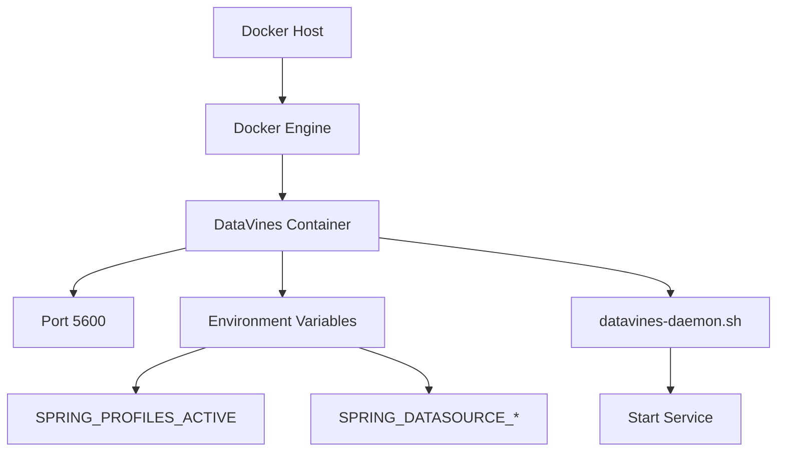
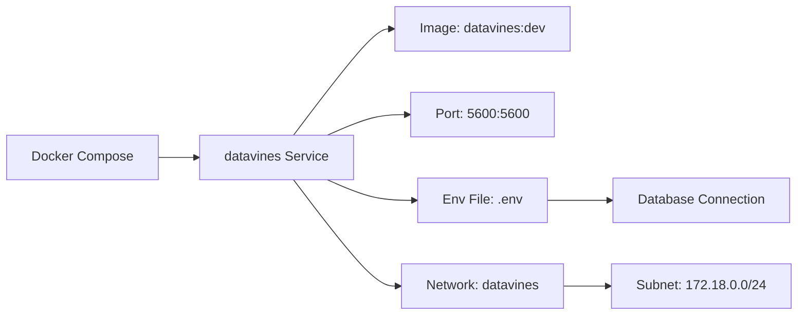
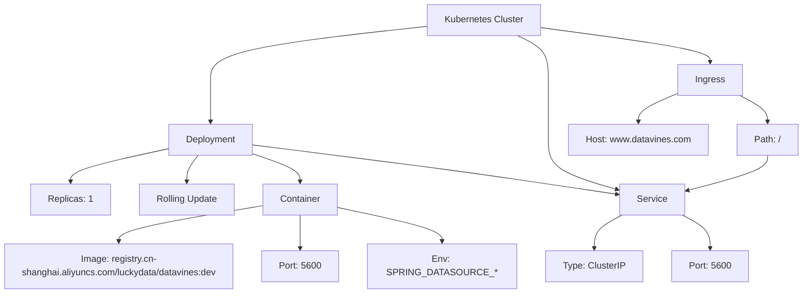

# 部署指南

<cite>
**本文档中引用的文件**  
- [README.md](file://README.md)
- [datavines-daemon.sh](file://bin/datavines-daemon.sh)
- [datavines-submit.sh](file://bin/datavines-submit.sh)
- [Dockerfile](file://deploy/docker/Dockerfile)
- [docker-compose.yaml](file://deploy/compose/docker-compose.yaml)
- [.env](file://deploy/compose/.env)
- [datavines.yaml](file://deploy/k8s/datavines.yaml)
- [application.yaml](file://datavines-server/src/main/resources/application.yaml)
- [datavines-mysql.sql](file://scripts/sql/datavines-mysql.sql)
- [server-logback.xml](file://datavines-server/src/main/resources/server-logback.xml)
</cite>

## 目录
1. [简介](#简介)
2. [环境依赖](#环境依赖)
3. [单机部署](#单机部署)
4. [Docker部署](#docker部署)
5. [Docker Compose部署](#docker-compose部署)
6. [Kubernetes部署](#kubernetes部署)
7. [配置文件详解](#配置文件详解)
8. [生产环境最佳实践](#生产环境最佳实践)
9. [资源需求与性能调优](#资源需求与性能调优)
10. [部署验证与健康检查](#部署验证与健康检查)
11. [监控与日志管理](#监控与日志管理)

## 简介

DataVines 是一个轻量级、易部署的数据质量服务框架，支持多种部署模式，包括单机部署、Docker部署、Docker Compose部署和Kubernetes部署。本指南将详细介绍各种部署方式的完整步骤、优缺点、适用场景以及生产环境下的最佳实践。

DataVines 采用去中心化设计，Server节点支持水平扩展，具备自动容错能力，确保作业不丢失或重复执行。系统最小依赖仅为MySQL，便于快速启动和验证数据质量操作。

**Section sources**
- [README.md](file://README.md#L24-L92)

## 环境依赖

在部署DataVines之前，请确保满足以下环境依赖：

1. **Java运行环境**：JDK 8
2. **数据库**：MySQL（推荐5.7及以上版本）或PostgreSQL
3. **构建工具**：Maven 3.6.1及以上版本
4. **可选执行引擎**：
   - 若数据量较小或仅用于功能验证，可使用JDBC引擎
   - 若基于Spark运行，需确保服务器已安装Spark

部署前需执行Maven打包命令生成可部署文件：
```bash
mvn clean package -Prelease -DskipTests
```

**Section sources**
- [README.md](file://README.md#L93-L98)

## 单机部署

### 部署步骤

1. **获取发布包**  
   从Maven构建生成的`datavines-dist/target/`目录获取`datavines-{version}-bin.tar.gz`发布包。

2. **解压安装包**  
   ```bash
   tar -zxvf datavines-{version}-bin.tar.gz -C /opt/
   ```

3. **初始化数据库**  
   执行SQL脚本创建所需表结构：
   ```bash
   mysql -u root -p < scripts/sql/datavines-mysql.sql
   ```

4. **修改配置文件**  
   编辑`conf/application.yaml`，根据实际环境修改数据库连接信息。

5. **启动服务**  
   使用启动脚本启动DataVines服务：
   ```bash
   bin/datavines-daemon.sh start mysql
   ```

6. **验证服务**  
   访问`http://<server-ip>:5600`，确认Web界面正常加载。

### 优缺点分析

**优点**：
- 部署简单，适合开发测试环境
- 资源占用少，易于维护
- 无需额外容器化基础设施

**缺点**：
- 缺乏高可用性
- 不支持水平扩展
- 单点故障风险

**适用场景**：开发测试、功能验证、小规模数据质量检查。

**Section sources**
- [datavines-daemon.sh](file://bin/datavines-daemon.sh#L19-L183)
- [application.yaml](file://datavines-server/src/main/resources/application.yaml#L17-L96)
- [datavines-mysql.sql](file://scripts/sql/datavines-mysql.sql#L1-L800)

## Docker部署

### 部署步骤

1. **构建Docker镜像**  
   使用项目提供的Dockerfile构建镜像：
   ```bash
   docker build -t datavines:dev .
   ```

2. **运行容器**  
   启动DataVines容器：
   ```bash
   docker run -d --name datavines \
     -p 5600:5600 \
     -e SPRING_PROFILES_ACTIVE=mysql \
     -e SPRING_DATASOURCE_URL=jdbc:mysql://<mysql-host>:3306/datavines?useSSL=false&serverTimezone=GMT%2B8 \
     -e SPRING_DATASOURCE_USERNAME=root \
     -e SPRING_DATASOURCE_PASSWORD=123456 \
     datavines:dev
   ```

3. **数据库初始化**  
   在宿主机或独立MySQL容器中执行`datavines-mysql.sql`脚本。

### 镜像构建说明

Dockerfile基于OpenJDK 8基础镜像，关键配置包括：
- 工作目录设置为`/opt`
- 拷贝并解压发布包
- 暴露端口5600
- 使用tini作为init进程
- 启动命令调用`datavines-daemon.sh start_container`

### 优缺点分析

**优点**：
- 环境隔离，避免依赖冲突
- 快速部署和迁移
- 版本控制方便

**缺点**：
- 需要管理Docker环境
- 单容器仍存在单点故障
- 网络配置相对复杂

**适用场景**：需要环境隔离的测试环境、CI/CD流水线。



**Diagram sources**
- [Dockerfile](file://deploy/docker/Dockerfile#L1-L44)
- [datavines-daemon.sh](file://bin/datavines-daemon.sh#L1-L183)

## Docker Compose部署

### 部署步骤

1. **准备配置文件**  
   确保`deploy/compose/`目录下存在`docker-compose.yaml`和`.env`文件。

2. **修改环境变量**  
   编辑`.env`文件，配置数据库连接参数：
   ```
   SPRING_PROFILES_ACTIVE=mysql
   SPRING_DATASOURCE_URL=jdbc:mysql://127.0.0.1:3306/datavines?...
   SPRING_DATASOURCE_USERNAME=root
   SPRING_DATASOURCE_PASSWORD=123456
   ```

3. **启动服务**  
   使用Docker Compose启动服务：
   ```bash
   docker-compose -f deploy/compose/docker-compose.yaml up -d
   ```

4. **初始化数据库**  
   进入MySQL容器执行初始化脚本，或使用外部MySQL服务。

### 配置文件详解

`docker-compose.yaml`定义了单个服务：
- 镜像：`datavines:dev`
- 容器名称：`datavines`
- 端口映射：5600:5600
- 环境变量文件：`.env`
- 重启策略：`unless-stopped`
- 自定义网络：`datavines`（子网172.18.0.0/24）

### 优缺点分析

**优点**：
- 多容器编排，配置集中管理
- 环境变量分离，安全性高
- 支持服务依赖管理
- 易于扩展为多服务架构

**缺点**：
- 需要Docker Compose工具
- 网络配置复杂度增加
- 调试相对困难

**适用场景**：需要多服务协同的测试环境、预生产环境。



**Diagram sources**
- [docker-compose.yaml](file://deploy/compose/docker-compose.yaml#L1-L19)
- [.env](file://deploy/compose/.env#L1-L5)

## Kubernetes部署

### 部署步骤

1. **准备部署文件**  
   使用`deploy/k8s/datavines.yaml`作为部署模板。

2. **修改配置**  
   根据实际环境调整以下参数：
   - 命名空间（默认为`bigdata`）
   - 镜像地址
   - 数据库连接信息
   - 资源限制
   - Ingress主机名

3. **应用部署**  
   ```bash
   kubectl apply -f deploy/k8s/datavines.yaml
   ```

4. **验证部署**  
   检查Pod状态：
   ```bash
   kubectl get pods -n bigdata
   ```

### 配置文件结构

`datavines.yaml`包含三个核心资源：

1. **Deployment**：
   - 副本数：1
   - 滚动更新策略
   - 容器配置：命令、参数、环境变量、资源
   - 安全上下文：特权模式

2. **Service**：
   - 类型：ClusterIP
   - 端口：5600
   - 选择器匹配Deployment标签

3. **Ingress**：
   - 入口类：`datavines`
   - 主机：`www.datavines.com`
   - 路径：`/` 转发到Service端口5600

### 优缺点分析

**优点**：
- 高可用性，支持自动恢复
- 水平扩展能力
- 资源隔离和限制
- 服务发现和负载均衡
- 滚动更新和回滚

**缺点**：
- 基础设施复杂
- 运维成本高
- 学习曲线陡峭

**适用场景**：生产环境、需要高可用和弹性伸缩的场景。



**Diagram sources**
- [datavines.yaml](file://deploy/k8s/datavines.yaml#L1-L112)

## 配置文件详解

### application.yaml

核心配置项包括：

**Spring配置**：
- `spring.datasource`：数据库连接信息
- `spring.quartz`：Quartz调度器配置，支持集群模式
- `server.port`：服务端口，默认5600

**数据库连接池**（HikariCP）：
- `maximum-pool-size`：最大连接数（默认50）
- `connection-timeout`：连接超时时间
- `idle-timeout`：空闲超时时间

**Quartz集群配置**：
- `org.quartz.jobStore.isClustered=true`：启用集群模式
- `org.quartz.scheduler.instanceId=AUTO`：实例ID自动生成
- `org.quartz.jobStore.clusterCheckinInterval=5000`：集群检查间隔

### profiles配置

通过`spring.profiles.active`激活不同环境配置：
- 默认配置：使用PostgreSQL
- `mysql` profile：覆盖为MySQL配置
- 可通过环境变量`SPRING_PROFILES_ACTIVE`指定

### 日志配置

`server-logback.xml`定义了三种日志输出：
1. **STDOUT**：控制台输出
2. **JOB_LOG_FILE**：作业日志，按作业ID分离
3. **SERVER_LOG_FILE**：服务日志，按小时滚动

日志文件存储在`logs/`目录下，保留168小时（7天）。

**Section sources**
- [application.yaml](file://datavines-server/src/main/resources/application.yaml#L17-L96)
- [server-logback.xml](file://datavines-server/src/main/resources/server-logback.xml#L1-L85)

## 生产环境最佳实践

### 高可用配置

1. **多节点部署**：
   - 部署多个DataVines Server实例
   - 使用负载均衡器（如Nginx、HAProxy）分发请求
   - 配置会话保持（Session Affinity）

2. **数据库高可用**：
   - 使用MySQL主从复制或MHA
   - 或使用PostgreSQL流复制
   - 配置连接池的故障转移

3. **Quartz集群模式**：
   - 确保`org.quartz.jobStore.isClustered=true`
   - 所有节点使用同一数据库
   - 实例ID自动生成避免冲突

### 负载均衡

1. **Nginx配置示例**：
   ```nginx
   upstream datavines {
       server node1:5600;
       server node2:5600;
       server node3:5600;
   }
   
   server {
       listen 80;
       location / {
           proxy_pass http://datavines;
           proxy_set_header Host $host;
           proxy_set_header X-Real-IP $remote_addr;
       }
   }
   ```

2. **健康检查**：
   - 配置Nginx健康检查端点
   - 使用`/actuator/health`接口

### 故障转移

1. **自动故障检测**：
   - Kubernetes中使用Liveness和Readiness探针
   - Docker Compose中使用`healthcheck`

2. **数据持久化**：
   - 数据库存储核心元数据
   - 作业日志持久化到独立存储
   - 配置文件使用ConfigMap（K8s）或外部存储

3. **备份策略**：
   - 定期备份数据库
   - 备份配置文件和证书
   - 测试恢复流程

**Section sources**
- [application.yaml](file://datavines-server/src/main/resources/application.yaml#L39-L59)
- [README.md](file://README.md#L85-L92)

## 资源需求与性能调优

### 资源需求估算

| 组件 | 最小配置 | 推荐配置 | 生产配置 |
|------|---------|---------|---------|
| Server节点 | 2核4G | 4核8G | 8核16G |
| JVM堆内存 | 1G | 4G | 8-16G |
| 数据库 | 2核4G | 4核8G | 8核16G |
| 存储空间 | 50G | 100G | 500G+ |

### JVM调优

`datavines-daemon.sh`中配置的JVM参数：
- `-Xmx16g -Xms1g`：堆内存大小
- `-XX:+UseG1GC`：使用G1垃圾收集器
- `-XX:G1HeapRegionSize=8M`：G1区域大小

建议生产环境调整：
```bash
-DATAVINES_OPTS="-server -Xmx8g -Xms8g -XX:+UseG1GC -XX:MaxGCPauseMillis=200"
```

### 执行引擎参数

**Spark引擎参数**：
- `numExecutors`：执行器数量
- `executorCores`：每个执行器核心数
- `executorMemory`：每个执行器内存
- 可通过`spark.engine.parameter.*`配置项设置

**Flink引擎参数**：
- `jobManagerMemory`：JobManager内存
- `taskManagerMemory`：TaskManager内存
- `parallelism`：并行度
- `yarnQueue`：YARN队列

### 性能监控指标

1. **JVM指标**：
   - 堆内存使用率
   - GC频率和暂停时间
   - 线程数

2. **数据库指标**：
   - 连接数
   - 查询响应时间
   - 锁等待

3. **应用指标**：
   - QPS（每秒查询数）
   - 作业执行时间
   - 错误率

**Section sources**
- [datavines-daemon.sh](file://bin/datavines-daemon.sh#L59-L60)
- [SparkEngineParameter.java](file://datavines-common/src/main/java/io/datavines/common/entity/SparkEngineParameter.java#L48-L68)
- [FlinkConfig UI](file://datavines-ui/Editor/components/FlinkConfig/index.tsx#L97-L121)

## 部署验证与健康检查

### 验证步骤

1. **服务进程检查**：
   ```bash
   ps -ef | grep datavines
   ```

2. **端口监听检查**：
   ```bash
   netstat -anp | grep 5600
   ```

3. **API健康检查**：
   ```bash
   curl http://localhost:5600/actuator/health
   ```
   预期返回：`{"status":"UP"}`

4. **Web界面访问**：
   - 访问`http://<server-ip>:5600`
   - 验证登录页面正常加载

5. **数据库连接验证**：
   - 检查日志中是否有数据库连接成功信息
   - 查询`dv_server`表确认节点注册

### 健康检查方法

1. **主动健康检查**：
   - 定期调用`/actuator/health`接口
   - 检查响应状态码和内容

2. **日志监控**：
   - 监控`logs/datavines-server.log`
   - 关注ERROR和WARN级别日志

3. **指标监控**：
   - 通过`/actuator/metrics`暴露的指标
   - 集成Prometheus和Grafana

4. **作业执行测试**：
   - 创建简单数据质量检查作业
   - 验证作业能正常提交和执行
   - 检查作业日志输出

**Section sources**
- [datavines-daemon.sh](file://bin/datavines-daemon.sh#L155-L165)
- [server-logback.xml](file://datavines-server/src/main/resources/server-logback.xml#L61-L77)

## 监控与日志管理

### 监控方案

1. **JMX监控**：
   - 启用JMX导出器：`-javaagent:jmx_prometheus_javaagent.jar=10010:config.yaml`
   - 通过`http://<host>:10010/metrics`暴露指标
   - 集成Prometheus抓取

2. **Spring Boot Actuator**：
   - `/actuator/health`：健康检查
   - `/actuator/metrics`：性能指标
   - `/actuator/info`：应用信息

3. **分布式追踪**：
   - 集成Zipkin或Jaeger
   - 跟踪作业执行链路

### 日志管理

1. **日志级别**：
   - 生产环境：INFO
   - 调试环境：DEBUG
   - 可通过`logging.level.*`配置

2. **日志轮转**：
   - 按小时和大小滚动（200MB）
   - 保留7天历史日志
   - 配置在`server-logback.xml`

3. **日志分离**：
   - 服务日志：`datavines-server.log`
   - 作业日志：按作业ID分离存储
   - 敏感信息过滤：通过`ServerLogFilter`实现

4. **集中日志**：
   - 使用ELK（Elasticsearch, Logstash, Kibana）栈
   - 或EFK（Elasticsearch, Fluentd, Kibana）
   - 配置Filebeat采集日志

### 告警配置

1. **阈值告警**：
   - JVM内存使用率 > 80%
   - GC暂停时间 > 1s
   - 作业失败率 > 5%

2. **通知渠道**：
   - 邮件
   - 钉钉
   - 企业微信
   - 飞书

3. **SLA管理**：
   - 配置检查结果告警SLA
   - 设置通知发送者和接收者

**Section sources**
- [server-logback.xml](file://datavines-server/src/main/resources/server-logback.xml#L21-L85)
- [ServerLogFilter.java](file://datavines-common/src/main/java/io/datavines/common/log/ServerLogFilter.java#L1-L47)
- [JobExecutionLogDiscriminator.java](file://datavines-common/src/main/java/io/datavines/common/log/JobExecutionLogDiscriminator.java#L30-L68)